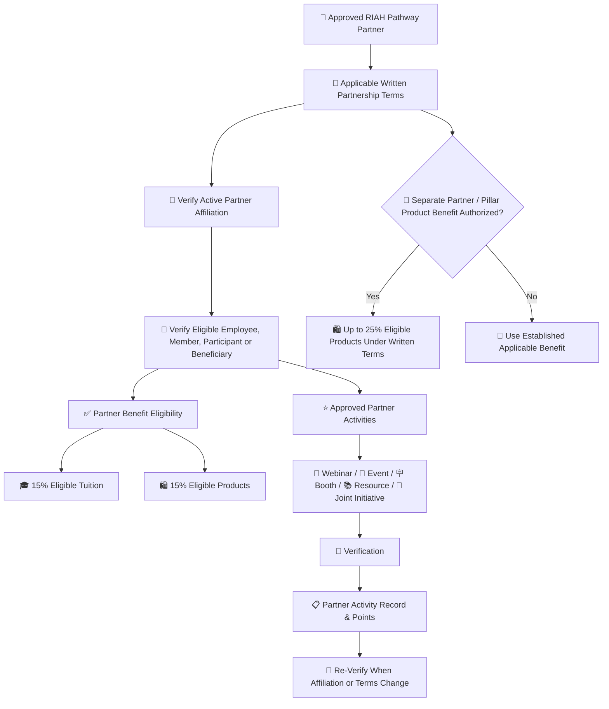
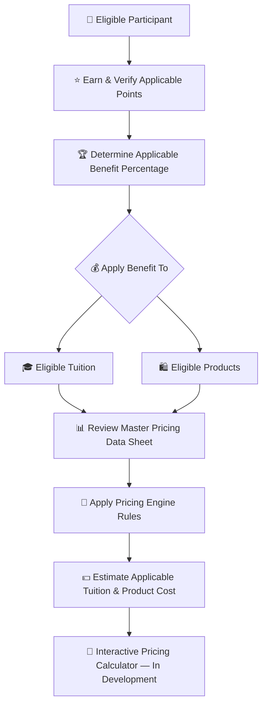

# 🤝 Partners

**Status: In Progress — Review and Finalization Required**

## 🤝 Category Key

| Emoji | Meaning |
|---|---|
| 🤝 | Partner |
| 👑 | Approved eligibility or contribution |
| ⭐ | Approved points |
| 🏆 | Completed milestone |
| 🎓 | Tuition benefit |
| 🛍️ | Product benefit |
| 🔗 | QR, referral, routing or attribution |
| 🎪 | Event, workshop or outreach |
| 🎥 | Webinar, presentation, video or media |
| 👀 | Under review |
| 🔄 | Revision or re-verification |
| ✅ | Approved or verified |
| ❌ | Rejected or ineligible |

## 🤝 End-to-End Category Flow



## ⚙️ Flow Metadata

```yaml
track: "Partner"
profile_category: "Partner"
status: "in-progress"
verification_required: true
points_require_approval: true
benefit_record_required: true
review_state:
  - pending
  - under-review
  - revision-if-required
  - approved
  - credited
```

## 💰 Tuition, Products & Pricing Resources

Contributor benefits in this documentation apply to **eligible tuition and eligible products** according to the rules for the applicable participant category.

| Pricing Resource | Purpose |
|---|---|
| 💰 [RIAH Pathway Master Pricing Data Sheet](../RIAH-Pathway-Master-Pricing-Data-Sheet.md) | Review current pathway tuition, program pricing, product pricing and other applicable pricing data. |
| 🧮 [RIAH Pathway Pricing Engine](../RIAH-Pathway-Pricing-Engine.md) | Review the pricing rules and calculation framework used to connect applicable pricing, eligibility, discounts and benefits. |

> **Pricing Calculator Development:** The interactive RIAH Pathway pricing calculator is still being developed. The intended calculator experience will allow eligible participants to apply their verified points and applicable benefit percentage to eligible tuition and product pricing so they can estimate what they may pay. Until that calculator is finalized, use the Master Pricing Data Sheet and Pricing Engine together with the applicable benefit rules in this documentation.



## 📑 Index

I. 🤝 Partner Benefit Program  
II. 👑 Eligibility  
III. ⭐ Partner Points  
IV. 🛡️ Verification  
V. 📋 Partner Record  
VI. 🏆 Benefit Rules

## I. 🤝 Partner Benefit Program

RIAH Pathway partners may qualify for tuition and product benefits through an approved partnership relationship.

Eligible Partner Employees: **15% eligible tuition + 15% eligible products** under applicable partner terms.

A separate approved Partner or Pillar Product Benefit may reach **up to 25% eligible products** where specifically authorized by applicable written partnership terms.

## II. 👑 Partner Eligibility

1. Be associated with an active approved RIAH Pathway partner.
2. Meet the applicable partnership agreement requirements.
3. Have partner affiliation verified.
4. Be an eligible employee, member, participant or approved beneficiary.
5. Maintain eligibility while using the benefit.
6. Complete required partner verification.
7. Follow applicable admissions and product requirements.
8. Follow applicable exclusions.
9. Do not transfer benefits to unauthorized individuals.
10. Do not combine benefits beyond applicable maximums.
11. Complete re-verification when the partnership relationship changes.
12. Use benefits during the applicable partnership eligibility period unless otherwise stated in writing.

## III. ⭐ Partner Points

| Partner Activity | Points |
|---|---:|
| Verified active partner affiliation | 100 |
| Complete partner orientation | 25 |
| Attend approved partner webinar | 10 |
| Participate in approved partner event | 25 |
| Staff approved partner booth | 50 |
| Participate as approved workshop presenter | 50 |
| Complete approved joint outreach | 25 |
| Develop approved partner resource | 25–50 |
| Complete approved joint initiative | 50–100 |
| Coordinate approved partner event | 75 |
| Complete major joint initiative | 100–250 |

Partner points document verified engagement. They support additional benefits only where applicable written partnership terms authorize those benefits and do not automatically increase every Partner Employee beyond the established Partner Employee benefit.

### 🤝 Partner Contribution Categories

| Category | Eligible Partner Contribution | Typical Points |
|---|---|---:|
| 🎓 Orientation | Complete approved partner orientation | 25 |
| 🎥 Webinar | Attend approved partner webinar | 10 |
| 🎪 Event Participation | Participate in approved RIAH partner event | 25 |
| 🪧 Booth | Staff approved partner booth or table | 50 |
| 🎤 Presentation | Serve as approved workshop or session presenter | 50 |
| 📣 Joint Outreach | Complete approved joint outreach assignment | 25 |
| 📚 Partner Resource | Develop approved partner resource | 25–50 |
| 🤝 Joint Initiative | Complete approved joint initiative | 50–100 |
| 🎪 Event Coordination | Coordinate approved partner event | 75 |
| 👑 Major Initiative | Complete major approved joint initiative | 100–250 |

### 🎯 Partner Point Scoring Standards

Partner activity points are based on verified scope, completion, meaningful participation, approved deliverables, event responsibility, documentation, implementation value and the applicable written partnership terms. A larger number of activities does not automatically create a larger benefit if the activities are duplicate, unverifiable, outside the partnership scope or already counted as one underlying initiative.

### 🔄 Partner Workflow

**🤝 Approved Partnership → 📄 Written Terms → 👑 Verify Affiliation → 👤 Verify Participant Eligibility → 🎓🛍️ Apply Established Benefit → ⭐ Record Approved Partner Activity → 👀 Verify Activity → 📋 Update Partner Record → 🔄 Re-verify When Terms or Affiliation Change**

### ❌ Ineligible Partner Claims

| Ineligible Activity | Result |
|---|---|
| ❌ Expired or inactive partner affiliation | No benefit |
| ❌ Unverified employee, member or participant claim | No benefit |
| ❌ Transferred benefit | No benefit |
| ❌ Duplicate activity claim | No additional points |
| ❌ Activity outside written partnership scope | No points unless separately approved |
| ❌ Fabricated event, resource or initiative | No points |
| ❌ Unauthorized use of RIAH branding | No points and subject to review |
| ❌ Attempt to exceed applicable benefit cap | Benefit remains at applicable cap |

### 🏆 Partner Examples

| Example | Result |
|---|---|
| 🤝 Verified eligible Partner Employee | 15% eligible tuition + 15% eligible products under applicable terms |
| 🤝 Partner with separately authorized Pillar Product Benefit | Up to 25% eligible products where the written terms authorize it |
| ⭐ Partner completes orientation + event + booth | 25 + 25 + 50 = 100 recorded Partner Activity Points |
| 👑 Partner coordinates event + major initiative | 75 + applicable 100–250 points after verification |
| 🔄 Affiliation changes | Benefit and activity record require re-verification |

Partner Activity Points document engagement and do not independently rewrite or supersede the written partnership benefit.

## IV. 🛡️ Verification

Verification may include active partner status, written partnership terms, employment/member/participant eligibility, event or initiative records, approved resources, RIAH review and re-verification when affiliation changes. Fraudulent, expired, transferred, duplicate, unauthorized or unverifiable claims are ineligible.

## V. 📋 Partner Record

Record Participant, Participant ID, Partner Organization, Partner Classification, Eligibility Basis, Verification Date, Activity ID, Activity, Points, Total Points, Applicable Tuition Benefit, Applicable Product Benefit, Written Agreement Reference, Approved By, Re-verification Date and Status.

## VI. 🏆 Benefit Rules

Partner benefits are tied to the applicable written partnership classification. Eligible Partner Employees receive **15% tuition and 15% products** under applicable terms. A separate Partner or Pillar Product Benefit may provide **up to 25% products where authorized**. Partner points do not independently override written partnership terms, eligibility periods, exclusions or benefit caps.
