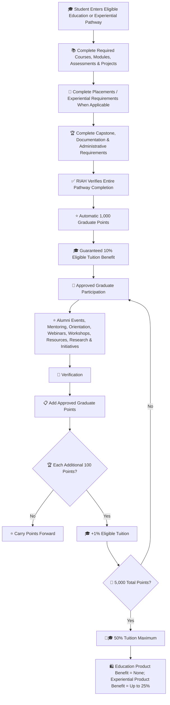

# 🎓 Students — Education & Experiential Pathway Graduates

**Status: In Progress — Review and Finalization Required**

## 🎓 Category Key

| Emoji | Meaning |
|---|---|
| 🎓 | Education & Experiential Graduate |
| 👑 | Approved eligibility or contribution |
| ⭐ | Approved points |
| 🏆 | Completed milestone |
| 🎓 | Tuition benefit |
| 🛍️ | Product benefit |
| 🔗 | QR, referral, routing or attribution |
| 🎪 | Event, workshop or outreach |
| 🎥 | Webinar, presentation, video or media |
| 👀 | Under review |
| 🔄 | Revision or re-verification |
| ✅ | Approved or verified |
| ❌ | Rejected or ineligible |

## 🎓 End-to-End Category Flow



## ⚙️ Flow Metadata

```yaml
track: "Education & Experiential Graduate"
profile_category: "Student / Graduate"
status: "in-progress"
verification_required: true
points_require_approval: true
benefit_record_required: true
review_state:
  - pending
  - under-review
  - revision-if-required
  - approved
  - credited
```

## 📑 Index

I. 🎓 Graduate Benefit  
II. 👑 Eligibility  
III. 🏆 Guaranteed 10% Completion Milestone  
IV. 🧮 Graduate Point Formula  
V. 🏆 10%–50% Milestones  
VI. ⭐ Graduate Point Activities  
VII. 🎓 Graduate Benefit Levels  
VIII. 🛡️ Verification  
IX. 📋 Graduate Record  
X. 🏆 Examples

## I. 🎓 Graduate Benefit

Students who successfully complete an eligible RIAH Pathway Education Pathway or Experiential Pathway receive a separate Graduate Tuition Benefit.

**Complete the entire eligible pathway = guaranteed 10% eligible tuition reduction.**

The Graduate Tuition Benefit may increase to **50% maximum eligible tuition**. **Education Graduates receive no Graduate Product Benefit. Experiential Graduates receive a product benefit from 10% at 1,000 points up to 25% at 2,500 approved Graduate Points.**

## II. 👑 Eligibility

1. Successfully complete the entire applicable pathway.
2. Satisfy academic or Experiential completion requirements.
3. Complete required courses, modules, assessments, projects, placements or Experiential requirements.
4. Complete applicable capstone requirements.
5. Complete required documentation.
6. Satisfy applicable administrative requirements.
7. Receive RIAH Pathway verification.
8. Be in good standing at completion.
9. Connect the benefit to the verified graduate record.
10. Verify additional milestone activities above 10%.
11. Graduate points cannot be purchased.
12. Graduate points cannot be transferred.
13. Education Graduates receive no Graduate Product Benefit. Experiential Graduates receive 10% eligible products at 1,000 points, plus 1% for each additional 100 approved Graduate Points, up to 25% at 2,500 points.
14. Maximum Graduate Tuition Benefit is 50%.

Qualifying pathways may include High School, GED, Associate's, Bachelor's, MBA, JD when applicable, Non-JD, designated approved Certification pathways, Experiential pathways and other designated qualifying RIAH educational pathways.

## III. 🏆 Guaranteed 10% Completion Milestone

| Achievement | Points | Tuition | Products |
|---|---:|---:|---:|
| Complete Entire Eligible Pathway | **1,000** | **10% GUARANTEED** | None |

## IV. 🧮 Graduate Point Formula

After the guaranteed 10%, **each additional 100 approved Graduate Points = +1% eligible tuition**. Maximum: **5,000 total Graduate Points = 50% tuition**. This consists of 1,000 guaranteed completion points plus up to 4,000 additional approved Graduate Points. For Experiential Graduates only, the same approved-point progression provides **10% eligible products at 1,000 points, +1% per additional 100 points, up to 25% at 2,500 points**.

## V. 🏆 Graduate 10%–50% Milestones

| Points | Tuition | Products |
|---:|---:|---:|
| 1000 | 10% GUARANTEED | None |
| 1100 | 11% | None |
| 1200 | 12% | None |
| 1300 | 13% | None |
| 1400 | 14% | None |
| 1500 | 15% | None |
| 1600 | 16% | None |
| 1700 | 17% | None |
| 1800 | 18% | None |
| 1900 | 19% | None |
| 2000 | 20% | None |
| 2100 | 21% | None |
| 2200 | 22% | None |
| 2300 | 23% | None |
| 2400 | 24% | None |
| 2500 | 25% | None |
| 2600 | 26% | None |
| 2700 | 27% | None |
| 2800 | 28% | None |
| 2900 | 29% | None |
| 3000 | 30% | None |
| 3100 | 31% | None |
| 3200 | 32% | None |
| 3300 | 33% | None |
| 3400 | 34% | None |
| 3500 | 35% | None |
| 3600 | 36% | None |
| 3700 | 37% | None |
| 3800 | 38% | None |
| 3900 | 39% | None |
| 4000 | 40% | None |
| 4100 | 41% | None |
| 4200 | 42% | None |
| 4300 | 43% | None |
| 4400 | 44% | None |
| 4500 | 45% | None |
| 4600 | 46% | None |
| 4700 | 47% | None |
| 4800 | 48% | None |
| 4900 | 49% | None |
| 5000 | 50% MAX | None |

## VI. ⭐ Graduate Point Activities

| Activity | Points |
|---|---:|
| Complete qualifying pathway | **1,000 guaranteed** |
| Attend approved alumni or RIAH event | 10 |
| Complete approved peer mentoring assignment | 25 |
| Support approved student orientation | 25 |
| Participate in approved educational webinar | 10 |
| Serve as approved webinar panelist | 25 |
| Serve as approved workshop presenter | 50 |
| Staff approved RIAH event | 25 |
| Staff approved education booth | 50 |
| Produce approved student resource | 25–50 |
| Support approved Experiential activity | 25–50 |
| Complete approved mentorship cycle | 50 |
| Complete approved cohort-support assignment | 25 |
| Support approved graduation activity | 25 |
| Complete approved research contribution | 25–75 |
| Complete approved documentation contribution | 25–75 |
| Complete approved educational content contribution | 25–75 |
| Complete substantial approved graduate contribution | 100 |
| Complete major approved graduate initiative | 150–250 |

All additional Graduate Points require verification.

## VII. 🎓 Graduate Benefit Levels

| Level | Points | Tuition |
|---|---:|---:|
| 🎓 Graduate | 1,000–1,900 | 10%–19% |
| 🎓🥉 Graduate Contributor | 2,000–2,900 | 20%–29% |
| 🎓🥈 Advanced Graduate Contributor | 3,000–3,900 | 30%–39% |
| 🎓🥇 Distinguished Graduate Contributor | 4,000–4,900 | 40%–49% |
| 👑🎓 Legacy Graduate Contributor | 5,000+ | 50% MAX |

## VIII. 🛡️ Verification

Completion and every additional point-bearing activity must be verified. Fabricated, duplicate, rejected, unauthorized or unverifiable activity receives no points. Pending activities do not change the benefit.

**Pending → Under Review → Revision or Verification if Required → Approved → Credited**

## IX. 📋 Graduate Record

Record Participant, Participant ID, Pathway, Completion Verification, Activity ID, Activity, Date, Base Completion Points, Added Points, Total Graduate Points, Milestone, Tuition Benefit, Product Benefit, Approved By, Next Milestone, Points Remaining and Status. Education Graduate Product Benefit remains N/A; Experiential Graduate Product Benefit follows the approved 10%–25% product points progression.

## X. 🏆 Examples

Education Graduate: 1,000 completion + 50 peer mentoring + 25 orientation support + 50 workshop + 50 educational resource + 100 approved initiative = **1,275 points = 12% tuition + 75 toward 13%; no product discount**.

Experiential Graduate: 1,000 completion + 50 Experiential support + 50 mentorship + 50 education booth + 50 research + 200 major initiative = **1,400 points = 14% tuition + 14% eligible products**.

Maximum Education Graduate: **5,000 points = 50% tuition maximum; no Graduate Product Benefit**.

Maximum Experiential Graduate: **2,500 points = 25% eligible products maximum; tuition may continue through 5,000 points = 50% tuition maximum**.
