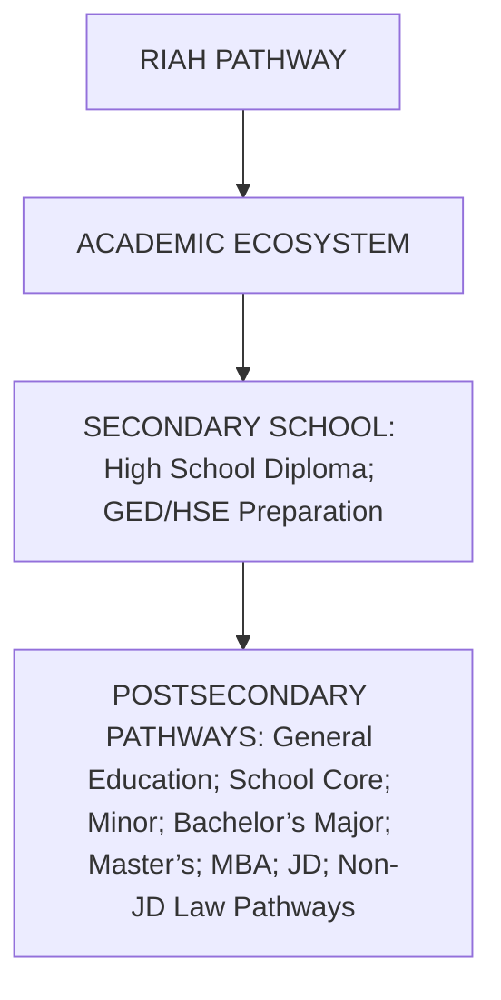
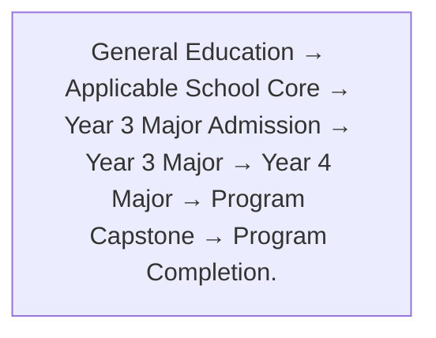
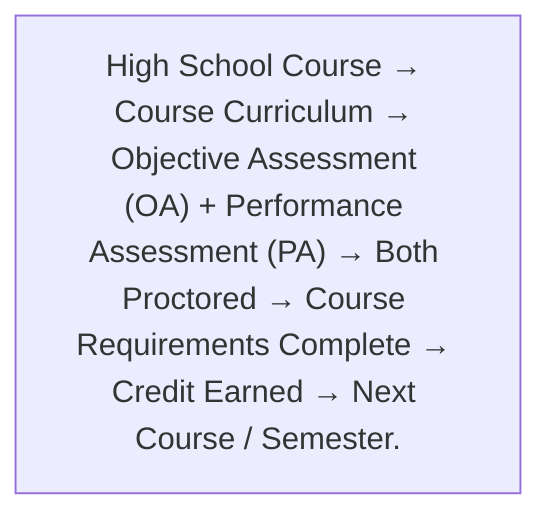
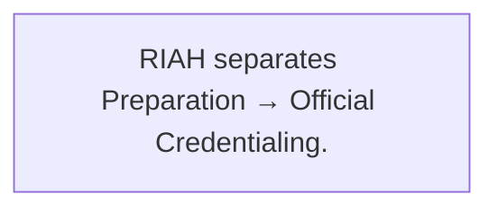
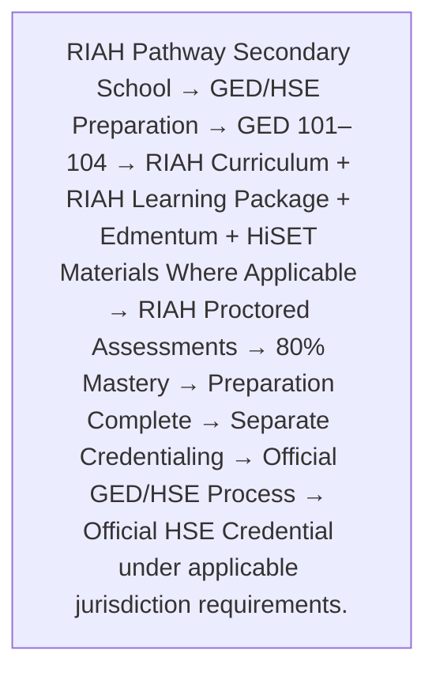
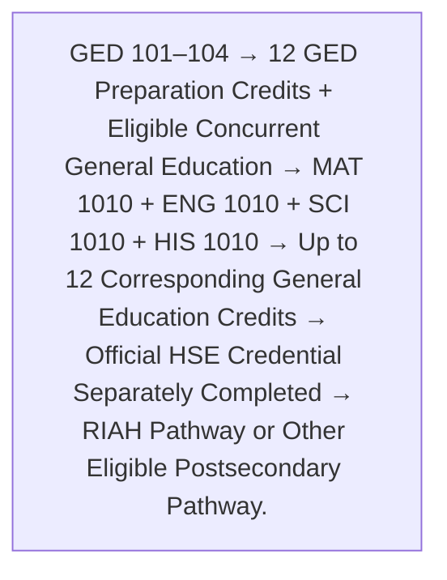
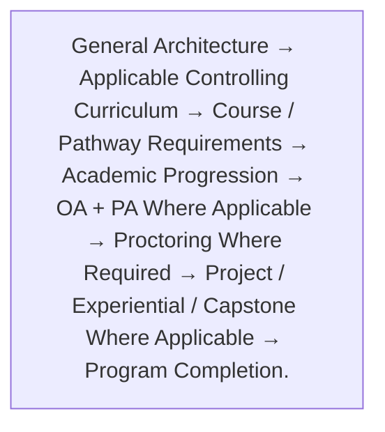

# 👑 RIAH PATHWAY — GENERAL CURRICULUM ARCHITECTURE, RULES & STANDARDS

## 🗝️ Curriculum Visual Key

| Symbol | Meaning |
| --- | --- |
| 👑 | RIAH Pathway / institutional structure |
| 🏫 | RIAH Pathway Secondary School |
| 🎓 | Degree / academic pathway |
| 📚 | General Education / academic curriculum |
| 🧭 | Curriculum progression / academic pathway structure |
| 🔁 | Transfer, placement, test-out & alternative credit |
| 📈 | Academic progression / acceleration |
| 🪜 | Developmental sequence / placement bands |
| 🏛️ | School structure / school-level architecture |
| 💼 | Major |
| 🌱 | Minor |
| ⭐ | School Core |
| ❤️ | Software / technology stack |
| 🛠️ | Project / Applied Build |
| 🏅 | Certification Review / Certification Track |
| 🎓 | Experiential / Capstone / Supervision |
| 🔗 | Multidisciplinary / integrated curriculum |
| 📐 | Curriculum architecture |
| 📋 | Policy / standard / approved rule |
| 🚪 | Admission / progression / completion gateway |
| ✅ | Required / included |
| ❌ | Not applicable / not included |
| 🎒 | Bachelor’s |
| 🔬 | Master’s |
| 📊 | MBA |
| ⚖️ | JD / Law |
| 🏛️⚖️ | Non-JD Law Pathway |
| 📜 | Certificate / credential-related curriculum |
| 📘 | GED/HSE Preparation |
| 🏅 | High School Diploma |
| 🌐 | Virtual delivery |
| 🧩 | State-specific curriculum component |

Display Rule — Detailed course-by-course curriculum remains in the applicable curriculum document. This General document establishes the controlling institutional structure, academic architecture, assessment model, progression rules, transfer/placement framework, secondary-school structure, and curriculum-wide standards.

# 📋 1. CURRICULUM PURPOSE AND EDUCATIONAL MODEL

| Item | Details |
| --- | --- |
| Curriculum Model | RIAH Pathway uses structured academic pathways with established General Education, School Core, major, minor, graduate, law, secondary-school, and GED/HSE preparation structures. |
| Fixed Curriculum | Academic pathways use established curriculum sequences rather than unrestricted student-selected coursework. |
| Course Identity | Established course numbers, names, credits, prerequisites, software, assessments, certification-review mappings, projects, experiential eligibility, capstone status, applied-build requirements, and supervision requirements remain attached to the applicable course unless the controlling curriculum expressly establishes a different structure. |
| Curriculum Integration | RIAH coursework may integrate academic education, professional software, certification-review curriculum, projects, experiential learning, applied builds, supervision, capstones, career preparation, and law/bar-related preparation where applicable. |

| Item | Details |
| --- | --- |
| High School Software Architecture | RIAH Pathway maps Edmentum instructional content/courseware to applicable High School Diploma courses while retaining RIAH curriculum as the controlling curriculum layer. RIAH may supplement software-provided content with additional RIAH curriculum, assessments, assignments, state components, and course-specific requirements. |
| Prerequisite Progression | Students progress through established prerequisite chains. The applicable prior foundational course must be completed or otherwise satisfied before progression where a prerequisite exists. |
| Assessment Architecture | Courses use Objective Assessments, Performance Assessments, projects, checkpoints, finals, applied builds, capstones, and/or supervision according to the applicable curriculum level and course design. |
| High School Assessment Architecture | Every RIAH Pathway High School Diploma course includes an Objective Assessment (OA) and Performance Assessment (PA). Both assessments are proctored for every high-school course. |
| Certification Architecture | Certification review may be embedded into an academic pathway or designated certification track. External certification examinations remain separate unless expressly required by an applicable external authority. |
| Experiential Architecture | Experiential participation follows the applicable pathway, eligibility, selection, placement, capacity, supervision, and timing requirements. |
| Secondary Education | RIAH Pathway Secondary School contains the Four-Year High School Diploma pathway and GED/HSE Preparation pathway. |
| Preparation vs. Credentialing | GED/HSE preparation provided by RIAH remains separate from official GED/HiSET examination and credential issuance. |
| Source of Course-Level Detail | Course-level curriculum remains controlled by the applicable Degree Curriculum, GED/HSE Curriculum, or High School Diploma Curriculum. |

# 🧭 2. RIAH PATHWAY ACADEMIC STRUCTURE

# 🏛️ 3. SCHOOL STRUCTURE

| Item | Details |
| --- | --- |
| RIAH Pathway School of Technology | 39-credit School Core — Computer Science, Cybersecurity, Data Analytics, Data Science, Software Development, Software Engineering, Project Management, Program Management, Information Systems. |
| RIAH Pathway School of Homeland Security | 30-credit School Core — Governance, Risk & Compliance, Intelligence, Physical Security, Private Investigations. |
| RIAH Pathway School of Law | Applicable Law Structure — Criminal Justice, JD, Non-JD Law Pathways. |
| RIAH Pathway School of Business | 30-credit School Core — Accounting, Entrepreneurship, Finance, Business Management, General MBA. |
| RIAH Pathway Secondary School | Secondary Curriculum — Four-Year High School Diploma, GED/HSE Preparation. |

# 💻 4. SCHOOL OF TECHNOLOGY STRUCTURE

| Item | Details |
| --- | --- |
| School of Technology Core | 39 Credit Hours. |
| The Technology Core contains the shared technology foundation completed before applicable upper-division Technology major progression. | — |

| Item | Details |
| --- | --- |
| Majors/Minors | Computer Science, Cybersecurity, Data Analytics, Data Science, Software Development, Software Engineering, Project Management, Program Management, Information Systems. Each has the applicable Minor, Bachelor’s Year 3, Bachelor’s Year 4, Master’s, and MBA structure in the controlling degree curriculum. |

## ❤️ School of Technology Core — Cengage MindTap Software Coverage
| RIAH Course | Course Name | Cengage MindTap |
| --- | --- | --- |
| TEC 2101 | Principles of Computer Science | ✓ |
| TEC 2102 | Web Development | ✓ |
| TEC 2103 | Principles of Cybersecurity | ✓ |
| TEC 2104 | Principles of Information Systems | ✓ |
| TEC 2105 | Operating Systems & Architecture | ✓ |
| TEC 2106 | Systems Analysis & Design | ✓ |
| TEC 2107 | Principles of Data Analytics | ✓ |
| TEC 2108 | Principles of Data Science | ✓ |
| TEC 2109 | Principles of Project Management | ✓ |
| TEC 2110 | Principles of Program Management | ✓ |
| TEC 2111 | Principles of Software Development | ✓ |
| TEC 2112 | Principles of Software Engineering | ✓ |
| TEC 2113 | Statistics | ✓ |
Applicable Technology programs may contain established professional certification-review tracks in addition to the general academic pathway.

# 🛡️ 5. SCHOOL OF HOMELAND SECURITY STRUCTURE

| Item | Details |
| --- | --- |
| Homeland Security School Core | 30 Credit Hours. |

| Item | Details |
| --- | --- |
| Majors/Minors | Governance, Risk & Compliance; Intelligence; Physical Security; Private Investigations. Each has the applicable Minor, Bachelor’s Year 3, Bachelor’s Year 4, Master’s, and MBA structure in the controlling degree curriculum. |

## ❤️ School of Homeland Security Core — Cengage MindTap Software Coverage
| RIAH Course | Course Name | Cengage MindTap |
| --- | --- | --- |
| HS 2101 | Foundations of Homeland Security | ✓ |
| HS 2102 | Homeland Security Law, Policy and Ethics | ✓ |
| HS 2103 ★ | Principles of Governance, Risk and Compliance | X |
| HS 2104 | Principles of Intelligence | ✓ |
| HS 2105 ★ | Principles of Physical Security | X |
| HS 2106 | Principles of Private Investigations | ✓ |
| HS 2107 | Emergency Management and Preparedness | ✓ |
| HS 2108 | Critical Infrastructure Protection | ✓ |
| HS 2109 ★ | Security Operations and Incident Management | X |
| HS 2110 | Homeland Security Strategy and Coordination | ✓ |
Applicable Homeland Security programs may contain established professional certification-review tracks in addition to the general academic pathway.

# ⚖️ 6. SCHOOL OF LAW STRUCTURE

| Item | Details |
| --- | --- |
| RIAH Pathway School of Law contains Criminal Justice, Juris Doctor | JD, and Non-JD State Law Pathways. |

| Item | Details |
| --- | --- |
| School of Law Core | 30 Credit Hours. |
## ❤️ School of Law Core — Cengage MindTap Software Coverage
| RIAH Course | Course Name | Cengage MindTap |
| --- | --- | --- |
| LAW 2001 | Introduction to Law & Legal Systems | ✓ |
| LAW 2002 | Principles of Criminal Justice | ✓ |
| LAW 2003 | Criminal Law | ✓ |
| LAW 2004 | Courts & Judicial Systems | ✓ |
| LAW 2005 | Policing & Law Enforcement | ✓ |
| LAW 2006 | Corrections & Rehabilitation | ✓ |
| LAW 2007 | Criminal Investigation & Evidence | ✓ |
| LAW 2008 | Criminology | ✓ |
| LAW 2009 | Ethics in Criminal Justice | ✓ |
| LAW 2010 | Criminal Justice Research & Analysis | ✓ |
| Item | Details |
| --- | --- |
| Criminal Justice: 15-credit established Minor; Bachelor’s Year 3 | 30 credits; Bachelor’s Year 4 — 30 credits; Master’s — 30 credits; MBA — 30 credits; applicable established certification-review tracks. |

| Item | Details |
| --- | --- |
| JD Curriculum | 96 Credit Hours. |
| 1L | 27 credits. |
| 2L | 24 credits. |
| 3L | 21 credits. |
| 4L | 24 credits. |
| Total | 96 credits. |

| Item | Details |
| --- | --- |
| JD Transfer Rule | Transfer credit may be accepted from an ABA-accredited law school for applicable 1L coursework only. Maximum JD Transfer: 27 credit hours, subject to equivalency review. |

| Item | Details |
| --- | --- |
| JD Experiential Structure | Apprentice → Intern → Associate → Senior Associate. The one-month internal RIAH experiential opportunity is guaranteed during 4L under the established JD structure. Timing remains based on applicable RIAH ecosystem needs. |

Non-JD Law Pathways:
| Maine | 1 Year |
| California | 4 Years |
| Washington | 4 Years |
| Vermont | 4 Years |
| New York | 3 Years |
| Virginia | 3 Years |
| West Virginia | 3 Years |

Each Non-JD pathway remains governed by its applicable state pathway requirements, prerequisite conditions, supervision requirements, experiential structure, curriculum sequence, and external legal/licensing requirements.

# 💼 7. SCHOOL OF BUSINESS STRUCTURE

| Item | Details |
| --- | --- |
| Business Core | 30 Credit Hours. |

| Item | Details |
| --- | --- |
| Majors/Minors | Accounting, Entrepreneurship, Finance, Business Management. Each has the applicable Minor, Bachelor’s Year 3, Bachelor’s Year 4, Master’s, and MBA structure. General MBA is a separate MBA pathway. |

## ❤️ School of Business Core — Cengage MindTap Software Coverage
| RIAH Course | Course Name | Cengage MindTap |
| --- | --- | --- |
| BUS 2101 | Principles of Financial Accounting | ✓ |
| BUS 2102 | Principles of Managerial Accounting | ✓ |
| BUS 2103 | Microeconomics | ✓ |
| BUS 2104 | Macroeconomics | ✓ |
| BUS 2105 | Statistics | ✓ |
| BUS 2106 | Marketing | ✓ |
| BUS 2107 | Principles of Management | ✓ |
| BUS 2108 | Operations Management | ✓ |
| BUS 2109 | Principles of Entrepreneurship | ✓ |
| BUS 2110 | Principles of Finance | ✓ |
Applicable Business programs may contain established professional certification-review tracks in addition to the general academic pathway.

# 📚 8. GENERAL EDUCATION — 30 CREDITS

General Education provides the academic foundation for applicable RIAH Pathway degree pathways.

| Item | Details |
| --- | --- |
| General Education Total | 30 Credit Hours. |

General Education includes College English, College Algebra, Oral Communications, Foreign Language, History, Philosophy, Psychology, Sociology, Art, and Science.

Detailed course tables remain in the controlling degree curriculum.

## ❤️ General Education — Edmentum Software Coverage

| RIAH Course | Course Name | Edmentum |
| --- | --- | --- |
| ENG 1010 | College English | ✓ |
| MAT 1010 | College Algebra | ✓ |
| COM 1010 | Oral Communications | ✓ |
| LAN 1010 | Foreign Language | ✓ |
| HIS 1010 | History | ✓ |
| PHI 1010 | Philosophy | X — RIAH Additional Curriculum |
| PSY 1010 | Psychology | ✓ |
| SOC 1010 | Sociology | ✓ |
| ART 1010 | Art | ✓ |
| SCI 1010 | Science | ✓ |

Philosophy Note — PHI 1010 remains part of the RIAH General Education curriculum. RIAH will provide and/or integrate additional Philosophy curriculum because Edmentum does not provide the mapped Philosophy coverage used for this structure.

# 🔁 9. GENERAL EDUCATION PLACEMENT / TEST-OUT STANDARD

Students may satisfy applicable General Education requirements through accepted transfer or alternative credit, or an applicable RIAH Placement/Test-Out Assessment.

| Item | Details |
| --- | --- |
| Passing Standard | 80%. |
| Proctoring | Required. |
| Maximum Attempts | 3. |
| Waiting Period | Minimum 24 hours between attempts. |
| Successful Test-Out | Applicable requirement is satisfied under the established RIAH placement-credit structure. |
| Unsuccessful Attempt | No academic penalty. |
| Three Unsuccessful Attempts | Student completes the applicable RIAH course. |

| Item | Details |
| --- | --- |
| Flow | Accepted Credit OR RIAH Proctored Test-Out → 80%+ → Requirement Satisfied. If not passed → up to 3 attempts, 24 hours between attempts → complete RIAH course if not passed. |

# 🪜 10. COLLEGE ENGLISH & COLLEGE ALGEBRA DEVELOPMENTAL PLACEMENT

College English and College Algebra function as foundational gateway courses. Where the applicable requirement is not already satisfied through accepted credit, placement determines whether the student satisfies the college-level requirement or enters developmental coursework.

| Item | Details |
| --- | --- |
| 80–100% | College Algebra / College English requirement satisfied. |
| 60–79% | Basic Math IV / Basic English IV. |
| 40–59% | Basic Math III / Basic English III. |
| 20–39% | Basic Math II / Basic English II. |
| 0–19% | Basic Math I / Basic English I. |

| Item | Details |
| --- | --- |
| Developmental flow | Basic I → Basic II → Basic III → Basic IV → College-Level Course. |
| Students begin at the level demonstrated by placement and do not repeat lower levels already demonstrated. | — |

# 🔁 11. TRANSFER & ALTERNATIVE CREDIT STRUCTURE

Applicable accepted sources may include RIAH Placement/Test-Out Assessment, ACT, SAT, AP, IB, CLEP, Sophia Learning, StraighterLine, accredited college transfer, and other applicable approved sources.

RIAH curriculum itself is not an external alternative-credit source. Sophia Learning and similar providers remain external alternative-credit sources rather than embedded RIAH curriculum.

Applicable outside credit must be submitted within the established pre-admission/admission transfer-evaluation window. Once the applicable enrollment cutoff has passed, additional outside transfer/alternative credit is not added unless a controlling pathway expressly provides otherwise.

Transfer evaluation remains subject to applicable equivalency review, applicable transfer maximum, applicable admissions transfer-credit evaluation process, applicable prerequisite requirements, and applicable program-specific restrictions.

Transfer Maximums:
| Associate’s | 30 Credits. |
| Bachelor’s | 60 Credits. |
| Minor | 6 Credits under the established minor transfer architecture. |
| MBA | 9 Credits. |
| JD | 27 Credits of applicable 1L coursework from an ABA-accredited law school. |
| Non-JD | Per applicable state pathway. |
| Master’s | Per applicable graduate pathway. |

# 🚪 12. ACADEMIC PROGRESSION GATEWAYS

Students do not progress into applicable Year 3 major coursework until the foundational requirements established for that major have been satisfied. Applicable School Core courses retain their established prerequisites.

# 🌱 13. MINOR ARCHITECTURE

Minors are predetermined academic sequences attached to the applicable discipline.

| Item | Details |
| --- | --- |
| Standard Minor Size | 15 credits in the current combined curriculum unless the applicable curriculum expressly establishes otherwise. |
| Typical Courses | 5 courses × 3 credits. |
| Course Selection | Predetermined. |
| Student-Selected Electives | No unrestricted electives. |
| OA | Required. |
| PA | Required. |
| Project | Generally reserved for the culminating applied-learning/capstone course under the current minor architecture. |
| Capstone | Culminating minor course where established. |
| Applied Build | Culminating course where established. |
| Supervision | Culminating course where established. |
| Experiential | According to the applicable minor/course record. |
| Transfer Maximum | 6 credits under the established minor transfer standard. |

| Item | Details |
| --- | --- |
| Minor flow | Minor Entry → Foundational Minor Course → Sequential Discipline Coursework → Applied Learning → Applied Learning Capstone → Minor Complete. |

The controlling course-level minor curriculum determines the exact prerequisite chain, software, certification review, project, capstone, applied-build, experiential, and supervision requirements.

# 🎒 14. BACHELOR’S ARCHITECTURE

The Bachelor’s pathway progresses through the applicable foundational curriculum into Year 3 and Year 4 major study.

| Item | Details |
| --- | --- |
| General Education | Applicable institutional foundation. |
| School Core | Applicable school-specific foundation. |
| Year 3 Major | 30 credits. |
| Year 4 Major | 30 credits. |
| Major Admission | Applicable Year 3 / Year 4 admission gateway. |
| Capstone | Final major course under the established Year 4 life-cycle sequence. |

# 🧠 15. YEAR 3 MAJOR ARCHITECTURE

Year 3 establishes the student's disciplinary major foundation.

| Item | Details |
| --- | --- |
| Course Level | 3xxx major coursework. |
| Standard Major Credits | 30 credits. |
| Major Identity | Home-major discipline. |
| OA | Required. |
| PA | Required under the current combined major curriculum. |
| Project | Not required unless the applicable course expressly establishes otherwise. |
| Certification Review | According to applicable major/track. |
| Certification Progression | According to applicable major/track. |
| Software | According to applicable discipline. |
| Experiential if Selected | According to applicable major/course. |
| One-Month Internal Experiential | According to applicable pathway. |
| Capstone | Generally not applicable until the designated culminating course/level. |
| Applied Build | Generally not applicable unless expressly established. |
| Supervision | Generally not applicable unless expressly established. |

| Item | Details |
| --- | --- |
| Year 3 flow | Year 3 Major → Disciplinary Foundation → OA + PA → Sequential Major Knowledge → Year 4 Admission. |

# 🛠️ 16. YEAR 4 MAJOR ARCHITECTURE

Year 4 moves the student from disciplinary preparation into a sequential applied professional life cycle.

| Item | Details |
| --- | --- |
| Course Level | 4xxx major coursework. |
| Credits | 30. |
| Courses | 10 × 3-credit courses. |
| OA | Required. |
| PA | Required. |
| Project | Required throughout the Year 4 life cycle. |
| Experiential if Selected | Required where established. |
| Certification Review | According to applicable general pathway or professional track. |
| Certification Progression | Carried sequentially where a certification-review track applies. |
| Capstone | Final 4110 course. |
| Applied Build | Final culminating course where established. |
| Supervision | Final culminating course where established. |

Year 4 Project Life Cycle:
| Problem / Venture Definition → Requirements → Analysis → Architecture / Design → Development / Implementation → Integration → Testing / Validation → Deployment / Operations → Optimization → Life-Cycle Integration → 4110 Capstone. | — |

Year 4 Assessment Structure:
| Each Year 4 Course → OA + PA + Project Phase → Next Life-Cycle Phase → Continuing Project → Final 4110 Course → Capstone + Applied Build + Supervision → Year 4 Complete. | — |

Professional certification-review tracks may overlay certification learning, milestones, exam modules, and final review deadlines across the same academic life cycle without replacing the underlying academic major.

# 🏅 17. CERTIFICATION-REVIEW ARCHITECTURE

RIAH distinguishes academic program completion from external professional certification.

| Item | Details |
| --- | --- |
| Academic Curriculum | Controlled by RIAH Pathway. |
| Certification Review | May be embedded in an applicable professional track. |
| External Certification | Separate from the RIAH academic credential unless an external authority independently requires otherwise. |
| Certification Progression | May progress across multiple sequential courses. |
| Exam Modules | Mapped to applicable courses where established. |
| Review Completion | May culminate in the final course. |
| Certification Track | Does not replace the underlying academic discipline. |
| General Pathway | May exist without certification review. |
| Track Pathway | Adds the established certification-review layer to the academic pathway. |

Examples of established review families appearing in the current combined curriculum include applicable Microsoft, cybersecurity, audit, risk, accounting, finance, fraud, tax, project-management, and program-management review tracks.

# 🔬 18. MASTER’S ARCHITECTURE

The current graduate major structure uses a sequential 30-credit Master’s curriculum.

| Item | Details |
| --- | --- |
| Credits | 30. |
| Courses | 10 × 3 credits. |
| Course Level | 5xxx. |
| Sequence | Sequential. |
| OA | Required. |
| PA | Required. |
| Project | Required. |
| Experiential if Selected | According to applicable curriculum. |
| Certification Review | General pathway or applicable professional track. |
| Capstone | Final 5110 course. |
| Applied Build | Final culminating course where established. |
| Supervision | Final culminating course where established. |

Master’s Life Cycle:
| Master’s Admission → 5101 → Graduate Analysis → Advanced Requirements → Architecture / Design → Advanced Implementation → Integration → Testing / Validation → Deployment / Operations → Monitoring / Evaluation → Optimization → 5110 Graduate Capstone. | — |

The project continues through the graduate life cycle where established. Professional certification-review tracks may reuse and advance the applicable certification-review framework at the graduate level.

# 📊 19. MBA ARCHITECTURE

The current MBA-in-major structure uses a sequential 30-credit management curriculum.

| Item | Details |
| --- | --- |
| Credits | 30. |
| Courses | 10 × 3 credits. |
| Course Level | 6xxx. |
| OA | Required. |
| PA | Required. |
| Project | Required. |
| Primary Orientation | Management, leadership, governance, strategy, organizational decision-making, operations, performance, and life-cycle management. |
| Experiential if Selected | According to applicable curriculum. |
| Certification Review | General pathway or applicable professional track. |
| Capstone | Final 6110 course. |
| Applied Build | Final culminating course where established. |
| Supervision | Final culminating course where established. |

MBA Management Life Cycle:
| MBA Admission → Management Venture / Strategic Definition → Organizational Requirements → Governance & Design → Program / Resource Management → Operations & Integration → Risk & Performance → Leadership & Execution → Analytics & Control → Strategic Optimization → 6110 Management Capstone. | — |

The MBA maintains the student's disciplinary context while moving the work to the management and leadership level.

# 📊 20. GENERAL MBA

| Item | Details |
| --- | --- |
| RIAH Pathway School of Business also maintains an established General MBA | 30 Credit Hours. The General MBA remains separate from MBA-in-major pathways and follows its own controlling curriculum. |

# 🎓 21. EXPERIENTIAL STRUCTURE

Experiential education is an integrated but separately governed component of applicable RIAH pathways.

| Item | Details |
| --- | --- |
| Eligibility | According to applicable program. |
| Selection | According to applicable pathway and available capacity. |
| Experiential if Selected | Appears in applicable course/program records. |
| Internal Experiential | Applicable pathways may include the established one-month internal RIAH experiential structure. |
| Placement | Based on applicable pathway, experience, placement requirements, supervision, and ecosystem needs. |
| Academic Curriculum | Experiential does not erase the student's academic course requirements. |
| Supervision | Applied where established by the applicable curriculum/pathway. |
| JD | One-month internal experiential guaranteed during 4L under the established JD structure. |
| Non-JD | Timing follows the applicable state pathway. |
| GED/HSE | Not treated as a degree-major experiential pathway. |
| High School | Governed separately through the secondary-school curriculum. |

# 🏫 22. RIAH PATHWAY SECONDARY SCHOOL

RIAH Pathway Secondary School contains two distinct secondary pathways:
| 1. Four-Year High School Diploma. | — |
| 2. GED/HSE Preparation. | — |

| Item | Details |
| --- | --- |
| High School Diploma | Grades 9–12 → 120 Credits → OA + PA Every Course → Both Proctored → RIAH Pathway High School Diploma. |
| GED/HSE Preparation | GED 101–104 → 12 Preparation Credits → Proctored Preparation → Separate Official HSE Credentialing. |

# 🏅 23. FOUR-YEAR HIGH SCHOOL DIPLOMA ARCHITECTURE

The RIAH Pathway High School Diploma is a fixed four-year Grades 9–12 secondary curriculum.

| Item | Details |
| --- | --- |
| Grades | 9–12. |
| Academic Years | 4. |
| Semesters | 8. |
| Semester Length | 6 months. |
| Courses Per Semester | 5. |
| Credits Per Course | 3 RIAH credits. |
| Credits Per Semester | 15. |
| Credits Per Year | 30. |
| Total Courses | 40 fixed courses. |
| Total Credits | 120 RIAH credits. |
| Unspecified Electives | None. |
| Objective Assessment | Required every course. |
| Performance Assessment | Required every course. |
| OA Proctoring | Required for every course. |
| PA Proctoring | Required for every course. |
| Course Assessment Model | OA + PA, proctored. |
| Senior Capstone | None. |
| High School Capstone | No capstone requirement. |
| Delivery | Virtual in participating jurisdictions. |
| State Components | Integrated where applicable. |
| Graduation Controls | Applied where applicable. |
| Completion | Complete required curriculum and applicable graduation requirements. |
| Credential | RIAH Pathway High School Diploma. |

## High School Assessment Architecture

Every course within the RIAH Pathway Four-Year High School Diploma curriculum follows the same core assessment architecture:

High School Assessment Rules:
| OA Required | Yes, every course. |
| PA Required | Yes, every course. |
| OA Proctored | Yes, every course. |
| PA Proctored | Yes, every course. |
| Unproctored OA | No. |
| Unproctored PA | No. |
| Capstone | No. |
| Senior Capstone | No. |
| Separate Capstone Project | No. |
| Completion Basis | Required curriculum + OA + PA + applicable graduation requirements. |
| Diploma | Awarded after completion of the established High School Diploma curriculum and applicable graduation requirements. |

High School Progression:
| Grade 9 | 30 credits — OA + PA proctored |
| → Grade 10 | 30 credits — OA + PA proctored |
| → Grade 11 | 30 credits — OA + PA proctored |
| → Grade 12 | 30 credits — OA + PA proctored |
| → 120 RIAH credits | — |
| → State-specific curriculum components where applicable | — |
| → State-specific graduation controls where applicable | — |
| → Graduation Audit | — |
| → No Capstone | — |
| → RIAH Pathway High School Diploma. | — |

High School Subject Architecture includes English Language Arts, Mathematics, Science, History, Geography, Government/Civics, Economics, Sociology, Psychology, Ethnic Studies, Financial Literacy, Personal Finance, World Language, Digital Literacy, Computer Science, Health, Physical Education, Fine Arts, and Oral Communication.

Detailed course tables and state-component mappings remain in the controlling High School Diploma Curriculum.

## ❤️ High School Instructional Software / Curriculum Content Layer

RIAH Pathway retains and controls its own High School Diploma curriculum. Edmentum is the primary instructional software and curriculum-content ecosystem mapped to the applicable RIAH high-school courses. RIAH may supplement, expand, reorganize, or add curriculum content, assignments, OA, PA, state components, and other course requirements.

| Software | RIAH Course | Course Name | Coverage |
| --- | --- | --- | --- |
| Edmentum | ENG 1101 | English I / Composition I | ✓ |
| Edmentum | MAT 1101 | Algebra I | ✓ |
| Edmentum | SCI 1101 | Geology | ✓ |
| Edmentum | GEO 1101 | World Geography | ✓ |
| Edmentum | TEC 1101 | Digital Literacy | ✓ |
| Edmentum | ENG 1102 | English II / Composition II | ✓ |
| Edmentum | MAT 1102 | Geometry | ✓ |
| Edmentum | SCI 1102 | Astronomy | ✓ |
| Edmentum | HIS 1101 | World History | ✓ |
| Edmentum | HLT 1101 | Health | ✓ |
| Edmentum | ENG 2101 | English III / American Literature | ✓ |
| Edmentum | MAT 2101 | Algebra II | ✓ |
| Edmentum | SCI 2101 | Earth Science | ✓ |
| Edmentum | HIS 2101 | Holocaust & Genocide Studies | ✓ |
| Edmentum | PED 2101 | Physical Education | ✓ |
| Edmentum | ENG 2102 | English IV / World Literature | ✓ |
| Edmentum | MAT 2102 | Trigonometry | ✓ |
| Edmentum | SCI 2102 | Environmental Science | ✓ |
| Edmentum | GOV 2101 | Government | ✓ |
| Edmentum | ART 2101 | Fine Arts | ✓ |
| Edmentum | MAT 3101 | Precalculus | ✓ |
| Edmentum | SCI 3101 | Biology | ✓ |
| Edmentum | HIS 3101 | American History | ✓ |
| Edmentum | FIN 3101 | Financial Literacy | ✓ |
| Edmentum | LAN 3101 | World Language I | ✓ |
| Edmentum | MAT 3102 | Calculus | ✓ |
| Edmentum | SCI 3102 | Chemistry | ✓ |
| Edmentum | HIS 3102 | State History | ✓ |
| Edmentum | LAN 3102 | World Language II | ✓ |
| Edmentum | PFI 3101 | Personal Finance | ✓ |
| Edmentum | MAT 4101 | Statistics | ✓ |
| Edmentum | SCI 4101 | Anatomy | ✓ |
| Edmentum | ECO 4101 | Economics | ✓ |
| Edmentum | CSC 4101 | Computer Science | ✓ |
| Edmentum | ETH 4101 | Ethnic Studies | ✓ |
| Edmentum | SCI 4102 | Physiology | ✓ |
| Edmentum | SCI 4103 | Physics | ✓ |
| Edmentum | SOC 4101 | Sociology | ✓ |
| Edmentum | PSY 4101 | Psychology | ✓ |
| Edmentum | COM 4101 | Oral Communication | ✓ |

✓ = Edmentum provides applicable instructional content/courseware mapped into the RIAH course. RIAH curriculum remains controlling for every course.

# 🧩 24. HIGH SCHOOL STATE-COMPONENT STRUCTURE

State-specific curriculum components are integrated into established RIAH courses rather than automatically creating separate courses.

Applicable components currently mapped within the controlling High School Diploma Curriculum include state-specific content involving Health, Physical Education, Government/Civics, Fine Arts, Financial Literacy, Personal Finance, State History, Computer Science, Holocaust/Genocide Studies, Ethnic Studies, and Health/Safety.

State-specific non-course graduation controls remain separate from the academic course structure and are handled through the applicable graduation audit.

State-specific components do not alter the general high-school assessment architecture. Each applicable high-school course continues to require Objective Assessment + Performance Assessment + Proctoring.

# 📘 25. GED/HSE PREPARATION ARCHITECTURE

RIAH Pathway Secondary School provides GED/HSE preparation.

RIAH controls its preparation curriculum, instruction, learning package, internal assessments, and academic requirements. Official GED/HiSET examination and credential issuance remain governed by the applicable official examination provider and jurisdiction.

| Item | Details |
| --- | --- |
| GED 101 | Mathematical Reasoning Preparation — 3 credits. |
| GED 102 | Reasoning Through Language Arts Preparation — 3 credits. |
| GED 103 | Science Preparation — 3 credits. |
| GED 104 | Social Studies Preparation — 3 credits. |
| Total | 12 credits. |

## ❤️ GED/HSE Preparation — Edmentum Software Coverage

| RIAH Course | Course Name | Edmentum |
| --- | --- | --- |
| GED 101 | Mathematical Reasoning Preparation | ✓ |
| GED 102 | Reasoning Through Language Arts Preparation | ✓ |
| GED 103 | Science Preparation | ✓ |
| GED 104 | Social Studies Preparation | ✓ |

✓ = Edmentum provides applicable instructional content/courseware that RIAH maps into its GED/HSE preparation curriculum. RIAH curriculum remains controlling.

Corresponding Concurrent General Education Opportunity:
| GED 101 → MAT 1010 | College Algebra. |
| GED 102 → ENG 1010 | College English. |
| GED 103 → SCI 1010 | Science. |
| GED 104 → HIS 1010 | History. |

Eligible GED/HSE students may pursue up to 12 corresponding General Education credits concurrently. GED Preparation credits and General Education credits remain academically separate.

# ❤️ 26. GED/HSE LEARNING ENVIRONMENT

GED/HSE students receive an integrated RIAH learning environment that may include RIAH Textbook, RIAH Workbook, RIAH Journal / Module Notebook, RIAH Planner / Curriculum Planner, RIAH Study Guide, RIAH Review Guide, RIAH LMS, RIAH Curriculum, RIAH Assignments, RIAH Assessments, Edmentum GED/HSE preparation content and courseware, official HiSET preparation materials where applicable, and applicable state add-on curriculum and resources.

Edmentum does not replace the RIAH curriculum. RIAH develops and controls its own academic curriculum and integrates applicable Edmentum and other approved educational resources into that curriculum.

# 📘 27. GED/HSE ACADEMIC FLOW

# 🧠 28. GED/HSE, HIGH SCHOOL & REGULAR COURSE ASSESSMENT STANDARD

| Item | Details |
| --- | --- |
| Placement/Test-Out | 3 maximum attempts — applicable RIAH standard — Proctored. |
| GED/HSE Preparation Checkpoint | Unlimited within semester — 80% — Proctored. |
| GED/HSE Preparation Final | Unlimited within semester — 80% — Proctored. |
| High School Objective Assessment (OA) | Per high-school assessment policy — applicable high-school standard — Proctored every course. |
| High School Performance Assessment (PA) | Per high-school assessment policy — applicable high-school standard — Proctored every course. |
| Regular Course Checkpoint | Unlimited within semester — 80% — Proctored. |
| Regular Course Final | Unlimited within semester — 80% — Proctored. |
| OA | Applicable course policy — applicable RIAH standard — Proctored. |

The three-attempt limitation applies to placement/test-out assessments, not regular course checkpoints and finals.

For the High School Diploma pathway, every course requires both an Objective Assessment and Performance Assessment, and both assessments are proctored.

# 📈 29. GED/HSE CONCURRENT ACCELERATION

# 📋 30. HIGH SCHOOL DIPLOMA VS. GED/HSE

High School Diploma:
| School | RIAH Pathway Secondary School. |
| Purpose | Traditional secondary education. |
| Structure | Grades 9–12. |
| RIAH Credits | 120. |
| Assessment | OA + PA in every course. |
| Proctoring | OA + PA proctored in every course. |
| Capstone | None. |
| Academic Record | Full high-school transcript. |
| GPA | Yes. |
| Concurrent Coursework | Available where applicable. |
| Credential | RIAH Pathway High School Diploma. |
| State Components | Where applicable. |
| Postsecondary Continuation | RIAH Pathway or other applicable institution. |

GED/HSE Preparation:
| School | RIAH Pathway Secondary School. |
| Purpose | Alternative HSE preparation. |
| Structure | GED/HSE preparation. |
| RIAH Credits | 12 GED Preparation credits. |
| Assessment | Preparation assessments. |
| Proctoring | RIAH preparation assessments proctored. |
| Capstone | None. |
| Academic Record | RIAH preparation record + separate official HSE record. |
| GPA | No traditional four-year high-school GPA. |
| Concurrent Coursework | Up to 12 corresponding GE credits. |
| Credential | Official HSE credential through applicable official process. |
| State Components | Where applicable. |
| Postsecondary Continuation | RIAH Pathway or another institution accepting the applicable HSE credential. |

# 📐 31. UNIVERSAL COURSE ARCHITECTURE

| Item | Details |
| --- | --- |
| The controlling degree curriculum uses course records that may include Course, School, Type, Course Name, Credit Hours, Prerequisite, Software Stack, PebblePad, Certification Review, Certification Progression and Learning, Exam Modules, Project, OA, PA, Experiential if Selected, Experiential | One Month Internal, Capstone, Applied Build, and Supervision. |

Not every field applies to every course.

High School Exception — Every High School Diploma course requires OA + PA, and both are proctored. High School Diploma courses do not use a capstone requirement.

1. ✅ = applicable/included.
2. ❌ = not applicable/not included.

| Item | Details |
| --- | --- |
| High School Software / Content Layer | Applicable High School Diploma courses use Edmentum as the mapped instructional software/content layer. The software content does not replace the RIAH curriculum; RIAH curriculum remains controlling and may add supplemental content, requirements, assignments, OA, PA, and other applicable course components. |
| The controlling course record determines all other requirements. | — |

# 📐 32. ASSESSMENT × PROJECT ARCHITECTURE BY LEVEL

| Item | Details |
| --- | --- |
| General Education | OA/PA/projects according to applicable course; generally no capstone, applied build, or supervision. |
| School Core | OA + PA; generally no project, capstone, applied build, or supervision. |
| Minor | OA + PA; culminating project/capstone/applied build/supervision where established. |
| Bachelor’s Year 3 | OA + PA; generally no project/capstone/applied build/supervision. |
| Bachelor’s Year 4 | OA + PA + sequential life-cycle project; final 4110 capstone; final applied build and supervision; PebblePad is used for the final cumulative project/capstone course. |
| Master’s | OA + PA + sequential graduate life-cycle project; final 5110 capstone; final applied build and supervision; PebblePad is used for the final cumulative project/capstone course. |
| MBA | OA + PA + sequential management life-cycle project; final 6110 capstone; final applied build and supervision; PebblePad is used for the final cumulative project/capstone course. |
| JD / Non-JD | Per controlling law curriculum. |
| High School Diploma | OA every course + PA every course; both proctored; no separate universal project requirement; no capstone; no applied build; no supervision. |
| GED/HSE Preparation | Proctored preparation assessments; no capstone, applied build, or supervision. |

# 📈 33. PREREQUISITE PROGRESSION STANDARD

| Item | Details |
| --- | --- |
| Progression | Foundation → Developing → Intermediate → Advanced → Applied / Integrative. |
| Prerequisite Definition | The applicable prior foundational course is identified. |
| Prerequisite Display | Course number and course title are used where established. |
| General Education Prerequisite | May be satisfied through applicable accepted credit or successful RIAH placement/test-out where permitted. |
| Sequential Curriculum | The preceding course is generally the prerequisite where the curriculum establishes a sequential life cycle. |
| Year 3 | Establishes disciplinary major knowledge and progression. |
| Year 4 | Applies disciplinary knowledge through a continuing project life cycle. |
| Master’s | Advances technical/professional knowledge through a graduate life cycle. |
| MBA | Advances management, strategy, governance, leadership, and organizational application through a management life cycle. |
| Minor | Follows its established prerequisite chain and culminates in the applicable applied-learning/capstone structure. |
| JD / Non-JD | Follows the controlling law prerequisite and state-pathway structure. |
| High School | Follows the established Grades 9–12 prerequisite sequence with proctored OA + PA for every course and no capstone requirement. |
| GED/HSE | Follows preparation, assessment, and official credentialing separation. |

# 📋 34. DUPLICATE CREDIT & COURSE IDENTITY STANDARD

A student does not receive duplicate academic credit for the same completed academic requirement merely because the same knowledge or skill is incorporated into another course, project, certification-review track, applied build, or multidisciplinary activity.

Integrated content does not automatically create a second separately awarded course. Course identity remains controlled by the applicable curriculum record.

# 🏅 35. PROFESSIONAL TRACK STANDARD

Applicable majors may contain a general academic pathway and/or one or more professional certification-review tracks.

A professional track may add Certification Review, Certification Progression, Exam Modules, Additional Software, Certification-specific project context, Review milestones, and Final review deadlines.

The professional track remains part of the applicable academic discipline. It does not convert the academic degree into the external professional certification.

# 🚪 36. PROGRAM COMPLETION STANDARD

Program completion requires satisfaction of the applicable required curriculum, credit requirement, prerequisites, OA requirements, PA requirements, proctoring requirements, projects where applicable, certification-review curriculum where attached to the selected pathway, experiential requirements where applicable, capstone where applicable, applied build where applicable, supervision where applicable, state-specific requirements, law-pathway requirements, secondary-school graduation requirements, and other controlling program requirements.

## High School Diploma Completion Standard

The High School Diploma pathway does not require a capstone.

High school students:
| 1. Complete the established Grades 9–12 curriculum. | — |
| 2. Complete the required Objective Assessment for every course. | — |
| 3. Complete the required Performance Assessment for every course. | — |
| 4. Complete the OA and PA under proctoring. | — |
| 5. Earn the required 120 RIAH credits. | — |
| 6. Complete applicable state-specific curriculum and graduation requirements. | — |
| 7. Complete the graduation audit. | — |
| 8. Receive the RIAH Pathway High School Diploma upon successful completion of the applicable requirements. | — |

| Item | Details |
| --- | --- |
| Flow | Complete High School Curriculum → OA + PA for Every Course → Every OA + PA Proctored → 120 RIAH Credits → Applicable State Requirements → Graduation Audit → No Capstone → RIAH Pathway High School Diploma. |

The applicable curriculum document remains controlling for course-level requirements.

# 🧭 37. COMPLETE RIAH ACADEMIC ARCHITECTURE FLOW

```mermaid
flowchart TD
    N0["RIAH Pathway"] --> N1
    N1["Secondary School"] --> N2
    N2["High School Diploma"] --> N3
    N3["Grades 9–12"] --> N4
    N4["40 Courses"] --> N5
    N5["120 Credits"] --> N6
    N6["OA Every Course"] --> N7
    N7["PA Every Course"] --> N8
    N8["OA + PA Proctored"] --> N9
    N9["No Capstone"] --> N10
    N10["State Components"] --> N11
    N11["Graduation Audit"] --> N12
    N12["GED/HSE Preparation"] --> N13
    N13["GED 101–104"] --> N14
    N14["12 Prep Credits"] --> N15
    N15["Concurrent GE up to 12 Credits"] --> N16
    N16["Proctored Assessments"] --> N17
    N17["Separate Official Credentialing"] --> N18
    N18["Postsecondary"] --> N19
    N19["General Education"] --> N20
    N20["School Core"] --> N21
    N21["Minor"] --> N22
    N22["Year 3 Major: OA + PA + Discipline Foundation"] --> N23
    N23["Year 4 Major: OA + PA + Sequential Project + 4110 Capstone + PebblePad"] --> N24
    N24["Master’s: 30 Credits + OA + PA + Graduate Project Life Cycle + 5110 Capstone + PebblePad"] --> N25
    N25["MBA: 30 Credits + OA + PA + Management Project Life Cycle + 6110 Capstone + PebblePad"] --> N26
    N26["Law: JD — 96 Credits + Non-JD State Pathways"]
```

High School Software Mapping — The High School Diploma curriculum also controls the course-level mapping of Edmentum instructional content to applicable RIAH high-school courses. Edmentum functions as the instructional software/content layer beneath the RIAH curriculum and does not replace RIAH course ownership or curriculum requirements.
# ✅ 38. CONTROLLING CURRICULUM STANDARD

This General document establishes the shared RIAH Pathway academic architecture.

The detailed curriculum remains controlled by:
| DegreeCurriculum.md | degree, major, minor, School Core, Master’s, MBA, JD, Non-JD, certification-track, software, assessment, project, capstone, applied-build, experiential, and supervision details. |
| GEDCurriculumDraft.md | GED/HSE preparation, concurrent General Education, assessment, proctoring, learning-package, Edmentum, HiSET, and preparation-versus-credentialing structure. |
| HSDiplomaDraft.md | Grades 9–12 curriculum, course prerequisites, 120-credit structure, state components, graduation controls, diploma availability, secondary-school progression, and the proctored OA + PA assessment requirement for every high-school course with no high-school capstone requirement. |

Where a detailed curriculum document expressly establishes a course-specific or pathway-specific requirement, that controlling detailed curriculum governs the applicable course or pathway.

# 👑 RIAH PATHWAY
| Item | Details |
| --- | --- |
| General Curriculum Architecture | Updated from the Final Curriculum Structure |