# 👑 RIAH PATHWAY SECONDARY SCHOOL
# GED / HSE CURRICULUM STRUCTURE

## 1. GED PROGRAM MODEL

| GED PROGRAM MODEL Component | GED PROGRAM MODEL Requirement |
| --- | --- |
| Preparation | RIAH Pathway Secondary School offers the GED/HSE Preparation pathway as part of its secondary education structure. |
| GED/HSE students receive a complete RIAH Pathway learning environment consisting of | GED/HSE students receive a complete RIAH Pathway learning environment consisting of: |

| Learning Resource | Curriculum Inclusion |
| --- | --- |
| RIAH Textbook | - **RIAH Textbook** |
| RIAH Workbook | - **RIAH Workbook** |
| RIAH Journal / Module Notebook | - **RIAH Journal / Module Notebook** |
| RIAH Planner / Curriculum Planner | - **RIAH Planner / Curriculum Planner** |
| RIAH Study Guide | - **RIAH Study Guide** |
| RIAH Review Guide | - **RIAH Review Guide** |
| RIAH LMS | - **RIAH LMS** |
| RIAH Curriculum | - **RIAH Curriculum** |
| RIAH Assignments | - **RIAH Assignments** |
| RIAH Assessments | - **RIAH Assessments** |
| Edmentum GED/HSE Preparation Content | - **Edmentum GED/HSE Preparation Content** |
| Edmentum Courseware | - **Edmentum Courseware** |
| Edmentum Mathematics Content and Assessment Resources | - **Edmentum Mathematics Content and Assessment Resources** |
| Official HiSET Preparation Materials where applicable | - **Official HiSET Preparation Materials where applicable** |
| State Add-On Curriculum and Resources, if applicable | - **State Add-On Curriculum and Resources, if applicable** |

### GED + HiSET Structure

| GED + HiSET Structure Component | GED + HiSET Structure Requirement |
| --- | --- |
| GED / HiSET | GED and HiSET preparation are part of the **RIAH Pathway Secondary School**. |
| RIAH separates | RIAH separates: |
| Preparation | **Preparation → Official Credentialing** |
| Preparation | RIAH provides the preparation curriculum. |
| GED / HiSET | Official GED/HiSET examination and credentialing follow the applicable examination provider and state/jurisdiction requirements. |
| GED / HiSET | HiSET preparation is incorporated where the applicable jurisdiction uses or permits HiSET. |

### Edmentum Structure

| Instructional Component | Curriculum Mapping / Authority |
| --- | --- |
| Edmentum | **Edmentum is the primary instructional software and curriculum-content ecosystem.** |
| Edmentum | **Edmentum provides the primary mapped instructional content for GED/HSE preparation and applicable General Education coursework.** |
| Edmentum | **Edmentum → GED/HSE Preparation Content + General Education Courseware + Applicable Assessment and Learning Resources** |
| Edmentum serves two primary purposes | Edmentum serves two primary purposes: |

### GED/HSE Preparation — Edmentum Software Coverage

| RIAH Course | Course Name | Edmentum |
| --- | --- | --- |
| **GED 101** | Mathematical Reasoning Preparation | **✓** |
| **GED 102** | Reasoning Through Language Arts Preparation | **✓** |
| **GED 103** | Science Preparation | **✓** |
| **GED 104** | Social Studies Preparation | **✓** |

| Instructional Component | Curriculum Mapping / Authority |
| --- | --- |
| ✓ | **✓ = Edmentum provides applicable instructional content/courseware that RIAH maps into its curriculum. RIAH curriculum remains controlling.** |

### Purpose 1 — GED / HiSET Preparation

| Course Code | Course / Credit Alignment |
| --- | --- |
| GED 101 | - **GED 101 — Mathematical Reasoning Preparation** |
| GED 102 | - **GED 102 — Reasoning Through Language Arts Preparation** |
| GED 103 | - **GED 103 — Science Preparation** |
| GED 104 | - **GED 104 — Social Studies Preparation** |

| Purpose 1 — GED / HiSET Preparation Component | Purpose 1 — GED / HiSET Preparation Requirement |
| --- | --- |
| GED / HiSET | For students following a HiSET pathway, RIAH incorporates applicable HiSET preparation materials into the corresponding RIAH courses. |

### Purpose 2 — General Education Placement/Test-Out + Coursework

| Assessment Component | Assessment Requirement |
| --- | --- |
| Edmentum and applicable Edmentum resources support | Edmentum and applicable Edmentum resources support: |

| Course Code | Course / Credit Alignment |
| --- | --- |
| ENG 1010 | - **ENG 1010 — College English** |
| MAT 1010 | - **MAT 1010 — College Algebra** |
| COM 1010 | - **COM 1010 — Oral Communications** |
| LAN 1010 | - **LAN 1010 — Foreign Language** |
| HIS 1010 | - **HIS 1010 — History** |
| PHI 1010 | - **PHI 1010 — Philosophy** |
| PSY 1010 | - **PSY 1010 — Psychology** |
| SOC 1010 | - **SOC 1010 — Sociology** |
| ART 1010 | - **ART 1010 — Art** |
| SCI 1010 | - **SCI 1010 — Science** |

| Assessment Component | Assessment Requirement |
| --- | --- |
| Purpose 2 — General Education Placement/Test-Out + Coursework | The placement/test-out determination remains a **RIAH Pathway institutional determination**. |

### General Education — Edmentum Software Coverage

| RIAH Course | Course Name | Edmentum |
| --- | --- | --- |
| **ENG 1010** | College English | **✓** |
| **MAT 1010** | College Algebra | **✓** |
| **COM 1010** | Oral Communications | **✓** |
| **LAN 1010** | Foreign Language | **✓** |
| **HIS 1010** | History | **✓** |
| **PHI 1010** | Philosophy | **X — RIAH Additional Curriculum** |
| **PSY 1010** | Psychology | **✓** |
| **SOC 1010** | Sociology | **✓** |
| **ART 1010** | Art | **✓** |
| **SCI 1010** | Science | **✓** |

| Instructional Component | Curriculum Mapping / Authority |
| --- | --- |
| Edmentum | **Philosophy Note — PHI 1010 remains part of the RIAH General Education curriculum. RIAH will provide and/or integrate additional Philosophy curriculum because Edmentum does not provide the mapped Philosophy coverage used for this structure.** |

### RIAH Curriculum + Edmentum Integration

| Instructional Component | Curriculum Mapping / Authority |
| --- | --- |
| Edmentum | Edmentum does **not replace the RIAH curriculum**. |
| RIAH develops and controls its own | RIAH develops and controls its own: |

| Learning Resource | Curriculum Inclusion |
| --- | --- |
| Curriculum | - Curriculum |
| Textbooks | - Textbooks |
| Workbooks | - Workbooks |
| Journals / Module Notebooks | - Journals / Module Notebooks |
| Curriculum Planners | - Curriculum Planners |
| Study Guides | - Study Guides |
| Review Guides | - Review Guides |
| Assignments | - Assignments |
| Projects | - Projects |
| Assessments | - Assessments |
| Checkpoints | - Checkpoints |
| Final examinations | - Final examinations |
| Academic requirements | - Academic requirements |

| Instructional Component | Curriculum Mapping / Authority |
| --- | --- |
| Edmentum | Edmentum resources are integrated into the RIAH curriculum. |

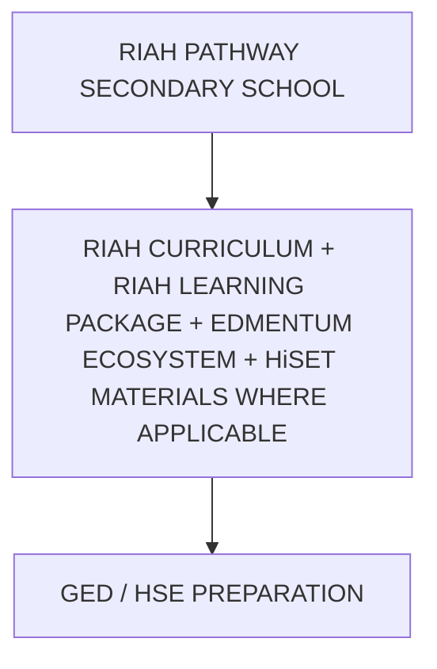
```mermaid
flowchart TD
    N0["RIAH PATHWAY SECONDARY SCHOOL"]
    N1["RIAH CURRICULUM + RIAH LEARNING PACKAGE + EDMENTUM ECOSYSTEM + HiSET MATERIALS WHERE APPLICABLE"]
    N2["GED / HSE PREPARATION"]
    N0 --> N1
    N1 --> N2
```

---

# 2. GED / HiSET PREPARATION + GENERAL EDUCATION STRUCTURE

## Component 1 — GED / HiSET Preparation

| RIAH Course | Primary Structure | Credits |
| --- | --- | --- |
| **GED 101 — Mathematical Reasoning Preparation** | Edmentum Mathematical Reasoning content + applicable HiSET Mathematics materials | **3** |
| **GED 102 — Reasoning Through Language Arts Preparation** | Edmentum Reasoning Through Language Arts content + applicable HiSET Reading/Writing materials | **3** |
| **GED 103 — Science Preparation** | Edmentum Science content + applicable HiSET Science materials | **3** |
| **GED 104 — Social Studies Preparation** | Edmentum Social Studies content + applicable HiSET Social Studies materials | **3** |
| **TOTAL** |  | **12** |

## Component 2 — Concurrent General Education

| Component 2 — Concurrent General Education Component | Component 2 — Concurrent General Education Requirement |
| --- | --- |
| Eligible GED/HSE students may concurrently pursue the four directly corresponding RIAH Pathway General Education courses | Eligible GED/HSE students may concurrently pursue the four directly corresponding RIAH Pathway General Education courses: |

| Course Code | Course / Credit Alignment |
| --- | --- |
| GED 101 | - **GED 101 → MAT 1010 — College Algebra — 3 Credits** |
| GED 102 | - **GED 102 → ENG 1010 — College English — 3 Credits** |
| GED 103 | - **GED 103 → SCI 1010 — Science — 3 Credits** |
| GED 104 | - **GED 104 → HIS 1010 — History — 3 Credits** |

| Component 2 — Concurrent General Education Component | Component 2 — Concurrent General Education Requirement |
| --- | --- |
| Total Concurrent General Education Opportunity | **Total Concurrent General Education Opportunity: 12 Credits** |
| General Education | The GED Preparation credits and General Education credits remain academically separate. |

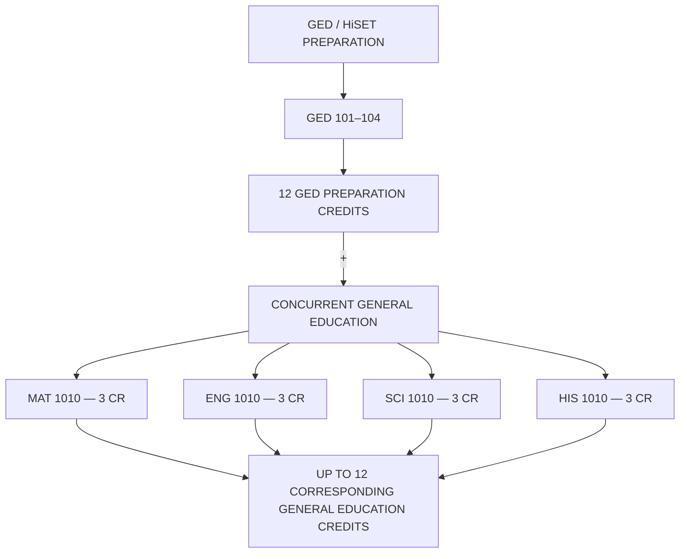
```mermaid
flowchart TD
    N0["GED / HiSET PREPARATION"]
    N1["GED 101–104"]
    N2["12 GED PREPARATION CREDITS"]
    N3["CONCURRENT GENERAL EDUCATION"]
    N4["MAT 1010 — 3 CR"]
    N5["ENG 1010 — 3 CR"]
    N6["SCI 1010 — 3 CR"]
    N7["HIS 1010 — 3 CR"]
    N8["UP TO 12 CORRESPONDING GENERAL EDUCATION CREDITS"]
    N0 --> N1
    N1 --> N2
    N2 -->|+| N3
    N3 --> N4
    N3 --> N5
    N3 --> N6
    N3 --> N7
    N4 --> N8
    N5 --> N8
    N6 --> N8
    N7 --> N8
```

---

# 3. GED/HSE STUDENT LEARNING PACKAGE

| Component | Structure |
| --- | --- |
| **RIAH Textbook** | In-depth instructional foundation |
| **RIAH Workbook** | Practice and application |
| **RIAH Journal / Module Notebook** | Problems, calculations, notes, written responses, and module work |
| **RIAH Planner / Curriculum Planner** | Complete academic roadmap |
| **RIAH Study Guide** | Concepts, objectives, terminology, formulas, and skills |
| **RIAH Review Guide** | Checkpoint, final, GED/HiSET, and test-out preparation |
| **Edmentum GED/HSE Preparation Content** | GED/HSE preparation instructional content |
| **Edmentum Mathematics Resources** | Mathematics preparation, practice, assessment, and learning support |
| **Edmentum English / Language Arts Resources** | English and language-arts preparation and support |
| **Official HiSET Preparation Materials** | Incorporated where applicable |
| **Edmentum Courseware** | General Education instructional content and courseware environment |
| **State Add-On Learning Package** | Applicable state-specific requirements |

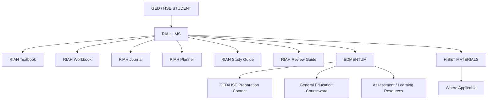
```mermaid
flowchart TD
    N0["GED / HSE STUDENT"]
    N1["RIAH LMS"]
    N2["RIAH Textbook"]
    N3["RIAH Workbook"]
    N4["RIAH Journal"]
    N5["RIAH Planner"]
    N6["RIAH Study Guide"]
    N7["RIAH Review Guide"]
    N8["EDMENTUM"]
    N9["GED/HSE Preparation Content"]
    N10["General Education Courseware"]
    N11["Assessment / Learning Resources"]
    N12["HiSET MATERIALS"]
    N13["Where Applicable"]
    N0 --> N1
    N1 --> N2
    N1 --> N3
    N1 --> N4
    N1 --> N5
    N1 --> N6
    N1 --> N7
    N1 --> N8
    N1 --> N12
    N8 --> N9
    N8 --> N10
    N8 --> N11
    N12 --> N13
```

---

# 4. GED / HiSET ACADEMIC FLOW HIERARCHY

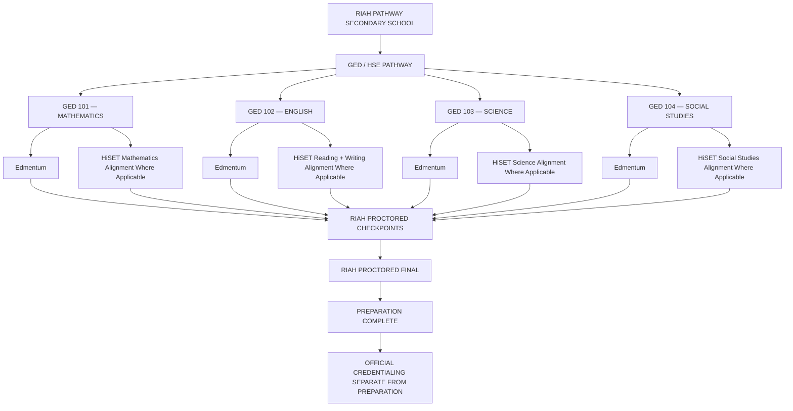
```mermaid
flowchart TD
    N0["RIAH PATHWAY SECONDARY SCHOOL"]
    N1["GED / HSE PATHWAY"]
    N2["GED 101 — MATHEMATICS"]
    N3["GED 102 — ENGLISH"]
    N4["GED 103 — SCIENCE"]
    N5["GED 104 — SOCIAL STUDIES"]
    N6["Edmentum"]
    N7["HiSET Mathematics Alignment Where Applicable"]
    N8["Edmentum"]
    N9["HiSET Reading + Writing Alignment Where Applicable"]
    N10["Edmentum"]
    N11["HiSET Science Alignment Where Applicable"]
    N12["Edmentum"]
    N13["HiSET Social Studies Alignment Where Applicable"]
    N14["RIAH PROCTORED CHECKPOINTS"]
    N15["RIAH PROCTORED FINAL"]
    N16["PREPARATION COMPLETE"]
    N17["OFFICIAL CREDENTIALING SEPARATE FROM PREPARATION"]
    N0 --> N1
    N1 --> N2
    N1 --> N3
    N1 --> N4
    N1 --> N5
    N2 --> N6
    N2 --> N7
    N3 --> N8
    N3 --> N9
    N4 --> N10
    N4 --> N11
    N5 --> N12
    N5 --> N13
    N6 --> N14
    N7 --> N14
    N8 --> N14
    N9 --> N14
    N10 --> N14
    N11 --> N14
    N12 --> N14
    N13 --> N14
    N14 --> N15
    N15 --> N16
    N16 --> N17
```

---

# 5. GED / HiSET ACADEMIC PROGRESSION

## GED 101 — Mathematical Reasoning Preparation

| GED 101 — Mathematical Reasoning Preparation Component | GED 101 — Mathematical Reasoning Preparation Requirement |
| --- | --- |
| Edmentum | **Edmentum Diagnostic / Preparation Assessment → 80%+ Test-Out OR Developmental/Remedial Mathematics → RIAH Curriculum → Proctored Checkpoint → Proctored Final → GED 101 Complete** |

## GED 102 — Reasoning Through Language Arts Preparation

| GED 102 — Reasoning Through Language Arts Preparation Component | GED 102 — Reasoning Through Language Arts Preparation Requirement |
| --- | --- |
| Edmentum | **Edmentum Diagnostic / Preparation Assessment → 80%+ Test-Out OR Developmental English → RIAH Curriculum → Proctored Checkpoint → Proctored Final → GED 102 Complete** |

## GED 103 — Science Preparation

| GED 103 — Science Preparation Component | GED 103 — Science Preparation Requirement |
| --- | --- |
| Edmentum | **Edmentum Science Pre-Assessment → 80%+ Test-Out OR Science Preparation → RIAH Curriculum → Proctored Checkpoint → Proctored Final → GED 103 Complete** |

## GED 104 — Social Studies Preparation

| GED 104 — Social Studies Preparation Component | GED 104 — Social Studies Preparation Requirement |
| --- | --- |
| Edmentum | **Edmentum Social Studies Pre-Assessment → 80%+ Test-Out OR Social Studies Preparation → RIAH Curriculum → Proctored Checkpoint → Proctored Final → GED 104 Complete** |

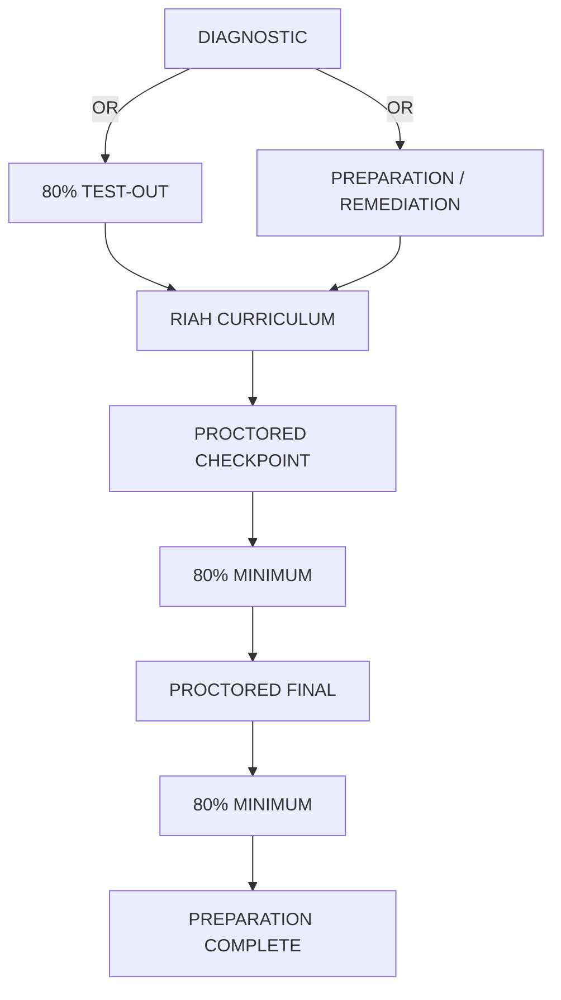
```mermaid
flowchart TD
    N0["DIAGNOSTIC"]
    N1["80% TEST-OUT"]
    N2["PREPARATION / REMEDIATION"]
    N3["RIAH CURRICULUM"]
    N4["PROCTORED CHECKPOINT"]
    N5["80% MINIMUM"]
    N6["PROCTORED FINAL"]
    N7["80% MINIMUM"]
    N8["PREPARATION COMPLETE"]
    N0 -->|OR| N1
    N0 -->|OR| N2
    N1 --> N3
    N2 --> N3
    N3 --> N4
    N4 --> N5
    N5 --> N6
    N6 --> N7
    N7 --> N8
```

---

# 6. GED / HiSET ASSESSMENT + PROCTORING MODEL

| Assessment | Standard | Attempts | Proctoring |
| --- | --- | --- | --- |
| **GED Preparation Diagnostic/Test-Out** | **80%** | Applicable preparation policy | **Proctored** |
| **GED Preparation Checkpoint / Midterm** | **80%** | **Unlimited within semester** | **Proctored** |
| **GED Preparation Final** | **80%** | **Unlimited within semester** | **Proctored** |
| **General Education Placement/Test-Out** | RIAH standard | **3 maximum** | **Proctored** |
| **Regular Course Checkpoint / Midterm** | **80%** | **Unlimited within semester** | **Proctored** |
| **Regular Course Final** | **80%** | **Unlimited within semester** | **Proctored** |
| **OA / Objective Assessment** | Applicable RIAH standard | Applicable course policy | **Proctored** |

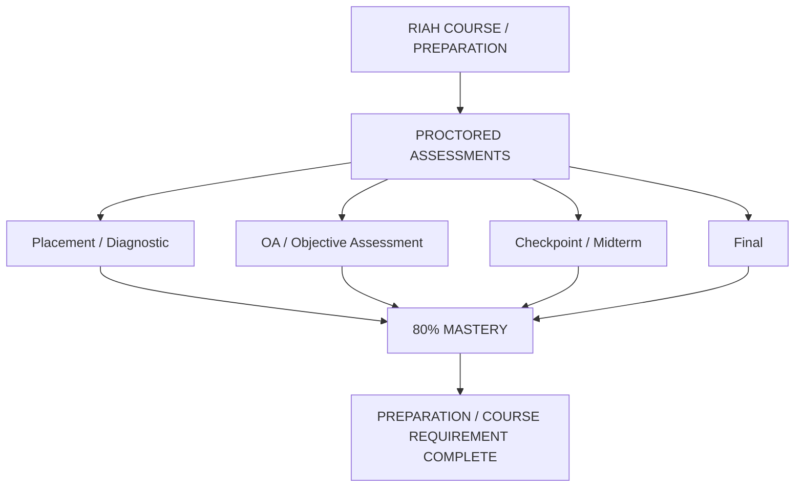
```mermaid
flowchart TD
    N0["RIAH COURSE / PREPARATION"]
    N1["PROCTORED ASSESSMENTS"]
    N2["Placement / Diagnostic"]
    N3["OA / Objective Assessment"]
    N4["Checkpoint / Midterm"]
    N5["Final"]
    N6["80% MASTERY"]
    N7["PREPARATION / COURSE REQUIREMENT COMPLETE"]
    N0 --> N1
    N1 --> N2
    N1 --> N3
    N1 --> N4
    N1 --> N5
    N2 --> N6
    N3 --> N6
    N4 --> N6
    N5 --> N6
    N6 --> N7
```

---

# 7. GENERAL EDUCATION PLACEMENT / TEST-OUT SYSTEM

| General Education Course | Primary Software |
| --- | --- |
| **ENG 1010 — College English** | Edmentum |
| **MAT 1010 — College Algebra** | Edmentum |
| **COM 1010 — Oral Communications** | Edmentum |
| **LAN 1010 — Foreign Language** | Edmentum |
| **HIS 1010 — History** | Edmentum |
| **PHI 1010 — Philosophy** | RIAH Additional Curriculum — Edmentum does not provide the controlling Philosophy content |
| **PSY 1010 — Psychology** | Edmentum |
| **SOC 1010 — Sociology** | Edmentum |
| **ART 1010 — Art** | Edmentum |
| **SCI 1010 — Science** | Edmentum |

### Placement/Test-Out Policy

| Assessment Rule | Assessment Requirement |
| --- | --- |
| Maximum 3 attempts | - **Maximum 3 attempts** |
| Minimum 24 hours between attempts | - **Minimum 24 hours between attempts** |
| Proctored | - **Proctored** |
| No academic penalty for unsuccessful test-out | - **No academic penalty for unsuccessful test-out** |
| After 3 unsuccessful attempts: complete the RIAH course | - **After 3 unsuccessful attempts: complete the RIAH course** |

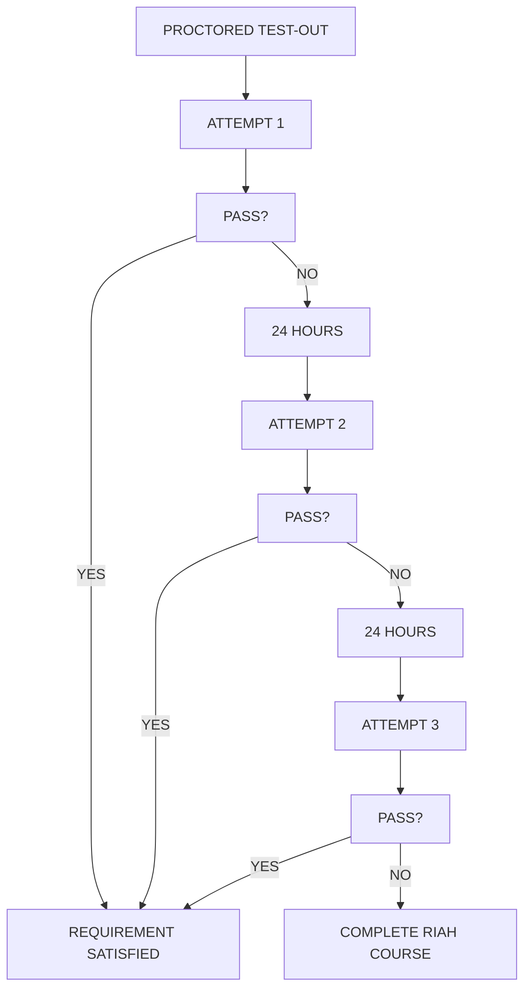
```mermaid
flowchart TD
    N0["PROCTORED TEST-OUT"]
    N1["ATTEMPT 1"]
    N2["PASS?"]
    N3["24 HOURS"]
    N4["ATTEMPT 2"]
    N5["PASS?"]
    N6["24 HOURS"]
    N7["ATTEMPT 3"]
    N8["PASS?"]
    N9["COMPLETE RIAH COURSE"]
    N10["REQUIREMENT SATISFIED"]
    N0 --> N1
    N1 --> N2
    N2 -->|YES| N10
    N2 -->|NO| N3
    N3 --> N4
    N4 --> N5
    N5 -->|YES| N10
    N5 -->|NO| N6
    N6 --> N7
    N7 --> N8
    N8 -->|YES| N10
    N8 -->|NO| N9
```

---

# 8. GED + GENERAL EDUCATION CONCURRENT ACCELERATION

| GED Preparation | GED CR | Corresponding General Education | GE CR |
| --- | --- | --- | --- |
| **GED 101 — Mathematical Reasoning** | **3** | **MAT 1010 — College Algebra** | **3** |
| **GED 102 — RLA** | **3** | **ENG 1010 — College English** | **3** |
| **GED 103 — Science** | **3** | **SCI 1010 — Science** | **3** |
| **GED 104 — Social Studies** | **3** | **HIS 1010 — History** | **3** |
| **TOTAL** | **12** | **TOTAL** | **12** |

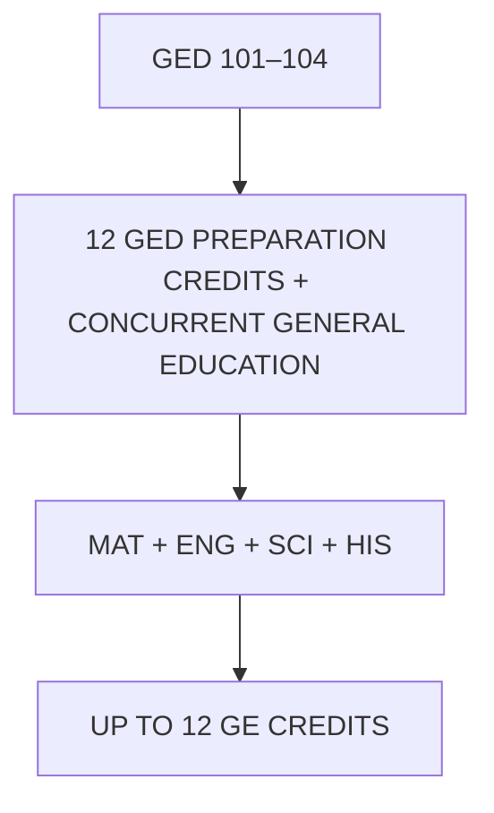
```mermaid
flowchart TD
    N0["GED 101–104"]
    N1["12 GED PREPARATION CREDITS + CONCURRENT GENERAL EDUCATION"]
    N2["MAT + ENG + SCI + HIS"]
    N3["UP TO 12 GE CREDITS"]
    N0 --> N1
    N1 --> N2
    N2 --> N3
```

---

# 9. EDMENTUM + HiSET PREPARATION MAPPING

| RIAH Course | Edmentum | HiSET Add-On Where Applicable | RIAH |
| --- | --- | --- | --- |
| **GED 101** | Mathematical Reasoning Preparation Content | Mathematics | Complete RIAH learning package + proctored assessments |
| **GED 102** | Reasoning Through Language Arts Preparation Content | Reading + Writing | Complete RIAH learning package + proctored assessments |
| **GED 103** | Science Preparation Content | Science | Complete RIAH learning package + proctored assessments |
| **GED 104** | Social Studies Preparation Content | Social Studies | Complete RIAH learning package + proctored assessments |

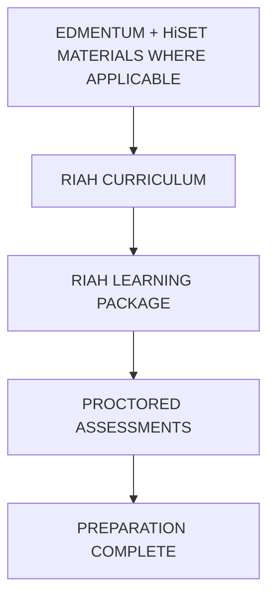
```mermaid
flowchart TD
    N0["EDMENTUM + HiSET MATERIALS WHERE APPLICABLE"]
    N1["RIAH CURRICULUM"]
    N2["RIAH LEARNING PACKAGE"]
    N3["PROCTORED ASSESSMENTS"]
    N4["PREPARATION COMPLETE"]
    N0 --> N1
    N1 --> N2
    N2 --> N3
    N3 --> N4
```

---

# 10. GED 101–104 + 12-CREDIT CORRESPONDING GENERAL EDUCATION

| GED Preparation | GED CR | Corresponding GE | GE CR |
| --- | --- | --- | --- |
| **GED 101** | **3** | **MAT 1010** | **3** |
| **GED 102** | **3** | **ENG 1010** | **3** |
| **GED 103** | **3** | **SCI 1010** | **3** |
| **GED 104** | **3** | **HIS 1010** | **3** |
| **TOTAL** | **12** | **TOTAL** | **12** |

---

# 11. PRE-ADMISSION + ALTERNATIVE-CREDIT WINDOW

| PRE-ADMISSION + ALTERNATIVE-CREDIT WINDOW Component | PRE-ADMISSION + ALTERNATIVE-CREDIT WINDOW Requirement |
| --- | --- |
| Applicable sources may include | Applicable sources may include: |

| Credit Source | Credit Eligibility |
| --- | --- |
| Sophia Learning | - **Sophia Learning** |
| StraighterLine | - **StraighterLine** |
| Accredited College Transfer | - **Accredited College Transfer** |
| AP | - **AP** |
| IB | - **IB** |
| CLEP | - **CLEP** |
| ACT | - **ACT** |
| SAT | - **SAT** |
| Other applicable approved alternative-credit sources | - **Other applicable approved alternative-credit sources** |
| RIAH Placement/Test-Out Assessment | - **RIAH Placement/Test-Out Assessment** |

| PRE-ADMISSION + ALTERNATIVE-CREDIT WINDOW Component | PRE-ADMISSION + ALTERNATIVE-CREDIT WINDOW Requirement |
| --- | --- |
| Curriculum | **RIAH Curriculum is not an alternative-credit source.** |
| Curriculum | Sophia Learning remains an external alternative-credit source and is not embedded within the RIAH curriculum. |

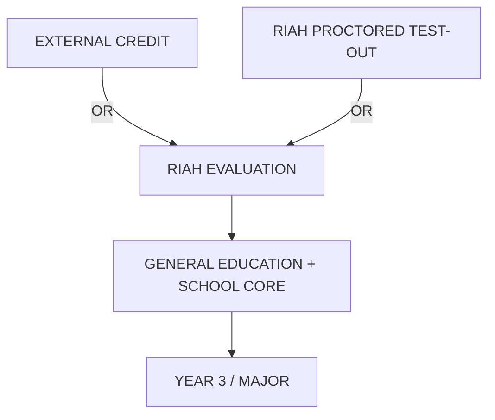
```mermaid
flowchart TD
    N0["EXTERNAL CREDIT"]
    N1["RIAH PROCTORED TEST-OUT"]
    N2["RIAH EVALUATION"]
    N3["GENERAL EDUCATION + SCHOOL CORE"]
    N4["YEAR 3 / MAJOR"]
    N0 -->|OR| N2
    N1 -->|OR| N2
    N2 --> N3
    N3 --> N4
```

---

# 12. SCHOOL CORE ALTERNATIVE CREDIT + PLACEMENT / TEST-OUT

| Assessment Component | Assessment Requirement |
| --- | --- |
| This structure applies to | This structure applies to: |

| Credit Source | Credit Eligibility |
| --- | --- |
| RIAH Pathway School of Business | - **RIAH Pathway School of Business** |
| RIAH Pathway School of Technology | - **RIAH Pathway School of Technology** |
| RIAH Pathway School of Law | - **RIAH Pathway School of Law** |
| RIAH Pathway School of Homeland Security | - **RIAH Pathway School of Homeland Security** |

| Assessment Component | Assessment Requirement |
| --- | --- |
| Student Eligibility | Students may satisfy applicable requirements through accepted transfer/alternative credit or applicable RIAH proctored placement/test-out assessments. |

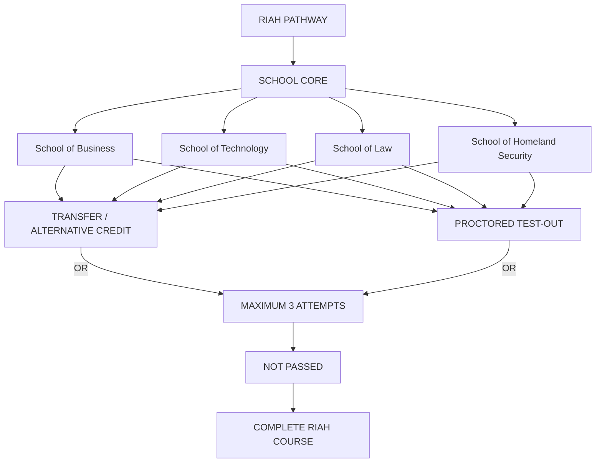
```mermaid
flowchart TD
    N0["RIAH PATHWAY"]
    N1["SCHOOL CORE"]
    N2["School of Business"]
    N3["School of Technology"]
    N4["School of Law"]
    N5["School of Homeland Security"]
    N6["TRANSFER / ALTERNATIVE CREDIT"]
    N7["PROCTORED TEST-OUT"]
    N8["MAXIMUM 3 ATTEMPTS"]
    N9["NOT PASSED"]
    N10["COMPLETE RIAH COURSE"]
    N0 --> N1
    N1 --> N2
    N1 --> N3
    N1 --> N4
    N1 --> N5
    N2 --> N6
    N2 --> N7
    N3 --> N6
    N3 --> N7
    N4 --> N6
    N4 --> N7
    N5 --> N6
    N5 --> N7
    N6 -->|OR| N8
    N7 -->|OR| N8
    N8 --> N9
    N9 --> N10
```

---

# 13. COURSE COMPLETION AFTER TEST-OUT ATTEMPTS

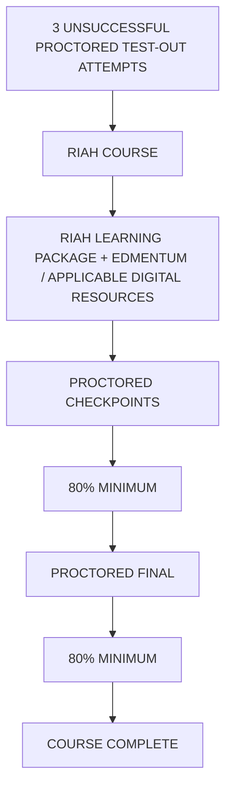
```mermaid
flowchart TD
    N0["3 UNSUCCESSFUL PROCTORED TEST-OUT ATTEMPTS"]
    N1["RIAH COURSE"]
    N2["RIAH LEARNING PACKAGE + EDMENTUM / APPLICABLE DIGITAL RESOURCES"]
    N3["PROCTORED CHECKPOINTS"]
    N4["80% MINIMUM"]
    N5["PROCTORED FINAL"]
    N6["80% MINIMUM"]
    N7["COURSE COMPLETE"]
    N0 --> N1
    N1 --> N2
    N2 --> N3
    N3 --> N4
    N4 --> N5
    N5 --> N6
    N6 --> N7
```

---

# 14. REGULAR COURSE CHECKPOINTS + FINALS

| Assessment Component | Assessment Requirement |
| --- | --- |
| REGULAR COURSE CHECKPOINTS + FINALS | The three-attempt limitation applies **only to placement/test-out assessments**. |
| Regular course checkpoints and finals | Regular course checkpoints and finals: |

| Assessment Rule | Assessment Requirement |
| --- | --- |
| 80% minimum | - **80% minimum** |
| Proctored | - **Proctored** |
| Unlimited attempts within the applicable six-month semester | - **Unlimited attempts within the applicable six-month semester** |

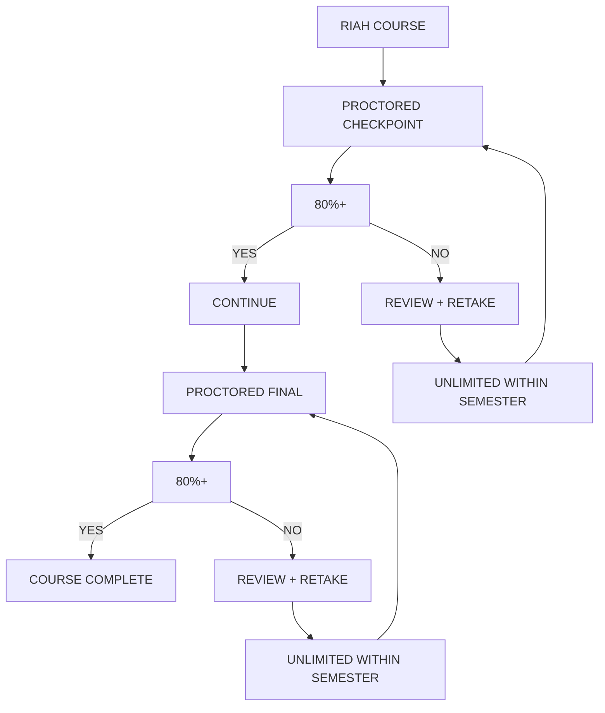
```mermaid
flowchart TD
    N0["RIAH COURSE"]
    N1["PROCTORED CHECKPOINT"]
    N2["80%+"]
    N3["CONTINUE"]
    N4["REVIEW + RETAKE"]
    N5["UNLIMITED WITHIN SEMESTER"]
    N6["PROCTORED FINAL"]
    N7["80%+"]
    N8["COURSE COMPLETE"]
    N9["REVIEW + RETAKE"]
    N10["UNLIMITED WITHIN SEMESTER"]
    N0 --> N1
    N1 --> N2
    N2 -->|YES| N3
    N2 -->|NO| N4
    N4 --> N5
    N5 --> N1
    N3 --> N6
    N6 --> N7
    N7 -->|YES| N8
    N7 -->|NO| N9
    N9 --> N10
    N10 --> N6
```

---

# 15. SIX-MONTH SEMESTER + ASSESSMENT ATTEMPTS

| Academic Component | Credit / Semester Requirement |
| --- | --- |
| SIX-MONTH SEMESTER + ASSESSMENT ATTEMPTS | RIAH operates using **two six-month semesters per academic year**. |

| Assessment | Attempts | Proctored | Rule |
| --- | --- | --- | --- |
| **Placement/Test-Out** | **3 maximum** | **Yes** | 24-hour minimum between attempts |
| **Regular Course Checkpoint** | **Unlimited** | **Yes** | Within six-month semester |
| **Regular Course Final** | **Unlimited** | **Yes** | Within six-month semester |
| **GED/HSE Prep Checkpoint** | **Unlimited** | **Yes** | Within six-month semester |
| **GED/HSE Prep Final** | **Unlimited** | **Yes** | Within six-month semester |
| **OA / Objective Assessment** | Applicable RIAH policy | **Yes** | Applicable course structure |

---

# 16. PREPARATION SEPARATE FROM OFFICIAL CREDENTIALING

| PREPARATION SEPARATE FROM OFFICIAL CREDENTIALING Component | PREPARATION SEPARATE FROM OFFICIAL CREDENTIALING Requirement |
| --- | --- |
| Preparation | RIAH Pathway Secondary School provides the **GED/HSE Preparation pathway**. |
| Preparation | Preparation and official credentialing remain separate. |

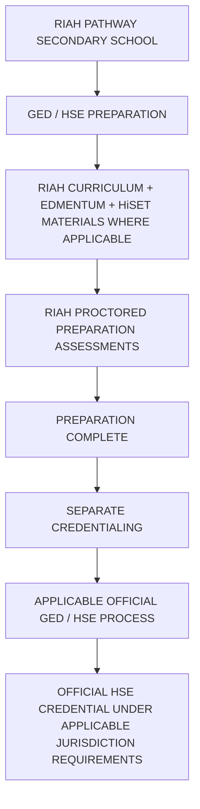
```mermaid
flowchart TD
    N0["RIAH PATHWAY SECONDARY SCHOOL"]
    N1["GED / HSE PREPARATION"]
    N2["RIAH CURRICULUM + EDMENTUM + HiSET MATERIALS WHERE APPLICABLE"]
    N3["RIAH PROCTORED PREPARATION ASSESSMENTS"]
    N4["PREPARATION COMPLETE"]
    N5["SEPARATE CREDENTIALING"]
    N6["APPLICABLE OFFICIAL GED / HSE PROCESS"]
    N7["OFFICIAL HSE CREDENTIAL UNDER APPLICABLE JURISDICTION REQUIREMENTS"]
    N0 --> N1
    N1 --> N2
    N2 --> N3
    N3 --> N4
    N4 --> N5
    N5 --> N6
    N6 --> N7
```

---

# 17. RIAH PATHWAY SECONDARY SCHOOL — TWO SECONDARY PATHWAYS

| RIAH PATHWAY SECONDARY SCHOOL — TWO SECONDARY PATHWAYS Component | RIAH PATHWAY SECONDARY SCHOOL — TWO SECONDARY PATHWAYS Requirement |
| --- | --- |
| RIAH Pathway Secondary School offers | RIAH Pathway Secondary School offers: |

### High School Diploma Pathway

| High School Diploma Pathway Component | High School Diploma Pathway Requirement |
| --- | --- |
| For students seeking | For students seeking: |

| Pathway Component | Pathway Requirement |
| --- | --- |
| Traditional Grades 9–12 education | - Traditional Grades 9–12 education |
| Complete high-school curriculum | - Complete high-school curriculum |
| High-school transcript | - High-school transcript |
| Course grades | - Course grades |
| GPA | - GPA |
| High-school diploma | - High-school diploma |
| Concurrent college-level coursework where applicable | - Concurrent college-level coursework where applicable |
| Preparation for RIAH Pathway or other postsecondary institutions | - Preparation for RIAH Pathway or other postsecondary institutions |

### GED/HSE Preparation Pathway

| GED/HSE Preparation Pathway Component | GED/HSE Preparation Pathway Requirement |
| --- | --- |
| For students seeking | For students seeking: |

| Pathway Component | Pathway Requirement |
| --- | --- |
| Alternative high-school-equivalency preparation | - Alternative high-school-equivalency preparation |
| GED/HSE preparation | - GED/HSE preparation |
| 12 GED Preparation credits | - 12 GED Preparation credits |
| Up to 12 corresponding concurrent General Education credits | - Up to 12 corresponding concurrent General Education credits |
| Continuation into RIAH Pathway | - Continuation into RIAH Pathway |
| Admission to other postsecondary institutions accepting the applicable HSE credential | - Admission to other postsecondary institutions accepting the applicable HSE credential |

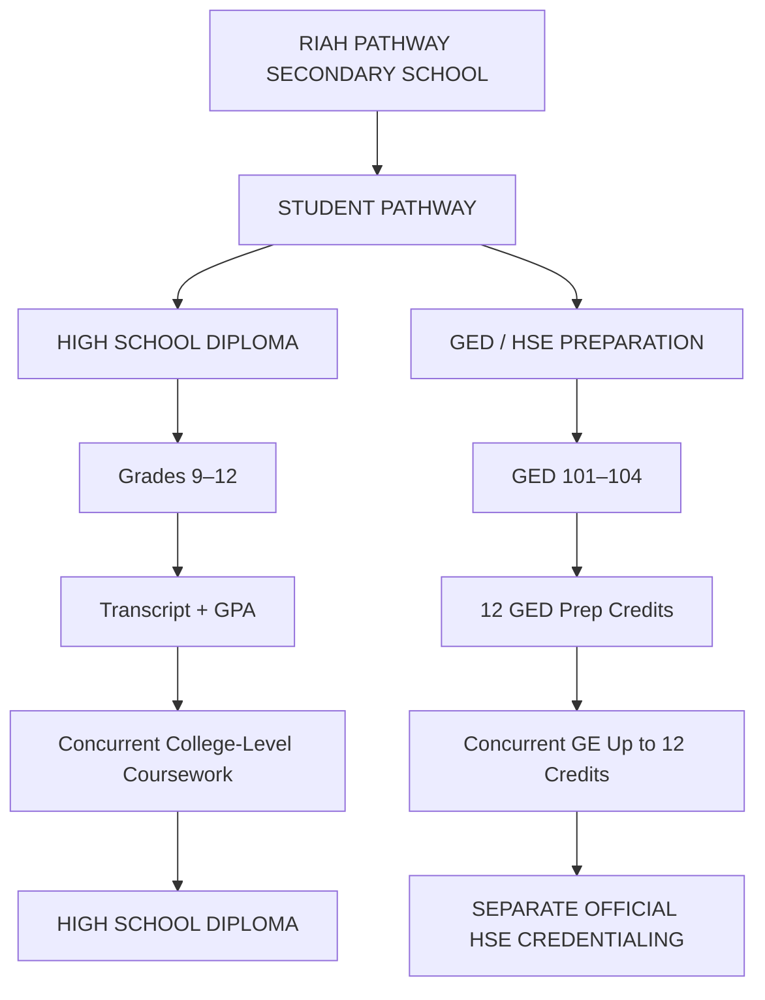
```mermaid
flowchart TD
    N0["RIAH PATHWAY SECONDARY SCHOOL"]
    N1["STUDENT PATHWAY"]
    N2["HIGH SCHOOL DIPLOMA"]
    N3["GED / HSE PREPARATION"]
    N4["Grades 9–12"]
    N5["GED 101–104"]
    N6["Transcript + GPA"]
    N7["12 GED Prep Credits"]
    N8["Concurrent College-Level Coursework"]
    N9["Concurrent GE Up to 12 Credits"]
    N10["HIGH SCHOOL DIPLOMA"]
    N11["SEPARATE OFFICIAL HSE CREDENTIALING"]
    N0 --> N1
    N1 --> N2
    N1 --> N3
    N2 --> N4
    N4 --> N6
    N6 --> N8
    N8 --> N10
    N3 --> N5
    N5 --> N7
    N7 --> N9
    N9 --> N11
```

---

# 18. HIGH SCHOOL DIPLOMA VS. GED/HSE PATHWAY BENEFITS

| Pathway Benefit | **RIAH Pathway High School Diploma** | **RIAH Pathway GED/HSE Preparation** |
| --- | --- | --- |
| **School** | RIAH Pathway Secondary School | RIAH Pathway Secondary School |
| **Primary Purpose** | Traditional secondary education | Alternative HSE preparation |
| **Structure** | Grades 9–12 | GED/HSE preparation |
| **Academic Record** | Full high-school transcript | RIAH preparation record + separate official HSE record |
| **GPA** | Yes | No traditional four-year high-school GPA |
| **Concurrent Coursework** | Yes | Yes |
| **GED Preparation Credits** | No | **12** |
| **Concurrent GE Opportunity** | Applicable college-level coursework | **Up to 12 corresponding GE credits** |
| **RIAH Pathway Continuation** | Yes | Yes |
| **Other Postsecondary Institutions** | Student applies using diploma and transcript | Student applies to institutions accepting applicable HSE credential |
| **Student Benefit** | Traditional diploma route and complete secondary academic record | More direct HSE route with concurrent GE acceleration |

### High School Diploma Student

| High School Diploma Student Component | High School Diploma Student Requirement |
| --- | --- |
| Student Eligibility | Designed for students who want a traditional high-school diploma and may intend to apply to institutions requiring a diploma, specified secondary coursework, or a traditional high-school academic record. |

### GED/HSE Student

| GED/HSE Student Component | GED/HSE Student Requirement |
| --- | --- |
| Student Eligibility | Designed for students who want the HSE pathway and intend to continue through RIAH Pathway or apply to another institution accepting the applicable HSE credential. |

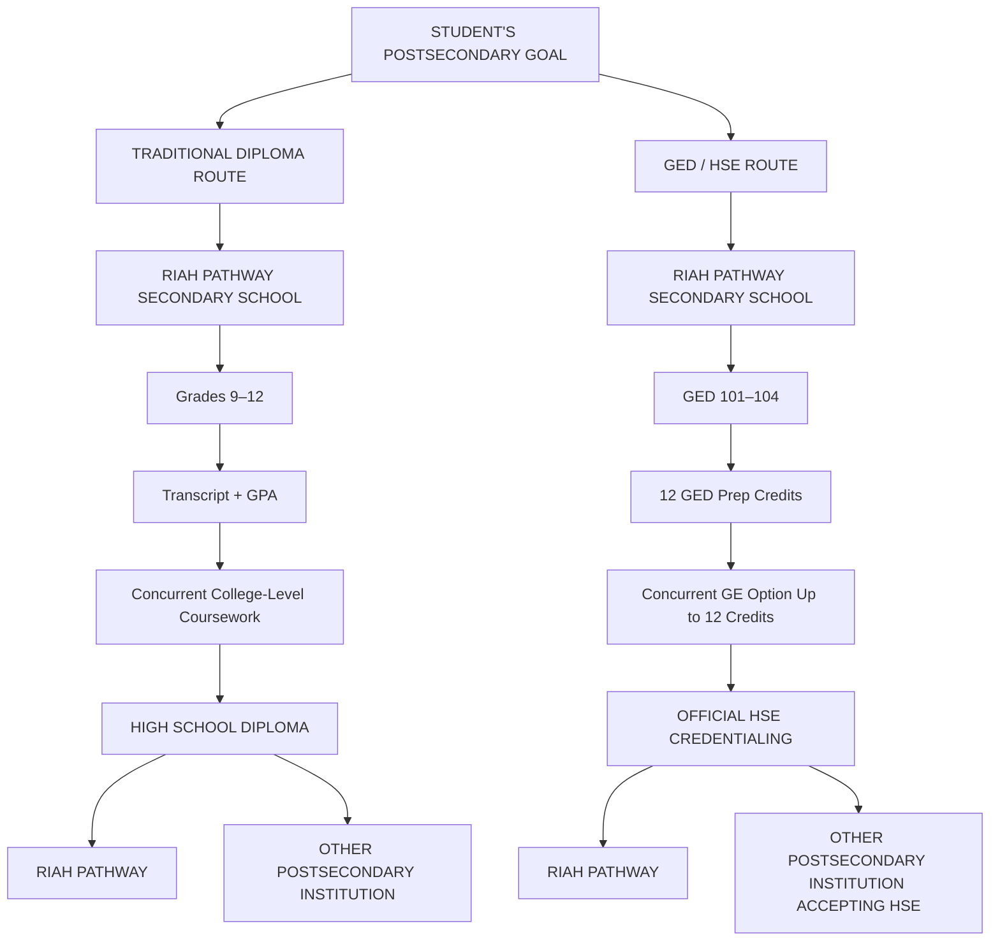
```mermaid
flowchart TD
    N0["STUDENT'S POSTSECONDARY GOAL"]
    N1["TRADITIONAL DIPLOMA ROUTE"]
    N2["GED / HSE ROUTE"]
    N3["RIAH PATHWAY SECONDARY SCHOOL"]
    N4["RIAH PATHWAY SECONDARY SCHOOL"]
    N5["Grades 9–12"]
    N6["GED 101–104"]
    N7["Transcript + GPA"]
    N8["12 GED Prep Credits"]
    N9["Concurrent College-Level Coursework"]
    N10["Concurrent GE Option Up to 12 Credits"]
    N11["HIGH SCHOOL DIPLOMA"]
    N12["OFFICIAL HSE CREDENTIALING"]
    N13["RIAH PATHWAY"]
    N14["OTHER POSTSECONDARY INSTITUTION"]
    N15["RIAH PATHWAY"]
    N16["OTHER POSTSECONDARY INSTITUTION ACCEPTING HSE"]
    N0 --> N1
    N0 --> N2
    N1 --> N3
    N2 --> N4
    N3 --> N5
    N4 --> N6
    N5 --> N7
    N6 --> N8
    N7 --> N9
    N8 --> N10
    N9 --> N11
    N10 --> N12
    N11 --> N13
    N11 --> N14
    N12 --> N15
    N12 --> N16
```

---

# 19. POST-SECONDARY PATHWAY

## High School Diploma Route

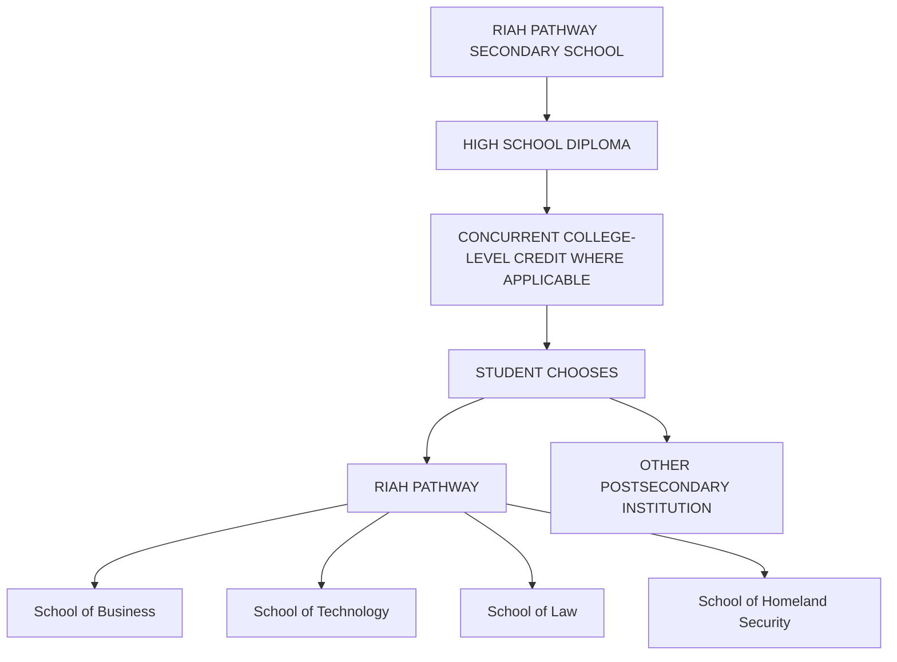
```mermaid
flowchart TD
    N0["RIAH PATHWAY SECONDARY SCHOOL"]
    N1["HIGH SCHOOL DIPLOMA"]
    N2["CONCURRENT COLLEGE-LEVEL CREDIT WHERE APPLICABLE"]
    N3["STUDENT CHOOSES"]
    N4["RIAH PATHWAY"]
    N5["School of Business"]
    N6["School of Technology"]
    N7["School of Law"]
    N8["School of Homeland Security"]
    N9["OTHER POSTSECONDARY INSTITUTION"]
    N0 --> N1
    N1 --> N2
    N2 --> N3
    N3 --> N4
    N3 --> N9
    N4 --> N5
    N4 --> N6
    N4 --> N7
    N4 --> N8
```

## GED/HSE Route

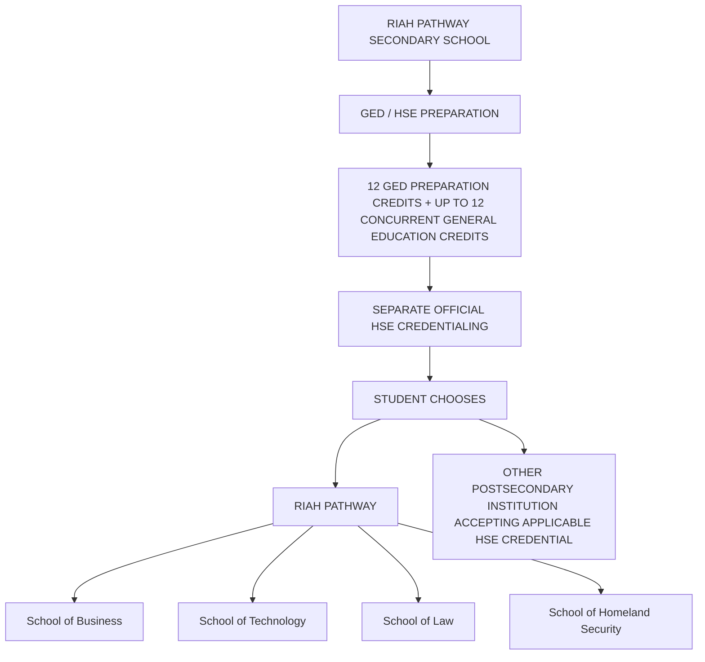
```mermaid
flowchart TD
    N0["RIAH PATHWAY SECONDARY SCHOOL"]
    N1["GED / HSE PREPARATION"]
    N2["12 GED PREPARATION CREDITS + UP TO 12 CONCURRENT GENERAL EDUCATION CREDITS"]
    N3["SEPARATE OFFICIAL HSE CREDENTIALING"]
    N4["STUDENT CHOOSES"]
    N5["RIAH PATHWAY"]
    N6["School of Business"]
    N7["School of Technology"]
    N8["School of Law"]
    N9["School of Homeland Security"]
    N10["OTHER POSTSECONDARY INSTITUTION ACCEPTING APPLICABLE HSE CREDENTIAL"]
    N0 --> N1
    N1 --> N2
    N2 --> N3
    N3 --> N4
    N4 --> N5
    N4 --> N10
    N5 --> N6
    N5 --> N7
    N5 --> N8
    N5 --> N9
```

---

# 20. COMPLETE RIAH PATHWAY SECONDARY SCHOOL → RIAH PATHWAY FLOW

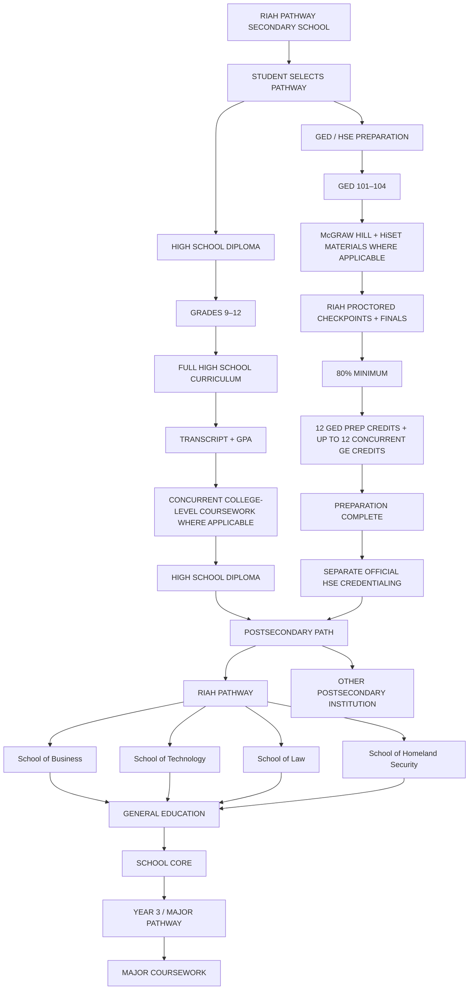
```mermaid
flowchart TD
    N0["RIAH PATHWAY SECONDARY SCHOOL"]
    N1["STUDENT SELECTS PATHWAY"]
    N2["HIGH SCHOOL DIPLOMA"]
    N3["GED / HSE PREPARATION"]
    N4["GRADES 9–12"]
    N5["FULL HIGH SCHOOL CURRICULUM"]
    N6["TRANSCRIPT + GPA"]
    N7["CONCURRENT COLLEGE-LEVEL COURSEWORK WHERE APPLICABLE"]
    N8["HIGH SCHOOL DIPLOMA"]
    N9["GED 101–104"]
    N10["McGRAW HILL + HiSET MATERIALS WHERE APPLICABLE"]
    N11["RIAH PROCTORED CHECKPOINTS + FINALS"]
    N12["80% MINIMUM"]
    N13["12 GED PREP CREDITS + UP TO 12 CONCURRENT GE CREDITS"]
    N14["PREPARATION COMPLETE"]
    N15["SEPARATE OFFICIAL HSE CREDENTIALING"]
    N16["POSTSECONDARY PATH"]
    N17["RIAH PATHWAY"]
    N18["OTHER POSTSECONDARY INSTITUTION"]
    N19["School of Business"]
    N20["School of Technology"]
    N21["School of Law"]
    N22["School of Homeland Security"]
    N23["GENERAL EDUCATION"]
    N24["SCHOOL CORE"]
    N25["YEAR 3 / MAJOR PATHWAY"]
    N26["MAJOR COURSEWORK"]
    N0 --> N1
    N1 --> N2
    N1 --> N3
    N2 --> N4
    N4 --> N5
    N5 --> N6
    N6 --> N7
    N7 --> N8
    N3 --> N9
    N9 --> N10
    N10 --> N11
    N11 --> N12
    N12 --> N13
    N13 --> N14
    N14 --> N15
    N8 --> N16
    N15 --> N16
    N16 --> N17
    N16 --> N18
    N17 --> N19
    N17 --> N20
    N17 --> N21
    N17 --> N22
    N19 --> N23
    N20 --> N23
    N21 --> N23
    N22 --> N23
    N23 --> N24
    N24 --> N25
    N25 --> N26
```

