# RIAH PATHWAY SECONDARY SCHOOL
# FOUR-YEAR HIGH SCHOOL DIPLOMA CURRICULUM

## State-Component Emoji Key

| Emoji | State |
| --- | --- |
| 🔴 | Ohio |
| 🟠 | Arkansas |
| 🟡 | Oklahoma |
| 🟢 | California |
| 🔵 | Illinois |
| 🟣 | Wisconsin |
| 🟤 | Minnesota |
| ⚪ | New York |
| 🔶 | New Jersey |
| 🔷 | Florida |
| 🔺 | Texas |
| 🔻 | Arizona |
| 🟩 | Oregon |
| 🟦 | Connecticut |
| 🟪 | Tennessee |
| 🟧 | Virginia |

| Academic Component | Credit / Semester Requirement |
| --- | --- |
| Curriculum | State emojis identify state-specific curriculum components within applicable courses. |
| 1 RIAH Course | **1 RIAH Course = 3 RIAH Credit Hours** |
| 5 Courses Per Semester | **5 Courses Per Semester = 15 Credit Hours** |
| 2 Semesters Per Academic Year | **2 Semesters Per Academic Year = 30 Credit Hours** |
| 4 Academic Years | **4 Academic Years = 120 RIAH Credit Hours** |
| 40 Fixed Courses | **40 Fixed Courses = 120 RIAH Credit Hours** |
| State-Component Emoji Key | **No unspecified electives.** |

---

# HIGH SCHOOL INSTRUCTIONAL SOFTWARE / CURRICULUM CONTENT LAYER

| Instructional Component | Curriculum Mapping / Authority |
| --- | --- |
| Edmentum | **Edmentum is the primary instructional software and curriculum-content ecosystem for the RIAH Pathway High School Diploma curriculum.** |
| Edmentum | RIAH Pathway retains and controls its own curriculum. Edmentum instructional content/courseware is mapped into the applicable RIAH courses, and RIAH may supplement, expand, reorganize, or add curriculum content, assignments, OA, PA, state components, and other course requirements. |

| RIAH Course | Course Name | Edmentum |
| --- | --- | --- |
| **ENG 1101** | English I / Composition I | **✓** |
| **MAT 1101** | Algebra I | **✓** |
| **SCI 1101** | Geology | **✓** |
| **GEO 1101** | World Geography | **✓** |
| **TEC 1101** | Digital Literacy | **✓** |
| **ENG 1102** | English II / Composition II | **✓** |
| **MAT 1102** | Geometry | **✓** |
| **SCI 1102** | Astronomy | **✓** |
| **HIS 1101** | World History | **✓** |
| **HLT 1101** | Health | **✓** |
| **ENG 2101** | English III / American Literature | **✓** |
| **MAT 2101** | Algebra II | **✓** |
| **SCI 2101** | Earth Science | **✓** |
| **HIS 2101** | Holocaust & Genocide Studies | **✓** |
| **PED 2101** | Physical Education | **✓** |
| **ENG 2102** | English IV / World Literature | **✓** |
| **MAT 2102** | Trigonometry | **✓** |
| **SCI 2102** | Environmental Science | **✓** |
| **GOV 2101** | Government | **✓** |
| **ART 2101** | Fine Arts | **✓** |
| **MAT 3101** | Precalculus | **✓** |
| **SCI 3101** | Biology | **✓** |
| **HIS 3101** | American History | **✓** |
| **FIN 3101** | Financial Literacy | **✓** |
| **LAN 3101** | World Language I | **✓** |
| **MAT 3102** | Calculus | **✓** |
| **SCI 3102** | Chemistry | **✓** |
| **HIS 3102** | State History | **✓** |
| **LAN 3102** | World Language II | **✓** |
| **PFI 3101** | Personal Finance | **✓** |
| **MAT 4101** | Statistics | **✓** |
| **SCI 4101** | Anatomy | **✓** |
| **ECO 4101** | Economics | **✓** |
| **CSC 4101** | Computer Science | **✓** |
| **ETH 4101** | Ethnic Studies | **✓** |
| **SCI 4102** | Physiology | **✓** |
| **SCI 4103** | Physics | **✓** |
| **SOC 4101** | Sociology | **✓** |
| **PSY 4101** | Psychology | **✓** |
| **COM 4101** | Oral Communication | **✓** |

| Instructional Component | Curriculum Mapping / Authority |
| --- | --- |
| ✓ | **✓ = Edmentum provides applicable instructional content/courseware mapped into the RIAH course. RIAH curriculum remains controlling for every course.** |

---

# SCIENCE SEQUENCE

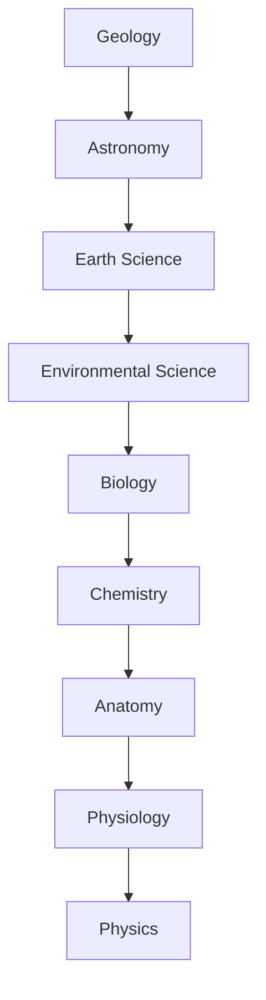

---

# HISTORY / SOCIAL SCIENCE SEQUENCE

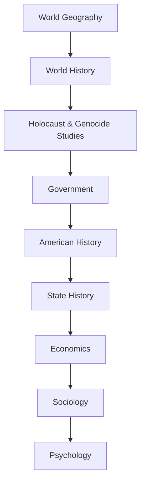

| HISTORY / SOCIAL SCIENCE SEQUENCE Component | HISTORY / SOCIAL SCIENCE SEQUENCE Requirement |
| --- | --- |
| HISTORY / SOCIAL SCIENCE SEQUENCE | **Ethnic Studies — Fixed Additional Social Studies Course** |

---

# GRADE 9 — FRESHMAN YEAR

## Semester 1

| Course | Course Title | Subject Area | Credits | Prerequisite Course | Prerequisite Course Title | Prerequisite Subject Area | Course Content | State Component | Component Comments |
| --- | --- | --- | --- | --- | --- | --- | --- | --- | --- |
| **ENG 1101** | English I / Composition I | English Language Arts | 3 | None | None | None | English Composition, Writing Fundamentals, Grammar and Usage, Sentence and Paragraph Development, Essay Development, Reading Comprehension, Vocabulary, Research Fundamentals, Written Communication | — | Fixed RIAH English composition course. |
| **MAT 1101** | Algebra I | Mathematics | 3 | None | None | None | Algebraic Expressions, Equations, Inequalities, Functions, Linear Equations, Systems of Equations, Polynomials, Factoring, Exponents | — | Fixed RIAH mathematics course. |
| **SCI 1101** | Geology | Earth Science | 3 | None | None | None | Earth Materials, Minerals, Rocks, Earth's Structure, Plate Tectonics, Geological Processes, Geological Time, Earth's Surface, Natural Resources, Geological Hazards | — | First science course. |
| **GEO 1101** | World Geography | Social Studies / Geography | 3 | None | None | None | Physical Geography, Human Geography, World Regions, Population, Culture, Political Geography, Economic Geography, Geographic Systems, Maps and Spatial Analysis, Human-Environment Relationships | — | First history/social-science course. |
| **TEC 1101** | Digital Literacy | Technology | 3 | None | None | None | Digital Literacy, Information Literacy, Media Literacy, Digital Citizenship, Internet Safety, Responsible Technology Use, Online Research, Digital Communication, Digital Productivity | State modules where applicable | State-specific digital/media-literacy content is mapped here. |
|  | **SEMESTER TOTAL** |  | **15** |  |  |  |  |  |  |

## Semester 2

| Course | Course Title | Subject Area | Credits | Prerequisite Course | Prerequisite Course Title | Prerequisite Subject Area | Course Content | State Component | Component Comments |
| --- | --- | --- | --- | --- | --- | --- | --- | --- | --- |
| **ENG 1102** | English II / Composition II | English Language Arts | 3 | ENG 1101 | English I / Composition I | English Language Arts | Advanced Composition, Expository Writing, Argumentative Writing, Narrative Writing, Research Writing, Reading Analysis, Grammar and Usage, Written Communication, Source Evaluation | — | Fixed RIAH English composition course. |
| **MAT 1102** | Geometry | Mathematics | 3 | MAT 1101 | Algebra I | Mathematics | Geometric Reasoning, Lines, Angles, Triangles, Polygons, Circles, Congruence, Similarity, Coordinate Geometry, Area, Surface Area, Volume | — | Fixed RIAH mathematics course. |
| **SCI 1102** | Astronomy | Earth / Space Science | 3 | SCI 1101 | Geology | Earth Science | Solar System, Stars, Galaxies, Universe, Planetary Science, Space Observation, Earth-Space Relationships, Astronomical Measurement | — | Second science course. |
| **HIS 1101** | World History | History | 3 | GEO 1101 | World Geography | Social Studies / Geography | World History, World Civilizations, Global Historical Development, Human Rights | State modules where applicable | Applicable state historical content is mapped here. |
| **HLT 1101 🔴🟣🟤🟦** | Health | Health | 3 | None | None | None | Health, Nutrition, Physical Wellness, Mental and Emotional Health, Disease Prevention, Substance-Abuse Prevention, Personal Health, Community Health, Safety, First Aid, CPR, AED | 🔴 Ohio, 🟣 Wisconsin, 🟤 Minnesota, 🟦 Connecticut | Applicable state health and safety content is mapped here. |
|  | **SEMESTER TOTAL** |  | **15** |  |  |  |  |  |  |

### Grade 9 Total: **30 Credit Hours**

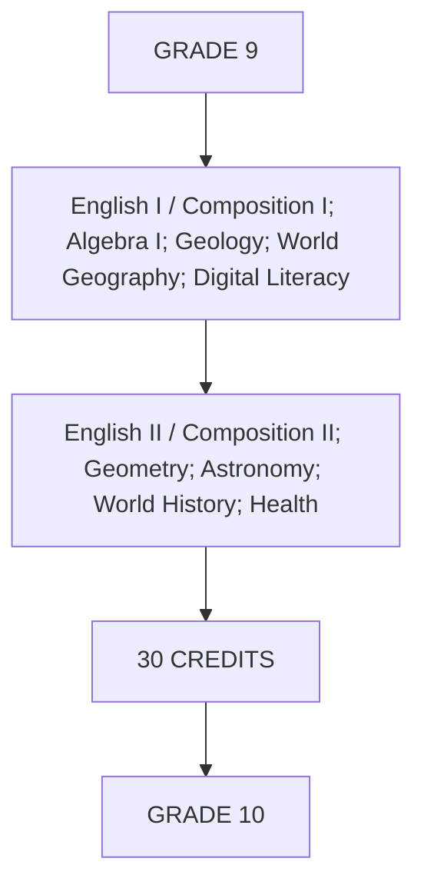

---

# GRADE 10 — SOPHOMORE YEAR

## Semester 1

| Course | Course Title | Subject Area | Credits | Prerequisite Course | Prerequisite Course Title | Prerequisite Subject Area | Course Content | State Component | Component Comments |
| --- | --- | --- | --- | --- | --- | --- | --- | --- | --- |
| **ENG 2101** | English III / American Literature | English Language Arts | 3 | ENG 1102 | English II / Composition II | English Language Arts | American Literature, American Literary Movements, Fiction, Nonfiction, Poetry, Drama, Literary Analysis, Analytical Writing, Research Writing, Vocabulary, Written Communication | — | Fixed RIAH American-literature course. |
| **MAT 2101** | Algebra II | Mathematics | 3 | MAT 1102 | Geometry | Mathematics | Advanced Algebra, Functions, Quadratic Functions, Polynomial Functions, Rational Expressions, Radical Expressions, Exponential Functions, Logarithmic Functions | — | Fixed RIAH mathematics course. |
| **SCI 2101** | Earth Science | Earth Science | 3 | SCI 1102 | Astronomy | Earth / Space Science | Earth Systems, Atmosphere, Hydrosphere, Weather, Climate, Oceans, Earth's Resources, Earth-System Interactions | — | Third science course. |
| **HIS 2101 🔵🟢** | Holocaust & Genocide Studies | History / Social Studies | 3 | HIS 1101 | World History | History | Holocaust Studies, Antisemitism, Nazi Germany, Holocaust History, Genocide Studies, Comparative Genocide, Human Rights, Prevention of Genocide, Historical Memory | 🔵 Illinois, 🟢 California | Applicable Holocaust/genocide components are mapped here. |
| **PED 2101 🔴🟤** | Physical Education | Physical Education | 3 | None | None | None | Physical Fitness, Cardiovascular Fitness, Strength, Flexibility, Movement, Wellness, Personal Fitness Planning, Lifetime Physical Activity | 🔴 Ohio, 🟤 Minnesota | Applicable physical-education requirements are covered here. |
|  | **SEMESTER TOTAL** |  | **15** |  |  |  |  |  |  |

## Semester 2

| Course | Course Title | Subject Area | Credits | Prerequisite Course | Prerequisite Course Title | Prerequisite Subject Area | Course Content | State Component | Component Comments |
| --- | --- | --- | --- | --- | --- | --- | --- | --- | --- |
| **ENG 2102** | English IV / World Literature | English Language Arts | 3 | ENG 2101 | English III / American Literature | English Language Arts | World Literature, Global Literary Traditions, Fiction, Nonfiction, Poetry, Drama, Comparative Literature, Literary Analysis, Advanced Writing, Research Writing, Written Communication | — | Fixed RIAH world-literature course. |
| **MAT 2102** | Trigonometry | Mathematics | 3 | MAT 2101 | Algebra II | Mathematics | Trigonometric Functions, Angles, Right-Triangle Trigonometry, Unit Circle, Graphs, Identities, Equations, Applications | — | Fixed RIAH mathematics course. |
| **SCI 2102** | Environmental Science | Environmental Science | 3 | SCI 2101 | Earth Science | Earth Science | Ecosystems, Natural Resources, Biodiversity, Pollution, Climate, Sustainability, Human Environmental Impact, Conservation | — | Fourth science course. |
| **GOV 2101 🔴🟡🔺🔻** | Government | Government / Civics | 3 | HIS 2101 | Holocaust & Genocide Studies | History / Social Studies | United States Government, American Government, Civics, Citizenship, Constitutional Government, Federal Government, State Government, Local Government, Founding Principles, Rights and Responsibilities | 🔴 Ohio, 🟡 Oklahoma, 🔺 Texas, 🔻 Arizona | Applicable government and civics components are mapped here. |
| **ART 2101 🔴🟤** | Fine Arts | Fine Arts | 3 | None | None | None | Visual Art, Music, Theatre, Fine Arts Appreciation, Artistic Expression, Arts History | 🔴 Ohio, 🟤 Minnesota | Applicable state fine-arts content is covered here. |
|  | **SEMESTER TOTAL** |  | **15** |  |  |  |  |  |  |

### Grade 10 Total: **30 Credit Hours**

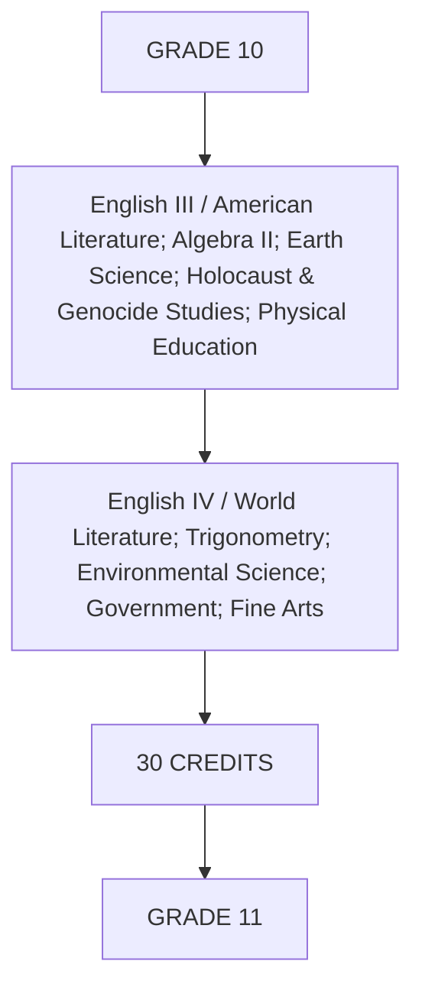

---

# GRADE 11 — JUNIOR YEAR

## Semester 1

| Course | Course Title | Subject Area | Credits | Prerequisite Course | Prerequisite Course Title | Prerequisite Subject Area | Course Content | State Component | Component Comments |
| --- | --- | --- | --- | --- | --- | --- | --- | --- | --- |
| **MAT 3101** | Precalculus | Mathematics | 3 | MAT 2102 | Trigonometry | Mathematics | Functions, Polynomial Functions, Rational Functions, Exponential Functions, Logarithmic Functions, Advanced Trigonometry, Analytic Geometry, Sequences | — | Fixed RIAH mathematics course. |
| **SCI 3101** | Biology | Life Science | 3 | SCI 2102 | Environmental Science | Environmental Science | Cell Biology, Genetics, Evolution, Ecology, Organisms, Biological Systems, Molecular Biology, Biological Diversity | — | Biology begins the biological-science portion of the sequence. |
| **HIS 3101** | American History | American History | 3 | GOV 2101 | Government | Government / Civics | United States History, Colonial America, American Revolution, Founding of the United States, Constitutional History, Civil War and Reconstruction, Industrialization, Modern U.S. History, Civil Rights History | State modules where applicable | American History remains separate from State History. |
| **FIN 3101 🔴🟢🟠** | Financial Literacy | Financial Literacy | 3 | None | None | None | Financial Decision-Making, Banking Fundamentals, Credit Fundamentals, Debt Literacy, Saving, Investing Fundamentals, Insurance Literacy, Consumer Financial Literacy | 🔴 Ohio, 🟢 California, 🟠 Arkansas | Applicable state financial-literacy content is mapped here. |
| **LAN 3101** | World Language I | World Language | 3 | None | None | None | Spanish, French, German, or Italian Level I; Vocabulary, Grammar, Reading, Writing, Listening, Speaking, Culture | — | Student selects one language. |
|  | **SEMESTER TOTAL** |  | **15** |  |  |  |  |  |  |

## Semester 2

| Course | Course Title | Subject Area | Credits | Prerequisite Course | Prerequisite Course Title | Prerequisite Subject Area | Course Content | State Component | Component Comments |
| --- | --- | --- | --- | --- | --- | --- | --- | --- | --- |
| **MAT 3102** | Calculus | Mathematics | 3 | MAT 3101 | Precalculus | Mathematics | Limits, Continuity, Derivatives, Applications of Derivatives, Integrals, Applications of Integrals, Fundamental Theorem of Calculus | — | Fixed RIAH mathematics course. |
| **SCI 3102** | Chemistry | Physical Science | 3 | SCI 3101 | Biology | Life Science | Matter, Atomic Structure, Periodic Relationships, Chemical Bonding, Chemical Reactions, Stoichiometry, Solutions, Acids and Bases, Chemical Energy | — | Chemistry follows Biology. |
| **HIS 3102 🟡🟠** | State History | State History | 3 | HIS 3101 | American History | American History | State History, State Founding and Development, State Constitution, State Government History, State Geography, State Economy, State Cultural History, State Civil Rights History, Native American/Tribal/Indigenous History, Major State Events, State Historical Figures | 🟡 Oklahoma, 🟠 Arkansas | Every student studies the history of their own state; identified state-specific components are mapped here. |
| **LAN 3102** | World Language II | World Language | 3 | LAN 3101 | World Language I | World Language | Continuation of selected language; Intermediate Vocabulary, Grammar, Reading, Writing, Listening, Speaking, Culture | — | Student continues the same language. |
| **PFI 3101 🔴🟢🟠** | Personal Finance | Personal Finance | 3 | FIN 3101 | Financial Literacy | Financial Literacy | Personal Budgeting, Income, Banking, Credit Management, Debt Management, Saving, Investing, Insurance, Taxes, Housing, Consumer Decision-Making, Financial Responsibility | 🔴 Ohio, 🟢 California, 🟠 Arkansas | Applicable state personal-finance components are mapped here. |
|  | **SEMESTER TOTAL** |  | **15** |  |  |  |  |  |  |

### Grade 11 Total: **30 Credit Hours**

### Concurrent Enrollment

| Concurrent Enrollment Component | Concurrent Enrollment Requirement |
| --- | --- |
| General Education | Eligible Grade 11 students may begin applicable RIAH Pathway General Education coursework concurrently with the high-school curriculum. |

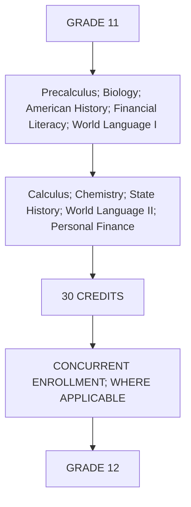

---

# GRADE 12 — SENIOR YEAR

## Semester 1

| Course | Course Title | Subject Area | Credits | Prerequisite Course | Prerequisite Course Title | Prerequisite Subject Area | Course Content | State Component | Component Comments |
| --- | --- | --- | --- | --- | --- | --- | --- | --- | --- |
| **MAT 4101** | Statistics | Mathematics | 3 | MAT 2101 | Algebra II | Mathematics | Descriptive Statistics, Probability, Distributions, Sampling, Data Analysis, Correlation, Regression, Statistical Inference | — | Fixed RIAH mathematics course. |
| **SCI 4101** | Anatomy | Life Science | 3 | SCI 3101 | Biology | Life Science | Anatomical Terminology, Cells and Tissues, Skeletal System, Muscular System, Nervous System, Cardiovascular Structures, Respiratory Structures, Digestive Structures, Endocrine Structures, Human Body Organization | — | Anatomy follows Biology and Chemistry in the overall sequence. |
| **ECO 4101** | Economics | Economics | 3 | HIS 3102 | State History | State History | Economic Systems, Microeconomics, Macroeconomics, Supply and Demand, Markets, Labor, Banking, Fiscal Policy, Monetary Policy, International Economics, Consumer Economics | — | Economics follows the core history/government sequence. |
| **CSC 4101 🟠** | Computer Science | Computer Science | 3 | TEC 1101 | Digital Literacy | Technology | Computer Science Principles, Algorithms, Programming Fundamentals, Data, Computing Systems, Networks, Cybersecurity Fundamentals, Responsible Computing | 🟠 Arkansas | Applicable Arkansas computer-science content is mapped here. |
| **ETH 4101 🟢** | Ethnic Studies | Social Studies | 3 | HIS 3101 | American History | American History | Ethnic Studies, Race and Ethnicity in the United States, Cultural History, Cultural Contributions, Historical Experiences of Diverse Communities, Civil Rights and Social Change, Comparative Cultural Studies | 🟢 California | Applicable California ethnic-studies content is mapped here. |
|  | **SEMESTER TOTAL** |  | **15** |  |  |  |  |  |  |

## Semester 2

| Course | Course Title | Subject Area | Credits | Prerequisite Course | Prerequisite Course Title | Prerequisite Subject Area | Course Content | State Component | Component Comments |
| --- | --- | --- | --- | --- | --- | --- | --- | --- | --- |
| **SCI 4102** | Physiology | Life Science | 3 | SCI 4101 | Anatomy | Life Science | Cellular Physiology, Nervous-System Function, Muscular Function, Cardiovascular Function, Respiratory Function, Digestive Function, Endocrine Function, Homeostasis, Human Body-System Integration | — | Physiology directly follows Anatomy. |
| **SCI 4103** | Physics | Physical Science | 3 | SCI 3102 + MAT 2101 | Chemistry + Algebra II | Physical Science + Mathematics | Motion, Forces, Energy, Momentum, Waves, Electricity, Magnetism, Light, Introductory Modern Physics | — | Physics is the culminating physical-science course. |
| **SOC 4101** | Sociology | Social Science | 3 | ECO 4101 | Economics | Economics | Sociological Perspectives, Culture, Socialization, Social Institutions, Groups, Communities, Social Stratification, Social Change, Society and Human Interaction | — | Sociology follows Economics. |
| **PSY 4101** | Psychology | Social Science | 3 | SOC 4101 | Sociology | Social Science | Foundations of Psychology, Human Development, Learning, Memory, Cognition, Motivation, Emotion, Personality, Social Psychology, Human Behavior | — | Psychology follows Sociology. |
| **COM 4101** | Oral Communication | Communication | 3 | ENG 2102 | English IV / World Literature | English Language Arts | Oral Communication, Public Speaking, Presentation Skills, Audience Analysis, Speech Organization, Verbal Communication, Nonverbal Communication, Persuasive Speaking | — | Fixed RIAH oral-communication course. |
|  | **SEMESTER TOTAL** |  | **15** |  |  |  |  |  |  |

# STATE-SPECIFIC GRADUATION CONTROLS

| State Component | Graduation Control |
| --- | --- |
| **🟠 Arkansas** | **Arkansas Civics Exam — passing score of at least 60%.** |
| **🟠 Arkansas** | **CPR training.** |
| **🟠 Arkansas** | **75 documented community-service hours in Grades 9–12 beginning with the graduating class of 2027 under the Arkansas public-school requirement.** |
| **🟠 Arkansas** | **One credit of approved Computer Science or qualifying computer-science-related CTE beginning with 2026 graduates under the Arkansas public-school framework.** RIAH maps the academic component to **CSC 4101 — Computer Science**. |
| **🟠 Arkansas** | **Course credit incorporating Personal and Family Finance standards.** RIAH maps this through **FIN 3101 — Financial Literacy** and **PFI 3101 — Personal Finance**. |
| **🔻 Arizona** | **Arizona Civics Test — 70/100 minimum for students graduating in 2026 and later.** |
| **🔴 Ohio** | **Financial Literacy — ½ credit for students entering Grade 9 on or after July 1, 2022.** RIAH maps this through **FIN 3101 — Financial Literacy**. |
| **🔴 Ohio** | **Ohio diploma-readiness requirements/seals where applicable to the student's governing graduation framework.** Ohio's current long-term framework requires two diploma seals, including at least one state-defined seal. |
| **Other RIAH Virtual States** | Additional state-specific examinations, demonstrations, service requirements, documentation, or other non-course graduation controls will be added to this table as each state's curriculum/graduation audit is completed. |

### Grade 12 Total: **30 Credit Hours**

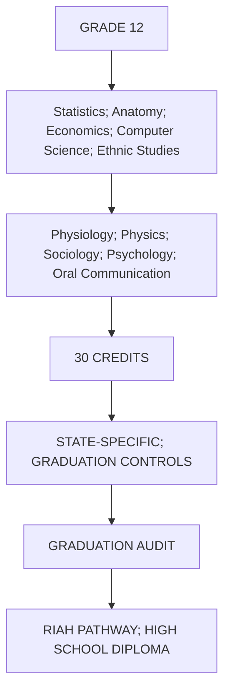

---

# FOUR-YEAR FIXED CREDIT STRUCTURE

| Grade | Semester 1 Courses | Semester 1 Credits | Semester 2 Courses | Semester 2 Credits | Annual Credits |
| --- | --- | --- | --- | --- | --- |
| **Grade 9** | 5 | 15 | 5 | 15 | **30** |
| **Grade 10** | 5 | 15 | 5 | 15 | **30** |
| **Grade 11** | 5 | 15 | 5 | 15 | **30** |
| **Grade 12** | 5 | 15 | 5 | 15 | **30** |
| **TOTAL** | **20** | **60** | **20** | **60** | **120** |

| Academic Component | Credit / Semester Requirement |
| --- | --- |
| FOUR-YEAR FIXED CREDIT STRUCTURE | **40 Fixed Courses** |
| FOUR-YEAR FIXED CREDIT STRUCTURE | **120 RIAH Credit Hours** |
| FOUR-YEAR FIXED CREDIT STRUCTURE | **No unspecified electives** |
| Curriculum | **No Senior Capstone in the current high-school curriculum** |

---

# SUBJECT SEQUENCES

## English

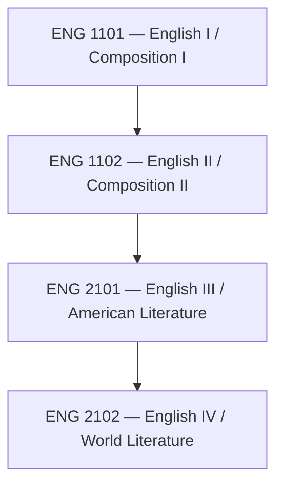

## Mathematics

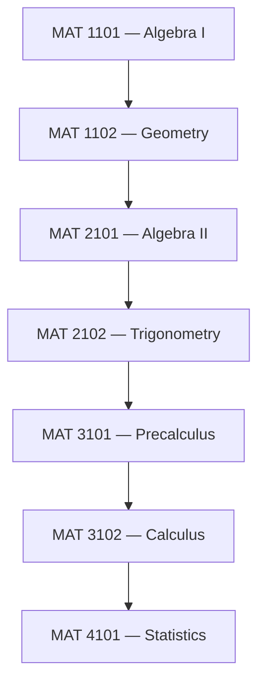

## Science

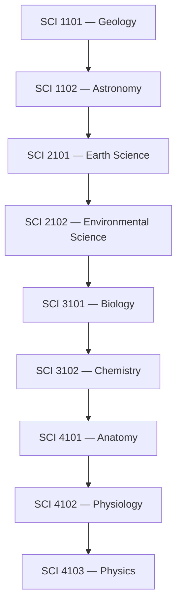

## History / Social Sciences

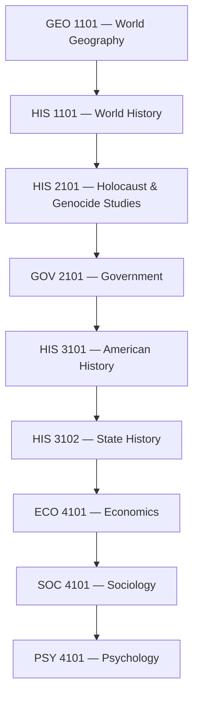

## Additional Social Studies


## Financial Education

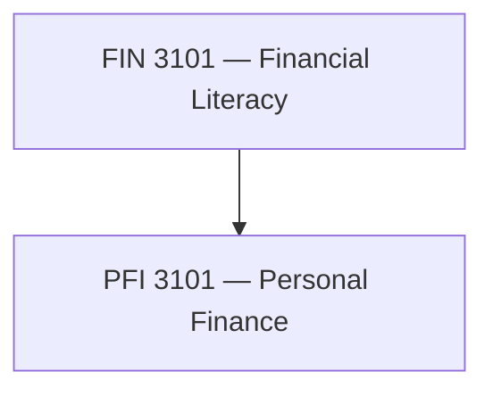

## Technology

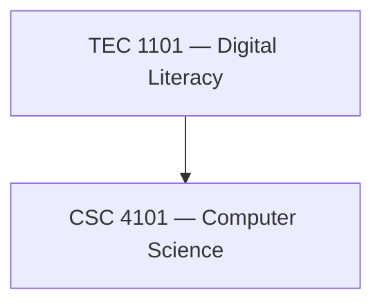

---

# STATE-COMPONENT COURSE MAP

| State Emoji | State | RIAH Course | Component Comments |
| --- | --- | --- | --- |
| 🔴 | Ohio | HLT 1101 | Applicable Ohio health instruction is mapped into Health. |
| 🔴 | Ohio | PED 2101 | Ohio physical-education content is mapped into Physical Education. |
| 🔴 | Ohio | GOV 2101 | Applicable Ohio government/civics content is mapped into Government. |
| 🔴 | Ohio | ART 2101 | Applicable Ohio fine-arts content is mapped into Fine Arts. |
| 🔴 | Ohio | FIN 3101 / PFI 3101 | Applicable Ohio financial-literacy/personal-finance content is covered through the financial sequence. |
| 🟠 | Arkansas | HIS 3102 | Arkansas History content is mapped into State History. |
| 🟠 | Arkansas | CSC 4101 | Applicable Arkansas computer-science content is mapped into Computer Science. |
| 🟠 | Arkansas | FIN 3101 / PFI 3101 | Applicable Arkansas financial instruction is mapped into the financial sequence. |
| 🟡 | Oklahoma | HIS 3102 | Oklahoma History is mapped into State History. |
| 🟡 | Oklahoma | GOV 2101 | Applicable Oklahoma government/civics content is mapped into Government. |
| 🟢 | California | ETH 4101 | Applicable California ethnic-studies content is mapped into Ethnic Studies. |
| 🟢 | California | FIN 3101 / PFI 3101 | Applicable California financial content is mapped into the financial sequence. |
| 🔵 | Illinois | HIS 2101 | Applicable Illinois Holocaust/genocide content is mapped into Holocaust & Genocide Studies. |
| 🟣 | Wisconsin | HLT 1101 | Applicable Wisconsin health instruction is mapped into Health. |
| 🟤 | Minnesota | HLT 1101 | Applicable Minnesota health instruction is mapped into Health. |
| 🟤 | Minnesota | PED 2101 | Applicable Minnesota physical-education content is mapped into Physical Education. |
| 🟤 | Minnesota | ART 2101 | Applicable Minnesota arts content is mapped into Fine Arts. |
| 🔺 | Texas | GOV 2101 | Applicable Texas government/civics content is mapped into Government. |
| 🔻 | Arizona | GOV 2101 | Applicable Arizona government/civics content is mapped into Government. |
| 🟦 | Connecticut | HLT 1101 | Applicable Connecticut health/safety content is mapped into Health. |

---

# HIGH SCHOOL DIPLOMA AVAILABILITY

| Delivery Category | States / Jurisdictions |
| --- | --- |
| **Virtual Only — RIAH High School Diploma Offered** | Alabama, Alaska, Arizona, Arkansas, California, Connecticut, Delaware, Florida, Georgia, Idaho, Illinois, Indiana, Iowa, Kansas, Kentucky, Louisiana, Michigan, Minnesota, Mississippi, Missouri, Montana, Nebraska, Nevada, New Hampshire, New Jersey, New Mexico, New York, North Carolina, North Dakota, Ohio, Oklahoma, Oregon, South Carolina, South Dakota, Tennessee, Texas, Utah, Vermont, Virginia, West Virginia, Wisconsin, Wyoming |
| **Physical / Hybrid — RIAH High School Diploma Not Offered Under Current Virtual-Only Model** | District of Columbia, Maine, Maryland, Massachusetts, Pennsylvania, Rhode Island, Washington, Hawaii |

---

# COMPLETE FOUR-YEAR FLOW

```mermaid
flowchart TD
    N0["RIAH PATHWAY; SECONDARY SCHOOL"]
    N1["VIRTUAL-ONLY; DELIVERY MODEL"]
    N2["GRADE 9; 30 CREDITS"]
    N3["English I / Composition I; Algebra I; Geology; World Geography; Digital Literacy"]
    N4["English II / Composition II; Geometry; Astronomy; World History; Health"]
    N5["GRADE 10; 30 CREDITS"]
    N6["English III / American Literature; Algebra II; Earth Science; Holocaust &amp; Genocide Studies; Physical Education"]
    N7["English IV / World Literature; Trigonometry; Environmental Science; Government; Fine Arts"]
    N8["GRADE 11; 30 CREDITS"]
    N9["Precalculus; Biology; American History; Financial Literacy; World Language I"]
    N10["Calculus; Chemistry; State History; World Language II; Personal Finance"]
    N11["GRADE 12; 30 CREDITS"]
    N12["Statistics; Anatomy; Economics; Computer Science; Ethnic Studies"]
    N13["Physiology; Physics; Sociology; Psychology; Oral Communication"]
    N14["40 FIXED COURSES"]
    N15["120 RIAH CREDIT HOURS"]
    N16["STATE CURRICULUM; COMPONENTS"]
    N17["STATE-SPECIFIC; GRADUATION CONTROLS; WHERE APPLICABLE"]
    N18["GRADUATION AUDIT"]
    N19["RIAH PATHWAY; HIGH SCHOOL DIPLOMA"]
    N0 --> N1
    N1 --> N2
    N2 --> N3
    N3 --> N4
    N4 --> N5
    N5 --> N6
    N6 --> N7
    N7 --> N8
    N8 --> N9
    N9 --> N10
    N10 --> N11
    N11 --> N12
    N12 --> N13
    N13 --> N14
    N14 --> N15
    N15 --> N16
    N16 --> N17
    N17 --> N18
    N18 --> N19
```# RIAH PATHWAY SECONDARY SCHOOL

# FOUR-YEAR HIGH SCHOOL DIPLOMA CURRICULUM

## State-Component Emoji Key

| Emoji | State |
| --- | --- |
| 🔴 | Ohio |
| 🟠 | Arkansas |
| 🟡 | Oklahoma |
| 🟢 | California |
| 🔵 | Illinois |
| 🟣 | Wisconsin |
| 🟤 | Minnesota |
| ⚪ | New York |
| 🔶 | New Jersey |
| 🔷 | Florida |
| 🔺 | Texas |
| 🔻 | Arizona |
| 🟩 | Oregon |
| 🟦 | Connecticut |
| 🟪 | Tennessee |
| 🟧 | Virginia |

| Academic Component | Credit / Semester Requirement |
| --- | --- |
| Curriculum | State emojis identify state-specific curriculum components within applicable courses. |
| 1 RIAH Course | **1 RIAH Course = 3 RIAH Credit Hours** |
| 5 Courses Per Semester | **5 Courses Per Semester = 15 Credit Hours** |
| 2 Semesters Per Academic Year | **2 Semesters Per Academic Year = 30 Credit Hours** |
| 4 Academic Years | **4 Academic Years = 120 RIAH Credit Hours** |
| 40 Fixed Courses | **40 Fixed Courses = 120 RIAH Credit Hours** |
| State-Component Emoji Key | **No unspecified electives.** |

---

# SCIENCE SEQUENCE

```mermaid
flowchart TD
    N0["Geology"]
    N1["Astronomy"]
    N2["Earth Science"]
    N3["Environmental Science"]
    N4["Biology"]
    N5["Chemistry"]
    N6["Anatomy"]
    N7["Physiology"]
    N8["Physics"]
    N0 --> N1
    N1 --> N2
    N2 --> N3
    N3 --> N4
    N4 --> N5
    N5 --> N6
    N6 --> N7
    N7 --> N8
```

---

# HISTORY / SOCIAL SCIENCE SEQUENCE


| HISTORY / SOCIAL SCIENCE SEQUENCE Component | HISTORY / SOCIAL SCIENCE SEQUENCE Requirement |
| --- | --- |
| HISTORY / SOCIAL SCIENCE SEQUENCE | **Ethnic Studies — Fixed Additional Social Studies Course** |

---

# GRADE 9 — FRESHMAN YEAR

## Semester 1

| Course | Course Title | Subject Area | Credits | Prerequisite Course | Prerequisite Course Title | Prerequisite Subject Area | Course Content | State Component | Component Comments |
| --- | --- | --- | --- | --- | --- | --- | --- | --- | --- |
| **ENG 1101** | English I / Composition I | English Language Arts | 3 | None | None | None | English Composition, Writing Fundamentals, Grammar and Usage, Sentence and Paragraph Development, Essay Development, Reading Comprehension, Vocabulary, Research Fundamentals, Written Communication | — | Fixed RIAH English composition course. |
| **MAT 1101** | Algebra I | Mathematics | 3 | None | None | None | Algebraic Expressions, Equations, Inequalities, Functions, Linear Equations, Systems of Equations, Polynomials, Factoring, Exponents | — | Fixed RIAH mathematics course. |
| **SCI 1101** | Geology | Earth Science | 3 | None | None | None | Earth Materials, Minerals, Rocks, Earth's Structure, Plate Tectonics, Geological Processes, Geological Time, Earth's Surface, Natural Resources, Geological Hazards | — | First science course. |
| **GEO 1101** | World Geography | Social Studies / Geography | 3 | None | None | None | Physical Geography, Human Geography, World Regions, Population, Culture, Political Geography, Economic Geography, Geographic Systems, Maps and Spatial Analysis, Human-Environment Relationships | — | First history/social-science course. |
| **TEC 1101** | Digital Literacy | Technology | 3 | None | None | None | Digital Literacy, Information Literacy, Media Literacy, Digital Citizenship, Internet Safety, Responsible Technology Use, Online Research, Digital Communication, Digital Productivity | State modules where applicable | State-specific digital/media-literacy content is mapped here. |
|  | **SEMESTER TOTAL** |  | **15** |  |  |  |  |  |  |

## Semester 2

| Course | Course Title | Subject Area | Credits | Prerequisite Course | Prerequisite Course Title | Prerequisite Subject Area | Course Content | State Component | Component Comments |
| --- | --- | --- | --- | --- | --- | --- | --- | --- | --- |
| **ENG 1102** | English II / Composition II | English Language Arts | 3 | ENG 1101 | English I / Composition I | English Language Arts | Advanced Composition, Expository Writing, Argumentative Writing, Narrative Writing, Research Writing, Reading Analysis, Grammar and Usage, Written Communication, Source Evaluation | — | Fixed RIAH English composition course. |
| **MAT 1102** | Geometry | Mathematics | 3 | MAT 1101 | Algebra I | Mathematics | Geometric Reasoning, Lines, Angles, Triangles, Polygons, Circles, Congruence, Similarity, Coordinate Geometry, Area, Surface Area, Volume | — | Fixed RIAH mathematics course. |
| **SCI 1102** | Astronomy | Earth / Space Science | 3 | SCI 1101 | Geology | Earth Science | Solar System, Stars, Galaxies, Universe, Planetary Science, Space Observation, Earth-Space Relationships, Astronomical Measurement | — | Second science course. |
| **HIS 1101** | World History | History | 3 | GEO 1101 | World Geography | Social Studies / Geography | World History, World Civilizations, Global Historical Development, Human Rights | State modules where applicable | Applicable state historical content is mapped here. |
| **HLT 1101 🔴🟣🟤🟦** | Health | Health | 3 | None | None | None | Health, Nutrition, Physical Wellness, Mental and Emotional Health, Disease Prevention, Substance-Abuse Prevention, Personal Health, Community Health, Safety, First Aid, CPR, AED | 🔴 Ohio, 🟣 Wisconsin, 🟤 Minnesota, 🟦 Connecticut | Applicable state health and safety content is mapped here. |
|  | **SEMESTER TOTAL** |  | **15** |  |  |  |  |  |  |

### Grade 9 Total: **30 Credit Hours**


---

# GRADE 10 — SOPHOMORE YEAR

## Semester 1

| Course | Course Title | Subject Area | Credits | Prerequisite Course | Prerequisite Course Title | Prerequisite Subject Area | Course Content | State Component | Component Comments |
| --- | --- | --- | --- | --- | --- | --- | --- | --- | --- |
| **ENG 2101** | English III / American Literature | English Language Arts | 3 | ENG 1102 | English II / Composition II | English Language Arts | American Literature, American Literary Movements, Fiction, Nonfiction, Poetry, Drama, Literary Analysis, Analytical Writing, Research Writing, Vocabulary, Written Communication | — | Fixed RIAH American-literature course. |
| **MAT 2101** | Algebra II | Mathematics | 3 | MAT 1102 | Geometry | Mathematics | Advanced Algebra, Functions, Quadratic Functions, Polynomial Functions, Rational Expressions, Radical Expressions, Exponential Functions, Logarithmic Functions | — | Fixed RIAH mathematics course. |
| **SCI 2101** | Earth Science | Earth Science | 3 | SCI 1102 | Astronomy | Earth / Space Science | Earth Systems, Atmosphere, Hydrosphere, Weather, Climate, Oceans, Earth's Resources, Earth-System Interactions | — | Third science course. |
| **HIS 2101 🔵🟢** | Holocaust & Genocide Studies | History / Social Studies | 3 | HIS 1101 | World History | History | Holocaust Studies, Antisemitism, Nazi Germany, Holocaust History, Genocide Studies, Comparative Genocide, Human Rights, Prevention of Genocide, Historical Memory | 🔵 Illinois, 🟢 California | Applicable Holocaust/genocide components are mapped here. |
| **PED 2101 🔴🟤** | Physical Education | Physical Education | 3 | None | None | None | Physical Fitness, Cardiovascular Fitness, Strength, Flexibility, Movement, Wellness, Personal Fitness Planning, Lifetime Physical Activity | 🔴 Ohio, 🟤 Minnesota | Applicable physical-education requirements are covered here. |
|  | **SEMESTER TOTAL** |  | **15** |  |  |  |  |  |  |

## Semester 2

| Course | Course Title | Subject Area | Credits | Prerequisite Course | Prerequisite Course Title | Prerequisite Subject Area | Course Content | State Component | Component Comments |
| --- | --- | --- | --- | --- | --- | --- | --- | --- | --- |
| **ENG 2102** | English IV / World Literature | English Language Arts | 3 | ENG 2101 | English III / American Literature | English Language Arts | World Literature, Global Literary Traditions, Fiction, Nonfiction, Poetry, Drama, Comparative Literature, Literary Analysis, Advanced Writing, Research Writing, Written Communication | — | Fixed RIAH world-literature course. |
| **MAT 2102** | Trigonometry | Mathematics | 3 | MAT 2101 | Algebra II | Mathematics | Trigonometric Functions, Angles, Right-Triangle Trigonometry, Unit Circle, Graphs, Identities, Equations, Applications | — | Fixed RIAH mathematics course. |
| **SCI 2102** | Environmental Science | Environmental Science | 3 | SCI 2101 | Earth Science | Earth Science | Ecosystems, Natural Resources, Biodiversity, Pollution, Climate, Sustainability, Human Environmental Impact, Conservation | — | Fourth science course. |
| **GOV 2101 🔴🟡🔺🔻** | Government | Government / Civics | 3 | HIS 2101 | Holocaust & Genocide Studies | History / Social Studies | United States Government, American Government, Civics, Citizenship, Constitutional Government, Federal Government, State Government, Local Government, Founding Principles, Rights and Responsibilities | 🔴 Ohio, 🟡 Oklahoma, 🔺 Texas, 🔻 Arizona | Applicable government and civics components are mapped here. |
| **ART 2101 🔴🟤** | Fine Arts | Fine Arts | 3 | None | None | None | Visual Art, Music, Theatre, Fine Arts Appreciation, Artistic Expression, Arts History | 🔴 Ohio, 🟤 Minnesota | Applicable state fine-arts content is covered here. |
|  | **SEMESTER TOTAL** |  | **15** |  |  |  |  |  |  |

### Grade 10 Total: **30 Credit Hours**


---

# GRADE 11 — JUNIOR YEAR

## Semester 1

| Course | Course Title | Subject Area | Credits | Prerequisite Course | Prerequisite Course Title | Prerequisite Subject Area | Course Content | State Component | Component Comments |
| --- | --- | --- | --- | --- | --- | --- | --- | --- | --- |
| **MAT 3101** | Precalculus | Mathematics | 3 | MAT 2102 | Trigonometry | Mathematics | Functions, Polynomial Functions, Rational Functions, Exponential Functions, Logarithmic Functions, Advanced Trigonometry, Analytic Geometry, Sequences | — | Fixed RIAH mathematics course. |
| **SCI 3101** | Biology | Life Science | 3 | SCI 2102 | Environmental Science | Environmental Science | Cell Biology, Genetics, Evolution, Ecology, Organisms, Biological Systems, Molecular Biology, Biological Diversity | — | Biology begins the biological-science portion of the sequence. |
| **HIS 3101** | American History | American History | 3 | GOV 2101 | Government | Government / Civics | United States History, Colonial America, American Revolution, Founding of the United States, Constitutional History, Civil War and Reconstruction, Industrialization, Modern U.S. History, Civil Rights History | State modules where applicable | American History remains separate from State History. |
| **FIN 3101 🔴🟢🟠** | Financial Literacy | Financial Literacy | 3 | None | None | None | Financial Decision-Making, Banking Fundamentals, Credit Fundamentals, Debt Literacy, Saving, Investing Fundamentals, Insurance Literacy, Consumer Financial Literacy | 🔴 Ohio, 🟢 California, 🟠 Arkansas | Applicable state financial-literacy content is mapped here. |
| **LAN 3101** | World Language I | World Language | 3 | None | None | None | Spanish, French, German, or Italian Level I; Vocabulary, Grammar, Reading, Writing, Listening, Speaking, Culture | — | Student selects one language. |
|  | **SEMESTER TOTAL** |  | **15** |  |  |  |  |  |  |

## Semester 2

| Course | Course Title | Subject Area | Credits | Prerequisite Course | Prerequisite Course Title | Prerequisite Subject Area | Course Content | State Component | Component Comments |
| --- | --- | --- | --- | --- | --- | --- | --- | --- | --- |
| **MAT 3102** | Calculus | Mathematics | 3 | MAT 3101 | Precalculus | Mathematics | Limits, Continuity, Derivatives, Applications of Derivatives, Integrals, Applications of Integrals, Fundamental Theorem of Calculus | — | Fixed RIAH mathematics course. |
| **SCI 3102** | Chemistry | Physical Science | 3 | SCI 3101 | Biology | Life Science | Matter, Atomic Structure, Periodic Relationships, Chemical Bonding, Chemical Reactions, Stoichiometry, Solutions, Acids and Bases, Chemical Energy | — | Chemistry follows Biology. |
| **HIS 3102 🟡🟠** | State History | State History | 3 | HIS 3101 | American History | American History | State History, State Founding and Development, State Constitution, State Government History, State Geography, State Economy, State Cultural History, State Civil Rights History, Native American/Tribal/Indigenous History, Major State Events, State Historical Figures | 🟡 Oklahoma, 🟠 Arkansas | Every student studies the history of their own state; identified state-specific components are mapped here. |
| **LAN 3102** | World Language II | World Language | 3 | LAN 3101 | World Language I | World Language | Continuation of selected language; Intermediate Vocabulary, Grammar, Reading, Writing, Listening, Speaking, Culture | — | Student continues the same language. |
| **PFI 3101 🔴🟢🟠** | Personal Finance | Personal Finance | 3 | FIN 3101 | Financial Literacy | Financial Literacy | Personal Budgeting, Income, Banking, Credit Management, Debt Management, Saving, Investing, Insurance, Taxes, Housing, Consumer Decision-Making, Financial Responsibility | 🔴 Ohio, 🟢 California, 🟠 Arkansas | Applicable state personal-finance components are mapped here. |
|  | **SEMESTER TOTAL** |  | **15** |  |  |  |  |  |  |

### Grade 11 Total: **30 Credit Hours**

### Concurrent Enrollment

| Concurrent Enrollment Component | Concurrent Enrollment Requirement |
| --- | --- |
| General Education | Eligible Grade 11 students may begin applicable RIAH Pathway General Education coursework concurrently with the high-school curriculum. |


---

# GRADE 12 — SENIOR YEAR

## Semester 1

| Course | Course Title | Subject Area | Credits | Prerequisite Course | Prerequisite Course Title | Prerequisite Subject Area | Course Content | State Component | Component Comments |
| --- | --- | --- | --- | --- | --- | --- | --- | --- | --- |
| **MAT 4101** | Statistics | Mathematics | 3 | MAT 2101 | Algebra II | Mathematics | Descriptive Statistics, Probability, Distributions, Sampling, Data Analysis, Correlation, Regression, Statistical Inference | — | Fixed RIAH mathematics course. |
| **SCI 4101** | Anatomy | Life Science | 3 | SCI 3101 | Biology | Life Science | Anatomical Terminology, Cells and Tissues, Skeletal System, Muscular System, Nervous System, Cardiovascular Structures, Respiratory Structures, Digestive Structures, Endocrine Structures, Human Body Organization | — | Anatomy follows Biology and Chemistry in the overall sequence. |
| **ECO 4101** | Economics | Economics | 3 | HIS 3102 | State History | State History | Economic Systems, Microeconomics, Macroeconomics, Supply and Demand, Markets, Labor, Banking, Fiscal Policy, Monetary Policy, International Economics, Consumer Economics | — | Economics follows the core history/government sequence. |
| **CSC 4101 🟠** | Computer Science | Computer Science | 3 | TEC 1101 | Digital Literacy | Technology | Computer Science Principles, Algorithms, Programming Fundamentals, Data, Computing Systems, Networks, Cybersecurity Fundamentals, Responsible Computing | 🟠 Arkansas | Applicable Arkansas computer-science content is mapped here. |
| **ETH 4101 🟢** | Ethnic Studies | Social Studies | 3 | HIS 3101 | American History | American History | Ethnic Studies, Race and Ethnicity in the United States, Cultural History, Cultural Contributions, Historical Experiences of Diverse Communities, Civil Rights and Social Change, Comparative Cultural Studies | 🟢 California | Applicable California ethnic-studies content is mapped here. |
|  | **SEMESTER TOTAL** |  | **15** |  |  |  |  |  |  |

## Semester 2

| Course | Course Title | Subject Area | Credits | Prerequisite Course | Prerequisite Course Title | Prerequisite Subject Area | Course Content | State Component | Component Comments |
| --- | --- | --- | --- | --- | --- | --- | --- | --- | --- |
| **SCI 4102** | Physiology | Life Science | 3 | SCI 4101 | Anatomy | Life Science | Cellular Physiology, Nervous-System Function, Muscular Function, Cardiovascular Function, Respiratory Function, Digestive Function, Endocrine Function, Homeostasis, Human Body-System Integration | — | Physiology directly follows Anatomy. |
| **SCI 4103** | Physics | Physical Science | 3 | SCI 3102 + MAT 2101 | Chemistry + Algebra II | Physical Science + Mathematics | Motion, Forces, Energy, Momentum, Waves, Electricity, Magnetism, Light, Introductory Modern Physics | — | Physics is the culminating physical-science course. |
| **SOC 4101** | Sociology | Social Science | 3 | ECO 4101 | Economics | Economics | Sociological Perspectives, Culture, Socialization, Social Institutions, Groups, Communities, Social Stratification, Social Change, Society and Human Interaction | — | Sociology follows Economics. |
| **PSY 4101** | Psychology | Social Science | 3 | SOC 4101 | Sociology | Social Science | Foundations of Psychology, Human Development, Learning, Memory, Cognition, Motivation, Emotion, Personality, Social Psychology, Human Behavior | — | Psychology follows Sociology. |
| **COM 4101** | Oral Communication | Communication | 3 | ENG 2102 | English IV / World Literature | English Language Arts | Oral Communication, Public Speaking, Presentation Skills, Audience Analysis, Speech Organization, Verbal Communication, Nonverbal Communication, Persuasive Speaking | — | Fixed RIAH oral-communication course. |
|  | **SEMESTER TOTAL** |  | **15** |  |  |  |  |  |  |

# STATE-SPECIFIC GRADUATION CONTROLS

| State Component | Graduation Control |
| --- | --- |
| **🟠 Arkansas** | **Arkansas Civics Exam — passing score of at least 60%.** |
| **🟠 Arkansas** | **CPR training.** |
| **🟠 Arkansas** | **75 documented community-service hours in Grades 9–12 beginning with the graduating class of 2027 under the Arkansas public-school requirement.** |
| **🟠 Arkansas** | **One credit of approved Computer Science or qualifying computer-science-related CTE beginning with 2026 graduates under the Arkansas public-school framework.** RIAH maps the academic component to **CSC 4101 — Computer Science**. |
| **🟠 Arkansas** | **Course credit incorporating Personal and Family Finance standards.** RIAH maps this through **FIN 3101 — Financial Literacy** and **PFI 3101 — Personal Finance**. |
| **🔻 Arizona** | **Arizona Civics Test — 70/100 minimum for students graduating in 2026 and later.** |
| **🔴 Ohio** | **Financial Literacy — ½ credit for students entering Grade 9 on or after July 1, 2022.** RIAH maps this through **FIN 3101 — Financial Literacy**. |
| **🔴 Ohio** | **Ohio diploma-readiness requirements/seals where applicable to the student's governing graduation framework.** Ohio's current long-term framework requires two diploma seals, including at least one state-defined seal. |
| **Other RIAH Virtual States** | Additional state-specific examinations, demonstrations, service requirements, documentation, or other non-course graduation controls will be added to this table as each state's curriculum/graduation audit is completed. |

### Grade 12 Total: **30 Credit Hours**


---

# FOUR-YEAR FIXED CREDIT STRUCTURE

| Grade | Semester 1 Courses | Semester 1 Credits | Semester 2 Courses | Semester 2 Credits | Annual Credits |
| --- | --- | --- | --- | --- | --- |
| **Grade 9** | 5 | 15 | 5 | 15 | **30** |
| **Grade 10** | 5 | 15 | 5 | 15 | **30** |
| **Grade 11** | 5 | 15 | 5 | 15 | **30** |
| **Grade 12** | 5 | 15 | 5 | 15 | **30** |
| **TOTAL** | **20** | **60** | **20** | **60** | **120** |

| Academic Component | Credit / Semester Requirement |
| --- | --- |
| FOUR-YEAR FIXED CREDIT STRUCTURE | **40 Fixed Courses** |
| FOUR-YEAR FIXED CREDIT STRUCTURE | **120 RIAH Credit Hours** |
| FOUR-YEAR FIXED CREDIT STRUCTURE | **No unspecified electives** |
| Curriculum | **No Senior Capstone in the current high-school curriculum** |

---

# SUBJECT SEQUENCES

## English


## Mathematics

```mermaid
flowchart TD
    N0["MAT 1101 — Algebra I"]
    N1["MAT 1102 — Geometry"]
    N2["MAT 2101 — Algebra II"]
    N3["MAT 2102 — Trigonometry"]
    N4["MAT 3101 — Precalculus"]
    N5["MAT 3102 — Calculus"]
    N6["MAT 4101 — Statistics"]
    N0 --> N1
    N1 --> N2
    N2 --> N3
    N3 --> N4
    N4 --> N5
    N5 --> N6
```

## Science

```mermaid
flowchart TD
    N0["SCI 1101 — Geology"]
    N1["SCI 1102 — Astronomy"]
    N2["SCI 2101 — Earth Science"]
    N3["SCI 2102 — Environmental Science"]
    N4["SCI 3101 — Biology"]
    N5["SCI 3102 — Chemistry"]
    N6["SCI 4101 — Anatomy"]
    N7["SCI 4102 — Physiology"]
    N8["SCI 4103 — Physics"]
    N0 --> N1
    N1 --> N2
    N2 --> N3
    N3 --> N4
    N4 --> N5
    N5 --> N6
    N6 --> N7
    N7 --> N8
```

## History / Social Sciences

```mermaid
flowchart TD
    N0["GEO 1101 — World Geography"]
    N1["HIS 1101 — World History"]
    N2["HIS 2101 — Holocaust &amp; Genocide Studies"]
    N3["GOV 2101 — Government"]
    N4["HIS 3101 — American History"]
    N5["HIS 3102 — State History"]
    N6["ECO 4101 — Economics"]
    N7["SOC 4101 — Sociology"]
    N8["PSY 4101 — Psychology"]
    N0 --> N1
    N1 --> N2
    N2 --> N3
    N3 --> N4
    N4 --> N5
    N5 --> N6
    N6 --> N7
    N7 --> N8
```

## Additional Social Studies

```mermaid
flowchart TD
    N0["ETH 4101 — Ethnic Studies"]

```

## Financial Education

```mermaid
flowchart TD
    N0["FIN 3101 — Financial Literacy"]
    N1["PFI 3101 — Personal Finance"]
    N0 --> N1
```

## Technology

```mermaid
flowchart TD
    N0["TEC 1101 — Digital Literacy"]
    N1["CSC 4101 — Computer Science"]
    N0 --> N1
```

---

# STATE-COMPONENT COURSE MAP

| State Emoji | State | RIAH Course | Component Comments |
| --- | --- | --- | --- |
| 🔴 | Ohio | HLT 1101 | Applicable Ohio health instruction is mapped into Health. |
| 🔴 | Ohio | PED 2101 | Ohio physical-education content is mapped into Physical Education. |
| 🔴 | Ohio | GOV 2101 | Applicable Ohio government/civics content is mapped into Government. |
| 🔴 | Ohio | ART 2101 | Applicable Ohio fine-arts content is mapped into Fine Arts. |
| 🔴 | Ohio | FIN 3101 / PFI 3101 | Applicable Ohio financial-literacy/personal-finance content is covered through the financial sequence. |
| 🟠 | Arkansas | HIS 3102 | Arkansas History content is mapped into State History. |
| 🟠 | Arkansas | CSC 4101 | Applicable Arkansas computer-science content is mapped into Computer Science. |
| 🟠 | Arkansas | FIN 3101 / PFI 3101 | Applicable Arkansas financial instruction is mapped into the financial sequence. |
| 🟡 | Oklahoma | HIS 3102 | Oklahoma History is mapped into State History. |
| 🟡 | Oklahoma | GOV 2101 | Applicable Oklahoma government/civics content is mapped into Government. |
| 🟢 | California | ETH 4101 | Applicable California ethnic-studies content is mapped into Ethnic Studies. |
| 🟢 | California | FIN 3101 / PFI 3101 | Applicable California financial content is mapped into the financial sequence. |
| 🔵 | Illinois | HIS 2101 | Applicable Illinois Holocaust/genocide content is mapped into Holocaust & Genocide Studies. |
| 🟣 | Wisconsin | HLT 1101 | Applicable Wisconsin health instruction is mapped into Health. |
| 🟤 | Minnesota | HLT 1101 | Applicable Minnesota health instruction is mapped into Health. |
| 🟤 | Minnesota | PED 2101 | Applicable Minnesota physical-education content is mapped into Physical Education. |
| 🟤 | Minnesota | ART 2101 | Applicable Minnesota arts content is mapped into Fine Arts. |
| 🔺 | Texas | GOV 2101 | Applicable Texas government/civics content is mapped into Government. |
| 🔻 | Arizona | GOV 2101 | Applicable Arizona government/civics content is mapped into Government. |
| 🟦 | Connecticut | HLT 1101 | Applicable Connecticut health/safety content is mapped into Health. |

---

# HIGH SCHOOL DIPLOMA AVAILABILITY

| Delivery Category | States / Jurisdictions |
| --- | --- |
| **Virtual Only — RIAH High School Diploma Offered** | Alabama, Alaska, Arizona, Arkansas, California, Connecticut, Delaware, Florida, Georgia, Idaho, Illinois, Indiana, Iowa, Kansas, Kentucky, Louisiana, Michigan, Minnesota, Mississippi, Missouri, Montana, Nebraska, Nevada, New Hampshire, New Jersey, New Mexico, New York, North Carolina, North Dakota, Ohio, Oklahoma, Oregon, South Carolina, South Dakota, Tennessee, Texas, Utah, Vermont, Virginia, West Virginia, Wisconsin, Wyoming |
| **Physical / Hybrid — RIAH High School Diploma Not Offered Under Current Virtual-Only Model** | District of Columbia, Maine, Maryland, Massachusetts, Pennsylvania, Rhode Island, Washington, Hawaii |

---

# COMPLETE FOUR-YEAR FLOW

```mermaid
flowchart TD
    N0["RIAH PATHWAY; SECONDARY SCHOOL"]
    N1["VIRTUAL-ONLY; DELIVERY MODEL"]
    N2["GRADE 9; 30 CREDITS"]
    N3["English I / Composition I; Algebra I; Geology; World Geography; Digital Literacy"]
    N4["English II / Composition II; Geometry; Astronomy; World History; Health"]
    N5["GRADE 10; 30 CREDITS"]
    N6["English III / American Literature; Algebra II; Earth Science; Holocaust &amp; Genocide Studies; Physical Education"]
    N7["English IV / World Literature; Trigonometry; Environmental Science; Government; Fine Arts"]
    N8["GRADE 11; 30 CREDITS"]
    N9["Precalculus; Biology; American History; Financial Literacy; World Language I"]
    N10["Calculus; Chemistry; State History; World Language II; Personal Finance"]
    N11["GRADE 12; 30 CREDITS"]
    N12["Statistics; Anatomy; Economics; Computer Science; Ethnic Studies"]
    N13["Physiology; Physics; Sociology; Psychology; Oral Communication"]
    N14["40 FIXED COURSES"]
    N15["120 RIAH CREDIT HOURS"]
    N16["STATE CURRICULUM; COMPONENTS"]
    N17["STATE-SPECIFIC; GRADUATION CONTROLS; WHERE APPLICABLE"]
    N18["GRADUATION AUDIT"]
    N19["RIAH PATHWAY; HIGH SCHOOL DIPLOMA"]
    N0 --> N1
    N1 --> N2
    N2 --> N3
    N3 --> N4
    N4 --> N5
    N5 --> N6
    N6 --> N7
    N7 --> N8
    N8 --> N9
    N9 --> N10
    N10 --> N11
    N11 --> N12
    N12 --> N13
    N13 --> N14
    N14 --> N15
    N15 --> N16
    N16 --> N17
    N17 --> N18
    N18 --> N19
```

