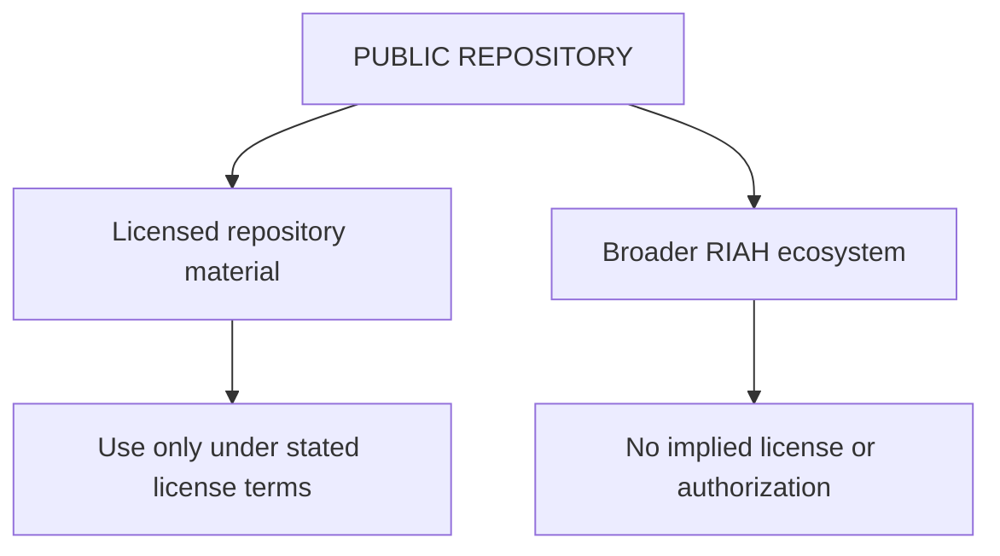

# ⚠️ RIAH Ecosystem — Public Repository Notice

> **Publicly viewable does not mean unrestricted.**
>
> This repository may expose public-facing website materials for transparency, reference, development, or permitted open-source use. That visibility does **not** grant permission to reproduce, clone, misappropriate, falsely represent, or commercially exploit the broader RIAH ecosystem.

## Scope

| Material | General Status |
|---|---|
| Public website code or files | Governed by the repository's stated license |
| Original text, graphics, documentation, and source code | Copyright rights may apply |
| RIAH names, marks, branding, and source-identifying presentation | Trademark and trade-dress rights may apply |
| Nonpublic software architecture, workflows, pricing logic, curriculum implementation, automation, internal processes, and confidential compilations | Trade-secret, contract, and other rights may apply where legal requirements are satisfied |
| Ideas, systems, methods, procedures, standards, facts, and other unprotectable material | No ownership is claimed beyond rights recognized by applicable law |

## Open Source ≠ Open Ecosystem

An open-source license applies only to the material actually released under that license and only on the terms stated in that license.

It does **not**, by itself:

- license unreleased or confidential RIAH materials;
- authorize use of RIAH trademarks or imply affiliation, sponsorship, or approval;
- transfer ownership of copyrights, trade secrets, patents, confidential information, or other intellectual property;
- waive contractual or confidentiality obligations; or
- authorize copying of protected expression outside the scope of the applicable license.

## Rights Reserved

RIAH reserves all rights not expressly granted. Where supported by the actual facts and applicable law, unauthorized conduct may implicate copyright, trademark, trade dress, trade-secret, contract, unfair-competition, patent, computer-access, or related legal protections.

RIAH maintains development records, version history, source materials, repository history, documentation, and other evidence capable of establishing chronology and ownership.

**Similarity alone is not treated as proof of infringement or misappropriation. Any enforcement decision must be based on claim-specific facts, evidence, and applicable law.**

## Notice

**Do not interpret public access to this repository or website as permission to replicate the RIAH ecosystem.** If you use licensed repository material, comply with the applicable license and preserve all notices required by it.

---

**Copyright © RIAH. All rights reserved except where expressly licensed.**

*This README is a rights-reservation notice and is not legal advice. Any legal claim depends on the specific facts, protected material, applicable license or agreement, jurisdiction, and current law.*
