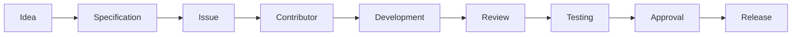

# DEVELOPMENT PRIORITIES, APPLICATIONS AND SUPPORT

## LXIII. 🚧 CURRENT DEVELOPMENT PRIORITIES

Public development priorities may include:

| # | Item |
|---:|---|
| 1 | Website Version 1 |
| 2 | Pages 01–13 |
| 3 | Wireframes |
| 4 | Designed wireframes |
| 5 | Mobile responsiveness |
| 6 | Accessibility |
| 7 | Pricing Engine |
| 8 | Images |
| 9 | Videos |
| 10 | Documents |
| 11 | Downloads |
| 12 | Admissions materials |
| 13 | Tuition materials |
| 14 | Curriculum presentation |
| 15 | Accreditation documentation |
| 16 | Join Us materials |
| 17 | Products |
| 18 | Experiential resources |
| 19 | testing |
| 20 | launch preparation |

---

## LXIV. 🎯 GOAL

The goal is to create a contribution-ready public-development environment where approved RIAH specifications can move through:



while maintaining a clear boundary between public development and private RIAH intellectual property.

---

## LXV. 📅 APPLICATIONS AND ADMISSIONS

## 💼 Employment and Team Applications

RIAH's broader public recruitment and application activity begins during the applicable launch and hiring periods published by RIAH.

Applications are planned to be available beginning in October 2026.

Specific positions may have their own opening dates, application deadlines, interview periods, and start dates.

Applicants should follow the applicable individual job posting for the position they are seeking.

## 🎓 Student Admissions

RIAH Pathway student admissions are also planned to open in October 2026 in connection with the launch of RIAH Pathway Website Version 1.

The public website will provide applicable pathway, curriculum, tuition, admissions, resource, and enrollment information students need to begin the process.

---

---

# RIAH PATHWAY PARTICIPATION AND SCALE

## LXXI. 👑 BUILD WITH US. TEACH WITH US. GROW WITH US.

There are several ways to participate in what RIAH is building.

| Path | Content |
|---|---|
| 🧑‍💻 CONTRIBUTE | Help build the public website, wireframes, calculator, documentation, media, resources, applications, and digital ecosystem. Qualifying Community and GitHub Contributors may qualify for **UP TO 25% TUITION REDUCTION** and **25% OFF ELIGIBLE RIAH PRODUCTS**, subject to applicable RIAH contributor requirements and tuition-reduction rules. |
| 👨‍🏫 TEACH | Apply for applicable PhD Core Academic Faculty, Adjunct Faculty, Dean, Experiential Supervisor, Experiential Manager, and Experiential Reviewer opportunities within the established RIAH organizational structure. |
| 💼 JOIN THE TEAM | Apply for applicable Executive Leadership, Technology Architecture and Development, Cybersecurity, Experiential, Program Management, Project Management, Academic Leadership, PhD Core Academic Faculty, and Adjunct Faculty positions within the 173-person at-scale internal team. Eligible Team Members receive **$0 RIAH EDUCATION TUITION** and **50% OFF ELIGIBLE RIAH PRODUCTS** under applicable Team Member benefit requirements. |
| 🏛️ GOVERN | Explore applicable opportunities within the six-member Board structure. |
| 🤝 PARTNER | Explore professional, employer, education, Experiential, community, legal, technology, and organizational partnership opportunities. |
| ❤️ DONATE | Support scholarships, grants, stipends, accreditation, authorization, educational resources, technology, Experiential education, and community development. |
| 🎓 ENROLL | Explore RIAH Pathway admissions beginning with the applicable October 2026 Version 1 launch period. |

---

## LXXII. 👑 RIAH PATHWAY AT SCALE

The established ecosystem model is:

173-Person Fixed Internal Team

supporting an at-scale Experiential structure designed for:

1,000 Experiential Participants

with:

40 Supervisors

+ 40 Managers

+ 40 Reviewers

and an academic structure containing:

14 PhD Core Academic Faculty

+ 14 Adjunct Faculty

+ 5 Deans

+ 4 Program Managers

+ 4 Project Managers

alongside:

CTO + CISO + Technology + Cybersecurity

+ RIAH App + Mobile App + Ecosystem Software + Website

+ Automation + APIs + AI + Data + Dashboards

+ RIAH Pathway Entity Ecosystem

= RIAH Pathway — Human-Led, Technology-Supported, 1:25 At-Scale Ecosystem

---

## LXXIII. 👑 COMPLETE DEVELOPMENT MODEL

```text
RIAH Private Company and IP
              │
              ↓
Approved Public Specifications
              │
              ↓
GitHub Repository
              │
      ┌───────┼────────┐
      ↓       ↓        ↓
    Issues  Projects  Discussions
      │       │        │
      └───────┼────────┘
              ↓
       Public Contributors
              ↓
     Branches and Pull Requests
              ↓
        RIAH Review
              ↓
      Testing and Approval
              ↓
       Public Website
              ↓
      RIAH Ecosystem V1+
```

---

# 📬 CONTACT RIAH

## 👑 RIAH PATHWAY

| Icon | Contact | Information |
|---|---|---|
| 🌐 | Website | RIAHPathway.com |
| ✉️ | General Email | contact@riahpathway.com |
| 💼 | Careers | careers@RIAHPathway.com |
| 👥 | Human Resources | hr@RIAHPathway.com |
| ❤️ | Donations | donations@RIAHPathway.com |
| 🏅 | Accreditation | accreditation@RIAHPathway.com |
| ☎️ | Phone | (877) 245-RIAH |
| 📍 | Address | RIAH Pathway, 4807 Rockside Rd, Suite 400, Independence, OH 44131 |
| 📱 | Social Media | Facebook · LinkedIn · Threads · Instagram · X · YouTube · Pinterest |
# 👑 RIAH PATHWAY

Private company IP. Public development where approved. Structured contribution. Human review. GitHub-managed implementation.

Built from an original vision. Built in public. Supported by contributors. Designed to create pathways for students, professionals, employers, partners, and communities.
