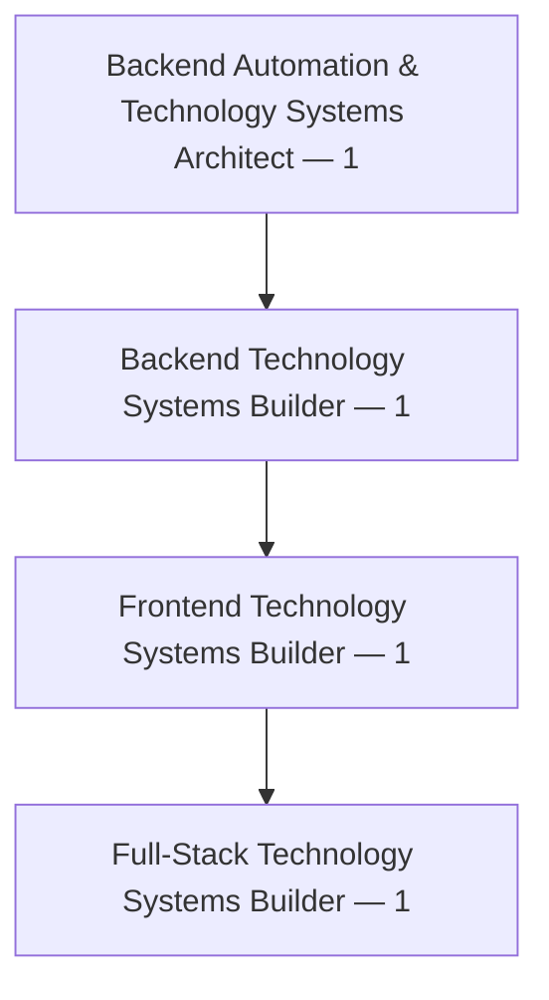
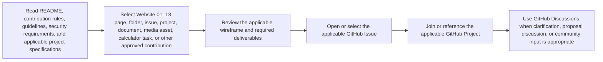
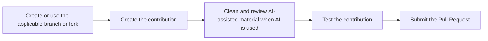
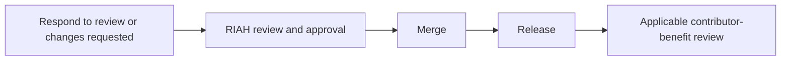
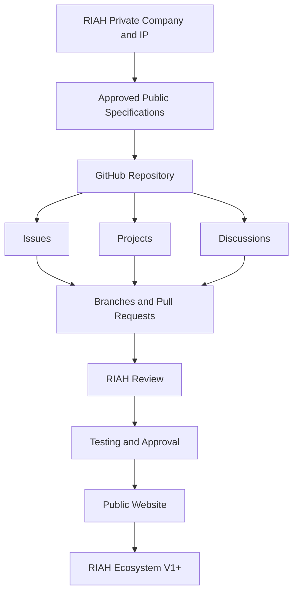
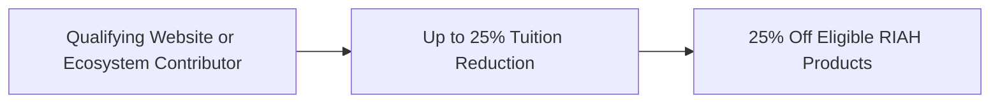
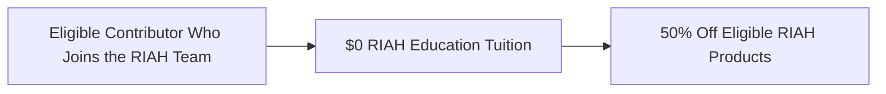
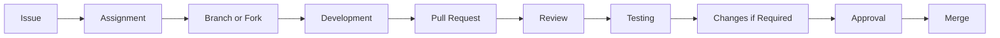

**Contributor; Mariah Dominique Rucker**

There is currently no team. I am building everything myself until I have hired the beta team. I am starting the hiring process this month, **October 2026**, for the CTO, CISO, experiential professionals, PhD-qualified faculty, and adjunct faculty for each school and major, with hiring continuing across the entire ecosystem as it scales.

Beta team members will be hired with **equity participation and compensation during the beta cohort**, which launches in **Spring 2027**.

The website will launch in **October 2026** as I continue to build, develop, revise, and finalize aspects of the RIAH Pathway ecosystem.

Learn more about me on GitHub and LinkedIn, or connect with me through social media and Linktree.

- **GitHub:** https://github.com/mariahdominiquerucker
- **LinkedIn:** https://linkedin.com/in/mariahrucker
- **Facebook:** https://facebook.com/heymariahrucker
- **Instagram:** https://instagram.com/heymariahrucker
- **Linktree:** https://linktr.ee/mariahrucker

---

### 🤝 CONTRIBUTOR QUICK START

RIAH's public GitHub contribution environment is not limited to software developers. Contributors may work on approved portions of the Website 01–13, wireframes, media, documents, public curriculum architecture, Pricing Engine, accessibility, testing, technology documentation, and other contribution-ready materials.

> ### 🎓 QUALIFYING CONTRIBUTOR BENEFIT
> **UP TO 25% RIAH PATHWAY TUITION REDUCTION + 25% OFF ELIGIBLE RIAH PRODUCTS**
>
> Contribution qualification and benefit determination remain subject to RIAH review and established contributor requirements. A contribution or Pull Request does not automatically create a 25% tuition reduction.

### Technology Architecture and Development — 4



CTO + 4 FUNCTIONAL TECHNOLOGY ROLES
CTO = Executive Leader · Not Primary Builder
> AI-assisted work may be proposed where applicable. Contributors remain responsible for cleaning, reviewing, correcting, testing, and ensuring that submitted images, videos, documents, code, designs, scripts, and other materials meet applicable RIAH quality, contribution, ownership, security, and approval requirements.

### 🌐 CONTRIBUTE ACROSS THE ENTIRE WEBSITE

Contributors can help with approved public-development work across **all Website Pages 01–13**.

Contribution is not limited to coding or development. Contributors can review the website, identify opportunities, suggest improvements, contribute content, create or improve resources, propose processes, identify issues, submit Pull Requests, and propose or help establish Projects that support completion and quality of the RIAH Pathway website.

Anything and everything within the publicly approved website-development environment may be considered for contribution, review, suggestion, Issue creation, Project planning, or Pull Request submission, subject to the established RIAH contribution, review, intellectual-property, security, quality, and approval requirements.

| Website Page | Examples of How Contributors Can Help |
|---|---|
| 🏠 **01 — Home** | Review and improve approved Home-page content, presentation, wireframes, images, videos, documents, links, buttons, CTAs, responsive design, accessibility, components, testing, navigation, and other approved Home-page requirements. |
| 👑 **02 — About** | Help improve approved Founder and ecosystem presentation, organizational information, public content, diagrams, images, videos, documents, links, structure, accessibility, responsive implementation, and other approved About-page requirements. |
| 🛤️ **03 — Pathway** | Contribute to pathway presentation, public pathway documentation, diagrams, images, resources, links, navigation, content organization, accessibility, responsive development, testing, and suggestions for improving how pathways are explained and accessed. |
| 📚 **04 — Curriculum** | Help present approved public curriculum structure and architecture, education-pathway structure, program structure, course-sequence presentation, diagrams, documents, public mappings, images, navigation, accessibility, testing, and suggestions. This does not require publication of restricted instructional content or proprietary curriculum materials. |
| 📝 **05 — Admissions** | Help with the public Admissions page, admissions-process presentation, admissions-flow presentation, forms, documents, resources, diagrams, CTAs, links, navigation, usability, accessibility, responsive development, testing, and suggestions for improving the public admissions process and student experience. |
| 💰 **06 — Tuition** | Help with tuition presentation, Pricing Engine UI and UX, calculator components, public documentation, responsive implementation, accessibility, testing, error handling, validation, usability, and suggestions. Contributors may propose financial-rule changes, but established tuition and financial rules must not be silently changed in implementation. |
| 🛍️ **07 — Products** | Help with product presentation, approved product content, images, previews, documents, product organization, navigation, accessibility, responsive development, testing, links, and suggestions for improving the Products experience. |
| ❤️ **08 — Donations** | Help develop and improve approved Donations-page content, donation presentation, scholarship, grant and stipend documentation, campaign materials, images, resources, donor information, navigation, accessibility, responsive development, testing, and suggestions for improving the public donation experience. |
| 🏅 **09 — Accreditation and Authorization** | Help organize and present verified public accreditation and authorization information, roadmaps, requirements, public disclosures, documentation, diagrams, status presentation, cost-tracking presentation, navigation, accessibility, testing, and suggestions. Only verified public information should be represented as an actual status. |
| 👥 **10 — Join Us** | Help improve recruitment presentation, role documentation, application resources, images, documents, CTAs, links, navigation, accessibility, responsive development, testing, and suggestions for improving the public Join Us experience. |
| 📚 **11 — Resources** | Contribute and improve approved student resources, faculty resources, Experiential resources, policies, procedures, guidelines, forms, brochures, downloads, public disclosures, technical documentation, accreditation resources, admissions resources, tuition resources, links, navigation, accessibility, testing, and other approved public resources required by the website. |
| ❓ **12 — FAQ** | Help identify useful public questions, improve approved FAQ presentation and organization, navigation, interaction components where approved, accessibility, responsive development, testing, links, content clarity, and suggestions for improving the FAQ experience. |
| 📬 **13 — Contact** | Help improve contact presentation, forms, links, routing, usability, responsive development, accessibility, testing, public contact resources, and suggestions for improving how visitors reach the appropriate RIAH contact or resource. |

### 💡 SEE SOMETHING? CREATE OR PROPOSE THE WORK

Contributors do not have to wait for a pre-written development task when they identify an appropriate public-development opportunity.

| Detail | Information |
|---|---|
| contributor initiated work / observe | Review any approved Website 01–13 page, wireframe, resource, document, media asset, component, process presentation, or public-development area. |
| contributor initiated work / identify | Identify an issue, missing resource, improvement, usability problem, accessibility problem, content opportunity, documentation need, testing need, design opportunity, or other contribution opportunity. |
| contributor initiated work / discuss | Use GitHub Discussions when the idea would benefit from clarification, community input, or proposal discussion. |
| contributor initiated work / issue | Create or propose a GitHub Issue describing the problem, opportunity, suggestion, or required work. |
| contributor initiated work / project | Propose or help establish an applicable GitHub Project or Project item when the work requires multiple tasks, contributors, dependencies, milestones, or coordinated completion. |
| contributor initiated work / contribute | Create the approved content, code, image, video, script, document, resource, wireframe, test, accessibility improvement, component, correction, or other applicable contribution. |
| contributor initiated work / pull request | Submit a Pull Request for review when the contribution changes repository content or implementation. |
| contributor initiated work / review | Respond to review, testing, clarification, or changes requested. |
| contributor initiated work / approval | RIAH reviews applicable work for quality, specifications, public-development scope, security, intellectual-property boundaries, and final approval. |
| contributor initiated work / release | Approved work can move to merge and release. |
| contributor initiated work / benefit review | Qualifying public contributions may be considered for up to 25% RIAH Pathway tuition reduction and 25% off eligible RIAH products under applicable requirements. |

### 🧩 CONTRIBUTION CAN BEGIN WITH A SUGGESTION

| Contributor Action | What It Can Cover |
|---|---|
| 💡 **Suggest** | Suggest improvements to any publicly approved Website 01–13 page, content, resource, process presentation, wireframe, navigation, design, accessibility, media, documentation, calculator, or user experience. |
| 🐛 **Create an Issue** | Report an issue, missing item, broken experience, bug, content need, resource need, accessibility concern, link problem, documentation need, media need, testing problem, or improvement opportunity. |
| 📊 **Propose a Project** | Propose coordinated work when completing or improving part of the website requires multiple Issues, tasks, contributors, dependencies, deliverables, or milestones. |
| 💬 **Start or Join a Discussion** | Discuss ideas, clarify requirements, gather input, develop a proposal, or coordinate an appropriate public-development concept before formal implementation. |
| 🔀 **Submit a Pull Request** | Submit an approved correction, improvement, resource, document, image, video, script, code change, component, test, wireframe, accessibility improvement, content update, or other repository contribution. |
| 🧪 **Test** | Test any applicable public website area for desktop, tablet, mobile, accessibility, navigation, links, forms, buttons, CTAs, calculator behavior, responsiveness, visual consistency, content, browser behavior, performance, or error states. |
| 📄 **Create Resources** | Create approved resources identified within Website 01–13 wireframes, including documents, policies, procedures, guidelines, forms, brochures, public disclosures, templates, student resources, faculty resources, Experiential resources, admissions resources, tuition resources, accreditation resources, and other approved downloads. |
| 🎨 **Create Media and Design** | Create or improve approved images, diagrams, infographics, icons, wireframes, designed wireframes, videos, scripts, storyboards, motion graphics, captions, transcripts, and other visual or media requirements. |
| 💻 **Build** | Help implement approved frontend, backend, full-stack, responsive, component, integration, calculator, technology, and public-development work. |

The purpose of this contribution model is to allow contributors to help make the RIAH Pathway website complete, useful, accessible, visually strong, technically functional, properly documented, and continuously improvable while preserving RIAH review and final approval.

### 🧭 CONTRIBUTOR WORKFLOW

### Contributor Workflow — Part I: Prepare and Select



### Contributor Workflow — Part II: Build and Submit



### Contributor Workflow — Part III: Review and Release



### 📌 CONTRIBUTOR RULES AND GUIDELINES

| Area | Requirement |
|---|---|
| 📖 Specifications | Follow established specifications and the applicable Website 01–13 wireframe. |
| 👑 RIAH Authority | Preserve RIAH final authority over company direction, intellectual property, branding, curriculum, tuition, pricing, admissions, accreditation statements, authorization statements, financial rules, products, organizational structure, institutional policy, and final website implementation. |
| 🧮 Financial Rules | Do not silently change tuition, pricing stages, discounts, reductions, caps, deposits, fees, payment options, funding logic, reimbursement logic, financing rules, product reductions, Team benefits, or contributor benefits. Submit proposed rule changes as proposals. |
| 🔒 Private Information | Never submit passwords, API keys, tokens, credentials, private student information, employee information, private financial information, production secrets, confidential contracts, private databases, security-sensitive infrastructure, or restricted internal documents. |
| 📚 Curriculum | Public curriculum architecture and approved documentation may be developed publicly. Private instructional content and proprietary curriculum materials can remain outside the public repository. |
| 🤖 AI-Assisted Work | AI-assisted images, videos, documents, code, scripts, designs, or other work may be proposed where applicable, but contributors must clean, review, correct, test, and ensure quality before submission. |
| ©️ Contribution Rights | Contributors should submit only materials they have the right to contribute. |
| ♿ Accessibility | Consider accessibility across website, documents, media, forms, calculator, and responsive implementation. |
| 📱 Responsive Development | Build and test applicable work for desktop, tablet, and mobile. |
| 🧪 Testing | Test changes and document applicable testing performed. |
| 📝 Documentation | Document significant implementation decisions and identify affected pages, components, or specifications. |
| 🔀 GitHub Workflow | Use Issues, Projects, Discussions, branches or forks, Pull Requests, review, testing, and approval as applicable. |
| 🏷️ Classification | Respect Public, Contribution-Eligible, and Restricted IP classifications. |
| 💰 Contributor Benefit | Qualifying public contributors may be considered for up to 25% RIAH Pathway tuition reduction and 25% off eligible RIAH products under applicable requirements. |
| 💼 Compensation | Unless separately established through a written agreement, public contributions are voluntary and do not by themselves create employment, contractor status, partnership, joint venture, equity, profit sharing, royalties, ownership, wages, reimbursement rights, monetary compensation, or future compensation. |

### 🔗 CONTRIBUTOR NAVIGATION

| Destination | Purpose | GitHub Path |
|---|---|---|
| 📖 Contribution Guide | Contribution rules, expectations, workflow, and submission guidance | [CONTRIBUTING.md](./CONTRIBUTING.md) |
| 🤝 Code of Conduct | Community participation expectations | [CODE_OF_CONDUCT.md](./CODE_OF_CONDUCT.md) |
| 🔐 Security | Security reporting and prohibited sensitive submissions | [SECURITY.md](./SECURITY.md) |
| 🌐 Website 01–13 | Page-specific wireframes, media, documents, links, development, accessibility, and testing | [01 Website](./01-Website/) |
| 🎨 Wireframes | Written, black-and-white, designed, mobile, tablet, desktop, images, scripts, CTAs, downloads, links | [Wireframes](./Wireframes/) |
| 🎥 Video | Scripts, storyboards, assets, motion graphics, audio, captions, transcripts, drafts, final proposed videos | [Video](./Video/) |
| 🖼️ Images | Website, schools, pathways, curriculum, admissions, products, Experiential, infographics, diagrams, icons, social | [Images](./Images/) |
| 📄 Documents | Policies, procedures, guidelines, forms, handbooks, brochures, resources, accreditation, admissions, tuition, disclosures, templates | [Documents](./Documents/) |
| 📚 Curriculum | Approved public curriculum architecture and documentation | [Curriculum](./Curriculum/) |
| 🛤️ Pathways | Education and pathway documentation | [Pathways](./Pathways/) |
| 🧮 Pricing Engine | Documentation, business rules, formulas, UI, components, tests, accessibility, responsive implementation | [Pricing Engine](./Pricing-Engine/) |
| 🧑‍💻 Technology | Website, applications, integrations, automation, APIs, database, AI, dashboards, architecture, documentation | [Technology](./Technology/) |
| 💼 Experiential | Public Experiential progression, professional roles, partnerships, resources, documentation | [Experiential](./Experiential/) |
| 🛍️ Products | Public product ecosystem documentation | [Products](./Products/) |
| 🏅 Accreditation | Public accreditation and authorization roadmap, requirements, cost tracking, status | [Accreditation and Authorization](./Accreditation-and-Authorization/) |
| ❤️ Foundation | Scholarships, grants, stipends, donor programs, campaigns, student support, public documentation | [Foundation and Donations](./Foundation-and-Donations/) |
| 🌱 Contributor Work | Good First Issues, Help Wanted, Development, Design, Images, Video, Documents, Accessibility, Testing, Bugs, Features, Proposals | [Open Source Contributions](./Open-Source-Contributions/) |

### 🧰 GITHUB PARTICIPATION

| GitHub Area | How Contributors Use It |
|---|---|
| 🐛 Issues | Select or create approved work items, bugs, documentation needs, page requirements, media needs, accessibility work, calculator tasks, or proposals. |
| 📊 Projects | Track Website 01–13, wireframes, development, images, videos, scripts, documents, downloads, links, CTAs, curriculum, Pricing Engine, accessibility, testing, bugs, accreditation documentation, products, Experiential, technology, and public resources. |
| 💬 Discussions | Ask applicable questions, discuss proposals, clarify specifications, exchange implementation ideas, and gather community input before or alongside formal work. |
| 🌿 Branches and Forks | Develop approved work without directly changing the reviewed release version. |
| 🔀 Pull Requests | Submit completed contributions with what changed, why it changed, applicable issue, testing, screenshots where relevant, responsive behavior, accessibility considerations, and affected page or ecosystem component. |
| 👀 Review | RIAH and applicable reviewers assess alignment, quality, rules, specifications, testing, IP boundaries, and requested changes. |
| 🧪 Testing | Validate desktop, tablet, mobile, accessibility, navigation, links, forms, buttons, CTAs, calculator, responsiveness, visual consistency, content, browser behavior, performance, and error states. |
| ✅ Approval and Merge | Approved contributions move through merge and release. |
| 🎓 Benefit Review | Qualifying contributions may be reviewed for the applicable contributor tuition and product benefit. |

### 🌐 WEBSITE 01–13 CONTRIBUTION MAP

| Page | Contributors May Use the Wireframe to Create or Improve |
|---|---|
| 01 — Home | Wireframe implementation, images, videos, scripts, documents, CTAs, links, responsive development, accessibility, testing |
| 02 — About | Founder and ecosystem presentation, images, diagrams, media, public documents, responsive development, accessibility, testing |
| 03 — Pathway | Pathway presentation, diagrams, images, documents, links, responsive development, accessibility, testing |
| 04 — Curriculum | Public curriculum structure and architecture, pathway presentation, diagrams, documents, approved public mappings, images, responsive development, accessibility, testing |
| 05 — Admissions | Admissions-flow presentation, forms, documents, resources, diagrams, CTAs, links, responsive development, accessibility, testing |
| 06 — Tuition | Tuition presentation, Pricing Engine UI, calculator components, documentation, testing, accessibility, responsive implementation |
| 07 — Products | Product presentation, images, previews, documents, product organization, responsive development, accessibility, testing |
| 08 — Donations | Donation presentation, scholarship, grant, stipend documentation, campaign materials, images, resources, responsive development, accessibility, testing |
| 09 — Accreditation and Authorization | Verified public roadmap, requirements, disclosures, documentation, diagrams, status presentation, cost-tracking presentation |
| 10 — Join Us | Recruitment presentation, role documentation, application resources, images, CTAs, links, responsive development, accessibility, testing |
| 11 — Resources | Student, faculty, Experiential, policy, procedure, guideline, form, brochure, download, public disclosure, technical, admissions, accreditation, and tuition resources |
| 12 — FAQ | FAQ content presentation, navigation, search or interaction components where approved, responsive development, accessibility, testing |
| 13 — Contact | Contact presentation, forms, links, routing, responsive development, accessibility, testing |

---

## 20. 🌱 CONTRIBUTOR ENTRY POINTS

A contributor does not need to understand or build the entire RIAH ecosystem.

Someone can contribute one:

| # | Item |
|---:|---|
| 1 | button |
| 2 | image |
| 3 | video |
| 4 | video script |
| 5 | wireframe |
| 6 | page design |
| 7 | mobile design |
| 8 | component |
| 9 | document |
| 10 | policy draft |
| 11 | procedure draft |
| 12 | guideline draft |
| 13 | form |
| 14 | download |
| 15 | internal link correction |
| 16 | external link correction |
| 17 | accessibility improvement |
| 18 | calculator test |
| 19 | calculator component |
| 20 | bug fix |
| 21 | curriculum presentation improvement |
| 22 | diagram |
| 23 | infographic |
| 24 | test case |

and still make a meaningful contribution.

## 21. 👑 RIAH REVIEW AND CONTROL

RIAH retains final authority over:

| # | Item |
|---:|---|
| 1 | company direction |
| 2 | intellectual property |
| 3 | branding |
| 4 | curriculum |
| 5 | tuition |
| 6 | pricing |
| 7 | admissions |
| 8 | accreditation statements |
| 9 | authorization statements |
| 10 | financial rules |
| 11 | products |
| 12 | organizational structure |
| 13 | institutional policy |
| 14 | final website implementation |

Community contribution improves implementation.

It does not transfer organizational control.

## 22. 🎓 CONTRIBUTOR BENEFITS

Qualifying public GitHub and Community Contributors may be considered for:

### UP TO 25% RIAH PATHWAY TUITION REDUCTION

and:

### 25% OFF ELIGIBLE RIAH PRODUCTS

under applicable RIAH contributor-benefit requirements.

Contribution qualification and benefit determination remain subject to RIAH review and established contributor requirements.

A contribution or pull request does not automatically create a 25% tuition reduction.

The older up-to-5% contributor benefit is superseded and is not part of this current README.

Eligible contributors who subsequently join the established RIAH team may qualify for applicable Team Member benefits:

### $0 RIAH EDUCATION TUITION

and:

### 50% OFF ELIGIBLE RIAH PRODUCTS

## 23. 👑 COMPLETE DEVELOPMENT MODEL



---

## IV. 🎓 GITHUB CONTRIBUTOR BENEFITS

Qualifying public contributors may be considered for:

### 🎓 UP TO 25% RIAH PATHWAY TUITION REDUCTION

and:

### 🛍️ 25% OFF ELIGIBLE RIAH PRODUCTS

Qualifying contributions may include:

| # | Item |
|---:|---|
| 1 | Website development |
| 2 | Wireframe development |
| 3 | UI and UX |
| 4 | Accessibility |
| 5 | Calculator development |
| 6 | Calculator testing |
| 7 | Images |
| 8 | Videos |
| 9 | Video production |
| 10 | Video scripts |
| 11 | Public documents |
| 12 | Policies |
| 13 | Procedures |
| 14 | Guidelines |
| 15 | Downloadable resources |
| 16 | Content development |
| 17 | Curriculum presentation |
| 18 | Admissions presentation |
| 19 | Technical documentation |
| 20 | Quality assurance |
| 21 | Testing |
| 22 | Approved bug fixes |
| 23 | Approved components |
| 24 | Other approved RIAH ecosystem contributions |

Contributor tuition reductions remain subject to RIAH's applicable tuition-reduction rules and maximum ordinary tuition-reduction cap.

A GitHub contribution or pull request does not automatically create a 25% tuition reduction.

RIAH determines whether the contribution qualifies and the applicable contributor benefit based upon established requirements and contribution milestones.

The contributor benefit does not create employment, wages, equity, royalties, ownership, profit sharing, partnership, joint venture, monetary compensation, or future compensation unless separately established through an applicable written agreement.

---

## V. 👑 TEAM EDUCATION BENEFIT

Eligible members of RIAH's established internal team receive:

### 🎓 $0 RIAH EDUCATION TUITION

and:

### 🛍️ 50% OFF ELIGIBLE RIAH PRODUCTS

This provides an additional pathway for qualifying early contributors who later become members of the RIAH team.

Contributor to Team Member Benefit:



The $0 Team Member tuition benefit applies to eligible RIAH education under applicable Team Member benefit requirements.

Team Member tuition is already $0, so no additional tuition reimbursement is generated from the $0 tuition amount.

---

# CONTRIBUTIONS AND GITHUB WORKFLOW

## XLIII. 🤝 HOW YOU CAN CONTRIBUTE

Contributors may help with code, frontend, backend, full-stack development, wireframes, design, mobile, tablet, desktop, accessibility, images, videos, scripts, documents, forms, policies, procedures, guidelines, calculators, testing, links, CTAs, diagrams, infographics, public documentation, bug fixes, approved curriculum presentation, and technical documentation.

---

## XLIV. 🎥 VIDEO CONTRIBUTORS

Video contributors may work from approved RIAH scripts or specifications.

Potential deliverables include storyboards, motion graphics, narration, captions, transcripts, draft videos, final proposed videos, page-specific videos, educational videos, pathway videos, product videos, and Experiential videos.

RIAH retains final approval authority over materials presented as official RIAH content.

---

## XLV. 🖼️ IMAGE AND DESIGN CONTRIBUTORS

Design contributors may help create website images, school images, pathway graphics, curriculum graphics, admissions graphics, product graphics, Experiential graphics, diagrams, infographics, icons, responsive page designs, black-and-white wireframes, and designed wireframes.

---

## XLVI. 📄 DOCUMENT, POLICY, AND RESOURCE CONTRIBUTORS

Contributors may develop proposed policies, procedures, guidelines, forms, handbooks, brochures, student resources, faculty resources, Experiential resources, public disclosures, templates, and downloads.

A proposed document does not become an official organizational policy merely because it was submitted through GitHub.

RIAH must review and approve applicable materials.

---

## XLVII. 💡 SUGGESTIONS AND PROPOSALS

Contributors may propose changes to website content, design, usability, accessibility, calculator implementation, pricing presentation, tuition presentation, documentation, navigation, mobile responsiveness, testing, and resources.

Contributors may suggest changes to established rules.

RIAH determines whether a proposed change is feasible and whether it should be implemented.

---

## XLVIII. 🔀 PULL REQUEST WORKFLOW



Pull requests should identify what was changed, why it was changed, applicable issue, testing performed, screenshots where relevant, responsive behavior where relevant, accessibility considerations where relevant, and affected website page or ecosystem component.

---

## XLIX. 🧮 FINANCIAL CALCULATOR CONTRIBUTIONS

The RIAH Pricing Engine is deterministic.

Contributors may help with calculator UI, calculator UX, formulas, implementation, components, test cases, accessibility, responsive design, validation, error handling, and documentation.

Contributors must not silently alter tuition, pricing stages, discounts, reductions, caps, deposits, fees, payment options, funding logic, reimbursement logic, financing rules, product reductions, Team benefits, or contributor benefits.

A proposed rule change should be submitted as a proposal rather than embedded invisibly in implementation code.

---

## L. 🧪 TESTING

Testing may include:

| # | Item |
|---:|---|
| 1 | desktop |
| 2 | tablet |
| 3 | mobile |
| 4 | accessibility |
| 5 | navigation |
| 6 | links |
| 7 | forms |
| 8 | buttons |
| 9 | CTAs |
| 10 | calculator |
| 11 | responsiveness |
| 12 | visual consistency |
| 13 | content |
| 14 | browser behavior |
| 15 | performance |
| 16 | error states |

---

## LI. 🏗️ SUGGESTED REPOSITORY STRUCTURE

```text
RIAH-Pathway/
│
├── README.md
├── LICENSE
├── CONTRIBUTING.md
├── CODE_OF_CONDUCT.md
├── SECURITY.md
├── 01-Website/
├── Wireframes/
├── Video/
├── Images/
├── Documents/
├── Curriculum/
├── Pathways/
├── Pricing-Engine/
├── Technology/
├── Experiential/
├── Products/
├── Accreditation-and-Authorization/
├── Foundation-and-Donations/
├── Open-Source-Contributions/
└── Public-Documentation/
```

---

## LII. 🏷️ SUGGESTED ISSUE LABELS

| # | Item |
|---:|---|
| 1 | website |
| 2 | wireframe |
| 3 | black-and-white-wireframe |
| 4 | designed-wireframe |
| 5 | development |
| 6 | frontend |
| 7 | backend |
| 8 | full-stack |
| 9 | image |
| 10 | video |
| 11 | video-script |
| 12 | document |
| 13 | download |
| 14 | internal-link |
| 15 | external-link |
| 16 | button |
| 17 | cta |
| 18 | curriculum |
| 19 | pricing-engine |
| 20 | accessibility |
| 21 | testing |
| 22 | bug |
| 23 | security |
| 24 | content |
| 25 | proposal |
| 26 | accreditation |
| 27 | experiential |
| 28 | product |
| 29 | good-first-issue |
| 30 | help-wanted |
| 31 | needs-review |
| 32 | changes-requested |
| 33 | approved |

---

## LIII. 🌐 BUILDING IN PUBLIC

RIAH may use GitHub to document approved portions of its development process publicly.

Building in public can provide visibility into website development, public specifications, issues, contributions, approved designs, testing, releases, documentation, and public institutional development.

Building in public does not require RIAH to publish confidential, proprietary, private, restricted, security-sensitive, student, employee, financial, legal, or internal operational information.

---

# OWNERSHIP, LICENSING, SECURITY AND DEVELOPMENT RULES

## LIV. 👑 PROJECT ORIGIN AND OWNERSHIP

RIAH's underlying concepts, structures, materials, business methods, curriculum architecture, institutional planning, brand materials, proprietary documentation, and other pre-existing work remain subject to their applicable ownership rights.

RIAH's development history predates the public GitHub repository.

Public GitHub publication does not itself waive ownership.

Contributors should submit only materials they have the right to contribute.

---

## LV. 🤝 CONTRIBUTIONS, OWNERSHIP, AND COMPENSATION

Unless separately established through a written agreement, public contributions are voluntary.

A contribution does not by itself create employment, contractor status, partnership, joint venture, equity, profit sharing, royalties, ownership, wages, reimbursement rights, monetary compensation, or future compensation.

Applicable contributor tuition and product benefits are governed separately under RIAH's contributor-benefit requirements.

---

## LVI. 🔒 PROPRIETARY MATERIAL

RIAH may maintain private repositories, private systems, and internal storage for proprietary or restricted materials.

Examples include internal business documents, unreleased curriculum, private financial information, contracts, student data, employee data, credentials, infrastructure information, production secrets, private datasets, security-sensitive information, trade secrets, and restricted educational content.

---

## LVII. ⚖️ PUBLIC SOURCE DOES NOT MEAN UNLIMITED USE

A publicly visible repository is not automatically equivalent to unrestricted public-domain use.

Applicable rights depend upon the repository LICENSE, contribution terms, notices, file-level terms, third-party licenses, and applicable law.

Public visibility and ownership are separate concepts.

---

## LVIII. 📜 LICENSING

The repository should use explicit licensing appropriate to the material being released.

Separate terms may be appropriate for source code, documentation, images, videos, branding, curriculum, proprietary business materials, and third-party materials.

The README does not replace the repository's LICENSE or CONTRIBUTING terms.

---

## LIX. 🔐 SECURITY

Contributors should never submit passwords, API keys, tokens, credentials, private student information, employee information, private financial information, production secrets, confidential contracts, private databases, security-sensitive infrastructure, or restricted internal documents.

Security concerns should be handled through the repository's approved security-reporting process.

---

## LX. 🧑‍💻 DEVELOPER PRINCIPLES

Developers should:

| # | Item |
|---:|---|
| 1 | follow established specifications |
| 2 | preserve approved business rules |
| 3 | build responsively |
| 4 | consider accessibility |
| 5 | test changes |
| 6 | document significant implementation decisions |
| 7 | avoid exposing secrets |
| 8 | avoid silently changing financial logic |
| 9 | use issues and pull requests |
| 10 | respect proprietary boundaries |
| 11 | submit only work they have rights to contribute |

---

## LXI. 🌱 FIRST-TIME CONTRIBUTORS

First-time contributors may begin with:

| # | Item |
|---:|---|
| 1 | good-first-issue |
| 2 | documentation correction |
| 3 | link correction |
| 4 | accessibility improvement |
| 5 | image proposal |
| 6 | video script |
| 7 | wireframe |
| 8 | responsive fix |
| 9 | test case |
| 10 | bug fix |
| 11 | document proposal |
| 12 | small component |

A contributor does not need to build an entire website page to participate.

---

## LXII. 👑 CONTRIBUTION PHILOSOPHY

RIAH retains final authority over company direction, intellectual property, branding, curriculum, tuition, pricing, admissions, accreditation statements, authorization statements, financial rules, products, organizational structure, institutional policy, and final website implementation.

Community contribution improves implementation.

It does not transfer organizational control.

---
