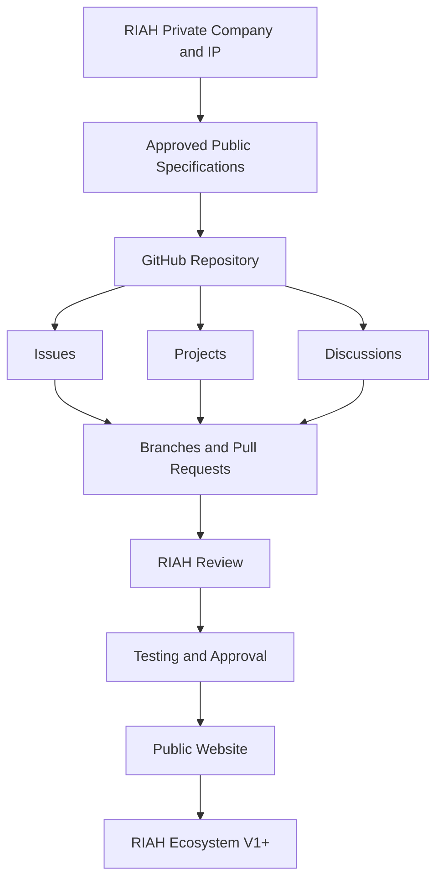

RIAH Pathway is building an integrated education, Experiential, technology, professional-development, certification, product, and career ecosystem.

This repository serves as the public development and contribution layer for the RIAH Pathway website and approved portions of the broader RIAH ecosystem.

RIAH remains a private-company ecosystem with applicable proprietary intellectual property.

Public GitHub development allows contributors to participate in approved portions of the build without converting RIAH's private-company intellectual property, internal systems, confidential materials, curriculum, business methods, restricted information, or other proprietary materials into unrestricted public property.

---

# FOUNDATION AND PUBLIC DEVELOPMENT

## I. 👑 ABOUT RIAH PATHWAY

RIAH Pathway is designed as a connected pathway rather than a collection of disconnected educational products.

The ecosystem connects:


The objective is to create a structured pathway through which students, professionals, faculty, employers, contributors, partners, and communities can participate within one connected ecosystem.

---

# EDUCATION, SCHOOLS AND PATHWAYS

## IX. 🎓 RIAH EDUCATIONAL ECOSYSTEM

RIAH Pathway is designed to connect multiple education and professional-development pathways within a single ecosystem.

Pathways include applicable:

| # | Item |
|---:|---|
| 1 | High School |
| 2 | GED and HSE |
| 3 | Associate's |
| 4 | Bachelor's |
| 5 | Minor |
| 6 | Master's |
| 7 | MBA |
| 8 | JD |
| 9 | Non-JD Bar License |
| 10 | Experiential |
| 11 | Certification |
| 12 | Certification Review |
| 13 | Bar Review |

The ecosystem is designed so that education can connect with Experiential learning, professional supervision, products, certification preparation, technology, community, and career development.

---

## X. 🏫 RIAH SCHOOLS AND MAJORS

## 📊 SCHOOL OF BUSINESS

Established majors and academic areas, in order:

```yaml
majors:
  step_01: "Accounting"
  step_02: "Business Management"
  step_03: "Entrepreneurship"
  step_04: "Finance"
```

At-scale academic faculty allocation:

3 PhD Core Academic Faculty + 3 Adjunct Faculty

The School of Business also receives its applicable Dean, Program Manager, Project Manager, Experiential Supervisors, Experiential Managers, and Experiential Reviewers.

## 💻 SCHOOL OF TECHNOLOGY

Established majors and academic areas, in order:

```yaml
majors:
  step_01: "Computer Science"
  step_02: "Cybersecurity"
  step_03: "Data Analytics"
  step_04: "Data Science"
  step_05: "Information Systems"
  step_06: "Program Management"
  step_07: "Project Management"
  step_08: "Software Development"
  step_09: "Software Engineering"
```

Cybersecurity is part of the School of Technology.

At-scale academic faculty allocation:

6 PhD Core Academic Faculty + 6 Adjunct Faculty

The School of Technology also receives its applicable Dean, Program Manager, Project Manager, Experiential Supervisors, Experiential Managers, and Experiential Reviewers.

## 🛡️ SCHOOL OF HOMELAND SECURITY

Established majors and academic areas, in order:

```yaml
majors:
  step_01: "Governance, Risk and Compliance"
  step_02: "Intelligence"
  step_03: "Physical Security"
  step_04: "Private Investigator"
```

Cybersecurity is not listed as a Homeland Security major within this structure. Cybersecurity is located within the School of Technology.

At-scale academic faculty allocation:

4 PhD Core Academic Faculty + 4 Adjunct Faculty

The School of Homeland Security also receives its applicable Dean, Program Manager, Project Manager, Experiential Supervisors, Experiential Managers, and Experiential Reviewers.

## ⚖️ SCHOOL OF LAW

Established pathways include:

| # | Item |
|---:|---|
| 1 | JD |
| 2 | Non-JD Bar License |

At-scale academic faculty allocation:

1 PhD Core Academic Faculty + 1 Adjunct Faculty

Applicable Non-JD Bar License pathway states are ordered as:

```yaml
non_jd_states:
  step_01: "California"
  step_02: "New York"
  step_03: "Maine"
  step_04: "Vermont"
  step_05: "Virginia"
  step_06: "Washington"
  step_07: "West Virginia"
```

## 🎓 HIGH SCHOOL + GED AND HSE

The academic leadership structure also includes:

High School + GED and HSE Dean — 1

The broader academic structure supports applicable High School curriculum, GED curriculum, HSE curriculum, state requirements, state curriculum and modules, degree-pathway mapping, assessment and review, and coordination with the four primary schools.

---

## XI. 💼 EXPERIENTIAL ECOSYSTEM

RIAH's Experiential pathway connects education with supervised professional application.

Established progression:

| # | Item |
|---:|---|
| 1 | Apprentice — one month |
| 2 | Intern — three months |
| 3 | Associate — 1 Year |
| 4 | Senior Associate — 1 Year |
| 5 | Manager — 1 Year |
| 6 | Executive — 1 Year |

Experiential participants may receive applicable professional supervision, management, review, practical assignments, project work, career development, applied learning, professional feedback, Capstone support, and employer or professional exposure.

---

# ENTITY AND ECOSYSTEM STRUCTURE

## XXIV. 🌐 RIAH PATHWAY ENTITY ECOSYSTEM

The broader RIAH organizational ecosystem includes the established entities used to separate and support different organizational functions.

| # | Item |
|---:|---|
| 1 | 👑 RIAH Pathway — broader organizational, education, pathway, and public ecosystem identity |
| 2 | 🏛️ RIAH Pathway Holdings Corporation — holding-company structure |
| 3 | 🏢 RIAH Pathway Corporation — corporate operating entity |
| 4 | 🤝 RIAH Pathway Professional Services LLP — professional-services entity |
| 5 | 🎓 RIAH Pathway School of Business, Cybersecurity, and Technology LLC — education-focused legal entity |
| 6 | 💻 RIAH Pathway Technology LLC — technology-focused entity |
| 7 | 📋 RIAH Pathway Programs LLC — program-focused entity |
| 8 | 🛍️ RIAH Pathway Products LLC — product-focused entity |
| 9 | ❤️ RIAH Pathway 501(c)(3) Foundation — Foundation structure for applicable charitable, community, educational, scholarship, grant, stipend, donation, and public-benefit initiatives |

---

## XXV. 🌐 ONE ECOSYSTEM — MULTIPLE CONNECTED FUNCTIONS


The entities, schools, technology systems, academic team, Experiential professionals, executives, governance structure, products, programs, and public website are intended to operate as connected parts of the broader RIAH ecosystem.

---

## XXVI. 🎓 BETA FACULTY AND EXPERIENTIAL RECRUITMENT

RIAH is particularly interested in building its initial Beta and pre-Beta team from the positions already established within the organizational structure.

Recruitment includes applicable openings for:

| # | Item |
|---:|---|
| 1 | PhD Core Academic Faculty |
| 2 | Adjunct Faculty |
| 3 | Experiential Supervisors |
| 4 | Experiential Managers |
| 5 | Experiential Reviewers |
| 6 | Program Managers |
| 7 | Project Managers |
| 8 | Deans |
| 9 | Backend Automation and Technology Systems Architect |
| 10 | Backend Technology Systems Builder |
| 11 | Frontend Technology Systems Builder |
| 12 | Full-Stack Technology Systems Builder |
| 13 | Red Team Specialist |
| 14 | Blue Team Specialist |
| 15 | Purple Team Specialist |
| 16 | applicable Executive Leadership positions |
| 17 | applicable Board positions |

Recruitment is based on the established organizational structure rather than creating additional titles solely for the public README.

---

## XXVII. 🌐 ADDITIONAL OUTSIDE SUPPORT

The established ecosystem structure also recognizes support outside the fixed 173-person internal team.

These may include:

| # | Item |
|---:|---|
| 1 | demand-based student supervisors |
| 2 | applicable state Non-JD supervisors |
| 3 | external financial investor or investors |
| 4 | external professional relationships and vendors |
| 5 | specialized third-party technology providers |

These external relationships do not change the 173-person fixed internal team unless the organizational model is formally updated.

---

---

# RIAH PATHWAY PARTICIPATION AND SCALE

## LXXI. 👑 BUILD WITH US. TEACH WITH US. GROW WITH US.

There are several ways to participate in what RIAH is building.

| Path | Content |
|---|---|
| 🧑‍💻 CONTRIBUTE | Help build the public website, wireframes, calculator, documentation, media, resources, applications, and digital ecosystem. Qualifying Community and GitHub Contributors may qualify for **UP TO 25% TUITION REDUCTION** and **25% OFF ELIGIBLE RIAH PRODUCTS**, subject to applicable RIAH contributor requirements and tuition-reduction rules. |
| 👨‍🏫 TEACH | Apply for applicable PhD Core Academic Faculty, Adjunct Faculty, Dean, Experiential Supervisor, Experiential Manager, and Experiential Reviewer opportunities within the established RIAH organizational structure. |
| 💼 JOIN THE TEAM | Apply for applicable Executive Leadership, Technology Architecture and Development, Cybersecurity, Experiential, Program Management, Project Management, Academic Leadership, PhD Core Academic Faculty, and Adjunct Faculty positions within the 173-person at-scale internal team. Eligible Team Members receive **$0 RIAH EDUCATION TUITION** and **50% OFF ELIGIBLE RIAH PRODUCTS** under applicable Team Member benefit requirements. |
| 🏛️ GOVERN | Explore applicable opportunities within the six-member Board structure. |
| 🤝 PARTNER | Explore professional, employer, education, Experiential, community, legal, technology, and organizational partnership opportunities. |
| ❤️ DONATE | Support scholarships, grants, stipends, accreditation, authorization, educational resources, technology, Experiential education, and community development. |
| 🎓 ENROLL | Explore RIAH Pathway admissions beginning with the applicable October 2026 Version 1 launch period. |

---

## LXXII. 👑 RIAH PATHWAY AT SCALE

The established ecosystem model is:

173-Person Fixed Internal Team

supporting an at-scale Experiential structure designed for:

1,000 Experiential Participants

with:

40 Supervisors

+ 40 Managers

+ 40 Reviewers

and an academic structure containing:

14 PhD Core Academic Faculty

+ 14 Adjunct Faculty

+ 5 Deans

+ 4 Program Managers

+ 4 Project Managers

alongside:

CTO + CISO + Technology + Cybersecurity

+ RIAH App + Mobile App + Ecosystem Software + Website

+ Automation + APIs + AI + Data + Dashboards

+ RIAH Pathway Entity Ecosystem

= RIAH Pathway — Human-Led, Technology-Supported, 1:25 At-Scale Ecosystem

---

## LXXIII. 👑 COMPLETE DEVELOPMENT MODEL


