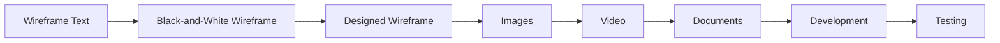
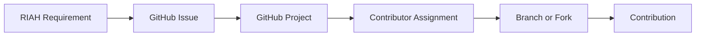
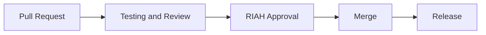
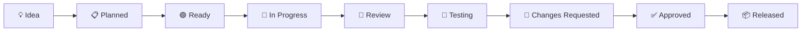
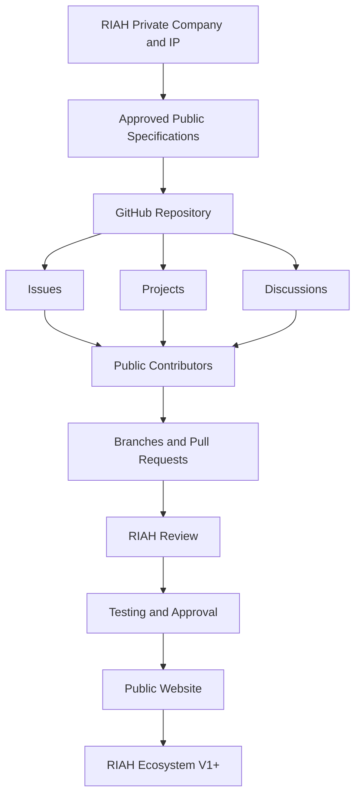
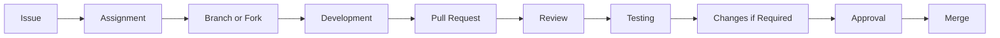

## II. 💻 PUBLIC GITHUB DEVELOPMENT

The RIAH GitHub environment serves as the public development and contribution layer for the broader RIAH ecosystem.

Approved public-development materials may include:

| # | Item |
|---:|---|
| 1 | Website development |
| 2 | Wireframes |
| 3 | Black-and-white wireframes |
| 4 | Designed wireframes |
| 5 | Images |
| 6 | Videos |
| 7 | Video scripts |
| 8 | Documents |
| 9 | Downloads |
| 10 | Forms |
| 11 | Policies |
| 12 | Procedures |
| 13 | Guidelines |
| 14 | Resources |
| 15 | Buttons |
| 16 | CTAs |
| 17 | Internal links |
| 18 | External links |
| 19 | Pricing Engine development |
| 20 | Calculator testing |
| 21 | Accessibility |
| 22 | Mobile development |
| 23 | Tablet development |
| 24 | Desktop development |
| 25 | Components |
| 26 | Public curriculum documentation |
| 27 | Public accreditation documentation |
| 28 | Public authorization documentation |
| 29 | Products |
| 30 | Experiential resources |
| 31 | Technology documentation |
| 32 | Quality assurance |
| 33 | Testing |
| 34 | Bug fixes |
| 35 | Approved proposals |

RIAH determines which portions of the ecosystem are appropriate for public development.

The public repository is intended to make approved specifications visible so contributors can select individual deliverables, propose improvements, develop approved work, test implementation, and submit work for RIAH review.

---

## III. 👑 RIAH GITHUB ECOSYSTEM STRUCTURE

The RIAH GitHub environment serves as the public development and contribution layer for the broader RIAH ecosystem.

RIAH remains a private-company ecosystem with applicable proprietary intellectual property.

Public GitHub development allows contributors to participate in approved portions of the build without converting RIAH's private company intellectual property, internal systems, confidential materials, curriculum, business methods, or restricted information into unrestricted public property.

## 01. 🌐 WEBSITE

```text
01-Website/
│
├── 01-Home/
├── 02-About/
├── 03-Pathway/
├── 04-Curriculum/
├── 05-Admissions/
├── 06-Tuition/
├── 07-Products/
├── 08-Donations/
├── 09-Accreditation-and-Authorization/
├── 10-Join-Us/
├── 11-Resources/
├── 12-FAQ/
└── 13-Contact/
```

Each website page follows the same contribution-ready structure.

```text
01-Home/
│
├── 01-Wireframe-Text/
│   └── Home-Wireframe.md
├── 02-Black-and-White-Wireframe/
├── 03-Wireframe-Design/
├── 04-Images/
├── 05-Video/
│   ├── Video-Scripts/
│   ├── Storyboards/
│   └── Final-Videos/
├── 06-Buttons-and-CTAs/
├── 07-Downloads/
│   ├── Documents/
│   ├── Forms/
│   ├── Policies/
│   ├── Procedures/
│   ├── Guidelines/
│   └── Resources/
├── 08-Links/
│   ├── Internal-Links/
│   └── External-Links/
├── 09-Development/
│   ├── Desktop/
│   ├── Tablet/
│   ├── Mobile/
│   └── Components/
├── 10-Accessibility/
├── 11-Testing/
└── README.md
```

The same structure can be replicated across Website Pages 01–13.

## 02. 🎨 WIREFRAMES

The wireframe system separates the written specification from the visual implementation.

```text
Wireframes/
│
├── Wireframe-Text/
├── Black-and-White/
├── Designed-Wireframes/
├── Mobile/
├── Tablet/
├── Desktop/
├── Images/
├── Video-Scripts/
├── Buttons-and-CTAs/
├── Downloads/
├── Internal-Links/
└── External-Links/
```

This allows a contributor to work on one specific deliverable without having to rebuild an entire page.

A contributor could independently complete:



## 03. 🎥 VIDEO

```text
Video/
│
├── Scripts/
├── Storyboards/
├── Raw-Assets/
├── Motion-Graphics/
├── Voice-and-Audio/
├── Captions/
├── Transcripts/
├── Drafts/
└── Final/
```

RIAH can publish an approved script while contributors propose or create the corresponding video.

## 04. 🖼️ IMAGES AND DESIGN ASSETS

```text
Images/
│
├── Website/
├── Schools/
├── Pathways/
├── Curriculum/
├── Admissions/
├── Products/
├── Experiential/
├── Infographics/
├── Diagrams/
├── Icons/
├── Social/
└── Approved/
```

## 05. 📄 DOCUMENTS AND DOWNLOADS

```text
Documents/
│
├── Policies/
├── Procedures/
├── Guidelines/
├── Forms/
├── Handbooks/
├── Brochures/
├── Student-Resources/
├── Faculty-Resources/
├── Experiential-Resources/
├── Accreditation/
├── Admissions/
├── Tuition/
├── Public-Disclosures/
└── Templates/
```

Document specifications can be published before the finished document exists, allowing contributors to develop proposed versions.

RIAH reviews proposed documents before they become official organizational documents.

## 06. 📚 CURRICULUM

```text
Curriculum/
│
├── School-of-Business/
├── School-of-Technology/
├── School-of-Homeland-Security/
├── School-of-Law/
├── High-School/
├── GED-HSE/
├── Certification-Review/
├── Bar-Review/
├── Experiential/
├── Technology-Stack/
└── Public-Curriculum-Documentation/
```

Only curriculum and curriculum documentation approved for public development should be placed within the public repository.

Private instructional content and proprietary curriculum materials can remain outside the public repository.

## 07. 🛤️ PATHWAYS

```text
Pathways/
│
├── Education/
├── Associate/
├── Bachelor/
├── Minor/
├── Master/
├── MBA/
├── JD/
├── Non-JD/
├── Experiential/
├── Certification/
├── High-School/
└── GED-HSE/
```

## 08. 🧮 PRICING ENGINE

```text
Pricing-Engine/
│
├── Documentation/
├── Business-Rules/
├── Formulas/
├── UI/
├── Components/
├── Tests/
├── Test-Cases/
├── Accessibility/
├── Mobile/
├── Desktop/
└── Proposals/
```

The public repository can expose approved calculator specifications and implementation requirements without exposing unrelated private financial information.

Contributors can improve implementation and propose changes without silently changing established RIAH financial rules.

## 09. 🧑‍💻 TECHNOLOGY

```text
Technology/
│
├── Website/
├── Applications/
├── Integrations/
├── Automation/
├── APIs/
├── Database/
├── AI/
├── Dashboards/
├── Architecture/
├── Documentation/
└── Public-Development/
```

Private credentials, infrastructure secrets, production configurations, private databases, student information, and security-sensitive architecture remain outside the public repository.

## 10. 💼 EXPERIENTIAL

```text
Experiential/
│
├── Apprentice/
├── Intern/
├── Associate/
├── Senior-Associate/
├── Manager/
├── Executive/
├── Supervisors/
├── Managers/
├── Reviewers/
├── Employer-Partnerships/
├── Resources/
└── Public-Documentation/
```

## 11. 🛍️ PRODUCTS

```text
Products/
│
├── School-of-Business/
├── School-of-Technology/
├── School-of-Homeland-Security/
├── School-of-Law/
├── Certification-Review/
├── Bar-Review/
├── Experiential/
├── Educational-Products/
├── Professional-Products/
├── Print/
└── Digital/
```

## 12. 🏅 ACCREDITATION AND AUTHORIZATION

```text
Accreditation-and-Authorization/
│
├── Accreditation-Roadmap/
├── State-Authorization/
├── Ohio/
├── ABA/
├── ABET/
├── ACCSC/
├── AEE/
├── DEAC/
├── NCAE-C/
├── Public-Disclosures/
├── Requirements/
├── Cost-Tracking/
└── Status/
```

Only verified public information should be represented as an actual accreditation or authorization status.

## 13. ❤️ FOUNDATION AND DONATIONS

```text
Foundation-and-Donations/
│
├── Scholarships/
├── Grants/
├── Stipends/
├── Donor-Programs/
├── Campaigns/
├── Accreditation-Funding/
├── Student-Support/
├── Community/
└── Public-Documentation/
```

## 14. 🤝 OPEN-SOURCE CONTRIBUTIONS

```text
Open-Source-Contributions/
│
├── CONTRIBUTING.md
├── CODE_OF_CONDUCT.md
├── SECURITY.md
├── Contribution-Guide/
├── Good-First-Issues/
├── Help-Wanted/
├── Development/
├── Design/
├── Images/
├── Video/
├── Documents/
├── Accessibility/
├── Testing/
├── Bug-Reports/
├── Feature-Requests/
└── Proposals/
```

Public contribution does not mean every RIAH asset or system becomes open source.

The contribution layer should clearly identify what contributors are permitted to view, modify, submit, reuse, test, propose, and distribute, and what remains proprietary or restricted.

## 15. 🔒 PRIVATE COMPANY IP BOUNDARY

The public repository should not contain confidential or restricted:

| # | Item |
|---:|---|
| 1 | company records |
| 2 | private financial records |
| 3 | student information |
| 4 | employee information |
| 5 | passwords |
| 6 | API keys |
| 7 | authentication tokens |
| 8 | private infrastructure |
| 9 | production credentials |
| 10 | private contracts |
| 11 | internal legal materials |
| 12 | security-sensitive architecture |
| 13 | private datasets |
| 14 | unreleased proprietary materials |
| 15 | trade secrets |
| 16 | restricted curriculum |
| 17 | internal operating information |

Public contribution access and private-company ownership are separate concepts.

The repository's LICENSE, CONTRIBUTING terms, notices, and applicable file-level terms should define what rights contributors and outside users actually receive.

## 16. 🔀 GITHUB CONTRIBUTION WORKFLOW

### GitHub Contribution Workflow — Part I: Requirement to Contribution



### GitHub Contribution Workflow — Part II: Review to Release



## 17. 📊 GITHUB PROJECTS

GitHub Projects can operate as the central public-development management system.

The project can track work across:

| # | Item |
|---:|---|
| 1 | Website 01–13 |
| 2 | Wireframes |
| 3 | Development |
| 4 | Images |
| 5 | Videos |
| 6 | Video Scripts |
| 7 | Documents |
| 8 | Downloads |
| 9 | Internal Links |
| 10 | External Links |
| 11 | Buttons and CTAs |
| 12 | Curriculum |
| 13 | Pricing Engine |
| 14 | Accessibility |
| 15 | Testing |
| 16 | Bugs |
| 17 | Accreditation documentation |
| 18 | Products |
| 19 | Experiential |
| 20 | Technology |
| 21 | Public resources |

Project status:



## 18. 🏷️ GITHUB PROJECT FIELDS

Each GitHub Project item can track:

| # | Item |
|---:|---|
| 1 | Status — Current development stage |
| 2 | Website Page — 01–13 |
| 3 | Work Type — Code, Design, Video, Image, Document, etc. |
| 4 | Priority — Low, Medium, High, Critical |
| 5 | Contributor — Person working on item |
| 6 | Reviewer — Assigned reviewer |
| 7 | School — Applicable RIAH school |
| 8 | Pathway — Applicable pathway |
| 9 | Device — Desktop, Tablet, Mobile |
| 10 | Release — Target release |
| 11 | Due Date — Target completion |
| 12 | Dependency — Required preceding work |
| 13 | Contribution Type — Internal or External |
| 14 | Contributor Benefit — Applicable review status |
| 15 | IP Classification — Public, Contribution-Eligible, Restricted |
| 16 | Approval — Pending or Approved |

## 19. 🏷️ ISSUE LABELS

| # | Item |
|---:|---|
| 1 | website |
| 2 | wireframe |
| 3 | black-and-white-wireframe |
| 4 | designed-wireframe |
| 5 | development |
| 6 | frontend |
| 7 | backend |
| 8 | full-stack |
| 9 | image |
| 10 | video |
| 11 | video-script |
| 12 | document |
| 13 | download |
| 14 | internal-link |
| 15 | external-link |
| 16 | button |
| 17 | cta |
| 18 | curriculum |
| 19 | pricing-engine |
| 20 | accessibility |
| 21 | testing |
| 22 | bug |
| 23 | security |
| 24 | content |
| 25 | proposal |
| 26 | accreditation |
| 27 | experiential |
| 28 | product |
| 29 | good-first-issue |
| 30 | help-wanted |
| 31 | needs-review |
| 32 | changes-requested |
| 33 | approved |

## 20. 🌱 CONTRIBUTOR ENTRY POINTS

A contributor does not need to understand or build the entire RIAH ecosystem.

Someone can contribute one:

| # | Item |
|---:|---|
| 1 | button |
| 2 | image |
| 3 | video |
| 4 | video script |
| 5 | wireframe |
| 6 | page design |
| 7 | mobile design |
| 8 | component |
| 9 | document |
| 10 | policy draft |
| 11 | procedure draft |
| 12 | guideline draft |
| 13 | form |
| 14 | download |
| 15 | internal link correction |
| 16 | external link correction |
| 17 | accessibility improvement |
| 18 | calculator test |
| 19 | calculator component |
| 20 | bug fix |
| 21 | curriculum presentation improvement |
| 22 | diagram |
| 23 | infographic |
| 24 | test case |

and still make a meaningful contribution.

## 21. 👑 RIAH REVIEW AND CONTROL

RIAH retains final authority over:

| # | Item |
|---:|---|
| 1 | company direction |
| 2 | intellectual property |
| 3 | branding |
| 4 | curriculum |
| 5 | tuition |
| 6 | pricing |
| 7 | admissions |
| 8 | accreditation statements |
| 9 | authorization statements |
| 10 | financial rules |
| 11 | products |
| 12 | organizational structure |
| 13 | institutional policy |
| 14 | final website implementation |

Community contribution improves implementation.

It does not transfer organizational control.

## 22. 🎓 CONTRIBUTOR BENEFITS

Qualifying public GitHub and Community Contributors may be considered for:

### UP TO 25% RIAH PATHWAY TUITION REDUCTION

and:

### 25% OFF ELIGIBLE RIAH PRODUCTS

under applicable RIAH contributor-benefit requirements.

Contribution qualification and benefit determination remain subject to RIAH review and established contributor requirements.

A contribution or pull request does not automatically create a 25% tuition reduction.

The older up-to-5% contributor benefit is superseded and is not part of this current README.

Eligible contributors who subsequently join the established RIAH team may qualify for applicable Team Member benefits:

### $0 RIAH EDUCATION TUITION

and:

### 50% OFF ELIGIBLE RIAH PRODUCTS

## 23. 👑 COMPLETE DEVELOPMENT MODEL



---

# CONTRIBUTIONS AND GITHUB WORKFLOW

## XLIII. 🤝 HOW YOU CAN CONTRIBUTE

Contributors may help with code, frontend, backend, full-stack development, wireframes, design, mobile, tablet, desktop, accessibility, images, videos, scripts, documents, forms, policies, procedures, guidelines, calculators, testing, links, CTAs, diagrams, infographics, public documentation, bug fixes, approved curriculum presentation, and technical documentation.

---

## XLIV. 🎥 VIDEO CONTRIBUTORS

Video contributors may work from approved RIAH scripts or specifications.

Potential deliverables include storyboards, motion graphics, narration, captions, transcripts, draft videos, final proposed videos, page-specific videos, educational videos, pathway videos, product videos, and Experiential videos.

RIAH retains final approval authority over materials presented as official RIAH content.

---

## XLV. 🖼️ IMAGE AND DESIGN CONTRIBUTORS

Design contributors may help create website images, school images, pathway graphics, curriculum graphics, admissions graphics, product graphics, Experiential graphics, diagrams, infographics, icons, responsive page designs, black-and-white wireframes, and designed wireframes.

---

## XLVI. 📄 DOCUMENT, POLICY, AND RESOURCE CONTRIBUTORS

Contributors may develop proposed policies, procedures, guidelines, forms, handbooks, brochures, student resources, faculty resources, Experiential resources, public disclosures, templates, and downloads.

A proposed document does not become an official organizational policy merely because it was submitted through GitHub.

RIAH must review and approve applicable materials.

---

## XLVII. 💡 SUGGESTIONS AND PROPOSALS

Contributors may propose changes to website content, design, usability, accessibility, calculator implementation, pricing presentation, tuition presentation, documentation, navigation, mobile responsiveness, testing, and resources.

Contributors may suggest changes to established rules.

RIAH determines whether a proposed change is feasible and whether it should be implemented.

---

## XLVIII. 🔀 PULL REQUEST WORKFLOW



Pull requests should identify what was changed, why it was changed, applicable issue, testing performed, screenshots where relevant, responsive behavior where relevant, accessibility considerations where relevant, and affected website page or ecosystem component.

---

## XLIX. 🧮 FINANCIAL CALCULATOR CONTRIBUTIONS

The RIAH Pricing Engine is deterministic.

Contributors may help with calculator UI, calculator UX, formulas, implementation, components, test cases, accessibility, responsive design, validation, error handling, and documentation.

Contributors must not silently alter tuition, pricing stages, discounts, reductions, caps, deposits, fees, payment options, funding logic, reimbursement logic, financing rules, product reductions, Team benefits, or contributor benefits.

A proposed rule change should be submitted as a proposal rather than embedded invisibly in implementation code.

---

## L. 🧪 TESTING

Testing may include:

| # | Item |
|---:|---|
| 1 | desktop |
| 2 | tablet |
| 3 | mobile |
| 4 | accessibility |
| 5 | navigation |
| 6 | links |
| 7 | forms |
| 8 | buttons |
| 9 | CTAs |
| 10 | calculator |
| 11 | responsiveness |
| 12 | visual consistency |
| 13 | content |
| 14 | browser behavior |
| 15 | performance |
| 16 | error states |

---

## LI. 🏗️ SUGGESTED REPOSITORY STRUCTURE

```text
RIAH-Pathway/
│
├── README.md
├── LICENSE
├── CONTRIBUTING.md
├── CODE_OF_CONDUCT.md
├── SECURITY.md
├── 01-Website/
├── Wireframes/
├── Video/
├── Images/
├── Documents/
├── Curriculum/
├── Pathways/
├── Pricing-Engine/
├── Technology/
├── Experiential/
├── Products/
├── Accreditation-and-Authorization/
├── Foundation-and-Donations/
├── Open-Source-Contributions/
└── Public-Documentation/
```

---

## LII. 🏷️ SUGGESTED ISSUE LABELS

| # | Item |
|---:|---|
| 1 | website |
| 2 | wireframe |
| 3 | black-and-white-wireframe |
| 4 | designed-wireframe |
| 5 | development |
| 6 | frontend |
| 7 | backend |
| 8 | full-stack |
| 9 | image |
| 10 | video |
| 11 | video-script |
| 12 | document |
| 13 | download |
| 14 | internal-link |
| 15 | external-link |
| 16 | button |
| 17 | cta |
| 18 | curriculum |
| 19 | pricing-engine |
| 20 | accessibility |
| 21 | testing |
| 22 | bug |
| 23 | security |
| 24 | content |
| 25 | proposal |
| 26 | accreditation |
| 27 | experiential |
| 28 | product |
| 29 | good-first-issue |
| 30 | help-wanted |
| 31 | needs-review |
| 32 | changes-requested |
| 33 | approved |

---

## LIII. 🌐 BUILDING IN PUBLIC

RIAH may use GitHub to document approved portions of its development process publicly.

Building in public can provide visibility into website development, public specifications, issues, contributions, approved designs, testing, releases, documentation, and public institutional development.

Building in public does not require RIAH to publish confidential, proprietary, private, restricted, security-sensitive, student, employee, financial, legal, or internal operational information.
