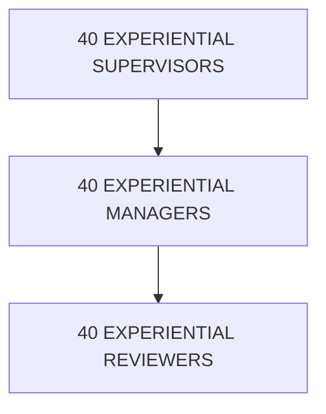
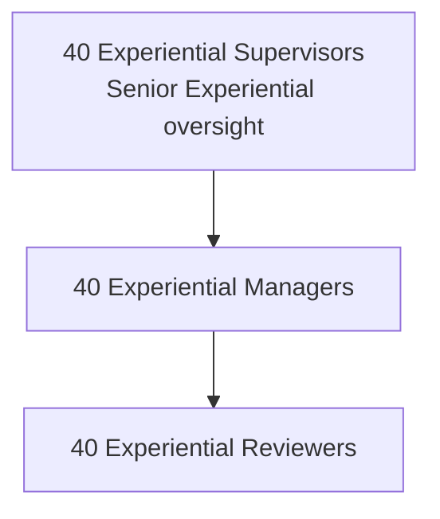

**Contributor; Mariah Dominique Rucker**

There is currently no team. I am building everything myself until I have hired the beta team. I am starting the hiring process this month, **October 2026**, for the CTO, CISO, experiential professionals, PhD-qualified faculty, and adjunct faculty for each school and major, with hiring continuing across the entire ecosystem as it scales.

Beta team members will be hired with **equity participation and compensation during the beta cohort**, which launches in **Spring 2027**.

The website will launch in **October 2026** as I continue to build, develop, revise, and finalize aspects of the RIAH Pathway ecosystem.

Learn more about me on GitHub and LinkedIn, or connect with me through social media and Linktree.

- **GitHub:** https://github.com/mariahdominiquerucker
- **LinkedIn:** https://linkedin.com/in/mariahrucker
- **Facebook:** https://facebook.com/heymariahrucker
- **Instagram:** https://instagram.com/heymariahrucker
- **Linktree:** https://linktr.ee/mariahrucker

---

## VI. 👑 JOIN THE RIAH BETA TEAM

RIAH is preparing the team that will support the Beta launch and long-term development of the RIAH ecosystem.

The established RIAH Pathway ecosystem structure is designed for:

### 👥 173 PEOPLE AT SCALE

RIAH is recruiting and developing applicable opportunities across the established organization, including:

| # | Item |
|---:|---|
| 1 | Executive Leadership |
| 2 | Technology Architecture and Development |
| 3 | Cybersecurity |
| 4 | Experiential |
| 5 | Program Management |
| 6 | Project Management |
| 7 | Academic Leadership |
| 8 | PhD Core Academic Faculty |
| 9 | Adjunct Faculty |
| 10 | Board and Governance opportunities |
| 11 | applicable external professional relationships |

Recruitment uses the established organizational structure rather than creating fictitious positions solely for public recruitment.

---

# ORGANIZATION AND TEAM AT SCALE

## XII. 👥 173-PERSON AT-SCALE INTERNAL TEAM

The fixed internal at-scale team consists of the exact staffing categories established within the RIAH Pathway Ecosystem Organization Structure.

| Detail | Information |
|---|---|
| fixed internal team / executive leadership | 5 |
| fixed internal team / technology architecture and development | 4 |
| fixed internal team / cybersecurity red blue purple team | 3 |
| fixed internal team / experiential team | 120 |
| fixed internal team / program management | 4 |
| fixed internal team / project management | 4 |
| fixed internal team / deans | 5 |
| fixed internal team / phd core academic faculty | 14 |
| fixed internal team / adjunct faculty | 14 |
| fixed internal team / total | 173 |

### TOTAL FIXED INTERNAL TEAM — 173

The Board of Directors, Founder and CEO, applicable external professionals, external financial investors, demand-based student supervisors, applicable state Non-JD supervisors, external professional relationships and vendors, and specialized third-party technology providers are treated separately where applicable and are not added to the fixed 173-person internal-team calculation unless the established organizational structure specifically includes them.

| Board Role | Count |
|---|---:|
| Founder & CEO / Board Member | 1 |
| President | 1 |
| Vice President | 1 |
| Treasurer | 1 |
| Secretary | 1 |
| Trustee | 1 |
| **Total** | **6** |


---

## XIII. 👑 BOARD OF DIRECTORS — 6

RIAH's established Board structure consists of:

| # | Item |
|---:|---|
| 1 | Founder and CEO, Board Member — 1 |
| 2 | President — 1 |
| 3 | Vice President — 1 |
| 4 | Treasurer — 1 |
| 5 | Secretary — 1 |
| 6 | Trustee — 1 |

### TOTAL BOARD MEMBERS — 6

The Founder is included within the six-member Board structure.

The Board structure includes CPA representation and Attorney at Law representation.

The Board is separate from the fixed 173-person internal-team calculation.

---

## XIV. 🧭 EXECUTIVE LEADERSHIP — 5

The established executive leadership structure contains exactly five positions:

```text
EXECUTIVE LEADERSHIP — 5

CISO — 1  → Protection
CTO  — 1  → Technology · Development · Systems · Automation · Cost Reduction
CFO  — 1  → Financial Operations · Oversight
CLO  — 1  → Academics · Curriculum · Schools · Faculty · Academic Success
COO  — 1  → Experiential · Backend Operations
```
### TOTAL EXECUTIVE LEADERSHIP — 5

---

## XV. 🧠 TECHNOLOGY ARCHITECTURE AND DEVELOPMENT — 4

The CTO technology team contains:

| # | Item |
|---:|---|
| 1 | Backend Automation and Technology Systems Architect — 1 |
| 2 | Backend Technology Systems Builder — 1 |
| 3 | Frontend Technology Systems Builder — 1 |
| 4 | Full-Stack Technology Systems Builder — 1 |

### TOTAL — 4

The technology organization supports the RIAH Pathway App, RIAH Mobile App, RIAH Ecosystem Software, RIAH website, automation, integrations, technology stack, applications, APIs, databases, infrastructure, AI-enabled processes, dashboards, internal systems, and external system connections.

---

## XVI. 🛡️ CYBERSECURITY TEAM — 3

The CISO security team contains:

```text
CYBERSECURITY TEAM — 3

RED TEAM SPECIALIST — 1
          ↘
        PURPLE TEAM SPECIALIST — 1
          ↗
BLUE TEAM SPECIALIST — 1

CISO + 3 FUNCTIONAL SECURITY ROLES
CISO = Executive Leader · Not Primary Specialist
```
### TOTAL — 3

The CISO and cybersecurity team support cybersecurity, information security, network security, monitoring, access, incident response, infrastructure protection, and applicable physical-security technology.

---

## XVII. 🧠 FUNCTIONAL TECHNOLOGY AND SECURITY BACKEND TEAM — 9

The complete functional Technology and Security Backend Team consists of:

| # | Item |
|---:|---|
| 1 | CTO — 1 |
| 2 | CISO — 1 |
| 3 | Backend Automation and Technology Systems Architect — 1 |
| 4 | Backend Technology Systems Builder — 1 |
| 5 | Frontend Technology Systems Builder — 1 |
| 6 | Full-Stack Technology Systems Builder — 1 |
| 7 | Red Team Specialist — 1 |
| 8 | Blue Team Specialist — 1 |
| 9 | Purple Team Specialist — 1 |

### FUNCTIONAL TECHNOLOGY AND SECURITY TEAM — 9

The CTO and CISO are already included within the five-person Executive Leadership category. Therefore, the functional nine-person team is not added again to the 173-person total.

---

## XVIII. 💼 EXPERIENTIAL TEAM — 120

The largest component of the at-scale internal organization is the Experiential Team.



TOTAL = 120


### TOTAL EXPERIENTIAL TEAM — 120

RIAH's established at-scale model supports 1,000 Experiential participants with 40 Supervisors, 40 Managers, and 40 Reviewers.

The established technology-supported ratio is 1:25.

Each Supervisor supports up to 25 participants.

Each Manager supports up to 25 participants.

Each Reviewer supports up to 25 participants.

Experiential structure by school:

| Detail | Information |
|---|---|
| experiential staffing by school / School of Business / participants | 250 |
| experiential staffing by school / School of Business / supervisors | 10 |
| experiential staffing by school / School of Business / managers | 10 |
| experiential staffing by school / School of Business / reviewers | 10 |
| experiential staffing by school / School of Business / staff total | 30 |
| experiential staffing by school / School of Technology / participants | 250 |
| experiential staffing by school / School of Technology / supervisors | 10 |
| experiential staffing by school / School of Technology / managers | 10 |
| experiential staffing by school / School of Technology / reviewers | 10 |
| experiential staffing by school / School of Technology / staff total | 30 |
| experiential staffing by school / School of Homeland Security / participants | 250 |
| experiential staffing by school / School of Homeland Security / supervisors | 10 |
| experiential staffing by school / School of Homeland Security / managers | 10 |
| experiential staffing by school / School of Homeland Security / reviewers | 10 |
| experiential staffing by school / School of Homeland Security / staff total | 30 |
| experiential staffing by school / School of Law / participants | 250 |
| experiential staffing by school / School of Law / supervisors | 10 |
| experiential staffing by school / School of Law / managers | 10 |
| experiential staffing by school / School of Law / reviewers | 10 |
| experiential staffing by school / School of Law / staff total | 30 |
| experiential staffing by school / TOTAL / participants | 1000 |
| experiential staffing by school / TOTAL / staff | 120 |
Technology supports the work. Technology does not replace the assigned human professional.

---

## XIX. 🧭 PROGRAM MANAGEMENT — 4

| # | Item |
|---:|---|
| 1 | Business Program Manager — 1 |
| 2 | Technology Program Manager — 1 |
| 3 | Homeland Security Program Manager — 1 |
| 4 | Law Program Manager — 1 |

### TOTAL PROGRAM MANAGERS — 4

---

## XX. 📋 PROJECT MANAGEMENT — 4

| # | Item |
|---:|---|
| 1 | School of Business Project Manager — 1 |
| 2 | School of Technology Project Manager — 1 |
| 3 | School of Homeland Security Project Manager — 1 |
| 4 | School of Law Project Manager — 1 |

### TOTAL PROJECT MANAGERS — 4

---

## XXI. 🎓 ACADEMIC LEADERSHIP — 5 DEANS

| # | Item |
|---:|---|
| 1 | School of Business Dean — 1 |
| 2 | School of Technology Dean — 1 |
| 3 | School of Homeland Security Dean — 1 |
| 4 | School of Law Dean — 1 |
| 5 | High School + GED and HSE Dean — 1 |

### TOTAL DEANS — 5

---

## XXII. 🎓 PhD CORE AND ADJUNCT FACULTY — 28

RIAH's established at-scale academic faculty structure contains 14 PhD Core Academic Faculty and 14 Adjunct Faculty.

Allocation:

| # | Item |
|---:|---|
| 1 | School of Business — 3 PhD Core + 3 Adjunct = 6 |
| 2 | School of Technology — 6 PhD Core + 6 Adjunct = 12 |
| 3 | School of Homeland Security — 4 PhD Core + 4 Adjunct = 8 |
| 4 | School of Law — 1 PhD Core + 1 Adjunct = 2 |

### TOTAL ACADEMIC FACULTY — 28

Faculty work with the Experiential Team across curriculum creation, development, review, revision, assessments, Capstones, Certification Review, Bar Review, and applicable student learning.

RIAH uses its existing human team first.

AI may assist the human team where applicable but does not replace the established human academic, professional, review, supervision, or leadership roles.

---

## XXIII. 🎓 FACULTY AND EXPERIENTIAL COLLABORATION

RIAH's curriculum development structure uses:

| # | Item |
|---:|---|
| 1 | 14 PhD Core Academic Faculty |
| 2 | 14 Adjunct Faculty |
| 3 | 120 Experiential Faculty and Professionals |
| 4 | AI Assistants where applicable |

PhD Core Faculty support academic oversight, curriculum creation, development, review, revision, final academic decisions, accreditation and program review, assessments, Capstone oversight, Certification Review, Bar Review, academic content, Adjunct coordination, and Experiential coordination.

Adjunct Faculty support curriculum, assessments, human review, Capstones, Certification Review, Bar Review, High School, GED and HSE, curriculum mapping, state-requirement mapping, degree-pathway mapping, and Experiential coordination.

Experiential Faculty and Professionals may support Experiential programs, curriculum creation, curriculum development, curriculum review, curriculum revision, Certification Review, assessments, Capstone supervision, Capstone Panels, and professional application.

---

# ENTITY AND ECOSYSTEM STRUCTURE

## XXIV. 🌐 RIAH PATHWAY ENTITY ECOSYSTEM

The broader RIAH organizational ecosystem includes the established entities used to separate and support different organizational functions.

| # | Item |
|---:|---|
| 1 | 👑 RIAH Pathway — broader organizational, education, pathway, and public ecosystem identity |
| 2 | 🏛️ RIAH Pathway Holdings Corporation — holding-company structure |
| 3 | 🏢 RIAH Pathway Corporation — corporate operating entity |
| 4 | 🤝 RIAH Pathway Professional Services LLP — professional-services entity |
| 5 | 🎓 RIAH Pathway School of Business, Cybersecurity, and Technology LLC — education-focused legal entity |
| 6 | 💻 RIAH Pathway Technology LLC — technology-focused entity |
| 7 | 📋 RIAH Pathway Programs LLC — program-focused entity |
| 8 | 🛍️ RIAH Pathway Products LLC — product-focused entity |
| 9 | ❤️ RIAH Pathway 501(c)(3) Foundation — Foundation structure for applicable charitable, community, educational, scholarship, grant, stipend, donation, and public-benefit initiatives |

---

## XXV. 🌐 ONE ECOSYSTEM — MULTIPLE CONNECTED FUNCTIONS


The entities, schools, technology systems, academic team, Experiential professionals, executives, governance structure, products, programs, and public website are intended to operate as connected parts of the broader RIAH ecosystem.

---

## XXVI. 🎓 BETA FACULTY AND EXPERIENTIAL RECRUITMENT

RIAH is particularly interested in building its initial Beta and pre-Beta team from the positions already established within the organizational structure.

Recruitment includes applicable openings for:

| # | Item |
|---:|---|
| 1 | PhD Core Academic Faculty |
| 2 | Adjunct Faculty |
| 3 | Experiential Supervisors |
| 4 | Experiential Managers |
| 5 | Experiential Reviewers |
| 6 | Program Managers |
| 7 | Project Managers |
| 8 | Deans |
| 9 | Backend Automation and Technology Systems Architect |
| 10 | Backend Technology Systems Builder |
| 11 | Frontend Technology Systems Builder |
| 12 | Full-Stack Technology Systems Builder |
| 13 | Red Team Specialist |
| 14 | Blue Team Specialist |
| 15 | Purple Team Specialist |
| 16 | applicable Executive Leadership positions |
| 17 | applicable Board positions |

Recruitment is based on the established organizational structure rather than creating additional titles solely for the public README.

---

## XXVII. 🌐 ADDITIONAL OUTSIDE SUPPORT

The established ecosystem structure also recognizes support outside the fixed 173-person internal team.

These may include:

| # | Item |
|---:|---|
| 1 | demand-based student supervisors |
| 2 | applicable state Non-JD supervisors |
| 3 | external financial investor or investors |
| 4 | external professional relationships and vendors |
| 5 | specialized third-party technology providers |

These external relationships do not change the 173-person fixed internal team unless the organizational model is formally updated.

---

RIAH Pathway
