# WEBSITE 01–13

## XXVIII. 🌐 WEBSITE NAVIGATION — 01 THROUGH 13

The public website is organized into:

01 — Home  
02 — About  
03 — Pathway  
04 — Curriculum  
05 — Admissions  
06 — Tuition  
07 — Products  
08 — Donations  
09 — Accreditation and Authorization  
10 — Join Us  
11 — Resources  
12 — FAQ  
13 — Contact

Each page may include written wireframe specifications, black-and-white wireframes, designed wireframes, images, video, video scripts, buttons, CTAs, internal links, external links, downloads, documents, policies, procedures, guidelines, forms, calculators, diagrams, responsive development, mobile development, tablet development, desktop development, accessibility, testing, and development notes.

---

## XXIX. 🏠 01 — HOME

The Home page introduces the RIAH Pathway ecosystem and communicates the connection between education, Experiential learning, certification, career preparation, technology, products, community, professional development, and opportunity.

---

## XXX. 👑 02 — ABOUT

The About page explains RIAH Pathway, the Founder, mission, vision, ecosystem, organizational structure, schools, educational model, technology-supported model, human-led structure, development history, and long-term institutional direction.

---

## XXXI. 🛤️ 03 — PATHWAY

The Pathway page connects students to applicable High School, GED and HSE, Associate's, Bachelor's, Minor, Master's, MBA, JD, Non-JD Bar License, Experiential, and Certification pathways.

---

## XXXII. 📚 04 — CURRICULUM

The Curriculum page presents approved public curriculum information across the RIAH schools and pathways, including program structure, school structure, majors, course sequences, certification mappings, Experiential integration, Capstones, technology, assessment architecture, curriculum development, faculty structure, and academic resources.

Private or proprietary instructional content does not need to be publicly released merely because the public curriculum structure is documented.

---

## XXXIII. 📝 05 — ADMISSIONS

The established admissions flow includes:

```mermaid
flowchart LR
    A["Interest"]
    B["Pre-Admissions"]
    C["Application"]
    D["Acceptance"]
    E["Enrollment and Commitment"]
    F["Applicable Deposit"]
    G["Welcome Materials"]
    H["Orientation"]
    I["Onboarding"]
    J["Active Student Experience"]
    K["Cohort Community"]
    L["Applicable Experiential Supervisor Assignment"]
    M["Graduation"]
    A --> B
    B --> C
    C --> D
    D --> E
    E --> F
    F --> G
    G --> H
    H --> I
    I --> J
    J --> K
    K --> L
    L --> M
```

RIAH uses monthly cohorts across applicable programs.

---

## XXXIV. 💰 06 — TUITION

The Tuition page provides transparent information regarding applicable program tuition, pricing stages, reductions, payment options, deposits, fees, funding, scholarships, grants, stipends, reimbursement, applicable RIAH financing, transfer requirements, review-course pricing, and calculator rules.

The Pricing Engine must remain deterministic.

Contributors may improve implementation but may not silently change established financial rules.

---

## XXXV. 🛍️ 07 — PRODUCTS

RIAH's Products ecosystem may include educational products, professional products, textbooks, workbooks, journals, Certification Review products, Bar Review products, Experiential products, School of Business products, School of Technology products, School of Homeland Security products, School of Law products, physical products, and select digital products.

A majority of applicable RIAH products may be print-based and physically shipped.

Select products may be offered digitally.

For applicable print products, only an approved first chapter, preview, or selected pages may be available digitally.

---

## XXXVI. ❤️ 08 — DONATIONS

RIAH welcomes individuals, organizations, businesses, professionals, prospective partners, and community supporters who want to financially support development of the ecosystem.

Donations may support student educational support, scholarships, grants, stipends, accreditation, state authorization, educational development, technology, Experiential education, student resources, community initiatives, and long-term RIAH development.

---

## XXXVII. 🏅 09 — ACCREDITATION AND AUTHORIZATION

RIAH is in an active development and pursuit stage for applicable accreditation and authorization.

RIAH should not represent itself as holding an accreditation, candidate status, provisional approval, authorization, or recognition that has not actually been received.

Applicable planning includes pursuit or evaluation of:

| # | Item |
|---:|---|
| 1 | American Bar Association |
| 2 | ABET |
| 3 | Accrediting Commission of Career Schools and Colleges |
| 4 | Association for Experiential Education |
| 5 | Distance Education Accrediting Commission |
| 6 | NSA National Centers of Academic Excellence in Cybersecurity |
| 7 | Ohio authorization |
| 8 | applicable state authorization |
| 9 | applicable High School requirements |
| 10 | applicable GED and HSE requirements |
| 11 | applicable distance-education authorization |
| 12 | applicable NC-SARA participation when eligible |
| 13 | state-by-state requirements |
| 14 | applicable legal education requirements |

---

## XXXVIII. 👥 10 — JOIN US

The Join Us page connects prospective Board members, executives, Deans, PhD Core Academic Faculty, Adjunct Faculty, Experiential Supervisors, Experiential Managers, Experiential Reviewers, Program Managers, Project Managers, technology professionals, cybersecurity professionals, applicable external professionals, contributors, and partners with available RIAH opportunities.

---

## XXXIX. 📚 11 — RESOURCES

Resources may include student resources, faculty resources, Experiential resources, policies, procedures, guidelines, forms, brochures, downloads, educational resources, public disclosures, technical documentation, accreditation resources, admissions resources, and tuition resources.

---

## XL. ❓ 12 — FAQ

The FAQ page provides centralized answers to common questions concerning RIAH Pathway, admissions, tuition, programs, schools, curriculum, Experiential, certification, products, accreditation, authorization, technology, applications, enrollment, community, graduation, and support.

---

## XLI. 📬 13 — CONTACT

The Contact page provides centralized contact information and applicable communication pathways for general inquiries, careers, Human Resources, donations, accreditation, admissions, partnerships, and other applicable RIAH communications.

---

## XLII. 🎨 WIREFRAME DEVELOPMENT

Each page can progress through:

This allows contributors to participate at different stages without requiring one contributor to complete an entire website page.
