**Contributor; Mariah Dominique Rucker**

There is currently no team. I am building everything myself until I have hired the beta team. I am starting the hiring process this month, **October 2026**, for the CTO, CISO, experiential professionals, PhD-qualified faculty, and adjunct faculty for each school and major, with hiring continuing across the entire ecosystem as it scales.

Beta team members will be hired with **equity participation and compensation during the beta cohort**, which launches in **Spring 2027**.

The website will launch in **October 2026** as I continue to build, develop, revise, and finalize aspects of the RIAH Pathway ecosystem.

Learn more about me on GitHub and LinkedIn, or connect with me through social media and Linktree.

- **GitHub:** https://github.com/mariahdominiquerucker
- **LinkedIn:** https://linkedin.com/in/mariahrucker
- **Facebook:** https://facebook.com/heymariahrucker
- **Instagram:** https://instagram.com/heymariahrucker
- **Linktree:** https://linktr.ee/mariahrucker

---

# 👑RIAH Pathway

## Founder, CEO & Chairman

**Mariah Dominique Rucker**, with a natural dimples and moles on her face, is the **Founder, Chief Executive Officer, and Chairman of RIAH Pathway**, leading the development of its multidisciplinary education, experiential, technology, professional services, and product ecosystem.

  

### 👤 Founder Overview

| Category | Details |
| --- | --- |
| 👤 **Founder** | **Mariah Dominique Rucker** |
| 🏢 **Organization** | **RIAH Pathway** |
| 👑 **Leadership** | Founder, Chief Executive Officer & Chairman |
| 💼 **Professional Career** | Professional experience beginning in **2013** |
| 👑 **RIAH Pathway Development** | In the works since **June 2025** |
| 📚 **Professional Development** | Active **2027 Professional Certification Roadmap** with additional professional certifications in progress |

### 🔄 In-Progress Education

| Degree / Credential | Field / Major | Institution / Pathway | Year / Status |
|---|---|---|---|
| 🔄 Bachelor's Degree | Finance | RIAH Pathway | **2029** |
| 🔄 Bachelor's Degree | Cybersecurity | RIAH Pathway | **2029** |
| 🔄 Bachelor's Degree | Intelligence | RIAH Pathway | **2029** |
| 🔄 Juris Doctor (JD) | Law | RIAH Pathway | **2030** |

### ✅ Earned Education

| Degree / Credential | Field / Major | Institution | Year Earned | Verification |
|---|---|---|---|---|
| ✅ Master of Business Administration (MBA) | Organizational Management | Eastern University | **2022** | Education verified by the Nevada Board of Education for substitute teaching licensure, July 2026 |
| ✅ Bachelor of Science (B.S.) | Computer Science | Central Methodist University | **2019** | **https://meritpages.com/RuckerMariah**  Education verified by the Nevada Board of Education for substitute teaching licensure, July 2026 |
| ✅ Bachelor of Business Administration (B.B.A.) | Accounting | Kent State University | **2016** | **https://meritpages.com/MariahRucker**  Education verified by the Nevada Board of Education for substitute teaching licensure, July 2026 |
| ✅ Minor | International Business Spanish | Kent State University | **2016** | **https://meritpages.com/MariahRucker**  Education verified by the Nevada Board of Education for substitute teaching licensure, July 2026 |

### 📚 Professional Certifications

| Certification | Status |
| --- | --- |
| 📚 **Certified Fraud Examiner (CFE)** | ✅ Earned |
| 📚 **(ISC)² Certified in Cybersecurity (CC)** | ✅ Earned |
| 📚 **Certified Public Accountant (CPA)** | 🔄 In Progress |
| 📚 **Certified Management Accountant (CMA)** | 🔄 In Progress |
| 📚 **Certified Internal Auditor (CIA)** | 🔄 In Progress |
| 📚 **Certified Information Systems Auditor (CISA)** | 🔄 In Progress |
| 📚 **Certified Information Security Manager (CISM)** | 🔄 In Progress |
| 📚 **Certified in Risk and Information Systems Control (CRISC)** | 🔄 In Progress |
| 📚 **Certified Information Systems Security Professional (CISSP)** | 🔄 In Progress |

### 💼 Professional Experience

Mariah Dominique Rucker brings more than a decade of education and professional experience. Her professional career began in **2013** and includes experience associated with the following organizations and professional environments.

| Professional Sector | Employers |
| --- | --- |
| 💻 **Entrepreneurship** | RIAH |
| 💳 **Financial Services** | JPMorgan Chase |
| 💳 **Financial Services** | PNC Bank |
| 🧮 **Public Accounting** | Ernst & Young |
| 🧮 **Public Accounting** | Grant Thornton |
| 🏢 **Global Corporation** | Nestlé |
| 🎓 **Higher Education** | Kent State University |

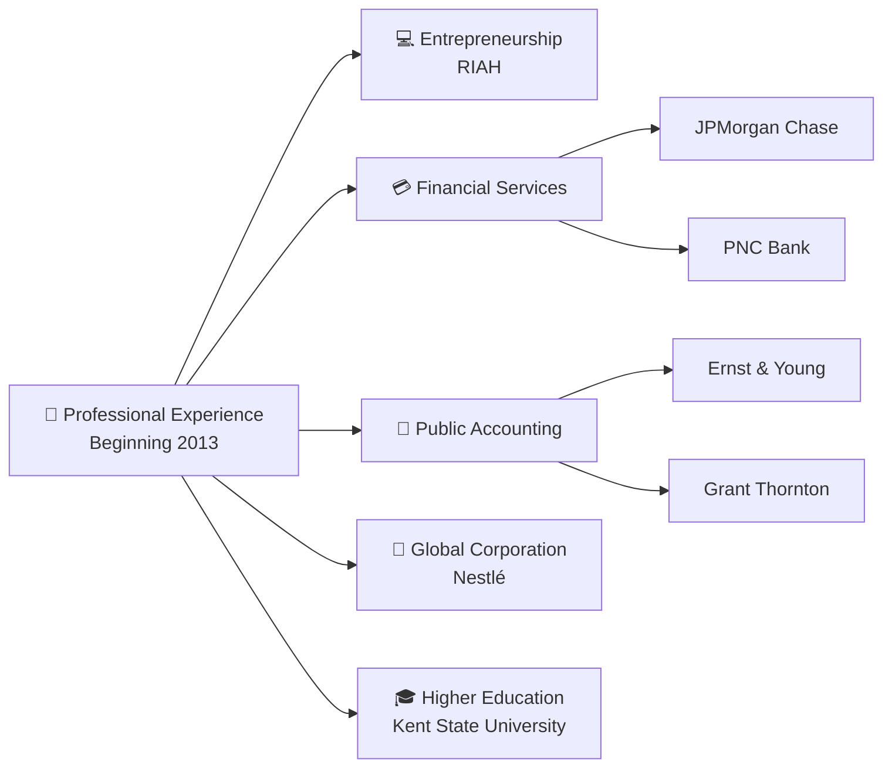

### 👑 Areas of Experience

| Area of Experience |
| --- |
| 🧮 **Accounting** |
| 🔐 **Cybersecurity** |
| 💻 **Technology** |
| 🔍 **Audit** |
| 📈 **Analytics** |
| 💼 **Consulting** |
| 🤖 **Automation** |
| 💻 **Development** |
| ⚙️ **Implementation** |
| 👥 **Management** |
| 💳 **Financial Services** |
| 🧮 **Public Accounting** |
| 🎓 **Higher Education** |
| 💻 **Entrepreneurship** |

#### Accounting, Audit & Finance

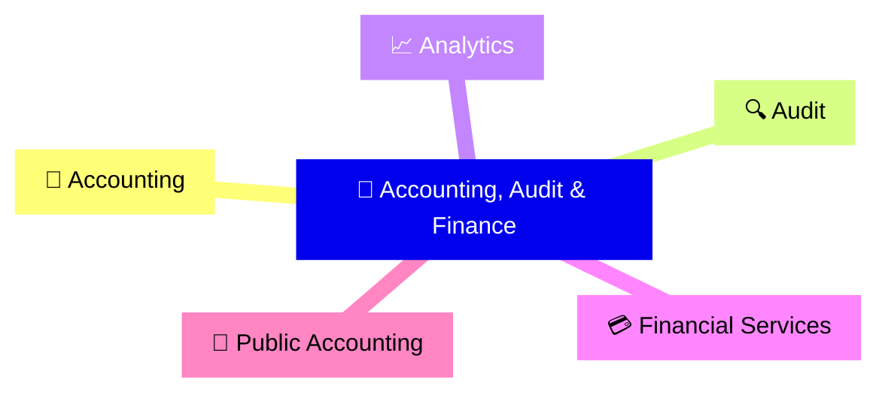

#### Technology & Cybersecurity

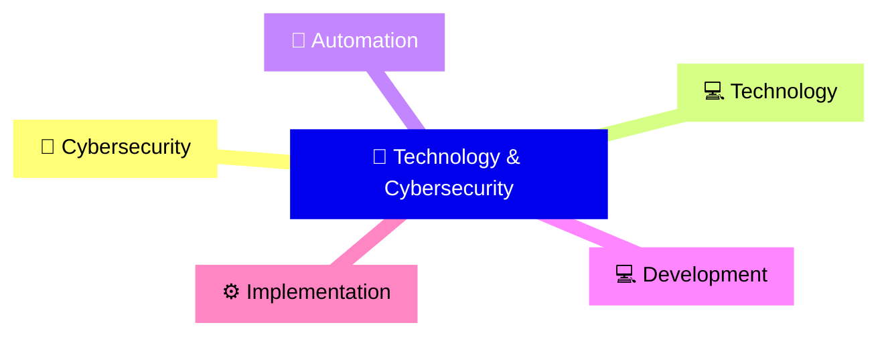

#### Consulting, Management & Professional Environments

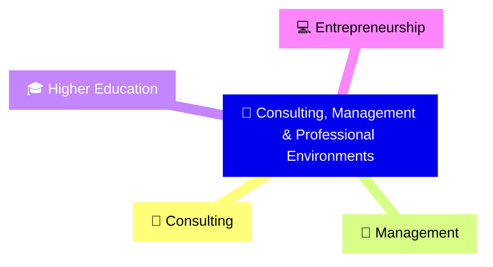

### 👑 RIAH Pathway

**RIAH Pathway has been in the works since June 2025.** As Founder, Chief Executive Officer, and Chairman, **Mariah Dominique Rucker is building RIAH Pathway from A to Z**, including the website, curriculum, academic pathways, experiential programs, admissions structure, tuition framework, products, professional services, technology infrastructure, automations, systems, workflows, integrations, operational structure, and the GitHub repositories supporting the development of the RIAH Pathway ecosystem.

### 🔗 Founder & Professional Profiles

| Platform | Profile |
| --- | --- |
| 💻 **GitHub** | [Mariah Dominique Rucker](https://github.com/mariahdominiquerucker) |
| 💼 **LinkedIn** | [Mariah Dominique Rucker](https://linkedin.com/in/mariahrucker) |
| 🌳 **Professional Portfolio** | [Mariah Rucker Linktree](https://linktr.ee/mariahrucker) |
| 📸 **Instagram** | [@heymariahrucker](https://instagram.com/heymariahrucker) |
| 📘 **Facebook** | [@heymariahrucker](https://facebook.com/heymariahrucker) |
| ▶️ **YouTube** | [@mariahrucker](https://youtube.com/@mariahrucker) |

---

## 💰 Tuition, Products & Pricing Resources

Contributor benefits in this documentation apply to **eligible tuition and eligible products** according to the rules for the applicable participant category.

| Pricing Resource | Purpose |
|---|---|
| 💰 [RIAH Pathway Master Pricing Data Sheet](./RIAH-Pathway-Master-Pricing-Data-Sheet.md) | Review current pathway tuition, program pricing, product pricing and other applicable pricing data. |
| 🧮 [RIAH Pathway Pricing Engine](./RIAH-Pathway-Pricing-Engine.md) | Review the pricing rules and calculation framework used to connect applicable pricing, eligibility, discounts and benefits. |

> **Pricing Calculator Development:** The interactive RIAH Pathway pricing calculator is still being developed. The intended calculator experience will allow eligible participants to apply their verified points and applicable benefit percentage to eligible tuition and product pricing so they can estimate what they may pay. Until that calculator is finalized, use the Master Pricing Data Sheet as the numerical source of truth and the Pricing Engine for consistent calculation and eligibility logic. Ordinary tuition reductions are capped at 25%; eligible upfront payment is 15%; the integrated education and experiential adjustment is 5% before pricing stage. Monthly payments apply to individual courses, with the course-price basis and installment schedule pending configuration. Multiple eligible standalone reviews use 100% for the first, 50% for the second, and 25% for the third.

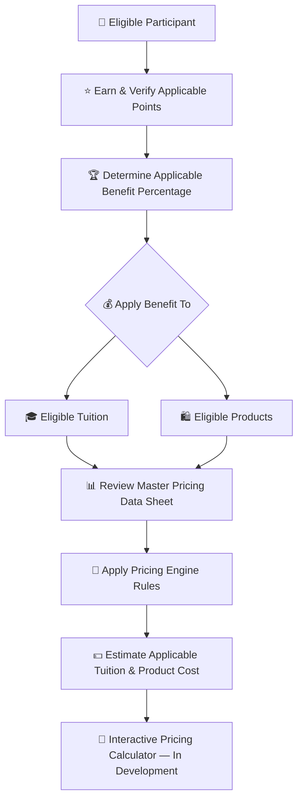

**One Dynasty, Infinite Legacies.**

**Education • Experience • Certifications • Career • Legacy**

RIAH Pathway is a connected ecosystem integrating education, experiential, certifications, career development, products, people, software, mobile applications, technology, professional services, community, and public benefit initiatives.

---

# 🔴 Build With RIAH Pathway

This public repository is more than a website development repository. It is an opportunity for developers, designers, students, educators, professionals, community members, and other contributors to help build the RIAH Pathway ecosystem while becoming eligible for contributor benefits based on applicable participation requirements.

## 👑 Contributor, Ambassador, Graduate & Partner Milestones

**Status: In Progress — Review and Finalization Required**

RIAH Pathway uses category-specific eligibility, verified points, and milestone requirements for public contributors, ambassadors, graduates, and approved partners.

| Category | Eligibility and Milestone Structure | Tuition Benefit | Product Benefit | Documentation |
|---|---|---:|---:|---|
| 💻 GitHub Contributors | 100 approved points = 1%; 2,500 points = maximum milestone | Up to 25% | Up to 25% | [View Documentation](./Contributor-Benefits/GITHUB-CONTRIBUTORS.md) |
| 🌎 Community Ambassadors | 100 approved points = 1%; 2,500 points = maximum milestone | Up to 25% | Up to 25% | [View Documentation](./Contributor-Benefits/AMBASSADORS.md) |
| 🍎 Substitute Teacher Ambassadors | Verified outreach, events, referrals and conversions; 100 points = 1% | Up to 25% | Up to 25% | [View Documentation](./Contributor-Benefits/SUBSTITUTE-TEACHERS.md) |
| 🚗 Rideshare Ambassadors | Verified vehicle marketing, outreach, events, referrals and conversions; 100 points = 1% | Up to 25% | Up to 25% | [View Documentation](./Contributor-Benefits/RIDESHARE.md) |
| 📦 Delivery Ambassadors | Verified vehicle marketing, outreach, events, referrals and conversions; 100 points = 1% | Up to 25% | Up to 25% | [View Documentation](./Contributor-Benefits/DELIVERY.md) |
| 🎓 Education Graduates | Complete entire eligible pathway = guaranteed 1,000 points and 10%; additional 100 approved Graduate Points = +1%; 2,500 points = maximum product milestone; 5,000 points = maximum tuition milestone | Guaranteed 10%; up to 50% | Up to 25% | [View Documentation](./Contributor-Benefits/STUDENTS.md) |
| 💼 Experiential Graduates | Complete entire eligible pathway = guaranteed 1,000 points and 10%; additional 100 points = +1%; 2,500 points = maximum product milestone; 5,000 points = maximum tuition milestone | Guaranteed 10%; up to 50% | Up to 25% | [View Documentation](./Contributor-Benefits/STUDENTS.md) |
| 🤝 Partners | Verified active partner affiliation and applicable written partnership terms | 15% for eligible Partner Employees | 15% for eligible Partner Employees; up to 25% where a separate Partner or Pillar Product Benefit is authorized | [View Documentation](./Contributor-Benefits/PARTNERS.md) |

### ⭐ Points, Eligibility & Verification

- Contributor and Ambassador points are credited only after the underlying activity or deliverable is verified and approved.
- Contributor and Ambassador benefits advance in complete 100-point milestones from 1% through 25%.
- Graduate completion automatically establishes the 1,000-point, 10% tuition milestone. Education Graduates and Experiential Graduates may qualify for a product benefit of up to 25% based on applicable approved Graduate Points and eligibility requirements; the product benefit is not guaranteed at pathway completion.
- Graduate milestones may continue in 100-point increments to 5,000 points and a 50% maximum eligible tuition benefit.
- Partner benefits require verified affiliation and remain governed by the applicable written partnership terms.
- Pending, duplicate, fraudulent, rejected, fabricated, unauthorized, or unverifiable activity receives no permanent points.
- Participation in multiple Contributor or Ambassador tracks does not increase the Contributor and Ambassador benefit beyond 25% tuition and 25% products.

### 📚 Benefit Documentation

[👑 View the Contributor Benefits Documentation Index](./Contributor-Benefits/README.md)

---

# 👑 Documentation

| Documentation | Link |
|---|---|
| Contributor README | [View Documentation](https://github.com/RIAHPathway/Website/blob/main/README-Documentation/CONTRIBUTOR-README.md) |
| Hiring and Equity README | [View Documentation](https://github.com/RIAHPathway/Website/blob/main/README-Documentation/HIRING-AND-EQUITY-README.md) |
| Ecosystem README | [View Documentation](https://github.com/RIAHPathway/Website/blob/main/README-Documentation/ECOSYSTEM-README.md) |
| Education and Pathways README | [View Documentation](https://github.com/RIAHPathway/Website/blob/main/README-Documentation/EDUCATION-PATHWAYS-README.md) |
| Organization and Team README | [View Documentation](https://github.com/RIAHPathway/Website/blob/main/README-Documentation/ORGANIZATION-AND-TEAM-README.md) |
| GitHub Public Development README | [View Documentation](https://github.com/RIAHPathway/Website/blob/main/README-Documentation/GITHUB-PUBLIC-DEVELOPMENT-README.md) |
| Ownership, Licensing, and Security README | [View Documentation](https://github.com/RIAHPathway/Website/blob/main/README-Documentation/OWNERSHIP-LICENSING-SECURITY-README.md) |
| Applications and Participation README | [View Documentation](https://github.com/RIAHPathway/Website/blob/main/README-Documentation/APPLICATIONS-AND-PARTICIPATION-README.md) |
| Website 01–13 README | [View Documentation](https://github.com/RIAHPathway/Website/blob/main/README-Documentation/WEBSITE-01-13-README.md) |
| Foundation and Donations README | [View Documentation](https://github.com/RIAHPathway/Website/blob/main/README-Documentation/FOUNDATION-DONATIONS-README.md) |

## 👑 Contributor Benefits

Community Contributors may qualify for RIAH Pathway tuition and product reductions based on their applicable contribution level. Benefits begin at **1% and may increase up to 25%** in **1% increments**. Tuition reductions remain subject to the applicable ordinary tuition reduction rules and maximum.

| Contributor Benefit | Minimum | Maximum | Increment |
|---|---:|---:|---:|
| 👑 Tuition Reduction | 1% | **25%** | 1% |
| 👑 Product Reduction | 1% | **25%** | 1% |

## 👑 Public Contributor Areas Eligible for Contributor Benefits

Community Contributors may contribute approved work across the RIAH Pathway public ecosystem and may qualify for **tuition and product reductions from 1% up to 25%** based on the applicable contribution level. Contributions can include development, creative work, documentation, policies, media, educational resources, testing, marketing content, and other approved public development work.

| 👑 | Contributor Area | Examples of Contributions |
|---|---|---|
| 👑 | Accessibility | Accessibility reviews, accessibility improvements, content accessibility, navigation improvements, accessibility testing |
| 👑 | Accreditation Documentation | Public accreditation materials, accreditation research support, documentation formatting, public accreditation resources |
| 👑 | Articles and Written Content | Articles, educational content, informational content, public resources, website copy |
| 👑 | Branding and Creative Assets | Branded graphics, visual assets, templates, promotional materials, approved brand resources |
| 👑 | Bug Fixes | Website fixes, broken links, formatting fixes, component fixes, technical corrections |
| 👑 | Components | Website components, reusable interface elements, page components, interactive elements |
| 👑 | Curriculum Documentation | Public curriculum materials, curriculum formatting, course information, pathway documentation |
| 👑 | Documentation | README files, technical documentation, public documentation, instructions, guides, contributor documentation |
| 👑 | Experiential Resources | Experiential materials, pathway resources, training resources, public Experiential documentation |
| 👑 | Flyers and Promotional Materials | Digital flyers, informational flyers, program materials, event materials, promotional graphics |
| 👑 | Forms | Application forms, information forms, contributor forms, public facing forms, form improvements |
| 👑 | Images | Website images, program graphics, pathway graphics, branded visuals, educational graphics |
| 👑 | Marketing Content | Public marketing materials, campaign content, program promotion, pathway promotion, informational marketing assets |
| 👑 | Mobile and Responsive Development | Mobile optimization, responsive layouts, device testing, mobile interface improvements |
| 👑 | Policies | Drafting approved public policies, policy research, policy formatting, policy documentation, policy updates |
| 👑 | Pricing Calculator Development | Calculator interfaces, calculation testing, validation, user experience improvements |
| 👑 | Pricing Engine Development | Pricing Engine development, configuration support, logic testing, documentation, implementation support |
| 👑 | Product Resources | Product descriptions, product documentation, product graphics, product materials, public product resources |
| 👑 | Proposals | Development proposals, feature proposals, documentation proposals, improvement proposals |
| 👑 | Quality Assurance | Content review, functionality review, consistency checks, usability review, quality control |
| 👑 | Research | Public research supporting policies, curriculum, resources, programs, documentation, technology, and approved development |
| 👑 | Responsive Design | Desktop, tablet, and mobile layouts, responsive components, cross device improvements |
| 👑 | Social Content | Social media graphics, educational posts, promotional posts, captions, campaign assets, approved social content |
| 👑 | Technology Documentation | Software documentation, system documentation, technical guides, public technology resources |
| 👑 | Testing | Website testing, calculator testing, component testing, responsive testing, functionality testing |
| 👑 | User Experience and Interface Development | Page layouts, navigation, interface improvements, user flows, public facing experience improvements |
| 👑 | Video Content | Educational videos, promotional videos, pathway videos, demonstrations, explainers, approved social videos |
| 👑 | Website Development | Front end development, website functionality, page development, integrations, approved website improvements |
| 👑 | Website Wireframes | Page wireframes, content layouts, page structures, navigation layouts, interface planning |

> **Contributor Benefit:** Approved Community Contributors may qualify for a **1%–25% tuition reduction** and a **1%–25% product reduction**, assigned in **1% increments** based on the applicable contribution level. Tuition reductions remain subject to the applicable RIAH Pathway ordinary tuition reduction maximum.

---

## 🔴 Beta Team Member Benefits

Eligible RIAH Beta Team Members receive **$0 eligible education tuition** as part of the RIAH Team Member pricing structure.

| Beta Team Benefit | Benefit |
|---|---:|
| 👑 Eligible Education Tuition | **$0** |
| 👑 Eligible Product Reduction | **50%** |
| 👑 Team Member Tuition Reimbursement | **$0** |

> **$0 tuition applies to eligible RIAH education for qualifying RIAH Beta Team Members under the applicable team member requirements and policies.**

---

# 👑 About This Repository

This repository serves as the **public development and contribution layer for the RIAH Pathway website and approved portions of the broader RIAH ecosystem**.

### 🌐 Repository Flow — Part I

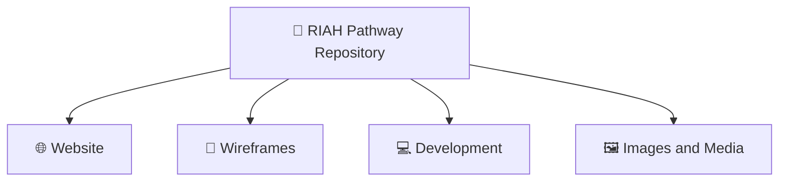

### 📄 Repository Flow — Part II

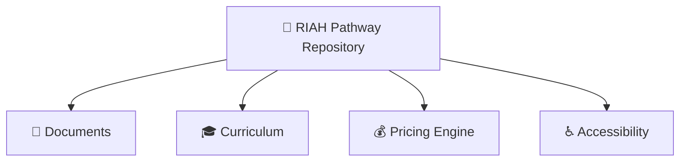

### 💻 Repository Flow — Part III

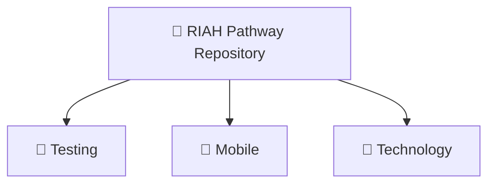

## 👑 Public Development

| 👑 | Public Development | Description |
|---|---|---|
| 👑 | **Website Development** | Development, maintenance, refinement, and implementation of the public RIAH Pathway website and approved website functionality. |
| 👑 | **Website Pages 01–13** | Development and maintenance of the 13 primary website sections from Home through Contact using approved wireframes, content, resources, and specifications. |
| 👑 | **Wireframes and Visual Design** | Page layouts, content placement, visual hierarchy, user experience planning, responsive design specifications, and approved interface concepts. |
| 👑 | **Desktop Development** | Website development, optimization, testing, and presentation for desktop and larger screen environments. |
| 👑 | **Tablet Development** | Responsive development, optimization, navigation, layout, and testing for tablet devices and screen sizes. |
| 👑 | **Mobile Development** | Responsive development, optimization, navigation, layout, and testing for smartphones and smaller screen environments. |
| 👑 | **Images and Media** | Approved photographs, graphics, illustrations, diagrams, branded assets, visual resources, and other website media. |
| 👑 | **Video and Video Scripts** | Approved video content, scripts, storyboards, captions, promotional media, educational media, and supporting production materials. |
| 👑 | **Documents and Downloads** | Public PDFs, guides, brochures, forms, resources, reports, program materials, and other approved downloadable content. |
| 👑 | **Forms** | Applications, inquiries, registrations, submissions, contact forms, information requests, and other approved interactive forms. |
| 👑 | **Policies** | Public policies governing applicable academic, student, operational, product, website, and organizational activities. |
| 👑 | **Procedures** | Documented processes explaining how approved activities, services, programs, and website functions are performed. |
| 👑 | **Guidelines** | Standards and instructions supporting consistent participation, development, documentation, design, and use of RIAH Pathway resources. |
| 👑 | **Curriculum Documentation** | Approved public curriculum structures, programs, courses, pathways, learning sequences, certification mappings, and related academic information. |
| 👑 | **Accreditation Documentation** | Public information and approved documentation concerning accreditation development, institutional accreditation, programmatic accreditation, designations, and recognition pathways. |
| 👑 | **Authorization Documentation** | Public documentation concerning applicable state authorization, registration, exemption, licensure, approval, and regulatory requirements. |
| 👑 | **Admissions Resources** | Admissions pathways, application information, requirements, enrollment stages, orientation information, onboarding resources, and student entry materials. |
| 👑 | **Tuition and Pricing Tools** | Public tuition information, program pricing, payment structures, discounts, cost information, and approved pricing resources. |
| 👑 | **Pricing Engine Development** | Development, testing, maintenance, and validation of the RIAH Pathway Pricing Engine and its approved pricing rules and calculations. |
| 👑 | **Calculators** | Interactive tools for approved tuition, program cost, payment, pathway, discount, transfer, and other applicable calculations. |
| 👑 | **Products and Product Resources** | Public product information, product categories, previews, descriptions, supporting resources, documentation, and approved product materials. |
| 👑 | **Experiential Resources** | Resources supporting Apprentice, Intern, Associate, Senior Associate, Manager, and Executive Experiential pathways and supervised professional learning. |
| 👑 | **Buttons and Calls to Action** | Website buttons, navigation actions, application prompts, enrollment actions, downloads, inquiries, donations, and other approved user actions. |
| 👑 | **Internal and External Links** | Management and validation of approved links connecting website pages, documents, resources, platforms, applications, partners, and external destinations. |
| 👑 | **Accessibility** | Development and testing intended to improve usability, readability, navigation, compatibility, and accessibility across supported website experiences. |
| 👑 | **Components** | Reusable website elements including headers, footers, cards, navigation, forms, sections, buttons, banners, tables, and other interface components. |
| 👑 | **Technology Documentation** | Approved documentation covering website architecture, software, applications, APIs, databases, infrastructure, automation, and related technology systems. |
| 👑 | **Integrations** | Approved connections between the website and external or internal applications, platforms, APIs, databases, forms, automation, and supporting systems. |
| 👑 | **Quality Assurance** | Structured review of content, design, functionality, responsiveness, accessibility, links, calculations, integrations, and approved requirements before release. |
| 👑 | **Testing and Bug Fixes** | Identification, documentation, testing, correction, and verification of website, component, calculation, integration, accessibility, and functionality issues. |
| 👑 | **Approved Proposals and Contributor Work** | Approved ideas, improvements, documentation, development, design, testing, resources, and other contributions accepted for public RIAH Pathway development. |

---

# 👑 Education and Professional Pathways

RIAH Pathway connects academic education, professional development, supervised real world experience, certification preparation, career development, technology, and community within one ecosystem.

## 👑 Academic Pathways

### 🎓 Academic Pathways — Part I

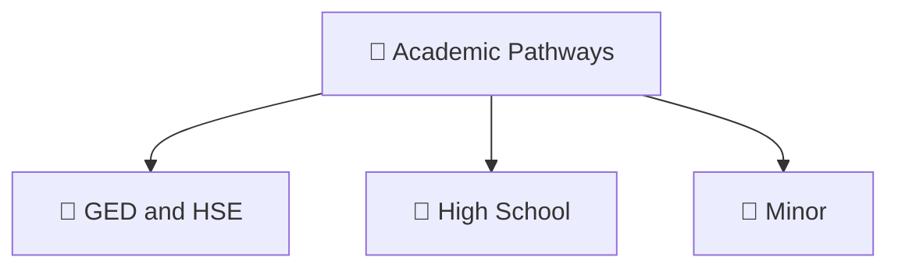

### 🎓 Academic Pathways — Part II

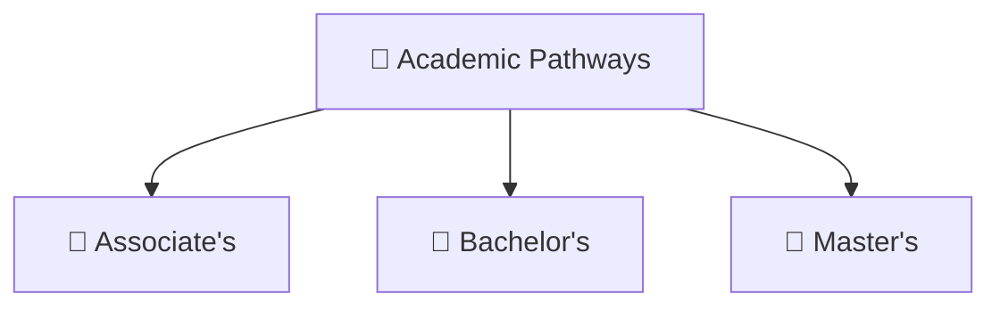

### ⚖️ Academic Pathways — Part III

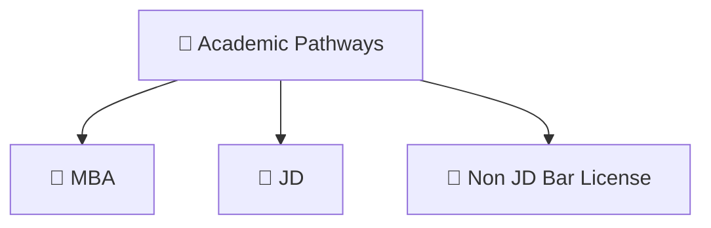

## 👑 Professional Pathways

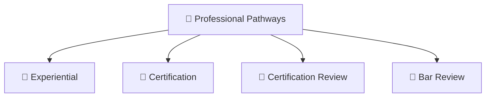
---

# 👑 Schools and Academic Areas

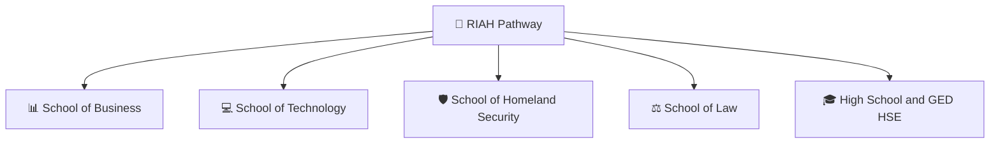

The schools connect academic curriculum with applicable **Experiential learning, professional supervision, certifications, products, technology, community, and career development**.

---

# 👑 Experiential Pathway

RIAH Pathway connects education with supervised professional application and real paid and unpaid work experience with industry professionals from CPA's to Judges.

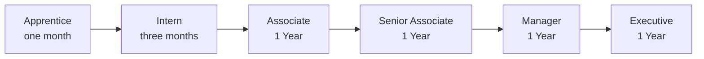

---

# 👑 Technology Ecosystem

RIAH Pathway is designed as more than a website. Technology connects the education, Experiential, certification, career, product, people, and operational components of the ecosystem.

### 🌐 Technology Ecosystem — Part I

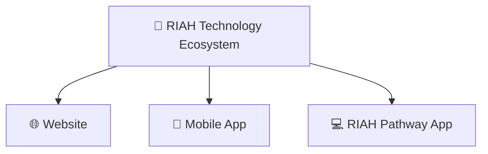

### ⚙️ Technology Ecosystem — Part II

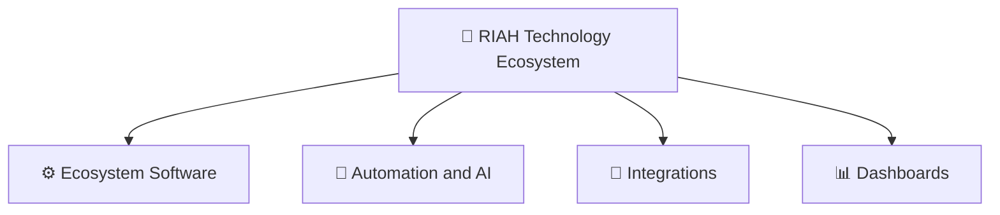

### 🔐 Technology Ecosystem — Part III

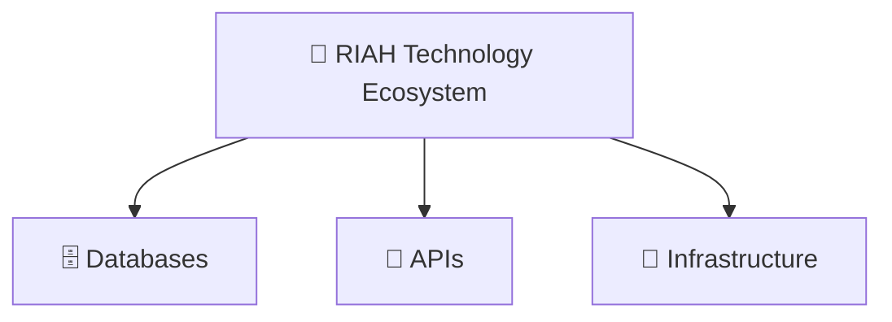

---

# 👑 Accreditation and State Authorization

RIAH Pathway is currently in its **pre accreditation institutional development stage**.

RIAH Pathway is pursuing applicable state authorization across **all 50 states and Washington, D.C.**

## 👑 Accreditation, Approval, Designation and Recognition Pathways

| Organization or Review | School or Category | Majors, Certifications, States and Pathways |
|---|---|---|
| Distance Education Accrediting Commission **(DEAC)** | **Institution Wide** | 👑 Associate's 👑 Bachelor's 👑 Bar Review 👑 Certification 👑 Certification Review 👑 Experiential 👑 GED and HSE 👑 High School 👑 JD 👑 MBA 👑 Master's 👑 Minor 👑 Non JD Bar License |
| Association to Advance Collegiate Schools of Business **(AACSB)** | **School of Business** | 👑 Accounting 👑 Business Management 👑 Entrepreneurship 👑 Finance |
| Accreditation Board for Engineering and Technology **(ABET)** | **School of Technology** | 👑 Computer Science 👑 Cybersecurity 👑 Data Analytics 👑 Data Science 👑 Information Systems 👑 Program Management 👑 Project Management 👑 Software Development 👑 Software Engineering |
| American Bar Association **(ABA)** | **School of Law** | 👑 JD |
| National Centers of Academic Excellence in Cybersecurity **(NSA NCAE C)** | **School of Technology** | 👑 Cybersecurity |
| Academy of Criminal Justice Sciences **(ACJS)** | **School of Homeland Security** | 👑 Governance Risk and Compliance 👑 Intelligence 👑 Physical Security 👑 Private Investigator |
| ACCI | **Experiential** | 👑 Apprentice — 1 Month 👑 Intern — 3 Months 👑 Associate — 1 Year 👑 Senior Associate — 1 Year 👑 Manager — 1 Year 👑 Executive — 1 Year |
| **Non JD State Bar License** | **School of Law** | 👑 Maine — 1 Year 👑 New York — 3 Years 👑 Virginia — 3 Years 👑 West Virginia — 3 Years 👑 California — 4 Years 👑 Vermont — 4 Years 👑 Washington — 4 Years |
| **Certification Review** | **Certification Review** | **Accounting** 👑 ACFE — CFE, Certified Fraud Examiner 👑 AICPA and CIMA — CPA, Certified Public Accountant 👑 IIA — CIA, Certified Internal Auditor 👑 IMA — CMA, Certified Management Accountant 👑 IRS — EA, Enrolled Agent  **Finance** 👑 CFA Institute — CFA, Chartered Financial Analyst 👑 CFP Board — CFP, Certified Financial Planner  **Cybersecurity and Information Systems** 👑 ISACA — CISA, Certified Information Systems Auditor 👑 ISACA — CISM, Certified Information Security Manager 👑 ISACA — CRISC, Certified in Risk and Information Systems Control 👑 ISC2 — CISSP, Certified Information Systems Security Professional  **Project and Program Management** 👑 PMI — PgMP, Program Management Professional 👑 PMI — PMP, Project Management Professional  **Microsoft** 👑 Microsoft — Azure Administrator Associate 👑 Microsoft — Azure AI Engineer Associate 👑 Microsoft — Azure AI Fundamentals 👑 Microsoft — Azure Data Engineer Associate 👑 Microsoft — Azure Data Fundamentals 👑 Microsoft — Azure Data Scientist Associate 👑 Microsoft — Azure Developer Associate 👑 Microsoft — Azure Fundamentals 👑 Microsoft — Azure Network Engineer Associate 👑 Microsoft — Azure Security Engineer Associate 👑 Microsoft — Azure Solutions Architect Expert 👑 Microsoft — DevOps Engineer Expert 👑 Microsoft — Fabric Data Engineer Associate 👑 Microsoft — Power BI Data Analyst Associate  **Hack The Box** 👑 Hack The Box — CAPE 👑 Hack The Box — CDSA 👑 Hack The Box — CJCA 👑 Hack The Box — COAE 👑 Hack The Box — CPTS 👑 Hack The Box — CWEE 👑 Hack The Box — CWES 👑 Hack The Box — CWPE  **Homeland Security** 👑 CLEA — Certified Law Enforcement Analyst 👑 PCI — Professional Certified Investigator 👑 PSP — Physical Security Professional |
| **State Bar License** | **Bar Review** | 👑 Full RIAH Bar Review — All 50 States + Washington, D.C. 👑 California Baby Bar Review |

## 👑 Accreditation Development 

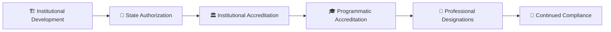

## 👑 State Authorization

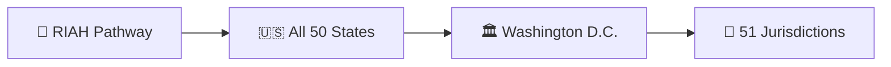

> **Accreditation Disclosure:** RIAH Pathway is currently pre accredited. Accreditation, approval, designation, endorsement, recognition, and state authorization are being pursued and should not be interpreted as already granted unless formally granted by the applicable organization or regulatory authority.

The repository is structured so contributors can work on individual deliverables without needing to build an entire website page or ecosystem component.

RIAH Pathway remains a **private company ecosystem with applicable proprietary intellectual property**.

Public GitHub development does not make private curriculum, internal systems, confidential information, business methods, security sensitive infrastructure, proprietary materials, or other restricted information unrestricted public property.

---

# 🤖 Legacy — RIAH Pathway Replica Bot

**Legacy** is the RIAH Pathway public-source replica-monitoring and evidence-preservation bot. Legacy performs recurring **hourly scans** and **daily evidence audits** against the fixed Tier 1, Tier 2, and Tier 3 RIAH fingerprint, suppresses ordinary prior art, preserves qualifying public evidence and timestamps, verifies accreditation or authorization only from supporting sources, and organizes evidence for human review and the Same-Day Filing workflow.

| Resource | Purpose |
|---|---|
| 🤖 [Legacy — RIAH Pathway Replica Bot](./RIAH-Pathway-Replica-Bot-Legacy.md) | Monitoring purpose, Tier definitions, hourly workflow, daily audit, evidence surfaces, review key, and Replica Bot log. |
| ⚖️ [Same-Day Filing Template](./Same-Day-Filing-Template.md) | Evidence-driven legal intake and filing-preparation framework for qualified human and legal review. |

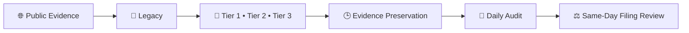

> **Review rule:** A Replica Bot flag is an investigative lead, not a legal conclusion. Similarity alone does not establish copying, access, infringement, misconduct, accreditation, or liability.

---

## RIAH INDEPENDENT-BUILD AND ENFORCEMENT NOTICE

RIAH welcomes lawful inspiration, independent development, competition, commentary, and the use of ideas, methods, standards, and other material that the law leaves free for everyone to use. **Inspiration is not authorization to copy, appropriate, or commercially exploit protected RIAH expression, source materials, confidential information, trademarks, code, designs, or other legally protected rights.**

The message is straightforward: **the concept may be familiar; the protected RIAH implementation is not yours to take.** Building one component does not authorize a person or entity to extract protected material from the broader RIAH ecosystem, reproduce protected RIAH components across another system, use protected RIAH materials to construct a competing component, or commercially enrich itself through unauthorized use of protected RIAH assets.

RIAH expects competitors and builders to create their own work. Review RIAH for lawful inspiration if appropriate, but independently design, write, build, price, document, and operate your own products and systems rather than copying protected RIAH materials, including protected implementations of calculators, content, product structures, code, designs, and other proprietary assets.

Legacy detections are investigative leads, not automatic legal conclusions. When Legacy identifies a potentially material match, RIAH may promptly preserve evidence and conduct human and legal review. If that review supports actionable claims, RIAH may pursue available remedies and may seek to prepare or file an appropriate complaint as soon as the same day or next day when legally and procedurally appropriate. The number and type of claims or counts will depend on the evidence, applicable law, ownership, jurisdiction, venue, procedural requirements, and attorney review.

RIAH does not assume that similarity proves copying or liability. Independent creation, prior art, licensed use, public-domain material, unprotectable ideas or methods, and other lawful explanations must be evaluated before any allegation is made. This notice is a statement of rights-preservation and enforcement posture, not an allegation against any particular person or entity.

RIAH Pathway
