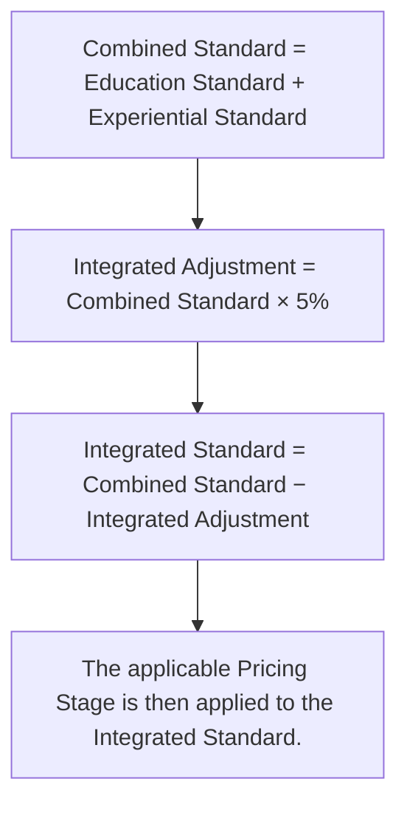
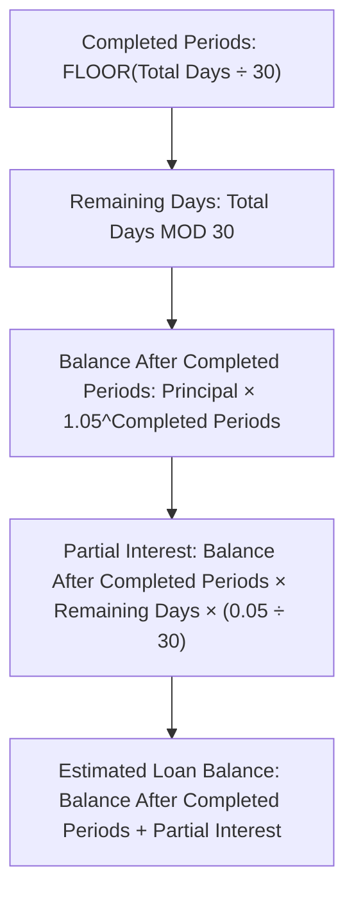

# RIAH Pathway Master Pricing Data Sheet

## Pricing Data Source for the RIAH Pathway Pricing Engine

This sheet contains the established dollar values, percentages, limits,
multipliers, allocations, fees, funding amounts, reductions, financing
values, reimbursement values, and other numerical configuration records
used by the RIAH Pathway Pricing Engine.

The Pricing Engine should reference these structured values rather than
independently recreating or inventing financial values.

------------------------------------------------------------------------

# 1. Academic Standard Tuition

| Pricing Category    | Standard 100% Amount | Unit                        |
|:--------------------|---------------------:|:----------------------------|
| GED and HSE         |              \$1,500 | Total Program               |
| High School Diploma |              \$5,000 | Total Program               |
| Minor               |              \$5,000 | Total Program               |
| Associate’s         |             \$10,000 | Total Program               |
| Bachelor’s          |             \$20,000 | Total Program               |
| Master’s            |             \$15,000 | Total Program               |
| MBA                 |             \$15,000 | Total Program               |
| JD                  |             \$40,000 | Total Program               |
| Non-JD              |             \$10,000 | Per Applicable Pathway Year |

# 2. Pricing Stages

| Pricing Stage                    | Percentage of Standard Price |                  Multiplier |
|:---------------------------------|-----------------------------:|----------------------------:|
| Beta                             |                          25% |                        0.25 |
| Pre-Accreditation                |                          50% |                        0.50 |
| Standard or Post-Accreditation   |                         100% |                        1.00 |
| Grandfathered or Forever Tuition |              Preserved Price | Applicable Preserved Record |

Pricing Stage is separate from ordinary tuition reductions.

# 3. Non-JD Tuition

| Required Pathway Duration | Standard Tuition |
|:--------------------------|-----------------:|
| 1 Year                    |         \$10,000 |
| 2 Years                   |         \$20,000 |
| 3 Years                   |         \$30,000 |
| 4 Years                   |         \$40,000 |

Base rule: **Non-JD Standard Tuition = \$10,000 × Applicable Required
Pathway Years**

Configured jurisdictions include California, Maine, Vermont, Virginia,
Washington, New York, and West Virginia.

The Pricing Stage applies after determining applicable Non-JD tuition.

# 4. Primary and Secondary Degree Pricing

| Component        |              Base Price | Tuition Reduction |
|:-----------------|------------------------:|------------------:|
| Primary Degree   | Applicable Degree Price |                0% |
| Secondary Degree | Applicable Degree Price |                5% |

The Secondary Degree reduction counts toward the ordinary
tuition-reduction maximum. The Secondary Degree may be the same or a
different degree level where academically applicable.

# 5. Minor Pricing

| Minor Type      | Standard Price | Tuition Reduction |
|:----------------|---------------:|------------------:|
| Primary Minor   |        \$5,000 |                0% |
| Secondary Minor |        \$5,000 |                5% |

The Secondary Minor reduction counts toward the ordinary
tuition-reduction maximum.

# 6. Experiential Pricing

| Experiential Selection   | Standard Amount |
|:-------------------------|----------------:|
| Three-Month Experiential |         \$2,500 |
| Intern                   |         \$5,000 |
| Associate                |        \$10,000 |
| Senior Associate         |        \$10,000 |
| Manager                  |        \$10,000 |
| Executive                |        \$10,000 |

# 7. Integrated Education and Experiential Adjustment

| Rule                                             | Value |
|:-------------------------------------------------|------:|
| Integrated Education and Experiential Adjustment |    5% |
| Counts Toward Ordinary Tuition Reduction Maximum |    No |
| Applied Before Pricing Stage                     |   Yes |

# 8. Ordinary Tuition Reductions

| Tuition Reduction                  | Percentage or Amount | Counts Toward Ordinary Cap |
|:-----------------------------------|---------------------:|:---------------------------|
| Upfront Payment                    |                  15% | Yes                        |
| SNAP                               |                   5% | Yes                        |
| TANF                               |                   5% | Yes                        |
| WIC                                |                   5% | Yes                        |
| Qualifying Housing or Homelessness |                   5% | Yes                        |
| Secondary Degree                   |                   5% | Yes                        |
| Primary Minor                      |                   0% | Not Applicable             |
| Secondary Minor                    |                   5% | Yes                        |
| Partner Employee                   |                  15% | Yes                        |
| Community Contributor              |               1%–25% | Yes                        |
| Substitute Teacher Ambassador      |               1%–25% | Yes                        |
| Rideshare and Delivery Ambassador  |               1%–25% | Yes                        |
| Transfer Tuition Reduction         |                  \$0 | Not Applicable             |

# 9. Ordinary Tuition Reduction Cap

| Rule                               | Value |
|:-----------------------------------|------:|
| Maximum Ordinary Tuition Reduction |   25% |

The engine may identify multiple qualifying reductions, but the total
ordinary tuition reduction actually applied cannot exceed 25%.

The Pricing Stage, Integrated Education and Experiential Adjustment,
Scholarships, Grants, Stipends, other applicable funding, Education
Deposit, Student Resource Allocations, and financing do not count toward
the 25% ordinary tuition-reduction maximum.

# 10. Partner Employee Pricing

| Benefit                            | Value |
|:-----------------------------------|------:|
| Partner Employee Tuition Reduction |   15% |
| Partner Employee Product Reduction |   15% |

# 11. RIAH Team Member Pricing

| Benefit                           | Value |
|:----------------------------------|------:|
| Eligible Education Tuition        |   \$0 |
| Eligible Product Reduction        |   50% |
| Team Member Tuition Reimbursement |   \$0 |

# 12. Community Contributor Pricing

| Benefit           | Minimum | Maximum | Increment |
|:------------------|--------:|--------:|----------:|
| Tuition Reduction |      1% |     25% |        1% |
| Product Reduction |      1% |     25% |        1% |

Available calculator values:

| Available Calculator Value | Available Calculator Value | Available Calculator Value | Available Calculator Value | Available Calculator Value |
|---:|---:|---:|---:|---:|
| 1% | 2% | 3% | 4% | 5% |
| 6% | 7% | 8% | 9% | 10% |
| 11% | 12% | 13% | 14% | 15% |
| 16% | 17% | 18% | 19% | 20% |
| 21% | 22% | 23% | 24% | 25% |

The tuition portion remains subject to the 25% maximum ordinary tuition
reduction.

# 13. Substitute Teacher Ambassador Pricing

| Benefit           | Minimum | Maximum | Increment |
|:------------------|--------:|--------:|----------:|
| Tuition Reduction |      1% |     25% |        1% |
| Product Reduction |      1% |     25% |        1% |

Available calculator values:

| Available Calculator Value | Available Calculator Value | Available Calculator Value | Available Calculator Value | Available Calculator Value |
|---:|---:|---:|---:|---:|
| 1% | 2% | 3% | 4% | 5% |
| 6% | 7% | 8% | 9% | 10% |
| 11% | 12% | 13% | 14% | 15% |
| 16% | 17% | 18% | 19% | 20% |
| 21% | 22% | 23% | 24% | 25% |

The tuition portion remains subject to the 25% maximum ordinary tuition
reduction.

# 14. Rideshare and Delivery Ambassador Pricing

| Benefit           | Minimum | Maximum | Increment |
|:------------------|--------:|--------:|----------:|
| Tuition Reduction |      1% |     25% |        1% |
| Product Reduction |      1% |     25% |        1% |

The tuition portion remains subject to the 25% maximum ordinary tuition
reduction.

# 15. Product Reduction Values

| Category                          | Product Reduction |
|:----------------------------------|------------------:|
| RIAH Team Member                  |               50% |
| Partner Employee                  |               15% |
| Community Contributor             |            1%–25% |
| Substitute Teacher Ambassador     |            1%–25% |
| Rideshare and Delivery Ambassador |            1%–25% |

Product reductions are separate from tuition reductions. Taxes,
shipping, handling, and applicable checkout charges remain outside
tuition calculations.

# 16. Education Deposit Resource Allocations

| Pathway     | Student Resource Allocation |
|:------------|----------------------------:|
| Minor       |                       \$250 |
| Associate’s |                       \$500 |
| Bachelor’s  |                     \$1,000 |
| Master’s    |                     \$1,000 |
| MBA         |                     \$1,000 |

# 17. Education Deposit

| Deposit Component           |                                  Amount |
|:----------------------------|----------------------------------------:|
| RIAH Education Deposit Fee  |                              \$500 Once |
| Student Resource Allocation |   Sum of Applicable Pathway Allocations |
| Total Education Deposit     | \$500 + Applicable Resource Allocations |

| Selected Education        | Resource Allocation | RIAH Fee | Education Deposit |
|:--------------------------|--------------------:|---------:|------------------:|
| Minor                     |               \$250 |    \$500 |             \$750 |
| Associate’s               |               \$500 |    \$500 |           \$1,000 |
| Bachelor’s                |             \$1,000 |    \$500 |           \$1,500 |
| Master’s                  |             \$1,000 |    \$500 |           \$1,500 |
| MBA                       |             \$1,000 |    \$500 |           \$1,500 |
| Bachelor’s + Minor        |             \$1,250 |    \$500 |           \$1,750 |
| Bachelor’s + Master’s     |             \$2,000 |    \$500 |           \$2,500 |
| Double Bachelor’s + Minor |             \$2,250 |    \$500 |           \$2,750 |

The \$500 RIAH Fee is charged once per applicable Education Deposit
rather than once for every selected pathway.

# 18. Fees

| Fee                        |                Amount |
|:---------------------------|----------------------:|
| Application Fee            |                  \$50 |
| Admissions Fee             |                   \$0 |
| Enrollment Fee             |                   \$0 |
| Complete Transfer Fee      | \$500 When Applicable |
| Transfer Tuition Reduction |                   \$0 |
| RIAH Education Deposit Fee |            \$500 Once |

# 19. Complete Transfer Fee Internal Allocation

| Internal Component               | Amount |
|:---------------------------------|-------:|
| Transfer Evaluation              |  \$125 |
| Alternative Credit Evaluation    |  \$125 |
| Prior Learning and Credit Review |  \$125 |
| Processing and Administration    |  \$125 |
| Total Complete Transfer Fee      |  \$500 |

These are components of one \$500 fee and are not four additional \$125
charges.

# 20. Transfer Credit Maximums

| Pathway     | Maximum Transfer Credits |
|:------------|-------------------------:|
| Minor       |                6 Credits |
| Associate’s |               30 Credits |
| Bachelor’s  |               60 Credits |
| MBA         |                9 Credits |
| JD          |               60 Credits |

Transfer credits accelerate applicable academic progress. Configured
Transfer Tuition Reduction: **\$0**

# 21. Certification and Bar Review Pricing

| Review Tier | Standard Price |
|:------------|---------------:|
| Basic       |          \$500 |
| Standard    |        \$1,000 |
| Premium     |        \$1,500 |

# 22. Multiple Standalone Review Pricing

| Review Position | Applicable Percentage |
|:----------------|----------------------:|
| First Review    |                  100% |
| Second Review   |                   50% |
| Third Review    |                  100% |

Included Certification Review: **\$0 Additional**

Included Bar Review: **\$0 Additional**

# 23. Need-Based Scholarship Values

| Scholarship Level              | Fixed Award |
|:-------------------------------|------------:|
| Need-Based Scholarship Level 1 |       \$500 |
| Need-Based Scholarship Level 2 |     \$2,500 |
| Need-Based Scholarship Level 3 |     \$5,000 |
| Need-Based Scholarship Level 4 |    \$10,000 |
| Need-Based Scholarship Level 5 |    \$15,000 |
| Need-Based Scholarship Level 6 |    \$50,000 |

Funding ladder: **\$500 → \$2,500 → \$5,000 → \$10,000 → \$15,000 →
\$50,000**

# 24. Merit-Based Scholarship Values

| Scholarship Level               | Fixed Award |
|:--------------------------------|------------:|
| Merit-Based Scholarship Level 1 |       \$500 |
| Merit-Based Scholarship Level 2 |     \$2,500 |
| Merit-Based Scholarship Level 3 |     \$5,000 |
| Merit-Based Scholarship Level 4 |    \$10,000 |
| Merit-Based Scholarship Level 5 |    \$15,000 |
| Merit-Based Scholarship Level 6 |    \$50,000 |

Funding ladder: **\$500 → \$2,500 → \$5,000 → \$10,000 → \$15,000 →
\$50,000**

Scholarship minimum: **\$500**

Scholarship maximum: **\$50,000**

# 25. Need-Based Grant Values

| Grant Level              | Fixed Award |
|:-------------------------|------------:|
| Need-Based Grant Level 1 |       \$500 |
| Need-Based Grant Level 2 |     \$2,500 |
| Need-Based Grant Level 3 |     \$5,000 |
| Need-Based Grant Level 4 |    \$10,000 |
| Need-Based Grant Level 5 |    \$15,000 |
| Need-Based Grant Level 6 |    \$50,000 |

Funding ladder: **\$500 → \$2,500 → \$5,000 → \$10,000 → \$15,000 →
\$50,000**

# 26. Merit-Based Grant Values

| Grant Level               | Fixed Award |
|:--------------------------|------------:|
| Merit-Based Grant Level 1 |       \$500 |
| Merit-Based Grant Level 2 |     \$2,500 |
| Merit-Based Grant Level 3 |     \$5,000 |
| Merit-Based Grant Level 4 |    \$10,000 |
| Merit-Based Grant Level 5 |    \$15,000 |
| Merit-Based Grant Level 6 |    \$50,000 |

Funding ladder: **\$500 → \$2,500 → \$5,000 → \$10,000 → \$15,000 →
\$50,000**

Grant minimum: **\$500**

Grant maximum: **\$50,000**

# 27. Student Support Stipends

| Stipend                         | Fixed Amount |
|:--------------------------------|-------------:|
| Student Support Stipend Level 1 |        \$100 |
| Student Support Stipend Level 2 |        \$200 |
| Student Support Stipend Level 3 |        \$300 |
| Student Support Stipend Level 4 |        \$400 |
| Student Support Stipend Level 5 |        \$500 |

Stipend funding ladder: **\$100 → \$200 → \$300 → \$400 → \$500**

Stipend minimum: **\$100**

Stipend maximum: **\$500**

Applicable support uses may include textbooks, workbooks, graduation
fees, transfer fees, educational materials, and other approved
student-support expenses.

# 28. Internal Funding Pool Allocation

| Institutional Funding Pool          | Allocation |
|:------------------------------------|-----------:|
| Scholarship Pool                    |         5% |
| Grant Pool                          |         5% |
| Stipend Pool                        |         5% |
| Combined Institutional Funding Pool |        15% |

These percentages represent institutional allocation architecture. They
are not automatic individual student awards. Individual student awards
use the established fixed-dollar funding records.

# 29. External Funding

| External Funding Category  | Calculator Amount                   |
|:---------------------------|:------------------------------------|
| External Scholarship       | Student-Entered Estimate            |
| External Grant             | Student-Entered Estimate            |
| External Stipend           | Student-Entered Estimate            |
| Employer Assistance        | Student-Entered or Confirmed Amount |
| Workforce Assistance       | Student-Entered or Confirmed Amount |
| Donor or Community Funding | Applicable Approved Amount          |
| Other Approved Funding     | Applicable Approved Amount          |

Only approved and applicable funding reduces confirmed tuition
responsibility.

# 30. Funding Calculation

**Approved Funding = Approved Scholarships + Approved Grants + Approved
Stipends + Approved Employer Funding + Approved Workforce Funding +
Approved External Funding + Approved Donor or Community Funding + Other
Approved Funding**

**Remaining Tuition = MAX(Tuition After Reductions − Approved Funding,
\$0)**

Minimum Remaining Tuition: **\$0**

Negative tuition is prohibited.

# 31. Tuition Reimbursement

| Reimbursement Rule                                        | Value |
|:----------------------------------------------------------|------:|
| Minimum or Guaranteed Qualifying Completion Reimbursement |   10% |
| Maximum Potential Reimbursement                           |   50% |
| Team Member Tuition Reimbursement                         |   \$0 |

Reimbursement range: **10%–50%**

Reimbursement is calculated against the applicable eligible
reimbursement basis after controlling reductions and non-reimbursable
funding.

# 32. Payment Options

| Payment Option                      | Pricing Value or Rule                                                  |
|:------------------------------------|:-----------------------------------------------------------------------|
| Upfront                             | 15% eligible tuition reduction                                         |
| Monthly                             | Applicable tuition responsibility divided by applicable program months |
| Semester                            | Applicable tuition responsibility divided by applicable semester count |
| Per Course                          | Applicable tuition responsibility divided by configured course count   |
| Financing                           | Separate financing obligation                                          |
| Ordinary RIAH Payment-Plan Interest | 0%                                                                     |

Payment schedule does not redefine total-program tuition.

# 33. Semester Configuration

| Configuration                    |       Value |
|:---------------------------------|------------:|
| Semester Length                  |    6 Months |
| Four-Year Program Semester Count | 8 Semesters |

| Pricing Stage                       | Total JD Tuition | 8-Semester Equivalent |
|:------------------------------------|-----------------:|----------------------:|
| Beta 25%                            |         \$10,000 |  \$1,250 per Semester |
| Pre-Accreditation 50%               |         \$20,000 |  \$2,500 per Semester |
| Standard or Post-Accreditation 100% |         \$40,000 |  \$5,000 per Semester |

# 34. Bachelor’s Per-Course Configuration

| Configuration            |       Value |
|:-------------------------|------------:|
| Bachelor’s Total Credits | 120 Credits |
| Typical Course           |   3 Credits |
| Calculated Course Count  |  40 Courses |

| Pricing Stage                       | Total Tuition | 40-Course Equivalent |
|:------------------------------------|--------------:|---------------------:|
| Beta 25%                            |       \$5,000 |     \$125 per Course |
| Pre-Accreditation 50%               |      \$10,000 |     \$250 per Course |
| Standard or Post-Accreditation 100% |      \$20,000 |     \$500 per Course |

Per-course values are payment allocations and do not change
total-program tuition.

# 35. RIAH Private Student Loan

| Financing Configuration |                     Value |
|:------------------------|--------------------------:|
| Minimum Loan            |                     \$500 |
| Maximum Loan            |                   \$5,000 |
| Minimum Credit Score    |                       650 |
| Interest                |            5% per 30 Days |
| Active Loans Allowed    |                         1 |
| Payment Plan Maximum    |                 12 Months |
| Standard Loan Due Date  | 3 Months After Graduation |

Loan request amount is selected by the student within applicable
eligibility limits. The calculator does not automatically assign the
maximum loan amount. Financing is not a tuition reduction.

# 36. RIAH Private Student Loan Eligibility Exclusions

| Component                       | Loan Eligible                       |
|:--------------------------------|:------------------------------------|
| Associate’s                     | Potentially Eligible                |
| Bachelor’s                      | Potentially Eligible                |
| Master’s                        | Potentially Eligible                |
| MBA                             | Potentially Eligible                |
| JD                              | Potentially Eligible                |
| Applicable Non-JD               | Subject to Applicable Configuration |
| GED and HSE                     | No                                  |
| High School                     | No                                  |
| Standalone Minor                | No                                  |
| Standalone Certification Review | No                                  |
| Standalone Bar Review           | No                                  |
| Products                        | No                                  |

If eligible tuition available for financing is below the \$500 loan
minimum, the RIAH Private Student Loan is unavailable.

# 37. RIAH Private Student Loan Interest

| Rule                   |         Value |
|:-----------------------|--------------:|
| Interest Rate          |            5% |
| Interest Period        | Every 30 Days |
| Partial Period         |      Prorated |
| Maximum Loan Principal |       \$5,000 |

# 38. Loan Recovery Through Reimbursement

**Gross Reimbursement = Eligible Reimbursable Tuition × Applicable
Reimbursement Percentage**

**RIAH Loan Recovery = MIN(Gross Reimbursement, Outstanding RIAH Loan
Balance)**

**Remaining RIAH Loan = MAX(Outstanding RIAH Loan − Gross Reimbursement,
\$0)**

**Student Reimbursement = MAX(Gross Reimbursement − Outstanding RIAH
Loan Balance, \$0)**

# 39. Included Zero-Dollar Components

| Component                                | Additional Price |
|:-----------------------------------------|-----------------:|
| Admissions Fee                           |              \$0 |
| Enrollment Fee                           |              \$0 |
| Transfer Tuition Reduction               |              \$0 |
| Included Certification Review            |              \$0 |
| Included Bar Review                      |              \$0 |
| Primary Major                            |   \$0 Additional |
| Standard Concentration or Specialization |   \$0 Additional |
| Eligible Team Education Tuition          |              \$0 |
| Team Tuition Reimbursement               |              \$0 |

Where active policy establishes inclusion, applicable standard
transcript, diploma, graduation items, cap and gown, orientation, and
standard administrative services are also treated as included rather
than separately charged.

# 40. Master Active Number Table

| Pricing Record                                      |              Active Value |
|:----------------------------------------------------|--------------------------:|
| GED and HSE Tuition                                 |                   \$1,500 |
| High School Tuition                                 |                   \$5,000 |
| Minor Tuition                                       |                   \$5,000 |
| Associate’s Tuition                                 |                  \$10,000 |
| Bachelor’s Tuition                                  |                  \$20,000 |
| Master’s Tuition                                    |                  \$15,000 |
| MBA Tuition                                         |                  \$15,000 |
| JD Tuition                                          |                  \$40,000 |
| Non-JD Tuition                                      |         \$10,000 per Year |
| Beta Pricing Stage                                  |                       25% |
| Pre-Accreditation Pricing Stage                     |                       50% |
| Standard or Post-Accreditation                      |                      100% |
| Three-Month Experiential                            |                   \$2,500 |
| Intern Experiential                                 |                   \$5,000 |
| Associate Experiential                              |                  \$10,000 |
| Senior Associate Experiential                       |                  \$10,000 |
| Manager Experiential                                |                  \$10,000 |
| Executive Experiential                              |                  \$10,000 |
| Integrated Education and Experiential Adjustment    |                        5% |
| Upfront Payment Reduction                           |                       15% |
| SNAP Reduction                                      |                        5% |
| TANF Reduction                                      |                        5% |
| WIC Reduction                                       |                        5% |
| Housing or Homelessness Reduction                   |                        5% |
| Secondary Degree Reduction                          |                        5% |
| Primary Minor Reduction                             |                        0% |
| Secondary Minor Reduction                           |                        5% |
| Partner Employee Tuition Reduction                  |                       15% |
| Partner Employee Product Reduction                  |                       15% |
| Community Contributor Tuition Reduction             |                    1%–25% |
| Community Contributor Product Reduction             |                    1%–25% |
| Substitute Teacher Ambassador Tuition Reduction     |                    1%–25% |
| Substitute Teacher Ambassador Product Reduction     |                    1%–25% |
| Rideshare and Delivery Ambassador Tuition Reduction |                    1%–25% |
| Rideshare and Delivery Ambassador Product Reduction |                    1%–25% |
| Maximum Ordinary Tuition Reduction                  |                       25% |
| Team Tuition                                        |                       \$0 |
| Team Product Reduction                              |                       50% |
| Team Reimbursement                                  |                       \$0 |
| Application Fee                                     |                      \$50 |
| Admissions Fee                                      |                       \$0 |
| Enrollment Fee                                      |                       \$0 |
| Complete Transfer Fee                               |                     \$500 |
| Transfer Tuition Reduction                          |                       \$0 |
| Minor Resource Allocation                           |                     \$250 |
| Associate’s Resource Allocation                     |                     \$500 |
| Bachelor’s Resource Allocation                      |                   \$1,000 |
| Master’s Resource Allocation                        |                   \$1,000 |
| MBA Resource Allocation                             |                   \$1,000 |
| RIAH Education Deposit Fee                          |                \$500 Once |
| Basic Certification or Bar Review                   |                     \$500 |
| Standard Certification or Bar Review                |                   \$1,000 |
| Premium Certification or Bar Review                 |                   \$1,500 |
| First Standalone Review                             |                      100% |
| Second Standalone Review                            |                       50% |
| Third Standalone Review                             |                      100% |
| Included Review                                     |                       \$0 |
| Scholarship Minimum                                 |                     \$500 |
| Scholarship Maximum                                 |                  \$50,000 |
| Grant Minimum                                       |                     \$500 |
| Grant Maximum                                       |                  \$50,000 |
| Stipend Minimum                                     |                     \$100 |
| Stipend Maximum                                     |                     \$500 |
| Scholarship Pool                                    |                        5% |
| Grant Pool                                          |                        5% |
| Stipend Pool                                        |                        5% |
| Combined Institutional Funding Pool                 |                       15% |
| Minimum Tuition Reimbursement                       |                       10% |
| Maximum Tuition Reimbursement                       |                       50% |
| Ordinary RIAH Payment-Plan Interest                 |                        0% |
| RIAH Private Student Loan Minimum                   |                     \$500 |
| RIAH Private Student Loan Maximum                   |                   \$5,000 |
| RIAH Private Student Loan Minimum Credit Score      |                       650 |
| RIAH Private Student Loan Interest                  |            5% per 30 Days |
| RIAH Private Student Loan Due Date                  | 3 Months After Graduation |
| RIAH Private Student Loan Payment Plan Maximum      |                 12 Months |
| Semester Length                                     |                  6 Months |
| Four-Year Semester Count                            |                         8 |
| Bachelor’s Credits                                  |                       120 |
| Typical Bachelor’s Course                           |                 3 Credits |
| Bachelor’s Course Count                             |                        40 |
| Minimum Remaining Tuition                           |                       \$0 |

# 41. Master Scholarship, Grant, and Stipend Lookup Table

| Funding Type | Category        | Level | Fixed Amount |
|:-------------|:----------------|------:|-------------:|
| Scholarship  | Need-Based      |     1 |        \$500 |
| Scholarship  | Need-Based      |     2 |      \$2,500 |
| Scholarship  | Need-Based      |     3 |      \$5,000 |
| Scholarship  | Need-Based      |     4 |     \$10,000 |
| Scholarship  | Need-Based      |     5 |     \$15,000 |
| Scholarship  | Need-Based      |     6 |     \$50,000 |
| Scholarship  | Merit-Based     |     1 |        \$500 |
| Scholarship  | Merit-Based     |     2 |      \$2,500 |
| Scholarship  | Merit-Based     |     3 |      \$5,000 |
| Scholarship  | Merit-Based     |     4 |     \$10,000 |
| Scholarship  | Merit-Based     |     5 |     \$15,000 |
| Scholarship  | Merit-Based     |     6 |     \$50,000 |
| Grant        | Need-Based      |     1 |        \$500 |
| Grant        | Need-Based      |     2 |      \$2,500 |
| Grant        | Need-Based      |     3 |      \$5,000 |
| Grant        | Need-Based      |     4 |     \$10,000 |
| Grant        | Need-Based      |     5 |     \$15,000 |
| Grant        | Need-Based      |     6 |     \$50,000 |
| Grant        | Merit-Based     |     1 |        \$500 |
| Grant        | Merit-Based     |     2 |      \$2,500 |
| Grant        | Merit-Based     |     3 |      \$5,000 |
| Grant        | Merit-Based     |     4 |     \$10,000 |
| Grant        | Merit-Based     |     5 |     \$15,000 |
| Grant        | Merit-Based     |     6 |     \$50,000 |
| Stipend      | Student Support |     1 |        \$100 |
| Stipend      | Student Support |     2 |        \$200 |
| Stipend      | Student Support |     3 |        \$300 |
| Stipend      | Student Support |     4 |        \$400 |
| Stipend      | Student Support |     5 |        \$500 |

# 42. Engine Source-of-Truth Rule

The RIAH Pathway Pricing Engine should retrieve applicable financial
values from this Master Pricing Data Sheet or its corresponding
structured database records.

The engine should not independently invent tuition, fees, deposits,
resource allocations, reductions, product reductions, scholarship
awards, grant awards, stipends, financing amounts, interest rates,
reimbursement percentages, review pricing, pricing-stage multipliers,
transfer financial treatment, or any other financial amount.

Where a required financial value is not configured, the engine should
return:

**PENDING CONFIGURATION**

rather than creating a value.

# 43. Source Conflicts Requiring Engine Synchronization

The current Pricing Engine source and the newer Student Cost Guide
contain several conflicting numerical records. These should not be
silently combined.

| Configuration                                    |  Student Cost Guide Value |       Older Pricing Engine Value |
|:-------------------------------------------------|--------------------------:|---------------------------------:|
| Integrated Education and Experiential Adjustment |                        5% |                              25% |
| Maximum Ordinary Tuition Reduction               |                       25% |                              50% |
| Upfront Payment Reduction                        |                       15% |                              25% |
| Education Deposit RIAH Fee                       |                     \$500 |    Older fixed deposit structure |
| Education Deposit Resource Allocation            |             Pathway-Based | Older fixed allocation structure |
| RIAH Private Student Loan Minimum Credit Score   |                       650 |                              600 |
| RIAH Private Student Loan Due Date               | 3 Months After Graduation |           Older 12-Month wording |
| Third Standalone Certification Review            |                      100% |                              25% |

For this Master Pricing Data Sheet, the values contained in the newer
detailed Student Cost Guide are listed as the active pricing-sheet
values.

The underlying Pricing Engine logic should be synchronized to the
approved active values before production use so the engine and its
pricing database do not produce conflicting results.
