# RIAH Pathway Pricing Engine

> **SELF-TEACHING MASTER BUILD FILE** — This combined Markdown preserves the complete Pricing Engine build logic and the complete Tuition, Pricing, Fees, and Student Cost Guide below.

---

## PART I — SELF-TEACHING PRICING ENGINE AND SOFTR AI BUILD LOGIC

# RIAH Pathway Pricing Engine --- Softr AI Build Prompt and Master Calculator Logic

## PURPOSE

Build one responsive application named **RIAH Pathway Pricing Engine**
for Softr.

Student-facing heading:

**BUILD YOUR RIAH PATHWAY. SEE WHAT IT COSTS.**

This is not a simple arithmetic calculator. It is one deterministic:

**Pathway Builder + Eligibility Engine + Conditional Rules Engine +
Pricing Engine + Combination Engine + Transfer Engine + Experiential
Engine + Non-JD Legal Engine + Certification Engine + Tuition Reduction
Engine + Funding Engine + Deposit and Fee Engine + Product Engine +
Payment Engine + Refund and Earned Amount Engine + Reimbursement
Engine + Results Generator + Administrative Rule Trace.**

The AI may build the interface and database, but **AI must never invent
a financial result**. All dollar values, percentages, statuses,
eligibility decisions, and calculations must come from structured
records and deterministic rules.

------------------------------------------------------------------------

# 1. NON-NEGOTIABLE ENGINE PRINCIPLES

1.  Determine applicability before money.
2.  Determine eligibility before approval.
3.  Determine approval or selection before applying a financial benefit.
4.  Every component receives one status before calculation:
    -   Included
    -   Required
    -   Optional
    -   Eligible
    -   Approved
    -   Pending
    -   Conditional
    -   Waived
    -   External
    -   Not Eligible
    -   Not Applicable
5.  Use one master engine for every website entry point.
6.  Never duplicate a charge, discount, funding award, deposit, review,
    included component, or financial benefit.
7.  Never let pending or potential funding reduce confirmed
    responsibility.
8.  Never return negative tuition.
9.  Never treat financing as a tuition reduction.
10. Never treat employment wages as a tuition reduction.
11. Never treat an institutional funding-pool percentage as an
    individual student award.
12. Never invent missing pricing, financing, legal, eligibility,
    reimbursement, award, or external-cost rules.
13. Missing rules must return **PENDING CONFIGURATION**.
14. Preserve Pricing Version, Effective Date, Entry Cohort, Grandfather
    Status, and preserved Forever Tuition price.
15. A newer public price must never overwrite a valid preserved student
    price.

------------------------------------------------------------------------

# 2. CURRENT PRICING CONFIGURATION

Store these as data records, not hard-coded UI formulas.

## Academic Standard Prices

-   GED and HSE: \$1,500 total program, including 12 concurrent college General Education credits across College English, College Math, History, and Science. Applicable completed coursework converts into General Education college credit while GED and HSE preparation is completed concurrently.
-   High School Diploma: \$5,000 total program. High School students participate in concurrent enrollment within a 60-credit General Education structure, with 30 college General Education credits embedded and converted throughout the High School curriculum. The current price may change slightly as duration and added program components are finalized through community suggestions and final RIAH approval.
-   Minor: \$5,000
-   Associate's: \$10,000
-   Bachelor's: \$20,000
-   Master's: \$15,000
-   MBA: \$15,000
-   JD: \$40,000
-   Non-JD: \$10,000 per required pathway year

## Pricing Stages

-   Beta: 25% of applicable standard configuration
-   Pre-Accreditation: 50%
-   Standard or Post-Credential: 100%
-   Valid Grandfathered or Forever Tuition: use preserved applicable
    written pricing instead of replacing it with current public pricing

## Non-JD Standard Duration Values

-   1 year: \$10,000
-   2 years: \$20,000
-   3 years: \$30,000
-   4 years: \$40,000

If a jurisdiction requires a duration not configured in the active
pricing database, return **PENDING CONFIGURATION**. Do not extrapolate
unless an active rule explicitly authorizes it.

## Experiential Current Price Records

-   Three-Month Experiential: \$2,500
-   Intern: \$5,000
-   Associate: \$10,000
-   Senior Associate: \$10,000
-   Manager: \$10,000
-   Executive: \$10,000

Experiential eligibility is not placement. Status must progress
independently through Eligible, Selected, and Placement or Commitment
Requirements Satisfied where applicable.

## Certification Review

-   Basic: \$500
-   Standard: \$1,000
-   Premium: \$1,500

Multiple eligible standalone reviews: - First: 100% - Second: 50% -
Third: 100%

Three-review totals follow the active first-review 100%, second-review 50%, and third-review 100% sequence.

Included Certification Review = \$0 additional. Included Bar Review =
\$0 additional.

### Technology and Cybersecurity Certification Review Coverage

The Technology and Cybersecurity Certification Review catalog includes the existing configured review courses plus the following expanded vendor and cybersecurity coverage. Every eligible standalone certification review uses the same Certification Review pricing tiers established above: **Basic $500, Standard $1,000, Premium $1,500**. Included reviews remain **$0 additional** where an applicable pathway includes the review.

| Certification Area | Review Course Coverage | Basic | Standard | Premium |
|:---|:---|---:|---:|---:|
| Cybersecurity — Red Team | OSCP — Offensive Security Certified Professional | $500 | $1,000 | $1,500 |
| Cybersecurity — Ethical Hacking | CEH — Certified Ethical Hacker | $500 | $1,000 | $1,500 |
| Cybersecurity — Governance and Security | CISSP, CISA, CISM, CRISC and other existing configured RIAH cybersecurity review courses | $500 | $1,000 | $1,500 |
| CompTIA | All CompTIA certifications for which RIAH offers a Certification Review course | $500 | $1,000 | $1,500 |
| Microsoft and Azure | All Microsoft and Microsoft Azure certifications for which RIAH offers a Certification Review course, including Azure Fundamentals and Azure Solutions Architect Expert where configured | $500 | $1,000 | $1,500 |
| Google | All Google and Google Cloud certifications for which RIAH offers a Certification Review course | $500 | $1,000 | $1,500 |
| Amazon Web Services | All AWS certifications for which RIAH offers a Certification Review course | $500 | $1,000 | $1,500 |

This expansion adds eligible certification coverage only. It does **not** change Certification Review pricing, multiple-review rules, included-review treatment, discount logic, refund rules, or any other Pricing Engine calculation rule.


## Fees and Deposits

-   Application Fee: \$50
-   Admissions Fee: \$0
-   Enrollment Fee: \$0
-   Complete Transfer Fee: \$500 when applicable
-   Education Deposit: \$500 RIAH Education Deposit Fee once per applicable Education Deposit plus the sum of applicable Student Resource Allocations
    -   Minor Resource Allocation: \$250
    -   Associate's Resource Allocation: \$500
    -   Bachelor's Resource Allocation: \$1,000
    -   Master's Resource Allocation: \$1,000
    -   MBA Resource Allocation: \$1,000

Deposit behavior must be rule-driven. Do not automatically charge two
deposits when Education and Experiential begin together if the active
deposit rule says one initial standard deposit applies. If active
pricing records conflict, the engine must select by Pricing Version and
Effective Date; if no deterministic winner exists, return PENDING
CONFIGURATION instead of guessing.

## Transfer Fee Internal Allocation

One Complete Transfer Fee = \$500: - Transfer Evaluation: \$125 -
Alternative Credit Evaluation: \$125 - Prior Learning and Credit Review:
\$125 - Processing and Administration: \$125

These are internal components of one \$500 charge, not four additional
charges.

## Transfer Maximums

-   Minor: up to 6 credits
-   Associate's: up to 30 credits
-   Bachelor's: up to 60 credits
-   MBA: up to 9 credits
-   JD: up to 27 credits

Transfer approval and transfer tuition treatment are separate.
Self-reported credits do not create an approved reduction.

## Tuition Reductions

Potential rules include: - Eligible upfront payment: 15% - SNAP: 5% -
TANF: 5% - WIC: 5% - Qualifying homelessness or housing hardship: 5% -
Secondary degree: 5% - Secondary minor: 5% - Partner employee: 15% -
Community Contributor: 1%-25% - Substitute Teacher Ambassador: 1%-25% -
Rideshare and Delivery Ambassador: 1%-25%.

The Education + Experiential 5% combination adjustment is a
**structural adjustment**, not an eligibility discount, and occurs
before pricing stage. It does not count toward the ordinary tuition
reduction maximum.

Maximum combined ordinary tuition reductions governed by the ceiling =
25%.

## Funding Pools

Institutional allocation architecture: - Scholarship pool: 5% - Grant
pool: 5% - Stipend pool: 5% - Combined institutional pool: 15%

These percentages are not automatic student awards.

## Reimbursement

-   Guaranteed qualifying completion reimbursement: 10% of eligible
    reimbursement basis when all requirements are satisfied
-   Maximum potential reimbursement: up to 50%
-   Intermediate milestones: PENDING CONFIGURATION unless an active
    published rule exists

## Payment

-   Upfront
-   Monthly
-   Semester or term where configured
-   Per-course or course-unlock where configured
-   Financing
-   Ordinary RIAH payment-plan interest: 0%

## RIAH Student Loan Configuration

Where the active institutional financing record uses this structure: -
Minimum: \$500 - Maximum: \$5,000 - Collateral-supported tier: up to 10% of qualifying collateral - Credit score required above the 10% collateral tier: 700+ -
Interest: 5% per 30 days - Active loans allowed: 1 - Payment plan maximum:
12 months - Standard loan due date: 3 months after graduation - Subject to credit
approval - All RIAH pathways are eligible for loan consideration. Without the higher-loan credit tier, the approved amount cannot exceed 10% of qualifying collateral. A credit score of 700 or above is required for an amount above the 10% collateral-supported tier, subject to the remaining tuition deficit and \$5,000 maximum

Financing remains debt/payment method and never reduces underlying
tuition.

------------------------------------------------------------------------

# 3. DATABASE ARCHITECTURE

Create relational tables:

1.  Schools
2.  Programs
3.  Credentials
4.  Majors
5.  Pathways
6.  Pricing Records
7.  Pricing Stages
8.  Pricing Versions
9.  Student Pricing Preservation
10. Experiential Programs
11. Experiential Capacity
12. Non-JD Jurisdictions
13. Non-JD Degree Conversions
14. Academic Add-Ons
15. Certification Reviews
16. Legal and Bar Components
17. Transfer Rules
18. Transfer Evaluations
19. Tuition Reduction Rules
20. Scholarship Programs
21. Grant Programs
22. Stipend Programs
23. Funding Sources
24. Funding Applications and Awards
25. Deposit Rules
26. Fee Rules
27. Products
28. Product Discounts
29. Payment Options
30. Financing Rules
31. Refund Rules
32. Reimbursement Rules
33. Conditional Rules
34. External Costs
35. Calculator Sessions
36. Calculator Inputs
37. Calculator Results
38. Rule Trace
39. Test Scenarios
40. Audit Log

------------------------------------------------------------------------

# 4. PRICING RECORD SCHEMA

Each pricing record must support:

-   Pricing_ID
-   School_ID
-   Program_ID
-   Credential_ID
-   Major_ID
-   Pathway_ID
-   Component_ID
-   Component_Type
-   Standard_100_Percent_Price
-   Pricing_Stage
-   Stage_Percentage
-   Forever_Tuition_Eligible
-   Grandfather_Eligible
-   Experiential_Eligible
-   Certification_Eligible
-   Legal_Eligible
-   Included_Components
-   Required_Fees
-   Effective_Date
-   Expiration_Date
-   Pricing_Version
-   Active_Status
-   Created_At
-   Updated_At

Do not hard-code hundreds of values into GUI components.

------------------------------------------------------------------------

# 5. CONDITIONAL RULE SCHEMA

Every rule supports:

-   Rule_ID
-   Rule_Name
-   Rule_Category
-   Description
-   Input_Field
-   Operator
-   Comparison_Value
-   Required_Status
-   Action_Type
-   Action_Value
-   Percentage
-   Fixed_Amount
-   Minimum
-   Maximum
-   Included_or_Separate
-   RIAH_or_External
-   Priority
-   Stacking_Rule
-   Effective_Date
-   Expiration_Date
-   Pricing_Version
-   Active_Status

Rules execute according to business priority and governing calculation
order, not accidental database order.

------------------------------------------------------------------------

# 6. CALCULATOR INPUT MODEL

Collect or system-resolve:

## Identity and Status

-   Calculator Session ID
-   Prospective, Applicant, Accepted, Enrolled or Current
-   Team status
-   Founder status
-   Beta status
-   Pre-Accreditation status
-   Post-Accreditation or Standard status
-   Grandfathered or Forever Tuition status
-   Entry cohort
-   Applicable pricing version

## Pathway

-   School
-   Program
-   Credential
-   Major
-   Pathway
-   Additional major
-   Minor
-   Additional minor
-   Concentration
-   Additional concentration
-   JD type where applicable
-   Non-JD jurisdiction where applicable

## Experiential

-   Requested
-   Eligibility
-   Level
-   Capacity status
-   Selection status
-   Placement or commitment status
-   Start timing relative to Education

## Transfer

-   Incoming credit reported
-   Evaluation status
-   Approved credits
-   Transfer tier
-   Transfer reduction
-   Complete transfer process required

## Tuition Reduction Eligibility

-   Upfront payment
-   SNAP
-   TANF
-   WIC
-   Homelessness or housing hardship
-   Other approved reduction
-   Verification status for each

## Funding

For every funding source: - Eligible - Application required - Applied -
Selected - Approved - Funding available - Approved amount - Expense
eligibility - Conditions satisfied - Pending amount

## Fees and Deposits

-   Application fee trigger
-   Initial deposit trigger
-   Additional deposit trigger
-   Transfer fee trigger
-   Included administrative items

## Products and Support

-   SKU
-   Quantity
-   Inclusion status
-   Product price
-   Eligible product reduction
-   Tax
-   Shipping

## Payment and Financing

-   Payment route
-   Upfront eligibility
-   Monthly schedule
-   Course unlock schedule
-   Financing selected
-   Financing approval status
-   Approved financing terms

## Reimbursement

-   Pathway completed
-   Reimbursement requirements satisfied
-   Eligible reimbursement basis
-   Guaranteed eligibility
-   Maximum potential eligibility

------------------------------------------------------------------------

# 7. STUDENT WIZARD FLOW

## Step 1 --- Build My Pathway

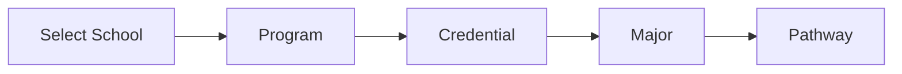

Only active and applicable options appear.

## Step 2 --- Determine My Pricing Status

System determines Grandfathered or Forever Tuition first, then Beta,
Pre-Accreditation, or Standard/Post-Credential.

Students cannot manually override a system-controlled pricing stage.

## Step 3 --- Customize My Pathway

Conditionally show only applicable: - Experiential - Additional Major -
Minor or Additional Minor - Additional Concentration - Certification
Review - Non-JD - Legal or Bar components - Additional jurisdictions

## Step 4 --- Transfer and Prior Learning

Collect potential incoming credit but do not grant financial treatment
until approved.

## Step 5 --- Tuition Reduction Eligibility

Ask qualifying questions. Do not present every discount as if
automatically available.

## Step 6 --- Funding

Process Scholarship, Grant, Stipend, Employer, Workforce, External,
Donor, Community, and Other Approved Funding independently.

## Step 7 --- Products and Support

Offer only applicable products and support. Keep them separate from
tuition unless explicitly included.

## Step 8 --- Payment

Select Upfront, Monthly, Course-Unlock, Semester/Term where configured,
or Financing.

## Step 9 --- Calculate

Run the deterministic master engine.

## Step 10 --- Results

Return confirmed responsibility, pending benefits, payment information,
reimbursement information, and external costs separately.

------------------------------------------------------------------------

# 8. GOVERNING 29-STEP CALCULATION ORDER

1.  Determine Student or Applicant Status.
2.  Determine Pathway Eligibility.
3.  Determine Pricing Stage or valid Grandfathered/Forever Tuition
    stage.
4.  Determine 100% Standard Program Price.
5.  Determine Program Type or Combination.
6.  Apply Structural Combination Rules.
7.  Determine Transfer, Alternative Credit, or Prior-Learning
    Eligibility.
8.  Determine Non-JD or Legal Rules if applicable.
9.  Determine Experiential Eligibility and Selection if applicable.
10. Determine Included versus Separately Priced Components.
11. Calculate Pricing-Stage Amount.
12. Determine Eligible Tuition Reductions.
13. Apply 50% Tuition-Reduction Ceiling.
14. Determine Scholarship Eligibility.
15. Determine Grant Eligibility.
16. Determine Stipend Eligibility.
17. Determine Employer, Workforce, and External Funding.
18. Calculate Remaining Tuition.
19. Determine Applicable Fees.
20. Determine Deposit Triggers.
21. Determine Optional Products and Support.
22. Determine Payment Route.
23. Determine Financing Eligibility if selected.
24. Calculate Current Student Responsibility.
25. Determine Earned and Refundable Amounts.
26. Determine Reimbursement Eligibility.
27. Calculate Eligible Reimbursement.
28. Separately Disclose External Costs.
29. Return Final Pricing Breakdown.

------------------------------------------------------------------------

# 9. PRICING-STAGE FUNCTION

Pseudo-logic:

IF valid preserved written grandfathered pricing exists: use preserved
pricing basis stage_status = GRANDFATHERED ELSE IF beta_status is valid:
multiplier = 0.25 ELSE IF pre_accreditation_status is valid: multiplier
= 0.50 ELSE IF standard_or_post_credential_status is valid: multiplier =
1.00 ELSE: pricing_status = PENDING_CONFIGURATION block finalized price

Always store current published price and student applicable preserved
price separately.

------------------------------------------------------------------------

# 10. STANDARD CONFIGURATION FUNCTION

Base Education = active 100% standard price for exact School + Program +
Credential + Major + Pathway + Pricing Version.

Experiential Standard = applicable active Experiential 100% price only
after eligibility and required selection conditions.

Non-JD Conversion = only an active, eligible configured conversion.

Separately Priced Add-Ons = only applicable items not already included.

Included or Duplicate Components = \$0 additional.

Formula:

STANDARD_CONFIGURATION = Base Education + Eligible Experiential +
Eligible Non-JD Conversion + Separately Priced Add-Ons - Structural
Combination Adjustments - Included or Duplicate Component Charges

Never allow the same component to enter the basis twice.

------------------------------------------------------------------------

# 11. EDUCATION + EXPERIENTIAL STRUCTURAL COMBINATION

IF Education only: structural_basis = Education Standard

ELSE IF Experiential only: structural_basis = Experiential Standard

ELSE IF Education + Experiential are eligible and selected:
combined_standard = Education Standard + Experiential Standard
structural_combination_adjustment = combined_standard \* 0.05
integrated_standard = combined_standard -
structural_combination_adjustment

Then apply the pricing-stage multiplier to the integrated standard.

The 5% combination adjustment: - occurs before pricing stage - is
structural - is not an eligibility-based tuition discount - is not
automatically part of the 25% reduction ceiling - cannot be applied
twice

------------------------------------------------------------------------

# 12. NON-JD ENGINE

1.  Verify jurisdiction/pathway eligibility first.
2.  If Not Applicable or Not Eligible:
    -   Non-JD tuition = \$0
    -   do not calculate enrollment price
3.  If applicable:
    -   determine jurisdictionally required duration from jurisdiction
        table
    -   Standard Non-JD Price = \$10,000 × configured required years
    -   apply applicable pricing stage
4.  Keep jurisdiction legal requirements separate from pricing.
5.  Never invent hours, supervision, registration, examination,
    licensing, reporting, or other legal requirements.
6.  Eligible Non-JD degree conversion = Non-JD Base + configured degree
    conversion amount.
7.  JD is never processed as a Non-JD conversion.
8.  State, court, bar, licensing, exam, government, and registration
    charges are External unless RIAH controls the charge.

------------------------------------------------------------------------

# 13. EXPERIENTIAL ENGINE

IF experiential not eligible: amount = 0 status = NOT_ELIGIBLE

ELSE IF eligible but selection incomplete: amount = 0 unless controlling
rule explicitly allows a conditional estimate status = PENDING or
CONDITIONAL

ELSE: retrieve active level price apply applicable structural
combination rule apply pricing stage in the governing order

Capacity: - demand \<= capacity: First Come, First Served - demand \>
capacity: Automated Blind Selection

Eligibility != Selection. Selection != Placement. Experiential !=
Employment.

Never subtract wages from tuition.

------------------------------------------------------------------------

# 14. INCLUDED COMPONENT AND DUPLICATE PREVENTION

If Component_Included = TRUE: Additional_Charge = 0

This applies to applicable: - Primary major - Standard concentration or
specialization - Included Certification Review - Included Bar Review -
Included jurisdiction module - Included products or resources - Other
explicitly included components

Primary major = included. Standard concentration/specialization =
included.

Every candidate charge must have a unique financial key such as:
Session_ID + Component_ID + Charge_Type + Pricing_Version

Reject a second active charge with the same unique financial key unless
an active rule expressly allows repetition.

------------------------------------------------------------------------

# 15. TRANSFER ENGINE

Statuses: - No Incoming Credit - Potential Incoming Credit - Pending
Evaluation - Approved - Not Approved - Not Applicable

Self-report never equals approved reduction.

Only Approved incoming credit can trigger the applicable active transfer
reduction.

Determine applicable transfer tier before calculation.

One complete transfer determination triggers at most one Complete
Transfer Fee unless later policy explicitly creates another charge.

Multiple institutions or transcripts do not automatically multiply the
\$500 fee.

Transfer fee remains separate from tuition.

------------------------------------------------------------------------

# 16. TUITION-REDUCTION ENGINE

For every reduction: 1. Check applicability. 2. Check eligibility. 3.
Check verification requirement. 4. Check approval. 5. Check duplication.
6. Check stacking category. 7. Determine basis. 8. Calculate eligible
reduction. 9. Add only confirmed qualifying reductions to ceiling
bucket.

Potential or self-reported benefits display separately and equal \$0
confirmed deduction until verified/approved when required.

QUALIFYING_REDUCTION_PERCENT = MIN( SUM(all confirmed percentage
reductions governed by ceiling), 0.25 )

If fixed-amount reductions are permitted by an active rule, normalize
their application against the applicable basis without allowing the
combined governed reduction to exceed 50% of that basis.

Transfer treatment must follow its controlling transfer rule and
calculation order.

No same-benefit duplication.

------------------------------------------------------------------------

# 17. FUNDING ENGINE

Funding categories: - Scholarship - Grant - Stipend - Employer -
Workforce - External - Donor - Community - Other Approved Funding

For each award:

IF funding unavailable: confirmed_applied = 0 ELSE IF student not
eligible: confirmed_applied = 0 ELSE IF application, selection,
approval, expense eligibility, or conditions are incomplete:
confirmed_applied = 0 display pending/potential separately ELSE:
confirmed_applied = approved amount permitted for the eligible expense

Funding is not automatically a tuition discount. Funding does not
automatically count toward the 25% tuition-reduction ceiling. General
funding does not automatically pay deposits or transfer fees. External
funder terms control their own caps, eligible expenses, disbursement,
refunds, and excess funds.

APPROVED_FUNDING = Approved Scholarships + Approved Grants + Approved
Stipends + Approved Employer Funding + Approved Workforce Funding +
Approved External Funding + Approved Donor or Community Funding + Other
Approved Funding

Never deduct one award twice.

------------------------------------------------------------------------

# 18. DEPOSIT ENGINE

Deposit logic is trigger-based, not checkbox-based.

1.  Determine active deposit rule for Pricing Version and Effective
    Date.
2.  Initial Education-only enrollment: one applicable standard deposit
    when required.
3.  Initial Experiential-only participation: one applicable standard
    deposit when required.
4.  Initial Education + Experiential beginning together: one initial
    standard deposit when the active combined rule applies; never
    automatically double it.
5.  Qualifying same-School Minor using existing resources: no automatic
    additional deposit.
6.  Cross-School or distinct-resource program: may trigger additional
    deposit under active rule.
7.  Later separate Experiential opportunity: may trigger an additional
    deposit under active rule.
8.  Standard scholarships, grants, and stipends do not automatically
    cover deposits.
9.  Deposit installments may be allowed, but required deposit must be
    satisfied by commitment deadline unless active terms say otherwise.
10. Education missed deadline may move the seat to the next eligible
    monthly cohort.
11. Experiential missed deadline may forfeit that opportunity subject to
    future eligibility.

Because current source material contains multiple historical deposit
configurations, the amount must be selected from the active Deposit Rule
by Pricing Version and Effective Date. Never mix historical components.

------------------------------------------------------------------------

# 19. FEE ENGINE

Application Fee = \$50 when triggered. Admissions = \$0. Enrollment =
\$0. Education Seat Reservation = \$0 where established. Late Fee = \$0
where established. RIAH Failed or Returned Payment Fee = \$0 where
established.

Standard transcript, diploma, graduation items, cap and gown, and
standard administrative services are included where the active policy
establishes inclusion.

No hidden fees. No invented fees.

------------------------------------------------------------------------

# 20. PRODUCT ENGINE

Products are separate from tuition unless expressly included.

Each SKU stores: - SKU - Category - Standard Price - Quantity -
Inclusion Status - Applicable Discount - Tax - Shipping - Effective
Date - Pricing Version - Active Status

Product discount rules are separate from tuition reductions.

Maximum combined product reduction = 50% where active rule applies.

FINAL_PRODUCT_AMOUNT = Product_Subtotal - Eligible_Product_Reduction +
Applicable_Tax + Applicable_Fees + Shipping

Never use tuition-discount rules to price products.

------------------------------------------------------------------------

# 21. TEAM AND FOUNDER ENGINE

IF eligible Team member is covered by active tuition benefit: tuition =
\$0

IF applicable Founder: tuition = \$0

Products remain separately governed and are not automatically \$0.

------------------------------------------------------------------------

# 22. PAYMENT ENGINE

Upfront: - apply active eligible upfront tuition reduction - subject to
verification, stacking, and 50% ceiling

Monthly: - divides applicable obligation - does not create a new tuition
price - standard RIAH payment-plan interest = 0% unless active policy
changes it

Semester or Term: - derive allocation from total obligation only when
configured

Course-Unlock: IF required payment satisfied: course_status = UNLOCKED
ELSE: course_status = LOCKED

Periodic views are derived equivalents. They never redefine
total-program tuition.

Acceleration changes progression or timing and does not automatically
change established total-program tuition.

------------------------------------------------------------------------

# 23. FINANCING ENGINE

Financing is a payment method, not a discount.

IF not selected: financing_amount = 0

IF selected: run financing eligibility separately

IF not approved: status = UNAVAILABLE approved_financing = 0

IF approved: show financing obligation separately

Never reduce underlying tuition merely because financing was selected.

If a financing field has no active configured term, return PENDING
CONFIGURATION.

------------------------------------------------------------------------

# 24. REFUND AND EARNED-AMOUNT ENGINE

Deposit: - separate deposit components - apply refundability according
to active deposit component rules - never treat entire deposit as
tuition

Education: IF course not unlocked or used: future applicable amount
remains unearned under internal allocation IF selected + paid + unlocked
or used: applicable amount becomes earned under controlling policy

Experiential: Weekly Allocation = Applicable Experiential Amount /
Applicable Program Weeks Earned Amount = Weekly Allocation × Completed
or Used Weeks

Products: Purchased products are nonrefundable under established rule;
qualifying shipping damage uses replacement procedure.

Certification and Bar Review: Purchased review is nonrefundable.
Qualifying unsuccessful exam after satisfying completed-review
requirements may receive 3 additional months of review access. That
extension is not a cash refund.

------------------------------------------------------------------------

# 25. REIMBURSEMENT ENGINE

First determine: - pathway completion - reimbursement requirements
satisfied - continuing eligibility - eligible reimbursement basis

ELIGIBLE_REIMBURSEMENT_BASIS = Applicable Tuition - Applicable Tuition
Reductions - Scholarships - Grants - Stipends - Other Non-Reimbursable
Award Funding

IF pathway not completed OR requirements unsatisfied: Guaranteed
Reimbursement = \$0 ELSE: Guaranteed Reimbursement = Eligible
Reimbursement Basis × 10%

Maximum Potential Reimbursement = Eligible Reimbursement Basis × 50%

The 50% value is a maximum potential amount, not an automatic award.

Intermediate milestones not established by active policy = PENDING
CONFIGURATION.

------------------------------------------------------------------------

# 26. MASTER CALCULATION FORMULAS

STANDARD_CONFIGURATION = Base Education + Eligible Experiential +
Eligible Non-JD Conversion + Separately Priced Add-Ons - Structural
Combination Adjustments - Included or Duplicate Components

STAGE_TUITION = STANDARD_CONFIGURATION × Applicable Pricing Multiplier

TRANSFER_ADJUSTED_TUITION = STAGE_TUITION - Applicable Approved Transfer
Reduction

APPLIED_QUALIFYING_TUITION_REDUCTIONS = confirmed reductions after
enforcing governing stacking rules and 50% ceiling

REDUCED_TUITION = MAX( TRANSFER_ADJUSTED_TUITION -
APPLIED_QUALIFYING_TUITION_REDUCTIONS, 0 )

APPROVED_FUNDING = Approved Scholarships + Approved Grants + Approved
Stipends + Approved Employer Funding + Approved Workforce Funding +
Approved External Funding + Approved Donor or Community Funding + Other
Approved Funding

REMAINING_TUITION = MAX( REDUCED_TUITION - APPROVED_FUNDING, 0 )

RIAH_NON_TUITION_CHARGES = Applicable Application Fee + Applicable
Complete Transfer Fee + Applicable Initial Deposit + Applicable
Additional Deposits + Applicable Standalone Review or Add-On Charges +
Applicable Products + Applicable Support

CURRENT_STUDENT_RESPONSIBILITY = REMAINING_TUITION +
RIAH_NON_TUITION_CHARGES

External costs are disclosed separately and never silently added to RIAH
tuition.

------------------------------------------------------------------------

## Active Calculator Configuration Code

```javascript
const GED_HSE_CONFIGURATION = {
    tuition: 1500,
    concurrentCollegeCredits: 12,
    generalEducationAreas: ["College English", "College Math", "History", "Science"],
    concurrentPreparation: true,
    convertsToGeneralEducationCredit: true,
    preparationAndCollegeCourseworkConcurrent: true
};

const HIGH_SCHOOL_CONFIGURATION = {
    tuition: 5000,
    concurrentEnrollment: true,
    generalEducationStructureCredits: 60,
    embeddedGeneralEducationCredits: 30,
    embeddedWithinHighSchoolCurriculum: true,
    convertsEmbeddedCourseworkToGeneralEducationCredit: true,
    pricingStatus: "CURRENT",
    pricingReviewNote: "Current pricing may change slightly as duration and added program components are finalized through community suggestions and final RIAH approval."
};

const FUNDING_LEVELS = {
    needBasedScholarship: { level1: 500, level2: 2500, level3: 5000, level4: 10000, level5: 15000, level6: 50000 },
    meritBasedScholarship: { level1: 500, level2: 2500, level3: 5000, level4: 10000, level5: 15000, level6: 50000 },
    needBasedGrant: { level1: 500, level2: 2500, level3: 5000, level4: 10000, level5: 15000, level6: 50000 },
    meritBasedGrant: { level1: 500, level2: 2500, level3: 5000, level4: 10000, level5: 15000, level6: 50000 },
    studentSupportStipend: { level1: 100, level2: 200, level3: 300, level4: 400, level5: 500 }
};

function resolveCalculatorValue(record, applicable) {
    if (!applicable) return { status: "NOT_APPLICABLE", amount: 0 };
    if (record.included === true) return { status: "INCLUDED", amount: 0 };
    return { status: "APPLICABLE", amount: record.value };
}
```

# 27. ENGINE PSEUDOCODE

function calculatePricing(session):

    validateSession(session)

    status = resolveStudentStatus(session)
    pathway = resolveEligiblePathway(session)

    if pathway.status in [NOT_ELIGIBLE, NOT_APPLICABLE]:
        return controlledNoPriceResult(pathway.status)

    pricingContext = resolvePricingVersionAndStage(
        student=status,
        effectiveDate=session.effectiveDate,
        grandfatherRecord=session.grandfatherRecord
    )

    if pricingContext.unresolved:
        return pendingConfiguration("Pricing stage or preserved price unresolved")

    components = []

    education = loadActiveEducationPrice(pathway, pricingContext)
    components.add(education)

    nonJD = processNonJDIfApplicable(session, pricingContext)
    components.addIfApplicable(nonJD)

    experiential = processExperientialIfApplicable(session, pricingContext)
    components.addIfApplicable(experiential)

    addons = processAcademicAndLegalAddons(session, pricingContext)
    components.add(addons)

    components = markIncludedComponents(components)
    components = preventDuplicateCharges(components)

    standardConfiguration = calculateStandardConfiguration(components)

    if eligibleEducationExperientialCombination(session, components):
        structuralAdjustment = standardConfiguration * 0.05
        standardConfiguration -= structuralAdjustment
    else:
        structuralAdjustment = 0

    stageTuition = applyPricingStage(
        standardConfiguration,
        pricingContext
    )

    transfer = processTransfer(session, stageTuition)

    transferAdjustedTuition =
        max(stageTuition - transfer.approvedReductionAmount, 0)

    reductions = evaluateTuitionReductions(
        session,
        transferAdjustedTuition
    )

    confirmedReductions = onlyVerifiedApprovedNonDuplicate(reductions)
    appliedReduction = enforce25PercentCeiling(
        confirmedReductions,
        transferAdjustedTuition
    )

    reducedTuition =
        max(transferAdjustedTuition - appliedReduction.amount, 0)

    funding = evaluateAllFunding(session, reducedTuition)
    approvedFunding = sumOnlyApprovedExpenseEligibleFunding(funding)

    remainingTuition =
        max(reducedTuition - approvedFunding, 0)

    fees = calculateApplicableFees(session)
    deposits = calculateDepositTriggers(session, pricingContext)
    reviews = calculateStandaloneReviews(session)
    products = calculateProducts(session)
    support = calculateSupport(session)

    nonTuitionCharges =
        fees.application
        + fees.transfer
        + deposits.initial
        + deposits.additional
        + reviews.total
        + products.total
        + support.total

    currentResponsibility =
        remainingTuition + nonTuitionCharges

    payment = calculatePaymentRoute(
        currentResponsibility,
        session.paymentSelection
    )

    financing = processFinancingSeparately(
        session,
        currentResponsibility
    )

    earnedRefund = calculateEarnedAndRefundableAmounts(
        session,
        components,
        deposits
    )

    reimbursement = calculateReimbursement(
        session,
        stageTuition,
        appliedReduction,
        funding
    )

    externalCosts = loadExternalCosts(session)

    ruleTrace = buildRuleTraceForAdministrator(
        inputs=session,
        triggeredRules=allTriggeredRules,
        excludedRules=allExcludedRules,
        intermediateValues=allIntermediateValues
    )

    return {
        pathway,
        pricingContext,
        components,
        standardConfiguration,
        structuralAdjustment,
        stageTuition,
        transfer,
        reductions,
        appliedReduction,
        funding,
        remainingTuition,
        fees,
        deposits,
        reviews,
        products,
        support,
        currentResponsibility,
        payment,
        financing,
        earnedRefund,
        reimbursement,
        externalCosts,
        pendingPotentialItems,
        ruleTrace
    }

------------------------------------------------------------------------

# 28. RESULTS CONTRACT

Public results must separate:

## Pathway

-   School
-   Program
-   Credential
-   Major
-   Pathway
-   Experiential
-   Add-Ons

## Pricing

-   100% Standard Value
-   Pricing Stage
-   Pricing Multiplier
-   Pricing Version
-   Effective Date
-   Forever Tuition or Grandfather Status
-   Structural Adjustments
-   Transfer Adjustment
-   Tuition Reductions

## Funding

-   Approved Scholarship
-   Approved Grant
-   Approved Stipend
-   Employer Funding
-   Workforce Funding
-   External Funding
-   Other Approved Funding
-   Pending or Potential Funding separately

## Charges

-   Remaining Tuition
-   Application Fee
-   Complete Transfer Fee
-   Initial Deposit
-   Additional Deposits
-   Standalone Reviews and Add-Ons
-   Products
-   Support

## Result

-   Confirmed Current Student Responsibility
-   Payment Options
-   Financing Status
-   Reimbursement Information
-   External Costs

Pending benefits must never be included in the confirmed total.

------------------------------------------------------------------------

# 29. ADMINISTRATIVE RULE TRACE

For every rule evaluation store:

-   Rule ID
-   Rule Name
-   Rule Category
-   Condition
-   Input Value
-   Required Status
-   Triggered: Yes or No
-   Result
-   Amount Before Rule
-   Adjustment
-   Amount After Rule
-   Status
-   Pricing Version
-   Effective Date
-   Timestamp

Authorized administrators can inspect this trace.

Public users must not receive sensitive internal administrative
information.

------------------------------------------------------------------------

# 30. TESTING GUI

Create hypothetical test students without creating real student records.

Test: - every academic program - Beta - Pre-Accreditation - Standard -
Grandfathered pricing - Education only - Experiential only - Education +
Experiential - transfer potential vs approved - 0%, under-25%,
exactly-25%, and over-25% discount stacks - pending vs approved
scholarship - pending vs approved grant - pending vs approved stipend -
employer/workforce/external funding - deposit combinations - same-school
minor - cross-school additional program - later Experiential
opportunity - included vs standalone Certification Review - multiple
Certification Reviews - Non-JD durations - JD separation - Team
tuition - Founder tuition - products and product discounts - monthly
payment - upfront payment - course unlock - financing approved and
denied - refunds/earned amounts - reimbursement incomplete and
complete - unknown external cost - inactive/expired price - preserved
grandfather price - duplicate-charge attempts - negative-value attempts

Each test result shows: - Inputs - Triggered Rules - Excluded Rules -
Calculation Sequence - Intermediate Values - Final Result - Expected
Result - Pass or Fail

------------------------------------------------------------------------

# 31. REQUIRED SAFEGUARDS

The application must block or prevent:

-   duplicate tuition
-   duplicate included components
-   duplicate deposits
-   duplicate transfer fees
-   duplicate discounts
-   duplicate funding
-   automatic scholarships
-   automatic grants
-   automatic stipends
-   automatic transfer approval
-   automatic Experiential placement
-   automatic legal or Non-JD eligibility
-   unverified discounts as confirmed
-   pending funding as confirmed
-   qualifying reduction above 25%
-   external costs classified as RIAH tuition
-   financing classified as a discount
-   wages subtracted from tuition
-   negative tuition
-   negative confirmed responsibility caused by tuition/funding
    arithmetic
-   automatic cash payment from excess funding unless funder rules
    permit it
-   invented reimbursement milestones
-   invented legal requirements
-   invented financing terms
-   invented fees
-   outdated pricing overriding valid preserved pricing

------------------------------------------------------------------------

# 32. SOFTR AI MASTER BUILD PROMPT

Copy everything in this section into Softr AI App Generator together
with the structured pricing/rules data.

## PROMPT

Build a responsive web application named **RIAH Dynasty Pricing
Engine**.

Student heading: **Build Your RIAH Pathway. See What It Costs.**

This application is one master deterministic pricing engine for RIAH
Pathway. It must function as a Pathway Builder, Eligibility Engine,
Conditional Rules Engine, Pricing Engine, Combination Engine, Transfer
Engine, Experiential Engine, Non-JD/Legal Engine, Certification Engine,
Tuition Reduction Engine, Scholarship Engine, Grant Engine, Stipend
Engine, Other Funding Engine, Deposit/Fee Engine, Product Engine,
Payment Engine, Financing Engine, Refund/Earned Amount Engine,
Reimbursement Engine, Results Generator, Testing Engine, and
Administrative Rule Trace.

Do not build a simple calculator and do not place financial rules only
inside UI components.

Create the relational database first. Create structured tables for
Schools, Programs, Credentials, Majors, Pathways, Pricing Records,
Pricing Stages, Pricing Versions, Student Pricing Preservation,
Experiential Programs, Experiential Capacity, Non-JD Jurisdictions,
Non-JD Conversions, Academic Add-Ons, Certification Reviews, Legal/Bar
Components, Transfer Rules, Transfer Evaluations, Tuition Reduction
Rules, Scholarships, Grants, Stipends, Funding Sources, Funding Awards,
Deposit Rules, Fee Rules, Products, Product Discounts, Payment Options,
Financing Rules, Refund Rules, Reimbursement Rules, Conditional Rules,
External Costs, Calculator Sessions, Calculator Inputs, Calculator
Results, Rule Trace, Test Scenarios, and Audit Log.

Every financial component must first receive an applicability/status
determination. Supported statuses are Included, Required, Optional,
Eligible, Approved, Pending, Conditional, Waived, External, Not
Eligible, and Not Applicable.

Use the governing calculation order exactly:

### Governing Calculation Order — Part I: Status and Structure

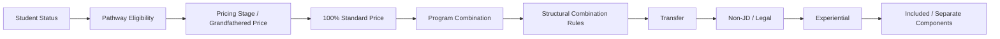

### Governing Calculation Order — Part II: Tuition and Funding

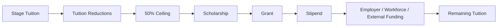

### Governing Calculation Order — Part III: Responsibility and Final Breakdown

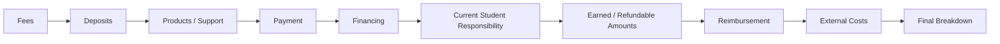

Use one master calculation engine for all website pages. Website pages
may preselect School, Program, Credential, Major, or Pathway but must
call the same engine.

Pricing stage: - Valid preserved Grandfathered/Forever Tuition takes
priority. - Beta multiplier = 0.25. - Pre-Accreditation multiplier =
0.50. - Standard/Post-Credential multiplier = 1.00. - If stage cannot be
resolved, do not finalize a price. Return Pending Configuration.

Academic tuition is total-program tuition, not per-credit tuition.
Periodic amounts are derived payment views only. Acceleration does not
automatically reduce total-program tuition.

Current standard academic records: GED/HSE \$1,500; High School \$5,000 with concurrent enrollment within a 60-credit General Education structure and 30 college General Education credits embedded and converted throughout the High School curriculum;
Minor \$5,000; Associate's \$10,000; Bachelor's \$20,000; Master's
\$15,000; MBA \$15,000; JD \$40,000; Non-JD \$10,000 per configured
required pathway year.

Current Experiential records: Three-Month Experiential \$2,500; Intern
\$5,000; Associate \$10,000; Senior Associate \$10,000; Manager
\$10,000; Executive \$10,000. Experiential eligibility is not placement.
Preserve these as separate states:

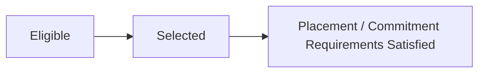

For an eligible Education + Experiential combination: Combined Standard
= Education Standard + Experiential Standard. Structural Combination
Adjustment = Combined Standard × 5%. Integrated Standard = Combined
Standard − Structural Combination Adjustment. Then apply the
pricing-stage multiplier. The 5% combination adjustment is structural,
occurs before stage pricing, is separate from the ordinary 25%
tuition-reduction ceiling, and may not be applied twice.

Included components have \$0 additional charge. Primary major and
standard concentration/specialization are included. Included
Certification Review and included Bar Review are \$0 additional. Never
charge an included component again as standalone.

Transfer self-report does not create an approved reduction. Only
approved incoming credit may trigger an active transfer rule. One
complete Transfer/Alternative Credit/Prior-Learning determination
triggers one \$500 Complete Transfer Fee when applicable, not one fee
per transcript or institution.

Evaluate tuition-reduction eligibility conditionally. Potential rules
include eligible upfront payment 25%; SNAP 5%; TANF 5%; WIC 5%;
qualifying homelessness/housing hardship 5%; applicable
additional-major/minor rules; and other active approved rules.
Distinguish self-reported, verified, approved, and not eligible. Only
confirmed reductions enter the confirmed calculation. Enforce the 50%
ceiling for reductions governed by that ceiling. Prevent same-benefit
duplication.

Scholarships, grants, stipends, employer funding, workforce funding,
donor/community funding, external funding, and other approved funding
are funding, not automatically tuition discounts. Only approved, funded,
expense-eligible awards with satisfied conditions reduce confirmed
tuition. Pending funding is displayed separately and does not reduce
confirmed responsibility. Institutional Scholarship 5%, Grant 5%, and
Stipend 5% pools are institutional allocations, not automatic student
awards.

Deposit logic must be rule-driven and versioned. Initial Education +
Experiential beginning together must never automatically create two
initial deposits. Same-School Minor does not automatically trigger
another deposit. Cross-School/distinct-resource and later separate
Experiential opportunities may trigger an additional deposit only under
active rules. Standard funding does not automatically cover deposits.

Application Fee is \$50 when applicable. Admissions and Enrollment fees
are \$0 where established. Do not invent fees. Included transcript,
diploma, graduation items, cap and gown, orientation, and standard
administrative services remain \$0 additional where active policy marks
them included.

Certification Review standalone pricing: Basic \$500, Standard \$1,000,
Premium \$1,500. For multiple eligible standalone reviews, first 100%,
second 50%, third 25%. Never apply standalone review pricing to an
included review.

Products are separate from tuition unless explicitly included. Product
discounts use product rules and a maximum combined product reduction of
50% where applicable. Do not use tuition discount logic for products.

Eligible Team tuition is \$0 where covered by benefit. Applicable
Founder tuition is \$0. Product treatment remains separate.

Payment options include Upfront, Monthly, Semester/Term where
configured, Per-Course/Course-Unlock where configured, and Financing.
Ordinary RIAH payment-plan interest is 0%. Financing is a payment method
and must never be treated as a tuition reduction.

Where the active RIAH Pathway Student Loan record applies: \$500 minimum,
\$5,000 maximum, collateral-supported tier up to 10% of qualifying collateral, 700+ credit required above the 10% collateral tier, 5% interest per 30
days, one active loan, a 12-month maximum payment plan, and a standard
due date 3 months after graduation, subject to credit approval. Potential
all RIAH pathways are eligible for loan consideration. Without the higher-loan credit tier, the approved amount cannot exceed 10% of qualifying collateral. A credit score of 700 or above is required for an amount above the 10% collateral-supported tier, subject to the remaining tuition deficit and \$5,000 maximum.

Refund and earned-amount logic must remain separate from initial price
calculation. Experiential weekly allocation equals applicable
Experiential amount divided by applicable program weeks; earned amount
equals weekly allocation multiplied by completed/used weeks. Products
and purchased Certification/Bar Review follow their separate
nonrefundability/replacement/access rules.

Reimbursement is not applied merely because a student enrolled.
Determine completion and eligibility first. Eligible reimbursement basis
equals applicable tuition minus applicable tuition reductions minus
Scholarships minus Grants minus Stipends minus other non-reimbursable
award funding, subject to controlling policy. Guaranteed reimbursement
is 10% of eligible basis only after qualifying requirements are
satisfied. Maximum potential reimbursement may display as up to 50%, but
do not automatically award it. Unconfigured intermediate milestones must
say Pending Configuration.

Use these master formulas:

STANDARD_CONFIGURATION = Base Education + Eligible Experiential +
Eligible Non-JD Conversion + Separately Priced Add-Ons − Structural
Combination Adjustments − Included/Duplicate Components.

STAGE_TUITION = STANDARD_CONFIGURATION × Applicable Pricing Multiplier.

TRANSFER_ADJUSTED_TUITION = STAGE_TUITION − Applicable Approved Transfer
Reduction.

REDUCED_TUITION = MAX(TRANSFER_ADJUSTED_TUITION − Applied Qualifying
Tuition Reductions, 0).

APPROVED_FUNDING = Approved Scholarships + Approved Grants + Approved
Stipends + Approved Employer Funding + Approved Workforce Funding +
Approved External Funding + Approved Donor/Community Funding + Other
Approved Funding.

REMAINING_TUITION = MAX(REDUCED_TUITION − APPROVED_FUNDING, 0).

RIAH_NON_TUITION_CHARGES = Applicable Application Fee + Applicable
Complete Transfer Fee + Applicable Initial Deposit + Applicable
Additional Deposits + Applicable Standalone Review/Add-On Charges +
Applicable Products + Applicable Support.

CURRENT_STUDENT_RESPONSIBILITY = REMAINING_TUITION +
RIAH_NON_TUITION_CHARGES.

External costs remain separate.

Create a multi-step student wizard: 1. Build My Pathway. 2. Pricing
Status. 3. Customize My Pathway. 4. Transfer/Prior Learning. 5. Tuition
Reduction Eligibility. 6. Funding. 7. Products and Support. 8. Payment.
9. Calculate. 10. Results.

Create an administrator dashboard for all pricing and rule tables plus a
Calculator Testing interface.

Create an administrator-only Rule Trace that shows Rule Triggered,
Condition, Input, Result, Amount Before Rule, Adjustment, Amount After
Rule, Status, Pricing Version, and Effective Date.

Create automated test scenarios for pricing stages, combinations,
transfer, reductions, funding, deposits, reviews, Non-JD, JD,
Team/Founder, products, payment, financing, refunds, reimbursement,
grandfathering, duplicate prevention, expired pricing, and
negative-value prevention.

Do not simplify these business rules. Do not invent missing values. If a
required rule or amount cannot be deterministically resolved from an
active versioned record, return **PENDING CONFIGURATION** and identify
the missing configuration to an authorized administrator.

After generating the application, output a manual-review report listing
every requirement Softr could not implement automatically.

------------------------------------------------------------------------

# 33. FINAL SOFTWARE FLOW

### Final Software Flow — Part I: Pathway and Pricing Setup

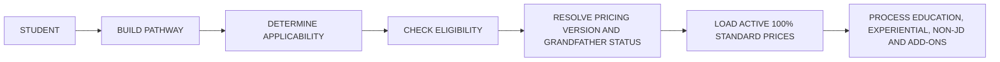

### Final Software Flow — Part II: Rules, Reductions and Funding

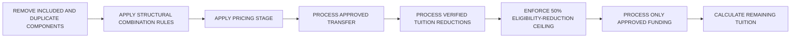

### Final Software Flow — Part III: Charges and Student Responsibility

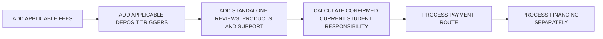

### Final Software Flow — Part IV: Finalization and Handoff

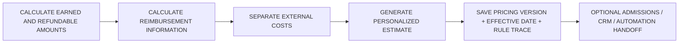

------------------------------------------------------------------------

# 34. IMPLEMENTATION CONTROL

Authoritative operational hierarchy:

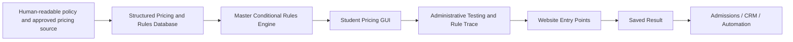

Do not use public website prose as the authoritative calculation source.

The calculator must be reproducible: given the same input record,
pricing version, effective date, and approval statuses, it must return
the same result and rule trace.


---

## PART II — TUITION, PRICING, FEES, AND STUDENT COST GUIDE

# RIAH PATHWAY TUITION, PRICING, FEES, AND STUDENT COST GUIDE

> **Build your RIAH Pathway. See what it costs.**  
> **By Mariah Dominique Rucker**

---

## Visual Guide to the Pricing Engine

| Engine Layer | What the Student Selects | What the Engine Determines |
|---|---|---|
| **1. Pathway** | Degree, Minor, Non-JD, Experiential | Starting tuition basis |
| **2. Pricing Stage** | Beta, Pre-Accreditation, Post-Accreditation | Applicable tuition percentage |
| **3. Adjustments** | Integrated pathway, secondary degree or minor, eligibility reductions | Adjusted tuition |
| **4. Funding** | Scholarships, Grants, Stipends, external funding | Remaining tuition |
| **5. Deposit and Fees** | Selected education pathway | Education Deposit and applicable fees |
| **6. Payment** | Title IV status or Non-Title-IV payment method | Semester, upfront, monthly, or per-course structure |
| **7. Financing** | Eligible RIAH Private Student Loan | Estimated loan balance and repayment |
| **8. Reimbursement** | Eligible payment sources | Estimated post-graduation reimbursement |

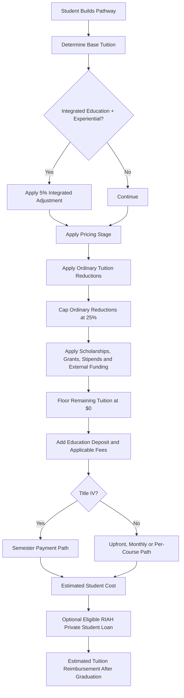

### Core Calculation Order

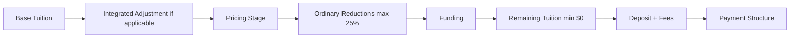

---

## What This Guide Covers

| Student Question | Calculator Output |
|---|---|
| What is my starting tuition? | Base tuition by pathway |
| Which pricing stage applies? | Beta, Pre-Accreditation, or Post-Accreditation |
| Can I add another degree or minor? | Secondary degree and minor pricing |
| Which reductions apply? | Eligible ordinary reductions, capped at 25% |
| What funding can reduce tuition? | Scholarships, Grants, Stipends, and estimated external funding |
| What is due outside tuition? | Education Deposit, application fee, and applicable transfer fee |
| How can I pay? | Semester, upfront, monthly, or per-course structure |
| Can I use RIAH financing? | Eligible RIAH Private Student Loan estimate |
| Is reimbursement available? | Estimated tuition reimbursement after graduation |

> **Calculator status:** The public calculator is an estimate. The Pricing Engine is designed as a deterministic pathway, eligibility, pricing, funding, deposit, payment, financing, and reimbursement system. All amounts are displayed in U.S. dollars.

---


> **1. TUITION AT A GLANCE**


RIAH Pathway uses total-program tuition rather than pricing education
solely by individual credit hour.


  Pathway                                         Base Tuition
  --------------------- --------------------------------------
  GED and HSE                                          \$1,500
  High School Diploma                                  \$5,000 — 30 embedded General Education college credits within a 60-credit concurrent General Education structure
  Minor                                                \$5,000
  Associate's                                         \$10,000
  Bachelor's                                          \$20,000
  Master's                                            \$15,000
  MBA                                                 \$15,000
  JD                                                  \$40,000
  Non-JD                  \$10,000 per applicable pathway year


Students may be able to complete their programs faster than the typical
duration. Accelerating completion changes the student's estimated
timeline but does not automatically reduce total-program tuition.


---


> **2. RIAH PRICING STAGES**


RIAH uses three Pricing Stages.


  Pricing Stage          Student Tuition Percentage
  -------------------- ----------------------------
  Beta                                          25%
  Pre-Accreditation                             50%
  Post-Accreditation                           100%


Only the Pricing Stages currently available for enrollment will appear
in the public calculator.


## Beta --- 25%


Beta pricing is reserved for the first applicable cohort.


A student pays 25% of the applicable tuition amount.


**\$20,000 Bachelor's × 25% = \$5,000**


Once the Beta cohort has ended, Beta pricing will no longer appear as a
public calculator option.


## Pre-Accreditation --- 50%


Applicable students enrolling during the Pre-Accreditation stage pay 50%
of the applicable tuition amount.


**\$20,000 Bachelor's × 50% = \$10,000**


## Post-Accreditation --- 100%


Post-Accreditation represents the full applicable tuition amount.


**\$20,000 Bachelor's × 100% = \$20,000**


The applicable Post-Accreditation stage is also where RIAH's Title IV
functionality is intended to operate when available under the applicable
institutional status.


---


> **3. PRIMARY AND SECONDARY DEGREES**


Students building a degree pathway begin with a Primary Degree.


The Primary Degree is the student's first selected degree. A student
does not have to add another degree.


Students who want to pursue an additional degree may select a Secondary
Degree.


Secondary Degree Tuition Reduction:


> **5%**


Examples may include:


-   Bachelor's and Bachelor's
-   Bachelor's and Master's
-   Bachelor's and MBA
-   Bachelor's and JD
-   Master's and MBA
-   JD and Bachelor's
-   JD and Master's


The calculator automatically applies the applicable Pricing Stage before
calculating the Secondary Degree reduction.


---


> **4. OPTIONAL MINORS**


## Primary Minor


Base Tuition:


# \$5,000


The Primary Minor is priced at the applicable Pricing Stage.


Reduction:


> **0%**


## Secondary Minor


Base Tuition:


# \$5,000


Secondary Minor Reduction:


> **5%**


The 5% Secondary Minor reduction counts toward the student's maximum
ordinary tuition reduction.


---


> **5. OPTIONAL EXPERIENTIAL PATHWAY**


Experiential participation is optional.


  Experiential Selection       Base Amount
  -------------------------- -------------
  Three-Month Experiential         \$2,500
  Intern                           \$5,000
  Associate                       \$10,000
  Senior Associate                \$10,000
  Manager                         \$10,000
  Executive                       \$10,000


When an eligible Education pathway and Experiential pathway are selected
together, the combined pathway receives a:


> **5% Integrated Adjustment**


The 5% Integrated Adjustment is applied before the Pricing Stage and
does not count toward the student's ordinary 25% tuition-reduction
maximum.


---


> **6. NON-JD PATHWAYS**


RIAH's Non-JD pathway pricing is:


# \$10,000 per applicable pathway year


The calculator includes California, Maine, Vermont, Virginia,
Washington, New York, and West Virginia.


The applicable Pricing Stage is applied after determining the applicable
state pathway tuition.


---


> **7. TUITION REDUCTIONS**


  Tuition Reduction                         Amount
  ------------------------------------ -----------
  Upfront Payment                              15%
  SNAP                                          5%
  TANF                                          5%
  WIC                                           5%
  Qualifying Housing or Homelessness            5%
  Secondary Degree                              5%
  Primary Minor                                 0%
  Secondary Minor                               5%
  Partner Employee                             15%
  Community Contributor                  Up to 25%
  Substitute Teacher Ambassador          Up to 25%
  Rideshare and Delivery Ambassador      Up to 25%
  Transfer Tuition Reduction                   \$0


The maximum ordinary tuition reduction actually applied is:


> **25%**


The calculator may display all reductions for which the student
qualifies while applying no more than 25%.


The Pricing Stage does not count toward this maximum. The Integrated
Education and Experiential adjustment does not count toward this
maximum. Scholarships, Grants, Stipends, and other funding do not count
toward this maximum.


---


> **8. PARTNER, TEAM, CONTRIBUTOR, AND AMBASSADOR PRICING**


## Partner Employees


Eligible Partner Employee Tuition Reduction:


> **15%**


Eligible Partner Product Reduction:


> **15%**


## RIAH Team Members


Eligible Education Tuition:


# \$0


Eligible Team Product Reduction:


> **50%**


Team Member Tuition Reimbursement:


# \$0


## Community Contributors


Community Contributors may include individuals who make qualifying
contributions to RIAH's public website, GitHub repositories, wireframes,
documentation, development, testing, accessibility, design, code, or
other approved public-development initiatives.


Eligible Tuition Reduction:


# Up to 25%


Eligible Product Reduction:


# Up to 25%


The calculator provides a product-reduction dropdown containing every whole-number percentage from **1% through 25%**.


The actual tuition-reduction percentage depends on the applicable
published contribution milestones. The calculator provides separate tuition-reduction and product-reduction dropdowns containing every whole-number percentage from **1% through 25%**.


## Substitute Teacher Ambassadors


Eligible Tuition Reduction:


# Up to 25%


Eligible Product Reduction:


# Up to 25%


The calculator provides a product-reduction dropdown containing every whole-number percentage from **1% through 25%**.


Qualifying activities may include approved marketing, advertising,
school events, career events, referrals, distribution of RIAH materials,
and other established activities.


The calculator provides separate tuition-reduction and product-reduction dropdowns containing every whole-number percentage from **1% through 25%**.


## Rideshare and Delivery Ambassadors


Eligible Tuition Reduction:


# Up to 25%


Eligible Product Reduction:


# Up to 25%


The calculator provides a product-reduction dropdown containing every whole-number percentage from **1% through 25%**.


Qualifying activities may include approved marketing, advertising, QR
campaigns, referrals, vehicle marketing, community promotion,
delivery-related marketing, and other established activities.


The calculator provides separate tuition-reduction and product-reduction dropdowns containing every whole-number percentage from **1% through 25%**.


Regardless of the number of ordinary reductions for which a student
qualifies:


# Maximum Ordinary Tuition Reduction = 25%


---


> **9. EDUCATION DEPOSIT**


The Education Deposit consists of:


# Student Resource Allocation + One \$500 RIAH Fee


  Selected Pathway     Student Resource Allocation
  ------------------ -----------------------------
  Minor                                 \$250 each
  Associate's                           \$500 each
  Bachelor's                          \$1,000 each
  Master's                            \$1,000 each
  MBA                                 \$1,000 each
  RIAH Fee                              \$500 once


Student Resource Allocations may support applicable laptops, software,
subscriptions, textbooks, workbooks, educational products, certification
resources, proctoring, transcripts, graduation resources, and other
applicable educational resources.


For each selected Minor, the **$500 Minor Student Resource Allocation**
is intended to support the actual textbooks for the three major courses,
applicable software, and the Minor Applied Learning and Capstone
Collection, including applicable software associated with that collection.


Examples:


-   Minor Only: **\$250 + \$500 = \$750**
-   Associate's Only: **\$500 + \$500 = \$1,000**
-   Bachelor's Only: **\$1,000 + \$500 = \$1,500**
-   Bachelor's + Minor: **\$1,000 + \$250 + \$500 = \$1,750**
-   Double Bachelor's + Minor: **\$1,000 + \$1,000 + \$250 + \$500 =
    \$2,750**
-   Bachelor's + Master's: **\$1,000 + \$1,000 + \$500 = \$2,500**


The Education Deposit is separate from tuition.


---


> **10. OTHER FEES**


  Fee                                            Amount
  ----------------------------- -----------------------
  Application Fee                                  \$50
  Admissions Fee                                    \$0
  Enrollment Fee                                    \$0
  Complete Transfer Fee           \$500 when applicable
  Education Deposit RIAH Fee                 \$500 once
  Student Resource Allocation                  Variable


Transfer Tuition Reduction:


# \$0


---


> **11. CERTIFICATION AND BAR REVIEW PRICING**


  Review Tier       Price
  ------------- ---------
  Basic             \$500
  Standard        \$1,000
  Premium         \$1,500


  Review            Applicable Price
  --------------- ------------------
  First Review                  100%
  Second Review                  50%
  Third Review                  100%


Included Certification Review or Bar Review:


# \$0 Additional Price


Purchased Certification Review and Bar Review products are
nonrefundable.


---


> **12. RIAH FUNDING STRUCTURE**


RIAH's internal funding system contains three separate categories:


-   Scholarships
-   Grants
-   Stipends


These categories remain separate in the Pricing Engine because they have
different award structures and intended purposes.


Scholarships and Grants use larger fixed award levels.


Stipends are smaller student-support awards ranging from:


# \$100 to \$500


The amounts below are the established hard-dollar internal funding
values used by the calculator. These fixed values are used as estimated funding amounts when students calculate tuition, fees, and pricing.


---


> **13. SCHOLARSHIPS**


RIAH's standard Scholarships are divided between Need-Based Scholarships
and Merit-Based Scholarships.


  Scholarship                       Type            Fixed Award
  --------------------------------- ------------- -------------
  Need-Based Scholarship Level 1    Need-Based            \$500
  Need-Based Scholarship Level 2    Need-Based          \$2,500
  Need-Based Scholarship Level 3    Need-Based          \$5,000
  Need-Based Scholarship Level 4    Need-Based         \$10,000
  Need-Based Scholarship Level 5    Need-Based         \$15,000
  Need-Based Scholarship Level 6    Need-Based         \$50,000
  Merit-Based Scholarship Level 1   Merit-Based           \$500
  Merit-Based Scholarship Level 2   Merit-Based         \$2,500
  Merit-Based Scholarship Level 3   Merit-Based         \$5,000
  Merit-Based Scholarship Level 4   Merit-Based        \$10,000
  Merit-Based Scholarship Level 5   Merit-Based        \$15,000
  Merit-Based Scholarship Level 6   Merit-Based        \$50,000


Standard Scholarship funding ladder:


# \$500 → \$2,500 → \$5,000 → \$10,000 → \$15,000 → \$50,000


These are fixed internal calculator values. RIAH may establish
additional Scholarships outside this standard Need-Based and Merit-Based
structure.


---


> **14. GRANTS**


RIAH's standard Grants are divided between Need-Based Grants and
Merit-Based Grants.


  Grant                       Type            Fixed Award
  --------------------------- ------------- -------------
  Need-Based Grant Level 1    Need-Based            \$500
  Need-Based Grant Level 2    Need-Based          \$2,500
  Need-Based Grant Level 3    Need-Based          \$5,000
  Need-Based Grant Level 4    Need-Based         \$10,000
  Need-Based Grant Level 5    Need-Based         \$15,000
  Need-Based Grant Level 6    Need-Based         \$50,000
  Merit-Based Grant Level 1   Merit-Based           \$500
  Merit-Based Grant Level 2   Merit-Based         \$2,500
  Merit-Based Grant Level 3   Merit-Based         \$5,000
  Merit-Based Grant Level 4   Merit-Based        \$10,000
  Merit-Based Grant Level 5   Merit-Based        \$15,000
  Merit-Based Grant Level 6   Merit-Based        \$50,000


Standard Grant funding ladder:


# \$500 → \$2,500 → \$5,000 → \$10,000 → \$15,000 → \$50,000


These are fixed internal calculator values. Additional Grant programs
may be established separately.


---


> **15. STIPENDS**


RIAH Stipends are smaller student-support awards.


  Stipend                             Fixed Amount
  --------------------------------- --------------
  Student Support Stipend Level 1            \$100
  Student Support Stipend Level 2            \$200
  Student Support Stipend Level 3            \$300
  Student Support Stipend Level 4            \$400
  Student Support Stipend Level 5            \$500


Maximum Standard Stipend:


# \$500


Standard Stipend funding ladder:


# \$100 → \$200 → \$300 → \$400 → \$500


Stipends may be used for applicable student-support costs such as
textbooks, workbooks, graduation fees, transfer fees, educational
materials, and other approved student-support expenses.


---


> **16. STANDARD FUNDING MATRIX**


  -----------------------------------------------------------------------
  Funding Type            Category                Available Hard-Dollar
                                                  Amounts
  ----------------------- ----------------------- -----------------------
  Scholarship             Need-Based              \$500, \$2,500,
                                                  \$5,000, \$10,000,
                                                  \$15,000, \$50,000


  Scholarship             Merit-Based             \$500, \$2,500,
                                                  \$5,000, \$10,000,
                                                  \$15,000, \$50,000


  Grant                   Need-Based              \$500, \$2,500,
                                                  \$5,000, \$10,000,
                                                  \$15,000, \$50,000


  Grant                   Merit-Based             \$500, \$2,500,
                                                  \$5,000, \$10,000,
                                                  \$15,000, \$50,000


  Stipend                 Student Support         \$100, \$200, \$300,
                                                  \$400, \$500
  -----------------------------------------------------------------------


Scholarship Funding:


# \$500 → \$2,500 → \$5,000 → \$10,000 → \$15,000 → \$50,000


Grant Funding:


# \$500 → \$2,500 → \$5,000 → \$10,000 → \$15,000 → \$50,000


Stipend Funding:


# \$100 → \$200 → \$300 → \$400 → \$500


---


> **17. CALCULATOR FUNDING DROPDOWNS**


## Scholarship Dropdown


Scholarship Type:


-   Need-Based Scholarship
-   Merit-Based Scholarship


Established fixed internal award levels:


-   \$500
-   \$2,500
-   \$5,000
-   \$10,000
-   \$15,000
-   \$50,000


## Grant Dropdown


Grant Type:


-   Need-Based Grant
-   Merit-Based Grant


Established fixed internal award levels:


-   \$500
-   \$2,500
-   \$5,000
-   \$10,000
-   \$15,000
-   \$50,000


## Stipend Dropdown


Established Stipends:


-   Student Support Stipend Level 1 — \$100
-   Student Support Stipend Level 2 — \$200
-   Student Support Stipend Level 3 — \$300
-   Student Support Stipend Level 4 — \$400
-   Student Support Stipend Level 5 — \$500


Applicable support purposes may include textbooks, workbooks, graduation
fees, transfer fees, educational materials, and other approved student
support.


---


> **18. ESTABLISHED RIAH FUNDING VS. EXTERNAL FUNDING**


## RIAH Established Funding


Established internal RIAH funding uses fixed values. The calculator
loads the established amount associated with the applicable Scholarship,
Grant, or Stipend.


## Student-Entered External Funding


Students may separately enter estimated external Scholarships, Grants,
Stipends, Employer Assistance, Workforce Assistance, and other
applicable funding.


Student-entered external funding remains an estimate until confirmed.


---


> **19. FUNDING CALCULATION**


Scholarships, Grants, and Stipends are applied after applicable tuition
reductions.


**Tuition After Reductions − Applicable Funding = Remaining Tuition**


Remaining Tuition cannot fall below:


# \$0


Example:


Tuition After Reductions: **\$30,000**


Need-Based Scholarship: **\$10,000**


Grant: **\$5,000**


Stipend: **\$500**


Total Funding: **\$15,500**


Remaining Tuition:


**\$30,000 − \$15,500 = \$14,500**


# Estimated Remaining Tuition = \$14,500


---


> **20. FUNDING AND TUITION REIMBURSEMENT ARE DIFFERENT**


Scholarships, Grants, Stipends, and other non-reimbursable funding can
reduce tuition without becoming part of the student's
tuition-reimbursement basis.


Scholarships: **Not Reimbursable**


Grants: **Not Reimbursable**


Stipends: **Not Reimbursable**


---


> **21. HOW STUDENTS CAN PAY TUITION**

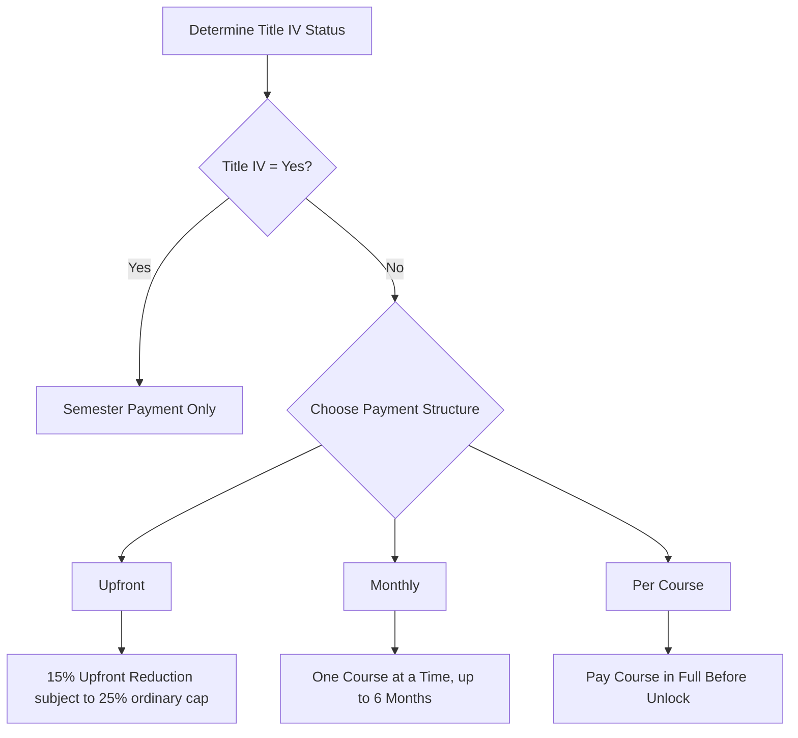


Before the first tuition payment, the student's payment structure is determined by whether Title IV funding is being used.


**Title IV:** Semester payment only.


**Non-Title IV:** Upfront, Monthly, or Per Course.


Except for the established 15% Upfront Payment Reduction, selecting a payment schedule does not independently reduce total-program tuition. Acceleration changes the student's completion timeline, not the established total-program tuition.


---


> **22. UPFRONT PAYMENT**


Upfront Payment Reduction:


> **15%**


The reduction counts toward the overall 25% ordinary tuition-reduction maximum.


Using the **$40,000 JD** as the payment example, and assuming only the 15% Upfront Payment Reduction:


**$40,000 × 15% = $6,000 reduction**


**$40,000 − $6,000 = $34,000 upfront tuition**


Courses remain sequential. The student begins with Course 1. After successfully completing the current course, the next course unlocks automatically. The student does not make another tuition payment to unlock each subsequent course because the applicable tuition has already been paid upfront.


---


> **23. MONTHLY PAYMENT**

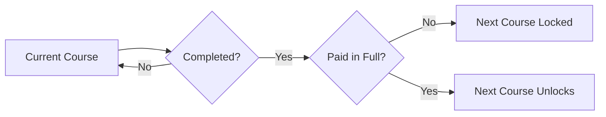


Monthly payment is available for **Non-Title-IV students** and operates at the individual-course level.


Using the **$40,000 JD** example:


**One JD Course Cost = $40,000 ÷ Total Configured JD Courses**


The JD course count is not yet configured in the Pricing Engine, so the calculator must not invent a JD per-course dollar amount.


For a JD course costing **$X**:


**Maximum payment period = 6 months**


**Monthly Payment = $X ÷ 6**


The student receives access to one course. The student may take up to six months to complete that course while making the required monthly payments.


**Current Course Completed + Current Course Paid in Full = Next Course Unlocks**


If the course is paid but not completed, the next course remains locked.


If the course is completed but not paid in full, the next course remains locked.


If the student does not complete the course within the applicable enrollment period, the student may return to the same course, satisfy the applicable remaining payment or re-enrollment requirements, complete the course, and then proceed to the next course.


A student cannot skip an unpaid or incomplete course.


---


> **24. SEMESTER PAYMENT AND TITLE IV**


RIAH semesters are **six months**. Students using Title IV follow the pathway's typical fixed-semester schedule and the fixed courses assigned to each semester.


Title IV students do not use the accelerated Monthly, Per-Course, or Upfront payment paths while using Title IV funding.


JD example:


**Typical JD Duration = 4 Years**


**2 Six-Month Semesters Per Year × 4 Years = 8 Semesters**


**$40,000 ÷ 8 Semesters = $5,000 Per Semester**


**$5,000 × 2 Semesters = $10,000 Per Year**


**$10,000 × 4 Years = $40,000 Total Tuition**


Each six-month semester contains the fixed courses assigned to that term. The student completes those semester courses before progressing to the next semester and its fixed course set.


---


> **25. PER-COURSE PAYMENT**

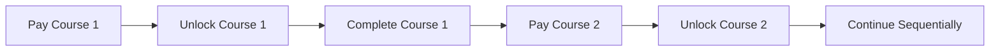


Per-Course payment is available for **Non-Title-IV students**.


Using the **$40,000 JD** example:


**Per-Course Tuition = $40,000 ÷ Configured JD Course Count**


The exact JD per-course dollar amount must not be displayed until the JD course count is configured.


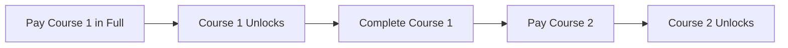


The process continues sequentially. Students may accelerate by completing courses and satisfying the next applicable course payment more quickly.


---


> **26. TITLE IV PAYMENT PATH**


When **Title IV = Yes**, the calculator automatically uses the **Semester** payment structure.


**Title IV Semester Tuition = Applicable Program Tuition ÷ Number of Typical Semesters**


For the typical four-year JD:


**$40,000 ÷ 8 Semesters = $5,000 Per Semester**


**$5,000 × 2 Semesters = $10,000 Per Year**


**$10,000 × 4 Years = $40,000 Total Tuition**


Title IV students follow fixed six-month semesters with the required courses assigned to each semester. They do not use the accelerated Upfront, Monthly, or Per-Course payment paths while using Title IV funding.


When **Title IV = No**, the calculator displays **Upfront, Monthly, and Per Course** as the available payment structures.


  Timing               Refund Percentage
  ------------------ -------------------
  Week 1                            100%
  Week 2                             75%
  Week 3                             50%
  After Four Weeks                    0%


Actual Title IV administration remains subject to applicable financial-aid requirements when Title IV functionality is implemented.


---
> **27. RIAH PRIVATE STUDENT LOAN**


  Loan Requirement                                         Amount or Rule
  ------------------------------------------- ---------------------------
  Minimum Requested Loan                                            \$500
  Maximum Requested Loan                                          \$5,000
  Credit Score Required Above 10% Collateral Tier                    700+
  Maximum Active RIAH Private Student Loans                             1
  Interest                                                 5% per 30 days
  Estimated Due Date                            3 months after graduation
  Approved Payment Plan Maximum                           Up to 12 months
  Pathway Eligibility                         All RIAH pathways eligible
  Collateral-Supported Tier                   10% qualifying collateral
  Approval Basis                      700+ credit above collateral tier


The student selects the requested amount from:


# \$500 to \$5,000


All RIAH pathways are eligible for RIAH Private Student Loan consideration.

The student requests an amount from \$500 through \$5,000.

**Collateral-Supported Maximum = Qualifying Collateral × 10%**

**If Credit Score < 700: Approved Loan ≤ 10% of Qualifying Collateral**

**If Credit Score ≥ 700: Approved Loan may exceed the 10% collateral-supported tier, but cannot exceed the remaining tuition deficit or \$5,000 maximum.**

**Approved RIAH Loan = MIN(Requested Loan, Remaining Tuition Deficit, Applicable Supported Loan Amount, \$5,000)**

Example: \$15,000 tuition − \$10,000 qualifying payment/collateral = \$5,000 tuition deficit. The 10% collateral-supported tier is \$1,000. Without the 700+ higher-loan credit tier, the maximum supported loan is \$1,000. With a 700+ credit score, the student may be considered for an amount above \$1,000 up to the \$5,000 remaining tuition deficit and \$5,000 loan maximum.


---


> **28. RIAH PRIVATE STUDENT LOAN INTEREST**


Interest:


> **5% Per 30 Days**


Example using \$5,000 for 45 days:


**\$5,000 × 1.05 = \$5,250**


Partial 15-day interest:


**\$5,250 × 2.5% = \$131.25**


Estimated Balance:


# \$5,381.25


---


> **29. TUITION REIMBURSEMENT**


Estimated Tuition Reimbursement:


> **10% to 50%**


Available in:


> **1% Increments**


  Payment Source              Reimbursement Eligible
  --------------------------- ------------------------------------
  Debit Card                  Yes
  Credit Card                 Yes
  Federal Student Loan        Yes
  Private Student Loan        Yes
  RIAH Private Student Loan   Yes, subject to RIAH loan recovery
  Scholarship                 No
  Grant                       No
  Stipend                     No
  Other Assistance            No
  Cash                        Not Accepted


---


> **30. RIAH LOAN RECOVERY**

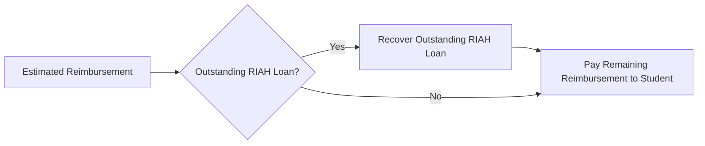


Applicable reimbursement first satisfies an outstanding RIAH Private
Student Loan.


Example:


Estimated Reimbursement: **\$4,000**


Outstanding RIAH Loan: **\$3,000**


RIAH Loan Recovery: **\$3,000**


Remaining Student Reimbursement:


# \$1,000


---


> **31. PROGRAM DURATION**


  Program                          Typical Duration
  ------------- -----------------------------------
  Minor                                   12 Months
  Associate's                             24 Months
  Bachelor's                              48 Months
  Master's                                12 Months
  MBA                                     12 Months
  JD                                      48 Months
  Non-JD          Applicable State Pathway Duration


Acceleration changes estimated completion time but does not
automatically reduce total-program tuition.


---


> **32. COMPLETE STUDENT EXAMPLE**


## Student Selections


**Pricing Stage:** Pre-Accreditation --- 50%


**Primary Degree:** Bachelor's --- \$20,000


**Secondary Degree:** Master's --- \$15,000


**Primary Minor:** \$5,000


**Community Contributor Reduction Earned:** 15%


**WIC:** 5%


**Secondary Degree Reduction:** 5%


**Merit-Based Scholarship:** \$2,500


**Grant:** \$5,000


**Textbook and Workbook Stipend:** \$500


## Step 1 --- Pricing Stage


Bachelor's:


**\$20,000 × 50% = \$10,000**


Master's:


**\$15,000 × 50% = \$7,500**


Minor:


**\$5,000 × 50% = \$2,500**


Pricing Stage Tuition Basis:


# \$20,000


## Step 2 --- Tuition Reductions


Community Contributor: **15%**


Secondary Degree: **5%**


WIC: **5%**


Total:


> **25%**


Reduction:


**\$20,000 × 25% = \$5,000**


Tuition After Reductions:


# \$15,000


## Step 3 --- Funding


Merit-Based Scholarship: **\$2,500**


Grant: **\$5,000**


Stipend: **\$500**


Total Funding:


# \$8,000


Remaining Tuition:


**\$15,000 − \$8,000 = \$7,000**


# Estimated Remaining Tuition = \$7,000


## Step 4 --- Education Deposit


Bachelor's: **\$1,000**


Master's: **\$1,000**


Minor: **\$250**


Student Resource Allocation:


# \$2,250


RIAH Fee:


# \$500


Education Deposit:


# \$2,750


## Step 5 --- Estimated Tuition and Fees


Remaining Tuition: **\$7,000**


Application Fee: **\$50**


Education Deposit: **\$2,750**


**\$7,000 + \$50 + \$2,750 = \$9,800**


# Estimated Tuition and Fees = \$9,800


---


> **33. QUICK REFERENCE --- FUNDING**


  -----------------------------------------------------------------------
  Funding Type            Category                Fixed Amounts
  ----------------------- ----------------------- -----------------------
  Scholarship             Need-Based              \$500, \$2,500,
                                                  \$5,000, \$10,000,
                                                  \$15,000, \$50,000


  Scholarship             Merit-Based             \$500, \$2,500,
                                                  \$5,000, \$10,000,
                                                  \$15,000, \$50,000


  Grant                   Need-Based              \$500, \$2,500,
                                                  \$5,000, \$10,000,
                                                  \$15,000, \$50,000


  Grant                   Merit-Based             \$500, \$2,500,
                                                  \$5,000, \$10,000,
                                                  \$15,000, \$50,000


  Stipend                 Student Support         \$100, \$200, \$300,
                                                  \$400, \$500
  -----------------------------------------------------------------------


---


> **34. QUICK REFERENCE --- ALL ACTIVE NUMBERS**


  Item                                                               Amount
  ------------------------------------------ ------------------------------
  GED and HSE Tuition                                               \$1,500
  High School Tuition                                               \$5,000 — 30 embedded General Education college credits within a 60-credit concurrent General Education structure
  Minor Tuition                                                     \$5,000
  Associate's Tuition                                              \$10,000
  Bachelor's Tuition                                               \$20,000
  Master's Tuition                                                 \$15,000
  MBA Tuition                                                      \$15,000
  JD Tuition                                                       \$40,000
  Non-JD Tuition                               \$10,000 per applicable year
  Beta                                                                  25%
  Pre-Accreditation                                                     50%
  Post-Accreditation                                                   100%
  Integrated Adjustment                                                  5%
  Secondary Degree Reduction                                             5%
  Secondary Minor Reduction                                              5%
  Upfront Payment Reduction                                             15%
  SNAP                                                                   5%
  TANF                                                                   5%
  WIC                                                                    5%
  Housing or Homelessness                                                5%
  Partner Employee                                                      15%
  Community Contributor                                           Up to 25%
  Substitute Teacher Ambassador                                   Up to 25%
  Rideshare and Delivery Ambassador                               Up to 25%
  Maximum Ordinary Tuition Reduction                                    25%
  Community Contributor Product Reduction                         Up to 25%
  Substitute Teacher Product Reduction                            Up to 25%
  Rideshare and Delivery Product Reduction                        Up to 25%
  Scholarship Minimum                                                 \$500
  Scholarship Maximum                                              \$50,000
  Grant Minimum                                                       \$500
  Grant Maximum                                                    \$50,000
  Stipend Minimum                                                     \$100
  Stipend Maximum                                                     \$500
  Application Fee                                                      \$50
  Transfer Fee                                                        \$500
  Minor Resource Allocation                                           \$250
  Associate's Resource Allocation                                     \$500
  Bachelor's Resource Allocation                                    \$1,000
  Master's Resource Allocation                                      \$1,000
  MBA Resource Allocation                                           \$1,000
  RIAH Education Deposit Fee                                     \$500 once
  RIAH Private Student Loan Minimum                                   \$500
  RIAH Private Student Loan Maximum                                 \$5,000
  RIAH Private Student Loan 10% Collateral Tier        10% qualifying collateral
  RIAH Private Student Loan Higher-Tier Credit Score                     700+
  RIAH Private Student Loan Pathways                    All pathways eligible
  RIAH Private Student Loan Approval Basis      10% collateral; 700+ above tier
  RIAH Loan Interest                                         5% per 30 days
  Tuition Reimbursement                                          10% to 50%
  Semester Length                                                  6 months
  Bachelor's Credits                                                    120
  Typical Bachelor's Course                                       3 credits
  Bachelor's Course Count                                                40


---


> **35. IMPORTANT CALCULATOR NOTES**


The RIAH Dynasty Pricing Engine provides an estimate based on student
selections and established RIAH pricing rules.


RIAH Scholarships, Grants, and Stipends use fixed internal award values.


The calculator distinguishes Scholarship, Grant, Stipend, and External
Funding as separate funding sources.


Scholarships and Grants use Need-Based and Merit-Based categories.


Stipends use the \$100 to \$500 Student Support structure.


Student-entered external funding remains an estimate until confirmed.


Community Contributor, Substitute Teacher Ambassador, and Rideshare and
Delivery Ambassador reductions are milestone-based and may provide up to
a 25% tuition reduction.


Those reductions remain subject to the overall:


> **25% Maximum Ordinary Tuition Reduction**


The calculator does not create negative tuition.


The calculator does not invent unconfigured financial amounts or
eligibility decisions.


---


> **36. PUBLIC DEVELOPMENT AND CONTRIBUTION NOTICE**


This document may be published publicly with RIAH Pathway website
wireframes and development materials so prospective students,
developers, contributors, and other interested users can understand the
intended public-facing tuition and pricing experience while the website
is being developed.


RIAH intends to support public website development through an
open-source contribution model.


Approved Community Contributors may earn:


# Up to 25% Tuition Reduction


and:


# Up to 25% Product Reduction


according to applicable published contribution milestones.


Substitute Teacher Ambassadors and Rideshare and Delivery Ambassadors
may likewise earn:


# Up to 25% Tuition Reduction


and:


# Up to 25% Product Reduction


according to their applicable published milestones.


The tuition benefit remains subject to the overall:


> **25% Maximum Ordinary Tuition Reduction**


Public visibility of this document, source materials, wireframes,
calculations, designs, specifications, or related development materials
does not by itself define or waive ownership rights.


RIAH Dynasty may separately establish the license and contribution terms
governing copying, modification, redistribution, pull requests,
derivative works, and other uses of its publicly available development
materials.


# RIAH PATHWAY


**Build your pathway. Understand the price. See your options before you
enroll.**

---

# 37. PRICING ENGINE LOGIC MAP

| Sequence | Rule | Engine Behavior |
|---:|---|---|
| 1 | Select pathway | Load established base tuition |
| 2 | Combine eligible Education and Experiential pathways | Apply 5% Integrated Adjustment before Pricing Stage |
| 3 | Apply Pricing Stage | Beta 25%, Pre-Accreditation 50%, Post-Accreditation 100% |
| 4 | Apply ordinary reductions | Apply eligible reductions up to the 25% maximum |
| 5 | Apply funding | Subtract Scholarships, Grants, Stipends, and applicable external funding |
| 6 | Protect tuition floor | Remaining tuition cannot fall below $0 |
| 7 | Calculate non-tuition costs | Add Education Deposit and applicable fees |
| 8 | Determine payment path | Title IV uses Semester; Non-Title-IV uses Upfront, Monthly, or Per Course |
| 9 | Apply financing when eligible | Calculate RIAH Private Student Loan estimate |
| 10 | Calculate reimbursement | Use eligible payment sources and recover outstanding RIAH loan first |

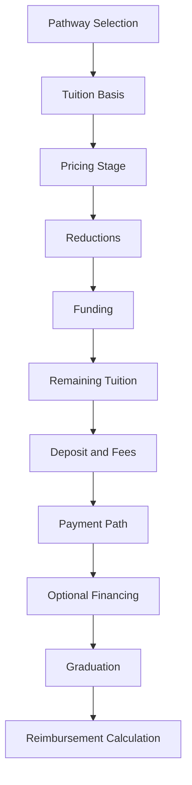

# RIAH PATHWAY

> **Build your pathway. Understand the price. See your options before you enroll.**
