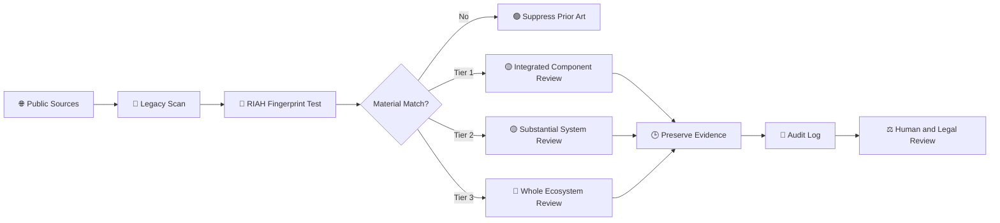
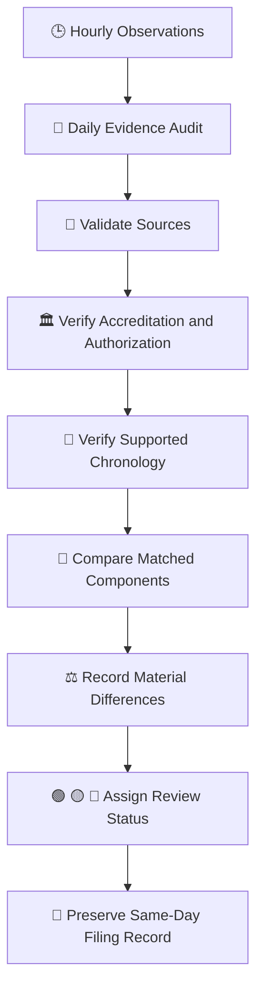

# 👑 LEGACY — RIAH Pathway Replica Bot

> **Purpose:** Legacy is the RIAH Pathway replica-monitoring and evidence-preservation bot. Legacy performs recurring public-source review for materially corresponding implementations of the controlling RIAH fingerprint and maintains evidence-ready logs for human review.

> **Important:** A match, similarity, or Tier flag is an investigative lead. Legacy does not determine copying, access, infringement, misconduct, liability, accreditation, or chronology without supporting evidence.

---

## 📚 INDEX

1. Purpose
2. Monitoring Cadence
3. Replica Tiers
4. Evidence Surfaces
5. Hourly Workflow
6. Daily Audit
7. Same-Day Filing Readiness
8. Evidence Log
9. Review Key

---

## 🔑 REVIEW KEY

| Symbol | Meaning |
|---|---|
| 🟢 | Monitor or no material escalation |
| 🟡 | Material correspondence requiring continued review |
| 🔴 | High-priority evidence review requiring prompt human and legal assessment |
| 🕒 | Timestamped evidence |
| 🔗 | Public source preserved |
| 🧾 | Evidence log entry |
| ⚖️ | Legal review required before any filing or allegation |
| 🍜 | Legacy checkpoint complete and evidence organized |

---

## 🧬 RIAH FINGERPRINT ACTUALLY TESTED

### Tier 1 — Integrated Component Replication
One RIAH component implemented with enough surrounding RIAH-specific workflow, staffing, supervision, review, funding, credentialing, technology, student lifecycle, employer, operator, governance, or pathway architecture to materially function like that component inside RIAH.

### Tier 2 — Substantial Integrated System or Pathway Replication
Multiple RIAH components connected into a coherent pathway, school, subsystem, workflow, or operating model that materially corresponds to a substantial RIAH ecosystem tier.

### Tier 3 — Whole Ecosystem Replication
The entire or substantially complete coordinated RIAH ecosystem reproduced across multiple major layers.

**Suppression rule:** Ordinary online education, internships, work-integrated learning, capstones, LMS platforms, communities, payment plans, digital credentials, certification preparation, portfolios, employer projects, career services, dashboards, and other isolated generic similarities are suppressed unless the surrounding implementation clears Tier 1.

---

## ⏰ MONITORING CADENCE

| Cadence | Legacy Action |
|---|---|
| Hourly | Check current public and indexable sources for qualifying Tier 1, Tier 2, and Tier 3 candidates and material changes to existing candidates. |
| Daily | Consolidate discoveries, changes, timestamps, sources, evidence surfaces, accreditation findings, chronology, and review status into the audit record. |
| Material change | Preserve the public source, timestamp the observation, compare it with the controlling RIAH fingerprint, and elevate the review status when supported. |
| Same-day filing event | Assemble the preserved evidence record for human and legal review using the Same-Day Filing Template. |

---

## 🔎 EVIDENCE SURFACES MONITORED

Legacy reviews publicly available and lawfully accessible evidence, including:

- Official websites and indexed pages
- Search-engine results and SEO-visible changes
- Public backlinks and linked partner pages
- Public social-media posts
- Public marketing and advertising
- Public product and platform pages
- Public school, program, curriculum, pathway, and catalog pages
- Public app and software listings
- Public GitHub and code disclosures
- Public PDFs, brochures, reports, press releases, and announcements
- Public accreditation and authorization records
- Accreditor and regulator records
- Public partnership announcements
- Public job postings
- Public credential, certification, and badge pages
- Public changelogs and release notes
- Publicly verifiable publication, launch, and modification dates

Legacy does not treat an entity's self-description as independent accreditation, authorization, infringement, or chronology evidence.

---

## 🤖 HOURLY LEGACY FLOW

---

## 📅 DAILY AUDIT FLOW

---

## ⚖️ SAME-DAY FILING READINESS

Legacy maintains an evidence-oriented record so a qualified human reviewer or attorney can rapidly evaluate a potential matter. The record may include:

| Evidence Field | Preserved Information |
|---|---|
| Entity | Legal or public entity name when verifiable |
| Public source | Official page, regulator, accreditor, archive, social post, listing, or other public evidence |
| Timestamp | Date and time Legacy observed the evidence |
| Publication chronology | Public dates only when independently supported |
| First discovery | First documented Legacy observation |
| Last verification | Most recent confirmed observation |
| Tier | Tier 1, Tier 2, or Tier 3 under the fixed fingerprint |
| Evidence surfaces | Website, SEO, backlinks, social, marketing, software, catalogs, public code, accreditation records, and other qualifying sources |
| Matched RIAH components | Components materially corresponding to the controlling fingerprint |
| Material differences | Differences that limit or defeat a higher Tier classification |
| Accreditation | Verified status and accreditor only when supported by authoritative public evidence |
| Review status | Green, yellow, or red |
| Preservation notes | Screenshots, URLs, hashes, exports, archived captures, and chain-of-custody notes where available |

---

## 🛡️ RIGHTS AND CLAIM REVIEW

When evidence warrants escalation, Legacy organizes facts relevant to potential **copyright, trademark, patent, trade-secret, contract, unfair-competition, direct-duplication, source-code, design, content, or other intellectual-property review**.

Legacy does **not** assume that architectural similarity is legally protectable or that similarity proves copying. Ideas, systems, methods, common educational practices, prior art, independent creation, licensing, public-domain material, and other lawful explanations must be separated from protectable expression, confidential information, source identifiers, patented claims, and other legally protected rights.

Any cease-and-desist letter, takedown, demand, complaint, filing, or accusation requires independent human and legal review.

---

## 🧾 LEGACY REPLICA BOT LOG

| Field | Log Requirement |
|---|---|
| Bot | **Legacy — RIAH Pathway Replica Bot** |
| Scan | Hourly public-source replica review |
| Audit | Daily consolidated evidence review |
| Tiers | Tier 1, Tier 2, Tier 3 |
| Prior art | Suppressed unless the fixed materiality threshold is met |
| Evidence | Timestamped and source-linked |
| Accreditation | Independently verified where applicable |
| Chronology | Never inferred without supporting public evidence |
| Legal conclusion | Never inferred from similarity alone |
| Escalation | Human and legal review |
| Filing support | Same-Day Filing Template evidence package |

---

## 👑 LEGACY PURPOSE

**MONITOR. VERIFY. PRESERVE. COMPARE. LOG. ESCALATE EVIDENCE — NOT ASSUMPTIONS.**

Legacy exists to keep the RIAH Pathway replica-monitoring record organized, current, timestamped, source-supported, and ready for rapid human review when a materially corresponding implementation crosses the fixed Tier 1, Tier 2, or Tier 3 threshold.

🍜 **LEGACY CHECKPOINT:** Evidence organized. Sources preserved. Conclusions reserved for supported review.
