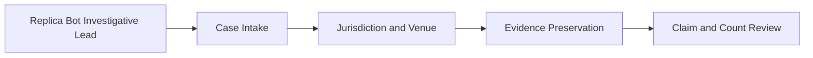
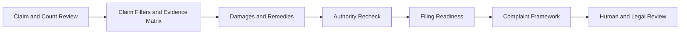
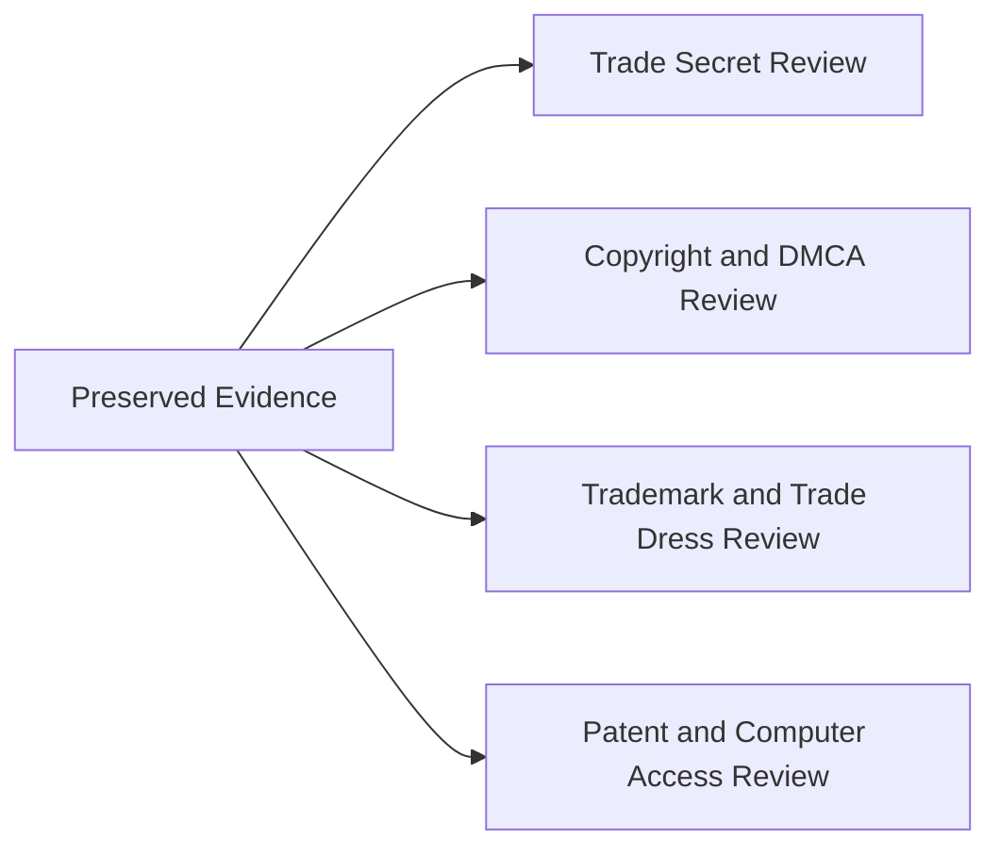
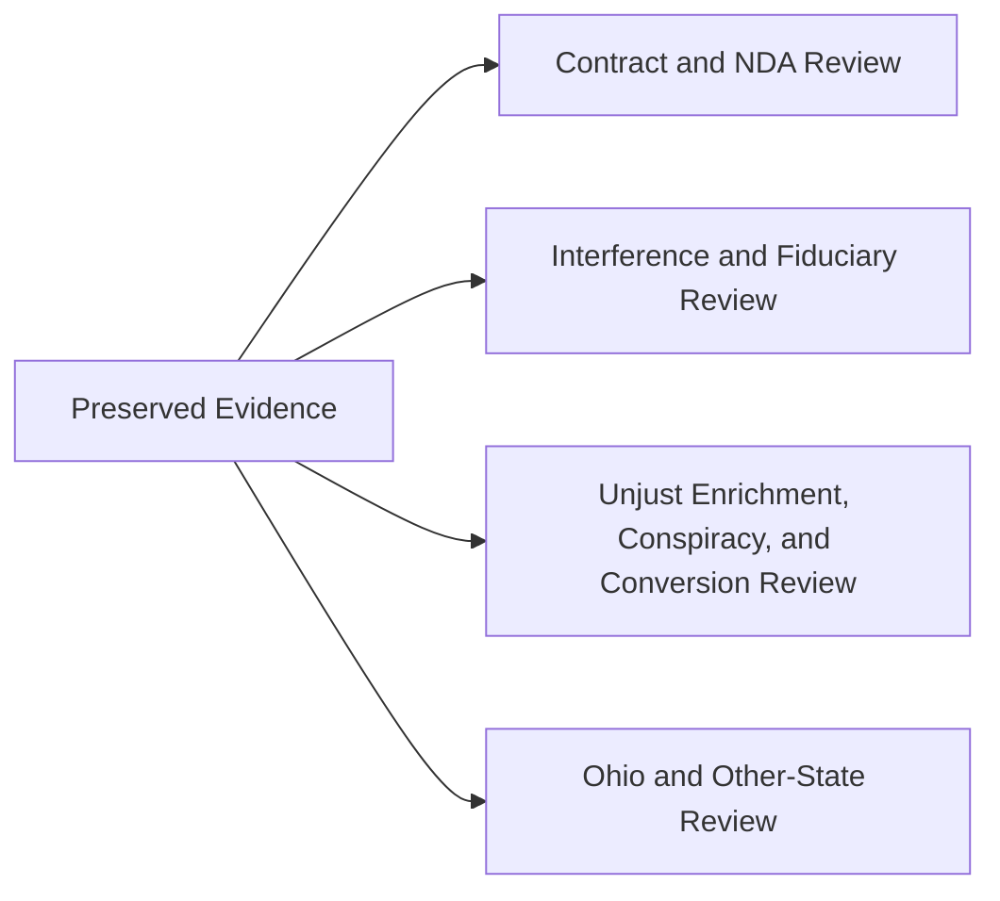

⚖️ COURTROOM EXPERIENCE

I do not have a law degree, but I do have courtroom experience. In one and only legal matter that I personally escalated through three different courts, I represented myself pro se before three different judges, handled hearings, drafted and filed my own motions, and obtained granted rulings I sought at each level.

And soon, I will earn my 5th degree—a Juris Doctor—from my own accredited law school once accredited, then sit for and pass the bar examination and complete the applicable licensing requirements to become a licensed attorney.

From representing myself pro se to building the institution where I will earn my J.D.—full circle.

**STATUS: DRAFT LAWSUIT TEMPLATE — EVIDENCE-DRIVEN / REVIEW BEFORE FILING**

Use this page as the working pleading and evidence framework if a future Replica Bot Tier 1, Tier 2, or Tier 3 review flag identifies a materially corresponding third-party implementation. A Replica Bot flag is an investigative lead only; each proposed count must be supported by its own facts, elements, jurisdiction, standing, limitations period, filing prerequisites, and admissible evidence before inclusion in any complaint.

## I. KEY AND INDEX

### I.A — Structure Key

| Structure | Meaning |
|---|---|
| **I, II, III...** | Major filing-template division |
| **V.A, V.B, V.C...** | Claim and count subcategory within the Claim and Count Review division |
| **III.A, IX.A, XII.A...** | Subcategory within the applicable Roman-numeral division |
| **Mermaid** | High-level process architecture only |
| **Table** | Structured comparison, evidence, authority, or readiness information |
| **Numbered list** | Ordered elements, proof requirements, filters, or review steps |
| **Checklist** | Filing-readiness control |
| **⚖️** | Human and legal review required before filing or allegation |
| **🤖** | Legacy Replica Bot evidence-monitoring connection |

### I.B — Index

| Roman Numeral | Division |
|---|---|
| **I** | Key and Index |
| **II** | Case Intake and Defendant Identification |
| **III** | Jurisdiction and Venue Worksheet |
| **IV** | RIAH Evidence Preservation File |
| **V** | Claim and Count Review |
| **VI** | Copyright Claim Filter |
| **VII** | Replica Bot to Pleading Evidence Matrix |
| **VIII** | Damages and Remedies Worksheet |
| **IX** | Precedent and Statutory Authority Checklist |
| **X** | Current Authoritative Links to Recheck at Filing |
| **XI** | Filing Readiness Checklist |
| **XII** | Complaint Caption and Party Placeholders |
| **XIII** | Control Rule |
| **XIV** | Legacy — RIAH Pathway Replica Bot Log |

### I.C — High-Level Filing Architecture

**MERMAID I — EVIDENCE TO CLAIM REVIEW**

**MERMAID II — CLAIM REVIEW TO FILING READINESS**

---

## II. CASE INTAKE AND DEFENDANT IDENTIFICATION

* **Plaintiff / rights holder:** \(RIAH entity / individual owner to confirm\)
* **Defendant legal name:** \(\)
* **DBA / product / school / app / website:** \(\)
* **Entity type:** \(Corporation / LLC / nonprofit / university / school / individual / other\)
* **State of formation:** \(\)
* **Principal place of business:** \(\)
* **Registered agent:** \(\)
* **Website / domain:** \(\)
* **App Store / Google Play / marketplace listing:** \(\)
* **School / program name:** \(\)
* **Accreditation / pre-accreditation / authorization status:** \(Verified source required\)
* **Accreditor / regulator / authorization body:** \(\)
* **Date first observed by Replica Bot:** \(\)
* **Publication / launch / change date:** \(\)
* **First indexed date, if independently verifiable:** \(\)
* **Tier review flag:** \(Tier 1 / Tier 2 / Tier 3\)
* **RIAH component(s) allegedly implicated:** \(Curriculum / software / app / website / pathway / ecosystem / source code / graphics / text / confidential architecture / trade dress / other\)

## III. JURISDICTION AND VENUE WORKSHEET

### III.A — Federal Subject-Matter Jurisdiction

* **Federal question:** 28 U.S.C. § 1331 where a viable federal claim is pleaded.
* **Copyright / patent / federal trademark jurisdiction:** 28 U.S.C. § 1338.
* **Federal trade-secret jurisdiction:** Defend Trade Secrets Act, 18 U.S.C. § 1836(b), for a qualifying trade secret related to a product or service used in, or intended for use in, interstate or foreign commerce.
* **Supplemental jurisdiction:** 28 U.S.C. § 1367 for qualifying related state-law claims forming part of the same case or controversy.
* **Diversity jurisdiction, if independently available:** 28 U.S.C. § 1332 — verify complete diversity and amount-in-controversy requirements.

### III.B — Federal Venue

* **General federal venue:** 28 U.S.C. § 1391, unless a claim-specific venue statute controls.
* **Copyright venue:** 28 U.S.C. § 1400(a) — verify where defendant or agent resides or may be found under controlling precedent.
* **Patent venue, if applicable:** 28 U.S.C. § 1400(b).
* **Proposed federal district:** \(\)
* **Personal jurisdiction basis:** \(Defendant residence / incorporation / principal place of business / purposeful contacts / conduct directed to forum / other\)

### III.C — Ohio State Jurisdiction

* **Potential trial court:** Ohio Court of Common Pleas for applicable Ohio civil claims, subject to subject-matter jurisdiction, personal jurisdiction, venue, standing, and amount rules.
* **Ohio venue:** verify under the Ohio Rules of Civil Procedure and any claim-specific statutes based on defendant, conduct, injury, property, contract, or transaction location.
* **Ohio county:** \(\)

### III.D — Other-State Placeholder

* **Defendant state:** \(\)
* **State trial court:** \(\)
* **State trade-secret statute:** \(\)
* **State deceptive-trade / unfair-competition statute:** \(\)
* **State contract / business-tort law:** \(\)
* **State limitations periods:** \(\)
* **Personal-jurisdiction facts:** \(\)
* **Venue facts:** \(\)

## IV. RIAH EVIDENCE PRESERVATION FILE

* ChatGPT conversation exports, screenshots, message timestamps, branch histories, and prior versions establishing creation chronology.
* Notion page history, timestamps, revisions, current pages, archived/superseded pages, audit records, and Replica Audit Log entries.
* Original curriculum matrices, course lists, course numbering logic, prerequisites, transfer rules, assessment/grading rules, majors/minors, school structure, exits, pathway architecture, certification/bar-review integration, experiential integration, and related version history.
* Source-code repositories, commit logs, release tags, build artifacts, schemas, APIs, architecture diagrams, app/software mockups, wireframes, product roadmaps, and internal technical specifications.
* Website drafts, screenshots, source files, graphics, videos, copy, SEO metadata, structured data, navigation/sitemap history, marketing materials, public launch dates, and archived versions.
* Copyright registration records, deposit copies, publication dates, and registration-effective dates.
* Trademark registrations/applications, specimens, first-use evidence, advertisements, and source-identification evidence.
* Patent records if any issued patent actually covers the accused technology.
* NDAs, confidentiality agreements, contractor agreements, employee agreements, licenses, terms of use, vendor agreements, and access restrictions.
* Access-control evidence: account permissions, identity records, authentication/session records when lawfully available, repository access, file-sharing permissions, email transmission records, and disclosure logs.
* Defendant's public pages, catalogs, PDFs, app listings, screenshots, product pages, changelogs, source-code disclosures, marketing, social posts, ads, job postings, accreditation materials, partnerships, and launch announcements.
* Side-by-side comparison separating **protectable expression / confidential information / source-identifying presentation** from ordinary ideas, methods, systems, standards, and prior art.
* Damages evidence: lost revenue, licensing value, development costs, saved costs, unjust enrichment, defendant profits where legally recoverable, market harm, corrective-advertising costs where recognized, and other provable loss.
* Chain-of-custody notes for screenshots, downloads, archived pages, source files, hashes, capture date/time, and capture method.

## V. CLAIM AND COUNT REVIEW

### V.0 — High-Level Claim Review Architecture

**MERMAID I — RIGHTS AND ACCESS REVIEW**

**MERMAID II — CONTRACT, BUSINESS TORT, AND STATE-LAW REVIEW**

### V.A — COUNT I — FEDERAL TRADE-SECRET MISAPPROPRIATION

**Statutory basis:** Defend Trade Secrets Act, 18 U.S.C. §§ 1836(b), 1839.

**Potential RIAH subject matter:** nonpublic source code; unreleased software/app architecture; private APIs and schemas; confidential automation/AI logic; unreleased curriculum implementation details; private prerequisite/transfer/assessment logic; internal pathway configuration; nonpublic experiential/supervision architecture; pricing models; partner structures; private business processes; implementation plans; security architecture; internal roadmaps; confidential compilations.

**Elements / proof checklist:**

1. Plaintiff owned information satisfying the statutory definition of a trade secret.
2. The information derived independent economic value from not being generally known or readily ascertainable by proper means.
3. Plaintiff took reasonable measures to keep the information secret.
4. Defendant acquired, disclosed, or used the trade secret.
5. Acquisition/use constituted statutory misappropriation through improper means or knowledge circumstances recognized by § 1839.
6. The trade secret related to a product/service used in, or intended for use in, interstate or foreign commerce.

**Required evidence:**

* Exact secret identified with sufficient specificity.
* Pre-disclosure version and date.
* Confidentiality/access controls.
* Evidence of defendant access or improper acquisition.
* Side-by-side use/disclosure evidence.
* Evidence showing information was not already public or readily ascertainable.
* Economic-value evidence.
* Damage / unjust-enrichment / royalty evidence.

**Remedies to evaluate:** injunction; actual loss; unjust enrichment not otherwise counted; reasonable royalty; exemplary damages up to the statutory limit for willful and malicious misappropriation; attorney fees where statutory conditions are satisfied.

**Limitations:** generally 3 years under the DTSA from discovery or when reasonable diligence should have discovered the misappropriation. Verify current law at filing.

**Key authority:** Defend Trade Secrets Act of 2016, Pub. L. 114-153; 18 U.S.C. §§ 1836, 1839.

### V.B — COUNT II — CONTRIBUTORY COPYRIGHT INFRINGEMENT

**Federal basis:** 17 U.S.C. §§ 106, 501–505; federal secondary-liability doctrine.

**Potential protected RIAH works:** original curriculum text; original course descriptions; original selection/arrangement of expressive materials; manuals; diagrams; pathway graphics; website copy; source code; original documentation; mockups; graphics; audiovisual works; downloadable materials.

**Elements / proof checklist:**

1. Ownership of a valid copyright interest in the work at issue.
2. Underlying direct infringement by another person/entity.
3. Defendant had legally sufficient knowledge of the infringing activity.
4. Defendant induced, caused, or materially contributed to the infringement.

**Evidence:** registration/deposit copy; exact protected work; direct infringer; copied expression; defendant communications; approvals; instructions; source-file transfers; platform/admin actions; knowledge evidence; material-assistance evidence; damages/profits evidence.

**Important limit:** 17 U.S.C. § 102(b) excludes ideas, procedures, processes, systems, methods of operation, concepts, principles, and discoveries from copyright protection as such.

**Precedent:** *MGM Studios Inc. v. Grokster, Ltd.*, 545 U.S. 913 (2005); Sixth Circuit secondary-liability precedent including *Bridgeport Music* decisions as applicable to the specific facts.

### V.C — COUNT III — VICARIOUS COPYRIGHT INFRINGEMENT

**Federal basis:** federal copyright secondary-liability doctrine.

**Elements / proof checklist:**

1. Underlying direct infringement.
2. Defendant had the right and ability to supervise/control the infringing conduct.
3. Defendant obtained the legally required direct financial benefit from the infringement.

**Evidence:** corporate/control records; administrative permissions; publishing authority; removal/edit authority; employment/contract relationships; approvals; direct financial benefit; revenue linked to accused offering; direct-infringer evidence; copyright registrations and deposit copies.

### V.D — COUNT IV — DIRECT COPYRIGHT INFRINGEMENT

**Federal basis:** 17 U.S.C. §§ 102, 106, 501–505.

**Elements / proof checklist:**

1. Ownership of a valid copyright.
2. Copying of constituent elements of the work that are original/protectable.
3. Identify the particular § 106 right implicated: reproduction, derivative work, distribution, public performance, or public display, as applicable.

**Evidence:** registration; deposit copy; creation/publication chronology; defendant access where relevant to infer copying; probative similarity of protectable expression; source-file matches; textual/code/graphic comparison; defendant publication/release dates.

**Registration prerequisite:** for a U.S. work, 17 U.S.C. § 411(a) generally requires registration before institution of an infringement action, subject to statutory exceptions. *Fourth Estate Public Benefit Corp. v. Wall-Street.com, LLC*, 586 U.S. 296 (2019).

**Damages:** evaluate actual damages/profits or statutory damages under 17 U.S.C. § 504; registration timing affects certain remedies under § 412.

**Precedent:** *Feist Publications, Inc. v. Rural Telephone Service Co.*, 499 U.S. 340 (1991); *Fourth Estate*, 586 U.S. 296 (2019).

### V.E — COUNT V — DMCA CIRCUMVENTION

**Federal basis:** 17 U.S.C. §§ 1201, 1203.

**Use only if evidence shows:** circumvention of a qualifying technological measure controlling access to a copyrighted work or other conduct actually covered by § 1201.

**Evidence:** technical control; how it operated; defendant bypass; access records; tools/method used; resulting access; connection to protected work.

**Do not plead based only on public similarity or publicly accessible copying.**

### V.F — COUNT VI — DMCA COPYRIGHT-MANAGEMENT INFORMATION

**Federal basis:** 17 U.S.C. §§ 1202–1203.

**Potential theory:** intentional removal, alteration, provision, or distribution of false copyright-management information with the statutory knowledge requirements.

**Evidence:** original CMI; accused version; metadata; attribution/owner/title information; before/after file versions; knowledge evidence; distribution/use evidence.

### V.G — COUNT VII — OHIO TRADE-SECRET MISAPPROPRIATION

**Ohio basis:** Ohio Rev. Code §§ 1333.61–1333.69.

**Elements / proof:** qualifying trade secret; economic value from secrecy; reasonable secrecy measures; acquisition/disclosure/use satisfying Ohio's definition of misappropriation.

**Potential subject matter:** confidential software/code, app architecture, private curriculum implementation, internal process maps, confidential compilations, pricing/business plans, technical designs, methods, procedures, and other qualifying nonpublic information.

**Remedies:** evaluate injunction, damages, unjust enrichment, reasonable royalty, exemplary damages where statutory conditions are met, and fees where authorized.

**Ohio limitations:** Ohio Rev. Code Chapter 1333 currently provides a four-year discovery-based limitations period for misappropriation; verify exact section and current text at filing.

**Preemption/displacement:** Ohio Rev. Code § 1333.67 displaces conflicting Ohio tort/restitutionary civil remedies based on trade-secret misappropriation, while preserving contractual remedies and other independently based civil remedies.

**Precedent:** *Fred Siegel Co., L.P.A. v. Arter & Hadden*, 85 Ohio St.3d 171 (1999), as relevant to Ohio trade-secret / business-tort issues.

### V.H — COUNT VIII — REGISTERED TRADEMARK INFRINGEMENT

**Federal basis:** Lanham Act § 32, 15 U.S.C. § 1114.

**Use only if:** an enforceable registered mark is implicated and the challenged use satisfies the statutory likelihood-of-confusion requirements.

**Evidence:** registration; ownership; first use; defendant use in commerce; similarity of marks; related goods/services; actual confusion if any; marketing channels; consumer care; defendant intent where relevant; damages/profits.

### V.I — COUNT IX — FALSE DESIGNATION OF ORIGIN / UNREGISTERED MARK

**Federal basis:** Lanham Act § 43(a), 15 U.S.C. § 1125(a).

**Potential theory:** false or misleading source, sponsorship, affiliation, connection, association, or origin representation involving protectable designation/trade identity.

**Evidence:** protectable designation; source-identifying use; defendant use in commerce; likelihood-of-confusion evidence; actual confusion; advertising/marketing; affiliation claims.

**Precedent / limitation:** *Dastar Corp. v. Twentieth Century Fox Film Corp.*, 539 U.S. 23 (2003) limits use of § 1125(a) as a substitute copyright claim concerning authorship of expressive content.

### V.J — COUNT X — TRADE-DRESS INFRINGEMENT

**Federal basis:** 15 U.S.C. § 1125(a).

**Potential RIAH subject matter:** only a public-facing, nonfunctional, source-identifying overall presentation that qualifies as protectable trade dress — for example a distinctive combination/arrangement of visual interface, website/app presentation, graphics, layout relationships, packaging, or presentation consistently identifying source.

**Elements / proof checklist:**

1. Define claimed trade dress precisely.
2. Distinctiveness/source-identifying character.
3. Nonfunctionality.
4. Secondary meaning when required.
5. Defendant use in commerce.
6. Likelihood of confusion as to source, sponsorship, affiliation, or approval.

**Evidence:** dated screenshots; consistent-use history; marketing; customer recognition; surveys if obtained; defendant screenshots; actual confusion; channel overlap; functionality analysis; chronology.

**Precedent:** *Two Pesos, Inc. v. Taco Cabana, Inc.*, 505 U.S. 763 (1992); *Abercrombie & Fitch Stores, Inc. v. American Eagle Outfitters, Inc.*, 280 F.3d 619 (6th Cir. 2002).

### V.K — COUNT XI — FEDERAL TRADEMARK DILUTION

**Federal basis:** 15 U.S.C. § 1125(c).

**Use only if:** the mark satisfies the federal famous-mark standard and the challenged use constitutes dilution by blurring or tarnishment under the statute.

**Evidence:** nationwide fame factors; duration/extent of use; advertising; geographic reach; recognition; registrations; defendant use after fame arose; blurring/tarnishment evidence.

### V.L — COUNT XII — OHIO DECEPTIVE TRADE PRACTICES ACT

**Ohio basis:** Ohio Rev. Code §§ 4165.02–4165.03.

**Potential theories:** passing off; likelihood of confusion about source, sponsorship, approval, certification, affiliation, connection, or association; other specifically enumerated deceptive practices supported by facts.

**Evidence:** defendant representations; source/affiliation claims; website/app/storefront screenshots; advertising; consumer confusion; actual damages; willfulness evidence where fee request is considered.

**Relief:** § 4165.03 provides for injunctive relief and, for an injured person, actual damages; attorney-fee rules depend on statutory findings.

### V.M — COUNT XIII — PATENT INFRINGEMENT

**Federal basis:** 35 U.S.C. § 271.

**Use only if:** an issued, enforceable patent actually covers the accused product/process/system.

**Evidence:** patent; claim chart; accused functionality; each claim limitation; ownership/standing; infringement theory; damages evidence.

**Remedies:** evaluate 35 U.S.C. §§ 283–285, including damages under § 284.

**Precedent on enhanced damages:** *Halo Electronics, Inc. v. Pulse Electronics, Inc.*, 579 U.S. 93 (2016).

### V.N — COUNT XIV — COMPUTER FRAUD AND ABUSE ACT — CIVIL

**Federal basis:** 18 U.S.C. § 1030(g), only where the required statutory authorization and loss/damage conditions are independently satisfied.

**Evidence:** protected computer; authorization boundaries; access records; credentials; dates; actions taken; qualifying statutory loss/damage; causal connection.

**Precedent:** *Van Buren v. United States*, 593 U.S. 374 (2021).

**Do not plead merely because public work resembles RIAH material.**

### V.O — COUNT XV — BREACH OF CONTRACT

**Ohio / governing-law basis:** applicable contract law.

**Potential contracts:** NDA; confidentiality agreement; license; employment agreement; contractor agreement; partnership agreement; software agreement; terms accepted by defendant; other enforceable agreement.

**Proof:** enforceable contract; plaintiff performance/excuse; breach; damages; governing law; forum clause; limitation clause; notice/cure requirements.

**Other-state placeholder:** \(State: / governing law: \).

### V.P — COUNT XVI — BREACH OF NDA / CONFIDENTIALITY AGREEMENT

**Basis:** contract law under controlling governing-law provision.

**Proof:** valid confidentiality obligation; covered information; disclosure/access; prohibited use/disclosure; breach; causation; damages; injunctive-relief standard if requested.

### V.Q — COUNT XVII — TORTIOUS INTERFERENCE WITH CONTRACT

**Ohio basis:** Ohio common law.

**Elements to verify:** existence of contract; defendant knowledge; intentional procurement of breach; lack of privilege/justification; actual breach/disruption; damages.

**Precedent:** *Fred Siegel Co., L.P.A. v. Arter & Hadden*, 85 Ohio St.3d 171 (1999).

**Other-state placeholder:** \(\).

### V.R — COUNT XVIII — TORTIOUS INTERFERENCE WITH BUSINESS / PROSPECTIVE RELATIONSHIP

**Ohio basis:** Ohio common law.

**Proof:** valid business/prospective relationship; defendant knowledge; intentional interference; improper means/lack of justification under controlling law; causation; damages.

**Precedent:** *Fred Siegel Co., L.P.A. v. Arter & Hadden*, 85 Ohio St.3d 171 (1999).

### V.S — COUNT XIX — BREACH OF FIDUCIARY DUTY

**Ohio basis:** Ohio common law, only where defendant actually owed a fiduciary duty.

**Proof:** fiduciary relationship/duty; breach; causation; damages.

**Precedent:** *Strock v. Pressnell*, 38 Ohio St.3d 207 (1988), as applicable to fiduciary-duty analysis.

### V.T — COUNT XX — UNJUST ENRICHMENT

**Ohio basis:** Ohio common law.

**Elements generally associated with Ohio unjust enrichment:** benefit conferred by plaintiff; defendant knowledge of the benefit; retention under circumstances where retention without payment would be unjust.

**Potential evidence:** exact benefit conveyed; defendant knowledge/source; communications; agreements; development/value evidence; defendant use; revenue; cost savings; licensing value.

**Precedent:** *Hambleton v. R.G. Barry Corp.*, 12 Ohio St.3d 179 (1984).

**Critical displacement issue:** Ohio Rev. Code § 1333.67 may displace a state-law unjust-enrichment theory if it merely repackages trade-secret misappropriation. Preserve only independently supported factual theories or pursue unjust enrichment through the Ohio trade-secret damages provision where appropriate.

### V.U — COUNT XXI — CIVIL CONSPIRACY

**Ohio basis:** Ohio common law.

**Use only if:** facts support agreement/common plan among multiple actors plus an independently actionable underlying tort and resulting damages.

**Evidence:** communications; coordinated acts; shared objective; underlying tort; overt acts; causation/damages.

**Other-state placeholder:** \(\).

### V.V — COUNT XXII — CONVERSION

**Ohio basis:** Ohio common law, only where the subject matter and facts support conversion of legally cognizable property.

**Evidence:** plaintiff right/title; defendant wrongful dominion/control; demand/refusal if required; property identity; damages.

**Preemption/displacement check:** confirm copyright preemption and Ohio trade-secret displacement before pleading where the theory concerns copied information rather than independently cognizable property.

### V.W — COUNT XXIII — OHIO COMMON-LAW TRADEMARK / UNFAIR COMPETITION / PASSING OFF

**Basis:** Ohio common law and/or independent Ohio theories not displaced by controlling federal law.

**Evidence:** source-identifying mark/trade identity; priority; defendant use; confusion; passing off; damages/injury; public-facing representations.

**Cross-reference:** Ohio Rev. Code Chapter 4165 where statutory deceptive-trade-practice elements are met.

### V.X — COUNT XXIV — OTHER-STATE TRADE-SECRET MISAPPROPRIATION

**State:** \(\)

* Uniform Trade Secrets Act / applicable statute: \(\)
* Definition of trade secret: \(\)
* Misappropriation standard: \(\)
* Reasonable secrecy measures: \(\)
* Injunction standard: \(\)
* Actual-loss / unjust-enrichment / royalty remedies: \(\)
* Exemplary multiplier: \(\)
* Attorney fees: \(\)
* Limitations period: \(\)
* Preemption/displacement rule: \(\)

### V.Y — COUNT XXV — OTHER-STATE DECEPTIVE TRADE / UNFAIR COMPETITION

**State:** \(\)

* Statute/common-law basis: \(\)
* Business-plaintiff standing: \(\)
* Passing off / source confusion: \(\)
* False advertising: \(\)
* Trademark/unfair competition: \(\)
* Injunctive relief: \(\)
* Damages: \(\)
* Fees/punitive or enhanced remedies: \(\)
* Limitations period: \(\)

### V.Z — COUNT XXVI — OTHER-STATE CONTRACT / BUSINESS TORTS

**State:** \(\)

* Breach of contract: \(\)
* NDA/confidentiality: \(\)
* Fiduciary duty: \(\)
* Tortious interference: \(\)
* Unjust enrichment: \(\)
* Civil conspiracy: \(\)
* Conversion: \(\)
* Applicable preemption/displacement: \(\)
* Limitations periods: \(\)

## VI. COPYRIGHT CLAIM FILTER — RIAH CURRICULUM / WEBSITE / SOFTWARE / MATERIALS

Before pleading copyright infringement, separate the claimed material into:

1. **Potentially protectable expression:** original text, graphics, diagrams, software code, original compilation/selection/arrangement where sufficiently original, audiovisual content, documentation, mockup artwork, website copy, course descriptions, manuals and other fixed original expression.
2. **Potentially unprotectable ideas/systems/processes:** abstract curriculum concept, educational method, procedure, system, process, method of operation, underlying idea, functional logic, common course titles, common degree structure, common standards, facts, public-domain material, scènes à faire / standard elements, and prior art.
3. **Trade-secret lane:** nonpublic information satisfying DTSA/Ohio secrecy and misappropriation requirements.
4. **Trademark/trade-dress lane:** source-identifying marks or qualifying nonfunctional source-identifying presentation.
5. **Contract lane:** information/use restricted by actual agreements even when copyright/trade-secret theories differ.

## VII. REPLICA BOT TO PLEADING EVIDENCE MATRIX

| Replica finding                               | What must be added before pleading                                                                                                                                                                                              |
| --------------------------------------------- | ------------------------------------------------------------------------------------------------------------------------------------------------------------------------------------------------------------------------------- |
| Tier 1 integrated component                   | Exact protected/confidential/source-identifying material; defendant act; access/use evidence; dates; applicable cause of action; damages.                                                                                       |
| Tier 2 substantial subsystem/pathway          | Same requirements plus component-by-component mapping separating common/public architecture from protectable expression or confidential information.                                                                            |
| Tier 3 whole/substantially complete ecosystem | Same requirements plus full chronology, independent evidence of copying/misappropriation or source confusion, defendant access where required, and claim-specific proof.                                                        |
| Renamed/reordered curriculum match            | Functional comparison may support investigation, but copyright count still requires copying of protectable expression; trade-secret count requires secrecy + misappropriation; contract count requires actual contractual duty. |
| Similar app/website appearance                | Identify original protected artwork/code/expression or qualifying trade dress; exclude functional/common UI conventions.                                                                                                        |

## VIII. DAMAGES AND REMEDIES WORKSHEET

* **Copyright:** \(actual damages / attributable profits / statutory damages if eligible / injunction / costs / fees if eligible\).
* **DTSA:** \(actual loss / unjust enrichment / royalty / injunction / exemplary damages if statutory conditions met / fees if authorized\).
* **Ohio trade secrets:** \(actual loss / unjust enrichment / royalty / injunction / exemplary damages if authorized / fees if authorized\).
* **Lanham Act:** \(profits / damages / costs / injunction / fees where authorized / other statutory relief\).
* **Ohio DTPA:** \(injunction / actual damages / fee request if statutory findings support it\).
* **Contract:** \(expectation / reliance / consequential damages if recoverable / injunctive relief / contractual fees if authorized\).
* **Other:** \(\).
* **No double recovery:** identify overlapping damages theories and avoid duplicative recovery for the same injury.

## IX. PRECEDENT AND STATUTORY AUTHORITY CHECKLIST

### IX.A — Federal

* 17 U.S.C. §§ 102, 106, 501–505, 411–412, 1201–1203.
* 18 U.S.C. §§ 1836, 1839.
* 15 U.S.C. §§ 1114, 1125, 1117.
* 18 U.S.C. § 1030(g).
* 35 U.S.C. §§ 271, 283–285.
* 28 U.S.C. §§ 1331, 1332, 1338, 1367, 1391, 1400.
* *Feist Publications, Inc. v. Rural Telephone Service Co.*, 499 U.S. 340 (1991).
* *Two Pesos, Inc. v. Taco Cabana, Inc.*, 505 U.S. 763 (1992).
* *Dastar Corp. v. Twentieth Century Fox Film Corp.*, 539 U.S. 23 (2003).
* *MGM Studios Inc. v. Grokster, Ltd.*, 545 U.S. 913 (2005).
* *Fourth Estate Public Benefit Corp. v. Wall-Street.com, LLC*, 586 U.S. 296 (2019).
* *Van Buren v. United States*, 593 U.S. 374 (2021).
* *Halo Electronics, Inc. v. Pulse Electronics, Inc.*, 579 U.S. 93 (2016).
* Sixth Circuit trade-dress authority including *Abercrombie & Fitch Stores, Inc. v. American Eagle Outfitters, Inc.*, 280 F.3d 619 (6th Cir. 2002).

### IX.B — Ohio

* Ohio Rev. Code §§ 1333.61–1333.69 — Uniform Trade Secrets Act.
* Ohio Rev. Code §§ 4165.01–4165.04 — Deceptive Trade Practices.
* *Fred Siegel Co., L.P.A. v. Arter & Hadden*, 85 Ohio St.3d 171 (1999).
* *Hambleton v. R.G. Barry Corp.*, 12 Ohio St.3d 179 (1984).
* *Strock v. Pressnell*, 38 Ohio St.3d 207 (1988).

## X. CURRENT AUTHORITATIVE LINKS TO RECHECK AT FILING

* **17 U.S.C. § 102:** [https://uscode.house.gov/view.xhtml?req=(title:17%20section:102%20edition:prelim)](https://uscode.house.gov/view.xhtml?req=%28title:17%20section:102%20edition:prelim%29)
* **DTSA / Pub. L. 114-153:** [https://uscode.house.gov/statutes/pl/114/153.pdf](https://uscode.house.gov/statutes/pl/114/153.pdf)
* **Ohio trade-secret definitions — ORC 1333.61:** [https://codes.ohio.gov/ohio-revised-code/section-1333.61](https://codes.ohio.gov/ohio-revised-code/section-1333.61)
* **Ohio trade-secret displacement — ORC 1333.67:** [https://codes.ohio.gov/ohio-revised-code/section-1333.67](https://codes.ohio.gov/ohio-revised-code/section-1333.67)
* **Ohio Deceptive Trade Practices — ORC 4165.02:** [https://codes.ohio.gov/ohio-revised-code/section-4165.02](https://codes.ohio.gov/ohio-revised-code/section-4165.02)
* **Ohio DTPA remedies — ORC 4165.03:** [https://codes.ohio.gov/ohio-revised-code/section-4165.03](https://codes.ohio.gov/ohio-revised-code/section-4165.03)
* **Supreme Court docket / Fourth Estate:** [https://www.supremecourt.gov/docket/docketfiles/html/public/17-571.html](https://www.supremecourt.gov/docket/docketfiles/html/public/17-571.html)

## XI. FILING READINESS CHECKLIST

* [ ] Correct plaintiff / rights holder identified for every right asserted.
* [ ] Correct defendant legal entities identified and service information verified.
* [ ] Personal jurisdiction established as to each defendant.
* [ ] Subject-matter jurisdiction established.
* [ ] Venue statute checked claim by claim.
* [ ] Standing confirmed.
* [ ] Limitations period calculated separately for each claim.
* [ ] Copyright registrations and deposit copies matched to accused works.
* [ ] Trade-secret list finalized with secrecy measures and access/misappropriation evidence.
* [ ] Trademark registrations / common-law priority evidence finalized where applicable.
* [ ] Patent ownership / claim chart finalized if applicable.
* [ ] Contracts, NDAs, licenses and governing-law/forum clauses collected.
* [ ] Side-by-side exhibits finalized.
* [ ] Replica Bot chronology independently corroborated with preserved public evidence.
* [ ] Damages model tied to admissible records and applicable legal measure.
* [ ] Duplicative / preempted / displaced counts removed.
* [ ] Remedies requested are authorized by each governing statute.
* [ ] Federal and state rules of civil procedure, local rules, formatting, summons, civil cover sheet, filing fee, service, and disclosure obligations checked immediately before filing.

## XII. COMPLAINT CAPTION AND PARTY PLACEHOLDERS

**UNITED STATES DISTRICT COURT**

**\(DISTRICT / DIVISION\)**

**\(PLAINTIFF\),**

Plaintiff,

v.

**\(DEFENDANT(S)\),**

Defendant(s).

Case No. \(\)

Judge \(\)

**COMPLAINT FOR \(INSERT ONLY FACTUALLY SUPPORTED COUNTS\)**

### XII.A — Parties

\(\)

### XII.B — Jurisdiction and Venue

\(Insert only verified federal/state jurisdictional allegations.\)

### XII.C — General Factual Allegations

\(Chronological facts with dated exhibits and source references.\)

### XII.D — Counts

\(Insert only claims whose elements are supported by evidence.\)

### XII.E — Prayer for Relief

\(Insert claim-specific remedies supported by statute and evidence.\)

### XII.F — Jury Demand

\(Include only if legally available and strategically selected.\)

## XIII. CONTROL RULE

**This page is a litigation-preparation template, not a conclusion that any person or entity infringed RIAH rights. A Tier 1/2/3 Replica Bot finding must be converted into claim-specific evidence before a count is asserted. Every statute, precedent, court rule, limitations period, jurisdictional basis, venue basis, registration prerequisite, and remedy must be rechecked against current law and the actual defendant/facts before filing.**

---

## XIV. LEGACY — RIAH PATHWAY REPLICA BOT LOG

The **Legacy RIAH Pathway Replica Bot** is the evidence-monitoring layer supporting this Same-Day Filing Template. Legacy performs recurring hourly public-source scans and daily evidence audits using the fixed RIAH Tier 1, Tier 2, and Tier 3 fingerprint.

For each qualifying candidate, preserve the entity, official public sources, observation timestamp, supported publication or change chronology, first and last discovery, evidence surfaces, matched RIAH components, material differences, independently verified accreditation or authorization status where applicable, and green, yellow, or red review status.

**Legacy documentation:** [RIAH Pathway Replica Bot — Legacy](./RIAH-Pathway-Replica-Bot-Legacy.md)

> A Legacy flag is an investigative lead only. No allegation or filing should state copying, access, infringement, misconduct, accreditation, authorization, chronology, or liability unless supported by evidence and independently reviewed.
