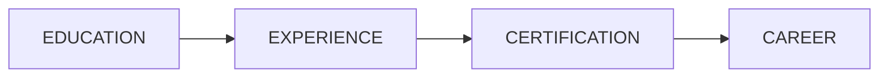
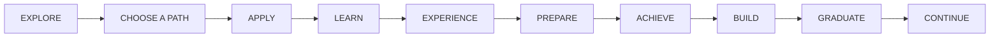
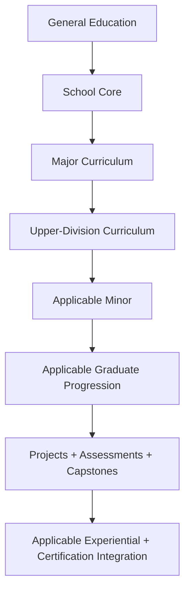
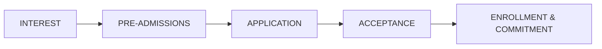
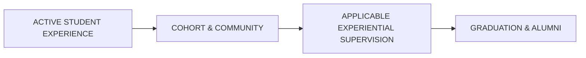
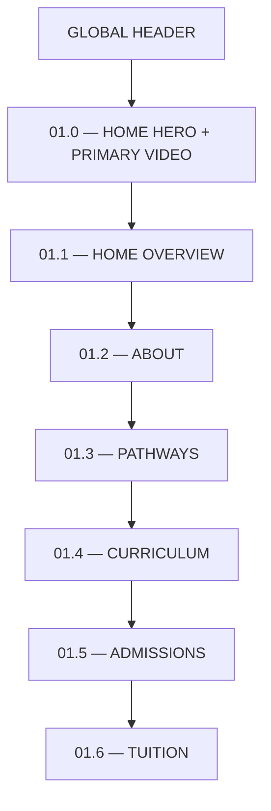
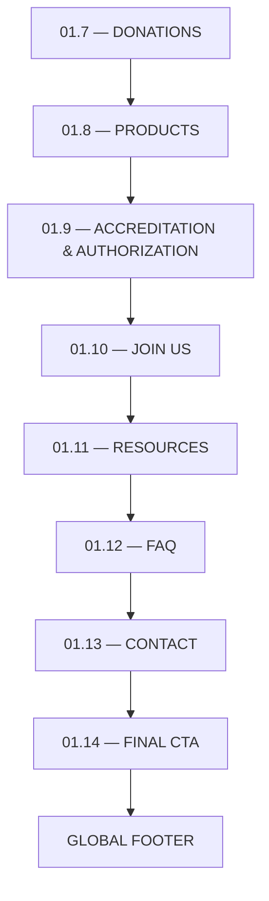
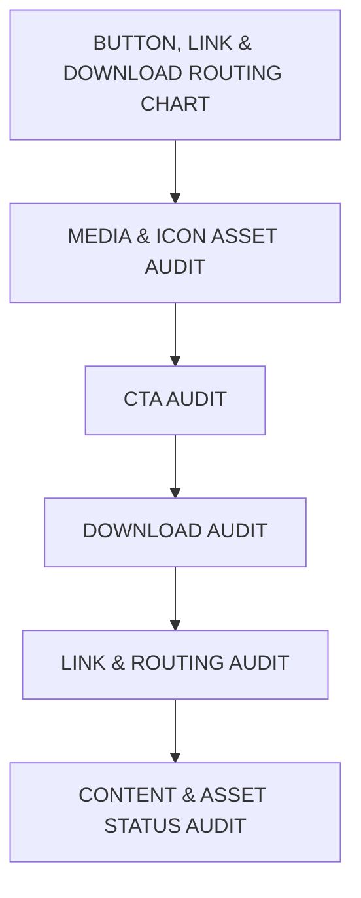

**Contributor; Mariah Dominique Rucker**

There is currently no team. I am building everything myself until I have hired the beta team. I am starting the hiring process this month, **October 2026**, for the CTO, CISO, experiential professionals, PhD-qualified faculty, and adjunct faculty for each school and major, with hiring continuing across the entire ecosystem as it scales.

Beta team members will be hired with **equity participation and compensation during the beta cohort**, which launches in **Spring 2027**.

The website will launch in **October 2026** as I continue to build, develop, revise, and finalize aspects of the RIAH Pathway ecosystem.

Learn more about me on GitHub and LinkedIn, or connect with me through social media and Linktree.

- **GitHub:** https://github.com/mariahdominiquerucker
- **LinkedIn:** https://linkedin.com/in/mariahrucker
- **Facebook:** https://facebook.com/heymariahrucker
- **Instagram:** https://instagram.com/heymariahrucker
- **Linktree:** https://linktr.ee/mariahrucker

---

# 👑 RIAH PATHWAY — 01 HOME
## WEBSITE WIREFRAME

---

# WIREFRAME BUILD KEY

- **VIDEO PLACEHOLDER** — One principal homepage video
- **IMAGE PLACEHOLDER** — Purposeful institutional imagery only
- **ICON PLACEHOLDER** — Professional website icon
- **DIAGRAM PLACEHOLDER** — Structured visual explanation
- **CARD** — Page, pathway, school, resource, product, audience, or navigation card
- **BUTTON** — One of the approved five CTA families
- **INTERNAL LINK** — Exact numbered RIAH Pathway website destination
- **EXTERNAL LINK** — Approved public-facing platform or resource
- **DOWNLOAD** — Standalone file only when genuinely necessary
- **ANCHOR** — Same-page destination
- **STATUS** — Implementation state

---

# 01. GLOBAL HEADER

[GLOBAL HEADER]

[LOGO PLACEHOLDER — RIAH PATHWAY]

[SLOGAN — ONE DYNASTY. INFINITE LEGACIES.]

## GLOBAL NAVIGATION — PAGES 01–13

[INTERNAL LINK — 01 / HOME — ACTIVE]

[INTERNAL LINK — 02 / ABOUT]

[INTERNAL LINK — 03 / PATHWAY]

[INTERNAL LINK — 04 / CURRICULUM]

[INTERNAL LINK — 05 / ADMISSIONS]

[INTERNAL LINK — 06 / TUITION]

[INTERNAL LINK — 07 / DONATIONS]

[INTERNAL LINK — 08 / PRODUCTS]

[INTERNAL LINK — 09 / ACCREDITATION & AUTHORIZATION]

[INTERNAL LINK — 10 / JOIN US]

[INTERNAL LINK — 11 / RESOURCES]

[INTERNAL LINK — 12 / FAQ]

[INTERNAL LINK — 13 / CONTACT]

[PRIMARY GLOBAL CTA — APPLY NOW → EXTERNAL / CLASSE365]

## GLOBAL HEADER LINKS

[BUTTON — GET STARTED: REQUEST INFORMATION → 13 / CONTACT]

[BUTTON — LOG IN → APPROVED RIAH PATHWAY PORTAL DESTINATION]

[ICON PLACEHOLDER — SEARCH]

[ICON PLACEHOLDER — ACCESSIBILITY]

---

# 02. PAGE HERO

# 01.0 — HOME HERO

[HERO MEDIA PLACEHOLDER — RIAH PATHWAY HOMEPAGE HERO]

[VIDEO PLACEHOLDER — RIAH PATHWAY HOMEPAGE VIDEO]

## PAGE EYEBROW

**RIAH PATHWAY**

# EDUCATION. EXPERIENCE. CERTIFICATION. CAREER.

## BUILD YOUR PATH.
## CREATE YOUR LEGACY.

RIAH Pathway connects education, experiential learning, professional preparation, certification and review, career development, community, products, technology, and opportunity through one connected pathway ecosystem.

Students can enter from different starting points and build forward through the pathway that fits their education, experience, professional development, credential, and career goals.

## THE CAREER TRIFECTA

**EDUCATION + EXPERIENCE + CERTIFICATION = CAREER PREPARATION**

[DIAGRAM PLACEHOLDER — CAREER TRIFECTA]

[PRIMARY HERO CTA — APPLY NOW → EXTERNAL / CLASSE365]

[SECONDARY HERO CTA — LEARN MORE: EXPLORE PATHWAYS → 03 / PATHWAY]

[BUTTON — GET STARTED: REQUEST INFORMATION → 13 / CONTACT]

### HERO INTERNAL ROUTING

[INTERNAL LINK — EXPLORE PATHWAYS → 03 / PATHWAY]

[INTERNAL LINK — EXPLORE CURRICULUM → 04 / CURRICULUM]

[INTERNAL LINK — HOW RIAH PATHWAY WORKS → 05.7 / ADMISSIONS]

[INTERNAL LINK — TUITION → 06 / TUITION]

### HERO EXTERNAL ROUTING

[EXTERNAL LINK — APPLY NOW → CLASSE365 PUBLIC APPLICATION DESTINATION]

---

## HERO VIDEO

[VIDEO PLACEHOLDER — RIAH PATHWAY HOMEPAGE VIDEO]

**Purpose:**  
Introduce RIAH Pathway as one connected ecosystem that links academic pathways, experiential learning, professional preparation, certification and review, products, career development, community, and long-term opportunity.

**Visual Direction:**  

**Content:**  
Education • Experience • Certification • Career • Pathways • Schools • Curriculum • Student Journey • Products • Community • Opportunity • Legacy

**Primary Closing Message:**  
**ONE DYNASTY. INFINITE LEGACIES.**

**Controls:**  
Play • Pause • Captions • Full Screen

**Poster Image:**  
[IMAGE PLACEHOLDER — HOMEPAGE VIDEO POSTER]

**Status:**  
[TO FINALIZE]

---

# 03. PAGE OVERVIEW

# 01.1 — HOME OVERVIEW

## ONE CONNECTED PATHWAY.

RIAH Pathway is designed around the idea that education should connect to experience, professional preparation, applicable credentials, career development, community, and opportunity.

The ecosystem brings together academic pathways, experiential pathways, certification preparation, professional development, products, student support, partnerships, technology, and community within one connected structure.

Students do not all begin in the same place.

RIAH Pathway supports multiple entry points so students can begin with the pathway appropriate to their current educational, professional, or career stage and continue building forward.

**Page Purpose:**  
The Home page serves as the primary public entry point into the complete RIAH Pathway website and introduces the visitor to Pages 02 through 13.

[DIAGRAM PLACEHOLDER — RIAH PATHWAY CONNECTED ECOSYSTEM]

[OVERVIEW CTA — LEARN MORE: ABOUT RIAH PATHWAY → 02 / ABOUT]

---

# 04. PAGE-SPECIFIC NAVIGATION STRUCTURE

[ANCHOR — 01.1 / HOME OVERVIEW]

[ANCHOR — 01.2 / ABOUT]

[ANCHOR — 01.3 / PATHWAYS]

[ANCHOR — 01.4 / CURRICULUM]

[ANCHOR — 01.5 / ADMISSIONS]

[ANCHOR — 01.6 / TUITION]

[ANCHOR — 01.7 / DONATIONS]

[ANCHOR — 01.8 / PRODUCTS]

[ANCHOR — 01.9 / ACCREDITATION & AUTHORIZATION]

[ANCHOR — 01.10 / JOIN US]

[ANCHOR — 01.11 / RESOURCES]

[ANCHOR — 01.12 / FAQ]

[ANCHOR — 01.13 / CONTACT]

---

# 01.2 — ABOUT

## STUDENTS AT THE CENTER.
## OPPORTUNITY IN EVERY DIRECTION.

RIAH Pathway is an interconnected educational and professional ecosystem built to connect learning with experience, professional preparation, applicable credentials, community, products, technology, and career opportunity.

### THE RIAH PATHWAY ECOSYSTEM

**EDUCATION** — Academic and educational pathways that provide structured learning and progression.

**EXPERIENCE** — Applied experiential opportunities that connect learning to applicable professional environments.

**CERTIFICATION** — Certification and examination preparation where applicable to the selected pathway.

**PROFESSIONAL DEVELOPMENT** — Professional preparation, mentorship, career development, and applicable opportunities.

**COMMUNITY** — Cohorts, schools, organizations, alumni, partners, ambassadors, and professional connections.

**PRODUCTS** — Educational, study, review, planning, and pathway-support products.

**TECHNOLOGY** — Technology-supported systems connecting the student and institutional journey.

**CAREER** — Career preparation, employer engagement, professional development, and opportunity.

[BUTTON — LEARN MORE: ABOUT RIAH PATHWAY → 02 / ABOUT]

[INTERNAL LINK — ECOSYSTEM → 02.2 / ABOUT]

[INTERNAL LINK — SCHOOLS → 02.3 / ABOUT]

[INTERNAL LINK — LEADERSHIP → 02.4 / ABOUT]

[INTERNAL LINK — BOARD & GOVERNANCE → 02.5 / ABOUT]

[INTERNAL LINK — BRAND, MASCOT & SCHOOL COLORS → 02.6 / ABOUT]

---

# 01.3 — PATHWAYS

## MULTIPLE PATHS.
## ONE CONNECTED ECOSYSTEM.

RIAH Pathway supports different educational and professional entry points rather than requiring every student to begin at the same stage.

### DEGREE PATHWAY
Associate’s • Bachelor’s • MBA • Minor

[BUTTON — LEARN MORE → 03.2 / DEGREE PATHWAY]

### SCHOOLS
School-specific pathways across RIAH Pathway.

[BUTTON — LEARN MORE → 03.3 / SCHOOLS]

### LAW PATHWAY
J.D. • Non-J.D. Bar License Pathway

[BUTTON — LEARN MORE → 03.4 / LAW PATHWAY]

### EXPERIENTIAL PATHWAY
Experiential pathways organized by duration, school, and applicable learning process.

[BUTTON — LEARN MORE → 03.5 / EXPERIENTIAL PATHWAY]

### CERTIFICATION PATHWAY
Certifications • Bar Review

[BUTTON — LEARN MORE → 03.6 / CERTIFICATION PATHWAY]

### HIGH SCHOOL DIPLOMA PATHWAY
High School Diploma pathway.

[BUTTON — LEARN MORE → 03.7 / HIGH SCHOOL DIPLOMA PATHWAY]

### GED / HSE PATHWAY
GED / HSE preparation and pathway progression.

[BUTTON — LEARN MORE → 03.8 / GED-HSE PATHWAY]

[BUTTON — LEARN MORE: EXPLORE ALL PATHWAYS → 03 / PATHWAY]

---

# 01.4 — CURRICULUM

## CURRICULUM BUILT AROUND PROGRESSION.

RIAH Pathway curriculum connects academic foundations, school cores, majors, upper-division learning, graduate education, assessments, projects, capstones, certification mapping, and experiential integration where applicable.

### ACADEMIC STRUCTURE

### SCHOOL OF BUSINESS
Accounting • Business Management • Entrepreneurship • Finance

### SCHOOL OF HOMELAND SECURITY
Governance, Risk & Compliance • Intelligence • Physical Security • Private Investigator

### SCHOOL OF TECHNOLOGY
Computer Science • Cybersecurity • Data Analytics • Data Science • Information Systems • Program Management • Project Management • Software Development • Software Engineering

### SCHOOL OF LAW
Law Core • Criminal Justice • J.D. • Non-J.D. Bar License • Bar Review

### SCHOOL OF DIPLOMA AND GED
High School Diploma • GED / HSE

[INTERNAL LINK — EXPERIENTIAL → 04.8 / CURRICULUM]

[INTERNAL LINK — CERTIFICATION & REVIEW → 04.9 / CURRICULUM]

[INTERNAL LINK — CURRICULUM ARCHITECTURE → 04.10 / CURRICULUM]

[BUTTON — LEARN MORE: EXPLORE CURRICULUM → 04 / CURRICULUM]

---

# 01.5 — ADMISSIONS

## YOUR PATHWAY.
## ONE CONNECTED JOURNEY.

RIAH Pathway admissions connects initial exploration with application, acceptance, enrollment, onboarding, the active student experience, graduation, and alumni engagement.

### Admissions Journey — Part I: Interest to Commitment

### Admissions Journey — Part II: Welcome and Onboarding

### Admissions Journey — Part III: Active Experience to Alumni

[BUTTON — APPLY NOW → EXTERNAL / CLASSE365]

[BUTTON — LEARN MORE: VIEW ADMISSIONS → 05 / ADMISSIONS]

---

# 01.6 — TUITION

## UNDERSTAND YOUR PATH.
## UNDERSTAND YOUR COST.

RIAH Pathway centralizes tuition, fees, payment options, funding, reimbursement, costs, and individualized pricing information.

### TUITION DIRECTORY

Tuition → 06.2  
Fees → 06.3  
Payment Options → 06.4  
Funding → 06.5  
Reimbursement → 06.6  
Costs → 06.7  
Pricing Calculator Engine → 06.8

### PRICING STAGES

| Stage | Structure | Public Purpose |
|---|---|---|
| Beta | 25% of applicable post-credit baseline | Beta-stage pricing |
| Pre-Accredited | 50% of applicable post-credit baseline | Pre-accreditation pricing |
| Post-Credit | 100% baseline | Applicable baseline pricing |

[BUTTON — GET STARTED: PRICING CALCULATOR → 06.8 / TUITION]

[BUTTON — LEARN MORE: EXPLORE TUITION → 06 / TUITION]

---

# 01.7 — DONATIONS

## INVEST.
## EMPOWER.
## BUILD WHAT COMES NEXT.

RIAH Pathway donations support applicable charitable, educational, institutional, accreditation, authorization, scholarship, expansion, and community initiatives.

### FOUNDATION
[BUTTON — LEARN MORE → 07.2 / FOUNDATION]

### ACCREDITATION
[BUTTON — LEARN MORE → 07.3 / ACCREDITATION]

### STATE AUTHORIZATION
[BUTTON — LEARN MORE → 07.4 / STATE AUTHORIZATION]

Public donation transparency applies to applicable donations and public funds.

Individual student financial information remains private.

[BUTTON — LEARN MORE: EXPLORE DONATIONS → 07 / DONATIONS]

---

# 01.8 — PRODUCTS

## LEARN.
## PREPARE.
## ADVANCE.

RIAH Pathway products support academic learning, certification preparation, bar preparation, experiential development, study, organization, and pathway progression.

Most RIAH Pathway educational products are print-based physical products.

Select products may be available digitally.

For applicable print products, a first chapter or selected preview pages may be available digitally before purchase.

[IMAGE PLACEHOLDER — RIAH PATHWAY PRODUCT COLLECTION]

### PRODUCT AREAS

**CERTIFICATION REVIEW**  
Certification review products organized by applicable school and credential.

**BAR REVIEW**  
RIAH Pathway Bar Review.

**COLLECTIONS**  
General Education • Core • Year 3 • Year 4 • Master’s • MBA • GED • High School Diploma • Experiential

**BUNDLES**  
Applicable grouped product collections.

[BUTTON — SHOP NOW → EXTERNAL / SHOPIFY]

[BUTTON — LEARN MORE: EXPLORE PRODUCTS → 08 / PRODUCTS]

---

# 01.9 — ACCREDITATION & AUTHORIZATION

## KNOW THE STATUS.
## UNDERSTAND THE PATH.

RIAH Pathway presents accreditation, authorization, approval, and institutional-development information clearly so visitors can distinguish current status from future, planned, pursued, pending, or developmental status.

RIAH Pathway will not present planned, developmental, pursued, pending, provisional, or future status as already awarded or approved.

### EXPERIENTIAL PATHWAYS
[BUTTON — LEARN MORE → 09.2]

### ACADEMIC PATHWAYS
[BUTTON — LEARN MORE → 09.3]

### HIGH SCHOOL + GED/HSE + STATE AUTHORIZATION
[BUTTON — LEARN MORE → 09.4]

[BUTTON — LEARN MORE: VIEW ACCREDITATION & AUTHORIZATION → 09]

---

# 01.10 — JOIN US

## FIND YOUR PLACE
## IN THE DYNASTY.

RIAH Pathway brings together students, professionals, faculty, experiential professionals, employers, organizations, partners, ambassadors, leadership, and community members.

### STUDENT LIFE
Organizations • Honor Societies

### PARTNERSHIPS
Law Firms • Courts • High Schools • Colleges • Universities • Community Colleges

### JOIN OUR TEAM
Experiential Faculty • Executive • Board of Governance • Applicable institutional and professional opportunities

### AMBASSADORS
External ambassadors include applicable Substitute Teacher and Rideshare & Delivery opportunities.

[BUTTON — LEARN MORE: EXPLORE JOIN US → 10 / JOIN US]

---

# 01.11 — RESOURCES

## LEARN.
## CONNECT.
## STAY INFORMED.

RIAH Pathway resources provide a centralized public destination for institutional information, educational content, events, policies, procedures, guidelines, and community resources.

Events → 11.2  
Blog → 11.3  
Podcasts → 11.4  
Conferences → 11.5  
Workshops → 11.6  
Webinars → 11.7  
Policies → 11.8  
Procedures → 11.9  
Guidelines → 11.10

[BUTTON — LEARN MORE: EXPLORE RESOURCES → 11 / RESOURCES]

---

# 01.12 — FAQ

## QUESTIONS?
## START HERE.

### What is RIAH Pathway?

RIAH Pathway is a connected educational and professional ecosystem linking education, experience, certification and review, professional development, products, technology, community, and career opportunity.

### What pathways are available?

RIAH Pathway includes Degree, Law, Experiential, Certification, High School Diploma, and GED/HSE pathways.

### How do I apply?

Review the applicable pathway and admissions information, then proceed through the RIAH Pathway application process.

### Where can I review curriculum?

Curriculum information is organized under 04 / Curriculum.

### Where can I find tuition information?

Tuition, fees, payment options, funding, reimbursement, costs, and the Pricing Calculator Engine are centralized under 06 / Tuition.

### Where can I verify accreditation and authorization information?

Current public status information is centralized under 09 / Accreditation & Authorization.

[BUTTON — LEARN MORE: VIEW ALL FAQS → 12 / FAQ]

---

# 01.13 — CONTACT

## CONNECT WITH RIAH PATHWAY.

Select the area that best matches your question, request, support need, order, or partnership inquiry.

### CONTACT DIRECTORY

Admissions → 13.2  
Human Resources → 13.3  
Technical Support → 13.4  
Student Support → 13.5  
Products & Orders → 13.6  
Partnerships & Organizations → 13.7  
General Inquiries → 13.8

[BUTTON — GET STARTED: CONTACT RIAH PATHWAY → 13 / CONTACT]

---

# PAGE-SPECIFIC SYSTEM / ECOSYSTEM STRUCTURE

| Function | System | Purpose | Route |
|---|---|---|---|
| Public Website | RIAH Pathway Website | Public discovery and navigation | Pages 01–13 |
| Application | Classe365 | Public application entry | External endpoint |
| Admissions | Classe365 | Applicable admissions and academic entry functions | Approved endpoint |
| Orientation | Microsoft Teams | Applicable virtual orientation | Authenticated/invitation |
| Onboarding | SuiteDash | Applicable onboarding workflow | Authenticated |
| Learning | LearnWorlds | Applicable LMS access | Authenticated |
| Community | SuiteDash | Applicable cohort and community interaction | Authenticated/invitation |
| Storefront | Shopify | Public product storefront | External public endpoint |
| Resources | Approved Public Resource Destination | Policies, procedures, guidelines, disclosures | 11 / Resources |
| Inquiry | Approved RIAH Pathway Inquiry Form | Public information and contact requests | 13 / Contact |
| Pricing | RIAH Pathway Pricing Calculator Engine | Applicable individualized pricing | 06.8 / Tuition |

---

# DOWNLOAD STRUCTURE

No mandatory homepage download is required.

The Home page functions primarily as a public navigation and discovery page.

Policies, procedures, guidelines, disclosures, and other living institutional resources route through 11 / Resources and their approved public destinations.

**Total Homepage Downloads: 0**

---

# 01.14 — FINAL CTA

[FINAL CTA BAND]

# YOUR PATH STARTS HERE.

RIAH Pathway connects education, experience, certification, professional development, community, products, technology, and career opportunity so students can build forward from where they are.

## EDUCATION.
## EXPERIENCE.
## CERTIFICATION.
## CAREER.

### ONE DYNASTY. INFINITE LEGACIES.

[PRIMARY CTA — APPLY NOW → EXTERNAL / CLASSE365]

[SECONDARY CTA — LEARN MORE: EXPLORE PATHWAYS → 03 / PATHWAY]

[ADDITIONAL CTA — GET STARTED: REQUEST INFORMATION → 13 / CONTACT]

---

# GLOBAL FOOTER

[LOGO PLACEHOLDER — RIAH PATHWAY]

[SLOGAN — ONE DYNASTY. INFINITE LEGACIES.]

## GLOBAL NAVIGATION

Home • About • Pathway • Curriculum • Admissions • Tuition • Donations • Products • Accreditation & Authorization • Join Us • Resources • FAQ • Contact

## CONTACT INFORMATION

**RIAH Pathway**

**Phone:** 877-245-RIAH (7424)

**Website:** RIAHPathway.com

**Email:** contact@RIAHPathway.com

## SOCIAL LINKS

**Username: @RIAHPathway**

Instagram • YouTube • X • Facebook • LinkedIn • Threads • TikTok

## INSTITUTIONAL LINKS

Accreditation & Authorization → 09  
Policies → 11.8  
Procedures → 11.9  
Guidelines → 11.10

## LEGAL LINKS

Privacy  
Terms  
Accessibility  
Applicable Disclosures

[FOOTER CTA — APPLY NOW → EXTERNAL / CLASSE365]

---

# BUTTON, LINK & DOWNLOAD ROUTING CHART

All Home page routes must follow the current 01–13 sitemap.

**01-B01 through 01-B46 — Buttons**

**01-L01 through applicable final internal link — Internal Links**

**01-EXX — Approved External Links**

**01-D01 — No Homepage Download Required**

All former RIAH Dynasty public identity destinations are superseded by the current **RIAH Pathway** public identity.

---

# MEDIA & ICON ASSET AUDIT

01-M01 — Homepage Hero Video — TO FINALIZE  
01-M02 — Homepage Video Poster — TO CREATE  
01-M03 — Career Trifecta Diagram — TO CREATE  
01-M04 — Connected Ecosystem Diagram — TO CREATE  
01-M05 — Crown Institutional Symbol — TO ATTACH  
01-M06 — Education Icon — TO ATTACH  
01-M07 — Experience Icon — TO ATTACH  
01-M08 — Certification Icon — TO ATTACH  
01-M09 — Curriculum Icon — TO ATTACH  
01-M10 — Admissions Icon — TO ATTACH  
01-M11 — Tuition / Calculator Icon — TO ATTACH  
01-M12 — Donations Icon — TO ATTACH  
01-M13 — RIAH Pathway Product Collection — TO CREATE  
01-M14 — Accreditation Icon — TO ATTACH  
01-M15 — Join Us Icon — TO ATTACH  
01-M16 — Resources Icon — TO ATTACH  
01-M17 — FAQ Icon — TO ATTACH  
01-M18 — Contact Icon — TO ATTACH

---

# CTA AUDIT

Apply Now — Header — Classe365 — TO ATTACH  
Request Information — Header — 13 / Contact — COMPLETE  
Log In — Header — Approved Portal — TO FINALIZE  
Apply Now — Hero — Classe365 — TO ATTACH  
Explore Pathways — Hero — 03 / Pathway — COMPLETE  
Request Information — Hero — 13 / Contact — COMPLETE  
About RIAH Pathway — About — 02 / About — COMPLETE  
Explore All Pathways — Pathways — 03 / Pathway — COMPLETE  
Explore Curriculum — Curriculum — 04 / Curriculum — COMPLETE  
View Admissions — Admissions — 05 / Admissions — COMPLETE  
Pricing Calculator — Tuition — 06.8 / Tuition — TO IMPLEMENT  
Explore Tuition — Tuition — 06 / Tuition — COMPLETE  
Explore Donations — Donations — 07 / Donations — COMPLETE  
Shop Now — Products — Shopify — TO ATTACH  
Explore Products — Products — 08 / Products — COMPLETE  
Accreditation & Authorization — 09 — COMPLETE  
Explore Join Us — 10 — COMPLETE  
Explore Resources — 11 — COMPLETE  
View All FAQs — 12 — COMPLETE  
Contact RIAH Pathway — 13 — COMPLETE  
Apply Now — Final CTA — Classe365 — TO ATTACH  
Explore Pathways — Final CTA — 03 — COMPLETE  
Request Information — Final CTA — 13 — COMPLETE

### APPROVED CTA FAMILIES

Apply Now  
Learn More  
Get Started  
Log In  
Shop Now

---

# DOWNLOAD AUDIT

**Homepage Downloads: 0**

No unnecessary downloadable homepage resources.

---

# LINK & ROUTING AUDIT

01-R01 — Home → 01  
01-R02 — About → 02  
01-R03 — Pathway → 03  
01-R04 — Curriculum → 04  
01-R05 — Admissions → 05  
01-R06 — Tuition → 06  
01-R07 — Donations → 07  
01-R08 — Products → 08  
01-R09 — Accreditation & Authorization → 09  
01-R10 — Join Us → 10  
01-R11 — Resources → 11  
01-R12 — FAQ → 12  
01-R13 — Contact → 13  
01-R14 — Apply Now → Classe365  
01-R15 — Shop Now → Shopify  
01-R16 — Log In → Approved Portal  
01-R17 — Policies → 11.8  
01-R18 — Procedures → 11.9  
01-R19 — Guidelines → 11.10  
01-R20 — Social Media → @RIAHPathway  
01-R21 — Privacy → Approved Public Resource  
01-R22 — Terms → Approved Public Resource  
01-R23 — Accessibility → Approved Public Resource  
01-R24 — Disclosures → Approved Public Resource

---

# CONTENT & ASSET STATUS AUDIT

RIAH Pathway Logo — TO ATTACH  
Homepage Hero Video — TO FINALIZE  
Homepage Video Poster — TO CREATE  
Career Trifecta Diagram — TO CREATE  
Ecosystem Diagram — TO CREATE  
Institutional Icons — TO ATTACH  
Product Collection Image — TO CREATE  
Classe365 Application Endpoint — TO ATTACH  
Shopify Storefront Endpoint — TO ATTACH  
Pricing Calculator Engine — TO FINALIZE  
Public Portal Login — TO FINALIZE  
@RIAHPathway Social Profiles — TO ATTACH  
Privacy — LIVING WEB RESOURCE  
Terms — LIVING WEB RESOURCE  
Accessibility — LIVING WEB RESOURCE  
Applicable Disclosures — LIVING WEB RESOURCE  
Policies — LIVING WEB RESOURCE  
Procedures — LIVING WEB RESOURCE  
Guidelines — LIVING WEB RESOURCE  
Authenticated Student Systems — AUTHENTICATED / NOT PUBLIC

---

# BRAND STRUCTURE

[INSTITUTIONAL LOGO — RIAH PATHWAY]

[INSTITUTIONAL SYMBOL — CROWN]

[INSTITUTIONAL MASCOT — GOAT]

[INSTITUTIONAL COLORS — BLACK • RED • GOLD • WHITE • SILVER]

[SLOGAN — ONE DYNASTY. INFINITE LEGACIES.]

## CURRENT PUBLIC IDENTITY

**Institutional/Public Name:** RIAH Pathway

**Website:** RIAHPathway.com

**Email:** contact@RIAHPathway.com

**Phone:** 877-245-RIAH (7424)

**Social Username:** @RIAHPathway

**Superseding Rule:** Do not use RIAH Dynasty as the public-facing institution name, website identity, email identity, or social username within this wireframe.

---

# CONTENT GOVERNANCE STRUCTURE

1. The approved 01–13 navigation and sitemap controls all Home page numbering and routing.
2. RIAH Pathway is the controlling public-facing institutional name.
3. RIAH Dynasty public-facing identity references are superseded and excluded.
4. Current substantive content may be carried forward only where it has not been replaced.
5. Superseded program structures, obsolete numbering, removed sections, old pricing, outdated pathway structures, replaced systems, obsolete contact information, and deprecated routes must not be restored.
6. Home introduces Pages 02–13 without replacing detailed content owned by those pages.
7. Detailed policies remain under 11 / Resources.
8. Detailed curriculum remains under 04 / Curriculum.
9. Detailed admissions remains under 05 / Admissions.
10. Detailed pricing remains under 06 / Tuition.
11. Detailed donations remain under 07 / Donations.
12. Detailed products remain under 08 / Products.
13. Accreditation and authorization remain controlled under 09.
14. Student life, partnerships, team, and ambassadors remain controlled under 10.
15. FAQ remains controlled under 12.
16. Contact routing remains controlled under 13.
17. Every CTA must use an approved CTA family.
18. Every interactive element must have an identified destination.
19. Downloads remain minimal.
20. Current approved technology destinations must be used where applicable.
21. Current contact identity is **RIAHPathway.com • contact@RIAHPathway.com • 877-245-RIAH (7424) • @RIAHPathway**.

---

# MASTER HOME WIREFRAME ORDER

### Home Page Flow — Part I: Core Page Experience

### Home Page Flow — Part II: Connected Sections

### Home Page Flow — Part III: Documentation and Audits

---

# REQUIRED IMPLEMENTATION OUTPUT

**PUBLIC WEBSITE CONTENT WIREFRAME**

**+**

**DEVELOPER IMPLEMENTATION BLUEPRINT**

**+**

**BUTTON / LINK / DOWNLOAD ROUTING MAP**

**+**

**MEDIA / ICON / ASSET MAP**

**+**

**CTA AUDIT**

**+**

**DOWNLOAD AUDIT**

**+**

**CONTENT / ASSET IMPLEMENTATION CHECKLIST**

RIAH Pathway
