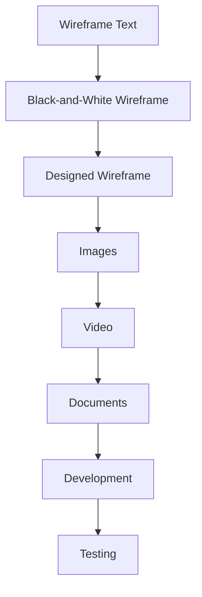

# Pathway Wireframe

## RIAH Pathway

**One Dynasty, Infinite Legacies**

> Placeholder for the approved **Pathway** Website Page wireframe.

## Wireframe Development Flow

## Status

| Item | Status |
|---|---|
| Page | 03-Pathway |
| Wireframe | Placeholder |
| Public Development | Ready for approved content |
| Final Approval | RIAH review required |
