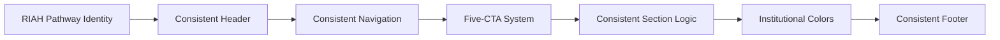
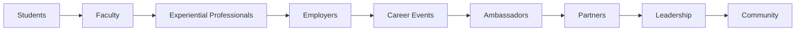
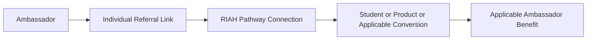
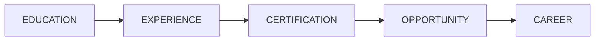
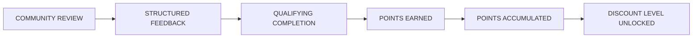
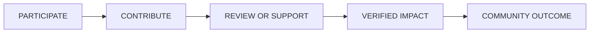

**Contributor; Mariah Dominique Rucker**

There is currently no team. I am building everything myself until I have hired the beta team. I am starting the hiring process this month, **October 2026**, for the CTO, CISO, experiential professionals, PhD-qualified faculty, and adjunct faculty for each school and major, with hiring continuing across the entire ecosystem as it scales.

Beta team members will be hired with **equity participation and compensation during the beta cohort**, which launches in **Spring 2027**.

The website will launch in **October 2026** as I continue to build, develop, revise, and finalize aspects of the RIAH Pathway ecosystem.

Learn more about me on GitHub and LinkedIn, or connect with me through social media and Linktree.

- **GitHub:** https://github.com/mariahdominiquerucker
- **LinkedIn:** https://linkedin.com/in/mariahrucker
- **Facebook:** https://facebook.com/heymariahrucker
- **Instagram:** https://instagram.com/heymariahrucker
- **Linktree:** https://linktr.ee/mariahrucker

---

# 👑 RIAH PATHWAY — 09 JOIN US
## WEBSITE WIREFRAME

---

# WIREFRAME BUILD KEY

- **VIDEO PLACEHOLDER** — One principal video, normally within or adjacent to the hero
- **IMAGE PLACEHOLDER** — Purposeful website imagery only
- **ICON PLACEHOLDER** — Professional website icon; no emoji as final icon
- **CARD** — Content, audience, school, role, event, or navigation card
- **BUTTON** — One of the approved five CTA families
- **INTERNAL LINK** — Exact numbered RIAH Pathway page or subpage
- **EXTERNAL LINK** — Public-facing third-party platform
- **DOWNLOAD** — Standalone file only when genuinely necessary
- **ANCHOR** — Same-page destination

---

# BRAND SYSTEM

- **Institutional Colors:** Black • Red • Gold • White • Silver
- **Institutional Symbol:** Crown
- **Institutional Mascot:** Goat
- **Institutional Slogan:** **ONE DYNASTY. INFINITE LEGACIES.**
- **Primary Visual Style:** Professional • Student-Centered • Accessible • Structured • Modern • Human-Centered • Institutionally Consistent
- **Icon Rule:** Professional website icons in production; emojis are not final website icons

---

# DOWNLOAD RULE

Keep downloads to an absolute minimum.

The **09 Join Us** overview primarily routes visitors to:

**09.1 Student Life**  
**09.2 Careers**  
**09.3 Join Our Team**  
**10 Resources**

Detailed guides remain on their owning page or within **10 Resources**.

**No dedicated Join Us Overview download is required.**

---

# FINAL VISUAL RULE

The Join Us page must remain part of the same RIAH Pathway institutional website architecture used across the approved Home, Tuition, Admissions, Products, and other Website Final wireframes.

---

# HEADER — GLOBAL

**LOGO PLACEHOLDER — RIAH PATHWAY**

### ONE DYNASTY. INFINITE LEGACIES.

**INTERNAL LINK — 01 HOME**  
**INTERNAL LINK — 02 ABOUT**  
**INTERNAL LINK — 03 PATHWAY**  
**INTERNAL LINK — 04 ADMISSIONS**  
**INTERNAL LINK — 05 TUITION**  
**INTERNAL LINK — 06 DONATIONS**  
**INTERNAL LINK — 07 PRODUCTS**  
**INTERNAL LINK — 08 ACCREDITATION & AUTHORIZATION**  
**INTERNAL LINK — 09 JOIN US — ACTIVE**  
**INTERNAL LINK — 10 RESOURCES**  
**INTERNAL LINK — 11 FAQ**  
**INTERNAL LINK — 12 CONTACT**

### Join Us Navigation

**Overview • 09.1 Student Life • 09.2 Careers • 09.3 Join Our Team**

**BUTTON — APPLY NOW → EXTERNAL CLASSE365 — ENDPOINT TO ATTACH**

---

# SECTION 01 — JOIN US

**SECTION BACKGROUND — WHITE, BLACK, RED, GOLD ACCENTS**

## FIND YOUR PLACE
## IN THE DYNASTY.

**Students • Alumni • Faculty • Professionals • Executives • Employers • Partners • Ambassadors • Community**

RIAH Pathway brings together the people who **learn, lead, teach, mentor, supervise, build, employ, partner, serve, and create opportunity** throughout the RIAH Pathway ecosystem.

### ONE DYNASTY. INFINITE LEGACIES.

**BUTTON — LEARN MORE: STUDENT LIFE → 09.1 STUDENT LIFE**

**BUTTON — LEARN MORE: CAREERS → 09.2 CAREERS**

**BUTTON — LEARN MORE: JOIN OUR TEAM → 09.3 JOIN OUR TEAM**

### VIDEO PLACEHOLDER — JOIN US HERO VIDEO

**Purpose:**  
Introduce RIAH Pathway as a connected community for students, alumni, educators, faculty, professionals, employers, partners, ambassadors, and future team members.

**Visual Direction:**  

**Content:**  
Student life • Career development • Faculty • Experiential learning • Partnerships • Ambassadors • Team opportunities

**Controls:**  
Play • Pause • Captions • Full Screen

**Poster Image:**  
**IMAGE PLACEHOLDER — JOIN US COMMUNITY VIDEO POSTER**

---

# SECTION 02 — THREE WAYS TO JOIN

**SECTION LAYOUT — THREE LARGE AUDIENCE CARDS**

## ONE DYNASTY.
## DIFFERENT PATHS.

### Student Life

- **Audience:** Current + Prospective Students
- **Purpose:** **Belong • Participate • Lead**
- **Preview:** Organizations • Leadership • Greek Life • Honor Societies • Ambassadors • Recognition • Community
- **Destination:** **09.1 Student Life**

### Careers

- **Audience:** Students + Alumni
- **Purpose:** **Prepare • Connect • Advance**
- **Preview:** Career Services • Employment • Career Fairs • Workshops • Employers • Alumni
- **Destination:** **09.2 Careers**

### Join Our Team

- **Audience:** Faculty + Professionals + Leadership + Partners + Ambassadors
- **Purpose:** **Teach • Build • Lead • Partner**
- **Preview:** Faculty • Executives • Experiential • Backend • Professional Pillars • Partnerships • Ambassadors
- **Destination:** **09.3 Join Our Team**

**IMAGE PLACEHOLDER — STUDENT LIFE — STUDENT COMMUNITY**

**IMAGE PLACEHOLDER — CAREERS — STUDENTS + ALUMNI + EMPLOYERS**

**IMAGE PLACEHOLDER — JOIN OUR TEAM — FACULTY + PROFESSIONALS**

**BUTTON — LEARN MORE: STUDENT LIFE → 09.1 STUDENT LIFE**

**BUTTON — LEARN MORE: CAREERS → 09.2 CAREERS**

**BUTTON — LEARN MORE: JOIN OUR TEAM → 09.3 JOIN OUR TEAM**

---

# SECTION 03 — STUDENT LIFE

**SECTION LAYOUT — IMAGE + ICON GRID**

**09.1 STUDENT LIFE**

## STUDENTS BUILD
## DYNASTIES TOO.

Student life extends beyond coursework through institutional community, leadership, professional organizations, recognition, service, and involvement.

### Student Government Association
Student governance, representation, ambassadors, and institutional student involvement.

### Student Leadership Council
Leaders from student organizations and student activities.

### School Organizations
Professional and academic organizations connected to the student's school and discipline.

### Honor Societies
Academic and discipline-based recognition.

### Greek Life
Supported Greek organizations and applicable graduate-chapter participation pathways.

### Student Ambassadors
Students representing RIAH Pathway, its schools, pathways, community, and opportunities.

### Community + Service
Leadership • Community Service • Peer Mentorship • Career Development • Community Engagement

### Recognition
Milestones • Institutional Recognition • Credly Badges • Merit Pages

**IMAGE PLACEHOLDER — STUDENT LIFE COMMUNITY**

- **Type:** Student
- **Visual:** Students participating in organizations, leadership, community, and institutional activities
- **Purpose:** Humanize the online student experience and show student connection
- **Alt Text:** RIAH Pathway students participating in student life and leadership activities

**ICON PLACEHOLDERS — GOVERNANCE • LEADERSHIP • ORGANIZATIONS • HONORS • GREEK LIFE • AMBASSADORS • SERVICE • RECOGNITION**

**BUTTON — LEARN MORE: STUDENT LIFE → 09.1 STUDENT LIFE**

---

# SECTION 04 — CAREERS

**SECTION LAYOUT — CAREER IMAGE + CAREER SERVICE CARDS**

**09.2 CAREERS**

## FROM EDUCATION
## TO CAREER.

Career support connects students and alumni with preparation, employers, recruiting, professional development, experiential opportunities, and employment.

### Career Services — Symplicity CSM
Career Advising • Career Planning • Résumé Development • Interview Preparation • Mock Interviews • Career Resources • Professional Development

### Academic Advising — Classe365
Academic advising connected to the student academic ecosystem.

### Employment — Handshake
Internal RIAH Pathway opportunities + external employer opportunities.

### Jobs & Opportunities Newsletter
Weekly.

### Career Fairs
Fall + Spring.

### Tailored Career Fairs
School-specific + industry-specific recruiting.

### Meet the Accountants Night
Fall + Spring.

### Career Workshops
2× per semester.

### Career Webinars
2× per semester.

### RIAH Pathway Conference
Annual.

### RIAH Pathway Podcast
Weekly.

**IMAGE PLACEHOLDER — CAREER FAIR — STUDENTS + ALUMNI + EMPLOYERS**

- **Type:** Career
- **Visual:** Students and alumni networking with employers in virtual and applicable in-person environments
- **Purpose:** Represent career connection and professional opportunity
- **Alt Text:** RIAH Pathway students and alumni connecting with employers

**EXTERNAL LINK — SYMPLICITY CSM → CAREER SERVICES — ENDPOINT TO ATTACH**

**EXTERNAL LINK — HANDSHAKE → CAREER OPPORTUNITIES — ENDPOINT TO ATTACH**

**BUTTON — LEARN MORE: CAREERS → 09.2 CAREERS**

---

# SECTION 05 — CAREER CONNECTIONS BY SCHOOL

**SECTION LAYOUT — FOUR SCHOOL CARDS**

## YOUR SCHOOL.
## YOUR INDUSTRY.
## YOUR OPPORTUNITY.

### School of Business
- **Disciplines:** Accounting • Finance • Business Management • Entrepreneurship
- **Career and Employer Connections:** Accounting Firms • CPA Firms • Financial Institutions • Business Employers • Wall Street Firms • Professional Services Firms

### School of Technology
- **Disciplines:** Computer Science • Software Development • Software Engineering • Data Science • Data Analytics • Information Systems • Project Management • Program Management
- **Career and Employer Connections:** Technology Companies • Software Companies • Data Employers • Technology Employers • Major Technology Firms

### School of Homeland Security
- **Disciplines:** Cybersecurity • Governance, Risk & Compliance
- **Career and Employer Connections:** Cybersecurity Employers • Federal Employers • Government Agencies • National Security Organizations

### School of Law
- **Disciplines:** Criminal Justice • Legal Pathways • J.D. • Non-J.D. State Bar License
- **Career and Employer Connections:** Law Firms • Courts • Government Legal Employers • Criminal Justice Employers • Judicial Opportunities

### FALL + SPRING TAILORED CAREER FAIRS

**ICON PLACEHOLDERS — BUSINESS • TECHNOLOGY • SECURITY • LAW**

**BUTTON — LEARN MORE: CAREER EVENTS → 09.2 CAREERS**

---

# SECTION 06 — JOIN OUR TEAM

**SECTION LAYOUT — LARGE TEAM IMAGE + AT-SCALE STATISTIC**

**09.3 JOIN OUR TEAM**

## BUILD THE PATHWAY
## WITH US.

RIAH Pathway's consolidated ecosystem is designed to scale across leadership, education, experiential learning, technology, operations, professional services, partnerships, and community outreach.

### AT-SCALE ECOSYSTEM

## 194 PEOPLE

**Leadership • Governance • Faculty • Experiential • Technology • Operations • Professional Pillars • Ambassadors • Partners**

**IMAGE PLACEHOLDER — RIAH PATHWAY TEAM AT SCALE**

- **Type:** Institutional
- **Visual:** Faculty, leadership, professionals, experiential team members, technology staff, ambassadors, and partners
- **Purpose:** Show the range of people who build and operate the ecosystem
- **Alt Text:** RIAH Pathway team members across leadership, education, technology, operations, and partnerships

**BUTTON — LEARN MORE: JOIN OUR TEAM → 09.3 JOIN OUR TEAM**

**EXTERNAL LINK — BREEZY HR → CAREER APPLICATIONS — ENDPOINT TO ATTACH**

---

# SECTION 07 — LEADERSHIP + GOVERNANCE

**SECTION LAYOUT — EXECUTIVE IMAGE + ROLE CARDS**

## LEAD. GOVERN. BUILD.

RIAH Pathway leadership provides institutional, academic, technological, financial, legal, operational, cybersecurity, compliance, and strategic oversight.

### Founder — CEO
Institutional vision • Strategy • Ecosystem leadership

### Executive Leadership
C-Suite and senior leadership functions supporting institutional operations and growth

### Technology Leadership
Technology architecture • Systems • AI • Automation • Development • Infrastructure

### Cybersecurity Leadership
Cybersecurity • Network Security • Access • Monitoring • Incident Response • Infrastructure Protection

### Financial Leadership
Financial administration • Tuition • Funding • Pricing • Financial controls

### Legal + Compliance Leadership
Legal • Compliance • Regulatory • Institutional governance support

### Board + Governance
Oversight • Accountability • Governance • Institutional controls

**IMAGE PLACEHOLDER — EXECUTIVE LEADERSHIP**

**BUTTON — LEARN MORE: LEADERSHIP OPPORTUNITIES → 09.3 JOIN OUR TEAM**

---

# SECTION 08 — FACULTY ECOSYSTEM

**SECTION LAYOUT — FACULTY IMAGE + ROLE CARDS**

## TEACH. GUIDE. REVIEW.
## DEVELOP.

RIAH Pathway uses multiple faculty and professional instructional roles rather than a single faculty model.

### Academic Faculty
Academic instruction and applicable curriculum support across RIAH Pathway schools and academic disciplines.

### Credential + Certification-Review Faculty
Professional certification and credential-review instruction and preparation.

### Bar-Review Faculty
Applicable bar-review instruction and preparation.

### Experiential Faculty
Professional oversight of students completing applied experiential pathways.

### Supervisors
Applicable professional supervision.

### Managers
Student work • Development • Performance • Progression

### Reviewers
Student work • Documentation • Competencies • Outcomes

### Professional Mentors + Subject-Matter Professionals
Applicable professional and discipline-specific support.

**IMAGE PLACEHOLDER — VIRTUAL FACULTY + STUDENT INSTRUCTION**

**BUTTON — LEARN MORE: FACULTY OPPORTUNITIES → 09.3 JOIN OUR TEAM**

---

# SECTION 09 — EXPERIENTIAL PROFESSIONALS

**SECTION LAYOUT — PROFESSIONAL + STUDENT IMAGE • SCHOOL CONTENT • LEVEL CONTENT**

## EXPERIENCE IS
## PART OF THE PATHWAY.

The School of Applied Experiential Learning connects students to experiential opportunities based on their academic school, major, applicable discipline, and experience level.

### Experiential Areas

#### School of Business
Accounting • Finance • Business Management • Entrepreneurship

#### School of Technology
Computer Science • Software Development • Software Engineering • Data Science • Data Analytics • Information Systems • Project Management • Program Management

#### School of Homeland Security
Cybersecurity • Governance, Risk & Compliance

#### School of Law
Criminal Justice • Applicable Legal and Professional Areas

### Experiential Levels

- **one month:** Apprentice
- **three months:** Intern
- **1 Year:** Associate • Senior Associate • Manager • Executive

### Professional Team

**Supervisors • Managers • Reviewers • Mentors • Professional Partners**

**IMAGE PLACEHOLDER — APPLIED EXPERIENTIAL LEARNING**

**BUTTON — LEARN MORE: EXPERIENTIAL PATHWAY → 03.5 EXPERIENTIAL PATHWAY**

**BUTTON — LEARN MORE: EXPERIENTIAL TEAM OPPORTUNITIES → 09.3 JOIN OUR TEAM**

---

# SECTION 10 — BACKEND + CORE TEAM

**SECTION LAYOUT — OPERATIONS IMAGE + ROLE GRID**

## THE TEAM BEHIND
## THE EXPERIENCE.

The public-facing institution is supported by a backend team responsible for building, operating, protecting, automating, and scaling the ecosystem.

### Technology
Development • Architecture • Applications • Integrations • AI • Automation • Systems

### Cybersecurity
Security • Network Security • Monitoring • Access • Risk • Infrastructure Protection

### Operations
Workflow • Student Operations • Program Operations • Process Management • Scalability

### Finance
Financial Administration • Tuition • Funding • Pricing • Reporting • Controls

### Legal + Compliance
Legal Operations • Compliance • Regulatory Support • Governance

### Marketing + Communications
Content • Social Media • Advertising • Communications • Digital Marketing

### Admissions + Student Operations
Admissions • Onboarding • Student Support • Workflow Coordination

### Recruitment + Customer Service
Recruitment • Candidate Support • Customer and Student Service • Ambassador Support

### Products + Publishing
Physical Products • Publishing • Enterprise Products • Educational Resources

### Events + Community
Events • Partnerships • Community Outreach • Experiential Support

**IMAGE PLACEHOLDER — BACKEND + CORE OPERATIONS TEAM**

**BUTTON — LEARN MORE: TEAM OPPORTUNITIES → 09.3 JOIN OUR TEAM**

---

# SECTION 11 — DEVELOPMENT PILLAR
## RIAH APP + ECOSYSTEM SOFTWARE

**SECTION LAYOUT — APP CONCEPT IMAGE + DEVELOPMENT ROLE CARDS**

## BUILD THE TECHNOLOGY
## THAT CONNECTS THE DYNASTY.

RIAH Pathway is building an internal development capability, supported by external development resources, to create a connected app and ecosystem-software layer.

### Conceptual Ecosystem

**Home Dashboard • My Journey • Learning • Certification • Opportunities • Messages • Products • Community**

### CTO
Technology leadership and architecture.

### Full-Cycle Architect
Architecture across frontend, backend, integrations, data, and infrastructure.

### Full-Cycle Builder
Development and implementation across the ecosystem.

### External Development Firm
External development capacity supporting the internal team.

### Cybersecurity + GRC
Security • Governance • Risk • Compliance • Access • Infrastructure controls

**IMAGE PLACEHOLDER — RIAH APP — MOBILE + DESKTOP CONCEPT**

- **Type:** Technology
- **Visual:** Conceptual RIAH Pathway mobile and desktop ecosystem interface
- **Purpose:** Preview the connected technology experience
- **Alt Text:** Conceptual RIAH Pathway app and ecosystem software shown on mobile and desktop devices

**Concept Label:** App visuals represent conceptual design direction and not final production screens.

**BUTTON — LEARN MORE: DEVELOPMENT OPPORTUNITIES → 09.3 JOIN OUR TEAM → DEVELOPMENT PILLAR**

**EXTERNAL LINK — BREEZY HR → CAREER APPLICATIONS — ENDPOINT TO ATTACH**

---

# SECTION 12 — EXTERNAL PROFESSIONAL PILLARS

**SECTION LAYOUT — PARTNER IMAGE + PARTNERSHIP CARDS**

## BUILT INTERNALLY.
## STRENGTHENED THROUGH PARTNERSHIP.

RIAH Pathway's ecosystem includes external professional pillars that extend specialized capability while remaining connected to the institution.

### Professional Services
Accounting • Legal • Technology • Cybersecurity • Marketing • Publishing • Healthcare • Events • Other applicable professional services

### Employers
Career • Recruiting • Employment • Professional opportunities

### Experiential Partners
Experiential opportunities • Supervision • Professional exposure • Applied learning

### Education Partners
High Schools • Colleges • Universities • Community Colleges • Educational Organizations

### Legal + Judicial Relationships
Law Firms • Courts • Legal Professionals • Applicable legal organizations

### Community Partners
Community Organizations • Nonprofits • Professional Organizations • Local Partners

### Substitute Teacher Agency Partnerships
Partnership opportunities and applicable partner benefits

**IMAGE PLACEHOLDER — PROFESSIONAL PARTNERSHIPS**

**BUTTON — LEARN MORE: PARTNERSHIPS → 09.3 JOIN OUR TEAM**

---

# SECTION 13 — AMBASSADOR NETWORK

**SECTION LAYOUT — AMBASSADOR IMAGE + CATEGORY CARDS**

## REPRESENT THE PATHWAY.
## CONNECT THE COMMUNITY.

RIAH Pathway uses multiple ambassador pathways to connect prospective students, communities, schools, professionals, and customers with the ecosystem.

### Mobile Ambassadors — Rideshare + Delivery
Rideshare drivers and food-delivery professionals can serve as mobile ambassadors through applicable RIAH Pathway marketing and referral activities.

### Substitute Teacher Ambassadors
Substitute teachers can represent RIAH Pathway through applicable school, community, vehicle, career-fair, and referral activities.

### Community Ambassadors
Connect RIAH Pathway with prospective students, families, organizations, and communities.

### High School Student Ambassadors
Represent RIAH Pathway within applicable student and community networks.

### College Student Ambassadors
Represent RIAH Pathway across applicable college and community networks.

### Shared Ambassadors
Participate across multiple ambassador functions where appropriate.

### Mobile Ambassador Promotional Formats

**Vehicle Marketing • QR Codes • Digital Displays • Promotional Materials • Referral Links**

### Ambassador Structure

**IMAGE PLACEHOLDER — AMBASSADOR NETWORK — RIDESHARE + DELIVERY + STUDENT + COMMUNITY**

**BUTTON — LEARN MORE: AMBASSADOR OPPORTUNITIES → 09.3 JOIN OUR TEAM**

---

# SECTION 14 — PARTNERSHIP ECOSYSTEM

**SECTION LAYOUT — NETWORK VISUAL + PARTNERSHIP CONTENT**

## PARTNERS MAKE
## THE PATHWAY STRONGER.

### Employers
Career opportunities • Recruiting • Career fairs • Industry connections

### Professional Firms
Professional services • Expertise • Professional pathways

### Experiential Organizations
Experiential opportunities • Supervision • Applied learning

### Law Firms + Courts
Legal opportunities • Professional exposure • Applicable legal pathways

### High Schools
Student pathways • Awareness • Educational relationships

### Colleges + Universities + Community Colleges
Transfer and pathway relationships • Student opportunities • Institutional relationships

### Substitute Teacher Agencies
Ambassador partnerships • Referral opportunities • Applicable partner benefits

### Community Organizations
Outreach • Events • Student connections • Community engagement

**IMAGE PLACEHOLDER — RIAH PATHWAY PARTNERSHIP NETWORK**

**BUTTON — GET STARTED: PARTNER WITH RIAH PATHWAY → 12 CONTACT → RIAH PATHWAY DROP FORM — FORM ENDPOINT TO ATTACH**

---

# SECTION 15 — EMPLOYERS + CAREER PARTNERS

**SECTION LAYOUT — EMPLOYER NETWORKING IMAGE + OPPORTUNITY CONTENT**

## CONNECT WITH
## RIAH PATHWAY TALENT.

Employers and professional organizations connect with RIAH Pathway students and alumni through the career ecosystem.

### Handshake Recruiting
Internal + External Opportunities

### Career Fairs
Fall + Spring

### Tailored Career Fairs
School + Industry Based

### Meet the Accountants Night
Fall + Spring

### Career Workshops
2× Per Semester

### Career Webinars
2× Per Semester

### Annual Conference
RIAH Pathway professional and community connection

### Weekly Podcast
Industry • Career • Employer • Student • Alumni conversations

### Weekly Jobs & Opportunities Newsletter
Jobs • Opportunities • Employers • Career Events

**IMAGE PLACEHOLDER — EMPLOYER + STUDENT CAREER CONNECTION**

**EXTERNAL LINK — HANDSHAKE → CAREER OPPORTUNITIES — ENDPOINT TO ATTACH**

**BUTTON — LEARN MORE: CAREERS → 09.2 CAREERS**

---

# SECTION 16 — SIX SCHOOLS. ONE ECOSYSTEM.

**SECTION LAYOUT — SIX SCHOOL BANNER CARDS**

## ONE INSTITUTIONAL CROWN.
## SIX SCHOOLS.
## ONE DYNASTY.

### School of Business
- **Color:** Black
- **Identity:** Progress
- **Join Us Connection:** Students • Faculty • Experiential • Employers • Partners

### School of Technology
- **Color:** Red
- **Identity:** Innovation
- **Join Us Connection:** Students • Faculty • Developers • Technology Employers • Partners

### School of Homeland Security
- **Color:** Gold
- **Identity:** Resilience
- **Join Us Connection:** Students • Faculty • Cybersecurity Professionals • Agencies • Partners

### School of Law
- **Color:** White
- **Identity:** Justice
- **Join Us Connection:** Students • Faculty • Legal Professionals • Law Firms • Courts

### School of Postsecondary Education
- **Color:** Silver
- **Identity:** Advancement
- **Join Us Connection:** Students • Educators • Ambassadors • Education Partners

### School of Applied Experiential Learning
- **Color:** Institutional Multi-Color
- **Identity:** Experience
- **Join Us Connection:** Students • Supervisors • Managers • Reviewers • Experiential Partners

**ICON PLACEHOLDERS — SIX SCHOOL IDENTITIES**

**BUTTON — LEARN MORE: PATHWAYS → 03 PATHWAY**

---

# SECTION 17 — RECOGNITION + MILESTONES

**SECTION LAYOUT — RECOGNITION IMAGE + TWO PLATFORM CARDS**

## YOUR PROGRESS.
## YOUR ACHIEVEMENTS.

### Credly
Certification Badges • Internal Certificate Badges • Milestone Badges • Review-Course Completion • Bar-Review Completion

### Merit Pages
Institutional Recognition • Student Achievement • Graduation and Completion Recognition • Institutional Milestones

Student involvement, leadership, professional development, career development, community service, experiential achievement, and other applicable activities can contribute to the broader student milestone structure.

**IMAGE PLACEHOLDER — DIGITAL CREDENTIAL + STUDENT RECOGNITION**

**EXTERNAL LINK — CREDLY → DIGITAL CREDENTIALS — ENDPOINT TO ATTACH**

**EXTERNAL LINK — MERIT PAGES → INSTITUTIONAL RECOGNITION — ENDPOINT TO ATTACH**

**BUTTON — LEARN MORE: STUDENT LIFE → 09.1 STUDENT LIFE**

---

# SECTION 18 — THE RIAH PATHWAY

**SECTION LAYOUT — HORIZONTAL FIVE-STAGE ICON FLOW**

## THE RIAH PATHWAY

### Education
Academic pathways and learning.

### Experience
Applied experiential pathways and professional development.

### Certification
Certification review • Internal certificates • Milestones • Applicable professional credentials

### Opportunity
Employers • Partners • Career Fairs • Ambassadors • Professional Connections

### Career
Internal + External Employment • Alumni Career Support • Professional Advancement

**ICON — GRADUATION CAP — EDUCATION**  
**ICON — BRIEFCASE — EXPERIENCE**  
**ICON — CERTIFICATE — CERTIFICATION**  
**ICON — DOOR — OPPORTUNITY**  
**ICON — CAREER — PROFESSIONAL ADVANCEMENT**

**BUTTON — LEARN MORE: PATHWAYS → 03 PATHWAY**

---

# SECTION 19 — THREE AUDIENCES. ONE DYNASTY.

**SECTION LAYOUT — THREE LARGE IMAGE PANELS**

### Students

**Message:** **Learn • Belong • Participate • Lead**

**Opportunities:** Organizations • Leadership • Greek Life • Honor Societies • Ambassadors • Recognition • Community

**Destination:** **09.1 Student Life**

### Students + Alumni

**Message:** **Prepare • Connect • Advance**

**Opportunities:** Career Services • Jobs • Employers • Career Fairs • Professional Development • Alumni Opportunities

**Destination:** **09.2 Careers**

### Professionals + Partners

**Message:** **Teach • Build • Lead • Employ • Partner • Represent**

**Opportunities:** Faculty • Executives • Experiential Professionals • Backend Team • Professional Pillars • Employers • Partnerships • Ambassadors

**Destination:** **09.3 Join Our Team**

**IMAGE PLACEHOLDER — STUDENTS**

**IMAGE PLACEHOLDER — STUDENTS + ALUMNI**

**IMAGE PLACEHOLDER — PROFESSIONALS + PARTNERS**

**BUTTON — LEARN MORE: STUDENT LIFE → 09.1 STUDENT LIFE**

**BUTTON — LEARN MORE: CAREERS → 09.2 CAREERS**

**BUTTON — LEARN MORE: JOIN OUR TEAM → 09.3 JOIN OUR TEAM**

---

# SECTION 20 — QUICK ROUTING

**SECTION LAYOUT — FIVE NAVIGATION CARDS**

## FIND WHAT
## YOU'RE LOOKING FOR.

### Student Life
- **Includes:** Student organizations • Leadership • Recognition • Greek Life • Ambassadors • Community
- **Route:** **09.1 Student Life**

### Careers
- **Includes:** Career services • Employment • Employers • Fairs • Professional development • Alumni
- **Route:** **09.2 Careers**

### Join Our Team
- **Includes:** Faculty • Experiential professionals • Executives • Backend team • Partnerships • Ambassadors
- **Route:** **09.3 Join Our Team**

### Pathways
- **Includes:** Academic • Experiential • Certification • Education pathways
- **Route:** **03 Pathway**

### Resources
- **Includes:** Institutional resources • Events • Workshops • Webinars • News • Supporting materials
- **Route:** **10 Resources**

**INTERNAL LINK — 09.1 STUDENT LIFE**  
**INTERNAL LINK — 09.2 CAREERS**  
**INTERNAL LINK — 09.3 JOIN OUR TEAM**  
**INTERNAL LINK — 03 PATHWAY**  
**INTERNAL LINK — 10 RESOURCES**

---

# SECTION 21 — FINAL CTA

**SECTION BACKGROUND — INSTITUTIONAL BRAND BAND**

**IMAGE PLACEHOLDER — STUDENTS + ALUMNI + FACULTY + PROFESSIONALS + AMBASSADORS**

## THERE'S MORE THAN
## ONE WAY TO JOIN.

**Learn here.**

**Build your career here.**

**Teach here.**

**Lead here.**

**Partner here.**

**Employ talent here.**

**Represent the Pathway here.**

### ONE DYNASTY. INFINITE LEGACIES.

**BUTTON — LEARN MORE: STUDENT LIFE → 09.1 STUDENT LIFE**

**BUTTON — LEARN MORE: CAREERS → 09.2 CAREERS**

**BUTTON — LEARN MORE: JOIN OUR TEAM → 09.3 JOIN OUR TEAM**

**BUTTON — GET STARTED: CONTACT RIAH PATHWAY → 12 CONTACT**

---

## COMMUNITY CAPSTONE + PEER REVIEW POINTS AND DISCOUNTS

Community members may sign up to review applicable student capstones, participate in applicable peer review, and provide structured feedback on student work. Qualifying completed reviews earn points that accumulate according to the number of capstone and peer-review activities completed.

| Community Participation | RIAH Structure |
|---|---|
| Capstone Review | Review applicable student capstones and provide structured feedback |
| Peer Review | Participate in applicable peer-review activities |
| Points | Earn points for qualifying completed capstone and peer reviews |
| Accumulation | Points accumulate based on qualifying review participation |
| Product Discounts | Accumulated points may unlock applicable discounts on qualifying RIAH products |
| Certification Review | Applicable discounts may be used toward qualifying Certification Review products |
| Bar Review | Applicable discounts may be used toward qualifying Bar Review products |
| Educational Pathways | Applicable discounts may be used toward qualifying RIAH educational pathways, including the JD pathway and other applicable education pathways |

RIAH faculty and applicable academic personnel retain academic oversight and final evaluation requirements. Community and peer feedback supplements the formal academic review process.

# FOOTER — GLOBAL

**LOGO PLACEHOLDER — RIAH PATHWAY**

## RIAH PATHWAY

### ONE DYNASTY. INFINITE LEGACIES.

### Explore

**01 Home • 02 About • 03 Pathway • 04 Admissions • 05 Tuition • 06 Donations • 07 Products • 08 Accreditation & Authorization • 09 Join Us • 10 Resources • 11 FAQ • 12 Contact**

### Join Us

**09 Overview • 09.1 Student Life • 09.2 Careers • 09.3 Join Our Team**

### Students

**Student Life • Careers • Admissions • Pathways • Resources**

### Platforms

**Classe365 • Symplicity CSM • Handshake • Credly • Merit Pages**

### Connect

**SOCIAL MEDIA ICON LINKS — APPROVED RIAH PATHWAY CHANNELS**

**INTERNAL LINK — 12 CONTACT**

**EXTERNAL LINK — RIAH PATHWAY DROP FORM → FORM ENDPOINT TO ATTACH**

### Legal

**EXTERNAL LINK — PRIVACY POLICY → SUITEDASH PUBLIC PAGE PLACEHOLDER**

**EXTERNAL LINK — TERMS OF USE → SUITEDASH PUBLIC PAGE PLACEHOLDER**

**EXTERNAL LINK — ACCESSIBILITY → SUITEDASH PUBLIC PAGE PLACEHOLDER**

**© 2026 RIAH Pathway**

---

# 🔗 BUTTON, LINK & DOWNLOAD ROUTING CHART

## 01
- **Type:** Button
- **Visible Label:** Apply Now
- **Destination:** Classe365 and 04.3 Application
- **Destination Type:** External
- **Placement:** Header

## 02
- **Type:** Button
- **Visible Label:** Learn More: Student Life
- **Destination:** 09.1 Student Life
- **Destination Type:** Internal
- **Placement:** Hero

## 03
- **Type:** Button
- **Visible Label:** Learn More: Careers
- **Destination:** 09.2 Careers
- **Destination Type:** Internal
- **Placement:** Hero

## 04
- **Type:** Button
- **Visible Label:** Learn More: Join Our Team
- **Destination:** 09.3 Join Our Team
- **Destination Type:** Internal
- **Placement:** Hero

## 05
- **Type:** Button
- **Visible Label:** Learn More: Student Life
- **Destination:** 09.1 Student Life
- **Destination Type:** Internal
- **Placement:** Section 02

## 06
- **Type:** Button
- **Visible Label:** Learn More: Careers
- **Destination:** 09.2 Careers
- **Destination Type:** Internal
- **Placement:** Section 02

## 07
- **Type:** Button
- **Visible Label:** Learn More: Join Our Team
- **Destination:** 09.3 Join Our Team
- **Destination Type:** Internal
- **Placement:** Section 02

## 08
- **Type:** Button
- **Visible Label:** Learn More: Student Life
- **Destination:** 09.1 Student Life
- **Destination Type:** Internal
- **Placement:** Section 03

## 09
- **Type:** External Link
- **Visible Label:** Symplicity CSM
- **Destination:** Career Services
- **Destination Type:** External — Endpoint to Attach
- **Placement:** Section 04

## 10
- **Type:** External Link
- **Visible Label:** Handshake
- **Destination:** Career Opportunities
- **Destination Type:** External — Endpoint to Attach
- **Placement:** Section 04

## 11
- **Type:** Button
- **Visible Label:** Learn More: Careers
- **Destination:** 09.2 Careers
- **Destination Type:** Internal
- **Placement:** Section 04

## 12
- **Type:** Button
- **Visible Label:** Learn More: Career Events
- **Destination:** 09.2 Careers
- **Destination Type:** Internal
- **Placement:** Section 05

## 13
- **Type:** Button
- **Visible Label:** Learn More: Join Our Team
- **Destination:** 09.3 Join Our Team
- **Destination Type:** Internal
- **Placement:** Section 06

## 14
- **Type:** External Link
- **Visible Label:** Breezy HR
- **Destination:** Career Applications
- **Destination Type:** External — Endpoint to Attach
- **Placement:** Section 06

## 15
- **Type:** Button
- **Visible Label:** Learn More: Leadership Opportunities
- **Destination:** 09.3 Join Our Team
- **Destination Type:** Internal
- **Placement:** Section 07

## 16
- **Type:** Button
- **Visible Label:** Learn More: Faculty Opportunities
- **Destination:** 09.3 Join Our Team
- **Destination Type:** Internal
- **Placement:** Section 08

## 17
- **Type:** Button
- **Visible Label:** Learn More: Experiential Pathway
- **Destination:** 03.5 Experiential Pathway
- **Destination Type:** Internal
- **Placement:** Section 09

## 18
- **Type:** Button
- **Visible Label:** Learn More: Experiential Team Opportunities
- **Destination:** 09.3 Join Our Team
- **Destination Type:** Internal
- **Placement:** Section 09

## 19
- **Type:** Button
- **Visible Label:** Learn More: Team Opportunities
- **Destination:** 09.3 Join Our Team
- **Destination Type:** Internal
- **Placement:** Section 10

## 20
- **Type:** Button
- **Visible Label:** Learn More: Development Opportunities
- **Destination:** 09.3 Join Our Team → Development Pillar
- **Destination Type:** Internal
- **Placement:** Section 11

## 21
- **Type:** External Link
- **Visible Label:** Breezy HR
- **Destination:** Career Applications
- **Destination Type:** External — Endpoint to Attach
- **Placement:** Section 11

## 22
- **Type:** Button
- **Visible Label:** Learn More: Partnerships
- **Destination:** 09.3 Join Our Team
- **Destination Type:** Internal
- **Placement:** Section 12

## 23
- **Type:** Button
- **Visible Label:** Learn More: Ambassador Opportunities
- **Destination:** 09.3 Join Our Team
- **Destination Type:** Internal
- **Placement:** Section 13

## 24
- **Type:** Button
- **Visible Label:** Get Started: Partner with RIAH Pathway
- **Destination:** 12 Contact → RIAH Pathway Drop Form
- **Destination Type:** Internal + Form
- **Placement:** Section 14

## 25
- **Type:** External Link
- **Visible Label:** Handshake
- **Destination:** Career Opportunities
- **Destination Type:** External — Endpoint to Attach
- **Placement:** Section 15

## 26
- **Type:** Button
- **Visible Label:** Learn More: Careers
- **Destination:** 09.2 Careers
- **Destination Type:** Internal
- **Placement:** Section 15

## 27
- **Type:** Button
- **Visible Label:** Learn More: Pathways
- **Destination:** 03 Pathway
- **Destination Type:** Internal
- **Placement:** Section 16

## 28
- **Type:** External Link
- **Visible Label:** Credly
- **Destination:** Digital Credentials
- **Destination Type:** External — Endpoint to Attach
- **Placement:** Section 17

## 29
- **Type:** External Link
- **Visible Label:** Merit Pages
- **Destination:** Institutional Recognition
- **Destination Type:** External — Endpoint to Attach
- **Placement:** Section 17

## 30
- **Type:** Button
- **Visible Label:** Learn More: Student Life
- **Destination:** 09.1 Student Life
- **Destination Type:** Internal
- **Placement:** Section 17

## 31
- **Type:** Button
- **Visible Label:** Learn More: Pathways
- **Destination:** 03 Pathway
- **Destination Type:** Internal
- **Placement:** Section 18

## 32
- **Type:** Button
- **Visible Label:** Learn More: Student Life
- **Destination:** 09.1 Student Life
- **Destination Type:** Internal
- **Placement:** Section 19

## 33
- **Type:** Button
- **Visible Label:** Learn More: Careers
- **Destination:** 09.2 Careers
- **Destination Type:** Internal
- **Placement:** Section 19

## 34
- **Type:** Button
- **Visible Label:** Learn More: Join Our Team
- **Destination:** 09.3 Join Our Team
- **Destination Type:** Internal
- **Placement:** Section 19

## 35
- **Type:** Internal Link
- **Visible Label:** Student Life
- **Destination:** 09.1 Student Life
- **Destination Type:** Internal
- **Placement:** Section 20

## 36
- **Type:** Internal Link
- **Visible Label:** Careers
- **Destination:** 09.2 Careers
- **Destination Type:** Internal
- **Placement:** Section 20

## 37
- **Type:** Internal Link
- **Visible Label:** Join Our Team
- **Destination:** 09.3 Join Our Team
- **Destination Type:** Internal
- **Placement:** Section 20

## 38
- **Type:** Internal Link
- **Visible Label:** Pathways
- **Destination:** 03 Pathway
- **Destination Type:** Internal
- **Placement:** Section 20

## 39
- **Type:** Internal Link
- **Visible Label:** Resources
- **Destination:** 10 Resources
- **Destination Type:** Internal
- **Placement:** Section 20

## 40
- **Type:** Button
- **Visible Label:** Learn More: Student Life
- **Destination:** 09.1 Student Life
- **Destination Type:** Internal
- **Placement:** Section 21

## 41
- **Type:** Button
- **Visible Label:** Learn More: Careers
- **Destination:** 09.2 Careers
- **Destination Type:** Internal
- **Placement:** Section 21

## 42
- **Type:** Button
- **Visible Label:** Learn More: Join Our Team
- **Destination:** 09.3 Join Our Team
- **Destination Type:** Internal
- **Placement:** Section 21

## 43
- **Type:** Button
- **Visible Label:** Get Started: Contact RIAH Pathway
- **Destination:** 12 Contact
- **Destination Type:** Internal
- **Placement:** Section 21

## 44
- **Type:** Internal Link
- **Visible Label:** Contact
- **Destination:** 12 Contact
- **Destination Type:** Internal
- **Placement:** Footer

## 45
- **Type:** External Link
- **Visible Label:** RIAH Pathway Drop Form
- **Destination:** Form Endpoint to Attach
- **Destination Type:** External Form
- **Placement:** Footer

## 46
- **Type:** External Link
- **Visible Label:** Privacy Policy
- **Destination:** SuiteDash Public Page Placeholder
- **Destination Type:** External
- **Placement:** Footer

## 47
- **Type:** External Link
- **Visible Label:** Terms of Use
- **Destination:** SuiteDash Public Page Placeholder
- **Destination Type:** External
- **Placement:** Footer

## 48
- **Type:** External Link
- **Visible Label:** Accessibility
- **Destination:** SuiteDash Public Page Placeholder
- **Destination Type:** External
- **Placement:** Footer

## 49
- **Type:** External Link
- **Visible Label:** Social Media Channels
- **Destination:** Approved RIAH Pathway Social Channels
- **Destination Type:** External
- **Placement:** Footer

---

# 🖼️ MEDIA & ICON ASSET CHART

## 01 — Video — Join Us Hero Video
- **Purpose:** Primary Join Us story
- **Section:** 01

## 02 — Image — Join Us Community Video Poster
- **Purpose:** Hero video poster
- **Section:** 01

## 03 — Image — Student Life Audience
- **Purpose:** Represent student community
- **Section:** 02

## 04 — Image — Careers Audience
- **Purpose:** Represent students, alumni, and employers
- **Section:** 02

## 05 — Image — Join Our Team Audience
- **Purpose:** Represent faculty and professionals
- **Section:** 02

## 06 — Image — Student Life Community
- **Purpose:** Student involvement and leadership
- **Section:** 03

## 07 — Icon Set — Student Life Areas
- **Purpose:** Governance, organizations, honors, Greek life, ambassadors, service, recognition
- **Section:** 03

## 08 — Image — Career Fair and Employer Connection
- **Purpose:** Career ecosystem
- **Section:** 04

## 09 — Icon Set — Four School Career Areas
- **Purpose:** Differentiate school-specific career connections
- **Section:** 05

## 10 — Image — Team at Scale
- **Purpose:** Show ecosystem team breadth
- **Section:** 06

## 11 — Image — Executive Leadership
- **Purpose:** Leadership and governance
- **Section:** 07

## 12 — Image — Faculty + Student Instruction
- **Purpose:** Faculty ecosystem
- **Section:** 08

## 13 — Image — Applied Experiential Learning
- **Purpose:** Professional experiential structure
- **Section:** 09

## 14 — Image — Backend + Core Team
- **Purpose:** Operations and technology
- **Section:** 10

## 15 — Image — RIAH App Concept
- **Purpose:** Development pillar
- **Section:** 11

## 16 — Image — Professional Partnerships
- **Purpose:** External professional pillars
- **Section:** 12

## 17 — Image — Ambassador Network
- **Purpose:** Rideshare, delivery, substitute teacher, student, and community ambassadors
- **Section:** 13

## 18 — Image — Partnership Network
- **Purpose:** Partner ecosystem
- **Section:** 14

## 19 — Image — Employer + Student Career Connection
- **Purpose:** Employers and career partners
- **Section:** 15

## 20 — Icon Set — Six School Identities
- **Purpose:** Six-school ecosystem
- **Section:** 16

## 21 — Image — Digital Credential + Recognition
- **Purpose:** Credly and Merit Pages
- **Section:** 17

## 22 — Icon Set — Education → Career Sequence
- **Purpose:** Five-stage RIAH Pathway
- **Section:** 18

## 23 — Image — Students
- **Purpose:** Student audience
- **Section:** 19

## 24 — Image — Students + Alumni
- **Purpose:** Career audience
- **Section:** 19

## 25 — Image — Professionals + Partners
- **Purpose:** Join Our Team audience
- **Section:** 19

## 26 — Icon Set — Quick Routing
- **Purpose:** Navigation assistance
- **Section:** 20

## 27 — Image — Students + Alumni + Faculty + Professionals + Ambassadors
- **Purpose:** Closing institutional community
- **Section:** 21

---

# 🔘 CTA AUDIT

- **Apply Now:** Yes
- **Learn More:** Yes
- **Get Started:** Yes
- **Log In:** No
- **Shop Now:** No
- **Total CTA Families Used:** 3 of 5

---

# 📥 DOWNLOAD AUDIT

## Join Us Overview Download
- **Status:** Not Created
- **Reason:** Join Us is a routing and overview page; content remains on the website.

## Student Life Materials
- **Status:** Route to 09.1 and 10 Resources
- **Reason:** Detailed resources belong to their owning page.

## Career Services Guide
- **Status:** Route to 10 Resources
- **Reason:** Existing resource architecture controls the downloadable guide.

## Employer + Partner Guide
- **Status:** Route to 10 Resources
- **Reason:** Existing resource architecture controls the downloadable guide.

## Team at Scale Overview PDF
- **Status:** Route to 10 Resources
- **Reason:** Existing resource architecture controls the downloadable file.

**Total New Downloads Created on 09 Join Us: 0**

------------------------------------------------------------------------

<!-- RIAH IMPACT TRANSPARENCY DISTRIBUTION 2026-10-01 -->

# 👑 JOIN THE RIAH IMPACT ECOSYSTEM

| Participation | Role |
|---|---|
| 🏢 **Employers** | Host applicable real-work experiences and provide workplace feedback |
| 👩‍💼 **Industry Professionals** | Review applied work and provide professional feedback |
| 🌎 **Community Reviewers** | Sign up to review applicable student work and provide structured feedback |
| 💼 **Experiential Supervisors** | Support and supervise applicable experiential assignments |
| ⚖️ **Attorneys** | Participate in applicable School of Law public-service, supervision, and professional roles |
| 👩‍⚖️ **Judges** | Participate in appropriate educational or community roles |
| 💰 **Donors** | Support accreditation, scholarships, and applicable designated funds |
| 🤝 **Partners** | Support education, experiential learning, employment, public service, and community impact |

---

# LEGAL AND PROFESSIONAL NETWORK PARTICIPATION

RIAH’s professional network includes licensed attorneys, law firms, legal professionals, faculty, eligible supervising attorneys, and other professionals supporting real-work learning. The School of Law model routes applicable public legal matters to participating attorneys across the 50 states plus D.C. for independent review and possible acceptance. Participating professionals may supervise legally permitted student work, review deliverables, mentor students, and contribute to public-service and experiential initiatives. Judges may participate only in appropriate educational, academic, mentoring, or other roles permitted by judicial-conduct requirements.
