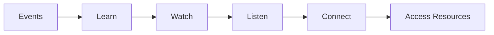
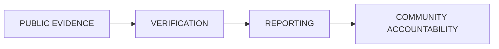
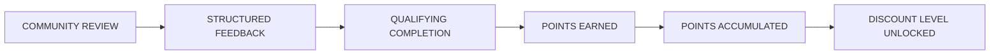
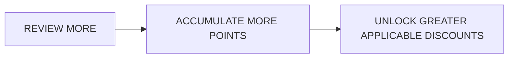

**Contributor; Mariah Dominique Rucker**

There is currently no team. I am building everything myself until I have hired the beta team. I am starting the hiring process this month, **October 2026**, for the CTO, CISO, experiential professionals, PhD-qualified faculty, and adjunct faculty for each school and major, with hiring continuing across the entire ecosystem as it scales.

Beta team members will be hired with **equity participation and compensation during the beta cohort**, which launches in **Spring 2027**.

The website will launch in **October 2026** as I continue to build, develop, revise, and finalize aspects of the RIAH Pathway ecosystem.

Learn more about me on GitHub and LinkedIn, or connect with me through social media and Linktree.

- **GitHub:** https://github.com/mariahdominiquerucker
- **LinkedIn:** https://linkedin.com/in/mariahrucker
- **Facebook:** https://facebook.com/heymariahrucker
- **Instagram:** https://instagram.com/heymariahrucker
- **Linktree:** https://linktr.ee/mariahrucker

---

# 👑 RIAH PATHWAY

# 11 — RESOURCES

**Page Type:** Main Website Page  
**Brand:** RIAH Pathway  
**Institutional Slogan:** **ONE DYNASTY. INFINITE LEGACIES.**

**Institutional Colors:** Black • Red • Gold • White • Silver  
**Institutional Symbol:** Crown  
**Institutional Mascot:** Goat

**Breadcrumb:** Home → Resources

**Page Experience:**  

```mermaid
flowchart LR
N1["HERO"]
N2["RESOURCE OVERVIEW"]
N3["EVENTS"]
N4["BLOG + VLOG"]
N5["PODCASTS"]
N6["CONFERENCES"]
N7["WORKSHOPS"]
N8["WEBINARS"]
N9["POLICIES"]
N10["PROCEDURES"]
N11["GUIDELINES"]
N12["STAY CONNECTED"]
N13["FINAL CTA"]
N1 --> N2
N2 --> N3
N3 --> N4
N4 --> N5
N5 --> N6
N6 --> N7
N7 --> N8
N8 --> N9
N9 --> N10
N10 --> N11
N11 --> N12
N12 --> N13
```

---

# GLOBAL HEADER

[HEADER — GLOBAL]

[LOGO PLACEHOLDER — RIAH PATHWAY]

**ONE DYNASTY. INFINITE LEGACIES.**

## Utility Navigation

Students • Educators • Employers • Partners • Community

[ICON PLACEHOLDER — SEARCH]

## Primary Navigation

**1 — Home**  
**2 — About**  
**3 — Pathway**  
**4 — Curriculum**  
**5 — Admissions**  
**6 — Tuition**  
**7 — Donations**  
**8 — Products**  
**9 — Accreditation & Authorization**  
**10 — Join Us**  
**11 — Resources**  
**12 — FAQ**  
**13 — Contact**

**Active Navigation:** Resources

**[BUTTON — APPLY NOW → EXTERNAL CLASSE365 — ENDPOINT TO ATTACH]**

---

# RESOURCES SUBPAGE NAVIGATION

The Resources landing page introduces the full public resource ecosystem and routes visitors to the approved Resources subpages.

**[INTERNAL LINK — 11.1 — RESOURCES — OVERVIEW]**

**[INTERNAL LINK — 11.2 — RESOURCES — EVENTS]**

**[INTERNAL LINK — 11.3 — RESOURCES — BLOG]**

**[INTERNAL LINK — 11.4 — RESOURCES — PODCASTS]**

**[INTERNAL LINK — 11.5 — RESOURCES — CONFERENCES]**

**[INTERNAL LINK — 11.6 — RESOURCES — WORKSHOPS]**

**[INTERNAL LINK — 11.7 — RESOURCES — WEBINARS]**

**[INTERNAL LINK — 11.8 — RESOURCES — POLICIES]**

**[INTERNAL LINK — 11.9 — RESOURCES — PROCEDURES]**

**[INTERNAL LINK — 11.10 — RESOURCES — GUIDELINES]**

---

# SECTION 1 — HERO

[SECTION BACKGROUND — BLACK — RED ACCENTS — WHITE TEXT]

**Layout:** Split-screen institutional hero.

Left:
- Main headline
- Supporting copy
- Resource categories
- Primary CTAs

Right:
- Hero video
- Video poster image

## RESOURCES THAT KEEP YOU CONNECTED.

Access RIAH Pathway events, admission sessions, career fairs, conferences, webinars, workshops, articles, videos, podcasts, institutional resources, policies, procedures, guidelines, and upcoming opportunities in one centralized resource experience.

RIAH Pathway Resources connects students, applicants, alumni, professionals, employers, partners, and community members to the information and programming they need throughout the pathway.

### Hero Resource Categories

[ICON PLACEHOLDER — CALENDAR — EVENTS]  
**Events**

[ICON PLACEHOLDER — ARTICLE — BLOG]  
**Blog**

[ICON PLACEHOLDER — PLAY — VLOG]  
**Vlog**

[ICON PLACEHOLDER — MICROPHONE — PODCAST]  
**Podcasts**

[ICON PLACEHOLDER — PRESENTATION — CONFERENCE]  
**Conferences**

[ICON PLACEHOLDER — USERS — WORKSHOP]  
**Workshops**

[ICON PLACEHOLDER — MONITOR — WEBINAR]  
**Webinars**

[ICON PLACEHOLDER — DOCUMENT — PUBLIC RESOURCES]  
**Policies • Procedures • Guidelines**

### Hero CTAs

**[BUTTON — LEARN MORE: EXPLORE RESOURCES → 11.1 — RESOURCES — OVERVIEW]**

**[BUTTON — LEARN MORE: VIEW EVENTS → 11.2 — RESOURCES — EVENTS]**

**[BUTTON — LEARN MORE: WATCH RIAH PATHWAY → EXTERNAL YOUTUBE @RIAHPATHWAY]**

---

## HERO VIDEO

**[VIDEO PLACEHOLDER — RIAH PATHWAY RESOURCES OVERVIEW]**

**Purpose:**  
Introduce visitors to the Resources ecosystem and show how RIAH Pathway connects information, events, media, professional development, admissions programming, and public institutional resources.

**Visual Direction:**  
Event calendar, virtual admission session, career fair, conference stage, webinar, workshop, blog articles, YouTube video interface, podcast interface, and public institutional resources.

**Content:**  

**Controls:**  
Play • Pause • Captions • Full Screen

**Poster Image:**  
[IMAGE PLACEHOLDER — RESOURCES HERO VIDEO POSTER]

**Alt Text:** RIAH Pathway resource hub showing events, educational media, professional programming, and public institutional resources.

---

# SECTION 2 — 11.1 OVERVIEW

[SECTION BACKGROUND — WHITE]

[ICON PLACEHOLDER — GRID — RESOURCE HUB]

## EVERYTHING RIAH PATHWAY. ONE RESOURCE HUB.

The RIAH Pathway Resources Hub provides one central location for approved public resources, events, articles, video, podcasts, conferences, workshops, webinars, policies, procedures, and guidelines.

Resources are organized so visitors can quickly move to the type of information they need without duplicating the same material across multiple website pages.

## Resource Hub

### EVENTS

Admission sessions, career fairs, conferences, webinars, workshops, and other approved RIAH Pathway events.

**[BUTTON — LEARN MORE: EXPLORE EVENTS → 11.2 — RESOURCES — EVENTS]**

### BLOG

RIAH Pathway articles, announcements, educational content, institutional updates, professional insights, and community news.

**[BUTTON — LEARN MORE: READ THE BLOG → 11.3 — RESOURCES — BLOG]**

### VLOG

RIAH Pathway video content distributed through the official RIAH Pathway YouTube channel.

**YouTube:** @RIAHPathway

**[EXTERNAL LINK — RIAH PATHWAY YOUTUBE → YOUTUBE @RIAHPATHWAY]**

### PODCASTS

RIAH Pathway audio programming distributed through Spotify, Apple Podcasts, and other approved podcast platforms.

**[BUTTON — LEARN MORE: EXPLORE PODCASTS → 11.4 — RESOURCES — PODCASTS]**

### CONFERENCES

Annual destination conference programming.

**[BUTTON — LEARN MORE: VIEW CONFERENCES → 11.5 — RESOURCES — CONFERENCES]**

### WORKSHOPS

In-person, online, and hybrid learning and professional-development workshops.

**[BUTTON — LEARN MORE: VIEW WORKSHOPS → 11.6 — RESOURCES — WORKSHOPS]**

### WEBINARS

Virtual education, career, admissions, industry, and professional-development programming.

**[BUTTON — LEARN MORE: VIEW WEBINARS → 11.7 — RESOURCES — WEBINARS]**

### POLICIES

Approved public-facing institutional policies.

**[BUTTON — LEARN MORE: VIEW POLICIES → 11.8 — RESOURCES — POLICIES]**

### PROCEDURES

Approved public-facing procedures and processes.

**[BUTTON — LEARN MORE: VIEW PROCEDURES → 11.9 — RESOURCES — PROCEDURES]**

### GUIDELINES

Approved public guidance and institutional reference materials.

**[BUTTON — LEARN MORE: VIEW GUIDELINES → 11.10 — RESOURCES — GUIDELINES]**

---

# SECTION 3 — 11.2 EVENTS

[SECTION BACKGROUND — SILVER — WHITE]

[ICON PLACEHOLDER — CALENDAR]

## RIAH PATHWAY EVENTS CALENDAR

### SEE WHAT'S HAPPENING ACROSS THE PATHWAY.

RIAH Pathway uses an event calendar to centralize upcoming public events and registration opportunities.

**Primary Public Event Platform:** Eventbrite

[INTERACTIVE COMPONENT — LARGE EVENTS CALENDAR]

### Calendar Views

- Month
- Week
- Upcoming
- Event Type
- Virtual
- In Person
- Hybrid

### Event Categories

- Admission Sessions
- Career Fairs
- Conferences
- Webinars
- Workshops
- Special Events

### Event Card Structure

Each event card displays:

- Event Name
- Date
- Time
- Format
- Virtual, In Person, or Hybrid
- Location where applicable
- Short Description
- Audience
- Registration Status

**[EXTERNAL LINK — RIAH PATHWAY EVENTBRITE → ENDPOINT TO ATTACH]**

**[BUTTON — GET STARTED: REGISTER FOR EVENT → EXTERNAL EVENTBRITE — ENDPOINT TO ATTACH]**

## Admission Sessions

### VIRTUAL ADMISSION SESSIONS

Prospective students can attend virtual admission sessions to learn about RIAH Pathway, available pathways, curriculum, admissions, tuition, and the student experience.

### Session Topics

- RIAH Pathway Overview
- Admissions
- Pre-Admissions
- Degree Pathways
- Law Pathways
- Experiential Pathways
- High School Diploma
- GED and HSE
- Certification
- Tuition
- Questions and Answers

**Format:** Virtual

**[BUTTON — GET STARTED: REGISTER FOR ADMISSION SESSION → EXTERNAL EVENTBRITE — ENDPOINT TO ATTACH]**

**[INTERNAL LINK — 5 — ADMISSIONS]**

## Career Fairs

### RIAH PATHWAY CAREER FAIRS

RIAH Pathway career fairs may include RIAH-hosted virtual events, participation in applicable external career fairs, and in-person career fairs.

### Virtual Career Fairs

- RIAH Pathway-hosted virtual career fairs
- Applicable external virtual career fairs
- Employer and professional participation

### In-Person Career Fairs

Initial in-person career programming may be hosted in the Cleveland, Ohio area.

As RIAH Pathway expands, applicable events may be organized by region or district.

### Regional Model

- Northeast
- Southeast
- Midwest
- Southwest
- West

### Participants

- Students
- Alumni
- Employers
- Professional Firms
- Industry Partners
- Community Partners

**[BUTTON — LEARN MORE: VIEW JOIN US → 10 — JOIN US]**

**[BUTTON — LEARN MORE: PARTNER WITH RIAH → 10.3 — JOIN US — PARTNERSHIPS]**

## Events Routing Cards

### Conferences

Annual destination conference.

**[INTERNAL LINK — 11.5 — RESOURCES — CONFERENCES]**

### Workshops

In-person, virtual, and hybrid workshops.

**[INTERNAL LINK — 11.6 — RESOURCES — WORKSHOPS]**

### Webinars

Virtual educational and professional-development sessions.

**[INTERNAL LINK — 11.7 — RESOURCES — WEBINARS]**

---

# SECTION 4 — 11.3 BLOG

[SECTION BACKGROUND — WHITE]

[ICON PLACEHOLDER — ARTICLE]

## RIAH PATHWAY BLOG

Read original RIAH Pathway articles covering:

- Education
- Career Development
- Certifications
- Professional Development
- Programs
- Pathways
- Industry Developments
- Institutional Updates
- Events
- Community News

## Primary Blog

The primary RIAH Pathway blog lives on the RIAH Pathway website.

### Blog Card Structure

- Featured Image
- Category
- Article Title
- Short Description
- Publication Date
- Author
- Read Time

**[BUTTON — LEARN MORE: READ ARTICLE → 11.3 — RESOURCES — BLOG — SELECTED ARTICLE]**

## RSS Distribution

RIAH Pathway blog content may also be distributed to approved external blogging platforms using the RIAH Pathway blog RSS feed.

**[EXTERNAL LINK — RIAH PATHWAY BLOG RSS FEED → RSS ENDPOINT TO ATTACH]**

## Vlog and Video

[ICON PLACEHOLDER — PLAY — VIDEO]

### RIAH PATHWAY VLOG

The RIAH Pathway vlog is distributed through the official RIAH Pathway YouTube channel.

**Platform:** YouTube  
**Username:** @RIAHPathway

### Video Content

- RIAH Pathway Updates
- Program Information
- Student Experience
- Career Content
- Certification Content
- Events
- Interviews
- Educational Content
- Founder and Leadership Content
- Community Content

### Featured Vlog Display

[EMBED PLACEHOLDER — FEATURED YOUTUBE VIDEO]

Latest video cards show:

- Thumbnail
- Video Title
- Category
- Duration
- Publication Date

**[EXTERNAL LINK — WATCH RIAH PATHWAY ON YOUTUBE → YOUTUBE @RIAHPATHWAY]**

**[EXTERNAL LINK — SUBSCRIBE TO @RIAHPATHWAY → YOUTUBE @RIAHPATHWAY]**

---

# SECTION 5 — 11.4 PODCASTS

[SECTION BACKGROUND — BLACK — WHITE TEXT]

[ICON PLACEHOLDER — MICROPHONE]

## RIAH PATHWAY PODCAST

Listen to RIAH Pathway conversations covering education, careers, certification, professional development, industry, leadership, student experiences, community, and the RIAH Pathway ecosystem.

## Distribution

- Spotify
- Apple Podcasts
- Other approved podcast platforms

### Podcast Episode Cards

Each episode includes:

- Episode Artwork
- Episode Number
- Episode Title
- Description
- Runtime
- Publication Date

**[EXTERNAL LINK — SPOTIFY → PODCAST URL TO ATTACH]**

**[EXTERNAL LINK — APPLE PODCASTS → PODCAST URL TO ATTACH]**

[IMAGE PLACEHOLDER — RIAH PATHWAY PODCAST COVER]

**Type:** Media

**Purpose:** Establish consistent podcast branding across website and external distribution platforms.

**Alt Text:** RIAH Pathway podcast cover artwork.

---

# SECTION 6 — 11.5 CONFERENCES

[SECTION BACKGROUND — WHITE — GOLD ACCENTS]

[ICON PLACEHOLDER — STAGE — CONFERENCE]

## ANNUAL RIAH PATHWAY CONFERENCE

RIAH Pathway plans an annual destination conference bringing together students, alumni, faculty, leadership, employers, partners, professionals, and community members.

**Frequency:** Annual

## Destination Model

A destination is selected for each applicable annual conference.

Example destination types may include:

- Las Vegas
- Los Angeles
- New York
- Other selected destinations

## Conference Content

- Keynotes
- Professional Development
- Education
- Career Development
- Industry Panels
- Networking
- Student Programming
- Alumni Programming
- Recognition
- Partner Engagement

[IMAGE PLACEHOLDER — ANNUAL RIAH PATHWAY CONFERENCE]

**Type:** Event and Conference

**Visual:** Professional destination conference with keynote stage, panel discussion, and participant engagement.

**Purpose:** Communicate the annual destination-conference experience.

**Alt Text:** RIAH Pathway conference participants attending a professional keynote and panel program.

**[BUTTON — GET STARTED: VIEW CURRENT CONFERENCE REGISTRATION → EXTERNAL EVENTBRITE — ENDPOINT TO ATTACH]**

**[BUTTON — LEARN MORE: PARTNER WITH US → 10.3 — JOIN US — PARTNERSHIPS]**

---

# SECTION 7 — 11.6 WORKSHOPS

[SECTION BACKGROUND — SILVER — WHITE]

[ICON PLACEHOLDER — USERS — WORKSHOP]

## RIAH PATHWAY WORKSHOPS

RIAH Pathway workshops may be delivered in person, virtually, or through a hybrid format.

### Formats

**In Person**

**Virtual**

**Hybrid**

### Workshop Categories

- Academic
- Career
- Certification
- Professional Development
- Technology
- Leadership
- Student Success
- Industry-Specific

[IMAGE PLACEHOLDER — RIAH PATHWAY WORKSHOP]

**Type:** Event and Professional Development

**Visual:** Split visual showing an in-person facilitated workshop and virtual participants joining remotely.

**Purpose:** Communicate the flexible workshop model.

**Alt Text:** Participants attending a RIAH Pathway workshop in person and online.

**[BUTTON — GET STARTED: REGISTER FOR WORKSHOP → EXTERNAL EVENTBRITE — ENDPOINT TO ATTACH]**

**[INTERNAL LINK — 11.2 — RESOURCES — EVENTS]**

---

# SECTION 8 — 11.7 WEBINARS

[SECTION BACKGROUND — WHITE]

[ICON PLACEHOLDER — MONITOR — WEBINAR]

## RIAH PATHWAY WEBINARS

RIAH Pathway webinars provide virtual programming supporting education, career development, professional development, admissions, pathways, industry knowledge, and student success.

### Webinar Topics

- Career Development
- Certification Preparation
- Academic Success
- Admissions
- Industry Topics
- Professional Development
- Pathway Education
- Student Success

**Format:** Virtual

**Webinar Platform:** Platform to be finalized.

Event discovery and registration may be presented through the RIAH Pathway Events Calendar and applicable Eventbrite event listing.

**[BUTTON — LEARN MORE: VIEW UPCOMING WEBINARS → 11.2 — RESOURCES — EVENTS]**

**[BUTTON — GET STARTED: REGISTER FOR WEBINAR → EXTERNAL EVENT REGISTRATION — ENDPOINT TO ATTACH]**

---

# SECTION 9 — 11.8 POLICIES

[SECTION BACKGROUND — BLACK — WHITE TEXT]

[ICON PLACEHOLDER — DOCUMENT — POLICY]

## PUBLIC POLICIES

RIAH Pathway publishes applicable public-facing institutional policies through approved living resources.

Policies that are intended to remain current and updateable should route to the applicable **public SuiteDash page** rather than being duplicated as unnecessary PDF downloads.

## Policy Directory Display

Each policy listing should show:

- Policy Name
- Policy Category
- Intended Audience
- Short Description
- Current or Applicable Status
- Last Updated Date
- Version where applicable

### Applicable Policy Categories

Public policies may be organized by the applicable institutional category, including:

- Admissions Policies
- Student Policies
- Consumer Policies
- Institutional Policies
- Product Policies
- Join Us Policies
- Foundation Policies
- Corporation Policies

**[EXTERNAL LINK — VIEW PUBLIC POLICIES → SUITEDASH PUBLIC PAGE PLACEHOLDER]**

**[INTERNAL LINK — 11.8 — RESOURCES — POLICIES]**

### Public Content Rule

Do not expose internal administrative workflows, internal system architecture, staff-only procedures, protected curriculum, or operational IP within the public policy directory.

---

# SECTION 10 — 11.9 PROCEDURES

[SECTION BACKGROUND — WHITE]

[ICON PLACEHOLDER — PROCESS — STEPS]

## PUBLIC PROCEDURES

RIAH Pathway Procedures provides access to approved public-facing processes that visitors, applicants, students, partners, employers, or other applicable audiences need to understand.

Living procedures should remain maintained through applicable public SuiteDash pages.

## Procedure Directory Display

Each procedure listing should show:

- Procedure Name
- Category
- Audience
- Purpose
- Short Process Description
- Last Updated Date
- Current Version where applicable

**[EXTERNAL LINK — VIEW PUBLIC PROCEDURES → SUITEDASH PUBLIC PAGE PLACEHOLDER]**

**[INTERNAL LINK — 11.9 — RESOURCES — PROCEDURES]**

### Public Content Rule

Internal staff procedures, automation rules, backend reconciliations, administrative controls, security architecture, and other internal operations are not displayed publicly.

---

# SECTION 11 — 11.10 GUIDELINES

[SECTION BACKGROUND — SILVER — WHITE]

[ICON PLACEHOLDER — COMPASS — GUIDANCE]

## PUBLIC GUIDELINES

RIAH Pathway Guidelines provides centralized access to approved public institutional guidance and reference material.

## Guideline Directory Display

Each guideline listing should show:

- Guideline Name
- Category
- Audience
- Short Description
- Applicable Pathway or Area
- Last Updated Date

**[EXTERNAL LINK — VIEW PUBLIC GUIDELINES → SUITEDASH PUBLIC PAGE PLACEHOLDER]**

**[INTERNAL LINK — 11.10 — RESOURCES — GUIDELINES]**

### Resource Principle

Policies, procedures, and guidelines remain living institutional resources.

They should not be converted into duplicate downloadable PDFs when the public SuiteDash version is the approved current resource.

---

# SECTION 12 — STAY CONNECTED

[SECTION BACKGROUND — BLACK — RED ACCENTS]

[ICON PLACEHOLDER — CONNECTION — NOTIFICATION]

## NEVER MISS WHAT'S NEXT.

Stay connected with RIAH Pathway for new events, articles, videos, podcast episodes, admission opportunities, career fairs, conferences, workshops, webinars, and institutional updates.

### Connect With RIAH Pathway

- Newsletter
- Events Calendar
- Blog
- YouTube
- Podcast
- Social Media
- Public Institutional Resources

**[BUTTON — GET STARTED: JOIN THE NEWSLETTER → EXTERNAL JOTFORM — FORM ENDPOINT TO ATTACH]**

**[BUTTON — LEARN MORE: VIEW EVENTS → 11.2 — RESOURCES — EVENTS]**

**[EXTERNAL LINK — YOUTUBE @RIAHPATHWAY → YOUTUBE @RIAHPATHWAY]**

**[INTERNAL LINK — 13 — CONTACT]**

---

# SECTION 13 — FINAL CTA

[SECTION BACKGROUND — RED — BLACK]

## EXPLORE. CONNECT. GROW.

Stay connected to the information, programming, resources, and opportunities that support every stage of the RIAH Pathway experience.

**[BUTTON — LEARN MORE: EXPLORE EVENTS → 11.2 — RESOURCES — EVENTS]**

**[BUTTON — LEARN MORE: EXPLORE JOIN US → 10 — JOIN US]**

**[BUTTON — GET STARTED: REQUEST INFORMATION → 13 — CONTACT]**

**[BUTTON — APPLY NOW → EXTERNAL CLASSE365 — ENDPOINT TO ATTACH]**

---

# GLOBAL FOOTER

[FOOTER — GLOBAL]

[LOGO PLACEHOLDER — RIAH PATHWAY]

**RIAH Pathway**

**ONE DYNASTY. INFINITE LEGACIES.**

## Explore

1 — Home  
2 — About  
3 — Pathway  
4 — Curriculum  
5 — Admissions  
6 — Tuition  
7 — Donations  
8 — Products  
9 — Accreditation and Authorization  
10 — Join Us  
11 — Resources  
12 — FAQ  
13 — Contact

## Students

**[INTERNAL LINK — 3 — PATHWAY]**

**[INTERNAL LINK — 4 — CURRICULUM]**

**[INTERNAL LINK — 5 — ADMISSIONS]**

**[INTERNAL LINK — 6 — TUITION]**

**[INTERNAL LINK — 11 — RESOURCES]**

## Resources

**[INTERNAL LINK — 11.8 — RESOURCES — POLICIES]**

**[INTERNAL LINK — 11.9 — RESOURCES — PROCEDURES]**

**[INTERNAL LINK — 11.10 — RESOURCES — GUIDELINES]**

**[INTERNAL LINK — 12 — FAQ]**

## Platforms

**[EXTERNAL LINK — RIAH PATHWAY PORTAL → portal.RIAHPathway.com]**

Only public-facing platform destinations should appear in the website footer.

## Connect

**@RIAHPathway**

Instagram • Facebook • TikTok • X • Threads • YouTube • LinkedIn • Pinterest

**[INTERNAL LINK — 13 — CONTACT]**

**[BUTTON — GET STARTED: REQUEST INFORMATION → 13 — CONTACT]**

## Legal

**[EXTERNAL LINK — PRIVACY → SUITEDASH PUBLIC PAGE PLACEHOLDER]**

**[EXTERNAL LINK — TERMS → SUITEDASH PUBLIC PAGE PLACEHOLDER]**

**[EXTERNAL LINK — ACCESSIBILITY → SUITEDASH PUBLIC PAGE PLACEHOLDER]**

**[EXTERNAL LINK — APPLICABLE DISCLOSURES → SUITEDASH PUBLIC PAGE PLACEHOLDER]**

---

# RESPONSIVE + ACCESSIBILITY WIREFRAME REQUIREMENTS

## Desktop

- Full primary navigation.
- Resource cards displayed in multi-column layout.
- Event calendar may use full calendar view.
- Conference, workshop, podcast, and media sections may use split layouts.
- Policies, Procedures, and Guidelines directories may use searchable or filterable list or card layouts.

## Tablet

- Navigation condenses.
- Resource cards reduce to two columns where appropriate.
- Event calendar uses responsive month and upcoming-event layout.
- Split sections stack where needed.

## Mobile

- Single-column content flow.
- Collapsible navigation.
- Events default to upcoming-event list when a full calendar grid becomes difficult to use.
- Cards stack vertically.
- Media embeds remain responsive.
- Policy, Procedure, and Guideline directories remain searchable and readable.

## Accessibility

- Keyboard-accessible navigation and event cards.
- Visible focus states.
- Video captions.
- Video player controls.
- Podcast player controls where embedded.
- Image alt text.
- Descriptive external-link labels.
- Accessible headings.
- Accessible content lists.
- Sufficient contrast using Black, Red, Gold, White, and Silver.
- No essential information exists only inside graphics or video.
- RSS, Eventbrite, YouTube, Spotify, Apple Podcasts, SuiteDash, and form links use clear accessible names.
- External destinations should be identified as external where appropriate.

---

# 🔗 BUTTON, LINK AND DOWNLOAD ROUTING CHART

01. **Type:** Button  
    **Visible Label:** Apply Now  
    **Destination:** Classe365  
    **Destination Type:** External — Endpoint to Attach  
    **Placement:** Global Header

02. **Type:** Internal Link  
    **Visible Label:** Overview  
    **Destination:** 11.1 — Resources — Overview  
    **Destination Type:** Internal  
    **Placement:** Subpage Navigation

03. **Type:** Internal Link  
    **Visible Label:** Events  
    **Destination:** 11.2 — Resources — Events  
    **Destination Type:** Internal  
    **Placement:** Subpage Navigation

04. **Type:** Internal Link  
    **Visible Label:** Blog  
    **Destination:** 11.3 — Resources — Blog  
    **Destination Type:** Internal  
    **Placement:** Subpage Navigation

05. **Type:** Internal Link  
    **Visible Label:** Podcasts  
    **Destination:** 11.4 — Resources — Podcasts  
    **Destination Type:** Internal  
    **Placement:** Subpage Navigation

06. **Type:** Internal Link  
    **Visible Label:** Conferences  
    **Destination:** 11.5 — Resources — Conferences  
    **Destination Type:** Internal  
    **Placement:** Subpage Navigation

07. **Type:** Internal Link  
    **Visible Label:** Workshops  
    **Destination:** 11.6 — Resources — Workshops  
    **Destination Type:** Internal  
    **Placement:** Subpage Navigation

08. **Type:** Internal Link  
    **Visible Label:** Webinars  
    **Destination:** 11.7 — Resources — Webinars  
    **Destination Type:** Internal  
    **Placement:** Subpage Navigation

09. **Type:** Internal Link  
    **Visible Label:** Policies  
    **Destination:** 11.8 — Resources — Policies  
    **Destination Type:** Internal  
    **Placement:** Subpage Navigation

10. **Type:** Internal Link  
    **Visible Label:** Procedures  
    **Destination:** 11.9 — Resources — Procedures  
    **Destination Type:** Internal  
    **Placement:** Subpage Navigation

11. **Type:** Internal Link  
    **Visible Label:** Guidelines  
    **Destination:** 11.10 — Resources — Guidelines  
    **Destination Type:** Internal  
    **Placement:** Subpage Navigation

12. **Type:** Button  
    **Visible Label:** Learn More: Explore Resources  
    **Destination:** 11.1 — Resources — Overview  
    **Destination Type:** Internal  
    **Placement:** Hero

13. **Type:** Button  
    **Visible Label:** Learn More: View Events  
    **Destination:** 11.2 — Resources — Events  
    **Destination Type:** Internal  
    **Placement:** Hero

14. **Type:** Button  
    **Visible Label:** Learn More: Watch RIAH Pathway  
    **Destination:** YouTube @RIAHPathway  
    **Destination Type:** External  
    **Placement:** Hero

15. **Type:** Button  
    **Visible Label:** Learn More: Explore Events  
    **Destination:** 11.2 — Resources — Events  
    **Destination Type:** Internal  
    **Placement:** Resource Overview

16. **Type:** Button  
    **Visible Label:** Learn More: Read the Blog  
    **Destination:** 11.3 — Resources — Blog  
    **Destination Type:** Internal  
    **Placement:** Resource Overview

17. **Type:** External Link  
    **Visible Label:** RIAH Pathway YouTube  
    **Destination:** YouTube @RIAHPathway  
    **Destination Type:** External  
    **Placement:** Resource Overview

18. **Type:** Button  
    **Visible Label:** Learn More: Explore Podcasts  
    **Destination:** 11.4 — Resources — Podcasts  
    **Destination Type:** Internal  
    **Placement:** Resource Overview

19. **Type:** Button  
    **Visible Label:** Learn More: View Conferences  
    **Destination:** 11.5 — Resources — Conferences  
    **Destination Type:** Internal  
    **Placement:** Resource Overview

20. **Type:** Button  
    **Visible Label:** Learn More: View Workshops  
    **Destination:** 11.6 — Resources — Workshops  
    **Destination Type:** Internal  
    **Placement:** Resource Overview

21. **Type:** Button  
    **Visible Label:** Learn More: View Webinars  
    **Destination:** 11.7 — Resources — Webinars  
    **Destination Type:** Internal  
    **Placement:** Resource Overview

22. **Type:** Button  
    **Visible Label:** Learn More: View Policies  
    **Destination:** 11.8 — Resources — Policies  
    **Destination Type:** Internal  
    **Placement:** Resource Overview

23. **Type:** Button  
    **Visible Label:** Learn More: View Procedures  
    **Destination:** 11.9 — Resources — Procedures  
    **Destination Type:** Internal  
    **Placement:** Resource Overview

24. **Type:** Button  
    **Visible Label:** Learn More: View Guidelines  
    **Destination:** 11.10 — Resources — Guidelines  
    **Destination Type:** Internal  
    **Placement:** Resource Overview

25. **Type:** External Link  
    **Visible Label:** RIAH Pathway Eventbrite  
    **Destination:** Eventbrite Endpoint to Attach  
    **Destination Type:** External  
    **Placement:** Events

26. **Type:** Button  
    **Visible Label:** Get Started: Register for Event  
    **Destination:** Eventbrite  
    **Destination Type:** External  
    **Placement:** Events

27. **Type:** Button  
    **Visible Label:** Get Started: Register for Admission Session  
    **Destination:** Eventbrite  
    **Destination Type:** External  
    **Placement:** Events — Admission Sessions

28. **Type:** Internal Link  
    **Visible Label:** Admissions  
    **Destination:** 5 — Admissions  
    **Destination Type:** Internal  
    **Placement:** Admission Sessions

29. **Type:** Button  
    **Visible Label:** Learn More: View Join Us  
    **Destination:** 10 — Join Us  
    **Destination Type:** Internal  
    **Placement:** Career Fairs

30. **Type:** Button  
    **Visible Label:** Learn More: Partner with RIAH  
    **Destination:** 10.3 — Join Us — Partnerships  
    **Destination Type:** Internal  
    **Placement:** Career Fairs

31. **Type:** Internal Link  
    **Visible Label:** Conferences  
    **Destination:** 11.5 — Resources — Conferences  
    **Destination Type:** Internal  
    **Placement:** Events

32. **Type:** Internal Link  
    **Visible Label:** Workshops  
    **Destination:** 11.6 — Resources — Workshops  
    **Destination Type:** Internal  
    **Placement:** Events

33. **Type:** Internal Link  
    **Visible Label:** Webinars  
    **Destination:** 11.7 — Resources — Webinars  
    **Destination Type:** Internal  
    **Placement:** Events

34. **Type:** Button  
    **Visible Label:** Learn More: Read Article  
    **Destination:** 11.3 — Blog — Selected Article  
    **Destination Type:** Internal  
    **Placement:** Blog

35. **Type:** External Link  
    **Visible Label:** RSS Feed  
    **Destination:** RSS Endpoint to Attach  
    **Destination Type:** External  
    **Placement:** Blog

36. **Type:** External Link  
    **Visible Label:** Watch RIAH Pathway on YouTube  
    **Destination:** YouTube @RIAHPathway  
    **Destination Type:** External  
    **Placement:** Vlog

37. **Type:** External Link  
    **Visible Label:** Subscribe to @RIAHPathway  
    **Destination:** YouTube @RIAHPathway  
    **Destination Type:** External  
    **Placement:** Vlog

38. **Type:** External Link  
    **Visible Label:** Spotify  
    **Destination:** Podcast URL to Attach  
    **Destination Type:** External  
    **Placement:** Podcasts

39. **Type:** External Link  
    **Visible Label:** Apple Podcasts  
    **Destination:** Podcast URL to Attach  
    **Destination Type:** External  
    **Placement:** Podcasts

40. **Type:** Button  
    **Visible Label:** Get Started: Conference Registration  
    **Destination:** Eventbrite Endpoint to Attach  
    **Destination Type:** External  
    **Placement:** Conferences

41. **Type:** Button  
    **Visible Label:** Learn More: Partner With Us  
    **Destination:** 10.3 — Join Us — Partnerships  
    **Destination Type:** Internal  
    **Placement:** Conferences

42. **Type:** Button  
    **Visible Label:** Get Started: Register for Workshop  
    **Destination:** Eventbrite Endpoint to Attach  
    **Destination Type:** External  
    **Placement:** Workshops

43. **Type:** Internal Link  
    **Visible Label:** Events  
    **Destination:** 11.2 — Resources — Events  
    **Destination Type:** Internal  
    **Placement:** Workshops

44. **Type:** Button  
    **Visible Label:** Learn More: View Upcoming Webinars  
    **Destination:** 11.2 — Resources — Events  
    **Destination Type:** Internal  
    **Placement:** Webinars

45. **Type:** Button  
    **Visible Label:** Get Started: Register for Webinar  
    **Destination:** Event Registration Endpoint to Attach  
    **Destination Type:** External  
    **Placement:** Webinars

46. **Type:** External Link  
    **Visible Label:** View Public Policies  
    **Destination:** SuiteDash Public Page Placeholder  
    **Destination Type:** External  
    **Placement:** Policies

47. **Type:** Internal Link  
    **Visible Label:** Policies  
    **Destination:** 11.8 — Resources — Policies  
    **Destination Type:** Internal  
    **Placement:** Policies

48. **Type:** External Link  
    **Visible Label:** View Public Procedures  
    **Destination:** SuiteDash Public Page Placeholder  
    **Destination Type:** External  
    **Placement:** Procedures

49. **Type:** Internal Link  
    **Visible Label:** Procedures  
    **Destination:** 11.9 — Resources — Procedures  
    **Destination Type:** Internal  
    **Placement:** Procedures

50. **Type:** External Link  
    **Visible Label:** View Public Guidelines  
    **Destination:** SuiteDash Public Page Placeholder  
    **Destination Type:** External  
    **Placement:** Guidelines

51. **Type:** Internal Link  
    **Visible Label:** Guidelines  
    **Destination:** 11.10 — Resources — Guidelines  
    **Destination Type:** Internal  
    **Placement:** Guidelines

52. **Type:** Button  
    **Visible Label:** Get Started: Join the Newsletter  
    **Destination:** Jotform — Form Endpoint to Attach  
    **Destination Type:** External  
    **Placement:** Stay Connected

53. **Type:** Button  
    **Visible Label:** Learn More: View Events  
    **Destination:** 11.2 — Resources — Events  
    **Destination Type:** Internal  
    **Placement:** Stay Connected

54. **Type:** External Link  
    **Visible Label:** YouTube @RIAHPathway  
    **Destination:** YouTube @RIAHPathway  
    **Destination Type:** External  
    **Placement:** Stay Connected

55. **Type:** Internal Link  
    **Visible Label:** Contact  
    **Destination:** 13 — Contact  
    **Destination Type:** Internal  
    **Placement:** Stay Connected

56. **Type:** Button  
    **Visible Label:** Learn More: Explore Events  
    **Destination:** 11.2 — Resources — Events  
    **Destination Type:** Internal  
    **Placement:** Final CTA

57. **Type:** Button  
    **Visible Label:** Learn More: Explore Join Us  
    **Destination:** 10 — Join Us  
    **Destination Type:** Internal  
    **Placement:** Final CTA

58. **Type:** Button  
    **Visible Label:** Get Started: Request Information  
    **Destination:** 13 — Contact  
    **Destination Type:** Internal  
    **Placement:** Final CTA

59. **Type:** Button  
    **Visible Label:** Apply Now  
    **Destination:** Classe365 — Endpoint to Attach  
    **Destination Type:** External  
    **Placement:** Final CTA

60. **Type:** External Link  
    **Visible Label:** RIAH Pathway Portal  
    **Destination:** portal.RIAHPathway.com  
    **Destination Type:** External  
    **Placement:** Footer

61. **Type:** Internal Link  
    **Visible Label:** Contact  
    **Destination:** 13 — Contact  
    **Destination Type:** Internal  
    **Placement:** Footer

62. **Type:** Button  
    **Visible Label:** Get Started: Request Information  
    **Destination:** 13 — Contact  
    **Destination Type:** Internal  
    **Placement:** Footer

63. **Type:** External Link  
    **Visible Label:** Privacy  
    **Destination:** SuiteDash Public Page Placeholder  
    **Destination Type:** External  
    **Placement:** Footer — Legal

64. **Type:** External Link  
    **Visible Label:** Terms  
    **Destination:** SuiteDash Public Page Placeholder  
    **Destination Type:** External  
    **Placement:** Footer — Legal

65. **Type:** External Link  
    **Visible Label:** Accessibility  
    **Destination:** SuiteDash Public Page Placeholder  
    **Destination Type:** External  
    **Placement:** Footer — Legal

66. **Type:** External Link  
    **Visible Label:** Applicable Disclosures  
    **Destination:** SuiteDash Public Page Placeholder  
    **Destination Type:** External  
    **Placement:** Footer — Legal

---

# 🖼️ MEDIA AND ICON ASSET CHART

01. **Asset Type:** Video  
    **Placeholder:** RIAH Pathway Resources Overview  
    **Purpose:** Primary Resources page story  
    **Section:** Hero

02. **Asset Type:** Image  
    **Placeholder:** Resources Hero Video Poster  
    **Purpose:** Accessible poster image for hero video  
    **Section:** Hero

03. **Asset Type:** Icon Set  
    **Placeholder:** Events, Blog, Vlog, Podcast, Conference, Workshop, Webinar, Documents  
    **Purpose:** Resource-category scanning  
    **Section:** Hero and Overview

04. **Asset Type:** Interactive UI  
    **Placeholder:** Events Calendar  
    **Purpose:** Display Eventbrite-connected event schedule  
    **Section:** Events

05. **Asset Type:** Image  
    **Placeholder:** Career Fair Experience  
    **Purpose:** Show virtual and in-person career-fair model  
    **Section:** Events

06. **Asset Type:** Image  
    **Placeholder:** Annual RIAH Pathway Conference  
    **Purpose:** Show destination conference experience  
    **Section:** Conferences

07. **Asset Type:** Image  
    **Placeholder:** RIAH Pathway Workshop  
    **Purpose:** Show in-person and virtual or hybrid workshop delivery  
    **Section:** Workshops

08. **Asset Type:** Image  
    **Placeholder:** Podcast Cover  
    **Purpose:** Consistent RIAH Pathway podcast branding  
    **Section:** Podcasts

09. **Asset Type:** Embed  
    **Placeholder:** Featured YouTube Vlog  
    **Purpose:** Display current RIAH Pathway video content  
    **Section:** Blog and Vlog

10. **Asset Type:** Icon  
    **Placeholder:** Policy Document  
    **Purpose:** Identify public policy resources  
    **Section:** Policies

11. **Asset Type:** Icon  
    **Placeholder:** Process and Steps  
    **Purpose:** Identify public procedures  
    **Section:** Procedures

12. **Asset Type:** Icon  
    **Placeholder:** Compass and Guidance  
    **Purpose:** Identify public guidelines  
    **Section:** Guidelines

13. **Asset Type:** Icon  
    **Placeholder:** Connection and Notification  
    **Purpose:** Newsletter and connected-resource identification  
    **Section:** Stay Connected

---

# 🔘 CTA AUDIT

- **Apply Now:** Yes. Header and Final CTA route to Classe365.
- **Learn More:** Yes. Internal Resources navigation, external media, event, and pathway routing.
- **Get Started:** Yes. Event registration, newsletter, and request information.
- **Log In:** No. Not required as a primary Resources-page CTA.
- **Shop Now:** No. Product purchasing belongs under 8 — Products.

**Total CTA Families Used:** 3 of 5

---

# 📥 DOWNLOAD AUDIT

- **Policies:** No Download. Living institutional content routes to public SuiteDash.
- **Procedures:** No Download. Living institutional content routes to public SuiteDash.
- **Guidelines:** No Download. Living institutional content routes to public SuiteDash.
- **Events Calendar:** No Download. Dynamic information belongs in Eventbrite and the live website calendar.
- **Blog:** No Download. Website and RSS distribution.
- **Vlog:** No Download. YouTube distribution.
- **Podcast:** No Download. Spotify, Apple Podcasts, and approved podcast distribution.
- **Resources Page:** No General Download Created. Current approved information is better maintained as live website content.

**Total Downloads:** 0

---

# RESOURCES PAGE LINK HIERARCHY

- **11 — Resources**
  - Primary Function: Main Resources landing page
  - Key Destination or Platform: RIAHPathway.com

- **11.1 — Overview**
  - Primary Function: Resource hub and routing
  - Key Destination or Platform: Internal

- **11.2 — Events**
  - Primary Function: Event calendar, admission sessions, career fairs
  - Key Destination or Platform: Eventbrite

- **11.3 — Blog**
  - Primary Function: Website articles, RSS, and Vlog feature
  - Key Destination or Platform: RIAHPathway.com, RSS, YouTube

- **11.4 — Podcasts**
  - Primary Function: RIAH Pathway audio programming
  - Key Destination or Platform: Spotify and Apple Podcasts

- **11.5 — Conferences**
  - Primary Function: Annual destination conference
  - Key Destination or Platform: Eventbrite

- **11.6 — Workshops**
  - Primary Function: In-person, virtual, hybrid workshops
  - Key Destination or Platform: Eventbrite or Applicable Registration

- **11.7 — Webinars**
  - Primary Function: Virtual programming
  - Key Destination or Platform: Platform To Be Finalized and Event Registration

- **11.8 — Policies**
  - Primary Function: Public institutional policies
  - Key Destination or Platform: Public SuiteDash

- **11.9 — Procedures**
  - Primary Function: Public institutional procedures
  - Key Destination or Platform: Public SuiteDash

- **11.10 — Guidelines**
  - Primary Function: Public institutional guidelines
  - Key Destination or Platform: Public SuiteDash

------------------------------------------------------------------------

<!-- RIAH IMPACT TRANSPARENCY DISTRIBUTION 2026-10-01 -->

# 👑 TRANSPARENCY & IMPACT RESOURCES

| Resource | Access Purpose |
|---|---|
| ⛓️ **Donation Ledger** | Applicable public donation and transaction verification |
| 📊 **Financial Statements** | Applicable public financial reporting |
| 🎓 **Scholarship Reports** | Scholarship funds, aggregate awards, disbursements, and remaining balances |
| 🏛️ **Accreditation Fund Reports** | Applicable accreditation donation and fund activity |
| ⚖️ **Law Public-Service Reports** | Aggregate record-sealing and expungement assistance and outcomes |
| 🏅 **Achievement Verification** | Applicable Merit Pages and Credly verification routes |
| 🔐 **Privacy and Transparency Policies** | Public/private information boundaries |
| 📑 **Impact Reports** | Applicable education, experiential, funding, scholarship, and community-service outcomes |

## COMMUNITY CAPSTONE + PEER REVIEW POINTS AND DISCOUNTS

Community members may sign up to review applicable student capstones, participate in applicable peer review, and provide structured feedback on student work. Qualifying completed reviews earn points that accumulate according to the number of capstone and peer-review activities completed.

| Community Participation | RIAH Structure |
|---|---|
| Capstone Review | Review applicable student capstones and provide structured feedback |
| Peer Review | Participate in applicable peer-review activities |
| Points | Earn points for qualifying completed capstone and peer reviews |
| Accumulation | Points accumulate based on qualifying review participation |
| Product Discounts | Accumulated points may unlock applicable discounts on qualifying RIAH products |
| Certification Review | Applicable discounts may be used toward qualifying Certification Review products |
| Bar Review | Applicable discounts may be used toward qualifying Bar Review products |
| Educational Pathways | Applicable discounts may be used toward qualifying RIAH educational pathways, including the JD pathway and other applicable education pathways |

RIAH faculty and applicable academic personnel retain academic oversight and final evaluation requirements. Community and peer feedback supplements the formal academic review process.

---

# LEGAL PUBLIC-SERVICE AND REAL-WORK RESOURCES

Resources may route visitors to the School of Law public case-submission process, applicable record-sealing and expungement information, legal public-service information, professional-network participation, and explanations of supervised student experiential work. Resources may also explain RIAH’s internal real-work environments involving legal operations, Foundation and donation reporting, blockchain transparency, accounting, audit, compliance, technology, cybersecurity, and public financial reporting.
