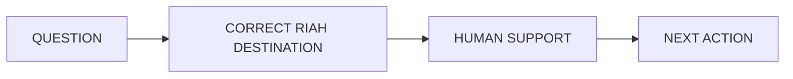
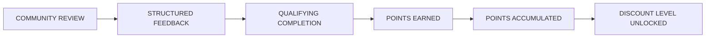
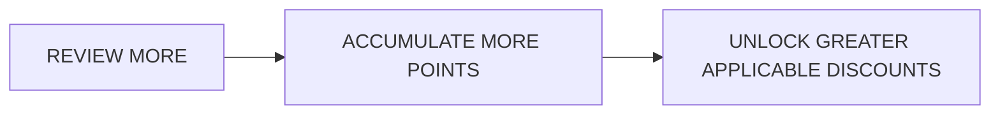
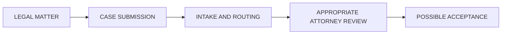

**Contributor; Mariah Dominique Rucker**

There is currently no team. I am building everything myself until I have hired the beta team. I am starting the hiring process this month, **October 2026**, for the CTO, CISO, experiential professionals, PhD-qualified faculty, and adjunct faculty for each school and major, with hiring continuing across the entire ecosystem as it scales.

Beta team members will be hired with **equity participation and compensation during the beta cohort**, which launches in **Spring 2027**.

The website will launch in **October 2026** as I continue to build, develop, revise, and finalize aspects of the RIAH Pathway ecosystem.

Learn more about me on GitHub and LinkedIn, or connect with me through social media and Linktree.

- **GitHub:** https://github.com/mariahdominiquerucker
- **LinkedIn:** https://linkedin.com/in/mariahrucker
- **Facebook:** https://facebook.com/heymariahrucker
- **Instagram:** https://instagram.com/heymariahrucker
- **Linktree:** https://linktr.ee/mariahrucker

---

# 👑 RIAH PATHWAY — 12 CONTACT
## WEBSITE WIREFRAME

**PAGE TYPE:** Main Public Website Page  
**PRIMARY PURPOSE:** Route prospective students, current students, applicants, employers, partners, media, donors, product customers, and other visitors to the correct RIAH Pathway destination.

**CURRENT 01–12 ROUTING CONTROL:**  
01 Home → 02 About → 03 Pathway → 04 Admissions → 05 Tuition → 06 Donations → 07 Products → 08 Accreditation & Authorization → 09 Join Us → 10 Resources → 11 FAQ → 12 Contact.

---

# GLOBAL HEADER

[HEADER — GLOBAL]

[LOGO PLACEHOLDER — RIAH PATHWAY]

**Institutional Visual System:**  
Black • Red • Gold • White • Silver

**Institutional Symbol:** Crown  
**Institutional Mascot:** Goat  
**Institutional Slogan:** **ONE DYNASTY. INFINITE LEGACIES.**

### PRIMARY NAVIGATION

[INTERNAL LINK — 01 HOME]  
[INTERNAL LINK — 02 ABOUT]  
[INTERNAL LINK — 03 PATHWAY]  
[INTERNAL LINK — 04 ADMISSIONS]  
[INTERNAL LINK — 05 TUITION]  
[INTERNAL LINK — 06 DONATIONS]  
[INTERNAL LINK — 07 PRODUCTS]  
[INTERNAL LINK — 08 ACCREDITATION & AUTHORIZATION]  
[INTERNAL LINK — 09 JOIN US]  
[INTERNAL LINK — 10 RESOURCES]  
[INTERNAL LINK — 11 FAQ]  
[INTERNAL LINK — 12 CONTACT]

**[BUTTON — APPLY NOW → 04.3 APPLICATION → EXTERNAL CLASSE365 — ENDPOINT TO ATTACH]**

---

# 12.01 — HERO — CONTACT RIAH PATHWAY

[SECTION BACKGROUND — BLACK, WHITE, RED, AND GOLD ACCENTS]

**Layout:** Split-screen hero.  
Left = Contact message and actions.  
Right = Primary video with supporting photography.

### RIAH PATHWAY

# LET’S CONNECT.

Questions about admissions, pathways, tuition, accreditation and authorization, careers, partnerships, products, donations, student support, or another RIAH Pathway experience? Start here and connect with the right team.

**[BUTTON — GET STARTED: CONTACT RIAH PATHWAY → 12 CONTACT → RIAH PATHWAY DROP FORM — FORM ENDPOINT TO ATTACH]**

**[BUTTON — GET STARTED: REQUEST INFORMATION → 12 CONTACT → RIAH PATHWAY DROP FORM — FORM ENDPOINT TO ATTACH]**

**[BUTTON — LEARN MORE: EXPLORE PATHWAYS → 03 PATHWAY]**

### HERO VIDEO

[VIDEO PLACEHOLDER — FIND YOUR RIAH PATHWAY CONNECTION]

**Purpose:**  
Introduce Contact as the routing point connecting visitors with the correct RIAH Pathway team, service, pathway, platform, or resource.

**Visual Direction:**  
Students, faculty, career and experiential professionals, admissions interaction, digital support, community, and the RIAH Pathway schools.

**Content:**  
Admissions • Student Experience • Pathways • Careers • Employers • Partnerships • Products • Support

**Controls:**  
Play • Pause • Captions • Full Screen

[IMAGE PLACEHOLDER — HERO VIDEO POSTER]

**Type:** Institutional and Student  
**Visual:** RIAH Pathway student and professional interaction.  
**Purpose:** Hero-video poster and brand anchor.  
**Alt Text:** RIAH Pathway students and professionals connecting across education, experience, certification, and career opportunities.

### HERO SUPPORTING IMAGES

[IMAGE PLACEHOLDER — HERO STUDENT IMAGE]

**Type:** Student  
**Visual:** Student using the RIAH Pathway digital environment.  
**Purpose:** Applicant and student connection.  
**Alt Text:** Student accessing RIAH Pathway information online.

[IMAGE PLACEHOLDER — HERO FACULTY IMAGE]

**Type:** Institutional  
**Visual:** Faculty or professional meeting with a student.  
**Purpose:** Human-led support.  
**Alt Text:** Faculty professional speaking with a RIAH Pathway student.

[IMAGE PLACEHOLDER — HERO CAREER IMAGE]

**Type:** Career  
**Visual:** Career or employer interaction.  
**Purpose:** Connect Contact with career and partnership routing.  
**Alt Text:** Student and employer discussing professional opportunities.

[ICON PLACEHOLDER — ENVELOPE — CONTACT]  
[ICON PLACEHOLDER — MESSAGE — INQUIRY]  
[ICON PLACEHOLDER — USERS — COMMUNITY]  
[ICON PLACEHOLDER — PATH — PATHWAYS]

---

# 12.02 — WHAT DO YOU NEED?

[SECTION LAYOUT — RESPONSIVE CONTACT ROUTING GRID]

[ICON PLACEHOLDER — ROUTE — DIRECTION]

## START WITH THE RIGHT DESTINATION.

Use the route that best matches what you need.

### CONTACT ROUTING

**Prospective Student**  
Destination: 04 Admissions

**Applicant Ready to Apply**  
Destination: 04.3 Application → Classe365

**Current Student**  
Destination: SuiteDash Student Portal

**Career Services**  
Destination: 09.2 Careers

**Employment Applicant**  
Destination: 09.3 Join Our Team → Breezy HR

**Employer**  
Destination: 09.2 Careers → Employers & Partnerships

**Partner Organization**  
Destination: 09.2 Careers → Employers & Partnerships

**Events**  
Destination: Eventbrite

**Products**  
Destination: 07 Products → Shopify

**Transcript**  
Destination: Parchment

**Enrollment and Degree Verification**  
Destination: National Student Clearinghouse

**Tuition and Pricing**  
Destination: 05 Tuition

**General Inquiry**  
Destination: RIAH Pathway Drop Form

### QUICK ACTIONS

**[BUTTON — APPLY NOW → 04.3 APPLICATION → EXTERNAL CLASSE365 — ENDPOINT TO ATTACH]**

**[BUTTON — LOG IN: STUDENT PORTAL → EXTERNAL SUITEDASH — ENDPOINT TO ATTACH]**

**[BUTTON — LEARN MORE: CAREER SERVICES → 09.2 CAREERS]**

**[BUTTON — SHOP NOW → EXTERNAL SHOPIFY — ENDPOINT TO ATTACH]**

**[BUTTON — GET STARTED: GENERAL INQUIRY → RIAH PATHWAY DROP FORM — FORM ENDPOINT TO ATTACH]**

---

# 12.03 — FIND THE RIGHT RIAH PATHWAY TEAM

[SECTION BACKGROUND — WHITE]

**Layout:** Three-column icon-card grid on desktop, two-column tablet, stacked mobile.

## WHERE CAN WE HELP?

Choose the area that best matches your question.

### CARD 01 — ADMISSIONS

[ICON PLACEHOLDER — DOCUMENT — APPLICATION]

Questions about:

- Pre-Admissions
- Eligibility
- Applications
- Transcripts
- Transfer and alternative credit
- Acceptance
- Enrollment
- Orientation
- Applicant questions

**Email:** admissions@RIAHPathway.com

**[BUTTON — LEARN MORE: ADMISSIONS → 04 ADMISSIONS]**

[INTERNAL LINK — 04.2 PRE-ADMISSIONS]

[INTERNAL LINK — 04.3 APPLICATION]

[INTERNAL LINK — 04.8 ADMISSIONS RESOURCES & CONTACT]

### CARD 02 — PATHWAYS

[ICON PLACEHOLDER — PATH — DIRECTION]

Explore:

- Degree Pathway
- Schools
- Law Pathway
- Experiential Pathway
- Certification Pathway
- High School Pathway
- GED and HSE Pathway

**[BUTTON — LEARN MORE: EXPLORE PATHWAYS → 03 PATHWAY]**

### CARD 03 — TUITION

[ICON PLACEHOLDER — CALCULATOR — TUITION]

Questions about:

- Tuition
- Pricing
- Fees
- Payment options
- Funding
- Reimbursement
- Costs
- Refunds
- Applicable tuition policies

**[BUTTON — LEARN MORE: TUITION & PRICING → 05 TUITION]**

[INTERNAL LINK — 05 TUITION → PRICING ENGINE]

### CARD 04 — DONATIONS

[ICON PLACEHOLDER — GIVING — DONATIONS]

Questions involving:

- Giving
- Accreditation support
- State expansion
- Foundation-related giving
- Donor accountability
- Institutional support

**Email:** donations@RIAHPathway.com

**[BUTTON — LEARN MORE: DONATIONS → 06 DONATIONS]**

### CARD 05 — PRODUCTS

[ICON PLACEHOLDER — BOOK — PRODUCTS]

Questions about:

- Products
- Services
- Curriculum-linked products
- Product availability
- Pricing
- Product inquiries

**Email:** products@RIAHPathway.com  
**Pricing:** pricing@RIAHPathway.com

**[BUTTON — LEARN MORE: PRODUCTS & SERVICES → 07.1 PRODUCTS & SERVICES]**

[INTERNAL LINK — 07.3 PRICING, INQUIRY & RESOURCES]

**[BUTTON — SHOP NOW → EXTERNAL SHOPIFY — ENDPOINT TO ATTACH]**

### CARD 06 — ACCREDITATION & AUTHORIZATION

[ICON PLACEHOLDER — INSTITUTION — SEAL]

Questions regarding:

- Current institutional status
- Accreditation planning
- State authorization
- Applicable approval and designation information
- Public disclosures

**Email:** accreditation@RIAHPathway.com

**[BUTTON — LEARN MORE: ACCREDITATION & AUTHORIZATION → 08 ACCREDITATION & AUTHORIZATION]**

### CARD 07 — JOIN US

[ICON PLACEHOLDER — USERS — CAREER]

For:

- Student Life
- Careers
- Employment
- Faculty
- Leadership
- Professional opportunities
- Employers
- Partners

**Email:** careers@RIAHPathway.com

**[BUTTON — LEARN MORE: JOIN US → 09 JOIN US]**

### CARD 08 — RESOURCES

[ICON PLACEHOLDER — LIBRARY — RESOURCES]

Resources may include:

- Events
- Admission sessions
- Career fairs
- Conferences
- Webinars
- Blog
- News and institutional updates
- Applicable public resources

**Email:** resources@RIAHPathway.com

**[BUTTON — LEARN MORE: REVIEW RESOURCES → 10 RESOURCES]**

### CARD 09 — FAQ

[ICON PLACEHOLDER — CIRCLE QUESTION — FAQ]

Find an answer before submitting an inquiry.

**Email:** faq@RIAHPathway.com

**[BUTTON — LEARN MORE: VIEW ALL FAQS → 11 FAQ]**

---

# 12.04 — CONTACT BY PATHWAY

[SECTION BACKGROUND — LIGHT SILVER AND WHITE]

## PATHWAY CONTACT DIRECTORY

**Layout:** Six compact contact cards.

### CERTIFICATION PATHWAY

[ICON PLACEHOLDER — CERTIFICATE — CREDENTIAL]

**Email:** certification@RIAHPathway.com

**[BUTTON — LEARN MORE: CERTIFICATION PATHWAY → 03.6 CERTIFICATION PATHWAY]**

### DEGREE PATHWAY

[ICON PLACEHOLDER — GRADUATION CAP — DEGREE]

**Email:** degrees@RIAHPathway.com

Degree and school-major inquiries route through the Degree Pathway.

**[BUTTON — LEARN MORE: DEGREE PATHWAY → 03.2 DEGREE PATHWAY]**

### EXPERIENTIAL PATHWAY

[ICON PLACEHOLDER — BRIEFCASE — EXPERIENCE]

**Email:** experiential@RIAHPathway.com

**[BUTTON — LEARN MORE: EXPERIENTIAL PATHWAY → 03.5 EXPERIENTIAL PATHWAY]**

### HIGH SCHOOL PATHWAY

[ICON PLACEHOLDER — SCHOOL — HIGH SCHOOL]

**Email:** highschool@RIAHPathway.com

**[BUTTON — LEARN MORE: HIGH SCHOOL PATHWAY → 03.7 HIGH SCHOOL PATHWAY]**

### GED AND HSE PATHWAY

[ICON PLACEHOLDER — DOCUMENT CHECK — GED AND HSE]

**Email:** ged@RIAHPathway.com

**[BUTTON — LEARN MORE: GED AND HSE PATHWAY → 03.8 GED AND HSE PATHWAY]**

### LAW PATHWAY

[ICON PLACEHOLDER — SCALES — LAW]

**Email:** law@RIAHPathway.com

Includes the current Law Pathway routes for:

- J.D. Pathway
- Non-J.D. Bar License Pathway

**[BUTTON — LEARN MORE: LAW PATHWAY → 03.4 LAW PATHWAY]**

---

# 12.05 — TUITION, FUNDING & GIVING

[SECTION LAYOUT — THREE INFORMATION CARDS]

## START WITH THE PUBLISHED INFORMATION.

Contact should be the escalation point rather than duplicating tuition, pricing, funding, or giving information already published elsewhere.

### TUITION & PRICING

[ICON PLACEHOLDER — CALCULATOR — PRICING]

Use the Tuition page and Pricing Engine for a pathway-specific estimate before contacting RIAH Pathway for items requiring eligibility review, admissions review, funding review, or approval.

**[BUTTON — LEARN MORE: BUILD MY ESTIMATE → 05 TUITION → PRICING ENGINE]**

[INTERNAL LINK — 05 TUITION]

[INTERNAL LINK — 11 FAQ → TUITION FAQ]

### FUNDING & REIMBURSEMENT

[ICON PLACEHOLDER — WALLET — FUNDING]

**Email:** funding@RIAHPathway.com

Questions may include applicable:

- Scholarships
- Grants
- Stipends
- Employer assistance
- Tuition reimbursement
- Other published funding opportunities

**[BUTTON — LEARN MORE: FUNDING & REIMBURSEMENT → 05.4 FUNDING & REIMBURSEMENT]**

### FOUNDATION-RELATED & DONATION INQUIRIES

[ICON PLACEHOLDER — BUILDING — FOUNDATION]

**Foundation-related inquiries:** foundation@RIAHPathway.com  
**Donations:** donations@RIAHPathway.com

Foundation-related giving and institutional support are presented within the existing Donations experience rather than as a separate top-level website page.

**[BUTTON — LEARN MORE: DONATIONS & FOUNDATION GIVING → 06 DONATIONS]**

---

# 12.06 — CAREERS, TEAM & PARTNERSHIPS

[SECTION BACKGROUND — BLACK WITH WHITE TEXT]

## WORK WITH RIAH PATHWAY

**Layout:** Four responsive cards.

### CAREERS

[ICON PLACEHOLDER — BRIEFCASE — CAREERS]

**Email:** careers@RIAHPathway.com

Career services, professional development, employment resources, and applicable opportunities.

**[BUTTON — LEARN MORE: CAREERS → 09.2 CAREERS]**

### JOIN OUR TEAM — HUMAN RESOURCES

[ICON PLACEHOLDER — USERS — HUMAN RESOURCES]

**Email:** hr@RIAHPathway.com

Employment and team-related inquiries.

**[BUTTON — LEARN MORE: JOIN OUR TEAM → 09.3 JOIN OUR TEAM]**

[EXTERNAL LINK — BREEZY HR → OPEN POSITIONS — ENDPOINT TO ATTACH]

### PARTNERSHIPS

[ICON PLACEHOLDER — HANDSHAKE — PARTNERSHIPS]

**Email:** partnerships@RIAHPathway.com

Partnership categories may include:

- Colleges and universities
- Courts
- Government agencies
- High schools
- Law firms
- Employers
- Applicable professional organizations

**[BUTTON — LEARN MORE: EMPLOYERS & PARTNERSHIPS → 09.2 CAREERS → EMPLOYERS & PARTNERSHIPS]**

**[BUTTON — GET STARTED: PARTNERSHIP INQUIRY → RIAH PATHWAY DROP FORM → PARTNERSHIP SELECTION — FORM ENDPOINT TO ATTACH]**

### TECHNOLOGY + DEVELOPMENT

[ICON PLACEHOLDER — CODE — TECHNOLOGY DEVELOPMENT]

Questions regarding public-facing RIAH technology, development opportunities, technology partnerships, or connected ecosystem support.

**[BUTTON — LEARN MORE: JOIN THE DEVELOPMENT TEAM → 09.3 JOIN OUR TEAM → DEVELOPMENT PILLAR]**

**[BUTTON — GET STARTED: TECHNOLOGY PARTNERSHIP → RIAH PATHWAY DROP FORM → TECHNOLOGY PARTNERSHIP SELECTION — FORM ENDPOINT TO ATTACH]**

Only public-facing technology and development routes belong on this page. Internal automation, architecture, administrative workflows, and staff-only systems remain outside the public website.

---

# 12.07 — EMPLOYER RELATIONS

[SECTION LAYOUT — IMAGE + TEXT SPLIT]

[IMAGE PLACEHOLDER — EMPLOYER + STUDENT CONNECTION]

**Type:** Career  
**Visual:** Employer representative speaking with a student or alumni candidate.  
**Purpose:** Represent experiential, career, and employer engagement.  
**Alt Text:** Employer representative meeting with a RIAH Pathway student about professional opportunities.

[ICON PLACEHOLDER — BUILDING — EMPLOYER]

## EMPLOYER RELATIONS

Employers can connect with RIAH Pathway regarding:

- Experiential opportunities
- Student and alumni hiring
- Career fairs
- Career opportunities
- Professional partnerships

Employer and partner access remains subject to applicable legitimacy, opportunity-quality, school-alignment, compliance, safety, inclusion, supervision, privacy, and accountability requirements.

**[BUTTON — GET STARTED: EMPLOYER INQUIRY → RIAH PATHWAY DROP FORM → EMPLOYER RELATIONS SELECTION — FORM ENDPOINT TO ATTACH]**

**[BUTTON — LEARN MORE: EMPLOYERS & PARTNERSHIPS → 09.2 CAREERS → EMPLOYERS & PARTNERSHIPS]**

---

# 12.08 — MEDIA & PRESS

[SECTION LAYOUT — TEXT + PURPOSEFUL IMAGE]

[IMAGE PLACEHOLDER — MEDIA AND PRESS INTERVIEW]

**Type:** Institutional  
**Visual:** RIAH Pathway interview, event, press, or institutional-media setting.  
**Purpose:** Visually identify media inquiries without adding unnecessary imagery.  
**Alt Text:** RIAH Pathway representative participating in an institutional media interview.

[ICON PLACEHOLDER — MICROPHONE — MEDIA]

## MEDIA INQUIRIES

Media inquiries may concern:

- RIAH Pathway
- Founder and leadership
- Institutional developments
- Programs and pathways
- Events
- Press opportunities

**[BUTTON — GET STARTED: MEDIA INQUIRY → RIAH PATHWAY DROP FORM → MEDIA INQUIRY SELECTION — FORM ENDPOINT TO ATTACH]**

**[BUTTON — LEARN MORE: NEWS & INSTITUTIONAL UPDATES → 10.10 BLOG — NEWS & INSTITUTIONAL UPDATES]**

---

# 12.09 — HELP DESK & STUDENT SUPPORT ROUTING

[SECTION BACKGROUND — LIGHT SILVER]

[ICON PLACEHOLDER — HEADSET — TECHNICAL SUPPORT]

## NEED TECHNICAL HELP?

For account issues, technical questions, access problems, or support requests:

**Email:** helpdesk@RIAHPathway.com

**[BUTTON — LOG IN: SUPPORT TICKETS → EXTERNAL SUITEDASH — ENDPOINT TO ATTACH]**

For admissions-specific questions, use Admissions rather than technical support.

**[BUTTON — LEARN MORE: ADMISSIONS → 04 ADMISSIONS]**

### STUDENT RECORDS

[ICON PLACEHOLDER — FILE — TRANSCRIPT]

[EXTERNAL LINK — OFFICIAL TRANSCRIPTS → PARCHMENT — ENDPOINT TO ATTACH]

[EXTERNAL LINK — ENROLLMENT AND DEGREE VERIFICATION → NATIONAL STUDENT CLEARINGHOUSE — ENDPOINT TO ATTACH]

---

# 12.10 — GENERAL CONTACT

[SECTION LAYOUT — CLEAN CONTACT BLOCK]

[ICON PLACEHOLDER — MAIL — GENERAL CONTACT]

## START WITH GENERAL CONTACT.

**General:** contact@RIAHPathway.com  
**About:** about@RIAHPathway.com

Use General Contact when another category does not clearly apply.

**[BUTTON — GET STARTED: GENERAL CONTACT → RIAH PATHWAY DROP FORM — FORM ENDPOINT TO ATTACH]**

**[BUTTON — GET STARTED: REQUEST INFORMATION → RIAH PATHWAY DROP FORM — FORM ENDPOINT TO ATTACH]**

---

# 12.11 — SEND US A MESSAGE

[SECTION BACKGROUND — WHITE]

[ICON PLACEHOLDER — MESSAGE SQUARE — FORM]

## RIAH PATHWAY DROP FORM

**Destination:** FORM ENDPOINT TO ATTACH

### FORM FIELDS

- First Name
- Last Name
- Email
- Contact Category
- Pathway or Area — If Applicable
- Subject
- Message
- Preferred Contact Method
- Consent and Acknowledgment

### CONTACT CATEGORY

- General
- Admissions
- Pre-Admissions
- Degree Pathway
- Certification Pathway
- Experiential Pathway
- High School
- GED and HSE
- Law Pathway
- Transfer
- International Applicant
- Tuition
- Funding
- Foundation-Related Inquiry
- Donations
- Products
- Pricing
- Accreditation & Authorization
- Careers
- Human Resources
- Partnerships
- Employer Relations
- Media
- Resources
- Technical Support
- FAQ
- Other Applicable Request

**[BUTTON — GET STARTED: SUBMIT INQUIRY → RIAH PATHWAY DROP FORM — FORM ENDPOINT TO ATTACH]**

---

# 12.12 — BEFORE YOU CONTACT US

[SECTION LAYOUT — THREE LINK CARDS]

## FIND INFORMATION FIRST.

### FAQ

[ICON PLACEHOLDER — CIRCLE QUESTION — FAQ]

Find common answers across RIAH Pathway.

**[BUTTON — LEARN MORE: VIEW ALL FAQS → 11 FAQ]**

### RESOURCES

[ICON PLACEHOLDER — BOOK OPEN — RESOURCES]

Review public guides, events, news, and applicable resources.

**[BUTTON — LEARN MORE: REVIEW RESOURCES → 10 RESOURCES]**

### PUBLIC POLICIES & CONSUMER INFORMATION

[ICON PLACEHOLDER — SHIELD CHECK — POLICIES]

Review applicable policies, disclosures, procedures, and consumer information.

**[BUTTON — LEARN MORE: INSTITUTIONAL POLICY LIBRARY → 04.7 HOW RIAH PATHWAY WORKS → INSTITUTIONAL POLICY LIBRARY]**

Where an approved policy is maintained as a living public SuiteDash resource:

[EXTERNAL LINK — APPLICABLE PUBLIC POLICY → SUITEDASH PUBLIC PAGE PLACEHOLDER]

Public policies and other living institutional resources should remain living resources rather than being duplicated into unnecessary PDF downloads.

---

# 12.13 — CONNECT WITH RIAH PATHWAY

[SECTION BACKGROUND — BLACK]

## FOLLOW THE DYNASTY.

**Username:** **@RIAHPathway**

### SOCIAL ICON ROW

[ICON PLACEHOLDER — INSTAGRAM]  
[EXTERNAL LINK — INSTAGRAM — @RIAHPATHWAY → SOCIAL URL TO ATTACH]

[ICON PLACEHOLDER — FACEBOOK]  
[EXTERNAL LINK — FACEBOOK — @RIAHPATHWAY → SOCIAL URL TO ATTACH]

[ICON PLACEHOLDER — TIKTOK]  
[EXTERNAL LINK — TIKTOK — @RIAHPATHWAY → SOCIAL URL TO ATTACH]

[ICON PLACEHOLDER — X]  
[EXTERNAL LINK — X — @RIAHPATHWAY → SOCIAL URL TO ATTACH]

[ICON PLACEHOLDER — YOUTUBE]  
[EXTERNAL LINK — YOUTUBE — @RIAHPATHWAY → SOCIAL URL TO ATTACH]

[ICON PLACEHOLDER — LINKEDIN]  
[EXTERNAL LINK — LINKEDIN — @RIAHPATHWAY → SOCIAL URL TO ATTACH]

[ICON PLACEHOLDER — THREADS]  
[EXTERNAL LINK — THREADS — @RIAHPATHWAY → SOCIAL URL TO ATTACH]

[ICON PLACEHOLDER — PINTEREST]  
[EXTERNAL LINK — PINTEREST — @RIAHPATHWAY → SOCIAL URL TO ATTACH]

---

# 12.14 — CONTINUE EXPLORING

[SECTION LAYOUT — COMPACT LINK DIRECTORY]

## WEBSITE NAVIGATION — 01 THROUGH 11

[INTERNAL LINK — 01 HOME]

[INTERNAL LINK — 02 ABOUT]

[INTERNAL LINK — 03 PATHWAY]

[INTERNAL LINK — 04 ADMISSIONS]

[INTERNAL LINK — 05 TUITION]

[INTERNAL LINK — 06 DONATIONS]

[INTERNAL LINK — 07 PRODUCTS]

[INTERNAL LINK — 08 ACCREDITATION & AUTHORIZATION]

[INTERNAL LINK — 09 JOIN US]

[INTERNAL LINK — 09.1 STUDENT LIFE]

[INTERNAL LINK — 09.2 CAREERS]

[INTERNAL LINK — 09.3 JOIN OUR TEAM]

[INTERNAL LINK — 10 RESOURCES]

[INTERNAL LINK — 11 FAQ]

---

# 12.15 — CONTACT & SUPPORT GUIDE

[SECTION LAYOUT — SINGLE RESOURCE CARD]

[ICON PLACEHOLDER — FILE DOWN — CONTACT GUIDE]

## ONE OPTIONAL CONTACT DOWNLOAD

**Contact & Support Guide**

A compact standalone reference containing:

- Department contact emails
- Contact categories
- Pathway contacts
- Student-record destinations
- Support routing
- Employer and partner routing

[DOWNLOAD — CONTACT & SUPPORT GUIDE → FILE TO ATTACH]

No additional Contact-page downloads are required. Policies, procedures, disclosures, tuition information, and ordinary web content remain on their owning website page or approved living resource.

---

# 12.16 — FINAL CTA

[SECTION BACKGROUND — FULL-WIDTH BLACK WITH RED AND GOLD ACCENTS]

[IMAGE PLACEHOLDER — RIAH PATHWAY COMMUNITY CTA]

**Type:** Institutional, Student, and Career  
**Visual:** One cohesive student, professional, and community image.  
**Purpose:** Close the Contact journey with a human-centered visual.  
**Alt Text:** RIAH Pathway students and professionals representing education, experience, certification, and career opportunities.

# YOUR NEXT STEP STARTS HERE.

Whether you are exploring RIAH Pathway, preparing to apply, connecting with a pathway, seeking support, building a partnership, or supporting the institution, use the route that matches your next step.

**[BUTTON — GET STARTED: REQUEST INFORMATION → RIAH PATHWAY DROP FORM — FORM ENDPOINT TO ATTACH]**

**[BUTTON — LEARN MORE: EXPLORE PATHWAYS → 03 PATHWAY]**

**[BUTTON — APPLY NOW → 04.3 APPLICATION → EXTERNAL CLASSE365 — ENDPOINT TO ATTACH]**

---

# GLOBAL FOOTER

[FOOTER — GLOBAL]

[LOGO PLACEHOLDER — RIAH PATHWAY]

# RIAH PATHWAY

**ONE DYNASTY. INFINITE LEGACIES.**

**Education. Experience. Certification. Career.**

### POWER

**People. Opportunity. Work. Equity. Results.**

**Create Legacies.**

## EXPLORE

[INTERNAL LINK — 01 HOME]  
[INTERNAL LINK — 02 ABOUT]  
[INTERNAL LINK — 03 PATHWAY]  
[INTERNAL LINK — 04 ADMISSIONS]  
[INTERNAL LINK — 05 TUITION]  
[INTERNAL LINK — 06 DONATIONS]  
[INTERNAL LINK — 07 PRODUCTS]  
[INTERNAL LINK — 08 ACCREDITATION & AUTHORIZATION]  
[INTERNAL LINK — 09 JOIN US]  
[INTERNAL LINK — 10 RESOURCES]  
[INTERNAL LINK — 11 FAQ]  
[INTERNAL LINK — 12 CONTACT]

## STUDENTS

**[BUTTON — APPLY NOW → 04.3 APPLICATION → EXTERNAL CLASSE365 — ENDPOINT TO ATTACH]**

**[BUTTON — LOG IN: STUDENT PORTAL → EXTERNAL SUITEDASH — ENDPOINT TO ATTACH]**

[EXTERNAL LINK — OFFICIAL TRANSCRIPTS → PARCHMENT — ENDPOINT TO ATTACH]

[EXTERNAL LINK — ENROLLMENT AND DEGREE VERIFICATION → NATIONAL STUDENT CLEARINGHOUSE — ENDPOINT TO ATTACH]

[EXTERNAL LINK — CAREER SERVICES → SYMPLICITY CSM — ENDPOINT TO ATTACH]

## RESOURCES

[INTERNAL LINK — 10 RESOURCES]

[INTERNAL LINK — 11 FAQ]

[INTERNAL LINK — 04.7 HOW RIAH PATHWAY WORKS → INSTITUTIONAL POLICY LIBRARY]

[EXTERNAL LINK — PRIVACY → SUITEDASH PUBLIC PAGE PLACEHOLDER]

[EXTERNAL LINK — TERMS → SUITEDASH PUBLIC PAGE PLACEHOLDER]

[EXTERNAL LINK — ACCESSIBILITY → SUITEDASH PUBLIC PAGE PLACEHOLDER]

[EXTERNAL LINK — APPLICABLE DISCLOSURES → SUITEDASH PUBLIC PAGE PLACEHOLDER]

## PUBLIC PLATFORMS

[EXTERNAL LINK — CLASSE365 → ADMISSIONS — ENDPOINT TO ATTACH]

[EXTERNAL LINK — SUITEDASH → STUDENT PORTAL — ENDPOINT TO ATTACH]

[EXTERNAL LINK — SYMPLICITY CSM → CAREER SERVICES — ENDPOINT TO ATTACH]

[EXTERNAL LINK — BREEZY HR → OPEN POSITIONS — ENDPOINT TO ATTACH]

[EXTERNAL LINK — EVENTBRITE → EVENTS — ENDPOINT TO ATTACH]

[EXTERNAL LINK — SHOPIFY → RIAH PATHWAY STORE — ENDPOINT TO ATTACH]

[EXTERNAL LINK — PARCHMENT → OFFICIAL TRANSCRIPTS — ENDPOINT TO ATTACH]

[EXTERNAL LINK — NATIONAL STUDENT CLEARINGHOUSE → ENROLLMENT AND DEGREE VERIFICATION — ENDPOINT TO ATTACH]

## CONTACT

4307 Rockside Road, Suite 400  
Independence, Ohio 44131

1-877-245-RIAH (7424)

contact@RIAHPathway.com

RIAHPathway.com

## SUPPORT

helpdesk@RIAHPathway.com

**[BUTTON — LOG IN: SUPPORT TICKETS → EXTERNAL SUITEDASH — ENDPOINT TO ATTACH]**

## CONNECT

**@RIAHPathway**

[EXTERNAL LINK — INSTAGRAM → SOCIAL URL TO ATTACH]  
[EXTERNAL LINK — FACEBOOK → SOCIAL URL TO ATTACH]  
[EXTERNAL LINK — TIKTOK → SOCIAL URL TO ATTACH]  
[EXTERNAL LINK — X → SOCIAL URL TO ATTACH]  
[EXTERNAL LINK — YOUTUBE → SOCIAL URL TO ATTACH]  
[EXTERNAL LINK — LINKEDIN → SOCIAL URL TO ATTACH]  
[EXTERNAL LINK — THREADS → SOCIAL URL TO ATTACH]  
[EXTERNAL LINK — PINTEREST → SOCIAL URL TO ATTACH]

## LEGAL

[EXTERNAL LINK — PRIVACY → SUITEDASH PUBLIC PAGE PLACEHOLDER]

[EXTERNAL LINK — TERMS → SUITEDASH PUBLIC PAGE PLACEHOLDER]

[EXTERNAL LINK — ACCESSIBILITY → SUITEDASH PUBLIC PAGE PLACEHOLDER]

[EXTERNAL LINK — CONSUMER INFORMATION → SUITEDASH PUBLIC PAGE PLACEHOLDER]

[INTERNAL LINK — 04.7 HOW RIAH PATHWAY WORKS → INSTITUTIONAL POLICY LIBRARY]

## COPYRIGHT

© RIAH Pathway. All Rights Reserved.

---

# BUTTON, LINK & DOWNLOAD ROUTING CHART

The wireframe uses a list instead of a table so the Markdown remains table-free.

01. Button — Apply Now — 04.3 Application and Classe365 — Internal and External — Header
02. Button — Contact RIAH Pathway — RIAH Pathway Drop Form — External Form — Hero
03. Button — Request Information — RIAH Pathway Drop Form — External Form — Hero
04. Button — Explore Pathways — 03 Pathway — Internal — Hero
05. Button — Apply Now — 04.3 Application and Classe365 — Internal and External — What Do You Need
06. Button — Student Portal — SuiteDash — External — What Do You Need
07. Button — Career Services — 09.2 Careers — Internal — What Do You Need
08. Button — Shop Now — Shopify — External — What Do You Need
09. Button — General Inquiry — RIAH Pathway Drop Form — External Form — What Do You Need
10. Button — Admissions — 04 Admissions — Internal — Team Directory
11. Internal Link — Pre-Admissions — 04.2 Pre-Admissions — Internal — Admissions Card
12. Internal Link — Application — 04.3 Application — Internal — Admissions Card
13. Internal Link — Admissions Resources & Contact — 04.8 Admissions Resources & Contact — Internal — Admissions Card
14. Button — Explore Pathways — 03 Pathway — Internal — Team Directory
15. Button — Tuition & Pricing — 05 Tuition — Internal — Team Directory
16. Internal Link — Pricing Engine — 05 Tuition Pricing Engine — Internal — Tuition Card
17. Button — Donations — 06 Donations — Internal — Team Directory
18. Button — Products & Services — 07.1 Products & Services — Internal — Team Directory
19. Internal Link — Pricing, Inquiry & Resources — 07.3 Pricing, Inquiry & Resources — Internal — Products Card
20. Button — Shop Now — Shopify — External — Products Card
21. Button — Accreditation & Authorization — 08 Accreditation & Authorization — Internal — Team Directory
22. Button — Join Us — 09 Join Us — Internal — Team Directory
23. Button — Review Resources — 10 Resources — Internal — Team Directory
24. Button — View All FAQs — 11 FAQ — Internal — Team Directory
25. Button — Certification Pathway — 03.6 Certification Pathway — Internal — Pathway Directory
26. Button — Degree Pathway — 03.2 Degree Pathway — Internal — Pathway Directory
27. Button — Experiential Pathway — 03.5 Experiential Pathway — Internal — Pathway Directory
28. Button — High School Pathway — 03.7 High School Pathway — Internal — Pathway Directory
29. Button — GED and HSE Pathway — 03.8 GED and HSE Pathway — Internal — Pathway Directory
30. Button — Law Pathway — 03.4 Law Pathway — Internal — Pathway Directory
31. Button — Build My Estimate — 05 Tuition Pricing Engine — Internal — Tuition, Funding & Giving
32. Internal Link — Tuition — 05 Tuition — Internal — Tuition, Funding & Giving
33. Internal Link — Tuition FAQ — 11 FAQ Tuition FAQ — Internal — Tuition, Funding & Giving
34. Button — Funding & Reimbursement — 05.4 Funding & Reimbursement — Internal — Tuition, Funding & Giving
35. Button — Donations & Foundation Giving — 06 Donations — Internal — Tuition, Funding & Giving
36. Button — Careers — 09.2 Careers — Internal — Careers, Team & Partnerships
37. Button — Join Our Team — 09.3 Join Our Team — Internal — Careers, Team & Partnerships
38. External Link — Breezy HR — Open Positions — External — Careers, Team & Partnerships
39. Button — Employers & Partnerships — 09.2 Careers Employers & Partnerships — Internal — Careers, Team & Partnerships
40. Button — Partnership Inquiry — RIAH Pathway Drop Form — External Form — Careers, Team & Partnerships
41. Button — Join Development Team — 09.3 Join Our Team Development Pillar — Internal — Careers, Team & Partnerships
42. Button — Technology Partnership — RIAH Pathway Drop Form — External Form — Careers, Team & Partnerships
43. Button — Employer Inquiry — RIAH Pathway Drop Form — External Form — Employer Relations
44. Button — Employers & Partnerships — 09.2 Careers — Internal — Employer Relations
45. Button — Media Inquiry — RIAH Pathway Drop Form — External Form — Media
46. Button — News & Institutional Updates — 10.10 Blog News & Institutional Updates — Internal — Media
47. Button — Support Tickets — SuiteDash — External — Help Desk
48. Button — Admissions — 04 Admissions — Internal — Help Desk
49. External Link — Official Transcripts — Parchment — External — Help Desk
50. External Link — Enrollment and Degree Verification — National Student Clearinghouse — External — Help Desk
51. Button — General Contact — RIAH Pathway Drop Form — External Form — General Contact
52. Button — Request Information — RIAH Pathway Drop Form — External Form — General Contact
53. Button — Submit Inquiry — RIAH Pathway Drop Form — External Form — Contact Form
54. Button — View All FAQs — 11 FAQ — Internal — Before You Contact Us
55. Button — Review Resources — 10 Resources — Internal — Before You Contact Us
56. Button — Institutional Policy Library — 04.7 How RIAH Pathway Works — Internal — Before You Contact Us
57. External Link — Applicable Public Policy — SuiteDash Public Page Placeholder — External — Before You Contact Us
58. Social Link — Instagram — URL to Attach — External — Socials
59. Social Link — Facebook — URL to Attach — External — Socials
60. Social Link — TikTok — URL to Attach — External — Socials
61. Social Link — X — URL to Attach — External — Socials
62. Social Link — YouTube — URL to Attach — External — Socials
63. Social Link — LinkedIn — URL to Attach — External — Socials
64. Social Link — Threads — URL to Attach — External — Socials
65. Social Link — Pinterest — URL to Attach — External — Socials
66. Internal Link — Home — 01 Home — Internal — Continue Exploring
67. Internal Link — About — 02 About — Internal — Continue Exploring
68. Internal Link — Pathway — 03 Pathway — Internal — Continue Exploring
69. Internal Link — Admissions — 04 Admissions — Internal — Continue Exploring
70. Internal Link — Tuition — 05 Tuition — Internal — Continue Exploring
71. Internal Link — Donations — 06 Donations — Internal — Continue Exploring
72. Internal Link — Products — 07 Products — Internal — Continue Exploring
73. Internal Link — Accreditation & Authorization — 08 Accreditation & Authorization — Internal — Continue Exploring
74. Internal Link — Join Us — 09 Join Us — Internal — Continue Exploring
75. Internal Link — Student Life — 09.1 Student Life — Internal — Continue Exploring
76. Internal Link — Careers — 09.2 Careers — Internal — Continue Exploring
77. Internal Link — Join Our Team — 09.3 Join Our Team — Internal — Continue Exploring
78. Internal Link — Resources — 10 Resources — Internal — Continue Exploring
79. Internal Link — FAQ — 11 FAQ — Internal — Continue Exploring
80. Download — Contact & Support Guide — File to Attach — Download — Contact Guide
81. Button — Request Information — RIAH Pathway Drop Form — External Form — Final CTA
82. Button — Explore Pathways — 03 Pathway — Internal — Final CTA
83. Button — Apply Now — 04.3 Application and Classe365 — Internal and External — Final CTA
84. Button — Apply Now — 04.3 Application and Classe365 — Internal and External — Footer
85. Button — Student Portal — SuiteDash — External — Footer
86. External Link — Parchment — Official Transcripts — External — Footer
87. External Link — National Student Clearinghouse — Verification — External — Footer
88. External Link — Symplicity CSM — Career Services — External — Footer
89. External Link — Breezy HR — Open Positions — External — Footer
90. External Link — Eventbrite — Events — External — Footer
91. External Link — Shopify — Store — External — Footer
92. External Link — Privacy — SuiteDash Public Page Placeholder — External — Footer
93. External Link — Terms — SuiteDash Public Page Placeholder — External — Footer
94. External Link — Accessibility — SuiteDash Public Page Placeholder — External — Footer
95. External Link — Consumer Information — SuiteDash Public Page Placeholder — External — Footer
96. Button — Support Tickets — SuiteDash — External — Footer

---

# MEDIA & ICON ASSET CHART

The wireframe uses a list instead of a table so the Markdown remains table-free.

01. Video — Find Your RIAH Pathway Connection — Primary Contact-page story — Hero
02. Image — Hero Video Poster — Video poster and institutional anchor — Hero
03. Image — Hero Student Image — Applicant and student connection — Hero
04. Image — Hero Faculty Image — Human-led academic support — Hero
05. Image — Hero Career Image — Career and employer connection — Hero
06. Icon Set — Contact, Message, Users, Path — Hero scanning and navigation — Hero
07. Icon Set — Nine Team Routing Icons — Differentiate contact categories — Find the Right Team
08. Icon Set — Six Pathway Icons — Differentiate pathway contacts — Contact by Pathway
09. Icon Set — Tuition, Funding, Foundation — Financial and giving routing — Tuition, Funding & Giving
10. Icon Set — Career, HR, Partnership, Technology — Work-with-RIAH routing — Careers, Team & Partnerships
11. Image — Employer and Student Connection — Employer-relations visual — Employers
12. Icon — Building, Employer — Employer routing — Employers
13. Image — Media and Press Interview — Media-inquiry visual — Media
14. Icon — Microphone, Media — Media routing — Media
15. Icon Set — Headset, File — Support, transcripts, verification — Help Desk
16. Icon — Mail, General Contact — General inquiry routing — General Contact
17. Icon — Message, Form — Unified inquiry form — Contact Form
18. Icon Set — FAQ, Resources, Policy — Information-first routing — Before You Contact Us
19. Icon Set — Social Platform Icons — Social links — Connect
20. Icon — File Download — Contact guide — Resource Download
21. Image — RIAH Pathway Community CTA — Final human-centered close — Final CTA
22. Logo — RIAH Pathway Logo — Institutional identity — Header and Footer

---

# CTA AUDIT

**CTA families used on this page:**

- Apply Now — Yes
- Learn More — Yes
- Get Started — Yes
- Log In — Yes
- Shop Now — Yes

**Total CTA Families Used:** 5 of 5

No additional CTA family is introduced.

---

# DOWNLOAD AUDIT

**Total Downloads:** 1

**Download:** Contact & Support Guide  
**Reason Needed:** Provides a compact standalone routing reference for visitors who need department, pathway, records, employer, partner, and support contacts in one retainable document.

**Not Downloads:**

- Policies
- Procedures
- Tuition information
- Pricing information
- FAQ content
- Ordinary Contact-page information
- Consumer disclosures

These remain on their owning website page or approved living public resource.

------------------------------------------------------------------------

<!-- RIAH IMPACT TRANSPARENCY DISTRIBUTION 2026-10-01 -->

# 👑 IMPACT & TRANSPARENCY CONTACT ROUTING

| Contact Need | Route |
|---|---|
| 💰 **Donations** | Donation and accreditation-fund support |
| 🎓 **Scholarships** | Scholarship funding and donor-created scholarship inquiries |
| 💼 **Experiential** | Major rotation and Experiential Program inquiries |
| 🌎 **Community Review** | Community reviewer participation |
| 🏢 **Employer Partnerships** | Real-work placements, employer review, and industry participation |
| ⚖️ **School of Law Public Service** | Eligible record-sealing and expungement assistance inquiries |
| 👩‍⚖️ **Attorney Participation** | School of Law public-service and professional participation |
| 📊 **Transparency & Reports** | Public ledger, financial statements, scholarship reports, and impact reporting |
| 🔐 **Privacy** | Questions concerning public/private information boundaries |

## COMMUNITY CAPSTONE + PEER REVIEW POINTS AND DISCOUNTS

Community members may sign up to review applicable student capstones, participate in applicable peer review, and provide structured feedback on student work. Qualifying completed reviews earn points that accumulate according to the number of capstone and peer-review activities completed.

| Community Participation | RIAH Structure |
|---|---|
| Capstone Review | Review applicable student capstones and provide structured feedback |
| Peer Review | Participate in applicable peer-review activities |
| Points | Earn points for qualifying completed capstone and peer reviews |
| Accumulation | Points accumulate based on qualifying review participation |
| Product Discounts | Accumulated points may unlock applicable discounts on qualifying RIAH products |
| Certification Review | Applicable discounts may be used toward qualifying Certification Review products |
| Bar Review | Applicable discounts may be used toward qualifying Bar Review products |
| Educational Pathways | Applicable discounts may be used toward qualifying RIAH educational pathways, including the JD pathway and other applicable education pathways |

RIAH faculty and applicable academic personnel retain academic oversight and final evaluation requirements. Community and peer feedback supplements the formal academic review process.

---

# LEGAL CASE SUBMISSION AND ROUTING

Contact routes members of the public with legal matters to the applicable School of Law case-submission intake process. Matters may include record sealing and expungement, civil disputes, criminal matters, property law, intellectual property, business law, contracts, corporate matters, mergers and acquisitions, and other applicable legal issues.

Submission does not guarantee representation or attorney acceptance. Legal representation is provided only by an appropriately licensed or otherwise legally authorized professional. Applicable supervised student participation occurs only where permitted by law, court requirements, professional rules, and the supervising attorney.

RIAH Pathway
