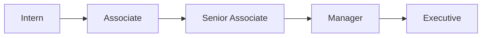
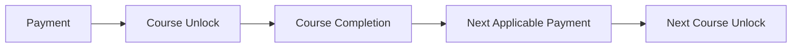
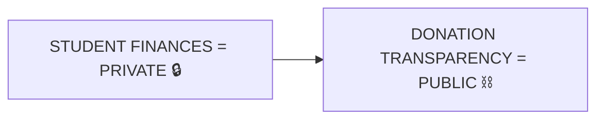
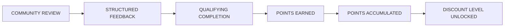

# 👑 RIAH PATHWAY --- 06.1 TUITION OVERVIEW

## WEBSITE WIREFRAME

**Brand:** RIAH Pathway **Slogan:** **ONE DYNASTY. INFINITE LEGACIES.**  
**Institutional Colors:** Black • Red • Gold • White • Silver  
**Institutional Symbol:** Crown **Institutional Mascot:** Goat  
**Navigation:** 06 --- Tuition **Subpage:** 06.1 --- Overview

# PAGE STRUCTURE

-   06.1 --- Overview  
-   06.2 --- Tuition and Pricing  
-   06.3 --- Fees and Payment Options  
-   06.4 --- Funding and Reimbursement  
-   06.5 --- Costs, Refunds and Policies

# WIREFRAME STRUCTURE CONTROL

**HERO → EXPLANATION → DETAILS → SUPPORTING RESOURCES → CTA**

Preserve the approved Tuition Overview content while communicating  
current accreditation and authorization stage, Beta benefits, curriculum  
pathways, Experiential structure, pricing, fees, payment options,  
funding, reimbursement, refunds, and policies.

# GLOBAL HEADER

**[LOGO PLACEHOLDER --- RIAH PATHWAY]**

01 --- Home 02 --- About 03 --- Pathway 04 --- Curriculum 05 ---  
Admissions 06 --- Tuition --- Active 07 --- Donations 08 --- Products 09  
--- Accreditation and Authorization 10 --- Join Us 11 --- Resources 12  
--- FAQ 13 --- Contact

**[BUTTON --- APPLY NOW → EXTERNAL --- CLASSE365]** **[BUTTON --- GET  
STARTED: REQUEST INFORMATION → 13 --- CONTACT → RIAH PATHWAY DROP  
FORM]**

# TUITION SUBPAGE NAVIGATION

**[INTERNAL LINK --- 06.1 --- OVERVIEW --- ACTIVE]** **[INTERNAL LINK  
--- 06.2 --- TUITION AND PRICING]** **[INTERNAL LINK --- 06.3 --- FEES  
AND PAYMENT OPTIONS]** **[INTERNAL LINK --- 06.4 --- FUNDING AND  
REIMBURSEMENT]** **[INTERNAL LINK --- 06.5 --- COSTS, REFUNDS AND  
POLICIES]**

# SECTION 01 --- HERO

# YOUR PROGRAM. YOUR PATHWAY. ONE TOTAL PROGRAM PRICE.

RIAH Pathway structures tuition around the complete applicable  
educational pathway so students can understand the total tuition  
associated with the program and curriculum they select.

RIAH Pathway is presently operating within its pre-accreditation and  
applicable state-authorization development stage. Accreditation,  
authorization, approval, and degree-conferral status must always be  
represented according to the institution's actual status at the time a  
student enrolls and completes the applicable program.

Students can review tuition by program, curriculum, Experiential  
pricing, Beta benefits, applicable fees and deposits, payment options,  
funding opportunities, reimbursement, scholarships, grants, applicable  
financial assistance, and refund information throughout the Tuition  
section.

## CORE PRICING PRINCIPLE

# ONE PROGRAM. ONE ESTABLISHED TOTAL TUITION.

Acceleration may change academic progression, curriculum completion,  
course completion, course unlocking, Experiential participation, payment  
milestones, and program completion. The established total-program  
tuition remains connected to the applicable educational pathway.

**[VIDEO PLACEHOLDER --- HERO VIDEO]**

Purpose: Explain the total-program tuition model, Beta and  
Pre-Accreditation pricing, curriculum connection, payment options, and  
financial-resource structure.

Visual Direction: Students and working professionals reviewing  
curriculum, tuition information, educational pathways, laptops, academic  
materials, and Experiential opportunities.

Controls: Play • Pause • Captions • Full Screen

**[IMAGE PLACEHOLDER --- TUITION HERO VIDEO POSTER]**

**[BUTTON --- LEARN MORE: TUITION AND PRICING → 06.2 --- TUITION AND  
PRICING]** **[BUTTON --- LEARN MORE: CURRICULUM → 04 ---  
CURRICULUM]** **[BUTTON --- LEARN MORE: ACCREDITATION AND  
AUTHORIZATION → 09 --- ACCREDITATION AND AUTHORIZATION]** **[BUTTON  
--- LEARN MORE: FUNDING AND REIMBURSEMENT → 06.4 --- FUNDING AND  
REIMBURSEMENT]** **[BUTTON --- APPLY NOW → EXTERNAL --- CLASSE365]**

# SECTION 02 --- PRE-ACCREDITATION AND BETA STUDENT BENEFITS

## START THE PATHWAY WHILE RIAH BUILDS TOWARD ACCREDITATION AND AUTHORIZATION.

RIAH Pathway's Beta and Pre-Accreditation structures are designed to  
provide participating students with reduced tuition, additional  
Experiential opportunities, curriculum access, and additional  
educational benefits while RIAH pursues applicable institutional  
accreditation, programmatic accreditation, state authorization, and  
other required approvals.

### BETA TUITION

# 25% OF STANDARD TUITION

### PRE-ACCREDITATION TUITION

# 50% OF STANDARD TUITION

### SECOND ACADEMIC PROGRAM

# 50% OF APPLICABLE TUITION

Qualifying Beta students who elect an eligible second academic program  
may receive the applicable second-program benefit according to governing  
Beta terms.

### ADDITIONAL EXPERIENTIAL TIME

Qualifying Beta students may receive double the corresponding  
Experiential participation period.

-   3-Month Experiential → Up to 6 Months  
-   6-Month Experiential → Up to 12 Months  
-   1-Year Experiential → Up to 2 Years

### TUITION REIMBURSEMENT

Qualifying Completion Reimbursement: \\# 10%

Maximum Established Reimbursement: \\# UP TO 50%

Qualifying Beta participants retain applicable grandfathered benefits  
according to governing Beta terms.

**[INTERNAL LINK --- 06.2 --- TUITION AND PRICING → BETA AND  
PRE-ACCREDITATION PRICING]** **[INTERNAL LINK --- 09 --- ACCREDITATION  
AND AUTHORIZATION]**

# SECTION 03 --- ACCREDITATION, AUTHORIZATION AND STUDENT PATHWAYS

RIAH Pathway students should clearly understand the accreditation,  
authorization, approval, and degree-conferral status applicable to their  
educational pathway.

RIAH Pathway is building its academic programs through applicable  
pre-accreditation and authorization stages and intends to pursue  
applicable institutional and programmatic accreditation and required  
state authorization according to relevant eligibility requirements.

Students receive applicable disclosures concerning current institutional  
status, state authorization status, program status, curriculum,  
Experiential opportunities, tuition stage, degree-conferral status,  
grandfathered benefits, accreditation limitations, and authorization  
limitations.

RIAH Pathway does not represent a program as accredited or authorized  
before the applicable body has formally granted that status.

## BUSINESS PROGRAM ACCREDITATION PATHWAY

RIAH Pathway intends to pursue applicable business-program accreditation  
when eligibility requirements are satisfied.

## LAW AND ABA PATHWAY

RIAH Pathway intends to pursue ABA provisional approval when eligible.  
The current institutional planning target is to begin the applicable ABA  
provisional-approval process in 2028, subject to satisfying then-current  
eligibility requirements and standards.

ABA approval is not guaranteed. RIAH Pathway's law pathway,  
degree-conferral practices, enrollment structure, and student  
progression must comply with ABA requirements applicable at the relevant  
time.

**[INTERNAL LINK --- 04.6 --- CURRICULUM → LAW]** **[INTERNAL LINK  
--- 09 --- ACCREDITATION AND AUTHORIZATION]**

## HIGH SCHOOL PATHWAY

High School students participating during the applicable  
authorization-development stage may combine their educational pathway  
with eligible Experiential opportunities. Eligible students may also  
progress through approved concurrent or dual-enrollment college  
coursework according to applicable requirements.

**High School Curriculum + Experiential Development + Eligible College  
Coursework**

# SECTION 04 --- TUITION AT A GLANCE

The amounts below represent total Standard tuition for the applicable  
educational pathway based on its typical program duration, except where  
expressly identified as annual.

### GED AND HSE

# \$1,500 TOTAL

Curriculum Structure: 300 Credit Hours Student Loan: Not Available

### HIGH SCHOOL DIPLOMA

# \$5,000 TOTAL

Student Loan: Not Available

### MINOR

# \$5,000 TOTAL

A Minor does not independently qualify for the RIAH Pathway Student  
Loan.

### ASSOCIATE'S PATHWAY

# \$10,000 TOTAL

### BACHELOR'S PATHWAY

# \$20,000 TOTAL

### MASTER'S PATHWAY

# \$15,000 TOTAL

### MBA PATHWAY

# \$15,000 TOTAL

### J.D. PATHWAY

# \$40,000 TOTAL

Typical Duration: 4 Years

The student pays \$40,000 total across the typical four-year J.D.  
pathway before applicable pricing-stage adjustments, discounts, funding,  
or qualifying benefits.

### NON-J.D. BAR LICENSE PATHWAY

# \$10,000 PER REQUIRED STATE-PATHWAY YEAR

State requirements control actual required duration and eligibility.  
Current pathway references include California, Maine, Vermont, West  
Virginia, Virginia, and New York.

**[BUTTON --- LEARN MORE: COMPLETE TUITION AND PRICING → 06.2 ---  
TUITION AND PRICING]**

# SECTION 05 --- THREE PRICING STAGES

### BETA

# 25%

of applicable Standard Tuition

### PRE-ACCREDITATION

# 50%

of applicable Standard Tuition

### STANDARD AND POST-CREDENTIAL

# 100%

of applicable Standard Tuition

# SECTION 06 --- ACADEMIC PRICING SNAPSHOT

### GED AND HSE

Beta --- \$375 Pre-Accreditation --- \$750 Standard --- \$1,500

### HIGH SCHOOL

Beta --- \$1,250 Pre-Accreditation --- \$2,500 Standard --- \$5,000

### MINOR

Beta --- \$1,250 Pre-Accreditation --- \$2,500 Standard --- \$5,000

### ASSOCIATE'S

Beta --- \$2,500 Pre-Accreditation --- \$5,000 Standard --- \$10,000

### BACHELOR'S

Beta --- \$5,000 Pre-Accreditation --- \$10,000 Standard --- \$20,000

### MASTER'S

Beta --- \$3,750 Pre-Accreditation --- \$7,500 Standard --- \$15,000

### MBA

Beta --- \$3,750 Pre-Accreditation --- \$7,500 Standard --- \$15,000

### J.D.

Beta --- \$10,000 Pre-Accreditation --- \$20,000 Standard --- \$40,000

### NON-J.D.

Beta --- \$2,500 per year Pre-Accreditation --- \$5,000 per year  
Standard --- \$10,000 per year

# SECTION 07 --- PAYMENT OPTIONS

Upfront Tuition Reduction --- 15% Monthly --- approved monthly payments  
Semester or Term --- approved milestone allocation where available  
Course or Module --- approved allocation where applicable

# MONTHLY TUITION PAYMENT OPTION --- 5% INTEREST ON APPLICABLE OUTSTANDING PRINCIPAL

# SECTION 08 --- PAYMENT ALLOCATION EXAMPLE

## J.D. EXAMPLE

Typical Program Duration: \\# 4 YEARS

Total Standard Tuition: \\# \$40,000

48-Month Equivalent: \\# APPROXIMATELY \$833.33 PER MONTH

8-Semester Equivalent: \\# \$5,000 PER SEMESTER

Year-Level Allocation: \\# \$10,000 PER YEAR

Course Allocation Example: \\# \$1,000 PER STANDARD PAID COURSE

All figures are allocation views of the same \$40,000 total J.D.  
tuition.

# SECTION 09 --- CURRICULUM AND TUITION

**[INTERNAL LINK --- 04.1 --- CURRICULUM → OVERVIEW]** **[INTERNAL  
LINK --- 04.2 --- CURRICULUM → ACADEMIC STRUCTURE]** **[INTERNAL LINK  
--- 04.3 --- CURRICULUM → BUSINESS]** **[INTERNAL LINK --- 04.4 ---  
CURRICULUM → HOMELAND SECURITY]** **[INTERNAL LINK --- 04.5 ---  
CURRICULUM → TECHNOLOGY]** **[INTERNAL LINK --- 04.6 --- CURRICULUM →  
LAW]** **[INTERNAL LINK --- 04.7 --- CURRICULUM → DIPLOMA AND GED]**  
**[INTERNAL LINK --- 04.8 --- CURRICULUM → EXPERIENTIAL]**  
**[INTERNAL LINK --- 04.9 --- CURRICULUM → CERTIFICATION AND REVIEW]**  
**[INTERNAL LINK --- 04.10 --- CURRICULUM → CURRICULUM ARCHITECTURE]**

# SECTION 10 --- PROFESSIONAL EXPERIENTIAL PROGRAM

Three-Month Experiential --- \$2,500 --- 3 Months Intern --- \$5,000  
Associate --- \$10,000 Senior Associate --- \$10,000 Manager ---  
\$10,000 Executive --- \$10,000

Qualifying Beta students may receive applicable extended Experiential  
participation under the Beta structure.

**[IMAGE PLACEHOLDER --- PROFESSIONAL EXPERIENTIAL LEARNING]**  
**[INTERNAL LINK --- 04.8 --- CURRICULUM → EXPERIENTIAL]**  
**[INTERNAL LINK --- 06.2 --- TUITION AND PRICING → EXPERIENTIAL  
PRICING]**

# SECTION 11 --- CERTIFICATION REVIEW PRICING

Basic --- \$500 Standard --- \$1,000 Premium --- \$1,500

First Review --- 100% Second Review --- 50% Third Review --- 25%

Three-Review Totals: Basic --- \$875 Standard --- \$1,750 Premium ---  
\$2,625

Qualifying Review Access Guarantee: \\# 3 ADDITIONAL MONTHS OF ACCESS

# SECTION 12 --- FEES AND DEPOSITS

Application Fee --- \$50 Admissions Fee --- \$0 Enrollment Fee --- \$0

## EDUCATION DEPOSIT

# \$1,550 TOTAL

\$1,000 --- Student Resource Allocation \$550 --- RIAH Fee

Student Resource Allocation may support textbooks, books, review  
courses, review packages, applicable student fees, graduation fees,  
transcript-related costs, software subscriptions, technology resources,  
laptop and computer resources, welcome package, academic materials,  
major-specific resources, program-specific resources, and other  
applicable educational resources.

## EXPERIENTIAL DEPOSIT

# \$1,500

## COMPLETE TRANSFER FEE

# \$500

Transfer Evaluation --- \$125 Alternative Credit Evaluation --- \$125  
Prior Learning and Credit Review --- \$125 Processing and Administration  
--- \$125

Transfer maximums: Minor --- Up to 6 credits Associate's --- Up to 30  
credits Bachelor's --- Up to 60 credits MBA --- Up to 9 credits J.D. ---  
Up to 60 credits

# SECTION 13 --- STUDENT LOAN

# SUBJECT TO CREDIT APPROVAL

Maximum Available Amount: \\# UP TO \$5,000

Minimum Stated Credit Score: \\# 600

Interest: \\# 5%

Repayment Period After Graduation: \\# 12 MONTHS

The student loan may be available for qualifying degree-level programs  
beginning with an eligible Associate's pathway or higher.

Not available for GED and HSE or High School Diploma.

A Minor does not independently qualify and must be connected to an  
eligible qualifying degree pathway.

# SECTION 14 --- GED AND HSE PROGRAM CLARIFICATION

Standard Tuition --- \$1,500 Beta Tuition --- \$375 Pre-Accreditation  
Tuition --- \$750 Curriculum Structure --- 300 Credit Hours Student Loan  
--- Not Available

# SECTION 15 --- HIGH SCHOOL PROGRAM CLARIFICATION

Standard Tuition --- \$5,000 Beta Tuition --- \$1,250 Pre-Accreditation  
Tuition --- \$2,500 Student Loan --- Not Available

Eligible High School students should be directed to applicable tuition  
pricing, Beta benefits, discounts, funding, scholarships, grants,  
payment arrangements, concurrent college coursework opportunities,  
Experiential opportunities, and other applicable assistance.

# SECTION 16 --- TUITION DISCOUNTS AND ACCESS

Upfront Tuition Reduction --- 15% SNAP --- 5% TANF --- 5% WIC --- 5%  
Qualifying Homeless Shelter or Housing Hardship --- 5% Qualifying  
Community or Housing-Hardship Reduction --- 5% Applicable Education and  
Experiential Combination --- 25% Additional Major --- 5% Reduction  
Additional Minor --- 5% Reduction

Maximum Combined Ordinary Qualifying Tuition Reduction: # 15%

# SECTION 17 --- FUNDING AND REIMBURSEMENT

Scholarship Pool --- 5% Stipend Pool --- 5% Grant Pool --- 5% Combined  
Reinvestment Architecture --- 15%

Qualifying Completion Reimbursement --- 10% Maximum Established  
Reimbursement --- Up to 50%

**[IMAGE PLACEHOLDER --- STUDENT FUNDING RESOURCES]** **[INTERNAL  
LINK --- 06.4 --- TUITION → FUNDING AND REIMBURSEMENT]** **[INTERNAL  
LINK --- 07 --- DONATIONS]**

# SECTION 18 --- COSTS, REFUNDS AND POLICIES

Week 1 --- 100% Week 2 --- 75% Week 3 --- 50% Week 4 and Applicable  
Fourth-Week Point --- 0% Institutional Tuition Refund

Any required federal, state, institutional, or other legally required  
financial-aid or refund calculation is administered according to  
controlling requirements.

Certification Review and Bar Review Cash Refund --- 0% Qualifying Review  
Access Guarantee --- 3 Additional Months

Products are generally nonrefundable after purchase. Qualifying  
shipping-damaged physical products may be replaced when applicable proof  
requirements are satisfied.

# SECTION 19 --- TUITION POLICIES

Policy references include:

-   Master Pricing Principles  
-   Tuition and Pricing  
-   Beta Pricing and Benefits  
-   Pre-Accreditation Pricing  
-   Grandfathered Tuition  
-   Accreditation and Authorization Disclosures  
-   Degree-Conferral Requirements  
-   Education Deposit  
-   Experiential Deposit  
-   Student Resource Allocation  
-   Application Fees  
-   Transfer Credit  
-   Complete Transfer Fee  
-   Payment Plans  
-   Upfront Payment  
-   Student Loan  
-   Student Loan Eligibility  
-   Credit Approval  
-   Tuition Discounts  
-   Discount Stacking  
-   Scholarships  
-   Grants  
-   Stipends  
-   Tuition Reimbursement  
-   Funding  
-   Refunds  
-   Withdrawal  
-   Certification Review and Bar Review  
-   Product Refund and Replacement  
-   Title IV and Financial Aid when applicable  
-   Cost of Attendance and Student Costs where applicable

**[EXTERNAL LINK --- MASTER PRICING PRINCIPLES --- TP-01 → SUITEDASH  
PUBLIC PAGE PLACEHOLDER]** **[EXTERNAL LINK --- TUITION POLICIES →  
SUITEDASH PUBLIC PAGE PLACEHOLDER]** **[EXTERNAL LINK --- STUDENT LOAN  
POLICY → SUITEDASH PUBLIC PAGE PLACEHOLDER]** **[EXTERNAL LINK --- REFUND  
AND WITHDRAWAL POLICY → SUITEDASH PUBLIC PAGE PLACEHOLDER]** **[EXTERNAL  
LINK --- TUITION REIMBURSEMENT POLICY → SUITEDASH PUBLIC PAGE  
PLACEHOLDER]**

# SECTION 20 --- RIAH TUITION CALCULATOR

Step 1 --- Select Educational Pathway Step 2 --- Select Pricing Stage  
Step 3 --- Select Experiential if Applicable Step 4 --- Applicable Fees  
and Deposits Step 5 --- Applicable Discounts and Funding Step 6 ---  
Student Loan Eligibility

Calculator output:

-   Total Program Tuition  
-   Typical Program Duration  
-   Pricing Stage  
-   Experiential Tuition  
-   Beta Benefits where applicable  
-   Deposits  
-   Fees  
-   Eligible Tuition Reductions  
-   Scholarships  
-   Grants  
-   Stipends  
-   Reimbursement  
-   Student Loan eligibility where applicable  
-   Other Approved Funding  
-   Estimated Student Responsibility

# SECTION 21 --- WHAT YOUR EDUCATION DEPOSIT SUPPORTS

Textbooks and Books Review Courses and Review Packages Laptop and  
Computer Resources Software Subscriptions Graduation-Related Resources  
Transcript-Related Costs Welcome Package Academic and Major-Specific  
Materials Technology Resources

Education Deposit: \\# \$1,550 TOTAL

\$1,000 Student Resource Allocation + \$550 RIAH Fee

**[IMAGE PLACEHOLDER --- STUDENT RESOURCE PACKAGE]**

# SECTION 22 --- TUITION SECTION DIRECTORY

**[INTERNAL LINK --- 06.2 --- TUITION AND PRICING]** **[INTERNAL LINK  
--- 06.3 --- TUITION → FEES AND PAYMENT OPTIONS]** **[INTERNAL LINK  
--- 06.4 --- TUITION → FUNDING AND REIMBURSEMENT]** **[INTERNAL LINK  
--- 06.5 --- TUITION → COSTS, REFUNDS AND POLICIES]**

# SECTION 23 --- SUPPORTING RESOURCES

**[EXTERNAL LINK --- MASTER PRICING PRINCIPLES --- TP-01 → SUITEDASH  
PUBLIC PAGE PLACEHOLDER]** **[INTERNAL LINK --- 04 --- CURRICULUM]**  
**[INTERNAL LINK --- 09 --- ACCREDITATION AND AUTHORIZATION]**  
**[INTERNAL LINK --- 06.2 --- TUITION AND PRICING]** **[INTERNAL LINK  
--- 06.3 --- TUITION → FEES AND PAYMENT OPTIONS]** **[INTERNAL LINK  
--- 06.4 --- TUITION → FUNDING AND REIMBURSEMENT]** **[INTERNAL LINK  
--- 06.5 --- TUITION → COSTS, REFUNDS AND POLICIES]**

# SECTION 24 --- FAQ PREVIEW

Includes tuition amount, total-program pricing, Pre-Accreditation  
meaning, Beta benefits, GED and HSE credit-hour structure, Student Loan  
eligibility, accelerated progression, transfer credit, payment plans,  
tuition reimbursement, curriculum routing, and Accreditation and  
Authorization routing.

**[INTERNAL LINK --- 12 --- FAQ]**

# SECTION 25 --- FINAL CTA

# UNDERSTAND YOUR COST. UNDERSTAND YOUR CURRICULUM. CHOOSE YOUR PATHWAY.

Explore your program tuition, curriculum, Beta and Pre-Accreditation  
opportunities, applicable Experiential benefits, fees, payment options,  
funding, and accreditation-stage information before beginning your RIAH  
Pathway.

**[BUTTON --- LEARN MORE: TUITION AND PRICING → 06.2 --- TUITION AND  
PRICING]** **[BUTTON --- LEARN MORE: CURRICULUM → 04 ---  
CURRICULUM]** **[BUTTON --- LEARN MORE: ACCREDITATION AND  
AUTHORIZATION → 09 --- ACCREDITATION AND AUTHORIZATION]** **[BUTTON  
--- APPLY NOW → EXTERNAL --- CLASSE365]** **[BUTTON --- GET STARTED:  
REQUEST INFORMATION → 13 --- CONTACT → RIAH PATHWAY DROP FORM]**

# SECTION 26 --- CURRENT PAYMENT OPTION ARCHITECTURE

**[IMAGE PLACEHOLDER --- PAYMENT OPTION CARDS]**

**[ICON --- PAYMENT]**

## UPFRONT PAYMENT

Applicable Upfront Tuition Reduction --- **15%**

The 15% upfront tuition reduction is mutually exclusive with the ordinary stackable tuition reductions.

Example:

Starting Tuition --- **\$22,500**

15% Upfront Reduction --- **\$3,375**

Upfront Tuition --- **\$19,125**

**[BUTTON --- CALCULATE UPFRONT OPTION → TUITION CALCULATOR]**

## MONTHLY PAYMENT

Monthly tuition payment interest --- **5% on the applicable outstanding principal**

Example:

Starting Principal --- **\$22,500**

5% Interest --- **\$1,125**

Balance Before Applicable Payment --- **\$23,625**

After an applicable payment posts, the remaining applicable principal becomes the basis for the next applicable monthly calculation.

This monthly tuition payment option is separate from the RIAH Private Student Loan.

**[BUTTON --- CALCULATE MONTHLY PAYMENT → TUITION CALCULATOR]**

## PER COURSE

Applicable tuition may be allocated across applicable paid courses.

Each applicable paid course must be paid before the next applicable paid course unlocks.

**NO PAYMENT \= NEXT PAID COURSE DOES NOT UNLOCK**

Students may accelerate within an applicable semester by completing as many eligible courses as permitted, but acceleration does not remove the required payment for each applicable paid course.

**[BUTTON --- VIEW PER COURSE OPTION → 06.3 --- FEES AND PAYMENT OPTIONS]**

## TITLE IV

Where Title IV becomes applicable and the student qualifies, the applicable approved Title IV structure is used.

For a **\$22,500** four-year program-cost example:

Year 1 Semester 1 --- **\$11,250**

Year 1 Semester 2 --- **\$11,250**

Year 1 Program Tuition Funded --- **\$22,500**

The original program tuition is front-loaded within the first applicable academic year rather than divided equally across all eight semesters.

Continued Enrollment Amount --- **\$5 per configured continued-enrollment period**

Exact continued-enrollment billing period --- **PENDING CONFIGURATION**

**[POLICY LINK --- TITLE IV INFORMATION → 06.5 --- COSTS, REFUNDS AND POLICIES]**

# SECTION 27 --- CURRENT INTEGRATED EDUCATION AND EXPERIENTIAL PRICING

**[IMAGE PLACEHOLDER --- EDUCATION PLUS EXPERIENCE PATHWAY]**

**[ICON --- CONNECTED PATHWAYS]**

Eligible integrated Education and Experiential combinations use an approved **10% structural adjustment**.

Education Standard Tuition  
+ Experiential Standard Tuition  
\= Combined Standard

Combined Standard × 10%  
\= Integrated Structural Adjustment

Combined Standard − Integrated Structural Adjustment  
\= Integrated Standard

The 10% integrated adjustment is structural pricing and does not consume the 15% ordinary tuition-reduction ceiling.

Example:

Bachelor's Standard --- **\$20,000**

Intern Experiential --- **+\$5,000**

Combined Standard --- **\$25,000**

10% Integrated Structural Adjustment --- **−\$2,500**

Integrated Standard --- **\$22,500**

**[BUTTON --- CALCULATE INTEGRATED TUITION → TUITION CALCULATOR]**

# SECTION 28 --- CURRENT ORDINARY TUITION REDUCTIONS

**[IMAGE PLACEHOLDER --- VERIFIED BENEFIT DOCUMENTATION]**

**[ICON --- PERCENTAGE BADGE]**

SNAP --- **5%**

TANF --- **5%**

WIC --- **5%**

Qualifying Housing Hardship --- **5%**

Additional Major --- **5% where applicable**

Additional Minor --- **5% where applicable**

Maximum Ordinary Stack --- **15%**

One qualifying 5% reduction --- **5%**

Two qualifying 5% reductions --- **10%**

Three qualifying 5% reductions --- **15%**

Four or more qualifying ordinary reductions --- **15% maximum**

**[BUTTON --- CHECK REDUCTION OPTIONS → TUITION CALCULATOR]**

# SECTION 29 --- CURRENT RIAH PRIVATE STUDENT LOAN

**[IMAGE PLACEHOLDER --- PRIVATE EDUCATION FINANCING]**

**[ICON --- LOAN DOCUMENT]**

Maximum Principal --- **Up to \$5,000**

Minimum Stated Credit Score --- **600**

Credit Approval --- **Required**

Monthly Interest --- **5%**

Disbursement --- **Entire approved amount immediately**

Capitalization --- **Monthly**

Interest begins upon disbursement and continues until the outstanding balance reaches **\$0**.

Formula:

Monthly Interest \= Beginning Monthly Balance × 5%

Capitalized Balance \= Beginning Balance + Monthly Interest

Ending Balance \= Capitalized Balance − Payment

Example with no payment:

Starting Principal --- **\$5,000**

Month 1 Interest --- **+\$250**

Month 1 Balance --- **\$5,250**

Month 2 Interest --- **+\$262.50**

Month 2 Balance --- **\$5,512.50**

Month 3 Interest --- **+\$275.63**

Month 3 Balance --- **\$5,788.13**

Graduate Repayment Deadline --- **Within 12 months after graduation**

Non-Graduate Repayment Deadline --- **Within 3 months after no longer enrolled**

Potential independent eligibility begins at an eligible Associate's-level pathway.

GED and HSE --- **Not independently eligible**

High School --- **Not independently eligible**

Standalone Minor --- **Not independently eligible**

**[BUTTON --- VIEW PRIVATE LOAN INFORMATION → 06.3 --- FEES AND PAYMENT OPTIONS]**

# SECTION 30 --- CURRENT TUITION REIMBURSEMENT AND ESCROW

**[IMAGE PLACEHOLDER --- STUDENT REIMBURSEMENT ESCROW DASHBOARD]**

**[ICON --- GRADUATION CAP WITH DOLLAR SIGN]**

Guaranteed Qualifying Graduation Reimbursement --- **10%**

Maximum Potential Reimbursement --- **Up to 50%**

Pre-Graduation Release --- **\$0**

Qualifying Processing Period --- **Within 3 months after graduation**

Failure to Graduate --- **Reimbursement forfeited**

Eligible Reimbursement Basis:

Applicable Tuition  
− Applicable Tuition Reductions  
− Scholarships  
− Grants  
− Stipends  
− Other Non-Reimbursable Award Funding  
\= Eligible Reimbursement Basis

Guaranteed Reimbursement \= Eligible Reimbursement Basis × 10%

Maximum Potential Reimbursement \= Eligible Reimbursement Basis × 50%

Reimbursement source routing follows the applicable reimbursable payment source. Scholarship, grant, and stipend funding is not reimbursed to the student.

**[BUTTON --- EXPLORE REIMBURSEMENT → 06.4 --- FUNDING AND REIMBURSEMENT]**

# SECTION 31 --- CURRENT EXAMPLE STUDENT WITH REDUCTIONS

**[IMAGE PLACEHOLDER --- EXAMPLE STUDENT REAL NUMBERS]**

**[ICON --- STUDENT PROFILE]**

Bachelor's Standard --- **\$20,000**

Intern Experiential --- **+\$5,000**

Combined Standard --- **\$25,000**

10% Integrated Structural Adjustment --- **−\$2,500**

Integrated Standard --- **\$22,500**

Pre-Accreditation Stage at 50% --- **\$11,250**

Additional Major 5% --- **−\$562.50**

Additional Minor 5% --- **−\$562.50**

WIC 5% --- **−\$562.50**

Total Ordinary Reduction --- **15% \= −\$1,687.50**

Post-Reduction Tuition --- **\$9,562.50**

Application Fee --- **+\$50**

Education Deposit --- **+\$1,550**

Current Student Responsibility --- **\$11,162.50**

Guaranteed 10% Reimbursement Example --- **\$956.25**

Maximum 50% Potential Reimbursement Example --- **\$4,781.25**

**[BUTTON --- BUILD MY ESTIMATE → TUITION CALCULATOR]**

# SECTION 32 --- CURRENT EXAMPLE STUDENT WITHOUT ORDINARY REDUCTIONS

**[IMAGE PLACEHOLDER --- EXAMPLE MALE STUDENT REAL NUMBERS]**

**[ICON --- STUDENT PROFILE]**

Bachelor's Standard --- **\$20,000**

Intern Experiential --- **+\$5,000**

Combined Standard --- **\$25,000**

10% Integrated Structural Adjustment --- **−\$2,500**

Integrated Standard --- **\$22,500**

Standard Pricing Stage --- **100%**

Ordinary Tuition Reductions --- **\$0**

Application Fee --- **+\$50**

Education Deposit --- **+\$1,550**

Standard Certification Review 1 --- **+\$1,000**

Standard Certification Review 2 at 50% --- **+\$500**

Current Responsibility --- **\$25,600**

Private Student Loan --- **Up to \$5,000 subject to approval**

Guaranteed Reimbursement on eligible \$22,500 tuition basis --- **\$2,250**

**[BUTTON --- COMPARE PAYMENT OPTIONS → 06.3 --- FEES AND PAYMENT OPTIONS]**

# SECTION 33 --- CURRENT CALCULATOR ACCOUNTING DISPLAY

**[IMAGE PLACEHOLDER --- ITEMIZED FINANCIAL STATEMENT]**

**[ICON --- LEDGER]**

Every calculator result must show:

1\. Starting Amount  
2\. Each Addition  
3\. Each Subtraction  
4\. Applicable Percentage  
5\. Dollar Value Produced by the Percentage  
6\. Subtotal After Each Calculation  
7\. Final Amount  
8\. Description of Each Line  
9\. Financial Category for Each Line

Use **+** for additions.

Use **−** for reductions.

Use **=** for subtotals and totals.

Do not combine financial categories into unexplained numbers.

Unknown required value --- **PENDING CONFIGURATION**

Unknown external cost --- **EXTERNAL — AMOUNT NOT INCLUDED**

**[BUTTON --- USE TUITION CALCULATOR → TUITION CALCULATOR]**

# SECTION 34 --- CURRENT PRODUCTS FINANCIAL TREATMENT

**[IMAGE PLACEHOLDER --- RIAH PHYSICAL PRODUCTS]**

**[ICON --- SHOPPING BAG]**

Products remain separate from Education tuition unless expressly included.

Automatic Partner Product Reduction --- **0%**

Automatic Team Product Reduction --- **0%**

Automatic Founder Product Reduction --- **0% unless separately established**

Education tuition reductions do not automatically apply to Products.

Product Formula:

Original Product Price  
− Applicable Approved Product Promotion  
\= Promotional Product Subtotal  
+ Applicable Tax  
+ Customer-Paid Standard Shipping  
+ Applicable Product Fees  
\= Final Product Responsibility

Products are generally nonrefundable. Qualifying verified shipping damage uses the applicable replacement process.

**[BUTTON --- EXPLORE PRODUCTS → 08 --- PRODUCTS]**

# SECTION 35 --- COMPLETE CURRENT NUMBER INVENTORY

## MASTER CURRENT NUMERIC SOURCE FOR TUITION WEBSITE AND PRICING CALCULATOR

**[IMAGE PLACEHOLDER --- RIAH PRICING ENGINE DASHBOARD]**

**[ICON --- CALCULATOR AND LEDGER]**

This inventory consolidates the currently established numeric values used across the Tuition wireframe.

Where a value has not been established, the system must use **PENDING CONFIGURATION** rather than inventing an amount.

| Financial Category | Item | Current Amount, Percentage or Rule | Calculator Treatment |  
| --- | --- | ---: | --- |  
| Academic Tuition | GED and HSE Standard | **\$1,500** | Included |  
| Academic Tuition | High School Standard | **\$5,000** | Included |  
| Academic Tuition | Minor Standard | **\$5,000** | Included |  
| Academic Tuition | Associate's Standard | **\$10,000** | Included |  
| Academic Tuition | Bachelor's Standard | **\$20,000** | Included |  
| Academic Tuition | Master's Standard | **\$15,000** | Included |  
| Academic Tuition | MBA Standard | **\$15,000** | Included |  
| Academic Tuition | J.D. Standard | **\$40,000** | Included |  
| Academic Tuition | Non-J.D. | **\$10,000 per required pathway year** | Included |  
| Pricing Stage | Beta | **25% of Standard** | Included |  
| Pricing Stage | Pre-Accreditation | **50% of Standard** | Included |  
| Pricing Stage | Standard and Post-Credential | **100% of Standard** | Included |  
| Pricing Stage | Grandfathered or Forever Tuition | **Approved preserved written amount** | Override when valid |  
| Integrated Pricing | Education plus Experiential Structural Adjustment | **10%** | Before ordinary reductions |  
| Experiential | Apprentice | **\$2,500** | Included |  
| Experiential | Apprentice Duration | **1 month** | Display |  
| Experiential | Intern | **\$5,000** | Included |  
| Experiential | Intern Duration | **3 months** | Display |  
| Experiential | Associate | **\$10,000** | Included |  
| Experiential | Senior Associate | **\$10,000** | Included |  
| Experiential | Manager | **\$10,000** | Included |  
| Experiential | Executive | **\$10,000** | Included |  
| Certification Review | Basic | **\$500** | Included |  
| Certification Review | Standard | **\$1,000** | Included |  
| Certification Review | Premium | **\$1,500** | Included |  
| Certification Review | First Eligible Standalone Review | **100%** | Included |  
| Certification Review | Second Eligible Standalone Review | **50%** | Included |  
| Certification Review | Third Eligible Standalone Review | **25%** | Included |  
| Certification Review | Three Basic Reviews | **\$875** | Included |  
| Certification Review | Three Standard Reviews | **\$1,750** | Included |  
| Certification Review | Three Premium Reviews | **\$2,625** | Included |  
| Certification Review | Included Review | **\$0 additional** | Included |  
| Review Guarantee | Required RIAH Review Completion | **100%** | Eligibility |  
| Review Guarantee | Additional Access | **3 months** | Display |  
| Review Refund | Cash Refund After Purchase | **0%** | Display |  
| Fee | Application Fee | **\$50** | Included |  
| Fee | Admissions Fee | **\$0** | Included |  
| Fee | Enrollment Fee | **\$0** | Included |  
| Deposit | Education Deposit | **\$1,550** | Conditional |  
| Deposit | Student Resource Allocation | **\$1,000 of \$1,550** | Component only |  
| Deposit | RIAH Fee | **\$550 of \$1,550** | Component only |  
| Deposit | Experiential Deposit | **\$1,500 when separately triggered** | Conditional |  
| Transfer | Complete Transfer Fee | **\$500** | Conditional |  
| Transfer | Transfer Evaluation | **\$125 of \$500** | Component only |  
| Transfer | Alternative Credit Evaluation | **\$125 of \$500** | Component only |  
| Transfer | Prior Learning and Credit Review | **\$125 of \$500** | Component only |  
| Transfer | Processing and Administration | **\$125 of \$500** | Component only |  
| Transfer | Transfer Tuition Reduction | **\$0** | No tuition reduction |  
| Transfer Maximum | Minor | **6 credits** | Academic display |  
| Transfer Maximum | Associate's | **30 credits** | Academic display |  
| Transfer Maximum | Bachelor's | **60 credits** | Academic display |  
| Transfer Maximum | MBA | **9 credits** | Academic display |  
| Transfer Maximum | J.D. | **60 credits** | Academic display |  
| Tuition Reduction | SNAP | **5%** | Verified |  
| Tuition Reduction | TANF | **5%** | Verified |  
| Tuition Reduction | WIC | **5%** | Verified |  
| Tuition Reduction | Qualifying Housing Hardship | **5%** | Verified |  
| Tuition Reduction | Additional Major | **5% where applicable** | Verified |  
| Tuition Reduction | Additional Minor | **5% where applicable** | Verified |  
| Tuition Reduction | Maximum Ordinary Stack | **15%** | Hard cap |  
| Payment Option | Upfront Tuition Reduction | **15%** | Mutually exclusive with ordinary stack |  
| Payment Option | Monthly Tuition Interest | **5% on applicable outstanding principal** | Calculate monthly |  
| Payment Option | Course Unlock | **Payment required before next paid course unlocks** | Conditional |  
| Title IV | First-Year Front-Loaded Tuition | **100% of applicable program tuition during Year 1** | Where applicable |  
| Title IV Example | Semester 1 on \$22,500 | **\$11,250** | Example |  
| Title IV Example | Semester 2 on \$22,500 | **\$11,250** | Example |  
| Continued Enrollment | Amount | **\$5** | Configured period |  
| Continued Enrollment | Exact Billing Period | **PENDING CONFIGURATION** | Do not invent |  
| Partner Benefit | Eligible Education Reduction | **25%** | Verified status |  
| Product Benefit | Automatic Partner Product Reduction | **0%** | Do not apply |  
| Team Benefit | Eligible Education Tuition | **\$0** | Verified status |  
| Product Benefit | Automatic Team Product Reduction | **0%** | Do not apply |  
| Founder Benefit | Applicable Education Tuition | **\$0** | When applicable |  
| Private Student Loan | Maximum Principal | **\$5,000** | Conditional |  
| Private Student Loan | Minimum Stated Credit Score | **600** | Eligibility |  
| Private Student Loan | Monthly Interest | **5%** | Loan projection |  
| Private Student Loan | Disbursement | **Entire approved amount immediately** | Interest begins at disbursement |  
| Private Student Loan | Capitalization | **Monthly** | Until paid |  
| Private Student Loan | Graduate Repayment Deadline | **12 months after graduation** | Display |  
| Private Student Loan | Non-Graduate Repayment Deadline | **3 months after no longer enrolled** | Display |  
| Institutional Funding | Scholarship Pool | **5%** | Do not auto-award |  
| Institutional Funding | Grant Pool | **5%** | Do not auto-award |  
| Institutional Funding | Stipend Pool | **5%** | Do not auto-award |  
| Institutional Funding | Combined Pool Architecture | **15%** | Institutional allocation |  
| Institutional Funding | Automatic Individual Student Award | **\$0** | Until approved |  
| Reimbursement | Guaranteed Qualifying Graduation Reimbursement | **10%** | Separate from current responsibility |  
| Reimbursement | Maximum Potential Reimbursement | **50%** | Milestone dependent |  
| Reimbursement | Pre-Graduation Release | **\$0** | Escrow only |  
| Reimbursement | Processing Window | **Within 3 months after qualifying graduation** | Display |  
| Refund | Week 1 | **100%** | Policy |  
| Refund | Week 2 | **75%** | Policy |  
| Refund | Week 3 | **50%** | Policy |  
| Refund | Week 4 and Applicable Fourth-Week Point | **0% institutional tuition refund** | Policy |  
| Products | General Cash Refund | **\$0** | Replacement rules separate |  
| Example | Integrated Bachelor's plus Intern Standard | **\$22,500** | \$20,000 + \$5,000 − \$2,500 |  
| Example | Pre-Accreditation Tuition on \$22,500 | **\$11,250** | 50% stage |  
| Example | Three 5% Reductions | **\$1,687.50** | 15% total |  
| Example | Post-Reduction Tuition | **\$9,562.50** | Example |  
| Example | Current Student Responsibility | **\$11,162.50** | Example |  
| Example | Guaranteed 10% Reimbursement on \$9,562.50 | **\$956.25** | Escrow |  
| Example | Maximum 50% Reimbursement on \$9,562.50 | **\$4,781.25** | Escrow |  
| Example | \$22,500 Upfront Reduction | **15% \= \$3,375** | Payment comparison |  
| Example | \$22,500 Upfront Tuition | **\$19,125** | Payment comparison |  
| Example | First 5% Monthly Interest on \$22,500 | **\$1,125** | Monthly option |  
| Example | Balance Before Applicable First Monthly Payment | **\$23,625** | Monthly option |  
| Example | \$5,000 Private Loan Month 1 Interest | **\$250** | Loan example |  
| Example | \$5,000 Private Loan Month 1 Balance | **\$5,250** | Loan example |  
| Example | \$5,000 Private Loan Month 2 Interest | **\$262.50** | Loan example |  
| Example | \$5,000 Private Loan Month 2 Balance | **\$5,512.50** | Loan example |  
| Example | \$5,000 Private Loan Month 3 Interest | **\$275.63** | Loan example |  
| Example | \$5,000 Private Loan Month 3 Balance | **\$5,788.13** | Loan example |

**[BUTTON --- USE THESE NUMBERS IN TUITION CALCULATOR → TUITION CALCULATOR]**

**[DOWNLOAD --- TUITION AND PRICING GUIDE → FILE TO ATTACH]**

**[POLICY LINK --- MASTER PRICING PRINCIPLES → 06.5 AND RESOURCES]**

# CMS AND PRICING ENGINE CONTROL

The current numeric inventory must be stored as structured values rather than hard-coded separately into multiple visual components.

The Tuition page, Tuition Calculator, payment-option displays, student examples, reimbursement escrow, pricing engine, CMS, and financial-policy references must use the same approved current values.

When a number changes in the approved pricing source, connected website displays should be updated from the same controlled value.

**[ICON --- DATABASE]**

**[BUTTON --- ADMIN PRICING CONTROL --- INTERNAL ADMIN ONLY]**

# CURRENT BUTTON, LINK AND DOWNLOAD ROUTING TABLE

| Section | Element Type | Label or Asset | Destination or Action | Status |  
| --- | --- | --- | --- | --- |  
| Global Header | Button | APPLY NOW | Classe365 Admissions | EXTERNAL ENDPOINT TO ATTACH |  
| Global Header | Button | REQUEST INFORMATION | RIAH Pathway Drop Form | FORM ENDPOINT TO ATTACH |  
| Hero | Button | USE TUITION CALCULATOR | Tuition Calculator | Same-page action |  
| Hero | Button | VIEW TUITION AND PRICING | 06.2 Tuition and Pricing | Internal |  
| Hero | Button | VIEW PAYMENT OPTIONS | 06.3 Fees and Payment Options | Internal |  
| Hero | Button | EXPLORE FUNDING | 06.4 Funding and Reimbursement | Internal |  
| Experiential | Button | EXPLORE EXPERIENTIAL PATHWAY | Pathway | Internal |  
| Certification | Button | EXPLORE CERTIFICATIONS | Pathway | Internal |  
| Payment | Button | CALCULATE UPFRONT OPTION | Tuition Calculator | Interactive |  
| Payment | Button | CALCULATE MONTHLY PAYMENT | Tuition Calculator | Interactive |  
| Payment | Button | VIEW PER COURSE OPTION | 06.3 Fees and Payment Options | Internal |  
| Title IV | Policy Link | TITLE IV INFORMATION | 06.5 Costs, Refunds and Policies | Internal |  
| Private Loan | Button | VIEW PRIVATE LOAN INFORMATION | 06.3 Fees and Payment Options | Internal |  
| Funding | Button | EXPLORE FUNDING | 06.4 Funding and Reimbursement | Internal |  
| Reimbursement | Button | EXPLORE REIMBURSEMENT | 06.4 Funding and Reimbursement | Internal |  
| Calculator | Button | START CALCULATOR | Tuition Calculator | Interactive |  
| Number Inventory | Download | TUITION AND PRICING GUIDE | Tuition Resources | FILE TO ATTACH |  
| Number Inventory | Policy Link | MASTER PRICING PRINCIPLES | 06.5 and Resources | Internal |  
| Final CTA | Button | APPLY NOW | Classe365 | EXTERNAL ENDPOINT TO ATTACH |  
| Final CTA | Button | REQUEST INFORMATION | RIAH Pathway Drop Form | FORM ENDPOINT TO ATTACH |

# GLOBAL FOOTER

RIAH Pathway **ONE DYNASTY. INFINITE LEGACIES.**

Explore: Home • About • Pathway • Curriculum • Admissions • Tuition •  
Donations • Products • Accreditation and Authorization • Join Us •  
Resources • FAQ • Contact

Tuition: Overview • Tuition and Pricing • Fees and Payment Options •  
Funding and Reimbursement • Costs, Refunds and Policies

Curriculum: Overview • Academic Structure • Business • Homeland Security  
• Technology • Law • Diploma and GED • Experiential • Certification and  
Review • Curriculum Architecture

Students: Apply Now • Request Information • Pathway • Curriculum •  
Accreditation and Authorization • Resources

Resources: Master Pricing Principles • Tuition Policies • Applicable  
Financial Disclosures

Connect: Instagram • YouTube • X • Facebook • LinkedIn • Threads •  
TikTok • Contact

Legal: Privacy • Terms • Accessibility • Applicable Disclosures

Contact: RIAHDynasty.com contact@riahdynasty.com 1-877-XXX-RIAH  
@RIAHDynasty

# ACCESSIBILITY AND RESPONSIVE REQUIREMENTS

Desktop • Tablet • Mobile • Keyboard navigation • Visible focus states •  
Video captions • Video controls • Image alt text • Descriptive link  
labels • Accessible button labels • Accessible pricing displays • Proper  
heading hierarchy • Sufficient institutional color contrast • Calculator  
keyboard accessibility • Accordion keyboard accessibility •  
Screen-reader-compatible form and calculator labels • Essential  
information maintained as web text

# BUTTON, LINK AND DOWNLOAD ROUTING CHART

This routing chart is intentionally presented as stacked entries rather  
than a table.

**Apply Now** Type: Button Destination: Classe365 Destination Type:  
External Placement: Header, Hero, Final CTA, Footer

**Request Information** Type: Button Destination: 13 --- Contact → RIAH  
Pathway Drop Form Destination Type: Internal and Form Placement: Header,  
Final CTA, Footer

**Tuition and Pricing** Type: Internal Link Destination: 06.2 ---  
Tuition and Pricing Placement: Tuition Navigation, Hero, Tuition  
Sections, Final CTA

**Fees and Payment Options** Type: Internal Link Destination: 06.3 ---  
Fees and Payment Options Placement: Tuition Navigation and Tuition  
Sections

**Funding and Reimbursement** Type: Internal Link Destination: 06.4 ---  
Funding and Reimbursement Placement: Tuition Navigation, Hero and  
Tuition Sections

**Costs, Refunds and Policies** Type: Internal Link Destination: 06.5  
--- Costs, Refunds and Policies Placement: Tuition Navigation and  
Tuition Sections

**Curriculum** Type: Internal Link Destination: 04 --- Curriculum and  
04.1 through 04.10 applicable subpages Placement: Hero, Curriculum  
Connection, Footer, Final CTA

**Accreditation and Authorization** Type: Internal Link Destination: 09  
--- Accreditation and Authorization Placement: Hero, Accreditation  
Section, Supporting Resources, Footer, Final CTA

**Master Pricing Principles --- TP-01** Type: External Link Destination:  
SuiteDash Public Page Placeholder Placement: Tuition Policies, Supporting  
Resources, Footer

**Tuition Policies** Type: External Link Destination: SuiteDash Public Page  
Placeholder Placement: Tuition Policies and Footer

**Student Loan Policy** Type: External Link Destination: SuiteDash Public  
Page Placeholder Placement: Tuition Policies

**Refund and Withdrawal Policy** Type: External Link Destination: SuiteDash  
Public Page Placeholder Placement: Tuition Policies

**Tuition Reimbursement Policy** Type: External Link Destination: SuiteDash  
Public Page Placeholder Placement: Tuition Policies

**FAQ** Type: Internal Link Destination: 12 --- FAQ Placement: FAQ  
Preview

**Social Media** Type: External Links Destination: Approved RIAH Dynasty  
public social profiles Placement: Footer

**Privacy** Type: External Link Destination: SuiteDash Public Page  
Placeholder Placement: Footer

**Terms** Type: External Link Destination: SuiteDash Public Page  
Placeholder Placement: Footer

**Accessibility** Type: External Link Destination: SuiteDash Public Page  
Placeholder Placement: Footer

**Applicable Disclosures** Type: External Link Destination: SuiteDash  
Public Page Placeholder Placement: Footer

# MEDIA AND ICON ASSET CHART

This asset chart is intentionally presented as stacked entries rather  
than a table.

Hero Video --- Primary Tuition Overview story --- Hero Tuition Hero  
Video Poster --- Primary video poster --- Hero Graduation Cap Icon ---  
Tuition identity --- Hero Percentage Icon --- Beta and Pre-Accreditation  
benefits --- Section 02 Shield Check Icon --- Accreditation and  
authorization --- Section 03 Dollar Sign Icon --- Program tuition ---  
Section 04 Pricing Stage Icon --- Three-stage pricing --- Section 05  
Academic Pricing Icon --- Academic pricing snapshot --- Section 06  
Credit Card Icon --- Payment options --- Section 07 Calculator Icon ---  
Payment allocation --- Section 08 Open Book Icon --- Curriculum ---  
Section 09 Professional Experiential Image --- Applied professional  
participation --- Section 10 Briefcase Icon --- Experiential program ---  
Section 10 Certificate Icon --- Certification Review --- Section 11  
Receipt Icon --- Fees and deposits --- Section 12 Student Loan Icon ---  
Student loan information --- Section 13 GED Icon --- GED clarification  
--- Section 14 School Icon --- High School clarification --- Section 15  
Discount Icon --- Tuition reductions --- Section 16 Student Funding  
Image --- Funding and reimbursement --- Section 17 Policy Icon ---  
Refund and policy information --- Section 18 File Text Icon --- Tuition  
policy directory --- Section 19 Calculator Icon --- Tuition Calculator  
--- Section 20 Student Resource Package Image --- Deposit-supported  
resources --- Section 21 Directory Icon --- Tuition navigation ---  
Section 22 Folder Open Icon --- Supporting resources --- Section 23  
Question Icon --- FAQ preview --- Section 24 Education to Career Image  
--- Final pathway visual --- Final CTA

# CTA AUDIT

Apply Now --- Yes Learn More --- Yes Get Started --- Yes Log In --- No  
Shop Now --- No

**Total CTA Families Used: 3 of 5**

# DOWNLOAD AUDIT

**Total Downloads: 0**

Policies, procedures, disclosures, Master Pricing Principles, Tuition  
policies, Student Loan policies, Refund and Withdrawal policies, and  
Tuition Reimbursement policies route to approved public SuiteDash  
destinations rather than unnecessary standalone downloads.

------------------------------------------------------------------------

<!-- RIAH IMPACT TRANSPARENCY DISTRIBUTION 2026-10-01 -->

# 👑 TUITION PRIVACY & SCHOLARSHIP CONNECTION

RIAH's public blockchain transparency model applies to **donations and applicable public funds—not individual student tuition accounts**.

| Private Student Financial Information | Public Ledger |
|---|---|
| Student tuition accounts | ❌ No |
| Student names or IDs | ❌ No |
| Individual payment histories | ❌ No |
| Tuition reimbursement claims | ❌ No |
| 10% reimbursement-guarantee activity | ❌ No |
| Individual reimbursement amounts | ❌ No |
| Student balances | ❌ No |
| Financial-aid information | ❌ No |
| Banking information | ❌ No |

| Public Funding Connection | Treatment |
|---|---|
| 🎓 **Scholarship Funds** | Public aggregate fund transparency through Donations |
| 💸 **Scholarship Disbursements** | Aggregate public reporting without exposing individual student finances |
| 💰 **Accreditation Donations** | Public donation and fund transparency through the Donations ledger |
| 🔒 **Student Accounts** | Remain within private RIAH financial and student-account systems |

## COMMUNITY CAPSTONE + PEER REVIEW POINTS AND DISCOUNTS

Community members may sign up to review applicable student capstones, participate in applicable peer review, and provide structured feedback on student work. Qualifying completed reviews earn points that accumulate according to the number of capstone and peer-review activities completed.

| Community Participation | RIAH Structure |
|---|---|
| Capstone Review | Review applicable student capstones and provide structured feedback |
| Peer Review | Participate in applicable peer-review activities |
| Points | Earn points for qualifying completed capstone and peer reviews |
| Accumulation | Points accumulate based on qualifying review participation |
| Product Discounts | Accumulated points may unlock applicable discounts on qualifying RIAH products |
| Certification Review | Applicable discounts may be used toward qualifying Certification Review products |
| Bar Review | Applicable discounts may be used toward qualifying Bar Review products |
| Educational Pathways | Applicable discounts may be used toward qualifying RIAH educational pathways, including the JD pathway and other applicable education pathways |

RIAH faculty and applicable academic personnel retain academic oversight and final evaluation requirements. Community and peer feedback supplements the formal academic review process.

---

# REAL-WORK EXPERIENCE CLARIFICATION

Applicable pathways may connect students to supervised real-work experiences generated through the RIAH ecosystem and participating external professionals, including legal, accounting, Foundation, donation, blockchain, audit, compliance, technology, cybersecurity, and reporting work. Public legal-case submission and attorney representation are separate from tuition and do not guarantee case acceptance or representation.
