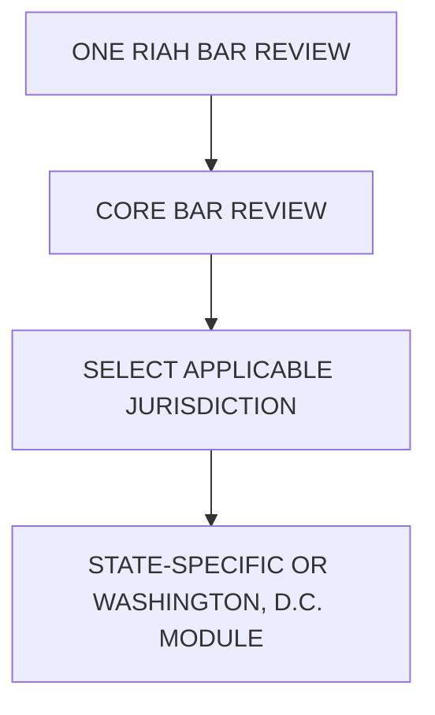
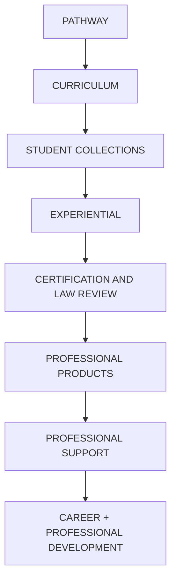
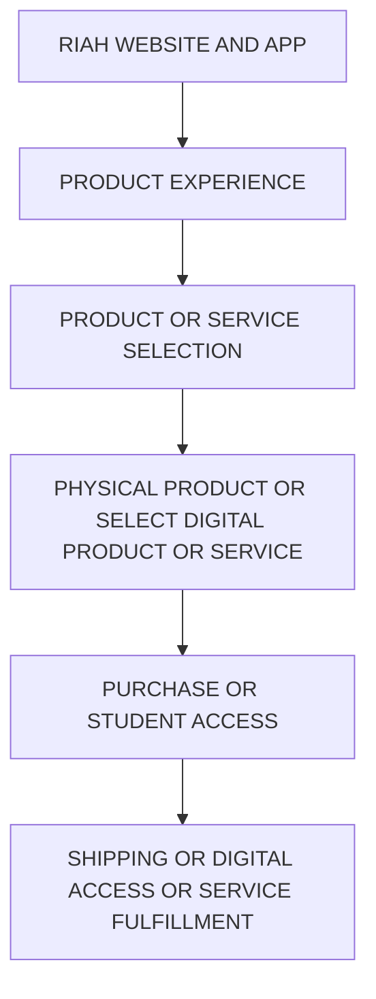

# RIAH PATHWAY — 07 PRODUCTS
## WEBSITE WIREFRAME

**Page:** 07 Products
**Page Type:** Primary Website Page
**Breadcrumb:** Home → Products
**Institutional Slogan:** **ONE DYNASTY. INFINITE LEGACIES.**
**Institutional Colors:** Black • Red • Gold • White • Silver
**Institutional Symbol:** Crown
**Institutional Mascot:** Goat

---

# HEADER — GLOBAL

[LOGO PLACEHOLDER — RIAH PATHWAY]

**ONE DYNASTY. INFINITE LEGACIES.**

## PRIMARY NAVIGATION

[INTERNAL LINK — 01 HOME]
[INTERNAL LINK — 02 ABOUT]
[INTERNAL LINK — 03 PATHWAY]
[INTERNAL LINK — 04 CURRICULUM]
[INTERNAL LINK — 05 ADMISSIONS]
[INTERNAL LINK — 06 TUITION]
[INTERNAL LINK — 07 PRODUCTS]
[INTERNAL LINK — 08 DONATIONS]
[INTERNAL LINK — 09 ACCREDITATION & AUTHORIZATION]
[INTERNAL LINK — 10 JOIN US]
[INTERNAL LINK — 11 RESOURCES]
[INTERNAL LINK — 12 FAQ]
[INTERNAL LINK — PAGE NUMBER TBD CONTACT]

**ACTIVE PAGE:** 07 Products

**[BUTTON — APPLY NOW → EXTERNAL CLASSE365]**

---

# PRODUCTS SUBPAGE NAVIGATION

[SECTION BACKGROUND — WHITE AND LIGHT SILVER]

[ICON PLACEHOLDER — GRID AND PRODUCT DIRECTORY]

## Explore Products

### 07.1 — Products & Services

External educational products, Certification Review, California Baby Bar Review, Bar Review, practice products, professional guides, product bundles, professional services, support packages, and monthly professional support.

**[BUTTON — LEARN MORE: PRODUCTS & SERVICES → 07 PRODUCTS → 07.1 PRODUCTS & SERVICES]**

### 07.2 — Curriculum & Pathway Mapping

Internal student collections, curriculum products, degree mapping, school mapping, major mapping, graduate collections, capstone collections, experiential collections, certification mapping, law review mapping, and pathway integration.

**[BUTTON — LEARN MORE: STUDENT COLLECTIONS & MAPPING → 07 PRODUCTS → 07.2 CURRICULUM & PATHWAY MAPPING]**

### 07.3 — Pricing, Inquiry & Resources

Complete external product and service pricing, Certification Review and Bar Review pricing, availability, product inquiry, purchasing and waitlist information, and Products + Services resources.

**[BUTTON — LEARN MORE: PRICING & RESOURCES → 07 PRODUCTS → 07.3 PRICING, INQUIRY & RESOURCES]**

---

# SECTION 01 — HERO

[SECTION BACKGROUND — BLACK, WHITE, AND GOLD ACCENTS]

[ICON PLACEHOLDER — SHOPPING BAG AND BOOK PRODUCTS]

# PRODUCTS + SERVICES

## RESOURCES THAT MOVE WITH YOUR PATHWAY.

RIAH Pathway connects print-based educational products, select digital resources, professional resources, Certification Review, California Baby Bar Review, Bar Review, practice tools, student curriculum collections, and professional support services across one integrated ecosystem.

External customers can explore applicable products, review programs, professional resources, and support services.

RIAH students can also see the internal collections that accompany applicable academic, experiential, certification, law, and professional-development pathways.

### PRODUCT FORMAT

RIAH Pathway is primarily a **physical, print-based product ecosystem**.

The majority of applicable textbooks, workbooks, study guides, review guides, solution guides, flashcards, planners, journals, professional guides, manuals, and other applicable educational products are produced as physical products and shipped to the applicable customer or student.

Only select products and resources are offered as complete digital products.

For applicable physical products, RIAH may provide the **first chapter, first few pages, preview pages, or another limited digital preview** so the student or customer can review the product before receiving or purchasing the complete physical product.

Unless specifically identified as a digital product, the complete product should not be assumed to be digitally distributed.

### HERO ACTIONS

**[BUTTON — SHOP NOW: PRODUCTS & SERVICES → EXTERNAL SHOPIFY]**

**[BUTTON — LEARN MORE: STUDENT COLLECTIONS → 07 PRODUCTS → 07.2 CURRICULUM & PATHWAY MAPPING]**

**[BUTTON — LEARN MORE: PRICING & RESOURCES → 07 PRODUCTS → 07.3 PRICING, INQUIRY & RESOURCES]**

**[BUTTON — GET STARTED: PRODUCT & SERVICE INQUIRY → EXTERNAL JOTFORM]**

## HERO MEDIA

**[VIDEO PLACEHOLDER — HERO VIDEO]**

**Purpose:**
Introduce the RIAH Pathway product ecosystem and distinguish externally available products and services from internal student collections.

**Visual Direction:**
RIAH-branded physical textbooks, workbooks, journals, planners, study guides, review guides, flashcards, professional guides, certification preparation materials, law-review materials, shipping packages, select digital resources, and professional support.

Internal student collections should be visually distinguishable from externally purchasable products.

**Content:**

```mermaid
flowchart LR
    N1["Print Products"] --> N2["Select Digital Resources"]
    N2["Select Digital Resources"] --> N3["Certification Review"]
    N3["Certification Review"] --> N4["Bar Review"]
    N4["Bar Review"] --> N5["Practice"]
    N5["Practice"] --> N6["Student Collections"]
    N6["Student Collections"] --> N7["Professional Services"]
    N7["Professional Services"] --> N8["Pathway"]
```

**Controls:**
Play • Pause • Captions • Full Screen

**Poster Image:**
[IMAGE PLACEHOLDER — PRODUCTS + SERVICES HERO VIDEO POSTER]

---

# SECTION 02 — PRODUCT ECOSYSTEM

[SECTION BACKGROUND — WHITE]

[ICON PLACEHOLDER — GRID AND PRODUCT ECOSYSTEM]

## ONE ECOSYSTEM. MULTIPLE RESOURCE TYPES.

RIAH products and services support education, professional preparation, practice, certification, law review, experiential development, and career progression.

### PRODUCT DELIVERY MODEL

**PHYSICAL AND PRINT-BASED — PRIMARY**

The majority of RIAH products are physical print-based products and are shipped to the applicable student or customer.

**DIGITAL — SELECT PRODUCTS ONLY**

Only select products are offered in complete digital format.

**DIGITAL PREVIEW — APPLICABLE PRINT PRODUCTS**

Applicable print products may include a digital preview consisting of the first chapter, first few pages, or another selected preview portion. A digital preview does not mean the complete product is available digitally.

[COMPONENT — SIX-CARD PRODUCT GRID]

### EDUCATIONAL PRODUCTS

[ICON PLACEHOLDER — BOOK AND EDUCATIONAL PRODUCTS]

Externally available educational and professional-learning materials.

**Textbooks • Workbooks • Study Guides • Review Guides • Solution Guides • Flashcards • Planners • Journals**

**Price Range: $9.99–$59.99**

**Primary Format: Physical and Print-Based**

**Select Products: Digital**

**Applicable Physical Products: Limited Digital Preview**

**[BUTTON — SHOP NOW: EDUCATIONAL PRODUCTS → EXTERNAL SHOPIFY]**

### PRACTICE PRODUCTS

[ICON PLACEHOLDER — CHECKLIST AND PRACTICE]

**Practice Exams • Simulated Exams • Question Banks • Practice Tests • Simulation Resources**

**Price Range: $19.99–$149.99**

Applicable practice resources may be physical, digital, or integrated into the applicable review or course environment depending on the product.

**[BUTTON — SHOP NOW: PRACTICE PRODUCTS → EXTERNAL SHOPIFY]**

### PRODUCT BUNDLES

[ICON PLACEHOLDER — PACKAGE AND BUNDLE]

Grouped educational, practice, review, print, select digital, and preparation resources where applicable.

**Price Range: $49.99–$299.99**

**[BUTTON — SHOP NOW: PRODUCT BUNDLES → EXTERNAL SHOPIFY]**

### CERTIFICATION + LAW REVIEW

[ICON PLACEHOLDER — CERTIFICATE AND REVIEW]

Includes:

- Certification Review
- California Baby Bar Review
- Full RIAH Bar Review
- All 50 States + Washington, D.C. jurisdiction modules
- Applicable professional-review resources

**Review Package Pricing: Basic $500 • Standard $1,000 • Premium $1,500**

**[BUTTON — LEARN MORE: REVIEW PROGRAMS → 07 PRODUCTS → 07.1 PRODUCTS & SERVICES]**

### PROFESSIONAL GUIDES + RESOURCES

[ICON PLACEHOLDER — OPEN BOOK AND PROFESSIONAL RESOURCES]

**Professional Guides • Manuals • How-To Guides • Career Guides • Reference Guides • Professional Workbooks • Professional Planners • Professional Journals**

**Primary Format: Physical and Print-Based**

**Select Products: Digital**

**[BUTTON — SHOP NOW: PROFESSIONAL RESOURCES → EXTERNAL SHOPIFY]**

### PROFESSIONAL SUPPORT

[ICON PLACEHOLDER — USERS AND PROFESSIONAL SUPPORT]

#### PEOPLE-DEVELOPED. PEOPLE-DELIVERED. TECHNOLOGY-SUPPORTED.

RIAH external educational products and professional-support services are developed and delivered through qualified people within the applicable disciplines, with technology supporting access, delivery, practice, assessment, scheduling, communication, and the learning environment.

The Founder and CEO establishes and directs the curriculum architecture, product structure, ecosystem alignment, and applicable content direction.

Certification Review courses, Bar Review materials, textbooks, workbooks, review resources, practice resources, and related educational content are developed and reviewed with qualified faculty, PhD-level subject-matter professionals, and professionals within the applicable discipline. Depending on the school and subject, this includes professionals in accounting, business, technology, cybersecurity, homeland security, and other applicable disciplines. Law and Bar Review content and support incorporate qualified legal professionals, including attorneys and judges where applicable.

Live mentorship, coaching, academic advisement, study support, and live review may be delivered by RIAH faculty, adjunct faculty, experiential professionals, and contracted external professionals matched to the applicable discipline. Contracted professionals supplement the RIAH ecosystem and extend service capacity beyond the 173-person at-scale internal team structure.

Applicable Certification Review and Bar Review package services are matched to qualified professionals within the relevant discipline so live support is provided by people and is not replaced by technology.

RIAH educational, Certification Review, Bar Review, textbook, workbook, practice, and related product content is revised quarterly to remain aligned with applicable industry standards, professional expectations, review structures, and approved RIAH curriculum and product standards.

**Advisement • Study Support • Mentorship • Coaching • Live Review • Applicable Professional Supervision • Professional Development**

**Price Range: $29.99–$79.99 per session**

**[BUTTON — LEARN MORE: PROFESSIONAL SERVICES → 07 PRODUCTS → 07.1 PRODUCTS & SERVICES]**

---

# SECTION 03 — CERTIFICATION + LAW REVIEW

[SECTION BACKGROUND — LIGHT SILVER]

[ICON PLACEHOLDER — CERTIFICATE AND PROFESSIONAL REVIEW]

## PREPARE FOR THE NEXT PROFESSIONAL MILESTONE.

RIAH review programs combine applicable educational resources, structured review, practice tests, simulations, assessments, preparation resources, and professional support.

RIAH Certification Review is an educational review course. The applicable professional credential remains independently administered by the applicable external certification organization.

# CERTIFICATION REVIEW

RIAH Certification Review offerings are organized by the RIAH school and professional pathway with which the applicable certification is aligned.

## SCHOOL OF BUSINESS — CERTIFICATION REVIEW

[ICON PLACEHOLDER — BRIEFCASE AND BUSINESS]

### ACCOUNTING

- **CPA — Certified Public Accountant**
- **CMA — Certified Management Accountant**
- **CIA — Certified Internal Auditor**
- **CFE — Certified Fraud Examiner**
- **IRS EA — Enrolled Agent**

### FINANCE

- **CFA — Chartered Financial Analyst**
- **CFP — Certified Financial Planner**

**[BUTTON — LEARN MORE: SCHOOL OF BUSINESS CERTIFICATION REVIEW → 07 PRODUCTS → 07.1 PRODUCTS & SERVICES]**

## SCHOOL OF TECHNOLOGY — CERTIFICATION REVIEW

[ICON PLACEHOLDER — TECHNOLOGY AND CYBERSECURITY]

### PROJECT + PROGRAM MANAGEMENT

- **PMP — Project Management Professional**
- **PgMP — Program Management Professional**

### CYBERSECURITY + INFORMATION SYSTEMS

- **CISA — Certified Information Systems Auditor**
- **CISM — Certified Information Security Manager**
- **CISSP — Certified Information Systems Security Professional**

### MICROSOFT AZURE + CLOUD

RIAH Technology pathways may incorporate applicable Microsoft Azure certification preparation and external Microsoft certification training.

The Microsoft pathway should show the applicable foundational, associate-level, and expert-level certifications in progression before the expert credential.

Applicable Microsoft certifications include:

- **Microsoft Certified: Azure Fundamentals**
- **Microsoft Certified: Azure Administrator Associate**
- **Microsoft Certified: Azure Developer Associate**
- **Microsoft Certified: Azure Security Engineer Associate**
- **Microsoft Certified: Azure Network Engineer Associate**
- **Microsoft Certified: Azure Data Fundamentals**
- **Microsoft Certified: Azure AI Fundamentals**
- **Microsoft Certified: Azure AI Engineer Associate**
- **Microsoft Certified: Azure Data Scientist Associate**
- **Microsoft Certified: Azure Data Engineer Associate**
- **Microsoft Certified: DevOps Engineer Expert**
- **Microsoft Certified: Azure Solutions Architect Expert**

Applicable Microsoft technical, cloud, data, AI, software, infrastructure, and cybersecurity certification preparation may be mapped to the appropriate RIAH Technology curriculum.

### HACK THE BOX — RED TEAM

- **CPTS**
- **CWES**
- **CWEE**
- **CAPE**
- **CWPE**
- **COAE**

### HACK THE BOX — BLUE TEAM

- **CDSA**

### HACK THE BOX — PURPLE TEAM

- **CJCA**

**[BUTTON — LEARN MORE: SCHOOL OF TECHNOLOGY CERTIFICATION REVIEW → 07 PRODUCTS → 07.1 PRODUCTS & SERVICES]**

## SCHOOL OF HOMELAND SECURITY — CERTIFICATION REVIEW

[ICON PLACEHOLDER — SHIELD AND HOMELAND SECURITY]

- **CRISC — Certified in Risk and Information Systems Control**
- **CLEA — Certified Law Enforcement Analyst**
- **PSP — Physical Security Professional**
- **PCI — Professional Certified Investigator**

**[BUTTON — LEARN MORE: SCHOOL OF HOMELAND SECURITY CERTIFICATION REVIEW → 07 PRODUCTS → 07.1 PRODUCTS & SERVICES]**

# CERTIFICATION REVIEW PACKAGE COMPARISON

[COMPONENT — THREE-COLUMN PACKAGE COMPARISON]

| Package Feature | Basic — $500 | Standard — $1,000 | Premium — $1,500 |
|:---|:---:|:---:|:---:|
| RIAH Certification Review Course | Included | Included | Included |
| Applicable Certification Sections, Parts, or Modules | Included | Included | Included |
| Applicable Course Material | Included | Included | Included |
| Textbook | — | Included | Included |
| Core Questions and MCQs | Included | Included | Included |
| Core Practice Tests | Included | Included | Included |
| Core Simulations | Included | Included | Included |
| Mini Practice Exams | 2 | 2 + Additional Practice Exams | 2 + Additional Practice Exams + 5 Additional Practice Tests Per Applicable Module |
| Mini Simulated Exams | 2 | 2 + Additional Simulation Practice | 2 + Additional Simulation Practice + 5 Additional Simulations Per Applicable Module |
| Full Simulated Exam | 1 | 1 | 1 |
| Workbook | — | Included | Printed Workbook Included |
| Study Guide | — | Included | Printed Study Guide Included |
| Review Guide | — | Included | Printed Review Guide Included |
| Solution Guide | — | Included | Printed Solution Guide Included |
| Flashcards | — | Included | Printed Flashcards Included |
| Planner | — | Included | Printed Planner Included |
| Journal | — | Included | Printed Journal Included |
| Expanded 250-Question Practice Bank | — | — | Included |
| Timed Testing | Included | Included | Included |
| Grading Review | Included | Included | Included |
| Grading and Scoring | Included | Included | Included |
| Performance Review | Included | Included | Included |
| Complete Printed Product Set | — | — | Included |
| Printed Textbook | — | — | Included |
| 500 Additional Questions Per Applicable Module | — | — | Included |
| Academic and Review Advisement | — | — | Included |
| Study Support | — | — | Included |
| Mentorship | — | — | Included |
| Study Sessions | — | — | 5 |
| Live Review | — | — | Included |
| Live Review Sessions | — | — | 5 |
| Coaching | — | — | Included |
| Coaching Sessions | — | — | 5 |
| Applicable Professional Supervision | — | — | Included Where Applicable |

## BASIC — $500

### CORE REVIEW PACKAGE

Includes:

- RIAH Certification Review Course
- Applicable Certification Sections, Parts, or Modules
- Applicable Course Material
- Core Questions and MCQs
- Core Practice Tests
- Core Simulations
- 2 Mini Practice Exams
- 2 Mini Simulated Exams
- 1 Full Simulated Exam
- Timed Testing
- Grading Review
- Grading and Scoring
- Performance Review

Applicable course materials follow the RIAH product-format structure. Complete products are primarily physical and print-based unless the applicable product is specifically designated for complete digital delivery. Applicable digital previews and select digital resources may accompany the course.

## STANDARD — $1,000

### EXPANDED REVIEW + PRODUCT PACKAGE

Includes everything in Basic plus:

- Textbook
- Workbook
- Study Guide
- Review Guide
- Solution Guide
- Flashcards
- Planner
- Journal
- Additional Practice Exams
- Additional Simulation Practice

Applicable physical products are primarily printed and shipped. Select applicable resources may be provided digitally, and applicable print products may include a limited digital preview.

## PREMIUM — $1,500

### COMPLETE PRODUCT + PRACTICE + PROFESSIONAL SUPPORT PACKAGE

Includes everything in Basic and Standard plus:

### COMPLETE PRINTED PRODUCT SET

- Printed Textbook
- Printed Workbook
- Printed Study Guide
- Printed Review Guide
- Printed Solution Guide
- Printed Flashcards
- Printed Planner
- Printed Journal

### EXPANDED PRACTICE

- Expanded 250-Question Practice Bank
- 500 Additional Questions Per Applicable Module
- 5 Additional Practice Tests Per Applicable Module
- 5 Additional Simulations Per Applicable Module

### PROFESSIONAL SUPPORT

- Academic and Review Advisement
- Study Support
- Mentorship
- 5 Study Sessions
- Live Review
- 5 Live Review Sessions
- Coaching
- 5 Coaching Sessions
- Applicable Professional Supervision Where Applicable

**The Premium package is primarily a physical product package. Printed products are shipped to the applicable customer. Select digital resources, course components, practice resources, simulations, and limited product previews may be provided digitally where applicable.**

**[BUTTON — LEARN MORE: CERTIFICATION REVIEW → 07 PRODUCTS → 07.1 PRODUCTS & SERVICES]**

**[BUTTON — GET STARTED: CERTIFICATION REVIEW INQUIRY → EXTERNAL JOTFORM]**

# BAR REVIEW

RIAH uses **one Full RIAH Bar Review** with jurisdiction-specific modules.

## FULL RIAH BAR REVIEW

The Full RIAH Bar Review supports:

**All 50 States + Washington, D.C.**

Students select the applicable jurisdiction module connected to the state or Washington, D.C. in which they are preparing.

### BAR REVIEW ARCHITECTURE

The Full RIAH Bar Review is not structured as 51 separate complete Bar Review programs.

It is one RIAH Bar Review with applicable jurisdiction-specific modules.

**The first applicable bar-jurisdiction module is included where applicable.**

**Additional jurisdiction module: $250**

# BAR REVIEW PACKAGE COMPARISON

[COMPONENT — THREE-COLUMN PACKAGE COMPARISON]

| Package Feature | Basic Bar Review — $500 | Standard Bar Review — $1,000 | Premium Bar Review — $1,500 |
|:---|:---:|:---:|:---:|
| Full RIAH Bar Review Course | Included | Included | Included |
| Applicable Jurisdiction Module | Included | Included | Included |
| Applicable Course Material | Included | Included | Included |
| Textbook | — | Included | Included |
| Core Questions and MCQs | Included | Included | Included |
| Core Practice Tests | Included | Included | Included |
| Core Simulations | Included | Included | Included |
| Mini Practice Exams | 2 | 2 + Additional Practice Exams | 2 + Additional Practice Exams + 5 Additional Practice Tests Per Applicable Module |
| Mini Simulated Exams | 2 | 2 + Additional Simulation Practice | 2 + Additional Simulation Practice + 5 Additional Simulations Per Applicable Module |
| Full Simulated Exam | 1 | 1 | 1 |
| Workbook | — | Included | Included in Complete Printed Product Set |
| Study Guide | — | Included | Included in Complete Printed Product Set |
| Review Guide | — | Included | Included in Complete Printed Product Set |
| Solution Guide | — | Included | Included in Complete Printed Product Set |
| Flashcards | — | Included | Included in Complete Printed Product Set |
| Planner | — | Included | Included in Complete Printed Product Set |
| Journal | — | Included | Included in Complete Printed Product Set |
| Expanded 250-Question Practice Bank | — | — | Included |
| Timed Testing | Included | Included | Included |
| Grading Review | Included | Included | Included |
| Grading and Scoring | Included | Included | Included |
| Performance Review | Included | Included | Included |
| Complete Printed Product Set | — | — | Included |
| Printed Textbook | — | — | Included |
| 500 Additional Questions Per Applicable Module | — | — | Included |
| Academic and Review Advisement | — | — | Included |
| Study Support | — | — | Included |
| Mentorship | — | — | Included |
| Study Sessions | — | — | 5 |
| Live Review | — | — | Included |
| Live Review Sessions | — | — | 5 |
| Coaching | — | — | Included |
| Coaching Sessions | — | — | 5 |
| Applicable Professional Supervision | — | — | Included Where Applicable |

## BASIC BAR REVIEW — $500

Includes:

- Full RIAH Bar Review Course
- Applicable Jurisdiction Module
- Applicable Course Material
- Core Questions and MCQs
- Core Practice Tests
- Core Simulations
- 2 Mini Practice Exams
- 2 Mini Simulated Exams
- 1 Full Simulated Exam
- Timed Testing
- Grading Review
- Grading and Scoring
- Performance Review

## STANDARD BAR REVIEW — $1,000

Includes everything in Basic plus:

- Textbook
- Workbook
- Study Guide
- Review Guide
- Solution Guide
- Flashcards
- Planner
- Journal
- Additional Practice Exams
- Additional Simulation Practice

## PREMIUM BAR REVIEW — $1,500

Includes everything in Basic and Standard plus:

- Complete Printed Product Set
- Printed Textbook
- Expanded 250-Question Practice Bank
- 500 Additional Questions Per Applicable Module
- 5 Additional Practice Tests Per Applicable Module
- 5 Additional Simulations Per Applicable Module
- Academic and Review Advisement
- Study Support
- Mentorship
- 5 Study Sessions
- Live Review
- 5 Live Review Sessions
- Coaching
- 5 Coaching Sessions
- Applicable Professional Supervision Where Applicable

**Physical review products are primarily printed and shipped. Select digital resources, practice tools, simulations, jurisdiction modules, and limited product previews may be provided digitally where applicable.**

**[BUTTON — LEARN MORE: BAR REVIEW → 07 PRODUCTS → 07.1 PRODUCTS & SERVICES]**

**[BUTTON — GET STARTED: BAR REVIEW INQUIRY → EXTERNAL JOTFORM]**

# CALIFORNIA BABY BAR REVIEW

RIAH also provides a separate:

**California Baby Bar Review**

The California Baby Bar Review supports applicable California law students and external candidates preparing for the applicable examination.

Applicable RIAH law students receive mapped Baby Bar preparation where established within their curriculum.

External students may use the applicable RIAH Baby Bar Review without enrolling in the complete RIAH law curriculum.

## BABY BAR REVIEW PACKAGE PRICING

- **Basic — $500**
- **Standard — $1,000**
- **Premium — $1,500**

The applicable Basic, Standard, and Premium product, practice, simulation, and support architecture follows the RIAH review-package structure above.

**[BUTTON — LEARN MORE: CALIFORNIA BABY BAR REVIEW → 07 PRODUCTS → 07.1 PRODUCTS & SERVICES]**

**[BUTTON — GET STARTED: BABY BAR REVIEW INQUIRY → EXTERNAL JOTFORM]**

# REVIEW ACCESS GUARANTEE

Applicable completed Certification Review, Baby Bar Review, and Bar Review purchases are subject to the established review-access policy.

A qualifying customer who:

- Completes 100% of the applicable review course
- Provides required proof of an unsuccessful applicable examination

may receive:

**3 ADDITIONAL MONTHS OF REVIEW ACCESS**

This is an additional-access guarantee.

**It is not a cash refund.**

---

# SECTION 04 — PROFESSIONAL GUIDES + RESOURCES

[SECTION BACKGROUND — WHITE]

[ICON PLACEHOLDER — BOOKS AND PROFESSIONAL RESOURCES]

## PRACTICAL RESOURCES FOR PROFESSIONAL DEVELOPMENT.

RIAH may offer standalone professional resources for external customers without releasing proprietary internal curriculum collections.

### PRODUCT FORMAT

The majority of RIAH professional guides and resources are physical print-based products.

Only select products are available in complete digital format.

Applicable physical products may provide the first chapter, first few pages, or another limited digital preview.

### PROFESSIONAL RESOURCE TYPES

- Professional Guide — Primary Format: Printed — Select Digital Availability: Select Products
- How-To Guide — Primary Format: Printed — Select Digital Availability: Select Products
- Career Guide — Primary Format: Printed — Select Digital Availability: Select Products
- Reference Guide — Primary Format: Printed — Select Digital Availability: Select Products
- Professional Workbook — Primary Format: Printed — Select Digital Availability: Select Products
- Professional Manual — Primary Format: Printed — Select Digital Availability: Select Products
- Professional Planner — Primary Format: Printed — Select Digital Availability: Select Products
- Professional Journal — Primary Format: Printed — Select Digital Availability: Select Products

### PROFESSIONAL RESOURCE BUNDLES

- Digital Professional Resource Bundle — Select Applicable Digital Products — $129.99
- Printed Professional Resource Bundle — $199.99
- Complete Materials and Professional Resource Bundle — $299.99

### DISCLOSURE

External professional guides and resources are separate from proprietary RIAH curriculum textbooks and internal student collections.

**[BUTTON — SHOP NOW: PROFESSIONAL RESOURCES → EXTERNAL SHOPIFY]**

**[BUTTON — LEARN MORE: COMPLETE PRICING → 07 PRODUCTS → 07.3 PRICING, INQUIRY & RESOURCES]**

---

# SECTION 05 — PROFESSIONAL SERVICES

[SECTION BACKGROUND — BLACK AND GOLD ACCENTS]

[ICON PLACEHOLDER — USERS AND MENTORSHIP + SUPPORT]

## SUPPORT BEYOND THE PRODUCT.

RIAH professional support provides applicable individual, bundled, and ongoing assistance.

### INDIVIDUAL SERVICES

- Academic Advisement — $29.99 per session
- Study Support — $39.99 per session
- Mentorship — $59.99 per session
- Live Review — $69.99 per session
- Coaching — $79.99 per session

Applicable professional supervision may be offered where appropriate based on pathway, professional field, eligibility, and supervision requirements.

### SUPPORT BUNDLES

- Academic Advisement — 3 Sessions — $79.99
- Mentorship — 3 Sessions — $149.99
- Study Support — 5 Sessions — $179.99
- Live Review — 5 Sessions — $299.99
- Coaching — 5 Sessions — $349.99
- Complete Support Bundle — $599.99

### MONTHLY PROFESSIONAL SUPPORT

- Advisement — $29.99 per month
- Study Support — $69.99 per month
- Coaching — $79.99 per month
- Mentorship — $99.99 per month
- Live Review — $129.99 per month
- Mentorship + Coaching — $149.99 per month
- Live Review + Study — $179.99 per month
- Complete Support — $249.99 per month

### DISCLOSURE

Additional products and services are priced separately unless specifically identified as included within the applicable program, product, review level, package, or student pathway.

**[BUTTON — LEARN MORE: PROFESSIONAL SERVICES → 07 PRODUCTS → 07.1 PRODUCTS & SERVICES]**

**[BUTTON — LEARN MORE: SERVICE PRICING → 07 PRODUCTS → 07.3 PRICING, INQUIRY & RESOURCES]**

**[BUTTON — GET STARTED: PROFESSIONAL SERVICE INQUIRY → EXTERNAL JOTFORM]**

---

# SECTION 06 — RIAH STUDENT COLLECTIONS

[SECTION BACKGROUND — WHITE]

[ICON PLACEHOLDER — GRADUATION CAP + BOOK AND STUDENT COLLECTIONS]

## EVERY STAGE HAS ITS OWN COLLECTION.

RIAH students receive or access applicable coordinated collections aligned with their curriculum and progression.

### IMPORTANT

**RIAH Student Collections are internal curriculum resources.**

They may be displayed publicly so prospective and current students can understand what accompanies the RIAH student experience.

**They are not standalone external retail collections.**

### STUDENT PRODUCT FORMAT

RIAH student products are primarily **physical, print-based materials**.

Applicable products are shipped or otherwise distributed physically according to the applicable pathway and fulfillment structure.

Only select student products and resources are provided in complete digital format.

Applicable physical products may also provide limited digital access to the first chapter, first few pages, preview materials, or another selected portion.

### EACH APPLICABLE COLLECTION MAY INCLUDE

- Textbooks
- Workbooks
- Journals
- Planners
- Review Guides
- Study Guides
- Flashcards
- Practice Resources
- Applicable Digital Resources

### GENERAL EDUCATION COLLECTION

Supports applicable General Education coursework.

### SCHOOL CORE COLLECTIONS

- School of Business — Business Core Collection
- School of Technology — Technology Core Collection
- School of Law — Law Core Collection
- School of Homeland Security — Homeland Security Core Collection

### YEAR 3 — MAJOR COLLECTIONS

Each individual major receives its own applicable **Year 3 Major Collection**, organized by school and major.

### CERTIFICATION REVIEW COLLECTION

A representative Certification Review Collection may include:

- Certification Textbook or Textbooks
- Workbook
- Journal
- Study Guide
- Review Guide
- Flashcards
- Planner
- LMS Certification Review

### YEAR 4 + CAPSTONE COLLECTIONS

- Bachelor’s and Year 4 Collection
- Bachelor’s Capstone Collection
- Minor Collection
- Minor Capstone Collection
- Master’s Collection
- Master’s Capstone Collection
- MBA Collection
- MBA Capstone Collection

The Year 4, Master’s, and MBA examples each retain their own level-specific Capstone Collection.

### HIGH SCHOOL DIPLOMA COLLECTION

A representative High School Diploma Collection shows the physical and digital learning products associated with the secondary-education pathway.

### GED + HISET COLLECTION

A representative GED + HiSET Preparation Collection shows the applicable preparation products and digital learning environment.

Applicable multidisciplinary and integrated Business, Technology, Homeland Security, Law, and MBA components are incorporated into the appropriate collection.

**[BUTTON — LEARN MORE: STUDENT COLLECTIONS → 07 PRODUCTS → 07.2 CURRICULUM & PATHWAY MAPPING]**

**No Shop Now button.**

**No external retail pricing.**

---

# SECTION 07 — EXPERIENTIAL COLLECTIONS

[SECTION BACKGROUND — LIGHT SILVER]

[ICON PLACEHOLDER — BRIEFCASE AND EXPERIENTIAL EDUCATION]

## COLLECTIONS THAT DEVELOP WITH PROFESSIONAL EXPERIENCE.

RIAH Experiential Education uses internal collections aligned with applicable experiential progression.

### Apprentice Collection
### Intern Collection
### Associate Collection
### Senior Associate Collection
### Manager Collection
### Executive Collection

Applicable experiential collections may contain:

**Experiential Workbook • Professional Journal • Planner • Development Guide • Reflection Materials • Professional Tools • Study and Review Resources • Applicable Digital Resources**

### IMPORTANT

Experiential Collections are part of the RIAH student experience.

**They are not standalone external products.**

**Do not display retail prices.**

**[BUTTON — LEARN MORE: EXPERIENTIAL EDUCATION → 03 PATHWAY → EXPERIENTIAL]**

**[BUTTON — LEARN MORE: EXPERIENTIAL COLLECTION MAPPING → 07 PRODUCTS → 07.2 CURRICULUM & PATHWAY MAPPING]**

---

# SECTION 08 — INTERNAL VS. EXTERNAL

[SECTION BACKGROUND — WHITE]

[ICON PLACEHOLDER — SPLIT ARROWS AND INTERNAL + EXTERNAL]

## TWO PRODUCT EXPERIENCES. ONE RIAH ECOSYSTEM.

### INTERNAL — RIAH STUDENTS

Applicable:

- General Education Collections
- School Core Collections
- Major Collections
- Year 4 Collections
- Capstone Collections
- Minor Collections
- Master’s Collections
- MBA Collections
- Experiential Collections
- Integrated Curriculum Resources
- Applicable Certification Review
- Applicable Baby Bar Review
- Applicable Bar Review
- Applicable Professional Support

**STUDENT AND CURRICULUM USE**

**PRIMARILY PHYSICAL AND PRINT-BASED**

**SELECT DIGITAL PRODUCTS + DIGITAL PREVIEWS**

**NOT EXTERNAL RETAIL COLLECTIONS**

**[BUTTON — LEARN MORE: STUDENT COLLECTIONS → 07 PRODUCTS → 07.2 CURRICULUM & PATHWAY MAPPING]**

### EXTERNAL — PRODUCTS + SERVICES

Applicable:

- Educational Products
- Practice Products
- Product Bundles
- Certification Review
- California Baby Bar Review
- Full RIAH Bar Review
- Professional Guides
- Professional Manuals
- Professional Workbooks
- Professional Resources
- Advisement
- Study Support
- Mentorship
- Live Review
- Coaching
- Applicable Professional Supervision
- Support Bundles
- Monthly Support

**PHYSICAL AND PRINT-BASED PRODUCTS — PRIMARY**

**COMPLETE DIGITAL PRODUCTS — SELECT PRODUCTS ONLY**

**LIMITED DIGITAL PREVIEWS — APPLICABLE PRINT PRODUCTS**

**[BUTTON — SHOP NOW: EXTERNAL PRODUCTS → EXTERNAL SHOPIFY]**

**[BUTTON — LEARN MORE: PRODUCTS & SERVICES → 07 PRODUCTS → 07.1 PRODUCTS & SERVICES]**

---

# SECTION 09 — PRICING PREVIEW

[SECTION BACKGROUND — BLACK, WHITE TEXT, AND GOLD ACCENTS]

[ICON PLACEHOLDER — PRICE TAG AND PRICING]

## FIND THE LEVEL OF SUPPORT YOU NEED.

### CERTIFICATION REVIEW

- **Basic — $500**
- **Standard — $1,000**
- **Premium — $1,500**

### FULL RIAH BAR REVIEW

- **Basic — $500**
- **Standard — $1,000**
- **Premium — $1,500**

**First applicable jurisdiction module included where applicable.**

**Additional jurisdiction module — $250**

### CALIFORNIA BABY BAR REVIEW

- **Basic — $500**
- **Standard — $1,000**
- **Premium — $1,500**

### EDUCATIONAL PRODUCTS

**$9.99–$59.99**

### COMPLETE INDIVIDUAL PRODUCT PRICING

#### EDUCATIONAL MATERIALS

- Textbook — Digital $29.99 — Printed $59.99
- Workbook — Digital $29.99 — Printed $49.99
- Study Guide — Digital $19.99 — Printed $29.99
- Review Guide — Digital $19.99 — Printed $29.99
- Solution Guide — Digital $19.99 — Printed $29.99
- Flashcards — Digital $9.99 — Printed $19.99
- Planner — Digital $19.99 — Printed $29.99
- Journal — Digital $19.99 — Printed $29.99

#### PRACTICE PRODUCTS

- Mini Practice Exam — $19.99
- Mini Simulated Exam — $29.99
- Full Simulated Practice Exam — $49.99
- 500-Question Bank — $29.99
- 5 Additional Practice Tests — $39.99
- 25-Simulation Bank — $149.99

#### PRODUCT BUNDLES

- Workbook Bundle — $49.99
- Study Bundle — $59.99
- Question Bundle — $69.99
- Full Simulation Bundle — $79.99
- Digital Materials Bundle — $129.99
- Mini Exam Bundle — $149.99
- Simulation Bundle — $149.99
- Printed Materials Bundle — $199.99
- Complete Materials Bundle — $299.99

### PRACTICE PRODUCTS

**$19.99–$149.99**

### PRODUCT BUNDLES

**$49.99–$299.99**

### PROFESSIONAL RESOURCES

**$19.99–$299.99**

### PROFESSIONAL SUPPORT

**$29.99–$79.99 per session**

### SUPPORT BUNDLES

**$79.99–$599.99**

### MONTHLY SUPPORT

**$29.99–$249.99 per month**

### INTERNAL STUDENT COLLECTIONS

**Included or allocated according to the applicable student pathway. Not externally retailed as collections.**

**[BUTTON — LEARN MORE: COMPLETE PRICING → 07 PRODUCTS → 07.3 PRICING, INQUIRY & RESOURCES]**

**[BUTTON — SHOP NOW → EXTERNAL SHOPIFY]**

---

# SECTION 10 — PRODUCTS ACROSS THE PATHWAY

[SECTION BACKGROUND — WHITE]

[ICON PLACEHOLDER — PATH AND CONNECTED JOURNEY]

## RESOURCES THAT CONNECT TO THE JOURNEY.

**[INTERNAL LINK — 03 PATHWAY]**

**[INTERNAL LINK — 04 CURRICULUM]**

**[BUTTON — LEARN MORE: PRODUCT & PATHWAY MAPPING → 07 PRODUCTS → 07.2 CURRICULUM & PATHWAY MAPPING]**

---

# SECTION 11 — CONNECTED PRODUCT EXPERIENCE

[SECTION BACKGROUND — LIGHT SILVER]

[ICON PLACEHOLDER — DEVICES AND CONNECTED PRODUCT EXPERIENCE]

## PRODUCTS + SERVICES IN ONE CONNECTED EXPERIENCE.

The RIAH website and future connected RIAH technology experience may allow applicable users to access or explore:

- Physical Products
- Product Shipping and Fulfillment
- Select Digital Products
- Digital Product Previews
- Practice
- Certification Review
- Baby Bar Review
- Bar Review
- Student Resources
- Bundles
- Professional Support
- Applicable Subscriptions
- Purchases
- Product Availability
- Applicable Discounts
- Student Product Allocation

### CONCEPTUAL FLOW

**[BUTTON — SHOP NOW → EXTERNAL SHOPIFY]**

---

# SECTION 12 — PRODUCT + SERVICE INQUIRY

[SECTION BACKGROUND — WHITE]

[ICON PLACEHOLDER — MESSAGE AND INQUIRY]

## QUESTIONS ABOUT A PRODUCT OR SERVICE?

Use one centralized inquiry experience for:

- Product Questions
- Product Format Questions
- Shipping Questions
- Digital Availability
- Service Questions
- Certification Review
- California Baby Bar Review
- Bar Review
- Review Package Questions
- Availability
- Professional Support
- Student Collection Questions
- Institutional and Bulk Inquiries
- Applicable Waitlist Requests
- Other Product and Service Inquiries

### INQUIRY ROUTING OPTIONS

- Product
- Product Format and Digital Availability
- Shipping and Fulfillment
- Service
- Certification Review
- California Baby Bar Review
- Bar Review
- Professional Support
- Student Collection Question
- Institutional and Bulk
- Waitlist
- Other

**[BUTTON — GET STARTED: PRODUCT & SERVICE INQUIRY → EXTERNAL JOTFORM]**

**[INTERNAL LINK — PAGE NUMBER TBD CONTACT]**

---

# SECTION 13 — PRODUCTS + SERVICES CATALOG

[SECTION BACKGROUND — LIGHT SILVER]

[ICON PLACEHOLDER — DOCUMENT AND PRODUCT CATALOG]

## PRODUCTS + SERVICES CATALOG

Provide one primary Products + Services Catalog containing applicable:

- External Products
- Physical and Print Product Identification
- Select Digital Product Identification
- Digital Preview Identification
- Certification Review Organized by School
- School of Business Certifications
- School of Technology Certifications
- Microsoft Azure Certification Progression
- Hack The Box Certifications
- School of Homeland Security Certifications
- Basic, Standard, and Premium Package Comparison
- Certification Review Pricing
- California Baby Bar Review
- Full RIAH Bar Review
- All 50 States + Washington, D.C. Jurisdiction Module Structure
- Additional Jurisdiction Module Pricing
- Professional Resources
- Review Products
- Services
- Pricing
- Packages
- Availability
- Shipping and Fulfillment Information
- Inquiry Information

Internal collections may appear as informational student-resource previews and must be labeled:

**INTERNAL STUDENT COLLECTION — NOT AN EXTERNAL RETAIL PRODUCT**

**[DOWNLOAD — RIAH PATHWAY PRODUCTS + SERVICES CATALOG → FILE PLACEHOLDER]**

**[INTERNAL LINK — 07 PRODUCTS → 07.3 PRICING, INQUIRY & RESOURCES]**

---

# SECTION 14 — FAQ PREVIEW

[SECTION BACKGROUND — WHITE]

[ICON PLACEHOLDER — QUESTION CIRCLE AND FAQ]

## PRODUCTS + SERVICES QUESTIONS

### Are RIAH products digital or physical?

RIAH products are primarily physical, print-based products.

Only select products are offered in complete digital format.

Applicable physical products may include the first chapter, first few pages, or another limited digital preview.

### Does receiving a digital preview mean the complete product is digital?

No. A digital preview may allow the customer or student to review selected content from a physical product. Unless specifically identified as a complete digital product, the full product remains physical and print-based.

### Are physical products shipped?

Yes. Applicable physical products are printed and shipped or otherwise physically distributed according to the applicable product, student pathway, and fulfillment structure.

### Are RIAH student collections available for external purchase?

RIAH academic and experiential collections are internal student resources and are not marketed as standalone external curriculum collections.

### Can someone purchase RIAH products without enrolling as a student?

Applicable external educational products, professional resources, Certification Review, California Baby Bar Review, Bar Review, and professional services may be available without enrollment.

### How are Certification Reviews organized?

Applicable Certification Reviews are organized by **School of Business, School of Technology, and School of Homeland Security**, based on the RIAH pathway with which the applicable certification is aligned.

### What are the Certification Review package levels?

- **Basic — $500**
- **Standard — $1,000**
- **Premium — $1,500**

### What is included in Premium?

Premium combines the Basic and Standard package structures with the complete printed product set, 500 additional questions per applicable module, 5 additional practice tests per applicable module, 5 additional simulations per applicable module, and the complete applicable standalone professional-support layer, including academic and review advisement, study support, mentorship, live review, coaching, applicable professional supervision, 5 Study Sessions, 5 Live Review Sessions, and 5 Coaching Sessions.

### Does RIAH have a separate Bar Review for every state?

No. RIAH uses one Full RIAH Bar Review with jurisdiction-specific modules for **all 50 states plus Washington, D.C.**

### Is a jurisdiction module included?

The first applicable jurisdiction module is included where applicable.

Additional jurisdiction modules are **$250 each**.

### Is California Baby Bar Review separate?

Yes. California Baby Bar Review is a separate review offering for applicable California candidates.

### What happens if someone completes a review course but does not pass the applicable examination?

A qualifying customer who completes 100% of the applicable review and provides required proof of an unsuccessful applicable examination may receive **3 additional months of review access** under the established guarantee. This is additional access rather than a cash refund.

**[BUTTON — LEARN MORE: ALL FAQS → 12 FAQ]**

---

# SECTION 15 — RELATED PRODUCT NAVIGATION

[SECTION BACKGROUND — LIGHT SILVER]

[ICON PLACEHOLDER — SITEMAP AND PRODUCT NAVIGATION]

## CONTINUE EXPLORING PRODUCTS

### 07.1 — PRODUCTS & SERVICES

- External Educational Products
- Physical and Print-Based Products
- Select Digital Products
- Digital Product Previews
- Practice Products
- Product Bundles
- Certification Review
- School of Business Certification Review
- School of Technology Certification Review
- School of Homeland Security Certification Review
- Basic, Standard, and Premium Review Packages
- California Baby Bar Review
- Full RIAH Bar Review
- Professional Guides and Resources
- Individual Professional Services
- Support Bundles
- Monthly Professional Support

**[BUTTON — LEARN MORE: PRODUCTS & SERVICES → 07 PRODUCTS → 07.1 PRODUCTS & SERVICES]**

### 07.2 — CURRICULUM & PATHWAY MAPPING

- General Education Collection
- School Core Collections
- Year 3 Major Collections
- Year 4 Collections
- Minor Collections
- Bachelor’s Capstone Collection
- Master’s Collections
- Master’s Capstone Collection
- MBA Collections
- MBA Capstone Collection
- Experiential Collections
- Certification Mapping
- Law Review Mapping
- Curriculum and Product Mapping
- Degree and Pathway Mapping

**[BUTTON — LEARN MORE: CURRICULUM & PATHWAY MAPPING → 07 PRODUCTS → 07.2 CURRICULUM & PATHWAY MAPPING]**

### 07.3 — PRICING, INQUIRY & RESOURCES

- External Product Pricing
- Certification Review Pricing
- Bar Review Pricing
- Baby Bar Review Pricing
- Service Pricing
- Product Format
- Digital Availability
- Product Shipping
- Product Availability
- Product and Service Inquiry
- Products + Services Catalog
- Applicable Purchasing and Waitlist Information

**[BUTTON — LEARN MORE: PRICING, INQUIRY & RESOURCES → 07 PRODUCTS → 07.3 PRICING, INQUIRY & RESOURCES]**

---

# SECTION 16 — PUBLIC-FACING PRODUCT RESOURCES

[SECTION BACKGROUND — WHITE]

[ICON PLACEHOLDER — EXTERNAL LINK AND PUBLIC RESOURCES]

## PRODUCT ACCESS

**[EXTERNAL LINK — SHOPIFY → RIAH PATHWAY STOREFRONT PUBLIC URL PLACEHOLDER]**

**[EXTERNAL LINK — JOTFORM → PRODUCT & SERVICE INQUIRY PUBLIC URL PLACEHOLDER]**

Where applicable, Shopify may route visitors to approved Amazon, Walmart, Etsy, or other approved marketplace listings.

---

# SECTION 17 — FINAL CTA BAND

[SECTION BACKGROUND — BLACK, GOLD, AND WHITE]

[ICON PLACEHOLDER — CROWN AND RIAH PATHWAY]

## FIND THE RESOURCE THAT FITS YOUR PATHWAY.

Explore physical and select digital products for professional preparation, compare Certification Review and Bar Review packages, understand the collections supporting RIAH students, compare professional services, or connect with RIAH for help identifying the appropriate resource.

**[BUTTON — SHOP NOW → EXTERNAL SHOPIFY]**

**[BUTTON — LEARN MORE: STUDENT COLLECTIONS → 07 PRODUCTS → 07.2 CURRICULUM & PATHWAY MAPPING]**

**[BUTTON — LEARN MORE: PRICING & RESOURCES → 07 PRODUCTS → 07.3 PRICING, INQUIRY & RESOURCES]**

**[BUTTON — GET STARTED: PRODUCT & SERVICE INQUIRY → EXTERNAL JOTFORM]**

---

## COMMUNITY CAPSTONE + PEER REVIEW POINTS AND DISCOUNTS

Community members may sign up to review applicable student capstones, participate in applicable peer review, and provide structured feedback on student work. Qualifying completed reviews earn points that accumulate according to the number of capstone and peer-review activities completed.

| Community Participation | RIAH Structure |
|---|---|
| Capstone Review | Review applicable student capstones and provide structured feedback |
| Peer Review | Participate in applicable peer-review activities |
| Points | Earn points for qualifying completed capstone and peer reviews |
| Accumulation | Points accumulate based on qualifying review participation |
| Product Discounts | Accumulated points may unlock applicable discounts on qualifying RIAH products |
| Certification Review | Applicable discounts may be used toward qualifying Certification Review products |
| Bar Review | Applicable discounts may be used toward qualifying Bar Review products |
| Educational Pathways | Applicable discounts may be used toward qualifying RIAH educational pathways, including the JD pathway and other applicable education pathways |

RIAH faculty and applicable academic personnel retain academic oversight and final evaluation requirements. Community and peer feedback supplements the formal academic review process.

# FOOTER — GLOBAL

## RIAH Pathway

**ONE DYNASTY. INFINITE LEGACIES.**

[LOGO PLACEHOLDER — RIAH PATHWAY]

### Explore

- [INTERNAL LINK — 01 HOME]
- [INTERNAL LINK — 02 ABOUT]
- [INTERNAL LINK — 03 PATHWAY]
- [INTERNAL LINK — 04 CURRICULUM]
- [INTERNAL LINK — 05 ADMISSIONS]
- [INTERNAL LINK — 06 TUITION]
- [INTERNAL LINK — 07 PRODUCTS]
- [INTERNAL LINK — 08 DONATIONS]
- [INTERNAL LINK — 09 ACCREDITATION & AUTHORIZATION]
- [INTERNAL LINK — 10 JOIN US]
- [INTERNAL LINK — 11 RESOURCES]
- [INTERNAL LINK — 12 FAQ]
- [INTERNAL LINK — PAGE NUMBER TBD CONTACT]

### Students

- [INTERNAL LINK — 03 PATHWAY]
- [INTERNAL LINK — 04 CURRICULUM]
- [INTERNAL LINK — 05 ADMISSIONS]
- [INTERNAL LINK — 06 TUITION]
- [INTERNAL LINK — 07 PRODUCTS → 07.2 CURRICULUM & PATHWAY MAPPING]

### Resources

- [INTERNAL LINK — 11 RESOURCES]
- [EXTERNAL LINK — POLICIES → SUITEDASH PUBLIC PAGE PLACEHOLDER]
- [EXTERNAL LINK — DISCLOSURES → SUITEDASH PUBLIC PAGE PLACEHOLDER]
- [EXTERNAL LINK — GUIDELINES → SUITEDASH PUBLIC PAGE PLACEHOLDER]

### Platforms

- [EXTERNAL LINK — SHOPIFY → RIAH PATHWAY STOREFRONT PUBLIC URL PLACEHOLDER]
- [EXTERNAL LINK — JOTFORM → PRODUCT & SERVICE INQUIRY PUBLIC URL PLACEHOLDER]
- [EXTERNAL LINK — CLASSE365 → APPLICATION PUBLIC URL PLACEHOLDER]

### Connect

- [SOCIAL MEDIA ICON LINKS — APPROVED RIAH PATHWAY SOCIAL PLATFORMS]
- [INTERNAL LINK — PAGE NUMBER TBD CONTACT]

**[BUTTON — GET STARTED: INQUIRY → EXTERNAL JOTFORM]**

### Legal

- [EXTERNAL LINK — PRIVACY → SUITEDASH PUBLIC PAGE PLACEHOLDER]
- [EXTERNAL LINK — TERMS → SUITEDASH PUBLIC PAGE PLACEHOLDER]
- [EXTERNAL LINK — ACCESSIBILITY → SUITEDASH PUBLIC PAGE PLACEHOLDER]
- [EXTERNAL LINK — APPLICABLE DISCLOSURES → SUITEDASH PUBLIC PAGE PLACEHOLDER]

---

# BUTTON, LINK & DOWNLOAD ROUTING

1. Apply Now — Classe365 — External — Header
2. Products & Services — 07.1 Products & Services — Internal — Subpage Navigation
3. Student Collections & Mapping — 07.2 Curriculum & Pathway Mapping — Internal — Subpage Navigation
4. Pricing & Resources — 07.3 Pricing, Inquiry & Resources — Internal — Subpage Navigation
5. Shop Now: Products & Services — Shopify — External — Hero
6. Student Collections — 07.2 Curriculum & Pathway Mapping — Internal — Hero
7. Pricing & Resources — 07.3 Pricing, Inquiry & Resources — Internal — Hero
8. Product & Service Inquiry — Jotform — External — Hero
9. Educational Products — Shopify — External — Product Ecosystem
10. Practice Products — Shopify — External — Product Ecosystem
11. Product Bundles — Shopify — External — Product Ecosystem
12. Review Programs — 07.1 Products & Services — Internal — Product Ecosystem
13. School of Business Certification Review — 07.1 Products & Services — Internal — Certification Review
14. School of Technology Certification Review — 07.1 Products & Services — Internal — Certification Review
15. School of Homeland Security Certification Review — 07.1 Products & Services — Internal — Certification Review
16. Certification Review Inquiry — Jotform — External — Certification Review
17. Bar Review — 07.1 Products & Services — Internal — Bar Review
18. Bar Review Inquiry — Jotform — External — Bar Review
19. California Baby Bar Review — 07.1 Products & Services — Internal — Baby Bar Review
20. Baby Bar Review Inquiry — Jotform — External — Baby Bar Review
21. Professional Resources — Shopify — External — Professional Resources
22. Complete Pricing — 07.3 Pricing, Inquiry & Resources — Internal — Professional Resources
23. Professional Services — 07.1 Products & Services — Internal — Professional Services
24. Service Pricing — 07.3 Pricing, Inquiry & Resources — Internal — Professional Services
25. Professional Service Inquiry — Jotform — External — Professional Services
26. Student Collections — 07.2 Curriculum & Pathway Mapping — Internal — Student Collections
27. Experiential Education — 03 Pathway → Experiential — Internal — Experiential Collections
28. Experiential Collection Mapping — 07.2 Curriculum & Pathway Mapping — Internal — Experiential Collections
29. External Products — Shopify — External — Internal vs. External
30. Complete Pricing — 07.3 Pricing, Inquiry & Resources — Internal — Pricing Preview
31. Shop Now — Shopify — External — Pricing Preview
32. Pathway — 03 Pathway — Internal — Products Across Pathway
33. Curriculum — 04 Curriculum — Internal — Products Across Pathway
34. Product & Pathway Mapping — 07.2 Curriculum & Pathway Mapping — Internal — Products Across Pathway
35. Shop Now — Shopify — External — Connected Product Experience
36. Product & Service Inquiry — Jotform — External — Inquiry
37. Contact — Page Number TBD Contact — Internal — Inquiry
38. RIAH Pathway Products + Services Catalog — File Placeholder — Download — Catalog
39. All FAQs — 12 FAQ — Internal — FAQ Preview
40. Products & Services — 07.1 Products & Services — Internal — Related Navigation
41. Curriculum & Pathway Mapping — 07.2 Curriculum & Pathway Mapping — Internal — Related Navigation
42. Pricing, Inquiry & Resources — 07.3 Pricing, Inquiry & Resources — Internal — Related Navigation
43. Shopify — RIAH Pathway Storefront — External — Public Resources
44. Jotform — Product & Service Inquiry — External — Public Resources
45. Shop Now — Shopify — External — Final CTA
46. Student Collections — 07.2 Curriculum & Pathway Mapping — Internal — Final CTA
47. Pricing & Resources — 07.3 Pricing, Inquiry & Resources — Internal — Final CTA
48. Product & Service Inquiry — Jotform — External — Final CTA

---

# MEDIA & ICON ASSET LIST

1. Hero Video — RIAH Products + Services — Primary Products page story — Hero
2. Products + Services Hero Video Poster — Physical products + select digital resources — Hero
3. Grid and Product Directory Icon — Products subpage navigation
4. Shopping Bag + Book Icon — Primary Products identity — Hero
5. Grid and Product Ecosystem Icon — Product category overview
6. Physical Product + Digital Preview Image — Explain print-first product model
7. Book Icon — Educational products
8. Checklist Icon — Practice products
9. Package Icon — Product bundles
10. Certificate Icon — Certification and law review
11. Certification Review by School Image — Business, Technology, and Homeland Security certification architecture
12. Microsoft Azure Certification Progression Image — Azure pathway through Azure Solutions Architect Expert
13. Hack The Box Certification Map — Red, Blue, and Purple Team credentials
14. Certification + Law Review Image — Certification, Baby Bar, and 50 States + D.C. Bar Review architecture
15. Basic, Standard, and Premium Review Products Image — Review package comparison
16. Premium Complete Printed Product Set Image — Printed textbook, workbook, guides, flashcards, planner, and journal
17. Professional Resource Collection Image — External professional resources
18. Professional Support Experience Image — Mentorship, coaching, and support
19. Student Collection Progression Image — Internal academic collection progression
20. Experiential Collection Progression Image — Internal experiential progression
21. Split Arrows Icon — Internal vs. external distinction
22. Price Tag Icon — Product and review pricing
23. Path Icon — Product relationship to pathway
24. Conceptual RIAH Product Dashboard Image — Connected product experience
25. Message Icon — Inquiry
26. Document Icon — Product catalog
27. Question Circle Icon — FAQ
28. Sitemap Icon — Products subpage navigation
29. External Link Icon — Public product resources
30. Crown Icon — Institutional closing element

---

# CTA AUDIT

**CTA families used on this page:**

- Apply Now — Yes
- Learn More — Yes
- Get Started — Yes
- Log In — No
- Shop Now — Yes

**Total CTA Families Used: 4 of 5**

---

# DOWNLOAD AUDIT

**Total Downloads: 1**

**Download:** RIAH Pathway Products + Services Catalog

**Reason Needed:** Provides one retainable standalone catalog containing applicable physical and print products, select digital products, digital-preview rules, Certification Reviews organized by School of Business, School of Technology, and School of Homeland Security, Microsoft Azure and Hack The Box pathways, complete Basic, Standard, and Premium package inclusions, California Baby Bar Review, Full RIAH Bar Review, all 50 states plus Washington, D.C. jurisdiction-module architecture, professional resources, services, pricing, shipping and fulfillment information, availability, and inquiry information.

------------------------------------------------------------------------

<!-- RIAH IMPACT TRANSPARENCY DISTRIBUTION 2026-10-01 -->

# 👑 PRODUCTS CONNECTION TO APPLIED LEARNING

| Product Connection | Role |
|---|---|
| 📚 **Learning Resources** | Support applicable academic and applied-work preparation |
| 💼 **Experiential Resources** | Support applicable real-work and professional preparation |
| 🏅 **Certification and Review Resources** | Support applicable credential and review preparation |
| ⚖️ **Law Resources** | Support applicable legal education, bar review, experiential work, and public-service preparation |

Products remain governed by the controlling Products rules and do not replace the applicable real-work, review, verification, or public-service requirements.

---

# REAL-WORK EXPERIENCE CONNECTION

Applicable RIAH educational and professional resources may support supervised real-work experiences across legal, accounting, business, technology, cybersecurity, Foundation, donation, blockchain, audit, compliance, and reporting environments. Products and review materials support learning and preparation; they do not replace professional supervision, legal authorization, or applicable real-work requirements.
