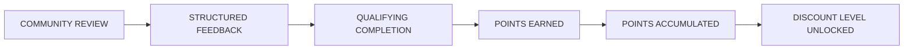
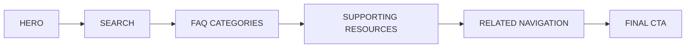
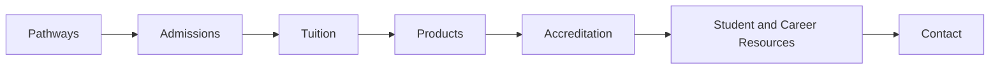

# 👑 RIAH PATHWAY — 12 — FAQ
## WEBSITE WIREFRAME

**Brand:** RIAH Pathway  
**Slogan:** **ONE DYNASTY. INFINITE LEGACIES.**  
**Institutional Colors:** Black • Red • Gold • White • Silver  
**Navigation:** **12 — FAQ**  
**Page Link:** FAQ  
**Page Type:** Frequently Asked Questions and Website Support Directory  
**Primary Purpose:** Provide one searchable, organized FAQ covering RIAH Pathway, pathways, admissions, tuition, donations, products, accreditation, Join Us, resources, and contact while routing visitors to the appropriate approved website page, public resource, application, inquiry form, or download.

---

# PAGE STRUCTURE

## 12 — FAQ

**FAQ Categories**

- About RIAH
- Pathway
- Degree Pathway
- Experiential Pathway
- Certification Pathway
- High School Pathway
- GED and HSE Pathway
- Law Pathway
- Admissions
- Tuition
- Donations
- Products
- Accreditation and Authorization
- Join Us
- Resources
- Contact

---

## COMMUNITY CAPSTONE + PEER REVIEW POINTS AND DISCOUNTS

Community members may sign up to review applicable student capstones, participate in applicable peer review, and provide structured feedback on student work. Qualifying completed reviews earn points that accumulate according to the number of capstone and peer-review activities completed.

| Community Participation | RIAH Structure |
|---|---|
| Capstone Review | Review applicable student capstones and provide structured feedback |
| Peer Review | Participate in applicable peer-review activities |
| Points | Earn points for qualifying completed capstone and peer reviews |
| Accumulation | Points accumulate based on qualifying review participation |
| Product Discounts | Accumulated points may unlock applicable discounts on qualifying RIAH products |
| Certification Review | Applicable discounts may be used toward qualifying Certification Review products |
| Bar Review | Applicable discounts may be used toward qualifying Bar Review products |
| Educational Pathways | Applicable discounts may be used toward qualifying RIAH educational pathways, including the JD pathway and other applicable education pathways |

RIAH faculty and applicable academic personnel retain academic oversight and final evaluation requirements. Community and peer feedback supplements the formal academic review process.

# WIREFRAME STRUCTURE CONTROL

The public FAQ page follows:

# FAQ PAGE FLOW

The FAQ should use searchable and expandable accordion sections so visitors can find answers without creating an excessively long visual page.

Approved FAQ information remains visible as HTML and web text and must not exist only inside images.

---

# WIREFRAME BUILD KEY

**[IMAGE]** = photography or branded institutional visual

**[ICON]** = professional graphic icon

**[VIDEO]** = website video placement

**[BUTTON]** = one of the five approved CTA families

**[INTERNAL LINK]** = approved RIAH Pathway website destination

**[EXTERNAL LINK]** = approved public facing external destination

**[ACCORDION]** = expandable FAQ content

**[SEARCH]** = searchable FAQ component

**[FILTER]** = FAQ category filter

**[DOWNLOAD]** = standalone downloadable document

**[CTA BAND]** = consolidated action area

---

# GLOBAL HEADER

## RIAH PATHWAY LOGO

**ONE DYNASTY. INFINITE LEGACIES.**

[LOGO PLACEHOLDER — RIAH PATHWAY]

### PRIMARY NAVIGATION

**01 — HOME**

**02 — ABOUT**

**03 — PATHWAY**

**04 — CURRICULUM**

**05 — ADMISSIONS**

**06 — TUITION**

**07 — DONATIONS**

**08 — PRODUCTS**

**09 — ACCREDITATION AND AUTHORIZATION**

**10 — JOIN US**

**11 — RESOURCES**

**12 — FAQ — ACTIVE**

**13 — CONTACT**

### HEADER ACTION

**[BUTTON — APPLY NOW → EXTERNAL — CLASSE365]**

**[BUTTON — GET STARTED: REQUEST INFORMATION → EXTERNAL — JOTFORM]**

---

# SECTION 01 — HERO

[SECTION BACKGROUND — BLACK, WHITE, RED AND GOLD ACCENTS]

## FREQUENTLY ASKED QUESTIONS

# EVERYTHING YOU NEED TO KNOW ABOUT RIAH PATHWAY.

Find answers about RIAH Pathway, academic pathways, experiential education, certification preparation, law pathways, admissions, tuition, products, accreditation, student life, careers, joining the RIAH team, resources, and more.

### HERO ACTIONS

**[BUTTON — LEARN MORE: EXPLORE PATHWAYS → 03 — PATHWAY]**

**[BUTTON — GET STARTED: REQUEST INFORMATION → EXTERNAL — JOTFORM]**

**[BUTTON — APPLY NOW → EXTERNAL — CLASSE365]**

### HERO IMAGE

[IMAGE PLACEHOLDER — FAQ — RIAH PATHWAY STUDENT SUPPORT]

**Type:** Institutional and Student Support

**Visual:** Students, professionals, faculty, and support personnel connected through the RIAH Pathway ecosystem.

**Purpose:** Introduce the FAQ as the centralized public information and support page.

**Alt Text:** RIAH Pathway students and professionals accessing education, experience, certification, and career support.

### HERO VIDEO

[VIDEO PLACEHOLDER — FAQ — START HERE WITH RIAH PATHWAY]

**Purpose:** Provide a concise visual orientation explaining where visitors can find information across the RIAH Pathway website.

**Visual Direction:** RIAH Pathway branding with students and professionals progressing through the institutional ecosystem.

**Content:**

Video should introduce the primary FAQ areas:

**Controls:** Play • Pause • Captions • Full Screen

**Poster Image:**  
[IMAGE PLACEHOLDER — FAQ HERO VIDEO POSTER]

---

# SECTION 02 — SEARCH THE FAQ

[SECTION BACKGROUND — WHITE]

[ICON PLACEHOLDER — MAGNIFYING GLASS — SEARCH]

## HOW CAN WE HELP?

[SEARCH PLACEHOLDER — SEARCH FREQUENTLY ASKED QUESTIONS]

### FAQ FILTERS

[FILTER — ABOUT]

[FILTER — PATHWAY]

[FILTER — DEGREE]

[FILTER — EXPERIENTIAL]

[FILTER — CERTIFICATION]

[FILTER — HIGH SCHOOL]

[FILTER — GED AND HSE]

[FILTER — LAW]

[FILTER — ADMISSIONS]

[FILTER — TUITION]

[FILTER — DONATIONS]

[FILTER — PRODUCTS]

[FILTER — ACCREDITATION]

[FILTER — JOIN US]

[FILTER — RESOURCES]

[FILTER — CONTACT]

Filters remain on **12 — FAQ** and filter or jump to the applicable FAQ accordion category.

---

# SECTION 03 — ABOUT RIAH FAQ

[ICON PLACEHOLDER — INSTITUTION — BUILDING]

[ACCORDION — ABOUT RIAH]

### What is RIAH Pathway?

RIAH Pathway is developing an integrated institutional ecosystem connecting education, experience, certification, career development, professional opportunities, companies, partners, and community.

**[BUTTON — LEARN MORE: ABOUT RIAH PATHWAY → 02 — ABOUT]**

### What are RIAH Pathway's mission and vision?

RIAH Pathway's mission, vision, institutional story, and organizational purpose are maintained within the About section.

**[BUTTON — LEARN MORE: MISSION AND VISION → 02 — ABOUT]**

### Why RIAH Pathway?

RIAH Pathway's institutional values are:

**Accessible • Affordable • Elite • Rigorous**

**[BUTTON — LEARN MORE: WHY RIAH → 02 — ABOUT]**

### What is the RIAH Ecosystem?

The RIAH Ecosystem connects:

**Career + Certification + Education + Experience**

with RIAH leadership, companies, external pillars, professional relationships, students, and institutional operations.

**[BUTTON — LEARN MORE: RIAH ECOSYSTEM → 02 — ABOUT]**

### Who leads RIAH Pathway?

RIAH's organizational structure includes academic, executive, and operational leadership.

**[BUTTON — LEARN MORE: LEADERSHIP → 02 — ABOUT]**

### Does RIAH have governing boards?

RIAH's governance structure includes the Corporation Board, Foundation Board, and Institutional Board.

**[BUTTON — LEARN MORE: GOVERNANCE AND BOARDS → 02 — ABOUT]**

### What are RIAH's External Pillars?

RIAH's external professional pillars include CPA, Development, Law, MSSP, and Training relationships.

**[BUTTON — LEARN MORE: EXTERNAL PILLARS → 02 — ABOUT]**

---

# SECTION 04 — PATHWAY FAQ

[ICON PLACEHOLDER — ROADMAP — PATHWAY]

[ACCORDION — PATHWAY]

### What pathways are being developed through RIAH?

RIAH's pathway structure includes:

**Certification Pathway • Degree Pathway • Experiential Pathway • GED and HSE Pathway • High School Pathway • Law Pathway**

The Law Pathway includes J.D., Non-J.D. Bar License, PI and Security Guard, Armed Security, and Criminal Justice pathways.

**[BUTTON — LEARN MORE: EXPLORE ALL PATHWAYS → 03 — PATHWAY]**

### What are RIAH's three academic pathway types?

**Type 1 — Curriculum**

Curriculum based pathway structure.

**Type 2 — Curriculum + Experience**

Includes experiential participation where selected and available, subject to capacity and routing requirements.

**Type 3 — Curriculum + Supervision**

Supervised pathway structure used where applicable, including certain J.D. and Non-J.D. structures.

**[BUTTON — LEARN MORE: PATHWAY TYPES → 03 — PATHWAY]**

---

# SECTION 05 — DEGREE PATHWAY FAQ

[ICON PLACEHOLDER — GRADUATION CAP — DEGREE]

[ACCORDION — DEGREE PATHWAY]

### What degree pathway options are planned?

RIAH's planned degree pathway structure includes:

**Associate's • Bachelor's • MBA • Minor**

**[BUTTON — LEARN MORE: DEGREE PATHWAY → 03 — PATHWAY]**

### What schools are part of the Degree Pathway?

RIAH's planned academic structure includes:

**School of Business**

**School of Homeland Security and GRC**

**School of Law**

**School of Technology**

**[BUTTON — LEARN MORE: SCHOOLS → 03 — PATHWAY]**

### What majors and programs are planned?

Programs span Business, Accounting, Entrepreneurship, Finance, Management, Cybersecurity, GRC, Law, Computer Science, Data Analytics, Data Science, Information Systems, Program Management, Project Management, Software Development, Software Engineering, and additional applicable areas.

**[BUTTON — LEARN MORE: DEGREE PATHWAYS → 03 — PATHWAY]**

### How is the curriculum structured?

The curriculum structure varies by degree level and may include:

**[BUTTON — LEARN MORE: CURRICULUM → 04 — CURRICULUM]**

### Can students accelerate their pathway?

Acceleration depends on the applicable pathway, accepted credits, course progression, assessment requirements, institutional policies, and other applicable requirements.

**[BUTTON — LEARN MORE: CURRICULUM → 04 — CURRICULUM]**

### Does RIAH evaluate transfer and alternative credit?

Applicable prior college credit, alternative credit, and certification equivalencies may be evaluated during pre admissions and academic review.

**[BUTTON — LEARN MORE: ADMISSIONS → 05 — ADMISSIONS]**

---

# SECTION 06 — EXPERIENTIAL PATHWAY FAQ

[ICON PLACEHOLDER — BRIEFCASE — PROFESSIONAL EXPERIENCE]

[ACCORDION — EXPERIENTIAL PATHWAY]

### What is the Experiential Pathway?

The Experiential Pathway provides structured professional experience across applicable Business, Homeland Security, Cybersecurity, GRC, Law, and Technology areas.

**[BUTTON — LEARN MORE: EXPERIENTIAL PATHWAY → 03 — PATHWAY]**

### How long are experiential programs?

Program duration structures include:

**3 Month • 6 Month • 1 Year • 2 Year • Progressive**

### What experience levels are available?

Applicable experience types include:

**Apprentice • Intern • Associate • Senior Associate • Manager**

### Is experiential participation guaranteed?

Experiential opportunities may be subject to selection, available capacity, automated routing, priority, deadlines, and seat allocation.

### Who supervises experiential participants?

The experiential structure may include:

**Supervisors • Managers • Reviewers**

### Where can experiential placement occur?

Professional placement may occur internally through a RIAH segment or rotation or externally through participating employers and partners.

### Can experiential participants receive compensation or funding?

Depending on the applicable opportunity, structures may include hourly compensation, grants, scholarships, stipends, tuition reimbursement, and institutional reinvestment.

**[BUTTON — LEARN MORE: EXPERIENTIAL PATHWAY → 03 — PATHWAY]**

---

# SECTION 07 — CERTIFICATION PATHWAY FAQ

[ICON PLACEHOLDER — CERTIFICATE — CREDENTIAL]

[ACCORDION — CERTIFICATION PATHWAY]

### What is the Certification Pathway?

The Certification Pathway provides structured curriculum and review preparation connected to professional certifications and credentials.

### What certification categories are available?

Certification categories are organized across:

**Business • Homeland Security • Law • Technology**

### What certification program levels are available?

RIAH's current structure organizes certification programs into:

**Standard • Premium • Platinum**

### What practice resources are available?

Practice resources may include:

**Practice Exams • Question Banks • Simulated Exams • Study Bundles**

**[BUTTON — LEARN MORE: CERTIFICATION PATHWAY → 03 — PATHWAY]**

### Can I purchase educational and practice products separately?

Yes. Products and applicable services can be purchased separately from pathway enrollment where available.

**[BUTTON — LEARN MORE: PRODUCTS → 08 — PRODUCTS]**

**[BUTTON — SHOP NOW → EXTERNAL — SHOPIFY]**

---

# SECTION 08 — HIGH SCHOOL PATHWAY FAQ

[ICON PLACEHOLDER — SCHOOL — SECONDARY EDUCATION]

[ACCORDION — HIGH SCHOOL PATHWAY]

### What High School Pathway options are available?

The High School Pathway includes:

**Standard • Dual Enrollment**

### How does Dual Enrollment work?

The planned Dual Enrollment structure connects applicable high school curriculum progression with eligible college credit and future Associate's or Bachelor's progression.

### What are the completion requirements?

Requirements may include applicable high school requirements, applicable RIAH curriculum completion, a capstone or project, and verbal or panel presentation.

**[BUTTON — LEARN MORE: HIGH SCHOOL PATHWAY → 03 — PATHWAY]**

---

# SECTION 09 — GED AND HSE PATHWAY FAQ

[ICON PLACEHOLDER — BOOK — GED AND HSE]

[ACCORDION — GED AND HSE PATHWAY]

### What GED and HSE pathway options are available?

The GED and HSE Pathway includes:

**Standard • Dual Enrollment**

### Can GED and HSE students progress toward college credit?

Applicable Dual Enrollment structures may connect eligible credit with Associate's or Bachelor's progression.

### Is an official GED or HSE credential required for completion?

The pathway's completion structure includes official GED or HSE completion together with applicable RIAH curriculum and exit requirements.

**[BUTTON — LEARN MORE: GED AND HSE PATHWAY → 03 — PATHWAY]**

---

# SECTION 10 — LAW PATHWAY FAQ

[ICON PLACEHOLDER — SCALES — LAW]

[ACCORDION — LAW PATHWAY]

### What Law Pathways are planned?

RIAH's Law Pathway includes:

**J.D. • Non-J.D. Bar License • PI and Security Guard • Armed Security • Criminal Justice**

### What J.D. pathway types are planned?

**Type 1 — Experiential and Capacity Based J.D.**

**Type 2 — Curriculum Based J.D.**

**Type 3 — Supervised Curriculum J.D.**

### What is the Non-J.D. Bar License Pathway?

The Non-J.D. structure is designed around alternative legal study routes available under applicable jurisdictional rules.

Eligibility and licensing requirements are determined by the applicable jurisdiction.

### Which states are included in the Non-J.D. structure?

The current pathway architecture includes:

**California • Maine • New York • Vermont • Virginia • Washington**

### Does completing a RIAH pathway guarantee bar eligibility or admission?

No. Applicable state authorities determine legal study eligibility, examination eligibility, character and fitness requirements, bar admission, and licensure.

### Are supervision and reporting included?

Applicable legal pathways incorporate supervision and reporting structures where required.

### Does RIAH include Bar Review?

Applicable J.D. and Non-J.D. structures include Bar Review preparation within their pathway architecture.

### What are the PI and Security Guard, Armed Security, and Criminal Justice pathways?

These pathways include applicable curriculum, jurisdictional mapping, program or licensing requirements, and required in person components through applicable authorized or licensed partners where required.

**[BUTTON — LEARN MORE: LAW PATHWAY → 03 — PATHWAY]**

**[BUTTON — LEARN MORE: LAW CURRICULUM → 04 — CURRICULUM]**

---

# SECTION 11 — ADMISSIONS FAQ

[ICON PLACEHOLDER — APPLICATION — ADMISSIONS]

[ACCORDION — ADMISSIONS]

### How do I apply to RIAH Pathway?

The student journey moves from inquiry and pre admissions through application, review, acceptance, enrollment, orientation, active student experience, graduation, and alumni engagement.

### What happens during Pre Admissions?

Pre Admissions may include eligibility review, prerequisites, pathway eligibility, transcripts, transfer and alternative credit evaluation, background checks or character and fitness requirements where applicable, international document review, and experiential preparation.

### What is the application process?

### Where do I submit my application?

**[BUTTON — APPLY NOW → EXTERNAL — CLASSE365]**

### Are admissions requirements different by pathway?

Yes. Admissions requirements may differ for Degree, Experiential, GED and HSE, High School Diploma, and Law pathways.

### What happens after I am admitted?

The post admission process can include an admission offer, agreement, enrollment, deposit, cohort or seat confirmation, onboarding, and orientation.

### Is there an orientation?

Yes. The planned onboarding structure includes a one week orientation covering RIAH Pathway, school, pathway or program, cohort, community, experiential requirements where applicable, and student readiness.

### What happens after graduation?

Graduates transition into RIAH's Alumni and Legacy experience, which may include alumni community, professional networking, mentorship, events, career milestones, recognition, and continued opportunities.

**[BUTTON — LEARN MORE: ADMISSIONS → 05 — ADMISSIONS]**

---

# SECTION 12 — TUITION FAQ

[ICON PLACEHOLDER — DOLLAR — TUITION]

[ACCORDION — TUITION]

### Where can I find tuition?

Tuition is organized by pathway, including Degree, Experiential, GED and HSE where applicable, High School, and Law pathways.

**[BUTTON — LEARN MORE: TUITION → 06 — TUITION]**

### Are there additional institutional fees?

Applicable costs may include program and pathway fees, testing and examination fees, transfer credit fees, and other applicable fees.

### What payment options are available?

Applicable structures may include:

**Annual • Monthly • Per Course • Semester • Upfront**

### Can I compare pathway costs?

Yes.

**[BUTTON — LEARN MORE: TUITION AND PRICING → 06 — TUITION]**

---

# SECTION 13 — DONATIONS FAQ

[ICON PLACEHOLDER — HEART — GIVING]

[ACCORDION — DONATIONS]

### Can I donate to RIAH?

Yes. RIAH's Donations section provides information about institutional giving and available donation opportunities.

### Why donate to RIAH?

Donations can support applicable RIAH initiatives and institutional development priorities.

### What ways can I give?

**Corporate and Organization • In Honor and Memory • Monthly • One Time • Specific Initiative**

### Can I direct my donation toward a specific area?

Where available, donors may select applicable donation areas or specific initiatives.

### Where is the RIAH Foundation information?

Foundation information is housed within Donations rather than as a separate top level page.

### Where can I learn about Foundation funding?

Foundation and applicable funding information is maintained through the Donations section.

**[BUTTON — LEARN MORE: DONATIONS AND FOUNDATION → 07 — DONATIONS]**

---

# SECTION 14 — PRODUCTS FAQ

[ICON PLACEHOLDER — SHOPPING BAG — PRODUCTS]

[ACCORDION — PRODUCTS]

### What products does RIAH offer?

RIAH's product ecosystem may include educational materials, practice products, bundles, professional support services, and other applicable products.

### Where can I see product pricing?

**[BUTTON — LEARN MORE: PRODUCTS AND PRICING → 08 — PRODUCTS]**

### Are products included with every pathway?

Not necessarily. Products and services **cost separately** unless specifically identified as included with the selected pathway, package, or program level.

### Can I purchase products without changing my certification level?

Where offered separately, applicable products may be purchased without automatically changing the student's underlying certification program level.

**[BUTTON — SHOP NOW → EXTERNAL — SHOPIFY]**

---

# SECTION 15 — ACCREDITATION AND AUTHORIZATION FAQ

[ICON PLACEHOLDER — INSTITUTION — ACCREDITATION]

[ACCORDION — ACCREDITATION AND AUTHORIZATION]

### Is RIAH Pathway currently accredited?

RIAH Pathway is currently in its **pre accreditation institutional development stage**. Accreditation dependent academic offerings remain subject to applicable accreditation, authorization, approval, and institutional requirements.

### Where can I track RIAH's accreditation information?

Accreditation related information, institutional status, applicable disclosures, and future updates are maintained within the Accreditation and Authorization page.

### Does pre accreditation mean RIAH currently awards accredited degrees?

No. Pre accreditation institutional development should not be interpreted as current institutional or programmatic accreditation or authorization to award an accredited credential.

**[BUTTON — LEARN MORE: ACCREDITATION AND AUTHORIZATION → 09 — ACCREDITATION AND AUTHORIZATION]**

---

# SECTION 16 — JOIN US FAQ

[ICON PLACEHOLDER — USERS — COMMUNITY]

[ACCORDION — JOIN US]

### How can students get involved with RIAH?

Student involvement opportunities are consolidated within Join Us.

### Where can students and alumni find career opportunities?

Career related opportunities for students and alumni are housed within Join Us.

### How can I work with RIAH?

Prospective employees, faculty, supervisors, managers, reviewers, professionals, and other team participants can explore opportunities through Join Us.

### Can employers and professional organizations participate?

Applicable employer, professional, experiential, and partnership opportunities are routed through Join Us.

**[BUTTON — LEARN MORE: JOIN US → 10 — JOIN US]**

---

# SECTION 17 — RESOURCES FAQ

[ICON PLACEHOLDER — LIBRARY — RESOURCES]

[ACCORDION — RESOURCES]

### Where can I find RIAH resources?

RIAH's Resources section serves as the centralized location for applicable guides, documents, student information, institutional resources, and other published materials.

### Where can I find Admissions resources?

Admissions specific materials may include the Admissions and Pre Admissions Guide, Transfer and Alternative Credit Guide, Experiential Pathway Guide, and other applicable resources.

**[BUTTON — LEARN MORE: RESOURCES → 11 — RESOURCES]**

### SELECTED DOWNLOADS

**[DOWNLOAD — ADMISSIONS AND PRE ADMISSIONS GUIDE → FILE PLACEHOLDER]**

**[DOWNLOAD — TRANSFER AND ALTERNATIVE CREDIT GUIDE → FILE PLACEHOLDER]**

**[DOWNLOAD — EXPERIENTIAL PATHWAY GUIDE → FILE PLACEHOLDER]**

---

# SECTION 18 — CONTACT FAQ

[ICON PLACEHOLDER — MESSAGE — CONTACT]

[ACCORDION — CONTACT]

### I still have questions. Who should I contact?

RIAH provides contact routes for questions involving:

**Admissions • Degree Pathway • Experiential Pathway • Certification • GED and HSE • High School • Law • Transfer • International Applicants • Products • Donations • Accreditation • Careers • Partnerships • General Questions**

**[BUTTON — LEARN MORE: CONTACT RIAH → 13 — CONTACT]**

### Where do I request information?

**[BUTTON — GET STARTED: REQUEST INFORMATION → EXTERNAL — JOTFORM]**

### Where do I contact Admissions?

**[BUTTON — GET STARTED: ADMISSIONS INQUIRY → EXTERNAL — JOTFORM]**

### Where do I ask about a Degree Pathway?

**[BUTTON — GET STARTED: DEGREE PATHWAY INQUIRY → EXTERNAL — JOTFORM]**

### Where do I ask about Experiential Education?

**[BUTTON — GET STARTED: EXPERIENTIAL PATHWAY INQUIRY → EXTERNAL — JOTFORM]**

### Where do I ask about Certification?

**[BUTTON — GET STARTED: CERTIFICATION PATHWAY INQUIRY → EXTERNAL — JOTFORM]**

### Where do I ask about a Law Pathway?

**[BUTTON — GET STARTED: LAW PATHWAY INQUIRY → EXTERNAL — JOTFORM]**

### Where do I ask about High School?

**[BUTTON — GET STARTED: HIGH SCHOOL PATHWAY INQUIRY → EXTERNAL — JOTFORM]**

### Where do I ask about GED and HSE?

**[BUTTON — GET STARTED: GED AND HSE PATHWAY INQUIRY → EXTERNAL — JOTFORM]**

## ONE JOTFORM. ONE LINK. DIFFERENT INQUIRY CATEGORIES INSIDE THE FORM.

---

# SECTION 19 — RELATED WEBSITE NAVIGATION

[SECTION BACKGROUND — SILVER AND WHITE]

## CONTINUE EXPLORING RIAH PATHWAY

[ICON PLACEHOLDER — COMPASS — NAVIGATION]

**[INTERNAL LINK — 02 — ABOUT]**

**[INTERNAL LINK — 03 — PATHWAY]**

**[INTERNAL LINK — 04 — CURRICULUM]**

**[INTERNAL LINK — 05 — ADMISSIONS]**

**[INTERNAL LINK — 06 — TUITION]**

**[INTERNAL LINK — 07 — DONATIONS]**

**[INTERNAL LINK — 08 — PRODUCTS]**

**[INTERNAL LINK — 09 — ACCREDITATION AND AUTHORIZATION]**

**[INTERNAL LINK — 10 — JOIN US]**

**[INTERNAL LINK — 11 — RESOURCES]**

**[INTERNAL LINK — 13 — CONTACT]**

---

# SECTION 20 — PUBLIC FACING EXTERNAL RESOURCES

## CONNECT TO THE RIGHT RIAH PLATFORM

Only public facing platforms required by FAQ visitors should appear here.

### APPLICATION

[ICON PLACEHOLDER — APPLICATION — FORM]

**Classe365**

**[EXTERNAL LINK — CLASSE365 APPLICATION → PUBLIC APPLICATION URL PLACEHOLDER]**

### INFORMATION AND INQUIRIES

[ICON PLACEHOLDER — FORM — INQUIRY]

**Jotform**

One Master RIAH Pathway inquiry form with different inquiry categories.

**[EXTERNAL LINK — MASTER RIAH PATHWAY JOTFORM → PUBLIC JOTFORM URL PLACEHOLDER]**

### PRODUCTS

[ICON PLACEHOLDER — SHOPPING BAG — STOREFRONT]

**Shopify**

**[EXTERNAL LINK — RIAH PATHWAY STOREFRONT → PUBLIC SHOPIFY URL PLACEHOLDER]**

### PUBLIC POLICIES AND DISCLOSURES

[ICON PLACEHOLDER — DOCUMENT — POLICY]

Applicable living public policies, disclosures, procedures, guidelines, and institutional documentation should use their approved public SuiteDash destinations rather than unnecessary duplicate PDF downloads.

**[EXTERNAL LINK — RIAH PATHWAY PUBLIC POLICIES → SUITEDASH PUBLIC PAGE PLACEHOLDER]**

**[EXTERNAL LINK — RIAH PATHWAY PUBLIC DISCLOSURES → SUITEDASH PUBLIC PAGE PLACEHOLDER]**

---

# SECTION 21 — FINAL CTA

[CTA BAND — BLACK, RED AND GOLD]

## STILL HAVE QUESTIONS?

Can't find what you're looking for?

Connect directly with RIAH Pathway or begin exploring your pathway.

### FINAL CTA IMAGE

[IMAGE PLACEHOLDER — JOIN THE RIAH PATHWAY NETWORK]

**Type:** Institutional and Community

**Visual:** Students + Alumni + Faculty + Professionals + Employers + Partners + RIAH Team

**Purpose:** Represent the complete RIAH community available to prospective and current students.

**Alt Text:** RIAH Pathway students, alumni, faculty, professionals, employers, partners, and team members.

### FINAL ACTIONS

**[BUTTON — GET STARTED: REQUEST INFORMATION → EXTERNAL — JOTFORM]**

**[BUTTON — LEARN MORE: EXPLORE YOUR PATHWAY → 03 — PATHWAY]**

**[BUTTON — APPLY NOW → EXTERNAL — CLASSE365]**

**[BUTTON — LEARN MORE: JOIN US → 10 — JOIN US]**

**[BUTTON — LEARN MORE: CONTACT RIAH → 13 — CONTACT]**

---

# GLOBAL FOOTER

[FOOTER — GLOBAL]

[LOGO PLACEHOLDER — RIAH PATHWAY]

## RIAH PATHWAY

**ONE DYNASTY. INFINITE LEGACIES.**

### EXPLORE

**[INTERNAL LINK — 01 — HOME]**

**[INTERNAL LINK — 02 — ABOUT]**

**[INTERNAL LINK — 03 — PATHWAY]**

**[INTERNAL LINK — 04 — CURRICULUM]**

**[INTERNAL LINK — 05 — ADMISSIONS]**

**[INTERNAL LINK — 06 — TUITION]**

**[INTERNAL LINK — 07 — DONATIONS]**

**[INTERNAL LINK — 08 — PRODUCTS]**

**[INTERNAL LINK — 09 — ACCREDITATION AND AUTHORIZATION]**

**[INTERNAL LINK — 10 — JOIN US]**

**[INTERNAL LINK — 11 — RESOURCES]**

**[INTERNAL LINK — 12 — FAQ]**

**[INTERNAL LINK — 13 — CONTACT]**

### STUDENTS

**[BUTTON — APPLY NOW → EXTERNAL — CLASSE365]**

**[BUTTON — GET STARTED: REQUEST INFORMATION → EXTERNAL — JOTFORM]**

### RESOURCES

**[INTERNAL LINK — 11 — RESOURCES]**

**[EXTERNAL LINK — PUBLIC POLICIES → SUITEDASH PUBLIC PAGE PLACEHOLDER]**

**[EXTERNAL LINK — PUBLIC DISCLOSURES → SUITEDASH PUBLIC PAGE PLACEHOLDER]**

### PLATFORMS

**[EXTERNAL LINK — CLASSE365 → PUBLIC APPLICATION URL PLACEHOLDER]**

**[EXTERNAL LINK — JOTFORM → MASTER RIAH PATHWAY JOTFORM]**

**[EXTERNAL LINK — SHOPIFY → RIAH PATHWAY STOREFRONT]**

### CONNECT

[SOCIAL MEDIA ICON LINKS — APPROVED RIAH PATHWAY SOCIAL MEDIA]

**[INTERNAL LINK — 13 — CONTACT]**

**[BUTTON — GET STARTED: INQUIRY → EXTERNAL — JOTFORM]**

### LEGAL

**[EXTERNAL LINK — PRIVACY → SUITEDASH PUBLIC PAGE PLACEHOLDER]**

**[EXTERNAL LINK — TERMS → SUITEDASH PUBLIC PAGE PLACEHOLDER]**

**[EXTERNAL LINK — ACCESSIBILITY → SUITEDASH PUBLIC PAGE PLACEHOLDER]**

**[EXTERNAL LINK — APPLICABLE DISCLOSURES → SUITEDASH PUBLIC PAGE PLACEHOLDER]**

---

# 🔗 BUTTON, LINK AND DOWNLOAD ROUTING CHART

The routing chart is intentionally formatted as a numbered Markdown list rather than a table.

01. **Button — Apply Now**  
Destination: Classe365  
Destination Type: External  
Placement: Header

02. **Button — Get Started: Request Information**  
Destination: Master RIAH Pathway Jotform  
Destination Type: External  
Placement: Header

03. **Button — Learn More: Explore Pathways**  
Destination: 03 — Pathway  
Destination Type: Internal  
Placement: Hero

04. **Button — Get Started: Request Information**  
Destination: Master RIAH Pathway Jotform  
Destination Type: External  
Placement: Hero

05. **Button — Apply Now**  
Destination: Classe365  
Destination Type: External  
Placement: Hero

06. **Button — Learn More: About RIAH Pathway**  
Destination: 02 — About  
Destination Type: Internal  
Placement: About FAQ

07. **Button — Learn More: Mission and Vision**  
Destination: 02 — About  
Destination Type: Internal  
Placement: About FAQ

08. **Button — Learn More: Why RIAH**  
Destination: 02 — About  
Destination Type: Internal  
Placement: About FAQ

09. **Button — Learn More: RIAH Ecosystem**  
Destination: 02 — About  
Destination Type: Internal  
Placement: About FAQ

10. **Button — Learn More: Leadership**  
Destination: 02 — About  
Destination Type: Internal  
Placement: About FAQ

11. **Button — Learn More: Governance and Boards**  
Destination: 02 — About  
Destination Type: Internal  
Placement: About FAQ

12. **Button — Learn More: External Pillars**  
Destination: 02 — About  
Destination Type: Internal  
Placement: About FAQ

13. **Button — Learn More: Explore All Pathways**  
Destination: 03 — Pathway  
Destination Type: Internal  
Placement: Pathway FAQ

14. **Button — Learn More: Pathway Types**  
Destination: 03 — Pathway  
Destination Type: Internal  
Placement: Pathway FAQ

15. **Button — Learn More: Degree Pathway**  
Destination: 03 — Pathway  
Destination Type: Internal  
Placement: Degree FAQ

16. **Button — Learn More: Schools**  
Destination: 03 — Pathway  
Destination Type: Internal  
Placement: Degree FAQ

17. **Button — Learn More: Degree Pathways**  
Destination: 03 — Pathway  
Destination Type: Internal  
Placement: Degree FAQ

18. **Button — Learn More: Curriculum**  
Destination: 04 — Curriculum  
Destination Type: Internal  
Placement: Degree FAQ

19. **Button — Learn More: Admissions**  
Destination: 05 — Admissions  
Destination Type: Internal  
Placement: Degree FAQ

20. **Button — Learn More: Experiential Pathway**  
Destination: 03 — Pathway  
Destination Type: Internal  
Placement: Experiential FAQ

21. **Button — Learn More: Certification Pathway**  
Destination: 03 — Pathway  
Destination Type: Internal  
Placement: Certification FAQ

22. **Button — Learn More: Products**  
Destination: 08 — Products  
Destination Type: Internal  
Placement: Certification FAQ

23. **Button — Shop Now**  
Destination: Shopify  
Destination Type: External  
Placement: Certification FAQ

24. **Button — Learn More: High School Pathway**  
Destination: 03 — Pathway  
Destination Type: Internal  
Placement: High School FAQ

25. **Button — Learn More: GED and HSE Pathway**  
Destination: 03 — Pathway  
Destination Type: Internal  
Placement: GED and HSE FAQ

26. **Button — Learn More: Law Pathway**  
Destination: 03 — Pathway  
Destination Type: Internal  
Placement: Law FAQ

27. **Button — Learn More: Law Curriculum**  
Destination: 04 — Curriculum  
Destination Type: Internal  
Placement: Law FAQ

28. **Button — Apply Now**  
Destination: Classe365  
Destination Type: External  
Placement: Admissions FAQ

29. **Button — Learn More: Admissions**  
Destination: 05 — Admissions  
Destination Type: Internal  
Placement: Admissions FAQ

30. **Button — Learn More: Tuition**  
Destination: 06 — Tuition  
Destination Type: Internal  
Placement: Tuition FAQ

31. **Button — Learn More: Tuition and Pricing**  
Destination: 06 — Tuition  
Destination Type: Internal  
Placement: Tuition FAQ

32. **Button — Learn More: Donations and Foundation**  
Destination: 07 — Donations  
Destination Type: Internal  
Placement: Donations FAQ

33. **Button — Learn More: Products and Pricing**  
Destination: 08 — Products  
Destination Type: Internal  
Placement: Products FAQ

34. **Button — Shop Now**  
Destination: Shopify  
Destination Type: External  
Placement: Products FAQ

35. **Button — Learn More: Accreditation and Authorization**  
Destination: 09 — Accreditation and Authorization  
Destination Type: Internal  
Placement: Accreditation FAQ

36. **Button — Learn More: Join Us**  
Destination: 10 — Join Us  
Destination Type: Internal  
Placement: Join Us FAQ

37. **Button — Learn More: Resources**  
Destination: 11 — Resources  
Destination Type: Internal  
Placement: Resources FAQ

38. **Download — Admissions and Pre Admissions Guide**  
Destination: File Placeholder  
Destination Type: Download  
Placement: Resources FAQ

39. **Download — Transfer and Alternative Credit Guide**  
Destination: File Placeholder  
Destination Type: Download  
Placement: Resources FAQ

40. **Download — Experiential Pathway Guide**  
Destination: File Placeholder  
Destination Type: Download  
Placement: Resources FAQ

41. **Button — Learn More: Contact RIAH**  
Destination: 13 — Contact  
Destination Type: Internal  
Placement: Contact FAQ

42. **Button — Get Started: Request Information**  
Destination: Master RIAH Pathway Jotform  
Destination Type: External  
Placement: Contact FAQ

43. **Button — Get Started: Admissions Inquiry**  
Destination: Master RIAH Pathway Jotform  
Destination Type: External  
Placement: Contact FAQ

44. **Button — Get Started: Degree Pathway Inquiry**  
Destination: Master RIAH Pathway Jotform  
Destination Type: External  
Placement: Contact FAQ

45. **Button — Get Started: Experiential Pathway Inquiry**  
Destination: Master RIAH Pathway Jotform  
Destination Type: External  
Placement: Contact FAQ

46. **Button — Get Started: Certification Pathway Inquiry**  
Destination: Master RIAH Pathway Jotform  
Destination Type: External  
Placement: Contact FAQ

47. **Button — Get Started: Law Pathway Inquiry**  
Destination: Master RIAH Pathway Jotform  
Destination Type: External  
Placement: Contact FAQ

48. **Button — Get Started: High School Pathway Inquiry**  
Destination: Master RIAH Pathway Jotform  
Destination Type: External  
Placement: Contact FAQ

49. **Button — Get Started: GED and HSE Pathway Inquiry**  
Destination: Master RIAH Pathway Jotform  
Destination Type: External  
Placement: Contact FAQ

50. **Internal Links — Related Website Navigation**  
Destinations: 02 — About; 03 — Pathway; 04 — Curriculum; 05 — Admissions; 06 — Tuition; 07 — Donations; 08 — Products; 09 — Accreditation and Authorization; 10 — Join Us; 11 — Resources; 13 — Contact  
Destination Type: Internal  
Placement: Related Website Navigation

51. **External Link — Classe365 Application**  
Destination: Public Application URL Placeholder  
Destination Type: External  
Placement: External Resources

52. **External Link — Master RIAH Pathway Jotform**  
Destination: Public Jotform URL Placeholder  
Destination Type: External  
Placement: External Resources

53. **External Link — RIAH Pathway Storefront**  
Destination: Public Shopify URL Placeholder  
Destination Type: External  
Placement: External Resources

54. **External Link — RIAH Pathway Public Policies**  
Destination: SuiteDash Public Page Placeholder  
Destination Type: External  
Placement: External Resources

55. **External Link — RIAH Pathway Public Disclosures**  
Destination: SuiteDash Public Page Placeholder  
Destination Type: External  
Placement: External Resources

56. **Button — Get Started: Request Information**  
Destination: Master RIAH Pathway Jotform  
Destination Type: External  
Placement: Final CTA

57. **Button — Learn More: Explore Your Pathway**  
Destination: 03 — Pathway  
Destination Type: Internal  
Placement: Final CTA

58. **Button — Apply Now**  
Destination: Classe365  
Destination Type: External  
Placement: Final CTA

59. **Button — Learn More: Join Us**  
Destination: 10 — Join Us  
Destination Type: Internal  
Placement: Final CTA

60. **Button — Learn More: Contact RIAH**  
Destination: 13 — Contact  
Destination Type: Internal  
Placement: Final CTA

61. **Internal Links — Global Primary Navigation**  
Destination: Approved 01 through 13 navigation  
Destination Type: Internal  
Placement: Footer

62. **External Link — Public Policies**  
Destination: SuiteDash Public Page Placeholder  
Destination Type: External  
Placement: Footer

63. **External Link — Public Disclosures**  
Destination: SuiteDash Public Page Placeholder  
Destination Type: External  
Placement: Footer

64. **External Link — Classe365**  
Destination: Public Application URL Placeholder  
Destination Type: External  
Placement: Footer

65. **External Link — Jotform**  
Destination: Master RIAH Pathway Jotform  
Destination Type: External  
Placement: Footer

66. **External Link — Shopify**  
Destination: RIAH Pathway Storefront  
Destination Type: External  
Placement: Footer

67. **External Links — Approved Social Media**  
Destination: Approved RIAH Pathway Social Accounts  
Destination Type: External  
Placement: Footer

68. **Internal Link — Contact**  
Destination: 13 — Contact  
Destination Type: Internal  
Placement: Footer

69. **External Link — Privacy**  
Destination: SuiteDash Public Page Placeholder  
Destination Type: External  
Placement: Footer

70. **External Link — Terms**  
Destination: SuiteDash Public Page Placeholder  
Destination Type: External  
Placement: Footer

71. **External Link — Accessibility**  
Destination: SuiteDash Public Page Placeholder  
Destination Type: External  
Placement: Footer

72. **External Link — Applicable Disclosures**  
Destination: SuiteDash Public Page Placeholder  
Destination Type: External  
Placement: Footer

---

# 🖼️ MEDIA AND ICON ASSET CHART

The media asset chart is intentionally formatted as a numbered Markdown list rather than a table.

01. **Video — FAQ — Start Here With RIAH Pathway**  
Purpose: Primary FAQ and website orientation story  
Section: Hero

02. **Image — FAQ — RIAH Pathway Student Support**  
Purpose: Introduce centralized student and visitor support  
Section: Hero

03. **Image — FAQ Hero Video Poster**  
Purpose: Accessible poster for hero video  
Section: Hero

04. **Icon — Magnifying Glass — Search**  
Purpose: Identify FAQ search  
Section: Search

05. **Icon — Institution — Building**  
Purpose: About FAQ  
Section: About

06. **Icon — Roadmap — Pathway**  
Purpose: Pathway FAQ  
Section: Pathway

07. **Icon — Graduation Cap — Degree**  
Purpose: Degree FAQ  
Section: Degree

08. **Icon — Briefcase — Professional Experience**  
Purpose: Experiential FAQ  
Section: Experiential

09. **Icon — Certificate — Credential**  
Purpose: Certification FAQ  
Section: Certification

10. **Icon — School — Secondary Education**  
Purpose: High School FAQ  
Section: High School

11. **Icon — Book — GED and HSE**  
Purpose: GED and HSE FAQ  
Section: GED and HSE

12. **Icon — Scales — Law**  
Purpose: Law FAQ  
Section: Law

13. **Icon — Application — Admissions**  
Purpose: Admissions FAQ  
Section: Admissions

14. **Icon — Dollar — Tuition**  
Purpose: Tuition FAQ  
Section: Tuition

15. **Icon — Heart — Giving**  
Purpose: Donations FAQ  
Section: Donations

16. **Icon — Shopping Bag — Products**  
Purpose: Products FAQ  
Section: Products

17. **Icon — Institution — Accreditation**  
Purpose: Accreditation FAQ  
Section: Accreditation

18. **Icon — Users — Community**  
Purpose: Join Us FAQ  
Section: Join Us

19. **Icon — Library — Resources**  
Purpose: Resources FAQ  
Section: Resources

20. **Icon — Message — Contact**  
Purpose: Contact FAQ  
Section: Contact

21. **Icon — Compass — Navigation**  
Purpose: Related website navigation  
Section: Related Navigation

22. **Icon — Application — Form**  
Purpose: Classe365 application resource  
Section: External Resources

23. **Icon — Form — Inquiry**  
Purpose: Jotform inquiry resource  
Section: External Resources

24. **Icon — Shopping Bag — Storefront**  
Purpose: Shopify storefront resource  
Section: External Resources

25. **Icon — Document — Policy**  
Purpose: Public SuiteDash policies and disclosures  
Section: External Resources

26. **Image — Join the RIAH Pathway Network**  
Purpose: Represent students, alumni, faculty, employers, partners, professionals, and team  
Section: Final CTA

---

# 🔘 CTA AUDIT

**CTA families used on this page:**

- Apply Now — Yes
- Learn More — Yes
- Get Started — Yes
- Log In — No
- Shop Now — Yes

**Total CTA Families Used: 4 of 5**

No additional CTA family is required.

---

# 📥 DOWNLOAD AUDIT

**Total Downloads: 3**

**Download:** Admissions and Pre Admissions Guide  
**Reason Needed:** Standalone admissions reference that applicants can retain while completing the admissions process.

**Download:** Transfer and Alternative Credit Guide  
**Reason Needed:** Standalone reference for applicants evaluating prior, transfer, and alternative credit considerations.

**Download:** Experiential Pathway Guide  
**Reason Needed:** Standalone program guide explaining the Experiential Pathway structure and participation model.

All living policies, procedures, guidelines, disclosures, and institutional documentation remain website or public SuiteDash resources rather than unnecessary duplicate downloads.

------------------------------------------------------------------------

<!-- RIAH IMPACT TRANSPARENCY DISTRIBUTION 2026-10-01 -->

# 👑 IMPACT & TRANSPARENCY FAQ ADDITIONS

| Question | Answer |
|---|---|
| 🔄 **What is the guaranteed one-month major rotation?** | Every applicable student completes four structured one-week real-work rotations directly connected to the student's major. |
| 💼 **Is the guaranteed rotation the same as the Experiential Program?** | No. The selective Experiential Program is a separate application-based pathway from Apprentice through Executive. |
| 👥 **Who reviews applied work and capstones?** | RIAH faculty, experiential staff, employers, industry professionals, and community reviewers participate in the multi-reviewer model, with RIAH retaining academic oversight and final evaluation requirements. |
| 🏅 **How are achievements verified?** | Merit Pages verifies education-pathway completion and displays applicable achievement and experiential badges. Credly verifies experiential-pathway completion and experiential credentials. |
| ⛓️ **Is student tuition placed on the public blockchain ledger?** | No. Individual student tuition and reimbursement information remains private. |
| 💰 **What appears on the public ledger?** | Applicable accreditation donations, designated funds, scholarship funding, aggregate disbursements, applicable escrow activity, allocations, and transaction verification. |
| 🎓 **Can donors create scholarships?** | Qualifying donations may establish or name scholarships subject to applicable policies and requirements. |
| 📊 **Are RIAH's public books available?** | Applicable financial statements and donation, scholarship, accreditation-fund, and escrow reporting can be provided through the transparency model. |
| ⚖️ **Does the School of Law provide record-sealing and expungement assistance?** | RIAH School of Law provides affordable assistance for eligible students and community participants subject to applicable state requirements. |
| 💵 **What is the planned administrative fee?** | No more than $50 where legally permissible. |
| 🔒 **Will clients be identified on the Law impact ledger?** | No. Public reporting uses aggregate counts and generalized matter categories without identifying the individual client. |
| 🏆 **Can participating attorneys be recognized?** | Yes. Applicable attorney profiles may display professional information and aggregate public-service outcomes without identifying clients. |

---

# FAQ — LEGAL CASE NETWORK AND REAL-WORK EXPERIENCE

## Can members of the public submit a legal matter to RIAH?

Yes. The model includes public legal-case intake for routing and evaluation by participating legal professionals. Submission does not guarantee acceptance or representation.

## What types of matters may be submitted?

Applicable matters may include record sealing and expungement, civil disputes, criminal matters, property law, intellectual property, business law, contracts, corporate matters, mergers and acquisitions, and other matters within participating professionals’ practice areas.

## Do students represent clients independently?

No. Applicable JD, Non-JD, Criminal Justice, and related student participation occurs only within the scope legally permitted by the jurisdiction, supervising attorney, court, program rules, and other governing requirements.

## Where does RIAH obtain real-work experiences?

Real work may come from accepted public or partner matters and from RIAH’s internal ecosystem, including legal, accounting, Foundation, donation, blockchain, month-end close, audit, compliance, technology, cybersecurity, governance, and reporting work.
